## 初识Kafka

流式处理平台，可以当作消息队列使用的类似消息队列的平台。在大数据处理中需要对接一些实时流式处理组件，在大数据场景下讲究的主要是低延迟、大并发、高吞吐量。

Kafka基于Zookeeper的分布式消息系统

Kafka具有高吞吐率、高性能、实时及高可靠等流式处理平台特点

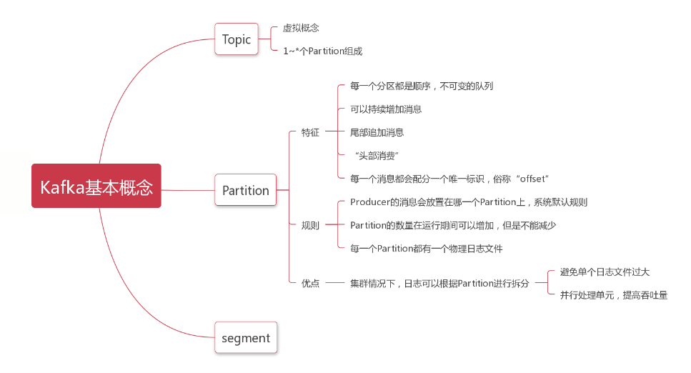

### 环境安装

JDK安装配置

Zookeeper安装配置

Kafka安装配置
- `kafka_2.11-2.4.0/config`目录下
  ```shell
  ➜  config ll
  total 64K
  -rw-r--r-- 1 supreme supreme  906 Dec 10  2019 connect-console-sink.properties
  -rw-r--r-- 1 supreme supreme  909 Dec 10  2019 connect-console-source.properties
  -rw-r--r-- 1 supreme supreme 5.2K Dec 10  2019 connect-distributed.properties
  -rw-r--r-- 1 supreme supreme  883 Dec 10  2019 connect-file-sink.properties
  -rw-r--r-- 1 supreme supreme  881 Dec 10  2019 connect-file-source.properties
  -rw-r--r-- 1 supreme supreme 2.2K Dec 10  2019 connect-log4j.properties
  -rw-r--r-- 1 supreme supreme 1.6K Dec 10  2019 connect-mirror-maker.properties
  -rw-r--r-- 1 supreme supreme 2.3K Dec 10  2019 connect-standalone.properties
  -rw-r--r-- 1 supreme supreme 1.2K Dec 10  2019 consumer.properties
  -rw-r--r-- 1 supreme supreme 4.6K Dec 10  2019 log4j.properties
  -rw-r--r-- 1 supreme supreme 1.9K Dec 10  2019 producer.properties
  -rw-r--r-- 1 supreme supreme 6.7K Dec 10  2019 server.properties
  -rw-r--r-- 1 supreme supreme 1.1K Dec 10  2019 tools-log4j.properties
  -rw-r--r-- 1 supreme supreme 1.2K Dec 10  2019 trogdor.conf
  -rw-r--r-- 1 supreme supreme 1.5K Dec 10  2019 zookeeper.properties
  ```
- 修改`server.properties`配置文件

```properties
############################# Socket Server Settings #############################

# The address the socket server listens on. It will get the value returned from
# java.net.InetAddress.getCanonicalHostName() if not configured.
#   FORMAT:
#     listeners = listener_name://host_name:port
#   EXAMPLE:
#     listeners = PLAINTEXT://your.host.name:9092
listeners=PLAINTEXT://127.0.0.1:9092

# Hostname and port the broker will advertise to producers and consumers. If not set,
# it uses the value for "listeners" if configured.  Otherwise, it will use the value
# returned from java.net.InetAddress.getCanonicalHostName().
advertised.listeners=PLAINTEXT://127.0.0.1:9092

############################# Log Basics #############################
# 日志存放位置通常需要单独指定合适的位置
# A comma separated list of directories under which to store log files
log.dirs=/tmp/kafka-logs

############################# Zookeeper #############################

# Zookeeper connection string (see zookeeper docs for details).
# This is a comma separated host:port pairs, each corresponding to a zk
# server. e.g. "127.0.0.1:3000,127.0.0.1:3001,127.0.0.1:3002".
# You can also append an optional chroot string to the urls to specify the
# root directory for all kafka znodes.
zookeeper.connect=localhost:2181

# Timeout in ms for connecting to zookeeper
zookeeper.connection.timeout.ms=6000
````

- 常用命令
  - 启动Kafka
  ```shell
  bin/kafka-server-start.sh config/server.properties &
  
  # 启动后会打印相关日志
  ➜  kafka_2.11-2.4.0 bin/kafka-server-start.sh config/server.properties &
  [1] 656
  ➜  kafka_2.11-2.4.0 [2020-11-01 16:03:08,751] INFO Registered kafka:type=kafka.Log4jController MBean (kafka.utils.Log4jControllerRegistration$)
  [2020-11-01 16:03:09,234] INFO Registered signal handlers for TERM, INT, HUP (org.apache.kafka.common.utils.LoggingSignalHandler)
  [2020-11-01 16:03:09,235] INFO starting (kafka.server.KafkaServer)
  [2020-11-01 16:03:09,236] INFO Connecting to zookeeper on localhost:2181 (kafka.server.KafkaServer)
  [2020-11-01 16:03:09,262] INFO [ZooKeeperClient Kafka server] Initializing a new session to localhost:2181. (kafka.zookeeper.ZooKeeperClient)
  [2020-11-01 16:03:09,271] INFO Client environment:zookeeper.version=3.5.6-c11b7e26bc554b8523dc929761dd28808913f091, built on 10/08/2019 20:18 GMT (org.apache.zookeeper.ZooKeeper)
  
  # 启动后本地也会生成 log目录
  ➜  kafka_2.11-2.4.0 cd logs
  ➜  logs pwd
  /home/zookeeper/kafka_2.11-2.4.0/logs
  ➜  logs ll
  total 24K
  -rw-rw-rw- 1 supreme supreme 5.1K Nov  1 16:03 controller.log
  -rw-rw-rw- 1 supreme supreme    0 Nov  1 16:03 kafka-authorizer.log
  -rw-rw-rw- 1 supreme supreme    0 Nov  1 16:03 kafka-request.log
  -rw-rw-rw- 1 supreme supreme 5.9K Nov  1 16:03 kafkaServer-gc.log.0.current
  -rw-rw-rw- 1 supreme supreme  172 Nov  1 16:03 log-cleaner.log
  -rw-rw-rw- 1 supreme supreme  31K Nov  1 16:03 server.log     # 启动日志
  -rw-rw-rw- 1 supreme supreme  230 Nov  1 16:03 state-change.log
  ```
  - 停止Kafka
  ```shell
  bin/kafka-server-stop.sh
  ```
  - 创建Topic
  ```shell
  bin/kafka-topics.sh --create --zookeeper localhost:2181 --replication-factor 1 --partitions 1 --topic jiangzh-topic
  ```  
  - 查看已经创建的Topic信息
  ```shell
  bin/kafka-topics.sh --list --zookeeper localhost:2181
  ```
  - 发送消息
  ```shell
  bin/kafka-console-producer.sh --broker-list 192.168.220.128:9092 --topic jiangzh-topic
  ```
  - 接收消息
  ```shell
  bin/kafka-console-consumer.sh --bootstrap-server 192.168.220.128:9092 --topic jiangzh-topic --from-beginning
  ```

### Kafka基本概念

`Topic`一个虚拟的概念可以理解为存放消息的地方，由1到多个`Partitions`组成。
  - 创建Topic 格式
    ```shell
    bin/kafka-topics.sh --create 
        --zookeeper localhost:2181 # 指定 zookeeper地址
        --replication-factor 1 
        --partitions 1 
        --topic quickstart-topic       # 指定 topic名称
        
    ➜  kafka_2.11-2.4.0 bin/kafka-topics.sh --create --zookeeper localhost:2181 --replication-factor 1 --partitions 1 --topic quickstart-topic
    Created topic quickstart-topic.
    [2020-11-01 16:17:50,342] INFO [ReplicaFetcherManager on broker 0] Removed fetcher for partitions Set(quickstart-topic-0) (kafka.server.ReplicaFetcherManager)
    [2020-11-01 16:17:50,428] INFO [Log partition=quickstart-topic-0, dir=/tmp/kafka-logs] Loading producer state till offset 0 with message format version 2 (kafka.log.Log)
    [2020-11-01 16:17:50,439] INFO [Log partition=quickstart-topic-0, dir=/tmp/kafka-logs] Completed load of log with 1 segments, log start offset 0 and log end offset 0 in 66 ms (kafka.log.Log)
    [2020-11-01 16:17:50,444] INFO Created log for partition quickstart-topic-0 in /tmp/kafka-logs/quickstart-topic-0 with properties {compression.type -> producer, message.downconversion.enable -> true, min.insync.replicas -> 1, segment.jitter.ms -> 0, cleanup.policy -> [delete], flush.ms -> 9223372036854775807, segment.bytes -> 1073741824, retention.ms -> 604800000, flush.messages -> 9223372036854775807, message.format.version -> 2.4-IV1, file.delete.delay.ms -> 60000, max.compaction.lag.ms -> 9223372036854775807, max.message.bytes -> 1000012, min.compaction.lag.ms -> 0, message.timestamp.type -> CreateTime, preallocate -> false, min.cleanable.dirty.ratio -> 0.5, index.interval.bytes -> 4096, unclean.leader.election.enable -> false, retention.bytes -> -1, delete.retention.ms -> 86400000, segment.ms -> 604800000, message.timestamp.difference.max.ms -> 9223372036854775807, segment.index.bytes -> 10485760}. (kafka.log.LogManager)
    [2020-11-01 16:17:50,448] INFO [Partition quickstart-topic-0 broker=0] No checkpointed highwatermark is found for partition quickstart-topic-0 (kafka.cluster.Partition)
    [2020-11-01 16:17:50,451] INFO [Partition quickstart-topic-0 broker=0] Log loaded for partition quickstart-topic-0 with initial high watermark 0 (kafka.cluster.Partition)
    [2020-11-01 16:17:50,453] INFO [Partition quickstart-topic-0 broker=0] quickstart-topic-0 starts at Leader Epoch 0 from offset 0. Previous Leader Epoch was: -1 (kafka.cluster.Partition)
    ```
  - 查看已经创建的Topic信息
  ```shell
  bin/kafka-topics.sh --list --zookeeper localhost:2181
  
  ➜  kafka_2.11-2.4.0 bin/kafka-topics.sh --list --zookeeper localhost:2181
  quickstart-topic
  ```

  - 发送消息
  ```shell
  bin/kafka-console-producer.sh --broker-list 127.0.0.1:9092 --topic quickstart-topic
  
  ➜  kafka_2.11-2.4.0 bin/kafka-console-producer.sh --broker-list 127.0.0.1:9092 --topic quickstart-topic
  >helloword  # 执行命令后出现 > 即可输入要发送的消息 这里发送 helloworld
  ```

  - 接收消息
  ```shell
  bin/kafka-console-consumer.sh --bootstrap-server 127.0.0.1:9092 --topic quickstart-topic --from-beginning
  
  ➜  kafka_2.11-2.4.0 bin/kafka-console-consumer.sh --bootstrap-server 127.0.0.1:9092 --topic quickstart-topic --from-beginning
  helloword   # 接收消息
  ```


`Partition`实际消息存储单位

`Producer`消息生产者

`Consumer`消息消费者


### Kafka客户端操作

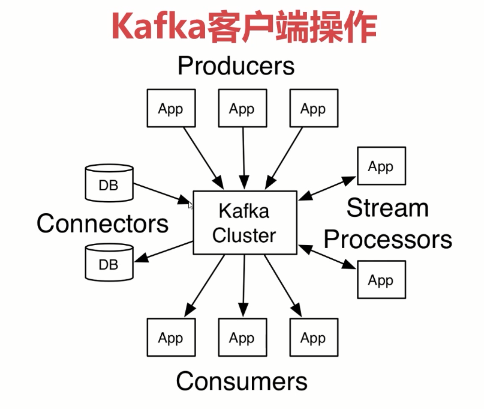

Java客户端

Kafka客户端类型及其区别

Kafka客户端基本操作


Kafka客户端API类型
- `Admin Client API`允许管理和检测Topic、broker以及其它Kafka对象
- `Producer API`发布消息到1个或多个Topic
- `Consumer API`订阅一个或多个Topic，并处理产生的消息
- `Streams API`高效将输入流转换到输出流
- `Connector API`从一些源系统或应用程序中拉取数据到Kafka

#### `Admin Client API`

API文档可以在这里查看`kafka.apache.org/documentation/#adminapi`

API             作用
---------|------------
AdminClient             | AdminClient客户端对象
NewTopic                | 创建Topic
CreateTopicsResult      | 创建Topic返回结果
ListTopicsResult        | 查询Topic列表
ListTopicsOptions       | 查询Topic列表鹡选项
DescribeTopicResult     | 查询Topics
DescribeConfigsResult   | 查询Topics配置项

导包
```xml
<dependency>
    <groupId>org.apache.kafka</groupId>
    <artifactId>kafka-clients</artifactId>
    <version>2.4.0</version>
</dependency>
```

设置AdminClient
```java
package tk.deriwotua.kafka.admin;

import org.apache.kafka.clients.admin.*;
import org.apache.kafka.common.KafkaFuture;
import org.apache.kafka.common.config.ConfigResource;

import java.util.*;

public class AdminSample {

    public final static String TOPIC_NAME="quickstart-topic";
    /**
     * 设置AdminClient
     */
    public static AdminClient adminClient(){
        // 配置地址
        Properties properties = new Properties();
        properties.setProperty(AdminClientConfig.BOOTSTRAP_SERVERS_CONFIG,"127.0.0.1:9092");

        AdminClient adminClient = AdminClient.create(properties);
        return adminClient;
    }

    public static void main(String[] args) throws Exception {
        AdminClient adminClient = AdminSample.adminClient();
        System.out.println("adminClient : "+ adminClient);
    }
}

INFO  (AbstractConfig.java:347)- AdminClientConfig values: 
	bootstrap.servers = [127.0.0.1:9092]
	client.dns.lookup = default
	client.id = 
	connections.max.idle.ms = 300000
	metadata.max.age.ms = 300000
	metric.reporters = []
	metrics.num.samples = 2
	metrics.recording.level = INFO
	metrics.sample.window.ms = 30000
	receive.buffer.bytes = 65536
	reconnect.backoff.max.ms = 1000
	reconnect.backoff.ms = 50
	request.timeout.ms = 120000
	retries = 5
	retry.backoff.ms = 100
	sasl.client.callback.handler.class = null
	sasl.jaas.config = null
	sasl.kerberos.kinit.cmd = /usr/bin/kinit
	sasl.kerberos.min.time.before.relogin = 60000
	sasl.kerberos.service.name = null
	sasl.kerberos.ticket.renew.jitter = 0.05
	sasl.kerberos.ticket.renew.window.factor = 0.8
	sasl.login.callback.handler.class = null
	sasl.login.class = null
	sasl.login.refresh.buffer.seconds = 300
	sasl.login.refresh.min.period.seconds = 60
	sasl.login.refresh.window.factor = 0.8
	sasl.login.refresh.window.jitter = 0.05
	sasl.mechanism = GSSAPI
	security.protocol = PLAINTEXT
	security.providers = null
	send.buffer.bytes = 131072
	ssl.cipher.suites = null
	ssl.enabled.protocols = [TLSv1.2, TLSv1.1, TLSv1]
	ssl.endpoint.identification.algorithm = https
	ssl.key.password = null
	ssl.keymanager.algorithm = SunX509
	ssl.keystore.location = null
	ssl.keystore.password = null
	ssl.keystore.type = JKS
	ssl.protocol = TLS
	ssl.provider = null
	ssl.secure.random.implementation = null
	ssl.trustmanager.algorithm = PKIX
	ssl.truststore.location = null
	ssl.truststore.password = null
	ssl.truststore.type = JKS

INFO  (AppInfoParser.java:117)- Kafka version: 2.4.0
INFO  (AppInfoParser.java:118)- Kafka commitId: 77a89fcf8d7fa018
INFO  (AppInfoParser.java:119)- Kafka startTimeMs: 1604224615261
adminClient : org.apache.kafka.clients.admin.KafkaAdminClient@4b1c1ea0

Process finished with exit code 0
```

创建Topic实例
```java
public class AdminSample {

    public final static String TOPIC_NAME="test-topic";
    /**
     * 设置AdminClient
     */
    public static AdminClient adminClient(){
        // 配置地址
        Properties properties = new Properties();
        properties.setProperty(AdminClientConfig.BOOTSTRAP_SERVERS_CONFIG,"127.0.0.1:9092");

        AdminClient adminClient = AdminClient.create(properties);
        return adminClient;
    }

    public static void main(String[] args) throws Exception {
        // 创建Topic实例
        createTopic();
    }

    /**
     * 创建Topic实例
     */
    public static void createTopic() {
        AdminClient adminClient = adminClient();
        // 副本因子
        Short rs = 1;
        /**
         * 创建指定名称指定Partition个数和副本因子Topic
         */
        NewTopic newTopic = new NewTopic(TOPIC_NAME, 1 , rs);
        // 创建Topic
        CreateTopicsResult topics = adminClient.createTopics(Arrays.asList(newTopic));
        System.out.println("CreateTopicsResult : "+ topics);
    }

}

INFO  (AbstractConfig.java:347)- AdminClientConfig values: 
	bootstrap.servers = [127.0.0.1:9092]
	client.dns.lookup = default
	client.id = 
	connections.max.idle.ms = 300000
	metadata.max.age.ms = 300000
	metric.reporters = []
	metrics.num.samples = 2
	metrics.recording.level = INFO
	metrics.sample.window.ms = 30000
	receive.buffer.bytes = 65536
	reconnect.backoff.max.ms = 1000
	reconnect.backoff.ms = 50
	request.timeout.ms = 120000
	retries = 5
	retry.backoff.ms = 100
	sasl.client.callback.handler.class = null
	sasl.jaas.config = null
	sasl.kerberos.kinit.cmd = /usr/bin/kinit
	sasl.kerberos.min.time.before.relogin = 60000
	sasl.kerberos.service.name = null
	sasl.kerberos.ticket.renew.jitter = 0.05
	sasl.kerberos.ticket.renew.window.factor = 0.8
	sasl.login.callback.handler.class = null
	sasl.login.class = null
	sasl.login.refresh.buffer.seconds = 300
	sasl.login.refresh.min.period.seconds = 60
	sasl.login.refresh.window.factor = 0.8
	sasl.login.refresh.window.jitter = 0.05
	sasl.mechanism = GSSAPI
	security.protocol = PLAINTEXT
	security.providers = null
	send.buffer.bytes = 131072
	ssl.cipher.suites = null
	ssl.enabled.protocols = [TLSv1.2, TLSv1.1, TLSv1]
	ssl.endpoint.identification.algorithm = https
	ssl.key.password = null
	ssl.keymanager.algorithm = SunX509
	ssl.keystore.location = null
	ssl.keystore.password = null
	ssl.keystore.type = JKS
	ssl.protocol = TLS
	ssl.provider = null
	ssl.secure.random.implementation = null
	ssl.trustmanager.algorithm = PKIX
	ssl.truststore.location = null
	ssl.truststore.password = null
	ssl.truststore.type = JKS

INFO  (AppInfoParser.java:117)- Kafka version: 2.4.0
INFO  (AppInfoParser.java:118)- Kafka commitId: 77a89fcf8d7fa018
INFO  (AppInfoParser.java:119)- Kafka startTimeMs: 1604224931430
CreateTopicsResult : org.apache.kafka.clients.admin.CreateTopicsResult@7ce6a65d

Process finished with exit code 0
```

获取Topic列表
```java
public class AdminSample {

    public final static String TOPIC_NAME="test-topic";
    /**
     * 设置AdminClient
     */
    public static AdminClient adminClient(){
        // 配置地址
        Properties properties = new Properties();
        properties.setProperty(AdminClientConfig.BOOTSTRAP_SERVERS_CONFIG,"127.0.0.1:9092");

        AdminClient adminClient = AdminClient.create(properties);
        return adminClient;
    }

    public static void main(String[] args) throws Exception {
        // 获取Topic列表
        topicLists();
    }

    /**
     * 获取Topic列表
     * @throws Exception
     */
    public static void topicLists() throws Exception {
        AdminClient adminClient = adminClient();
        ListTopicsResult listTopicsResult = adminClient.listTopics();
        Set<String> names = listTopicsResult.names().get();
        Collection<TopicListing> topicListings = listTopicsResult.listings().get();
        KafkaFuture<Map<String, TopicListing>> mapKafkaFuture = listTopicsResult.namesToListings();
        // 打印names
        names.stream().forEach(System.out::println);
        // 打印topicListings
        topicListings.stream().forEach((topicList)->{
            System.out.println(topicList);
        });
        System.out.println("------------");
        // 是否查看internal选项
        ListTopicsOptions options = new ListTopicsOptions();
        // 是否携带 Internal 信息 Kafka默认的
        options.listInternal(true);
        ListTopicsResult listTopicsResultWithOption = adminClient.listTopics(options);
        names = listTopicsResult.names().get();
        topicListings = listTopicsResult.listings().get();
        mapKafkaFuture = listTopicsResult.namesToListings();
        // 打印names
        names.stream().forEach(System.out::println);
        // 打印topicListings
        topicListings.stream().forEach((topicList)->{
            System.out.println(topicList);
        });
    }

}

INFO  (AbstractConfig.java:347)- AdminClientConfig values: 
	bootstrap.servers = [127.0.0.1:9092]
	client.dns.lookup = default
	client.id = 
	connections.max.idle.ms = 300000
	metadata.max.age.ms = 300000
	metric.reporters = []
	metrics.num.samples = 2
	metrics.recording.level = INFO
	metrics.sample.window.ms = 30000
	receive.buffer.bytes = 65536
	reconnect.backoff.max.ms = 1000
	reconnect.backoff.ms = 50
	request.timeout.ms = 120000
	retries = 5
	retry.backoff.ms = 100
	sasl.client.callback.handler.class = null
	sasl.jaas.config = null
	sasl.kerberos.kinit.cmd = /usr/bin/kinit
	sasl.kerberos.min.time.before.relogin = 60000
	sasl.kerberos.service.name = null
	sasl.kerberos.ticket.renew.jitter = 0.05
	sasl.kerberos.ticket.renew.window.factor = 0.8
	sasl.login.callback.handler.class = null
	sasl.login.class = null
	sasl.login.refresh.buffer.seconds = 300
	sasl.login.refresh.min.period.seconds = 60
	sasl.login.refresh.window.factor = 0.8
	sasl.login.refresh.window.jitter = 0.05
	sasl.mechanism = GSSAPI
	security.protocol = PLAINTEXT
	security.providers = null
	send.buffer.bytes = 131072
	ssl.cipher.suites = null
	ssl.enabled.protocols = [TLSv1.2, TLSv1.1, TLSv1]
	ssl.endpoint.identification.algorithm = https
	ssl.key.password = null
	ssl.keymanager.algorithm = SunX509
	ssl.keystore.location = null
	ssl.keystore.password = null
	ssl.keystore.type = JKS
	ssl.protocol = TLS
	ssl.provider = null
	ssl.secure.random.implementation = null
	ssl.trustmanager.algorithm = PKIX
	ssl.truststore.location = null
	ssl.truststore.password = null
	ssl.truststore.type = JKS

INFO  (AppInfoParser.java:117)- Kafka version: 2.4.0
INFO  (AppInfoParser.java:118)- Kafka commitId: 77a89fcf8d7fa018
INFO  (AppInfoParser.java:119)- Kafka startTimeMs: 1604225172168
quickstart-topic
(name=quickstart-topic, internal=false)
------------
quickstart-topic
__consumer_offsets                              # kafka默认
(name=quickstart-topic, internal=false)
(name=__consumer_offsets, internal=true)        # kafka默认


Process finished with exit code 0

```

删除Topic
```java
public class AdminSample {

    public final static String TOPIC_NAME="test-topic";
    /**
     * 设置AdminClient
     */
    public static AdminClient adminClient(){
        // 配置地址
        Properties properties = new Properties();
        properties.setProperty(AdminClientConfig.BOOTSTRAP_SERVERS_CONFIG,"127.0.0.1:9092");

        AdminClient adminClient = AdminClient.create(properties);
        return adminClient;
    }

    public static void main(String[] args) throws Exception {
        // 删除Topic实例
        delTopics();
    }

    /**
     * 删除Topic
     * @throws Exception
     */
    public static void delTopics() throws Exception {
        AdminClient adminClient = adminClient();
        DeleteTopicsResult deleteTopicsResult = adminClient.deleteTopics(Arrays.asList(TOPIC_NAME));
        deleteTopicsResult.all().get();
    }

}
```

获取Topic描述信息
```java
public class AdminSample {

    public final static String TOPIC_NAME="test-topic";
    /**
     * 设置AdminClient
     */
    public static AdminClient adminClient(){
        // 配置地址
        Properties properties = new Properties();
        properties.setProperty(AdminClientConfig.BOOTSTRAP_SERVERS_CONFIG,"127.0.0.1:9092");

        AdminClient adminClient = AdminClient.create(properties);
        return adminClient;
    }

    public static void main(String[] args) throws Exception {
        // 获取Topic描述信息
        describeTopics();
    }

    /**
     * 获取Topic描述信息
     *         name ：quickstart-topic ,
     *         desc: (name=quickstart-topic,
     *             internal=false,
     *             partitions=      # Topic数据存放
     *                 (partition=0,
     *                  leader=127.0.0.1:9092   # leader
     *                  (id: 0 rack: null),
     *                  replicas=127.0.0.1:9092 # 副本集
     *                  (id: 0 rack: null),
     *                  isr=127.0.0.1:9092
     *                  (id: 0 rack: null)),
     *                  authorizedOperations=[])
     * @throws Exception
     */
    public static void describeTopics() throws Exception {
        AdminClient adminClient = adminClient();
        DescribeTopicsResult describeTopicsResult = adminClient.describeTopics(Arrays.asList(TOPIC_NAME));
        Map<String, TopicDescription> stringTopicDescriptionMap = describeTopicsResult.all().get();
        Set<Map.Entry<String, TopicDescription>> entries = stringTopicDescriptionMap.entrySet();
        entries.stream().forEach((entry)->{
            System.out.println("name ："+entry.getKey()+" , desc: "+ entry.getValue());
        });
    }

}
```

查看配置信息
```java
public class AdminSample {

    public final static String TOPIC_NAME="test-topic";
    /**
     * 设置AdminClient
     */
    public static AdminClient adminClient(){
        // 配置地址
        Properties properties = new Properties();
        properties.setProperty(AdminClientConfig.BOOTSTRAP_SERVERS_CONFIG,"127.0.0.1:9092");

        AdminClient adminClient = AdminClient.create(properties);
        return adminClient;
    }

    public static void main(String[] args) throws Exception {
        // 查看配置信息
        describeConfig();
    }

    /**
     * 查看TOPIC配置信息
     *     ConfigResource(type=TOPIC, name='quickstart-topic') ,
     *     Config(
     *         entries=[
     *          ConfigEntry(
     *            name=compression.type,
     *            value=producer,
     *            source=DEFAULT_CONFIG,
     *            isSensitive=false,
     *            isReadOnly=false,
     *            synonyms=[]),
     *          ConfigEntry(
     *             name=leader.replication.throttled.replicas,
     *             value=,
     *             source=DEFAULT_CONFIG,
     *             isSensitive=false,
     *             isReadOnly=false,
     *             synonyms=[]), ConfigEntry(name=message.downconversion.enable, value=true, source=DEFAULT_CONFIG, isSensitive=false, isReadOnly=false, synonyms=[]), ConfigEntry(name=min.insync.replicas, value=1, source=DEFAULT_CONFIG, isSensitive=false, isReadOnly=false, synonyms=[]), ConfigEntry(name=segment.jitter.ms, value=0, source=DEFAULT_CONFIG, isSensitive=false, isReadOnly=false, synonyms=[]), ConfigEntry(name=cleanup.policy, value=delete, source=DEFAULT_CONFIG, isSensitive=false, isReadOnly=false, synonyms=[]), ConfigEntry(name=flush.ms, value=9223372036854775807, source=DEFAULT_CONFIG, isSensitive=false, isReadOnly=false, synonyms=[]), ConfigEntry(name=follower.replication.throttled.replicas, value=, source=DEFAULT_CONFIG, isSensitive=false, isReadOnly=false, synonyms=[]), ConfigEntry(name=segment.bytes, value=1073741824, source=STATIC_BROKER_CONFIG, isSensitive=false, isReadOnly=false, synonyms=[]), ConfigEntry(name=retention.ms, value=604800000, source=DEFAULT_CONFIG, isSensitive=false, isReadOnly=false, synonyms=[]), ConfigEntry(name=flush.messages, value=9223372036854775807, source=DEFAULT_CONFIG, isSensitive=false, isReadOnly=false, synonyms=[]), ConfigEntry(name=message.format.version, value=2.4-IV1, source=DEFAULT_CONFIG, isSensitive=false, isReadOnly=false, synonyms=[]), ConfigEntry(name=file.delete.delay.ms, value=60000, source=DEFAULT_CONFIG, isSensitive=false, isReadOnly=false, synonyms=[]), ConfigEntry(name=max.compaction.lag.ms, value=9223372036854775807, source=DEFAULT_CONFIG, isSensitive=false, isReadOnly=false, synonyms=[]), ConfigEntry(name=max.message.bytes, value=1000012, source=DEFAULT_CONFIG, isSensitive=false, isReadOnly=false, synonyms=[]), ConfigEntry(name=min.compaction.lag.ms, value=0, source=DEFAULT_CONFIG, isSensitive=false, isReadOnly=false, synonyms=[]), ConfigEntry(name=message.timestamp.type, value=CreateTime, source=DEFAULT_CONFIG, isSensitive=false, isReadOnly=false, synonyms=[]),
     *          ConfigEntry(name=preallocate, value=false, source=DEFAULT_CONFIG, isSensitive=false, isReadOnly=false, synonyms=[]), ConfigEntry(name=min.cleanable.dirty.ratio, value=0.5, source=DEFAULT_CONFIG, isSensitive=false, isReadOnly=false, synonyms=[]), ConfigEntry(name=index.interval.bytes, value=4096, source=DEFAULT_CONFIG, isSensitive=false, isReadOnly=false, synonyms=[]), ConfigEntry(name=unclean.leader.election.enable, value=false, source=DEFAULT_CONFIG, isSensitive=false, isReadOnly=false, synonyms=[]), ConfigEntry(name=retention.bytes, value=-1, source=DEFAULT_CONFIG, isSensitive=false, isReadOnly=false, synonyms=[]), ConfigEntry(name=delete.retention.ms, value=86400000, source=DEFAULT_CONFIG, isSensitive=false, isReadOnly=false, synonyms=[]), ConfigEntry(name=segment.ms, value=604800000, source=DEFAULT_CONFIG, isSensitive=false, isReadOnly=false, synonyms=[]), ConfigEntry(name=message.timestamp.difference.max.ms, value=9223372036854775807, source=DEFAULT_CONFIG, isSensitive=false, isReadOnly=false, synonyms=[]), ConfigEntry(name=segment.index.bytes, value=10485760, source=DEFAULT_CONFIG, isSensitive=false, isReadOnly=false, synonyms=[])])
     * @throws Exception
     */
    public static void describeConfig() throws Exception{
        AdminClient adminClient = adminClient();
        // TODO 这里做一个预留，集群时会讲到
        //ConfigResource configResource = new ConfigResource(ConfigResource.Type.BROKER, TOPIC_NAME);

        ConfigResource configResource = new ConfigResource(ConfigResource.Type.TOPIC, TOPIC_NAME);
        DescribeConfigsResult describeConfigsResult = adminClient.describeConfigs(Arrays.asList(configResource));
        Map<ConfigResource, Config> configResourceConfigMap = describeConfigsResult.all().get();
        configResourceConfigMap.entrySet().stream().forEach((entry)->{
            System.out.println("configResource : "+entry.getKey()+" , Config : "+entry.getValue());
        });
    }

}
```

修改Config信息
```java
public class AdminSample {

    public final static String TOPIC_NAME="test-topic";
    /**
     * 设置AdminClient
     */
    public static AdminClient adminClient(){
        // 配置地址
        Properties properties = new Properties();
        properties.setProperty(AdminClientConfig.BOOTSTRAP_SERVERS_CONFIG,"127.0.0.1:9092");

        AdminClient adminClient = AdminClient.create(properties);
        return adminClient;
    }

    public static void main(String[] args) throws Exception {
        // 查询Config
        describeConfig();
    }

    /**
     * 修改Config信息
     * @throws Exception
     */
    public static void alterConfig() throws Exception{
        AdminClient adminClient = adminClient();
        /*Map<ConfigResource,Config> configMaps = new HashMap<>();

        // 组织两个参数
        ConfigResource configResource = new ConfigResource(ConfigResource.Type.TOPIC, TOPIC_NAME);
        // 标准key/value
        Config config = new Config(Arrays.asList(new ConfigEntry("preallocate","true")));
        configMaps.put(configResource,config);
        AlterConfigsResult alterConfigsResult = adminClient.alterConfigs(configMaps);*/

        /**
         * 从 2.3以上的版本新修改的API
         */
        Map<ConfigResource,Collection<AlterConfigOp>> configMaps = new HashMap<>();
        // 组织两个参数
        ConfigResource configResource = new ConfigResource(ConfigResource.Type.TOPIC, TOPIC_NAME);
        AlterConfigOp alterConfigOp =
                new AlterConfigOp(new ConfigEntry("preallocate","false"),AlterConfigOp.OpType.SET);
        configMaps.put(configResource,Arrays.asList(alterConfigOp));

        AlterConfigsResult alterConfigsResult = adminClient.incrementalAlterConfigs(configMaps);
        alterConfigsResult.all().get();
    }
}
```

增加partition数量
```java
public class AdminSample {

    public final static String TOPIC_NAME="test-topic";

    /**
     * 设置AdminClient
     */
    public static AdminClient adminClient(){
        // 配置地址
        Properties properties = new Properties();
        properties.setProperty(AdminClientConfig.BOOTSTRAP_SERVERS_CONFIG, "127.0.0.1:9092");

        AdminClient adminClient = AdminClient.create(properties);
        return adminClient;
    }

    public static void main(String[] args) throws Exception {
        // 增加partition数量
        incrPartitions(2);
    }

    /**
     * 增加partition数量
     * @param partitions
     * @throws Exception
     */
    public static void incrPartitions(int partitions) throws Exception{
        AdminClient adminClient = adminClient();
        Map<String, NewPartitions> partitionsMap = new HashMap<>();
        NewPartitions newPartitions = NewPartitions.increaseTo(partitions);
        partitionsMap.put(TOPIC_NAME, newPartitions);

        CreatePartitionsResult createPartitionsResult = adminClient.createPartitions(partitionsMap);
        createPartitionsResult.all().get();
    }
}
```

#### Producer API
> Producer各项配置
> Producer负载均衡等特性

Producer发送模式
- 同步发送
- 异步发送
- 异步回调发送

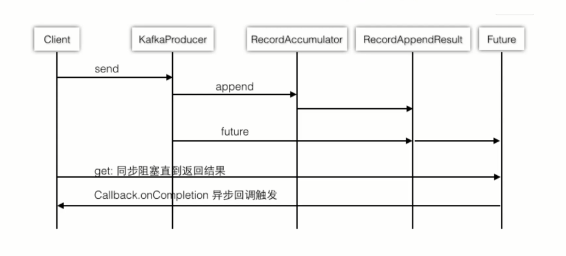

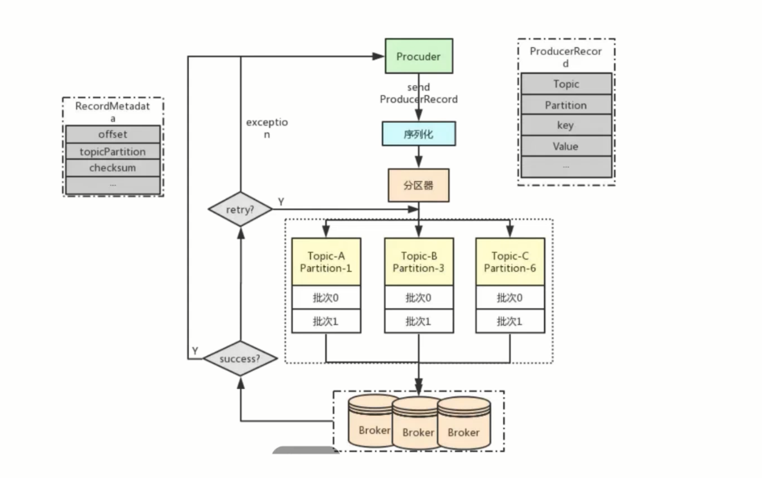

Producer发送流程实际如下几步
- 直接发送
- 负载均衡
- 异步发送

```java
package tk.deriwotua.kafka.producer;

import org.apache.kafka.clients.producer.*;

import java.util.Properties;
import java.util.concurrent.ExecutionException;
import java.util.concurrent.Future;

public class ProducerSample {

    private final static String TOPIC_NAME = "jiangzh-topic";

    public static Properties properties(){
        Properties properties = new Properties();
        // 指定服务节点
        properties.put(ProducerConfig.BOOTSTRAP_SERVERS_CONFIG, "127.0.0.1:9092");
        // 消息保障               
        properties.put(ProducerConfig.ACKS_CONFIG, "all");
        properties.put(ProducerConfig.RETRIES_CONFIG, "0");
        properties.put(ProducerConfig.BATCH_SIZE_CONFIG, "16384");
        properties.put(ProducerConfig.LINGER_MS_CONFIG, "1");
        properties.put(ProducerConfig.BUFFER_MEMORY_CONFIG, "33554432");
        // 序列化
        properties.put(ProducerConfig.KEY_SERIALIZER_CLASS_CONFIG, "org.apache.kafka.common.serialization.StringSerializer");
        properties.put(ProducerConfig.VALUE_SERIALIZER_CLASS_CONFIG, "org.apache.kafka.common.serialization.StringSerializer");
        return properties;
    }

    /**
     * Producer异步发送演示
     */
    public static void producerSend() {
        /**
         * Producer的主对象
         *  MetricConfig
         *  加载负载均衡器
         *  初始化Serializer
         *  初始化RecordAccumulator（类似计数器）
         *  启动newSender守护线程
         * Producer是线程安全的
         * Producer并不是接到一条发一条而是批次批量发送
         */
        Producer<String, String> producer = new KafkaProducer<>(properties());
        // 消息对象 - ProducerRecord
        for (int i = 0; i < 10; i++) {
            ProducerRecord<String, String> record =
                    new ProducerRecord<>(TOPIC_NAME, "key-" + i, "value-" + i);
            /**
             * 发送时会先计算分区消息具体进入哪一个partition
             * 计算批次 accumulator
             * 发送主要干的是创建批次、向批次中追加消息，然后由守护线程发送
             */
            producer.send(record);
        }
        // 所有的通道打开都需要关闭
        producer.close();
    }

    /**
     * Producer异步阻塞发送
     * @throws ExecutionException
     * @throws InterruptedException
     */
    public static void producerSyncSend() throws ExecutionException, InterruptedException {
        // Producer的主对象
        Producer<String, String> producer = new KafkaProducer<>(properties());

        // 消息对象 - ProducerRecord
        for (int i = 0; i < 10; i++) {
            String key = "key-" + i;
            ProducerRecord<String, String> record =
                    new ProducerRecord<>(TOPIC_NAME, key, "value-" + i);

            Future<RecordMetadata> send = producer.send(record);
            RecordMetadata recordMetadata = send.get();
            System.out.println(key + "partition : " + recordMetadata.partition() + " , offset : " + recordMetadata.offset());
        }

        // 所有的通道打开都需要关闭
        producer.close();
    }

    /**
     * Producer异步发送带回调函数
     */
    public static void producerSendWithCallback() {
        // Producer的主对象
        Producer<String, String> producer = new KafkaProducer<>(properties());

        // 消息对象 - ProducerRecord
        for (int i = 0; i < 10; i++) {
            ProducerRecord<String, String> record =
                    new ProducerRecord<>(TOPIC_NAME, "key-" + i, "value-" + i);

            producer.send(record, new Callback() {
                @Override
                public void onCompletion(RecordMetadata recordMetadata, Exception e) {
                    System.out.println(
                            "partition : " + recordMetadata.partition() + " , offset : " + recordMetadata.offset());
                }
            });
        }

        // 所有的通道打开都需要关闭
        producer.close();
    }

    public static void main(String[] args) throws ExecutionException, InterruptedException {
        // Producer异步发送演示
        //producerSend();
        // Producer异步阻塞发送演示
        //producerSyncSend();
        // Producer异步发送带回调函数
        //producerSendWithCallback();
    }
}
```

自定义分区
```java
package tk.deriwotua.kafka.producer;

import org.apache.kafka.clients.producer.Partitioner;
import org.apache.kafka.common.Cluster;

import java.util.Map;

/**
 * 自定义分区
 */
public class SamplePartition implements Partitioner {
    /**
     * 处理什么样的数据进入哪个partition
     * @param topic
     * @param key
     * @param keyBytes
     * @param value
     * @param valueBytes
     * @param cluster
     * @return
     */
    @Override
    public int partition(String topic, Object key, byte[] keyBytes, Object value, byte[] valueBytes, Cluster cluster) {
        /**
         * 业务中key格式
         *      key-1
         *      key-2
         *      key-3
         */
        String keyStr = key + "";
        String keyInt = keyStr.substring(4);
        System.out.println("keyStr : "+keyStr + "keyInt : "+keyInt);

        int i = Integer.parseInt(keyInt);
        // 取余
        return i%2;
    }

    @Override
    public void close() {

    }

    @Override
    public void configure(Map<String, ?> configs) {

    }
}


package tk.deriwotua.kafka.producer;

import org.apache.kafka.clients.producer.*;

import java.util.Properties;
import java.util.concurrent.ExecutionException;
import java.util.concurrent.Future;

public class ProducerSample {

    private final static String TOPIC_NAME = "jiangzh-topic";

    public static Properties properties(){
        Properties properties = new Properties();
        // 用于建立与 kafka 集群连接的 host/port 组
        properties.put(ProducerConfig.BOOTSTRAP_SERVERS_CONFIG, "127.0.0.1:9092");
        /**
         * producer 需要 server 接收到数据之后发出的确认接收的信号，此项配置就是指 procuder 需要多少个这样的确认信号。
         *  ACK值
         *      0
         *      1
         *      all
         */
        properties.put(ProducerConfig.ACKS_CONFIG, "all");
        // 设置大于 0 的值将使客户端重新发送任何数据，一旦这些数据发送失败
        properties.put(ProducerConfig.RETRIES_CONFIG, "0");
        // 批次大小,以减少请求次数
        properties.put(ProducerConfig.BATCH_SIZE_CONFIG, "16384");
        // 多长时间发送一个批次
        properties.put(ProducerConfig.LINGER_MS_CONFIG, "1");
        // 缓存最大值
        properties.put(ProducerConfig.BUFFER_MEMORY_CONFIG, "33554432");
        // 序列化
        properties.put(ProducerConfig.KEY_SERIALIZER_CLASS_CONFIG, "org.apache.kafka.common.serialization.StringSerializer");
        properties.put(ProducerConfig.VALUE_SERIALIZER_CLASS_CONFIG, "org.apache.kafka.common.serialization.StringSerializer");
        return properties;
    }

    public static void main(String[] args) throws ExecutionException, InterruptedException {
        // Producer异步发送带回调函数和Partition负载均衡
        producerSendWithCallbackAndPartition();
    }

    /**
     * Producer异步发送带回调函数和自定义Partition负载均衡
     */
    public static void producerSendWithCallbackAndPartition() {
        Properties properties = properties();
        // 设置自定义分区
        properties.put(ProducerConfig.PARTITIONER_CLASS_CONFIG, "tk.deriwotua.kafka.producer.SamplePartition");

        // Producer的主对象
        Producer<String, String> producer = new KafkaProducer<>(properties);

        // 消息对象 - ProducerRecord
        for (int i = 0; i < 10; i++) {
            ProducerRecord<String, String> record =
                    new ProducerRecord<>(TOPIC_NAME, "key-" + i, "value-" + i);

            producer.send(record, new Callback() {
                @Override
                public void onCompletion(RecordMetadata recordMetadata, Exception e) {
                    System.out.println(
                            "partition : " + recordMetadata.partition() + " , offset : " + recordMetadata.offset());
                }
            });
        }

        // 所有的通道打开都需要关闭
        producer.close();
    }
}
```

消息保障机制，传递保障依赖于Producer和Conusmer共同实现，主要依赖于Producer。Kafka提供三种传递保障
- 最多一次，收到0到1次
- 至少一次，收到1次到多次
- 正好一次，有且仅有一次

#### 调查问卷小程序实战

准备工作
- 后端服务开发
- 后端服务增加对HTTPS支持
- 注册个人小程序并发布前段服务

#### Consumer客户端API

Consumer注意事项
- 单个分区的消息只能由ConsumerGroup中的某个Consumerx消费，即Consumer与Partition可以是一对一或一对多，Partition不能被多个Consumer同时消费
- Consumer从Partition中消费数据是顺序的，默认从头开始消费
- 单个ConsumerGroup会消费所有Partition中的消息

```java
package tk.deriwotua.kafka.consumer;

import org.apache.kafka.clients.consumer.ConsumerRecord;
import org.apache.kafka.clients.consumer.ConsumerRecords;
import org.apache.kafka.clients.consumer.KafkaConsumer;
import org.apache.kafka.clients.consumer.OffsetAndMetadata;
import org.apache.kafka.common.TopicPartition;

import java.time.Duration;
import java.util.*;

public class ConsumerSample {
    private final static String TOPIC_NAME = "quickstart-topic";


    public static Properties properties() {
        Properties props = new Properties();
        props.setProperty("bootstrap.servers", "127.0.0.1:9092");
        // 消费分组
        props.setProperty("group.id", "test");
        // 自动提交
        props.setProperty("enable.auto.commit", "true");
        // 提交间隔
        props.setProperty("auto.commit.interval.ms", "1000");
        props.setProperty("key.deserializer", "org.apache.kafka.common.serialization.StringDeserializer");
        props.setProperty("value.deserializer", "org.apache.kafka.common.serialization.StringDeserializer");

        return props;
    }

    /**
     * 简单拉取消息(自动提交)
     *  真实场景获取到的每条消息都需要进行后续处理
     *  业务处理就存在失败、耗时等问题
     */
    private static void helloWorld() {
        KafkaConsumer<String, String> consumer = new KafkaConsumer(properties());
        // 消费订阅哪一个Topic或者几个Topic
        consumer.subscribe(Arrays.asList(TOPIC_NAME));
        while (true) {
            // 每秒拉取一次
            ConsumerRecords<String, String> records = consumer.poll(Duration.ofMillis(10000));
            for (ConsumerRecord<String, String> record : records)
                System.out.printf("partition = %d , offset = %d, key = %s, value = %s%n",
                        record.partition(), record.offset(), record.key(), record.value());
        }
    }

    /**
     * 手动提交offset
     */
    private static void commitOffset() {
        Properties properties = properties();
        // 手动提交
        properties.setProperty("enable.auto.commit", "false");
        KafkaConsumer<String, String> consumer = new KafkaConsumer(properties);
        // 消费订阅哪一个Topic或者几个Topic
        consumer.subscribe(Arrays.asList(TOPIC_NAME));
        while (true) {
            // 每秒拉取一次
            ConsumerRecords<String, String> records = consumer.poll(Duration.ofMillis(10000));
            for (ConsumerRecord<String, String> record : records) {
                // 想把数据保存到数据库，成功就成功，不成功...
                // TODO record 2 db
                System.out.printf("partition = %d , offset = %d, key = %s, value = %s%n",
                        record.partition(), record.offset(), record.key(), record.value());
                // 如果失败，则回滚， 不要提交offset
            }

            // 如果成功，手动通知offset提交
            consumer.commitAsync();
        }
    }

    /**
     * 手动提交offset,并且手动控制partition
     */
    private static void commitOffsetWithPartition() {
        Properties properties = properties();
        // 手动提交
        properties.setProperty("enable.auto.commit", "false");
        KafkaConsumer<String, String> consumer = new KafkaConsumer(properties);
        // 消费订阅哪一个Topic或者几个Topic
        consumer.subscribe(Arrays.asList(TOPIC_NAME));
        while (true) {
            /**
             * 拉取的数据包含多个partition
             *  处理时倾向于一个partition一个partition处理
             *  某个partition处理失败了后面只针对失败的partition再次处理
             */
            ConsumerRecords<String, String> records = consumer.poll(Duration.ofMillis(10000));
            // 每个partition单独处理
            for (TopicPartition partition : records.partitions()) {
                List<ConsumerRecord<String, String>> pRecord = records.records(partition);
                for (ConsumerRecord<String, String> record : pRecord) {
                    System.out.printf("partition = %d , offset = %d, key = %s, value = %s%n",
                            record.partition(), record.offset(), record.key(), record.value());

                }
                long lastOffset = pRecord.get(pRecord.size() - 1).offset();
                // 单个partition中的offset，并且进行提交
                Map<TopicPartition, OffsetAndMetadata> offset = new HashMap<>();
                // 每次获取下一个offset
                offset.put(partition, new OffsetAndMetadata(lastOffset + 1));
                // 提交offset
                consumer.commitSync(offset);
                System.out.println("=============partition - " + partition + " end================");
            }
        }
    }

    /**
     * 手动提交offset,并且手动控制partition(不再订阅Topic而是订阅某个Topic的某个分区)
     */
    private static void commitOffsetWithPartition2() {
        Properties properties = properties();
        // 手动提交
        properties.setProperty("enable.auto.commit", "false");
        KafkaConsumer<String, String> consumer = new KafkaConsumer(properties);

        // quickstart-topic - 0, quickstart-topic - 1两个partition
        TopicPartition p0 = new TopicPartition(TOPIC_NAME, 0);
        TopicPartition p1 = new TopicPartition(TOPIC_NAME, 1);

        // 消费订阅哪一个Topic或者几个Topic
        //consumer.subscribe(Arrays.asList(TOPIC_NAME));

        /**
         * 不再订阅Topic而是订阅某个Topic的某个分区
         */
        consumer.assign(Arrays.asList(p0));
        while (true) {
            ConsumerRecords<String, String> records = consumer.poll(Duration.ofMillis(10000));
            // 每个partition单独处理
            for (TopicPartition partition : records.partitions()) {
                List<ConsumerRecord<String, String>> pRecord = records.records(partition);
                for (ConsumerRecord<String, String> record : pRecord) {
                    System.out.printf("partition = %d , offset = %d, key = %s, value = %s%n",
                            record.partition(), record.offset(), record.key(), record.value());
                }
                long lastOffset = pRecord.get(pRecord.size() - 1).offset();
                // 单个partition中的offset，并且进行提交
                Map<TopicPartition, OffsetAndMetadata> offset = new HashMap<>();
                offset.put(partition, new OffsetAndMetadata(lastOffset + 1));
                // 提交offset
                consumer.commitSync(offset);
                System.out.println("=============partition - " + partition + " end================");
            }
        }
    }

    /**
     * 手动指定offset的起始位置，及手动提交offset
     */
    private static void controlOffset() {
        Properties properties = properties();
        // 手动提交
        properties.setProperty("enable.auto.commit", "false");
        KafkaConsumer<String, String> consumer = new KafkaConsumer(properties);
        // quickstart-topic - 0,1两个partition
        TopicPartition p0 = new TopicPartition(TOPIC_NAME, 0);

        // 消费订阅某个Topic的某个分区
        consumer.assign(Arrays.asList(p0));

        while (true) {
            /**
             * 手动指定offset起始位置两种情况
             * 1、人为控制offset起始位置
             * 2、如果出现程序错误，重复消费一次
             */
            /**
             * 1、第一次从0消费【一般情况】
             * 2、比如一次消费了100条， offset置为101并且存入Redis(存储下一次要消费的起始位置)
             * 3、每次poll之前，从redis中获取最新的offset位置
             * 4、每次从这个位置开始消费
             */
            consumer.seek(p0, 700);

            ConsumerRecords<String, String> records = consumer.poll(Duration.ofMillis(10000));
            // 每个partition单独处理
            for (TopicPartition partition : records.partitions()) {
                List<ConsumerRecord<String, String>> pRecord = records.records(partition);
                for (ConsumerRecord<String, String> record : pRecord) {
                    System.err.printf("partition = %d , offset = %d, key = %s, value = %s%n",
                            record.partition(), record.offset(), record.key(), record.value());
                }
                long lastOffset = pRecord.get(pRecord.size() - 1).offset();
                // 单个partition中的offset，并且进行提交
                Map<TopicPartition, OffsetAndMetadata> offset = new HashMap<>();
                offset.put(partition, new OffsetAndMetadata(lastOffset + 1));
                // 提交offset
                consumer.commitSync(offset);
                System.out.println("=============partition - " + partition + " end================");
            }
        }
    }

    public static void main(String[] args) {
        // 自动提交
        //helloWorld();
        // 手动提交offset
        //commitOffset();
        // 手动对每个Partition进行提交
        //commitOffsetWithPartition();
        // 手动订阅某个或某些分区，并提交offset
        //commitOffsetWithPartition2();
        // 手动指定offset的起始位置，及手动提交offset
        //controlOffset();
        // 流量控制
        controlPause();
    }

    /**
     * 流量控制 - 限流
     */
    private static void controlPause() {
        KafkaConsumer<String, String> consumer = new KafkaConsumer(properties());

        // quickstart-topic - 0,1两个partition
        TopicPartition p0 = new TopicPartition(TOPIC_NAME, 0);
        TopicPartition p1 = new TopicPartition(TOPIC_NAME, 1);

        // 消费订阅某个Topic的某个分区
        consumer.assign(Arrays.asList(p0, p1));
        long totalNum = 40;
        while (true) {
            ConsumerRecords<String, String> records = consumer.poll(Duration.ofMillis(10000));
            // 每个partition单独处理
            for (TopicPartition partition : records.partitions()) {
                List<ConsumerRecord<String, String>> pRecord = records.records(partition);
                // 计数
                long num = 0;
                for (ConsumerRecord<String, String> record : pRecord) {
                    System.out.printf("partition = %d , offset = %d, key = %s, value = %s%n",
                            record.partition(), record.offset(), record.key(), record.value());
                    /**
                     * 限流逻辑
                     * 1、接收到record信息以后，去令牌桶中拿取令牌
                     * 2、如果获取到令牌，则继续业务处理
                     * 3、如果获取不到令牌， 则pause等待令牌
                     * 4、当令牌桶中的令牌足够， 则将consumer置为resume状态
                     */
                    num++;
                    if (record.partition() == 0) {
                        if (num >= totalNum) {
                            /**
                             * 暂停
                             */
                            consumer.pause(Arrays.asList(p0));
                        }
                    }

                    if (record.partition() == 1) {
                        if (num == 40) {
                            /**
                             * 取消暂停
                             */
                            consumer.resume(Arrays.asList(p0));
                        }
                    }
                }

                long lastOffset = pRecord.get(pRecord.size() - 1).offset();
                // 单个partition中的offset，并且进行提交
                Map<TopicPartition, OffsetAndMetadata> offset = new HashMap<>();
                offset.put(partition, new OffsetAndMetadata(lastOffset + 1));
                // 提交offset
                consumer.commitSync(offset);
                System.out.println("=============partition - " + partition + " end================");
            }
        }
    }

}
```

Consumer消费分组
- 每个partition对应一个Consumer(经典模式)
  ```java
  package tk.deriwotua.kafka.consumer;
  
  import org.apache.kafka.clients.consumer.ConsumerRecord;
  import org.apache.kafka.clients.consumer.ConsumerRecords;
  import org.apache.kafka.clients.consumer.KafkaConsumer;
  import org.apache.kafka.clients.consumer.OffsetAndMetadata;
  import org.apache.kafka.common.TopicPartition;
  import org.apache.kafka.common.errors.WakeupException;
  
  import java.time.Duration;
  import java.util.Arrays;
  import java.util.Collections;
  import java.util.List;
  import java.util.Properties;
  import java.util.concurrent.atomic.AtomicBoolean;
  
  /**
   * 每个partition对应一个Consumer(经典模式)
   *
   * 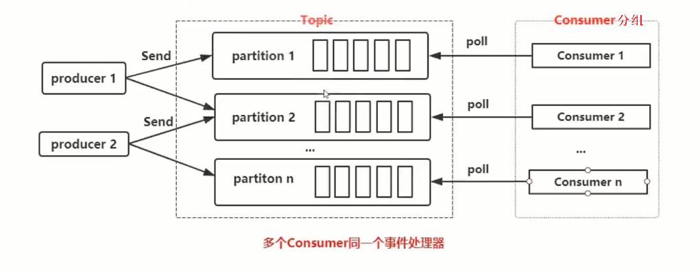
   */
  public class ConsumerThreadSample {
      private final static String TOPIC_NAME="quickstart-topic";
  
      /**
       * 这种类型是经典模式，每一个线程单独创建一个KafkaConsumer，用于保证线程安全
       * @param args
       * @throws InterruptedException
       */
      public static void main(String[] args) throws InterruptedException {
          // Kafka Consumer非线程安全需要解决线程安全问题(和Producer线程安全不同)
          KafkaConsumerRunner r1 = new KafkaConsumerRunner();
          Thread t1 = new Thread(r1);
  
          t1.start();
  
          Thread.sleep(15000);
  
          r1.shutdown();
      }
  
      /**
       * 消费者任务
       */
      public static class KafkaConsumerRunner implements Runnable{
          /**
           * 原子开关
           */
          private final AtomicBoolean closed = new AtomicBoolean(false);
          /**
           * 每个任务里创建一个Kafka consumer 即每个线程下只有一个Consumer(线程自然安全)
           */
          private final KafkaConsumer consumer;
  
          public KafkaConsumerRunner() {
              Properties props = new Properties();
              props.put("bootstrap.servers", "127.0.0.1:9092");
              props.put("group.id", "test");
              props.put("enable.auto.commit", "false");
              props.put("auto.commit.interval.ms", "1000");
              props.put("session.timeout.ms", "30000");
              props.put("key.deserializer", "org.apache.kafka.common.serialization.StringDeserializer");
              props.put("value.deserializer", "org.apache.kafka.common.serialization.StringDeserializer");
  
              consumer = new KafkaConsumer<>(props);
  
              TopicPartition p0 = new TopicPartition(TOPIC_NAME, 0);
              TopicPartition p1 = new TopicPartition(TOPIC_NAME, 1);
              // 订阅 partition
              consumer.assign(Arrays.asList(p0,p1));
          }
  
  
          public void run() {
              try {
                  while(!closed.get()) {
                      //处理消息
                      ConsumerRecords<String, String> records = consumer.poll(Duration.ofMillis(10000));
  
                      for (TopicPartition partition : records.partitions()) {
                          List<ConsumerRecord<String, String>> pRecord = records.records(partition);
                          // 处理每个分区的消息
                          for (ConsumerRecord<String, String> record : pRecord) {
                              System.out.printf("partition = %d , offset = %d, key = %s, value = %s%n",
                                      record.partition(),record.offset(), record.key(), record.value());
                          }
  
                          // 返回去告诉kafka新的offset
                          long lastOffset = pRecord.get(pRecord.size() - 1).offset();
                          // 注意加1
                          consumer.commitSync(Collections.singletonMap(partition, new OffsetAndMetadata(lastOffset + 1)));
                      }
  
                  }
              }catch(WakeupException e) {
                  if(!closed.get()) {
                      throw e;
                  }
              }finally {
                  consumer.close();
              }
          }
  
          public void shutdown() {
              closed.set(true);
              consumer.wakeup();
          }
      }
  
  }
  ```

  

- 一个Consumer对应多个partition
  ```java
  package tk.deriwotua.kafka.consumer;
  
  import org.apache.kafka.clients.consumer.ConsumerRecord;
  import org.apache.kafka.clients.consumer.ConsumerRecords;
  import org.apache.kafka.clients.consumer.KafkaConsumer;
  
  import java.util.Arrays;
  import java.util.Properties;
  import java.util.concurrent.ArrayBlockingQueue;
  import java.util.concurrent.ExecutorService;
  import java.util.concurrent.ThreadPoolExecutor;
  import java.util.concurrent.TimeUnit;
  
  /**
   * 一个Consumer对应多个partition
   *      每个partition对应一个Consumer，Consumer还有自身处理逻辑多个有点重
   *      这里常用复用形式类似NIO多路复用使用回调方式多线程处理信息
   * 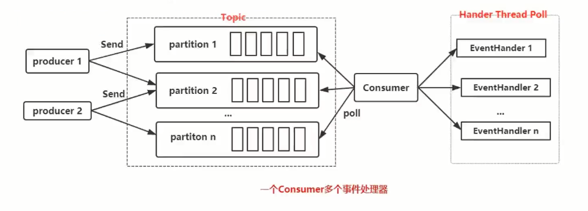
   *
   * 任务中没发单独再offset处理
   */
  public class ConsumerRecordThreadSample {
      private final static String TOPIC_NAME = "quickstart-topic";
  
      public static void main(String[] args) throws InterruptedException {
          String brokerList = "127.0.0.1:9092";
          String groupId = "test";
          int workerNum = 5;
  
          ConsumerExecutor consumers = new ConsumerExecutor(brokerList, groupId, TOPIC_NAME);
          consumers.execute(workerNum);
  
          Thread.sleep(1000000);
  
          consumers.shutdown();
      }
  
      /**
       * Consumer处理
       */
      public static class ConsumerExecutor{
          private final KafkaConsumer<String, String> consumer;
          private ExecutorService executors;
  
          public ConsumerExecutor(String brokerList, String groupId, String topic) {
              Properties props = new Properties();
              props.put("bootstrap.servers", brokerList);
              props.put("group.id", groupId);
              props.put("enable.auto.commit", "true");
              props.put("auto.commit.interval.ms", "1000");
              props.put("session.timeout.ms", "30000");
              props.put("key.deserializer", "org.apache.kafka.common.serialization.StringDeserializer");
              props.put("value.deserializer", "org.apache.kafka.common.serialization.StringDeserializer");
              consumer = new KafkaConsumer<>(props);
              consumer.subscribe(Arrays.asList(topic));
          }
  
          public void execute(int workerNum) {
              executors = new ThreadPoolExecutor(workerNum, workerNum, 0L, TimeUnit.MILLISECONDS,
                      new ArrayBlockingQueue<>(1000), new ThreadPoolExecutor.CallerRunsPolicy());
  
              while (true) {
                  ConsumerRecords<String, String> records = consumer.poll(200);
                  for (final ConsumerRecord record : records) {
                      /**
                       * 每条消息提交给线程池执行
                       */
                      executors.submit(new ConsumerRecordWorker(record));
                  }
              }
          }
  
          public void shutdown() {
              if (consumer != null) {
                  consumer.close();
              }
              if (executors != null) {
                  executors.shutdown();
              }
              try {
                  if (!executors.awaitTermination(10, TimeUnit.SECONDS)) {
                      System.out.println("Timeout.... Ignore for this case");
                  }
              } catch (InterruptedException ignored) {
                  System.out.println("Other thread interrupted this shutdown, ignore for this case.");
                  Thread.currentThread().interrupt();
              }
          }
      }
  
      /**
       * 记录任务处理
       */
      public static class ConsumerRecordWorker implements Runnable {
  
          private ConsumerRecord<String, String> record;
  
          public ConsumerRecordWorker(ConsumerRecord record) {
              this.record = record;
          }
  
          @Override
          public void run() {
              // 假如说数据入库操作
              System.out.println("Thread - "+ Thread.currentThread().getName());
              System.err.printf("partition = %d , offset = %d, key = %s, value = %s%n",
                      record.partition(), record.offset(), record.key(), record.value());
          }
  
      }
  }
  ```

  


Consumer Rebalance几种情况

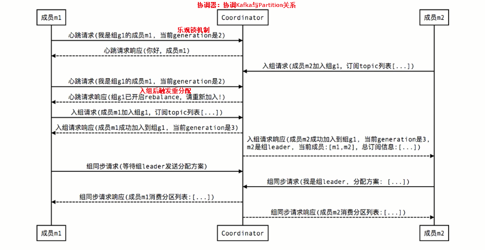

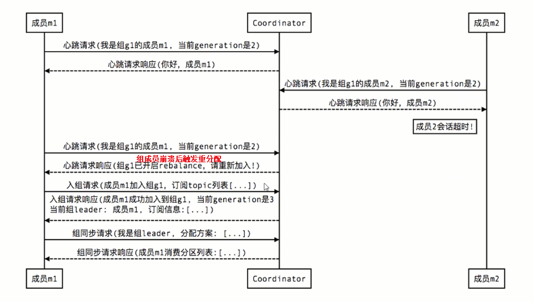

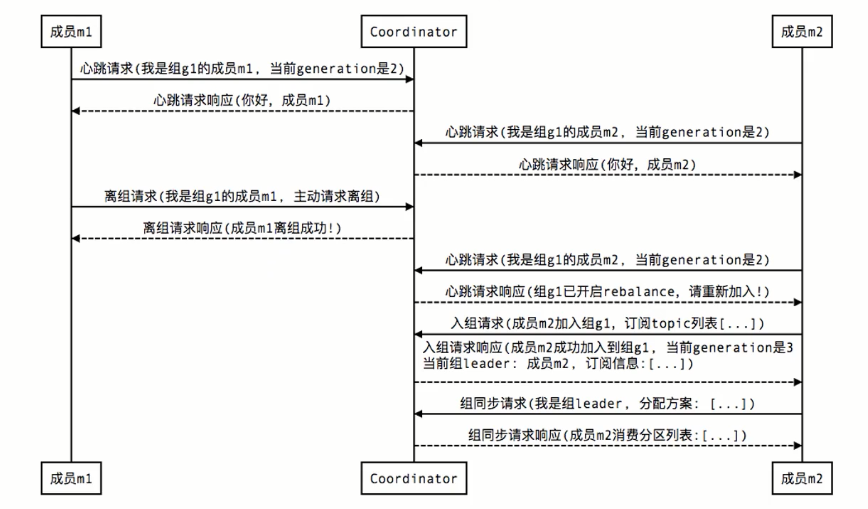

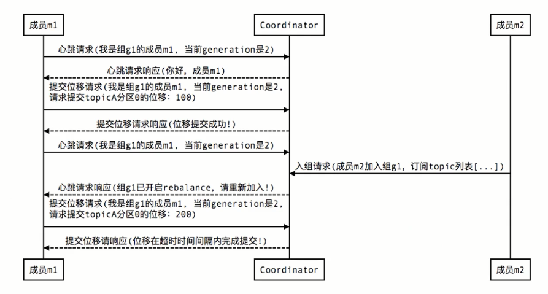


#### Kafka Stream
> 流、流处理器
> 流处理拓扑
> 源处理器、Sink处理器

Kafka Stream处理分析存储在Kafka数据的客户端库

Kafka Stream通过state store可以实现高效的状态操作

支持原语Processor和高层抽象DSL

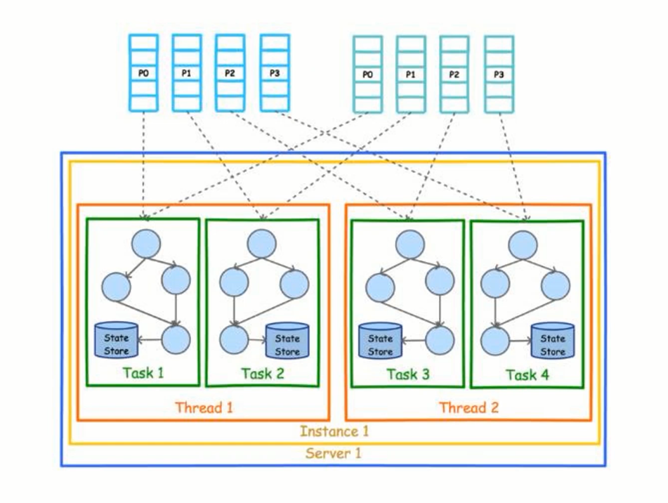

Kafka Stream基本概念
- 流、流处理器
- 流处理拓扑
- 源处理器、Sink处理器

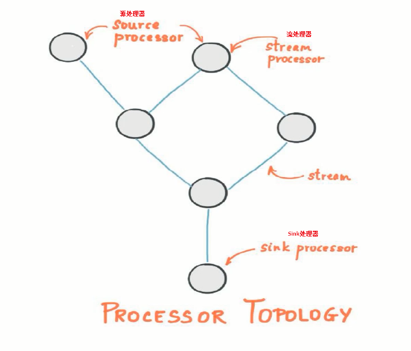

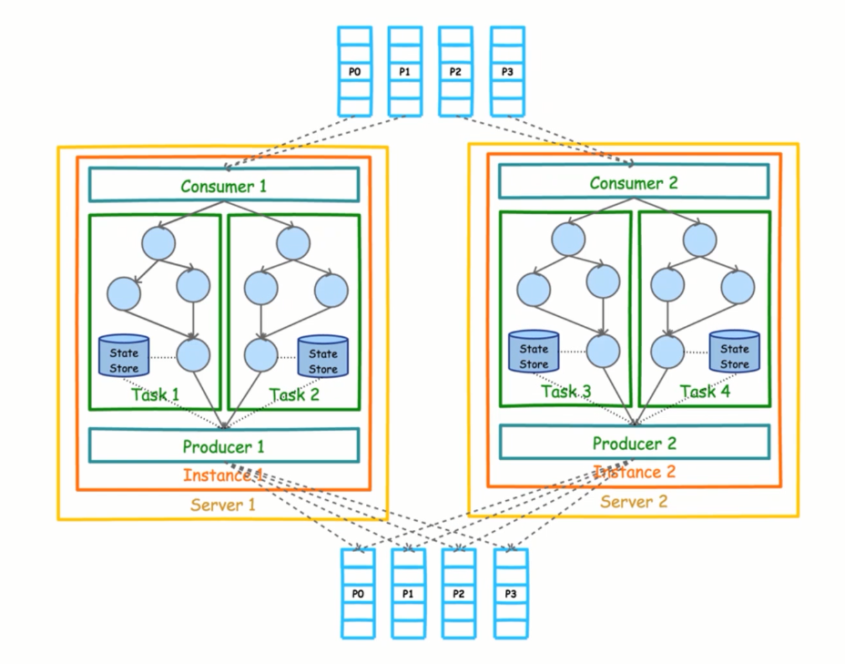


```java
package tk.deriwotua.kafka.stream;

import org.apache.kafka.common.serialization.Serdes;
import org.apache.kafka.streams.KafkaStreams;
import org.apache.kafka.streams.StreamsBuilder;
import org.apache.kafka.streams.StreamsConfig;
import org.apache.kafka.streams.kstream.KStream;
import org.apache.kafka.streams.kstream.KTable;
import org.apache.kafka.streams.kstream.Produced;

import java.util.Arrays;
import java.util.Locale;
import java.util.Properties;

public class StreamSample {
    /**
     * 输入Topic
     */
    private static final String INPUT_TOPIC = "quickstart-stream-in";
    /**
     * 输出Topic
     */
    private static final String OUT_TOPIC = "quickstart-stream-out";

    public static void main(String[] args) {
        Properties props = new Properties();
        props.put(StreamsConfig.BOOTSTRAP_SERVERS_CONFIG, "127.0.0.1:9092");
        // 指定Stream application ID
        props.put(StreamsConfig.APPLICATION_ID_CONFIG, "word-count-app");
        // 序列化相关
        props.put(StreamsConfig.DEFAULT_KEY_SERDE_CLASS_CONFIG, Serdes.String().getClass());
        props.put(StreamsConfig.DEFAULT_VALUE_SERDE_CLASS_CONFIG, Serdes.String().getClass());

        // 构建流结构拓扑
        final StreamsBuilder builder = new StreamsBuilder();
        // 构建word-count
        //wordCountStream(builder);
        // 构建foreachStream
        foreachStream(builder);
        // stream 流
        final KafkaStreams streams = new KafkaStreams(builder.build(), props);
        // 启动
        streams.start();
    }

    /**
     * 定义流计算过程
     * @param builder
     */
    static void foreachStream(final StreamsBuilder builder) {
        KStream<String, String> source = builder.stream(INPUT_TOPIC);
        source
                /**
                 * 按空格拆分
                 */
                .flatMapValues(value -> Arrays.asList(value.toLowerCase(Locale.getDefault()).split(" ")))
                // 循环打印
                .foreach((key, value) -> System.out.println(key + " : " + value));
    }

    /**
     * 定义流计算过程
     * @param builder
     */
    static void wordCountStream(final StreamsBuilder builder) {
        // 不断从输入INPUT_TOPIC上获取新数据，并且追加到流上的一个抽象对象
        KStream<String, String> source = builder.stream(INPUT_TOPIC);
        /**
         * 接收输入：Hello World
         *  统计每个单词个数
         * KTable是数据集合的抽象对象
         * （算子）
         */
        final KTable<String, Long> count =
                source
                        /**
                         * flatMapValues -> 将一行数据拆分为多行数据  key 1 , value Hello World
                         * flatMapValues -> 将一行数据拆分为多行数据  key 1 , value Hello key xx , value World
                         *
                         * key 1 , value Hello   -> Hello 1  World 2
                         * key 2 , value World
                         * key 3 , value World
                         *
                         * 这里按空格拆分
                         */
                        .flatMapValues(value -> Arrays.asList(value.toLowerCase(Locale.getDefault()).split(" ")))
                        // 合并 -> 按value值合并
                        .groupBy((key, value) -> value)
                        // 统计出现的总数
                        .count();

        // 将结果输出到OUT_TOPIC中
        count.toStream().to(OUT_TOPIC, Produced.with(Serdes.String(), Serdes.Long()));
    }

}
```

#### Connect

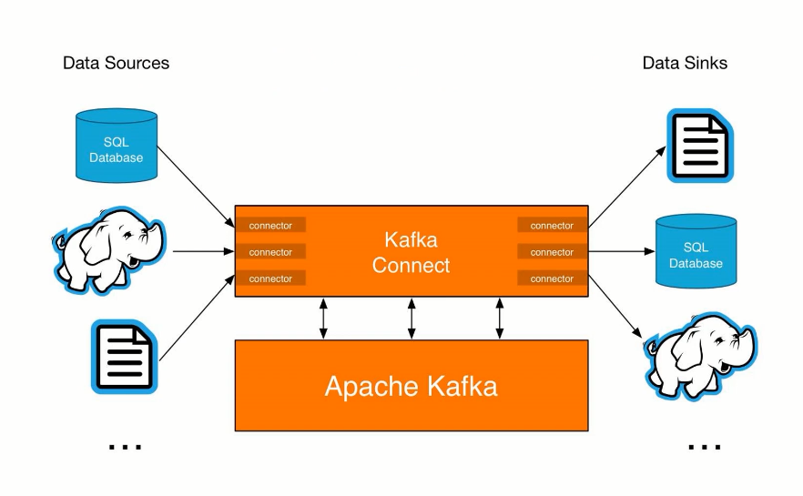

Connect基本概念
- Kafka Connect是Kafka流式计算的一部分
- Kafka Connect主要用来与其它中间件建立流式通道
- Kafka Connect支持流式和批量处理集成


