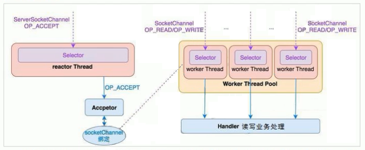

[TOC]

## 1. 多线程编程
### 1.1 基本知识回顾

线程是比进程更小的能独立运行的基本单位，它是进程的一部分，一个进程可以拥有多个线程，但至少要有一个线程，即主执行线程(Java 的 main 方法)。既可以编写单线程应用，也可以编写多线程应用。

一个进程中的多个线程可以并发(同时)执行，在一些执行时间长、需要等待的任务上（例如：文件读写和网络传输等），多线程就比较有用了。

怎么理解多线程呢 
- 进程就是一个工厂，一个线程就是工厂中的一条生产线，一个工厂至少有一条生产线，只有一条生产线就是单线程应用，拥有多条生产线就是多线程应用。多条生产线可以同时运行。
- 使用迅雷可以同时下载多个视频，迅雷就是进程，多个下载任务就是线程，这几个线程可以同时运行去下载视频。

多线程可以共享内存、充分利用 CPU，通过提高资源(内存和 CPU)使用率从而提高程序的执行效率。CPU 使用抢占式调度模式在多个线程间进行着随机的高速的切换。对于 CPU的一个核而言，某个时刻，只能执行一个线程，而 CPU 在多个线程间的切换速度相对感觉要快很多，看上去就像是多个线程或任务在同时运行。

Java 天生就支持多线程并提供了两种编程方式
- 一个是继承 Thread 类。自定义了一个类去继承 Thread 类，并重写了 run 方法，在该方法内实现具体业务功能，这里用一个 for 循环模拟一下
  ```java
  public class ThreadFor1 extends Thread{
      public void run() {
          for (int i = 0; i < 50; i++) {
              System.out.println(this.getName()+":"+i);
          }
      }
  }
  ```
  - 自定义了一个类去继承 Thread 类，并重写了 run 方法，在该方法内实现另一个业务功能，这里仍用一个 for 循环模拟一下
    ```java
    public class ThreadFor2 extends Thread{
        public void run() {
            for (int i = 51; i < 100; i++) {
                System.out.println(this.getName()+":"+i);
            }
        }
    }
    ```
  - 创建了两个线程对象并分别启动，能够清晰观察到，CPU 在两个线程之间快速随机切换，也就是平时说的在同时运行。
    ```java
    public class TestThreadFor {
        public static void main(String[] args) {
            ThreadFor1 tf1 = new ThreadFor1();
            tf1.setName("线程 A");
            ThreadFor2 tf2 = new ThreadFor2();
            tf2.setName("线程 B");
    
            tf1.start();
            tf2.start();
        }
    }
    
    /**
     * 输出是没有规律的 CPU 在两个线程之间快速随机切换
     * 线程A:0
     * 线程B:51
     * 线程A:1
     * 线程A:2
     * 线程A:3
     * 线程B:52
     * 线程A:4
     * 线程B:53
     * 线程A:5
     */
    ```
- 一个是实现 Runnable 接口。自定义一个类去实现 Runnable 接口，并实现了 run 方法，在该方法内实现具体业务功能，这里用一个 for 循环模拟一下
  ```java
  public class RunnableFor1 implements Runnable{
      public void run() {
          for (int i = 0; i < 50; i++) {
              System.out.println(Thread.currentThread().getName()+":"+i);
          }
      }
  }
  ```
  - 自定义一个类去实现 Runnable 接口，并实现了 run 方法，在该方法内实现另一个业务功能，这里仍用一个 for 循环模拟一下。
    ```java
    public class RunnableFor2 implements Runnable{
        public void run() {
            for (int i = 51; i < 100; i++) {
                System.out.println(Thread.currentThread().getName()+":"+i);
            }
        }
    }
    ```
  - 创建两个线程对象并分别启动，能够清晰观察到，CPU在两个线程之间快速随机切换，也就是平时说的在同时运行。
    ```java
    public class TestRunnableFor {
        public static void main(String[] args) {
            Thread t1=new Thread(new RunnableFor1());
            t1.setName("线程 A");
            Thread t2=new Thread(new RunnableFor2());
            t2.setName("线程 B");
    
            t1.start();
            t2.start();
        }
    }
    
    /**
     * 输出是没有规律的 CPU 在两个线程之间快速随机切换
     * 线程B:51
     * 线程A:0
     * 线程B:52
     * 线程A:1
     * 线程B:53
     * 线程A:2
     * 线程B:54
     * 线程A:3
     * 线程B:55
     */
    ```
继承 Thread 类子类还是称为线程类，而实现 Runnable 接口就不能这么称呼可以称为任务类运行要通过线程类`Thread.start()`

### 1.2 线程安全
#### 1.2.1 产生线程安全问题的原因

在进行多线程编程时，要注意线程安全问题，先通过一个案例了解一下什么是线程安全问题。该案例模拟用两个售票窗口同时卖火车票
- 定义了一个类去实现 Runnable 接口，该类中有一个属性 id，表示 10 张火车票，并在 run 方法中通过一个 for 循环销售火车票，为了让效果明显一些，中间用 sleep 方法停顿半秒钟。
  ```java
  public class SaleWindow implements Runnable {
      private int id = 10; //表示 10 张火车票 这是共享资源
      //卖 10 张火车票
      public void run() {
          for (int i = 0; i < 10; i++) {
              if (id > 0) {
                  System.out.println(Thread.currentThread().getName() + "卖了编号为" + id + "的火车票");
                  id--;
                  try {
                      Thread.sleep(500);
                  } catch (InterruptedException e) {
                  }
              }
          }
      }
  }
  ```
- 创建两个线程对象模拟两个售票窗口同时卖票
  ```java
  public class TestSaleWindow {
      public static void main(String[] args) {
          SaleWindow sw = new SaleWindow();
  
          Thread t1 = new Thread(sw);
          Thread t2 = new Thread(sw);
  
          t1.setName("窗口 A");
          t2.setName("窗口 B");
  
          t1.start();
          t2.start();
      }
  }
  ```

- 启动后可以看到，10 张火车票都卖出去了，但是出现了重复售票，这就是线程安全问题造成的。这 10 章火车票是共享资源，也就是说任何窗口都可以进行操作和销售，问题在于窗口 A 把某一张火车票卖出去之后，窗口 B 并不知道，因为这是两个线程，所以窗口 B 也可能会再卖出去一张相同的火车票。

**多个线程操作的是同一个共享资源，但是线程之间是彼此独立、互相隔绝的，因此就会出现数据（共享资源）不能同步更新的情况，这就是线程安全问题**。

### 1.2.2 解决线程安全问题
> 线程之间相互独立、互相隔绝导致共享数据在多个线程之间不能同步更新，本质 CPU 随机性

Java 中提供了一个同步机制(锁)来解决线程安全问题，即让操作共享数据的代码在某一时间段，只被一个线程执行(锁住)限制 CPU 随机性，在执行过程中，其他线程不可以参与进来，这样共享数据就能同步了。简单来说，就是给某些代码加把锁。

锁是什么？又从哪儿来呢？锁的专业名称叫监视器 `monitor`，其实 Java 为每个对象都自动内置了一个锁（监视器 monitor），当某个线程执行到某代码块时就会自动得到这个对象的锁，那么其他线程就无法执行该代码块了，一直要等到之前那个线程停止(释放锁)。需要特别注意的是：**多个线程必须使用同一把锁（对象）**。

Java 的同步机制提供了两种实现方式
- 同步代码块：即给代码块上锁，变成同步代码块
  ```java
  public class SaleWindow1 implements Runnable {
      private int id = 10; //表示 10 张火车票 共享资源
      //卖 10 张火车票
      public void run() {
          for (int i = 0; i < 10; i++) { 
              synchronized (this) { //获取锁
                  if (id > 0) {
                      System.out.println(Thread.currentThread().getName() + "卖了编号为" + id + "的火车票");
                      id--;
                      try {
                          Thread.sleep(500);
                      } catch (InterruptedException e) {
                      }
                  }
              }   // 释放锁
          }
      }
  }
  ```
  - 同步代码块代码和之前的只有一点差别，就是多了同步代码块，语法是：`synchronized(锁){...业务代码...}`。
  - 同样创建两个线程对象模拟两个售票窗口同时卖票
    ```java
    public class TestSaleWindow1 {
        public static void main(String[] args) {
            SaleWindow1 sw=new SaleWindow1();
    
            Thread t1=new Thread(sw);
            Thread t2=new Thread(sw);
    
            t1.setName("窗口 A");
            t2.setName("窗口 B");
    
            t1.start();
            t2.start();
        }
    }
    ```
  - 执行可以看到 10 张火车票都卖出去了，这次没有问题(不关心这 10 张票都是哪个窗口卖出去的，关心的是没有重复卖票)。
  
- 同步方法：即给方法上锁，变成同步方法，默认锁就是 this
  - 把原来同步代码块中的代码抽取出来放到一个方法中，然后给这个方法加上synchronized 关键字修饰，锁住的代码是一样的，因此本质上和第一种方式没什么区别。
  ```java
  public class SaleWindow2 implements Runnable {
      private int id = 10; // 表示 10 张火车票 共享资源
      // 获取锁
      public synchronized void saleOne(){ //该方法内是上面同步代码块中的代码
          if (id > 0) {
              System.out.println(Thread.currentThread().getName() + "卖了编号为" + id + "的火车票");
              id--;
              try {
                  Thread.sleep(500);
              } catch (InterruptedException e) {
              }
          }
      }   //释放锁
      // 卖 10 张火车票
      public void run() {
          for (int i = 0; i < 10; i++) { 
              saleOne();
          }
      }
  }
  ```
  

这两种方式本质上差不多，都是通过 `synchronized` 关键字来实现的。 进入`synchronized`同步代码块时需要获取锁，获取锁后释放锁几种情况
- 同步代码执行中抛出异常会释放锁
- 同步代码中通过锁对象调用`wait()`方法释放锁
- 执行完`synchronized`同步代码块会释放锁


### 1.2.3 Java API 中的线程安全问题

平时在使用 Java API 进行编程时，经常遇到说哪个类是线程安全的，哪个类是不保证线程安全的，`StringBuffer / StringBuilder` 和 `Vector / ArrayList` ，谁是线程安全的？谁不是线程安全的？查一下它们的源码便可知晓。


通过查看源码，发现 StringBuffer 和 Vector 类中的大部分方法都是同步方法，所以证明这两个类在使用时是保证线程安全的；而 StringBuilder 和 ArrayList 类中的方法都是普通方法，没有使用 synchronized 关键字进行修饰，所以证明这两个类在使用时不保证线程安全。

**线程安全和性能之间不可兼得，保证线程安全就会损失性能，保证性能就不能满足线程安全**。

### 1.3 线程间通信
> 协调通信来改变或控制 CPU 的随机性--等待唤醒机制

多个线程并发执行时, 在默认情况下 CPU 是随机性的在线程之间进行切换的，但是有时候希望它们能有规律的执行, 那么，多线程之间就需要一些协调通信来改变或控制 CPU 的随机性。Java 提供了**等待唤醒机制**来解决这个问题，具体来说就是**多个线程依靠一个同步锁，然后借助于 `wait()`和 `notify()`方法就可以实现线程间的协调通信**。

等待唤醒机制：线程间相互独立、互相隔绝A线程没办法把处于等待的线程B唤醒无法通信但都同用一把锁对象，同步锁相当于中间人的作用，也就是为什么多个线程必须用同一个同步锁(认识同一个中间人)，只有同一个锁上的被等待的线程，才可以被持有该锁的另一个线程唤醒，使用不同锁的线程之间不能相互唤醒，也就无法协调通信。

Java 在 Object 类中提供了一些方法可以用来实现线程间的协调通信
- `public final void wait();` 让当前线程释放锁
- `public final native void wait(long timeout);` 让当前线程释放锁，并等待 xx 毫秒
- `public final native void notify();` 唤醒持有同一锁的某个线程
- `public final native void notifyAll();` 唤醒持有同一锁的所有线程

需要注意的是：在调用 `wait` 和 `notify` 方法时，当前线程必须已经持有锁，然后才可以调用，否则将会抛出 `IllegalMonitorStateException` 异常。接下来通过两个案例来演示一下具体如何编程实现线程间通信。

案例 1: 一个线程输出 10 次 1，一个线程输出 10 次 2，要求交替输出“1 2 1 2 1 2...”或“2 1 2 1 2 1...”

- 为了保证两个线程使用的一定是同一个锁，创建一个对象作为静态属性放到一个类中，这个对象就用来充当锁。
  ```java
  package tk.deriwotua.thread.communication.num;
  
  public class MyLock {
      // 锁对象
      public static Object o = new Object();
  }
  ```
- ThreadForNum1 线程输出十次 1，`synchronized (MyLock.o)`使用 MyLock.o 作为锁执行时获取锁，每输出一个 1 就唤醒另一个线程，然后自己`wait()`休眠并释放锁。
  ```java
  package tk.deriwotua.thread.communication.num;
  
  /**
   * 自定义一个线程类 输出1
   *  每次输出1后唤醒输出2的线程然后自己休眠
   */
  public class ThreadForNum1 extends Thread {
  
      public void run(){
          for(int j=0;j<10;j++){
              /**
               * 加锁 此时就不能锁 this
               *      ThreadForNum2 和 ThreadForNum1是不同的线程类
               *      synchronized (this) 时线程间锁对象就不是同一把
               *      使用不同锁的线程之间不能相互唤醒，也就无法协调通信
               */
              synchronized (MyLock.o) {   //获取锁
                  System.out.println(1);
                  /**
                   * 线程间无法直接通信通过同一把锁对象协调通信  
                   * 业务逻辑执行完后唤醒其它线程
                   * 同一个线程中要先唤醒其它线程，再让自己等待不能反
                   */
                  MyLock.o.notify();
                  try {
                      // 唤醒其它线程后自己休眠
                      MyLock.o.wait();    //释放锁
                  } catch (InterruptedException e) {
                      e.printStackTrace();
                  }
              } //释放锁
          }
      }
  
  }
  ```

- ThreadForNum2 线程输出十次 2，`synchronized (MyLock.o)`也使用 MyLock.o 作为锁执行时获取锁，每输出一个 2 就唤醒另一个线程，然后自己`wait()`休眠并释放锁。
  ```java
  package tk.deriwotua.thread.communication.num;
  
  /**
   * 自定义一个线程类 输出2
   *  每次输出2后唤醒输出1的线程然后自己休眠
   */
  public class ThreadForNum2 extends Thread {
  
      public void run(){
          for(int j=0;j<10;j++){
              /**
               * 加锁 此时就不能锁 this
               *      ThreadForNum2 和 ThreadForNum1是不同的线程类
               *      synchronized (this) 时线程间锁对象就不是同一把
               *      使用不同锁的线程之间不能相互唤醒，也就无法协调通信
               */
              synchronized (MyLock.o) {   //获取锁
                  // 业务逻辑
                  System.out.println(2);
                  /**
                   * 线程间无法直接通信通过同一把锁对象协调通信
                   * 业务逻辑执行完后唤醒其它线程
                   * 同一个线程中要先唤醒其它线程，再让自己等待不能反
                   */
                  MyLock.o.notify();
                  try {
                      // 唤醒其它线程后自己休眠
                      MyLock.o.wait();    //释放锁
                  } catch (InterruptedException e) {
                      e.printStackTrace();
                  }
              } //释放锁
          }
      }
  
  }
  ```
- 创建两个线程对象分别运行
  ```java
  package tk.deriwotua.thread.communication.num;
  
  /**
   * 一个线程输出 10 次 1，一个线程输出 10 次 2，要求交替输出“1 2 1 2 1 2...”或“2 1 2 1 2 1...”
   */
  public class TestThreadForNum {
      public static void main(String[] args) {
          new ThreadForNum1().start();
          new ThreadForNum2().start();
      }
  }
  
  /** 执行代码
   * 2
   * 1
   * 2
   * 1
   * 2
   * 1
   * 2
   * 1
   * 2
   * 1
   * 2
   * 1
   * 2
   * 1
   * 2
   * 1
   * 2
   * 1
   * 2
   * 1
   */
  ```

案例 2：生产者消费者模式
- 该模式在现实生活中很常见，在项目开发中也广泛应用，它是线程间通信的经典应用。生产者是一堆线程，消费者是另一堆线程，内存缓冲区可以使用 List 集合存储数据。该模式的关键之处是如何处理多线程之间的协调通信，内存缓冲区为空的时候，消费者必须等待，而内存缓冲区满的时候，生产者必须等待，其他时候可以是个动态平衡。

- 下面模拟实现农夫采摘水果放到筐里，小孩从筐里拿水果吃，农夫是一个线程，小孩是一个线程，水果筐放满了，农夫停；水果筐空了，小孩停。
- 定义一个静态集合作为内存缓冲区用来存储数据，同时这个集合也可以作为锁去被多个线程使用。
  ```java
  package tk.deriwotua.thread.communication.farmerchild;
  
  import java.util.ArrayList;
  
  /**
   * 容器
   */
  public class Kuang {
      //这个集合就是水果筐 假设最多存10个水果
      public static ArrayList<String> kuang = new ArrayList<String>();
  }
  ```
- 农夫线程，不断的往集合（筐）里放水果，当筐满了就停，同时释放锁。
  ```java
  package tk.deriwotua.thread.communication.farmerchild;
  
  /**
   * 生产者：往容器里添加
   */
  public class Farmer extends Thread {
      public void run() {
          /**
           * 不停放直到放满
           */
          while (true) {
              // 获取锁
              synchronized (Kuang.kuang) {
                  /**
                   * 1.筐放满了就让农夫休息
                   */
                  if (Kuang.kuang.size() == 10) {
                      try {
                          // 容器放满了 休眠释放锁好让消费者获取锁去消费
                          Kuang.kuang.wait();
                      } catch (InterruptedException e) {
                      }
                  }
                  //2.往筐里放水果
                  Kuang.kuang.add("apple");
                  System.out.println("农夫放了一个水果,目前筐里有" + Kuang.kuang.size()
                          + "个水果");
                  //3.容器放了就可以唤醒小孩继续吃
                  Kuang.kuang.notify();
              } // 释放锁
              //4.模拟控制速度
              try {
                  Thread.sleep(50);
              } catch (InterruptedException e) {
              }
          }
      }
  }
  ```
- 小孩线程，不断的从集合（筐）里拿水果吃，当筐空了就停，同时释放锁。
  ```java
  package tk.deriwotua.thread.communication.farmerchild;
  
  /**
   * 消费者：从容器里取
   */
  public class Child extends Thread {
      public void run() {
          /**
           * 不停取直到取完
           */
          while (true) {
              // 获取锁
              synchronized (Kuang.kuang) {
                  /**
                   * 1.筐里没水果了就让小孩休息
                   */
                  if (Kuang.kuang.size() == 0) {
                      try {
                          // 休眠 释放锁好让生产者获取锁去生产
                          Kuang.kuang.wait();
                      } catch (InterruptedException e) {
                      }
                  }
                  //2.小孩吃水果
                  Kuang.kuang.remove("apple");
                  System.out.println("小孩吃了一个水果,目前筐里有" + Kuang.kuang.size() + "个水果");
                  //3.唤醒农夫继续放水果
                  Kuang.kuang.notify();
              }   // 释放锁
              //4.模拟控制速度
              try {
                  Thread.sleep(3000);
              } catch (InterruptedException e) {
                  e.printStackTrace();
              }
          }
      }
  }
  ```
- 创建两个线程同时运行，可以通过双方线程里的 `sleep` 方法模拟控制速度，当农夫往框里放水果的速度快于小孩吃水果的速度时
  ```java
  package tk.deriwotua.thread.communication.farmerchild;
  
  /**
   * 农夫采摘水果放到筐里，小孩从筐里拿水果吃，农夫是一个线程，小孩是一个线程，水果筐放满了，农夫停；水果筐空了，小孩停。
   */
  public class TestFarmerChild {
  	public static void main(String[] args) {
  		new Farmer().start();
  		new Child().start();
  	}
  }
  ```

当小孩吃水果的速度快于农夫往框里放水管的速度时
```text
农夫放了一个水果,目前筐里有1个水果
小孩吃了一个水果,目前筐里有0个水果
农夫放了一个水果,目前筐里有1个水果
小孩吃了一个水果,目前筐里有0个水果
农夫放了一个水果,目前筐里有1个水果
小孩吃了一个水果,目前筐里有0个水果
农夫放了一个水果,目前筐里有1个水果
小孩吃了一个水果,目前筐里有0个水果
农夫放了一个水果,目前筐里有1个水果
小孩吃了一个水果,目前筐里有0个水果

Process finished with exit code -1
```

当小孩吃水果的速度慢于农夫往框里放水管的速度时
```text
农夫放了一个水果,目前筐里有1个水果
小孩吃了一个水果,目前筐里有0个水果
农夫放了一个水果,目前筐里有1个水果
农夫放了一个水果,目前筐里有2个水果
农夫放了一个水果,目前筐里有3个水果
农夫放了一个水果,目前筐里有4个水果
农夫放了一个水果,目前筐里有5个水果
农夫放了一个水果,目前筐里有6个水果
小孩吃了一个水果,目前筐里有5个水果
农夫放了一个水果,目前筐里有6个水果
农夫放了一个水果,目前筐里有7个水果
农夫放了一个水果,目前筐里有8个水果
农夫放了一个水果,目前筐里有9个水果
农夫放了一个水果,目前筐里有10个水果
小孩吃了一个水果,目前筐里有9个水果
农夫放了一个水果,目前筐里有10个水果
小孩吃了一个水果,目前筐里有9个水果
农夫放了一个水果,目前筐里有10个水果

Process finished with exit code -1
```

## 2. BIO 编程

BIO 有的称之为 basic(基本) IO,有的称之为 block(阻塞) IO，主要应用于文件 IO 和网络 IO，这里不再说文件 IO, 大家对此都非常熟悉，本次课程主要讲解网络 IO。

在 JDK1.4 之前，建立网络连接的时候只能采用 BIO，需要先在服务端启动一个`ServerSocket`，然后在客户端启动 `Socket` 来对服务端进行通信，默认情况下服务端需要对每个请求建立一个线程等待请求，而客户端发送请求后，先咨询服务端是否有线程响应，如果没有则会一直等待或者遭到拒绝，如果有的话，客户端线程会等待请求结束后才继续执行，这就是阻塞式 IO。

接下来通过一个例子复习回顾一下 BIO 的基本用法（基于 TCP）。
- 编写了一个服务器端程序，绑定端口号 `9999`，`accept` 方法用来监听客户端连接，如果没有客户端连接，就一直等待，程序会阻塞到这里。
  ```java
  package tk.deriwotua.bio;
  
  import java.io.InputStream;
  import java.net.ServerSocket;
  import java.net.Socket;
  
  /**
   * BIO 服务器端程序
   */
  public class TCPServer {
  	public static void main(String[] args) throws Exception {
  		//1.创建ServerSocket对象
  		ServerSocket ss=new ServerSocket(9999); //端口号
  
  		// 服务端一直接收客户端请求
  		while (true) {
  			//2.监听客户端
  			System.out.println("来呀");
  			/**
  			 * 阻塞 等待接收连接请求
  			 */
  			Socket s = ss.accept();
  			System.out.println("来呀");
  			/**
  			 * 3.从连接中取出输入流来接收消息
  			 * 		也是阻塞 客户端不发送数据一直等待
  			 */
  			InputStream is = s.getInputStream(); //阻塞
  			byte[] b = new byte[10];
  			is.read(b);
  			String clientIP = s.getInetAddress().getHostAddress();
  			System.out.println(clientIP + "说:" + new String(b).trim());
  			//4.从连接中取出输出流并回话
  			//OutputStream os = s.getOutputStream();
  			//os.write("没钱".getBytes());
  			//5.关闭
  			//s.close();
  		}
  	}
  }
  ```
- 编写了一个客户端程序，通过 9999 端口连接服务器端，`getInputStream` 方法用来等待服务器端返回数据，如果没有返回，就一直等待，程序会阻塞到这里
  ```java
  package tk.deriwotua.bio;
  
  import java.io.InputStream;
  import java.io.OutputStream;
  import java.net.Socket;
  import java.util.Scanner;
  
  /**
   * BIO 客户端程序
   */
  public class TCPClient {
  	public static void main(String[] args) throws Exception {
  		while (true) {
  			//1.创建Socket对象
  			Socket s = new Socket("127.0.0.1", 9999);
  			//2.从连接中取出输出流并发消息
  			OutputStream os = s.getOutputStream();
  			System.out.println("请输入:");
  			Scanner sc = new Scanner(System.in);
  			String msg = sc.nextLine();
  			os.write(msg.getBytes());
  			/**
  			 * 3.从连接中取出输入流并接收回话
  			 * 		阻塞 一直等待服务端数据
  			 */
  			InputStream is = s.getInputStream(); //阻塞
  			byte[] b = new byte[20];
  			is.read(b);
  			System.out.println("老板说:" + new String(b).trim());
  			//4.关闭
  			s.close();
  		}
  	}
  }
  ```

上面服务端与客户端运行期间几种阻塞
- 服务端
  - `java.net.ServerSocket.accept()`阻塞等待接收连接请求
  - `java.net.Socket.getInputStream()`阻塞等待客户端数据
- 客户端
  - `java.net.Socket.getInputStream()`阻塞等待服务端数据

## 3. NIO 编程
### 3.1 概述

`java.nio` 全称 `java non-blocking` IO，是指 JDK 提供的新 API。从 JDK1.4 开始，Java 提供了一系列改进的输入/输出的新特性，被统称为 NIO(即 New IO)。新增了许多用于处理输入输出的类，这些类都被放在 `java.nio` 包及子包下，并且对原 `java.io` 包中的很多类进行改写，新增了满足 NIO 的功能。


```
# NIO 包
java.nio
java.nio.channels
java.nio.channels.spi
java.nio.charset
java.nio.charset.spi
java.nio.file
java.nio.file.attribute
java.nio.file.spi
```


NIO 和 BIO 有着相同的目的和作用，但是它们的实现方式完全不同，BIO 以`流`的方式处理数据,而 NIO 以`块`的方式处理数据,块 I/O 的效率比流 I/O 高很多。另外，NIO 是`非阻塞式`的，这一点跟 BIO 也很不相同，使用它可以提供非阻塞式的高伸缩性网络。

NIO 主要有三大核心部分：`Channel`通道，`Buffer`缓冲区, `Selector`选择器。传统的 BIO基于`字节流`和`字符流`进行操作，而 NIO 基于 `Channel`通道和 `Buffer`缓冲区进行操作，数据总是从通道读取到缓冲区中，或者从缓冲区写入到通道中。`Selector`选择区用于监听多个通道的事件（比如：连接请求，数据到达等），因此使用单个线程就可以监听多个客户端通道。

### 3.2 文件 IO
#### 3.2.1 概述和核心 API
`Buffer`缓冲区：实际上是一个容器，是一个特殊的数组，缓冲区对象内置了一些机制，能够跟踪和记录缓冲区的状态变化情况。`Channel` 提供从文件、网络读取数据的渠道，但是读取或写入的数据都必须经由 `Buffer`，如下图所示：


在 NIO 中，`Buffer` 是一个顶层父类，它是一个抽象类，常用的 `Buffer` 子类有：
- `ByteBuffer`存储字节数据到缓冲区
- `ShortBuffer`存储字符串数据到缓冲区
- `CharBuffer`存储字符数据到缓冲区
- `IntBuffer`存储整数数据到缓冲区
- `LongBuffer`存储长整型数据到缓冲区
- `DoubleBuffer`存储小数到缓冲区
- `FloatBuffer`存储小数到缓冲区

对于 Java 中的基本数据类型，都有一个 `Buffer` 类型与之相对应，最常用的自然是`ByteBuffer` 二进制数据类，该类的主要方法如下所示：
- `public abstract ByteBuffer put(byte[] b);` 存储字节数据到缓冲区
- `public abstract byte[] get();` 从缓冲区获得字节数据
- `public final byte[] array();` 把缓冲区数据转换成字节数组
- `public static ByteBuffer allocate(int capacity);` 设置缓冲区的初始容量
- `public static ByteBuffer wrap(byte[] array);` 把一个现成的数组放到缓冲区中使用
- `public final Buffer flip();` 翻转缓冲区，重置位置到初始位置

`Channel`通道：类似于 BIO 中的 `stream`，例如 `FileInputStream` 对象，用来建立到目标文件，网络套接字，硬件设备等的一个连接，但是需要注意：BIO 中的 `stream` 是单向的，例如 `FileInputStream` 对象只能进行读取数据的操作，而 NIO 中的`Channel`通道是双向的，既可以用来进行读操作，也可以用来进行写操作。常用的 `Channel` 类有：`FileChannel`、`DatagramChannel`、`ServerSocketChannel` 和 `SocketChannel`。
- `FileChannel` 用于文件的数据读写
- `DatagramChannel` 用于 UDP 的数据读写
- `ServerSocketChannel` 和 `SocketChannel` 用于 TCP 的数据读写。


这里先讲解 `FileChannel` 类，该类主要用来对本地文件进行 IO 操作，主要方法如下所示：
- `public int read(ByteBuffer dst)` 从通道读取数据并放到缓冲区中
- `public int write(ByteBuffer src)` 把缓冲区的数据写到通道中
- `public long transferFrom(ReadableByteChannel src, long position, long count)`从目标通道中复制数据到当前通道
- `public long transferTo(long position, long count, WritableByteChannel target)`把数据从当前通道复制给目标通道

#### 3.2.2 案例
接下来通过 NIO 实现几个案例，分别演示一下本地文件的读、写和复制操作，并和 BIO 做个对比。

往本地文件中写数据
```java
/**
 * 往本地文件中写数据
 *
 * @throws Exception
 */
@Test
public void test1() throws Exception {
    //1. 创建输出流
    FileOutputStream fos = new FileOutputStream("basic.txt");
    //2. 从流中得到一个通道 通道建立在流基础上
    FileChannel fc = fos.getChannel();
    //3. 提供一个缓冲区
    // 设置缓冲区的初始容量
    ByteBuffer buffer = ByteBuffer.allocate(1024);
    //4. 往缓冲区中存入数据
    String str = "hello,nio";
    // 存储字节数据到缓冲区
    buffer.put(str.getBytes());
    /**
     * 往申请的 buffer 缓冲区写数据时从初始位置开始写写多少字节指针下移多少字节处
     * 写完指针并不会回到到初始位置 但是问题是 缓冲区数据写到通道时是从指针位置开始到缓冲区末尾数据写入通道内
     * 这样就会导致上面hello,nio是无法写入文件中的写入的都是缓冲区没有存放数据的区间空数据
     * 此时就需要通过flip()把指针重置到开始位置
     */
    //5. 翻转缓冲区
    buffer.flip();
    //6. 把缓冲区写到通道中 通道会把数据写到文件里
    fc.write(buffer);
    //7. 关闭 流时通道自动关闭
    fos.close();
}
```
- NIO 中的通道是从输出流对象里通过 `getChannel` 方法获取到的，该通道是双向的，既可以读，又可以写。在往通道里写数据之前，必须通过 `put` 方法把数据存到 `ByteBuffer` 中，然后通过通道的 `write` 方法写数据。在 `write` 之前，需要调用 `flip` 方法翻转缓冲区，把内部重置到初始位置，这样在接下来写数据时才能把所有数据写到通道里。

从本地文件中读数据
```java
/**
 * 从本地文件中读取数据
 * @throws Exception
 */
@Test
public void test2() throws Exception {
    File file = new File("basic.txt");
    //1. 创建输入流
    FileInputStream fis = new FileInputStream(file);
    //2. 得到一个通道
    FileChannel fc = fis.getChannel();
    //3. 准备一个缓冲区
    // 设置缓冲区的初始容量
    ByteBuffer buffer = ByteBuffer.allocate((int) file.length());
    //4. 从通道里读取数据并存到缓冲区中
    fc.read(buffer);
    // 从缓冲区中取出数据
    System.out.println(new String(buffer.array()));
    //5. 关闭
    fis.close();
}
```
- 从输入流中获得一个通道，然后提供 `ByteBuffer` 缓冲区，该缓冲区的初始容量和文件的大小一样，最后通过通道的 `read` 方法把数据读取出来并存储到了 `ByteBuffer` 中。

通过 BIO 复制一个视频文件
- 通过输入流和输出流实现了文件的复制，这是通过传统的 BIO 实现的，大家都比较熟悉，不再多说。
```java
@Test
public void test3() throws Exception{
    FileInputStream fis = new FileInputStream("C:\\Users\\zdx\\Desktop\\oracle.mov");
    FileOutputStream fos = new FileOutputStream("d:\\oracle.mov");
    byte[] b = new byte[1024]; while (true) {
        int res = fis.read(b);
        if(res == -1){
            break;
        }
        fos.write(b,0,res);
    }
    fis.close();
    fos.close();
}
```

通过 NIO 复制相同的视频文件
- 分别从两个流中得到两个通道，`sourceFC` 负责读数据，`destFC` 负责写数据，然后直接调用 `transferFrom` 方法一步到位实现了文件复制。
```java
/**
 * 使用NIO实现文件复制
 *      transferFrom 和 transferTo特别适合复制大文件
 * @throws Exception
 */
@Test
public void test3() throws Exception {
    //1. 创建两个流
    FileInputStream fis = new FileInputStream("basic.txt");
    FileOutputStream fos = new FileOutputStream("c:\\test\\basic.txt");

    //2. 得到两个通道
    FileChannel sourceFC = fis.getChannel();
    FileChannel destFC = fos.getChannel();

    /**
     * 3. 复制
     *  arg1: 源
     *  arg2: 从头开始读
     *  arg3: 该通道文件的当前大小，以字节为单位
     */
    destFC.transferFrom(sourceFC, 0, sourceFC.size());
    //sourceFC.transferTo(destFC, 0, sourceFC.size());

    //4. 关闭
    fis.close();
    fos.close();
}
```

### 3.3 网络 IO

#### 3.3.1 概述和核心 API
前面在进行文件 IO 时用到的 `FileChannel` 并不支持非阻塞操作，学习 NIO 主要就是进行网络 IO，Java NIO 中的网络通道是非阻塞 IO 的实现，基于`事件驱动`，非常适用于服务器需要维持大量连接，但是数据交换量不大的情况，例如一些即时通信的服务等等.... 在 Java 中编写 `Socket` 服务器，通常有以下几种模式：
- 一个客户端连接用一个线程，优点：程序编写简单；缺点：如果连接非常多，分配的线程也会非常多，服务器可能会因为资源耗尽而崩溃。
- 把每一个客户端连接交给一个拥有固定数量线程的连接池，优点：程序编写相对简单，可以处理大量的连接。缺点：线程的开销非常大，连接如果非常多，排队现象会比较严重。
- 使用 Java 的 NIO，用非阻塞的 IO 方式处理。这种模式可以用一个线程，处理大量的客户端连接。


`Selector`选择器，**能够检测多个注册的通道上是否有事件发生**，如果有事件发生，便获取事件然后针对每个事件进行相应的处理。这样就可以只用一个单线程去管理多个通道，也就是管理多个连接。这样使得只有在连接真正有读写事件发生时，才会调用函数来进行读写，就大大地减少了系统开销，并且不必为每个连接都创建一个线程，不用去维护多个线程，并且避免了多线程之间的上下文切换导致的开销。


- 该类的常用方法如下所示：
  - `public static Selector open()`得到一个选择器对象
  - `public int select(long timeout)`监控所有注册的通道，当其中有 IO 操作可以进行时，将对应的 `SelectionKey` 加入到内部集合中并返回，参数用来设置超时时间
  - `public Set<SelectionKey> selectedKeys()`从内部集合中得到所有的 `SelectionKey`

`SelectionKey`代表了 `Selector` 和`网络通道`的注册关系可以理解为事件,一共四种：
- `int OP_ACCEPT`有新的网络连接可以 `accept`，值为 `16`
- `int OP_CONNECT`代表连接已经建立，值为 `8`
- `int OP_READ`代表了读操作值为 `1`
- `int OP_WRITE`代表了写操作，值为 `4`

SelectionKey常用方法如下所示：
- `public abstract Selector selector()`得到与之关联的 Selector 对象
- `public abstract SelectableChannel channel()`得到与之关联的通道
- `public final Object attachment()`得到与之关联的共享数据
- `public abstract SelectionKey interestOps(int ops)`设置或改变监听事件
- `public final boolean isAcceptable()`是否可以 accept
- `public final boolean isReadable()`是否可以读
- `public final boolean isWritable()`是否可以写

`ServerSocketChannel`用来在服务器端监听新的客户端 `Socket` 连接，常用方法如下所示：
- `public static ServerSocketChannel open()`得到一个 `ServerSocketChannel` 通道
- `public final ServerSocketChannel bind(SocketAddress local)`设置服务器端端口号
- `public final SelectableChannel configureBlocking(boolean block)`设置阻塞或非阻塞模式，取值 false 表示采用非阻塞模式
- `public SocketChannel accept()`接受一个连接，返回代表这个连接的通道对象
- `public final SelectionKey register(Selector sel, int ops)`注册一个选择器并设置监听事件

`SocketChannel`网络 IO 通道，具体负责进行读写操作。NIO 总是把缓冲区的数据写入通道，或者把通道里的数据读到缓冲区。常用方法如下所示：
- `public static SocketChannel open()`得到一个 `SocketChannel` 通道
- `public final SelectableChannel configureBlocking(boolean block)`设置阻塞或非阻塞模式，取值 false 表示采用非阻塞模式
- `public boolean connect(SocketAddress remote)`连接服务器
- `public boolean finishConnect()`如果上面的方法连接失败，接下来就要通过该方法完成连接操作
- `public int write(ByteBuffer src)`往通道里写数据
- `public int read(ByteBuffer dst)`从通道里读数据
- `public final SelectionKey register(Selector sel, int ops, Object att)`注册一个选择器并设置监听事件，最后一个参数可以设置共享数据
- `public final void close()`关闭通道


#### 3.3.2 入门案例
API 学习完毕后，接下来我们使用 NIO 开发一个入门案例，实现服务器端和客户端之间的数据通信（非阻塞）。


- 用 NIO 实现了一个服务器端程序，能不断接受客户端连接并读取客户端发过来的数据。
  ```java
  package tk.deriwotua.nio.socket;
  
  import java.net.InetSocketAddress;
  import java.nio.ByteBuffer;
  import java.nio.channels.SelectionKey;
  import java.nio.channels.Selector;
  import java.nio.channels.ServerSocketChannel;
  import java.nio.channels.SocketChannel;
  import java.util.Iterator;
  
  /**
   * 网络服务器端程序
   */
  public class NIOServer {
      public static void main(String[] args) throws Exception {
          //1. 得到一个ServerSocketChannel对象
          ServerSocketChannel serverSocketChannel = ServerSocketChannel.open();
          //2. 得到一个Selector对象
          Selector selector = Selector.open();
          //3. 绑定一个端口号
          serverSocketChannel.bind(new InetSocketAddress(9999));
          //4. 设置非阻塞方式
          serverSocketChannel.configureBlocking(false);
          /**
           * 5. 把ServerSocketChannel对象注册给Selector对象
           *  arg1: selector选择器
           *  arg2：事件
           *      SelectionKey.OP_ACCEPT 连接事件 有新的网络连接可以 `accept`
           */
          serverSocketChannel.register(selector, SelectionKey.OP_ACCEPT);
          //6. 干活
          while (true) {
              //6.1 监控客户端 监控所有注册的通道 0 没有连接
              if (selector.select(2000) == 0) {  //nio非阻塞式的优势
                  System.out.println("Server:没有客户端搭理我，我就干点别的事");
                  continue;
              }
              //6.2 得到SelectionKey,判断通道里的事件 SelectionKey对应客户端连接
              Iterator<SelectionKey> keyIterator = selector.selectedKeys().iterator();
              while (keyIterator.hasNext()) {
                  SelectionKey key = keyIterator.next();
                  //客户端连接请求事件
                  if (key.isAcceptable()) {
                      System.out.println("OP_ACCEPT");
                      // 接收客户端通道
                      SocketChannel socketChannel = serverSocketChannel.accept();
                      socketChannel.configureBlocking(false);
                      /**
                       * 通道注册给选择器监控 监听读数据操作 放入缓冲区
                       *  arg1: 选择器
                       *  arg2: 监听事件
                       *  arg1: 客户端发送的附件
                       */
                      socketChannel.register(selector, SelectionKey.OP_READ, ByteBuffer.allocate(1024));
                  }
                  //读取客户端数据事件
                  if (key.isReadable()) {
                      SocketChannel channel = (SocketChannel) key.channel();
                      // 获取客户端附件 这里即上面注册选择器监听读操作传入的缓冲区
                      ByteBuffer buffer = (ByteBuffer) key.attachment();
                      channel.read(buffer);
                      System.out.println("客户端发来数据：" + new String(buffer.array()));
                  }
                  /**
                   * 6.3 手动从集合中移除当前key,防止重复处理
                   *  每一个SelectionKey只可能处于发送了某个事件处理后要移除掉
                   */
                  keyIterator.remove();
              }
          }
      }
  }
  ```
- 通过 NIO 实现了一个客户端程序，连接上服务器端后发送了一条数据
  ```java
  package tk.deriwotua.nio.socket;
  
  import java.net.InetSocketAddress;
  import java.nio.ByteBuffer;
  import java.nio.channels.SocketChannel;
  
  /**
   * 网络客户端程序
   */
  public class NIOClient {
      public static void main(String[] args) throws Exception {
          //1. 得到一个网络通道
          SocketChannel channel = SocketChannel.open();
          //2. 设置非阻塞方式
          channel.configureBlocking(false);
          //3. 提供服务器端的IP地址和端口号
          InetSocketAddress address = new InetSocketAddress("127.0.0.1", 9999);
          //4. 连接服务器端
          if (!channel.connect(address)) {
              // 连接失败继续连
              while (!channel.finishConnect()) {  //nio作为非阻塞式的优势
                  System.out.println("Client:连接服务器端的同时，我还可以干别的一些事情");
              }
          }
          //5. 得到一个缓冲区并存入数据
          String msg = "hello,Server";
          ByteBuffer writeBuf = ByteBuffer.wrap(msg.getBytes());
          //6. 发送数据
          channel.write(writeBuf);
          /**
           * 客户端关闭通道会触发服务端抛异常需要处理简单点这里不关闭
           */
          System.in.read();
      }
  }
  ```
- 先启动服务端
  ```text
  Server:没有客户端搭理我，我就干点别的事  # 监控所有注册的通道没有连接时
  Server:没有客户端搭理我，我就干点别的事  # 监控所有注册的通道没有连接时
  Server:没有客户端搭理我，我就干点别的事  # 监控所有注册的通道没有连接时
  OP_ACCEPT                          # 启动客户端后监听到连接事件然后注册监听读数据事件
  客户端发来数据：hello,Server		  # 监听到读事件 读取客户端通道数据
  Server:没有客户端搭理我，我就干点别的事  # 监控所有注册的通道没有连接时
  Server:没有客户端搭理我，我就干点别的事  # 监控所有注册的通道没有连接时
  
  Process finished with exit code -1
  ```
- 先启动客户端
  ```text
  Client:连接服务器端的同时，我还可以干别的一些事情  # 首次连接服务器端失败继续连
  Client:连接服务器端的同时，我还可以干别的一些事情
  Client:连接服务器端的同时，我还可以干别的一些事情
  ......
  Client:连接服务器端的同时，我还可以干别的一些事情
  Client:连接服务器端的同时，我还可以干别的一些事情
  # 多次连接失败抛出异常
  Exception in thread "main" java.net.ConnectException: Connection refused: no further information
  	at sun.nio.ch.SocketChannelImpl.checkConnect(Native Method)
  	at sun.nio.ch.SocketChannelImpl.finishConnect(SocketChannelImpl.java:717)
  	at tk.deriwotua.nio.socket.NIOClient.main(NIOClient.java:21)
  
  Process finished with exit code 1
  ```

#### 3.3.3 网络聊天案例
通过上面，基本了解了 NIO 的工作方式和运行流程，接下来用 NIO 实现一个多人聊天案例
- 使用 NIO 编写了一个聊天程序的服务器端，可以接受客户端发来的数据，并能把数据广播给所有客户端。
  ```java
  package tk.deriwotua.nio.chat;
  
  import java.io.IOException;
  import java.net.InetSocketAddress;
  import java.nio.ByteBuffer;
  import java.nio.channels.*;
  import java.text.SimpleDateFormat;
  import java.util.*;
  
  /**
   * 聊天程序服务器端
   */
  public class ChatServer {
      /**
       * 监听通道
       */
      private ServerSocketChannel listenerChannel;
      /**
       * 选择器对象
       */
      private Selector selector;
      /**
       * 服务器端口
       */
      private static final int PORT = 9999;
  
      public ChatServer() {
          try {
              // 1. 得到监听通道
              listenerChannel = ServerSocketChannel.open();
              // 2. 得到选择器监听
              selector = Selector.open();
              // 3. 绑定端口
              listenerChannel.bind(new InetSocketAddress(PORT));
              // 4. 设置为非阻塞模式
              listenerChannel.configureBlocking(false);
              // 5. 将选择器绑定到监听通道并监听accept事件
              listenerChannel.register(selector, SelectionKey.OP_ACCEPT);
              printInfo("Chat Server is ready.......");
          } catch (IOException e) {
              e.printStackTrace();
          }
      }
  
      /**
       * 6. 业务逻辑
       *
       * @throws Exception
       */
      public void start() throws Exception {
          try {
              //不停监控
              while (true) {
                  /**
                   * 监听是否有已建立IO通道
                   */
                  if (selector.select(2000) == 0) {
                      // 0 没有客户端连接
                      System.out.println("Server:没有客户端找我， 我就干别的事情");
                      continue;
                  }
                  // 取出通道里事件
                  Iterator<SelectionKey> iterator = selector.selectedKeys().iterator();
                  while (iterator.hasNext()) {
                      SelectionKey key = iterator.next();
                      /**
                       * 连接请求事件
                       *  通道已准备好接受新的 Socket 连接
                       */
                      if (key.isAcceptable()) {
                          // 接受与服务端通道 Socket 建立的连接 返回新连接Socket通道
                          SocketChannel sc = listenerChannel.accept();
                          sc.configureBlocking(false);
                          // 新连接Socket通道绑定到选择器并监听read事件
                          sc.register(selector, SelectionKey.OP_READ);
                          System.out.println(sc.getRemoteAddress().toString().substring(1) + "上线了...");
                      }
                      /**
                       * 读数据事件
                       */
                      if (key.isReadable()) {
                          readMsg(key);
                      }
                      //一定要把当前key删掉，防止重复处理
                      iterator.remove();
                  }
              }
          } catch (IOException e) {
              e.printStackTrace();
          }
      }
  
      /**
       * 读取客户端发来的消息并广播出去
       * @param key  SelectionKey.OP_READ
       * @throws Exception
       */
      public void readMsg(SelectionKey key) throws Exception {
          SocketChannel channel = (SocketChannel) key.channel();
          ByteBuffer buffer = ByteBuffer.allocate(1024);
          int count = channel.read(buffer);
          // 读取到数据
          if (count > 0) {
              String msg = new String(buffer.array());
              // 往控制台打印消息
              printInfo(msg);
              //发广播
              broadCast(channel, msg);
          }
      }
  
      /**
       * 给所有的客户端发广播
       * @param except  客户端与服务端通道连接建立的且发送了msg数据的Socket通道
       * @param msg 某客户端发送的需要广播出去数据
       * @throws Exception
       */
      public void broadCast(SocketChannel except, String msg) throws Exception {
          System.out.println("服务器发送了广播...");
          for (SelectionKey key : selector.keys()) {
              // 所有与选择器绑定的通道
              Channel targetChannel = key.channel();
              // 排除服务端通道 和 发送msg消息的通道
              if (targetChannel instanceof SocketChannel && targetChannel != except) {
                  SocketChannel destChannel = (SocketChannel) targetChannel;
                  ByteBuffer buffer = ByteBuffer.wrap(msg.getBytes());
                  // 广播到其它通道
                  destChannel.write(buffer);
              }
          }
      }
  
      /**
       * 往控制台打印消息
       * @param str
       */
      private void printInfo(String str) {
          SimpleDateFormat sdf = new SimpleDateFormat("yyyy-MM-dd HH:mm:ss");
          System.out.println("[" + sdf.format(new Date()) + "] -> " + str);
      }
  
      public static void main(String[] args) throws Exception {
          new ChatServer().start();
      }
  }
  ```
- 通过 NIO 编写了一个聊天程序的客户端，可以向服务器端发送数据，并能接收服务器广播的数据。
  ```java
  package tk.deriwotua.nio.chat;
  
  import java.io.IOException;
  import java.net.InetSocketAddress;
  import java.nio.ByteBuffer;
  import java.nio.channels.SocketChannel;
  
  /**
   * 聊天程序客户端
   */
  public class ChatClient {
      /**
       * 服务器地址
       */
      private final String HOST = "127.0.0.1";
      /**
       * 服务器端口
       */
      private int PORT = 9999;
      /**
       * 网络通道
       */
      private SocketChannel socketChannel;
      /**
       * 聊天用户名
       */
      private String userName;
  
      public ChatClient() throws IOException {
          //1. 得到一个网络通道
          socketChannel = SocketChannel.open();
          //2. 设置非阻塞方式
          socketChannel.configureBlocking(false);
          //3. 提供服务器端的IP地址和端口号
          InetSocketAddress address = new InetSocketAddress(HOST, PORT);
          //4. 连接服务器端
          if (!socketChannel.connect(address)) {
              while (!socketChannel.finishConnect()) {  //nio作为非阻塞式的优势
                  System.out.println("Client:连接服务器端的同时，我还可以干别的一些事情");
              }
          }
          //5. 得到客户端IP地址和端口信息，作为聊天用户名使用
          userName = socketChannel.getLocalAddress().toString().substring(1);
          System.out.println("---------------Client(" + userName + ") is ready---------------");
      }
  
      /**
       * 向服务器端发送数据
       * @param msg
       * @throws Exception
       */
      public void sendMsg(String msg) throws Exception {
          if (msg.equalsIgnoreCase("bye")) {
              socketChannel.close();
              return;
          }
          msg = userName + "说：" + msg;
          ByteBuffer buffer = ByteBuffer.wrap(msg.getBytes());
          // 发送数据
          socketChannel.write(buffer);
      }
  
      /**
       * 从服务器端接收数据
       * @throws Exception
       */
      public void receiveMsg() throws Exception {
          ByteBuffer buffer = ByteBuffer.allocate(1024);
          int size = socketChannel.read(buffer);
          if (size > 0) {
              String msg = new String(buffer.array());
              System.out.println(msg.trim());
          }
      }
  
  }
  ```
- 运行了聊天程序的客户端，并在主线程中发送数据，在另一个线程中不断接收服务器端的广播数据，该代码运行一次就是一个聊天客户端，可以同时运行多个聊天客户端
  ```java
  package tk.deriwotua.nio.chat;
  
  import java.util.Scanner;
  
  /**
   * 启动聊天程序客户端
   */
  public class TestChat {
      public static void main(String[] args) throws Exception {
          ChatClient chatClient = new ChatClient();
  
          new Thread() {
              public void run() {
                  /**
                   * 服务端何时会有消息为知 所以死循环
                   */
                  while (true) {
                      try {
                          chatClient.receiveMsg();
                          Thread.sleep(2000);
                      } catch (Exception e) {
                          e.printStackTrace();
                      }
                  }
              }
          }.start();
  
          Scanner scanner = new Scanner(System.in);
          while (scanner.hasNextLine()) {
              String msg = scanner.nextLine();
              /**
               * 发送数据
               */
              chatClient.sendMsg(msg);
          }
  
      }
  }
  ```
- 先启动服务端，再启动多个客户端
  ```text
  # 先启动服务端
  ############################ Server #############################
  [2020-08-24 09:40:45] -> Chat Server is ready.......
  Server:没有客户端找我， 我就干别的事情
  Server:没有客户端找我， 我就干别的事情
  127.0.0.1:56669上线了...						# 接受Client1连接
  Server:没有客户端找我， 我就干别的事情
  127.0.0.1:56675上线了...						# 接受Client2连接
  Server:没有客户端找我， 我就干别的事情
  Server:没有客户端找我， 我就干别的事情
  [2020-08-24 09:41:10] -> 127.0.0.1:56675说：hello	# 收到Client1消息
  服务器发送了广播...									# 广播Client1消息
  Server:没有客户端找我， 我就干别的事情
  
  Process finished with exit code -1
  
  # 再启动Client1
  ############################ Client1 #############################
  ---------------Client(127.0.0.1:56675) is ready---------------
  hello										# Client1发送消息
  
  Process finished with exit code -1
  
  # 再启动Client2
  ############################ Client2 #############################
  ---------------Client(127.0.0.1:56669) is ready---------------
  127.0.0.1:56675说：hello					# 接收到Server广播的Client1消息
  
  Process finished with exit code -1
  ```

### 3.4 AIO 异步非阻塞

JDK 7 引入了 `Asynchronous I/O`，即 AIO 异步非阻塞。

在进行 I/O 编程中，常用到两种模式：`Reactor`和 `Proactor`。Java 的 NIO 就是 `Reactor`，当有事件触发时，服务器端得到通知，进行相应的处理。

AIO 即 NIO2.0，叫做异步不阻塞的 IO。AIO 引入异步通道的概念，采用了 `Proactor` 模式，简化了程序编写，一个有效的请求才启动一个线程，它的特点是先由操作系统完成后才通知服务端程序启动线程去处理，一般适用于**连接数较多且连接时间较长**的应用。

目前 AIO 还没有广泛应用，并且也不是本课程的重点内容，这里暂不做讲解。

### 3.5 IO 对比总结

IO 的方式通常分为几种：同步阻塞的 BIO、同步非阻塞的 NIO、异步非阻塞的 AIO。
- `BIO` 方式适用于连接数目比较小且固定的架构，这种方式对服务器资源要求比较高，并发局限于应用中，JDK1.4 以前的唯一选择，但程序直观简单易理解。
- `NIO` 方式适用于连接数目多且连接比较短（轻操作）的架构，比如聊天服务器，并发局限于应用中，编程比较复杂，JDK1.4 开始支持。
- `AIO` 方式使用于连接数目多且连接比较长（重操作）的架构，比如相册服务器，充分调用 OS 参与并发操作，编程比较复杂，JDK7 开始支持。

举个例子再理解一下：
- 同步阻塞：你到饭馆点餐，然后在那等着，啥都干不了，饭馆没做好，你就必须等着死等！
- 同步非阻塞：你在饭馆点完餐，就去玩儿了。不过玩一会儿，就回饭馆问一声：好了没啊！
- 异步非阻塞：饭馆打电话说，知道您的位置，一会给送过来，安心玩儿就可以了，类似于现在的外卖。


|   对比总结   |   BIO    |          NIO           |    AIO     |
| :----------: | :------: | :--------------------: | :--------: |
|   I O 方式   | 同步阻塞 | 同步非阻塞（多路复用） | 异步非阻塞 |
| API 使用难度 |   简单   |          复杂          |    复杂    |
|    可靠性    |    差    |           好           |     好     |
|    吞吐量    |    低    |           高           |     高     |


## 4．Netty
### 4.1 概述

Netty 是由 JBOSS 提供的一个 Java 开源框架。Netty 提供`异步的`、`基于事件驱动`的网络应用程序框架，用以快速开发`高性能`、`高可靠性`的网络 IO 程序。

Netty 是一个基于 NIO 的网络编程框架，使用 Netty 可以帮助你快速、简单的开发出一个网络应用，相当于简化和流程化了 NIO 的开发过程。

作为当前最流行的 NIO 框架，Netty 在互联网领域、大数据分布式计算领域、游戏行业、通信行业等获得了广泛的应用，知名的 Elasticsearch 、Dubbo 框架内部都采用了 Netty。


### 4.2 Netty 整体设计
#### 4.2.1 线程模型

单线程模型：用户发起IO请求到Reactor线程,Reactor线程将用户的IO请求放入到通道，然后再进行后续处理处理完成后，Reactor线程重新获得控制权，继续其他客户端的处理即这种模型一个时间点只有一个任务在执行，这个任务执行完了，再去执行下一个任务。
- 服务器端用一个线程通过多路复用搞定所有的 IO 操作（包括连接，读、写等），编码简单，清晰明了，但是如果客户端连接数量较多，将无法支撑
- 单线程的Reactor模型每一个用户事件都在一个线程中执行
- 性能有极限，不能处理成百上千的事件
- 当负荷达到一定程度时，性能将会下降
- 某一个事件处理器发生故障，不能继续处理其他事件
- 上面的 NIO 案例就属于这种模型。


线程池模型：由一组 NIO 线程来处理IO操作(之前是单个线程)，所以在请求处理上会比上一中模型效率更高，可以处理更多的客户端请求。
- 服务器端采用一个线程专门处理客户端连接请求，采用一个线程池负责 IO 操作。在绝大多数场景下，该模型都能满足使用。
- 使用多个线程执行多个任务，任务可以同时执行




Netty 模型
- 比较类似于上面的线程池模型，Netty 抽象出两组线程池，`BossGroup` 专门负责接收客户端连接，`WorkerGroup` 专门负责网络读写操作。`NioEventLoop` 表示一个不断循环执行处理任务的线程，每个 `NioEventLoop` 都有一个 `selector`，用于监听绑定在其上的 `socket` 网络通道。`NioEventLoop` 内部采用**串行化设计**从消息的读取->解码->处理->编码->发送，始终由 IO 线程 `NioEventLoop` 负责。
- 一个 `NioEventLoopGroup` 下包含多个 `NioEventLoop`
- 每个 `NioEventLoop` 中包含有一个 `Selector`，一个 `taskQueue`
- 每个 `NioEventLoop` 的 `Selector` 上可以注册监听多个 `NioChannel`
- 每个 `NioChannel` 只会绑定在唯一的 `NioEventLoop` 上
- 每个 `NioChannel` 都绑定有一个自己的 `ChannelPipeline`


#### 4.2.2 异步模型
> FUTURE, CALLBACK 和 HANDLER

Netty 的异步模型是建立在 future 和 callback 的之上的。callback 大家都比较熟悉了，这里重点说说 Future，它的核心思想是：假设一个方法 fun，计算过程可能非常耗时，等待 fun返回显然不合适。那么可以在调用 fun 的时候，立马返回一个 Future，后续可以通过 Future去监控方法 fun 的处理过程。

在使用 Netty 进行编程时，拦截操作和转换出入站数据只需要您提供 callback 或利用future 即可。这使得链式操作简单、高效, 并有利于编写可重用的、通用的代码。Netty 框架的目标就是让你的业务逻辑从网络基础应用编码中分离出来、解脱出来。


### 4.3 核心 API


> `ChannelHandler` 及其实现类

`ChannelHandler` 接口定义了许多事件处理的方法，可以通过重写这些方法去实现具体的业务逻辑。API 关系如下图所示：


自定义一个 `Handler` 类去继承 `ChannelInboundHandlerAdapter`，然后通过重写相应方法实现业务逻辑，一般都需要重写哪些方法：
- `public void channelActive(ChannelHandlerContext ctx)`通道就绪事件
- `public void channelRead(ChannelHandlerContext ctx, Object msg)`通道读取数据事件
- `public void channelReadComplete(ChannelHandlerContext ctx)` 数据读取完毕事件
- `public void exceptionCaught(ChannelHandlerContext ctx, Throwable cause)`通道发生异常事件

> `Pipeline` 和 `ChannelPipeline`

`ChannelPipeline` 是一个 `Handler` 的集合，它负责处理和拦截 `inbound` 或者 `outbound` 的事件和操作，相当于**一个贯穿 Netty 的链**。
- `ChannelPipeline addFirst(ChannelHandler... handlers)`把一个`handler`业务处理类添加到链中的第一个位置
- `ChannelPipeline addLast(ChannelHandler... handlers)`把一个`handler`业务处理类添加到链中的最后一个位置


> `ChannelHandlerContext`

`ChannelHandlerContext`事件处理器上下文对象，`Pipeline` 链中的实际处理节点。每个处理节点 `ChannelHandlerContext` 中包含一个具体的事件处理器 `ChannelHandler` ，同时 `ChannelHandlerContext` 中也绑定了对应的 `pipeline` 和 `Channel` 的信息，方便对 `ChannelHandler` 进行调用。常用方法如下所示：
- `ChannelFuture close()`关闭通道
- `ChannelOutboundInvoker flush()`刷新
- `ChannelFuture writeAndFlush(Object msg)` 将 数 据 写 到 `ChannelPipeline` 中 当 前
`ChannelHandler` 的下一个 `ChannelHandler` 开始处理（出站）

> `ChannelOption`

Netty 在创建 `Channel` 实例后,一般都需要设置 `ChannelOption` 参数。`ChannelOption` 是Socket 的标准参数，而非 Netty 独创的。常用的参数配置有：
- `ChannelOption.SO_BACKLOG`
  - 对应 TCP/IP 协议 `listen` 函数中的 `backlog` 参数，用来**初始化服务器可连接队列大小**。**服务端处理客户端连接请求是顺序处理的，所以同一时间只能处理一个客户端连接。多个客户端来的时候，服务端将不能处理的客户端连接请求放在队列中等待处理**，`backlog
  ` 参数指定了队列的大小。
- `ChannelOption.SO_KEEPALIVE` ，一直保持连接活动状态。

> `ChannelFuture`

`ChannelFuture`表示 Channel 中异步 I/O 操作的结果，在 Netty 中所有的 I/O 操作都是异步的，I/O 的调用会直接返回，调用者并不能立刻获得结果，但是可以通过 `ChannelFuture` 来获取 I/O 操作的处理状态。常用方法如下所示：
- `Channel channel()`返回当前正在进行 IO 操作的通道
- `ChannelFuture sync()`等待异步操作执行完毕

> `EventLoopGroup` 和其实现类 `NioEventLoopGroup`

`EventLoopGroup` 是一组 `EventLoop` 的抽象，Netty 为了更好的利用多核 CPU 资源，一般会有多个 `EventLoop` 同时工作，每个 `EventLoop` 维护着一个 `Selector` 实例。

`EventLoopGroup` 提供 `next` 接口，可以从组里面按照一定规则获取其中一个 `EventLoop`来处理任务。在 Netty 服务器端编程中，一般都需要提供两个 `EventLoopGroup`，例如：`BossEventLoopGroup` 和 `WorkerEventLoopGroup`。

通常一个服务端口即一个 `ServerSocketChannel`对应一个`Selector` 和一个`EventLoop`线程。`BossEventLoop` 负责接收客户端的连接并将 `SocketChannel` 交给 `WorkerEventLoopGroup` 来进行 IO 处理，如下图所示：


`BossEventLoopGroup` 通常是一个单线程的 `EventLoop`，`EventLoop` 维护着一个注册了`ServerSocketChannel` 的 `Selector` 实例，`BossEventLoop` 不断轮询 `Selector` 将连接事件分离出来，通常是 `OP_ACCEPT` 事件，然后将接收到的 `SocketChannel` 交给 `WorkerEventLoopGroup`，`WorkerEventLoopGroup` 会由 `next` 选择其中一个 `EventLoopGroup` 来将这个 `SocketChannel` 注册到其维护的 `Selector` 并对其后续的 IO 事件进行处理。常用方法如下所示：
- `public NioEventLoopGroup()`构造方法
- `public Future<?> shutdownGracefully()`断开连接，关闭线程

> `ServerBootstrap` 和 `Bootstrap`

`ServerBootstrap` 是 Netty 中的服务器端启动助手，通过它可以完成服务器端的各种配置；`Bootstrap` 是 Netty 中的客户端启动助手，通过它可以完成客户端的各种配置。常用方法如下所示：
- `public ServerBootstrap group(EventLoopGroup parentGroup, EventLoopGroup childGroup)`该方法用于服务器端，用来设置两个 `EventLoop`
- `public B group(EventLoopGroup group)` 该方法用于客户端，用来设置一个 EventLoop
- `public B channel(Class<? extends C> channelClass)`该方法用来设置一个服务器端的通道实现
- `public <T> B option(ChannelOption<T> option, T value)`用来给 `ServerChannel` 添加配置
- `public <T> ServerBootstrap childOption(ChannelOption<T> childOption, T value)`用来给接收到的通道添加配置
- `public ServerBootstrap childHandler(ChannelHandler childHandler)`该方法用来设置业务自定义的 `handler`处理类
- `public ChannelFuture bind(int inetPort)` 该方法用于服务器端，用来设置占用的端口号
- `public ChannelFuture connect(String inetHost, int inetPort)`该方法用于客户端，用来连接服务器端

> `Unpooled` 类

`Unpooled`这是 Netty 提供的一个专门用来操作缓冲区的工具类，常用方法如下所示：
- `public static ByteBuf copiedBuffer(CharSequence string, Charset charset)`，通过给定的数据和字符编码返回一个 `ByteBuf` 对象（类似于 NIO 中的 `ByteBuffer` 对象）

### 4.4 入门案例

`pom.xml` 文件中引入 Netty 的坐标
```xml
<?xml version="1.0" encoding="UTF-8"?>
<project xmlns="http://maven.apache.org/POM/4.0.0"
         xmlns:xsi="http://www.w3.org/2001/XMLSchema-instance"
         xsi:schemaLocation="http://maven.apache.org/POM/4.0.0 http://maven.apache.org/xsd/maven-4.0.0.xsd">
    <modelVersion>4.0.0</modelVersion>

    <groupId>tk.deriwotua</groupId>
    <artifactId>netty-quickstart</artifactId>
    <version>1.0-SNAPSHOT</version>

    <dependencies>
        <dependency>
            <groupId>io.netty</groupId>
            <artifactId>netty-all</artifactId>
            <version>4.1.51.Final</version>
        </dependency>
    </dependencies>

    <build>
        <pluginManagement>
            <plugins>
                <plugin>
                    <groupId>org.apache.maven.plugins</groupId>
                    <artifactId>maven-compiler-plugin</artifactId>
                    <version>3.2</version>
                    <configuration>
                        <source>1.8</source>
                        <target>1.8</target>
                        <encoding>UTF-8</encoding>
                        <showWarnings>true</showWarnings>
                    </configuration>
                </plugin>
            </plugins>
        </pluginManagement>
    </build>
</project>
```

定义服务器端业务处理类，继承 `ChannelInboundHandlerAdapter`，并分别重写了三个方法。
```java
package tk.deriwotua.netty.basic;

import io.netty.buffer.ByteBuf;
import io.netty.buffer.Unpooled;
import io.netty.channel.ChannelHandlerContext;
import io.netty.channel.ChannelInboundHandlerAdapter;
import io.netty.util.CharsetUtil;

/**
 * 服务器端的业务处理类
 *  自定义Handler要继承ChannelHandlerAdapter
 *  这里从客户端读数据所以要继承ChannelInboundHandlerAdapter
 *      重写 channelRead channelReadComplete exceptionCaught
 */
public class NettyServerHandler extends ChannelInboundHandlerAdapter {

    /**
     * 读取数据事件
     * @param ctx 上下文
     * @param msg 客户端发送过来的数据 缓冲区数据
     */
    public void channelRead(ChannelHandlerContext ctx, Object msg) {
        System.out.println("Server: " + ctx);
        // 缓冲区数据
        ByteBuf buf = (ByteBuf) msg;
        // 数据转换字符串可指定编码
        System.out.println("客户端发来的消息：" + buf.toString(CharsetUtil.UTF_8));
    }

    /**
     * 数据读取完毕事件
     * @param ctx 上下文
     */
    public void channelReadComplete(ChannelHandlerContext ctx) {

        /**
         * 根据指定的内容(可设置编码)创建一个缓冲区
         */
        ByteBuf buf = Unpooled.copiedBuffer("就是没钱", CharsetUtil.UTF_8);
        /**
         * 通过上下文直接可以给客户端发送消息
         *  ChannelHandlerContext发送时会建立与客户端通道
         */
        ctx.writeAndFlush(buf);
    }

    /**
     * 异常发生事件
     * @param ctx 上下文
     * @param t
     */
    public void exceptionCaught(ChannelHandlerContext ctx, Throwable t) {
        // 关闭上下文
        ctx.close();
    }

}
```
编写服务器端程序，配置线程组，配置自定义业务处理类，并绑定端口号进行启动
```java
package tk.deriwotua.netty.basic;

import io.netty.bootstrap.ServerBootstrap;
import io.netty.channel.ChannelFuture;
import io.netty.channel.ChannelInitializer;
import io.netty.channel.ChannelOption;
import io.netty.channel.EventLoopGroup;
import io.netty.channel.nio.NioEventLoopGroup;
import io.netty.channel.socket.SocketChannel;
import io.netty.channel.socket.nio.NioServerSocketChannel;

/**
 * Netty服务端
 *  定义接收连接和处理具体业务两个线程组
 *  通过服务器端启动助手来配置参数
 *      设置服务端通道实现方式
 *      设置等待时线程队列
 *      连接是否保持活动状态
 *      把自定义的handler添加到Pipeline链中
 *          通过通道初始化对象设置
 *  绑定服务端端口
 *  关闭通道，关闭线程组
 */
public class NettyServer {
    public static void main(String[] args) throws Exception {

        //1. 创建一个 接收客户端连接 线程组
        EventLoopGroup bossGroup = new NioEventLoopGroup();
        //2. 创建一个 处理网络操作 线程组
        EventLoopGroup workerGroup = new NioEventLoopGroup();
        //3. 创建服务器端启动助手来配置参数
        ServerBootstrap b = new ServerBootstrap();
        // 4.设置两个线程组
        b.group(bossGroup, workerGroup)
                // 5.使用NioServerSocketChannel作为服务器端通道的实现
                .channel(NioServerSocketChannel.class)
                // 6.设置线程队列中等待连接的个数
                .option(ChannelOption.SO_BACKLOG, 128)
                // 7.保持连接活动状态
                .childOption(ChannelOption.SO_KEEPALIVE, true)
                // 通过通道初始化对象把自定义的handler添加到Pipeline链中
                // 8.创建一个通道初始化对象
                .childHandler(new ChannelInitializer<SocketChannel>() {
                    /**
                     * 初始化通道
                     * @param sc 通道类型
                     */
                    public void initChannel(SocketChannel sc) {
                        // 9. 往Pipeline链中添加自定义的handler类
                        sc.pipeline().addLast(new NettyServerHandler());
                    }
                });
        System.out.println("......Server config is ready......");
        //10. 绑定端口 bind方法会开启线程异步绑定端口
        // 通过sync同步阻塞等待绑定端口(同步意义在于绑定不成功后面逻辑也没有意义)
        ChannelFuture cf = b.bind(9999).sync();
        System.out.println("......Server is starting......");

        //11. 关闭通道，关闭线程组
        cf.channel().closeFuture().sync(); //异步
        bossGroup.shutdownGracefully();
        workerGroup.shutdownGracefully();
    }
}
```

自定义客户端业务处理类，继承 `ChannelInboundHandlerAdapter` ，并分别重写了四个方法。
```java
package tk.deriwotua.netty.basic;

import io.netty.buffer.ByteBuf;
import io.netty.buffer.Unpooled;
import io.netty.channel.ChannelHandlerContext;
import io.netty.channel.ChannelInboundHandlerAdapter;
import io.netty.util.CharsetUtil;

/**
 * 客户端业务处理类
 *  自定义Handler要继承ChannelHandlerAdapter
 *  这里从服务端读数据所以要继承ChannelInboundHandlerAdapter
 *      重写 channelRead channelActive
 */
public class NettyClientHandler extends ChannelInboundHandlerAdapter {

    /**
     * 通道就绪事件 当连接服务端成功后通道就进入就绪状态
     * @param ctx
     */
    public void channelActive(ChannelHandlerContext ctx) {
        System.out.println("Client: " + ctx);

        /**
         * 根据指定的内容(可设置编码)创建一个缓冲区
         */
        ByteBuf buf = Unpooled.copiedBuffer("老板，还钱吧", CharsetUtil.UTF_8);
        /**
         * 通过上下文直接可以给服务端发送消息
         *  ChannelHandlerContext发送时会建立与服务端通道
         */
        ctx.writeAndFlush(buf);
    }

    /**
     * 读取数据事件 服务端发送数据后触发
     * @param ctx 上下文
     * @param msg 服务端返回的数据 缓冲区数据
     */
    public void channelRead(ChannelHandlerContext ctx, Object msg) {
        ByteBuf buf = (ByteBuf) msg;
        // 数据转换字符串可指定编码
        System.out.println("服务器端发来的消息：" + buf.toString(CharsetUtil.UTF_8));
    }

    /**
     * 数据读取完毕事件
     * @param ctx 上下文
     */
    public void channelReadComplete(ChannelHandlerContext ctx) {
        ctx.flush();
    }

    /**
     * 异常发生事件
     * @param ctx 上下文
     * @param cause 异常
     */
    public void exceptionCaught(ChannelHandlerContext ctx, Throwable cause) {
        ctx.close();
    }

}
```

编写客户端程序，配置线程组，配置自定义的业务处理类，并启动连接服务端。
```java
package tk.deriwotua.netty.basic;

import io.netty.bootstrap.Bootstrap;
import io.netty.channel.ChannelFuture;
import io.netty.channel.ChannelInitializer;
import io.netty.channel.EventLoopGroup;
import io.netty.channel.nio.NioEventLoopGroup;
import io.netty.channel.socket.SocketChannel;
import io.netty.channel.socket.nio.NioSocketChannel;

/**
 * Netty客户端
 *  定义线程组
 *  通过客户端的启动助手配置参数
 *      设置服务端通道实现方式
 *      把自定义的handler添加到Pipeline链中
 *          通过通道初始化对象设置
 *  启动客户端去连接服务器端
 *  关闭通道，关闭线程组
 */
public class NettyClient {
    public static void main(String[] args) throws Exception {

        // 1. 创建一个线程组
        EventLoopGroup group = new NioEventLoopGroup();
        // 2. 创建客户端的启动助手，完成相关配置
        Bootstrap b = new Bootstrap();
        // 3. 设置线程组
        b.group(group)
                // 4. 设置客户端通道的实现类
                .channel(NioSocketChannel.class)
                // 通过通道初始化对象把自定义的handler添加到Pipeline链中
                // 5. 创建一个通道初始化对象
                .handler(new ChannelInitializer<SocketChannel>() {
                    /**
                     * 初始化通道
                     * @param socketChannel
                     * @throws Exception
                     */
                    @Override
                    protected void initChannel(SocketChannel socketChannel) throws Exception {
                        //6.往Pipeline链中添加自定义的handler
                        socketChannel.pipeline().addLast(new NettyClientHandler());
                    }
                });
        System.out.println("......Client is config ready......");

        //7.启动客户端去连接服务器端  connect方法开启线程异步连接
        // 通过sync同步阻塞等待连接(同步意义在于连接不成功后面逻辑也没有意义)
        // 连接成功后通道就进入就绪状态
        ChannelFuture cf = b.connect("127.0.0.1", 9999).sync();

        //8.关闭连接(异步非阻塞)
        cf.channel().closeFuture().sync();
        group.shutdownGracefully();
    }
}
```

运行服务端和客户端
```text
#################### Server #####################
......Server config is ready......
......Server is starting......
Server: ChannelHandlerContext(NettyServerHandler#0, [id: 0xaf540c5f, L:/127.0.0.1:9999 - R:/127.0.0.1:58406])
客户端发来的消息：老板，还钱吧

Process finished with exit code -1

#################### Client #####################
......Client is config ready......
Client: ChannelHandlerContext(NettyClientHandler#0, [id: 0xf856a539, L:/127.0.0.1:58406 - R:/127.0.0.1:9999])
服务器端发来的消息：就是没钱

Process finished with exit code -1
```

> 通过上面直观感受就是些许懵，基于 NIO 却没怎么处理 `Channel`、`Selector`、`SelectionKey`这些底层操作都被 Netty 封装起来了


### 4.5 网络聊天案例

刚才通过 Netty 实现了一个入门案例，基本了解了 Netty 的 API 和运行流程，接下来在上面的基础上再实现一个多人聊天案例

通过继承 `SimpleChannelInboundHandler` 类自定义服务器端业务处理类，选择`SimpleChannelInboundHandler`在于可以通过泛型限定缓冲区数据类型再通过Pipeline链中设置编码解码器即可实现缓冲区数据自动转换指定泛型类。重写四个方法
- 当通道就绪时(客户端连接成功)，输出在线
- 当通道未就绪时(连接中断)，输出下线
- 当通道发来数据时，读取数据
- 当通道出现异常时，关闭通道。
  ```java
  package tk.deriwotua.netty.chat;
  
  import io.netty.channel.Channel;
  import io.netty.channel.ChannelHandlerContext;
  import io.netty.channel.SimpleChannelInboundHandler;
  
  import java.util.ArrayList;
  import java.util.List;
  
  /**
   * 自定义一个服务器端业务处理类
   *  自定义Handler要继承ChannelHandlerAdapter
   *      之前继承的是 ChannelInboundHandler 直接操作缓冲区 手动从缓冲区设置编码取出数据
   *      这里继承 SimpleChannelInboundHandler 可以指定泛型类客户端发送的数据自动转指定类型
   *          指定的泛型对应读取时函数上泛型类型
   */
  public class ChatServerHandler extends SimpleChannelInboundHandler<String> {
  
      /**
       * 缓存连接到服务端的通道(就绪通道列表)
       */
      public static List<Channel> channels = new ArrayList<>();
  
      /**
       * 通道就绪
       *
       * @param ctx 上下文
       */
      @Override
      public void channelActive(ChannelHandlerContext ctx) {
          // 获取与客户端通道
          Channel inChannel = ctx.channel();
          // 缓存连接到服务端的通道
          channels.add(inChannel);
          // 打印远程客户端
          System.out.println("[Server]:" + inChannel.remoteAddress().toString().substring(1) + "上线");
      }
  
      /**
       * 通道未就绪(中断)
       *
       * @param ctx 上下文
       */
      @Override
      public void channelInactive(ChannelHandlerContext ctx) {
          // 获取与客户端通道
          Channel inChannel = ctx.channel();
          // 中断后移除
          channels.remove(inChannel);
          System.out.println("[Server]:" + inChannel.remoteAddress().toString().substring(1) + "离线");
      }
  
      /**
       * 读取数据
       *
       * @param ctx 上下文
       * @param s 继承类泛型类型 客户端数据
       */
      @Override
      protected void channelRead0(ChannelHandlerContext ctx, String s) {
          Channel inChannel = ctx.channel();
          // 模仿数据广播
          for (Channel channel : channels) {
              if (channel != inChannel) {
                  channel.writeAndFlush("[" + inChannel.remoteAddress().toString().substring(1) + "]" + "说：" + s + "\n");
              }
          }
      }
  
  }
  ```

通过 Netty 编写服务器端程序
- 自定义handler继承`SimpleChannelInboundHandler<T>`在Pipeline链添加编码解码器后可自动序列化反序列化 ByteBuf 缓冲区数据
  ```java
  package tk.deriwotua.netty.chat;
  
  import io.netty.bootstrap.ServerBootstrap;
  import io.netty.channel.*;
  import io.netty.channel.nio.NioEventLoopGroup;
  import io.netty.channel.socket.SocketChannel;
  import io.netty.channel.socket.nio.NioServerSocketChannel;
  import io.netty.handler.codec.string.StringDecoder;
  import io.netty.handler.codec.string.StringEncoder;
  
  /**
   * 聊天程序服务器端
   *  定义接收连接和处理具体业务两个线程组
   *  通过服务器端启动助手来配置参数
   *      设置服务端通道实现方式
   *      设置等待时线程队列
   *      连接是否保持活动状态
   *      把自定义的handler添加到Pipeline链中
   *          通过通道初始化对象设置
   *  绑定服务端端口
   *  关闭通道，关闭线程组
   */
  public class ChatServer {
  
      /**
       * 服务器端端口号
       */
      private int port;
  
      public ChatServer(int port) {
          this.port = port;
      }
  
      public void run() throws Exception {
          // 接收客户端连接 线程组
          EventLoopGroup bossGroup = new NioEventLoopGroup();
          // 处理网络操作 线程组
          EventLoopGroup workerGroup = new NioEventLoopGroup();
          try {
              // 服务器端启动助手配置参数
              ServerBootstrap b = new ServerBootstrap();
              // 设置两个线程组
              b.group(bossGroup, workerGroup)
                      // 使用NioServerSocketChannel作为服务器端通道的实现
                      .channel(NioServerSocketChannel.class)
                      // 设置线程队列中等待连接的个数
                      .option(ChannelOption.SO_BACKLOG, 128)
                      // 保持连接活动状态 长连接
                      .childOption(ChannelOption.SO_KEEPALIVE, true)
                      // 通过通道初始化对象把自定义的handler添加到Pipeline链中
                      .childHandler(new ChannelInitializer<SocketChannel>() {
                          /**
                           * 初始化通道
                           * @param ch 通道类型
                           */
                          @Override
                          public void initChannel(SocketChannel ch) {
                              // pipeline链
                              ChannelPipeline pipeline = ch.pipeline();
                              /**
                               * 自定义handler继承 SimpleChannelInboundHandler<T> 指定泛型
                               *  能够自动将缓冲区数据转换为指定类型
                               *      网络数据传输中使用的二进制字节码但数据发送时都是对象
                               *          发送时需要编码器将对象转换为二进制字节码
                               *          接收时需要解码器将二进制字节码转换为对象
                               *
                               * 自定义handler泛型是String所以这里需要String编码解码器
                               * 这里还需要注意设置编码解码器要在设置自定义handler之前
                               *      也很好理解 Pipeline链式要先编码解码后业务处理类处理
                               */
                              // 往pipeline链中添加一个解码器
                              pipeline.addLast("decoder", new StringDecoder());
                              // 往pipeline链中添加一个编码器
                              pipeline.addLast("encoder", new StringEncoder());
                              // 往pipeline链中添加自定义的handler(业务处理类)
                              pipeline.addLast(new ChatServerHandler());
                          }
                      });
              System.out.println("Netty Chat Server启动......");
              // 绑定端口 bind开启线程异步绑定端口
              // 通过sync同步阻塞等待绑定端口(同步意义在于绑定不成功后面逻辑也没有意义)
              ChannelFuture f = b.bind(port).sync();
              // 关闭通道
              f.channel().closeFuture().sync();
          } finally {
              // 关闭线程组
              workerGroup.shutdownGracefully();
              bossGroup.shutdownGracefully();
              System.out.println("Netty Chat Server关闭......");
          }
      }
  
      public static void main(String[] args) throws Exception {
          new ChatServer(9999).run();
      }
  }
  ```

继承 `SimpleChannelInboundHandler` 自定义客户端业务处理类，选择`SimpleChannelInboundHandler`在于可以通过泛型限定缓冲区数据类型再通过Pipeline链中设置编码解码器即可实现缓冲区数据自动转换指定泛型类。重写一个方法
- 当通道发来数据时，读取数据
  ```java
  package tk.deriwotua.netty.chat;
  
  import io.netty.channel.ChannelHandlerContext;
  import io.netty.channel.SimpleChannelInboundHandler;
  
  /**
   * 自定义一个客户端业务处理类
   *  自定义Handler要继承ChannelHandlerAdapter
   *      之前继承的是 ChannelInboundHandler 直接操作缓冲区 手动从缓冲区设置编码取出数据
   *      这里继承 SimpleChannelInboundHandler 可以指定泛型类客户端发送的数据自动转指定类型
   *          指定的泛型对应读取时函数上泛型类型
   */
  public class ChatClientHandler extends SimpleChannelInboundHandler<String> {
  
      /**
       * 读取服务端数据
       *
       * @param ctx 上下文
       * @param s 继承类泛型类型 客户端数据
       */
      @Override
      protected void channelRead0(ChannelHandlerContext ctx, String s) throws Exception {
          System.out.println(s.trim());
      }
  }
  ```

通过 Netty 编写客户端程序
- 自定义handler继承`SimpleChannelInboundHandler<T>`在Pipeline链添加编码解码器后可自动序列化反序列化 ByteBuf 缓冲区数据
  ```java
  package tk.deriwotua.netty.chat;
  
  import io.netty.bootstrap.Bootstrap;
  import io.netty.channel.*;
  import io.netty.channel.nio.NioEventLoopGroup;
  import io.netty.channel.socket.SocketChannel;
  import io.netty.channel.socket.nio.NioSocketChannel;
  import io.netty.handler.codec.string.StringDecoder;
  import io.netty.handler.codec.string.StringEncoder;
  
  import java.util.Scanner;
  
  /**
   * 聊天程序客户端
   */
  public class ChatClient {
  
      /**
       * 服务器端IP地址
       */
      private final String host;
      /**
       * 服务器端端口号
       */
      private final int port;
  
      public ChatClient(String host, int port) {
          this.host = host;
          this.port = port;
      }
  
      public void run() {
          // 客户端线程组 处理读写
          EventLoopGroup group = new NioEventLoopGroup();
          try {
              // 客户端的启动助手配置参数
              Bootstrap bootstrap = new Bootstrap()
                      // 设置线程组
                      .group(group)
                      // 设置客户端通道的实现类
                      .channel(NioSocketChannel.class)
                      // 通过通道初始化对象把自定义的handler添加到Pipeline链中
                      .handler(new ChannelInitializer<SocketChannel>() {
                          /**
                           * 初始化通道
                           * @param ch 通道类型
                           * @throws Exception
                           */
                          @Override
                          public void initChannel(SocketChannel ch) {
                              // Pipeline链
                              ChannelPipeline pipeline = ch.pipeline();
                              /**
                               * 自定义handler继承 SimpleChannelInboundHandler<T> 指定泛型
                               *  能够自动将缓冲区数据转换为指定类型
                               *      网络数据传输中使用的二进制字节码但数据发送时都是对象
                               *          发送时需要编码器将对象转换为二进制字节码
                               *          接收时需要解码器将二进制字节码转换为对象
                               *
                               * 自定义handler泛型是String所以这里需要String编码解码器
                               * 这里还需要注意设置编码解码器要在设置自定义handler之前
                               *      也很好理解 Pipeline链式要先编码解码后业务处理类处理
                               */
                              // 往pipeline链中添加一个解码器
                              pipeline.addLast("decoder", new StringDecoder());
                              // 往pipeline链中添加一个编码器
                              pipeline.addLast("encoder", new StringEncoder());
                              // 往pipeline链中添加自定义的handler(业务处理类)
                              pipeline.addLast(new ChatClientHandler());
                          }
                      });
              // 启动客户端去连接服务器端 connect内部异步连接
              // 通过sync同步阻塞等待连接(同步意义在于连接不成功后面逻辑也没有意义)
              ChannelFuture cf = bootstrap.connect(host, port).sync();
              Channel channel = cf.channel();
              System.out.println("------" + channel.localAddress().toString().substring(1) + "------");
              Scanner scanner = new Scanner(System.in);
              while (scanner.hasNextLine()) {
                  String msg = scanner.nextLine();
                  // 发送数据
                  channel.writeAndFlush(msg + "\r\n");
              }
          } catch (Exception e) {
              e.printStackTrace();
          } finally {
              // 关闭线程组
              group.shutdownGracefully();
          }
      }
  
      public static void main(String[] args) throws Exception {
          new ChatClient("127.0.0.1", 9999).run();
      }
  }
  ```

启动服务端后，可以同时运行多个聊天客户端
```text
################################ Server #################################
Netty Chat Server启动......
[Server]:127.0.0.1:58854上线
[Server]:127.0.0.1:58877上线
# [127.0.0.1:58877] Client2 中断时会触发通道异常关闭 未处理抛异常
Aug 24, 2020 6:37:58 PM io.netty.channel.DefaultChannelPipeline onUnhandledInboundException
WARNING: An exceptionCaught() event was fired, and it reached at the tail of the pipeline. It usually means the last handler in the pipeline did not handle the exception.
java.io.IOException: An existing connection was forcibly closed by the remote host
	at sun.nio.ch.SocketDispatcher.read0(Native Method)
	at sun.nio.ch.SocketDispatcher.read(SocketDispatcher.java:43)
	at sun.nio.ch.IOUtil.readIntoNativeBuffer(IOUtil.java:223)
	at sun.nio.ch.IOUtil.read(IOUtil.java:192)
	at sun.nio.ch.SocketChannelImpl.read(SocketChannelImpl.java:380)
	at io.netty.buffer.PooledByteBuf.setBytes(PooledByteBuf.java:253)
	at io.netty.buffer.AbstractByteBuf.writeBytes(AbstractByteBuf.java:1133)
	at io.netty.channel.socket.nio.NioSocketChannel.doReadBytes(NioSocketChannel.java:350)
	at io.netty.channel.nio.AbstractNioByteChannel$NioByteUnsafe.read(AbstractNioByteChannel.java:148)
	at io.netty.channel.nio.NioEventLoop.processSelectedKey(NioEventLoop.java:714)
	at io.netty.channel.nio.NioEventLoop.processSelectedKeysOptimized(NioEventLoop.java:650)
	at io.netty.channel.nio.NioEventLoop.processSelectedKeys(NioEventLoop.java:576)
	at io.netty.channel.nio.NioEventLoop.run(NioEventLoop.java:493)
	at io.netty.util.concurrent.SingleThreadEventExecutor$4.run(SingleThreadEventExecutor.java:989)
	at io.netty.util.internal.ThreadExecutorMap$2.run(ThreadExecutorMap.java:74)
	at io.netty.util.concurrent.FastThreadLocalRunnable.run(FastThreadLocalRunnable.java:30)
	at java.lang.Thread.run(Thread.java:748)

[Server]:127.0.0.1:58877离线	# [127.0.0.1:58877] Client2 中断
# [127.0.0.1:58854] Client1 中断时会触发通道异常关闭 未处理抛异常
Aug 24, 2020 6:39:58 PM io.netty.channel.DefaultChannelPipeline onUnhandledInboundException
WARNING: An exceptionCaught() event was fired, and it reached at the tail of the pipeline. It usually means the last handler in the pipeline did not handle the exception.
java.io.IOException: An existing connection was forcibly closed by the remote host
	at sun.nio.ch.SocketDispatcher.read0(Native Method)
	at sun.nio.ch.SocketDispatcher.read(SocketDispatcher.java:43)
	at sun.nio.ch.IOUtil.readIntoNativeBuffer(IOUtil.java:223)
	at sun.nio.ch.IOUtil.read(IOUtil.java:192)
	at sun.nio.ch.SocketChannelImpl.read(SocketChannelImpl.java:380)
	at io.netty.buffer.PooledByteBuf.setBytes(PooledByteBuf.java:253)
	at io.netty.buffer.AbstractByteBuf.writeBytes(AbstractByteBuf.java:1133)
	at io.netty.channel.socket.nio.NioSocketChannel.doReadBytes(NioSocketChannel.java:350)
	at io.netty.channel.nio.AbstractNioByteChannel$NioByteUnsafe.read(AbstractNioByteChannel.java:148)
	at io.netty.channel.nio.NioEventLoop.processSelectedKey(NioEventLoop.java:714)
	at io.netty.channel.nio.NioEventLoop.processSelectedKeysOptimized(NioEventLoop.java:650)
	at io.netty.channel.nio.NioEventLoop.processSelectedKeys(NioEventLoop.java:576)
	at io.netty.channel.nio.NioEventLoop.run(NioEventLoop.java:493)
	at io.netty.util.concurrent.SingleThreadEventExecutor$4.run(SingleThreadEventExecutor.java:989)
	at io.netty.util.internal.ThreadExecutorMap$2.run(ThreadExecutorMap.java:74)
	at io.netty.util.concurrent.FastThreadLocalRunnable.run(FastThreadLocalRunnable.java:30)
	at java.lang.Thread.run(Thread.java:748)

[Server]:127.0.0.1:58854离线	# [127.0.0.1:58854] Client1 中断


################################ Client1 #################################
------127.0.0.1:58854------
how are you
[127.0.0.1:58877]说：fine tks

Process finished with exit code -1

################################ Client2 #################################
------127.0.0.1:58877------
[127.0.0.1:58854]说：how are you
fine tks

Process finished with exit code -1
```

### 4.6 编码和解码
#### 4.6.1 概述

在编写网络应用程序的时候需要注意 `codec` (编解码器)，因为数据在网络中传输的都是二进制字节码数据，而拿到的目标数据往往不是字节码数据。因此在发送数据时就需要编码，接收数据时就需要解码。

`codec` 的组成部分有两个：`decoder`解码器和 `encoder`编码器。
- `encoder` 负责把业务数据转换成字节码数据
- `decoder` 负责把字节码数据转换成业务数据。

其实 Java 的序列化技术就可以作为 `codec` 去使用，但是它的硬伤太多：
- 无法跨语言，这应该是 Java 序列化最致命的问题了。
- 序列化后的体积太大，是二进制编码的 5 倍多。
- 序列化性能太低。

由于 Java 序列化技术硬伤太多，因此 Netty 自身提供了一些 `codec`
- Netty 提供的解码器：
  - `StringDecoder`, 对字符串数据进行解码
  - `ObjectDecoder`，对 Java 对象进行解码
  - ... ... ... 
- Netty 提供的编码器：
  - `StringEncoder`，对字符串数据进行编码
  - `ObjectEncoder`，对 Java 对象进行编码
  - ... ... ... 

Netty 本身自带的 `ObjectDecoder` 和 `ObjectEncoder` 可以用来实现 POJO 对象或各种业务对象的编码和解码，但其内部使用的仍是 Java 序列化技术，所以不建议使用。因此对于 POJO 对象或各种业务对象要实现编码和解码，需要更高效更强的技术。

#### 4.6.2 Google 的 `Protobuf`

`Protobuf` 是 Google 发布的开源项目，全称 `Google Protocol Buffers`，特点如下：
- 支持跨平台、多语言（支持目前绝大多数语言，例如 C++、C#、Java、python 等）
- 高性能，高可靠性
- 使用 `Protobuf` 编译器能自动生成代码，`Protobuf` 是将类的定义使用`.proto`文件进行描述，然后通过 `protoc.exe` 编译器根据`.proto` 自动生成`.java` 文件

目前在使用 Netty 开发时，经常会结合 `Protobuf` 作为 `codec` (编解码器)去使用，具体用法如下所示。
- 在 `pom.xml` 文件中分别引入 netty 和 protobuf 的坐标
  ```xml
  <dependencies>
      <dependency>
          <groupId>io.netty</groupId>
          <artifactId>netty-all</artifactId>
          <version>4.1.51.Final</version>
      </dependency>
  
      <dependency>
          <groupId>com.google.protobuf</groupId>
          <artifactId>protobuf-java</artifactId>
          <version>3.6.1</version>
      </dependency>
  </dependencies>
  ```
- 假设要处理的数据是图书信息，那就需要为此编写 `Book.proto` 文件
  ```text
  # 设置版本号 版本号与 protobuf-java 依赖一致
  syntax = "proto3"
  # 生成类名
  option java_outer_classname = "BookMessage"
  # 内部类类名对应POJO对象
  message Book {
    # 设置类中的属性 等号后面数字是序号
    int32 id = 1;
    string name = 2;
  }
  ```

  

- 通过 `protoc.exe` 根据描述文件生成 `.Java` 类，具体操作如下所示：
  ```shell script
  # 通过 Book.proto 在当前目录下生成 Book.java
  protoc --java_out=. Book.proto
  ```

- 把生成的 `BookMessage.java` 拷贝到项目中
  ```java
  package tk.deriwotua.netty.codec;// Generated by the protocol buffer compiler.  DO NOT EDIT!
  // source: Book.proto
  
  public final class BookMessage {
    private BookMessage() {}
    public static void registerAllExtensions(
        com.google.protobuf.ExtensionRegistryLite registry) {
    }
  
    public static void registerAllExtensions(
        com.google.protobuf.ExtensionRegistry registry) {
      registerAllExtensions(
          (com.google.protobuf.ExtensionRegistryLite) registry);
    }
    public interface BookOrBuilder extends
        // @@protoc_insertion_point(interface_extends:Book)
        com.google.protobuf.MessageOrBuilder {
  
      /**
       * <code>int32 id = 1;</code>
       */
      int getId();
  
      /**
       * <code>string name = 2;</code>
       */
      String getName();
      /**
       * <code>string name = 2;</code>
       */
      com.google.protobuf.ByteString
          getNameBytes();
    }
    /**
     * Protobuf type {@code Book}
     */
    public  static final class Book extends
        com.google.protobuf.GeneratedMessageV3 implements
        // @@protoc_insertion_point(message_implements:Book)
        BookOrBuilder {
    private static final long serialVersionUID = 0L;
      // Use Book.newBuilder() to construct.
      private Book(com.google.protobuf.GeneratedMessageV3.Builder<?> builder) {
        super(builder);
      }
      private Book() {
        id_ = 0;
        name_ = "";
      }
  
      @Override
      public final com.google.protobuf.UnknownFieldSet
      getUnknownFields() {
        return this.unknownFields;
      }
      private Book(
          com.google.protobuf.CodedInputStream input,
          com.google.protobuf.ExtensionRegistryLite extensionRegistry)
          throws com.google.protobuf.InvalidProtocolBufferException {
        this();
        if (extensionRegistry == null) {
          throw new NullPointerException();
        }
        int mutable_bitField0_ = 0;
        com.google.protobuf.UnknownFieldSet.Builder unknownFields =
            com.google.protobuf.UnknownFieldSet.newBuilder();
        try {
          boolean done = false;
          while (!done) {
            int tag = input.readTag();
            switch (tag) {
              case 0:
                done = true;
                break;
              case 8: {
  
                id_ = input.readInt32();
                break;
              }
              case 18: {
                String s = input.readStringRequireUtf8();
  
                name_ = s;
                break;
              }
              default: {
                if (!parseUnknownFieldProto3(
                    input, unknownFields, extensionRegistry, tag)) {
                  done = true;
                }
                break;
              }
            }
          }
        } catch (com.google.protobuf.InvalidProtocolBufferException e) {
          throw e.setUnfinishedMessage(this);
        } catch (java.io.IOException e) {
          throw new com.google.protobuf.InvalidProtocolBufferException(
              e).setUnfinishedMessage(this);
        } finally {
          this.unknownFields = unknownFields.build();
          makeExtensionsImmutable();
        }
      }
      public static final com.google.protobuf.Descriptors.Descriptor
          getDescriptor() {
        return BookMessage.internal_static_Book_descriptor;
      }
  
      @Override
      protected FieldAccessorTable
          internalGetFieldAccessorTable() {
        return BookMessage.internal_static_Book_fieldAccessorTable
            .ensureFieldAccessorsInitialized(
                Book.class, Builder.class);
      }
  
      public static final int ID_FIELD_NUMBER = 1;
      private int id_;
      /**
       * <code>int32 id = 1;</code>
       */
      public int getId() {
        return id_;
      }
  
      public static final int NAME_FIELD_NUMBER = 2;
      private volatile Object name_;
      /**
       * <code>string name = 2;</code>
       */
      public String getName() {
        Object ref = name_;
        if (ref instanceof String) {
          return (String) ref;
        } else {
          com.google.protobuf.ByteString bs =
              (com.google.protobuf.ByteString) ref;
          String s = bs.toStringUtf8();
          name_ = s;
          return s;
        }
      }
      /**
       * <code>string name = 2;</code>
       */
      public com.google.protobuf.ByteString
          getNameBytes() {
        Object ref = name_;
        if (ref instanceof String) {
          com.google.protobuf.ByteString b =
              com.google.protobuf.ByteString.copyFromUtf8(
                  (String) ref);
          name_ = b;
          return b;
        } else {
          return (com.google.protobuf.ByteString) ref;
        }
      }
  
      private byte memoizedIsInitialized = -1;
      @Override
      public final boolean isInitialized() {
        byte isInitialized = memoizedIsInitialized;
        if (isInitialized == 1) return true;
        if (isInitialized == 0) return false;
  
        memoizedIsInitialized = 1;
        return true;
      }
  
      @Override
      public void writeTo(com.google.protobuf.CodedOutputStream output)
                          throws java.io.IOException {
        if (id_ != 0) {
          output.writeInt32(1, id_);
        }
        if (!getNameBytes().isEmpty()) {
          com.google.protobuf.GeneratedMessageV3.writeString(output, 2, name_);
        }
        unknownFields.writeTo(output);
      }
  
      @Override
      public int getSerializedSize() {
        int size = memoizedSize;
        if (size != -1) return size;
  
        size = 0;
        if (id_ != 0) {
          size += com.google.protobuf.CodedOutputStream
            .computeInt32Size(1, id_);
        }
        if (!getNameBytes().isEmpty()) {
          size += com.google.protobuf.GeneratedMessageV3.computeStringSize(2, name_);
        }
        size += unknownFields.getSerializedSize();
        memoizedSize = size;
        return size;
      }
  
      @Override
      public boolean equals(final Object obj) {
        if (obj == this) {
         return true;
        }
        if (!(obj instanceof Book)) {
          return super.equals(obj);
        }
        Book other = (Book) obj;
  
        boolean result = true;
        result = result && (getId()
            == other.getId());
        result = result && getName()
            .equals(other.getName());
        result = result && unknownFields.equals(other.unknownFields);
        return result;
      }
  
      @Override
      public int hashCode() {
        if (memoizedHashCode != 0) {
          return memoizedHashCode;
        }
        int hash = 41;
        hash = (19 * hash) + getDescriptor().hashCode();
        hash = (37 * hash) + ID_FIELD_NUMBER;
        hash = (53 * hash) + getId();
        hash = (37 * hash) + NAME_FIELD_NUMBER;
        hash = (53 * hash) + getName().hashCode();
        hash = (29 * hash) + unknownFields.hashCode();
        memoizedHashCode = hash;
        return hash;
      }
  
      public static Book parseFrom(
          java.nio.ByteBuffer data)
          throws com.google.protobuf.InvalidProtocolBufferException {
        return PARSER.parseFrom(data);
      }
      public static Book parseFrom(
          java.nio.ByteBuffer data,
          com.google.protobuf.ExtensionRegistryLite extensionRegistry)
          throws com.google.protobuf.InvalidProtocolBufferException {
        return PARSER.parseFrom(data, extensionRegistry);
      }
      public static Book parseFrom(
          com.google.protobuf.ByteString data)
          throws com.google.protobuf.InvalidProtocolBufferException {
        return PARSER.parseFrom(data);
      }
      public static Book parseFrom(
          com.google.protobuf.ByteString data,
          com.google.protobuf.ExtensionRegistryLite extensionRegistry)
          throws com.google.protobuf.InvalidProtocolBufferException {
        return PARSER.parseFrom(data, extensionRegistry);
      }
      public static Book parseFrom(byte[] data)
          throws com.google.protobuf.InvalidProtocolBufferException {
        return PARSER.parseFrom(data);
      }
      public static Book parseFrom(
          byte[] data,
          com.google.protobuf.ExtensionRegistryLite extensionRegistry)
          throws com.google.protobuf.InvalidProtocolBufferException {
        return PARSER.parseFrom(data, extensionRegistry);
      }
      public static Book parseFrom(java.io.InputStream input)
          throws java.io.IOException {
        return com.google.protobuf.GeneratedMessageV3
            .parseWithIOException(PARSER, input);
      }
      public static Book parseFrom(
          java.io.InputStream input,
          com.google.protobuf.ExtensionRegistryLite extensionRegistry)
          throws java.io.IOException {
        return com.google.protobuf.GeneratedMessageV3
            .parseWithIOException(PARSER, input, extensionRegistry);
      }
      public static Book parseDelimitedFrom(java.io.InputStream input)
          throws java.io.IOException {
        return com.google.protobuf.GeneratedMessageV3
            .parseDelimitedWithIOException(PARSER, input);
      }
      public static Book parseDelimitedFrom(
          java.io.InputStream input,
          com.google.protobuf.ExtensionRegistryLite extensionRegistry)
          throws java.io.IOException {
        return com.google.protobuf.GeneratedMessageV3
            .parseDelimitedWithIOException(PARSER, input, extensionRegistry);
      }
      public static Book parseFrom(
          com.google.protobuf.CodedInputStream input)
          throws java.io.IOException {
        return com.google.protobuf.GeneratedMessageV3
            .parseWithIOException(PARSER, input);
      }
      public static Book parseFrom(
          com.google.protobuf.CodedInputStream input,
          com.google.protobuf.ExtensionRegistryLite extensionRegistry)
          throws java.io.IOException {
        return com.google.protobuf.GeneratedMessageV3
            .parseWithIOException(PARSER, input, extensionRegistry);
      }
  
      @Override
      public Builder newBuilderForType() { return newBuilder(); }
      public static Builder newBuilder() {
        return DEFAULT_INSTANCE.toBuilder();
      }
      public static Builder newBuilder(Book prototype) {
        return DEFAULT_INSTANCE.toBuilder().mergeFrom(prototype);
      }
      @Override
      public Builder toBuilder() {
        return this == DEFAULT_INSTANCE
            ? new Builder() : new Builder().mergeFrom(this);
      }
  
      @Override
      protected Builder newBuilderForType(
          BuilderParent parent) {
        Builder builder = new Builder(parent);
        return builder;
      }
      /**
       * Protobuf type {@code Book}
       */
      public static final class Builder extends
          com.google.protobuf.GeneratedMessageV3.Builder<Builder> implements
          // @@protoc_insertion_point(builder_implements:Book)
          BookOrBuilder {
        public static final com.google.protobuf.Descriptors.Descriptor
            getDescriptor() {
          return BookMessage.internal_static_Book_descriptor;
        }
  
        @Override
        protected FieldAccessorTable
            internalGetFieldAccessorTable() {
          return BookMessage.internal_static_Book_fieldAccessorTable
              .ensureFieldAccessorsInitialized(
                  Book.class, Builder.class);
        }
  
        // Construct using BookMessage.Book.newBuilder()
        private Builder() {
          maybeForceBuilderInitialization();
        }
  
        private Builder(
            BuilderParent parent) {
          super(parent);
          maybeForceBuilderInitialization();
        }
        private void maybeForceBuilderInitialization() {
          if (com.google.protobuf.GeneratedMessageV3
                  .alwaysUseFieldBuilders) {
          }
        }
        @Override
        public Builder clear() {
          super.clear();
          id_ = 0;
  
          name_ = "";
  
          return this;
        }
  
        @Override
        public com.google.protobuf.Descriptors.Descriptor
            getDescriptorForType() {
          return BookMessage.internal_static_Book_descriptor;
        }
  
        @Override
        public Book getDefaultInstanceForType() {
          return Book.getDefaultInstance();
        }
  
        @Override
        public Book build() {
          Book result = buildPartial();
          if (!result.isInitialized()) {
            throw newUninitializedMessageException(result);
          }
          return result;
        }
  
        @Override
        public Book buildPartial() {
          Book result = new Book(this);
          result.id_ = id_;
          result.name_ = name_;
          onBuilt();
          return result;
        }
  
        @Override
        public Builder clone() {
          return (Builder) super.clone();
        }
        @Override
        public Builder setField(
            com.google.protobuf.Descriptors.FieldDescriptor field,
            Object value) {
          return (Builder) super.setField(field, value);
        }
        @Override
        public Builder clearField(
            com.google.protobuf.Descriptors.FieldDescriptor field) {
          return (Builder) super.clearField(field);
        }
        @Override
        public Builder clearOneof(
            com.google.protobuf.Descriptors.OneofDescriptor oneof) {
          return (Builder) super.clearOneof(oneof);
        }
        @Override
        public Builder setRepeatedField(
            com.google.protobuf.Descriptors.FieldDescriptor field,
            int index, Object value) {
          return (Builder) super.setRepeatedField(field, index, value);
        }
        @Override
        public Builder addRepeatedField(
            com.google.protobuf.Descriptors.FieldDescriptor field,
            Object value) {
          return (Builder) super.addRepeatedField(field, value);
        }
        @Override
        public Builder mergeFrom(com.google.protobuf.Message other) {
          if (other instanceof Book) {
            return mergeFrom((Book)other);
          } else {
            super.mergeFrom(other);
            return this;
          }
        }
  
        public Builder mergeFrom(Book other) {
          if (other == Book.getDefaultInstance()) return this;
          if (other.getId() != 0) {
            setId(other.getId());
          }
          if (!other.getName().isEmpty()) {
            name_ = other.name_;
            onChanged();
          }
          this.mergeUnknownFields(other.unknownFields);
          onChanged();
          return this;
        }
  
        @Override
        public final boolean isInitialized() {
          return true;
        }
  
        @Override
        public Builder mergeFrom(
            com.google.protobuf.CodedInputStream input,
            com.google.protobuf.ExtensionRegistryLite extensionRegistry)
            throws java.io.IOException {
          Book parsedMessage = null;
          try {
            parsedMessage = PARSER.parsePartialFrom(input, extensionRegistry);
          } catch (com.google.protobuf.InvalidProtocolBufferException e) {
            parsedMessage = (Book) e.getUnfinishedMessage();
            throw e.unwrapIOException();
          } finally {
            if (parsedMessage != null) {
              mergeFrom(parsedMessage);
            }
          }
          return this;
        }
  
        private int id_ ;
        /**
         * <code>int32 id = 1;</code>
         */
        public int getId() {
          return id_;
        }
        /**
         * <code>int32 id = 1;</code>
         */
        public Builder setId(int value) {
  
          id_ = value;
          onChanged();
          return this;
        }
        /**
         * <code>int32 id = 1;</code>
         */
        public Builder clearId() {
  
          id_ = 0;
          onChanged();
          return this;
        }
  
        private Object name_ = "";
        /**
         * <code>string name = 2;</code>
         */
        public String getName() {
          Object ref = name_;
          if (!(ref instanceof String)) {
            com.google.protobuf.ByteString bs =
                (com.google.protobuf.ByteString) ref;
            String s = bs.toStringUtf8();
            name_ = s;
            return s;
          } else {
            return (String) ref;
          }
        }
        /**
         * <code>string name = 2;</code>
         */
        public com.google.protobuf.ByteString
            getNameBytes() {
          Object ref = name_;
          if (ref instanceof String) {
            com.google.protobuf.ByteString b =
                com.google.protobuf.ByteString.copyFromUtf8(
                    (String) ref);
            name_ = b;
            return b;
          } else {
            return (com.google.protobuf.ByteString) ref;
          }
        }
        /**
         * <code>string name = 2;</code>
         */
        public Builder setName(
            String value) {
          if (value == null) {
      throw new NullPointerException();
    }
  
          name_ = value;
          onChanged();
          return this;
        }
        /**
         * <code>string name = 2;</code>
         */
        public Builder clearName() {
  
          name_ = getDefaultInstance().getName();
          onChanged();
          return this;
        }
        /**
         * <code>string name = 2;</code>
         */
        public Builder setNameBytes(
            com.google.protobuf.ByteString value) {
          if (value == null) {
      throw new NullPointerException();
    }
    checkByteStringIsUtf8(value);
  
          name_ = value;
          onChanged();
          return this;
        }
        @Override
        public final Builder setUnknownFields(
            final com.google.protobuf.UnknownFieldSet unknownFields) {
          return super.setUnknownFieldsProto3(unknownFields);
        }
  
        @Override
        public final Builder mergeUnknownFields(
            final com.google.protobuf.UnknownFieldSet unknownFields) {
          return super.mergeUnknownFields(unknownFields);
        }
  
  
        // @@protoc_insertion_point(builder_scope:Book)
      }
  
      // @@protoc_insertion_point(class_scope:Book)
      private static final Book DEFAULT_INSTANCE;
      static {
        DEFAULT_INSTANCE = new Book();
      }
  
      public static Book getDefaultInstance() {
        return DEFAULT_INSTANCE;
      }
  
      private static final com.google.protobuf.Parser<Book>
          PARSER = new com.google.protobuf.AbstractParser<Book>() {
        @Override
        public Book parsePartialFrom(
            com.google.protobuf.CodedInputStream input,
            com.google.protobuf.ExtensionRegistryLite extensionRegistry)
            throws com.google.protobuf.InvalidProtocolBufferException {
          return new Book(input, extensionRegistry);
        }
      };
  
      public static com.google.protobuf.Parser<Book> parser() {
        return PARSER;
      }
  
      @Override
      public com.google.protobuf.Parser<Book> getParserForType() {
        return PARSER;
      }
  
      @Override
      public Book getDefaultInstanceForType() {
        return DEFAULT_INSTANCE;
      }
  
    }
  
    private static final com.google.protobuf.Descriptors.Descriptor
      internal_static_Book_descriptor;
    private static final
      com.google.protobuf.GeneratedMessageV3.FieldAccessorTable
        internal_static_Book_fieldAccessorTable;
  
    public static com.google.protobuf.Descriptors.FileDescriptor
        getDescriptor() {
      return descriptor;
    }
    private static  com.google.protobuf.Descriptors.FileDescriptor
        descriptor;
    static {
      String[] descriptorData = {
        "\n\nBook.proto\" \n\004Book\022\n\n\002id\030\001 \001(\005\022\014\n\004name" +
        "\030\002 \001(\tB\rB\013BookMessageb\006proto3"
      };
      com.google.protobuf.Descriptors.FileDescriptor.InternalDescriptorAssigner assigner =
          new com.google.protobuf.Descriptors.FileDescriptor.    InternalDescriptorAssigner() {
            public com.google.protobuf.ExtensionRegistry assignDescriptors(
                com.google.protobuf.Descriptors.FileDescriptor root) {
              descriptor = root;
              return null;
            }
          };
      com.google.protobuf.Descriptors.FileDescriptor
        .internalBuildGeneratedFileFrom(descriptorData,
          new com.google.protobuf.Descriptors.FileDescriptor[] {
          }, assigner);
      internal_static_Book_descriptor =
        getDescriptor().getMessageTypes().get(0);
      internal_static_Book_fieldAccessorTable = new
        com.google.protobuf.GeneratedMessageV3.FieldAccessorTable(
          internal_static_Book_descriptor,
          new String[] { "Id", "Name", });
    }
  
    // @@protoc_insertion_point(outer_class_scope)
  }
  ```
  
  - 这个类不要编辑它，直接拿着用即可，该类内部有一个 Book 内部类，这个内部类才是真正的POJO，一定要注意。
- 在 Netty 中使用
  - 在客户端程序，要向 `Pipeline` 链中添加 `ProtobufEncoder` 编码器对象
    ```java
    EventLoopGroup group = new NioEventLoopGroup();
    Bootstrap b = new Bootstrap()
            .group(group)
            .channel(NioSocketChannel.class)
            .handler(new ChannelInitializer<SocketChannel>() {
                @Override
                protected void initChannel(SocketChannel sc) {
                    // 指定客户端发送给服务端数据通过ProtobufEncoder编码器编码
                    sc.pipeline().addLast("encoder",new ProtobufEncoder());
                    sc.pipeline().addLast(new NettyClientHandler());
                }
            });
    ```
  - 在客户端handler业务处理类往服务端发送 Book（POJO）时就可以使用生成的 BookMessage 类搞定，非常方便。
    ```java
    public class NettyClientHandler extends ChannelInboundHandlerAdapter {
    
        @Override
        public void channelActive(ChannelHandlerContext ctx) {
            /**
             * 发送 对象给服务端
             *  通过 protoc 生成的 .java内提供对象newBuilder方法创建对象
             *      newBuilder方法通过setXxx()方法设置值
             */
            BookMessage.Book book = BookMessage.Book.newBuilder().setId(1).setName("Java从入门到精通").build();
            // 发送前会根据ProtobufEncoder将对象编码为二进制字节码
            ctx.writeAndFlush(book);
        }
    
    }
    ```
  - 在服务器端程序，要向 Pipeline 链中添加 ProtobufDecoder 解码器对象。
    ```java
    ServerBootstrap b = new ServerBootstrap()
            .group(pGroup, cGroup)
            .channel(NioServerSocketChannel.class) //注册服务端channel
            .option(ChannelOption.SO_BACKLOG, 128)
            . childOption(ChannelOption.SO_KEEPALIVE, true)
            .childHandler(new ChannelInitializer<SocketChannel>() {
                public void initChannel(SocketChannel sc) throws Exception {
                    // 服务端需要解码器 二进制字节码转换为BookMessage.Book对象
                    sc.pipeline().addLast("decoder",new ProtobufDecoder(BookMessage.Book.getDefaultInstance()));
                    sc.pipeline().addLast(new NettyServerHandler());
                }
            });
    ```
  - 在服务器端接收数据时，直接就可以把数据转换成 POJO 使用，非常方便。 
    ```java
    public class NettyServerHandler extends ChannelInboundHandlerAdapter {
    
        /**
         * 读数据
         *
         * @param ctx 上下文
         * @param msg 解码后的客户端发送对象
         * @throws Exception
         */
        @Override
        public void channelRead(ChannelHandlerContext ctx, Object msg) throws Exception {
            // 可以强转在于服务端会根据ProtobufEncoder将二进制字节码解码为对象
            BookMessage.Book book = (BookMessage.Book) msg;
            System.out.println("客户端发来数据：" + book.getName());
        }
    
    }
    ```
  
## 5. 自定义 RPC
### 5.1 概述
RPC（Remote Procedure Call)，即远程过程调用，它是一种通过网络从远程计算机程序上请求服务，而不需要了解底层网络实现的技术。常见的 RPC 框架有: 源自阿里的 Dubbo，Spring 旗下的 Spring Cloud，Google 出品的 grpc 等等。


1. 服务消费方(client)以本地调用方式调用服务
2. `client stub` 接收到调用后负责将方法、参数等封装成能够进行网络传输的消息体
3. `client stub` 将消息进行编码并发送到服务端
4. `server stub` 收到消息后进行解码
5. `server stub` 根据解码结果调用本地的服务
6. 本地服务执行并将结果返回给 `server stub`
7. `server stub` 将返回导入结果进行编码并发送至消费方
8. `client stub` 接收到消息并进行解码
9. 服务消费方(client)得到结果

RPC 的目标就是将 2-8 这些步骤都封装起来，用户无需关心这些细节，可以像调用本地方法一样即可完成远程服务调用。接下来基于 Netty 自己动手搞定一个 RPC。

### 5.2 设计和实现
#### 5.2.1 结构设计


- `Client`服务的调用方 两个接口 + 一个包含 main 方法的测试类
- `Client Stub` 一个客户端代理类 + 一个客户端业务处理类
- `Server`服务的提供方 两个接口 + 两个实现类
- `Server Stub` 一个网络处理服务器 + 一个服务器业务处理类

注意：服务调用方的接口必须跟服务提供方的接口保持一致（包路径可以不一致）最终要实现的目标是：在 `TestNettyRPC` 中远程调用 `HelloRPCImpl` 或 `HelloNettyImpl` 中的方法

#### 5.2.2 代码实现

远程服务端
- 服务的提供方，分别编写了两个接口和两个实现类，供消费方远程调用。
  ```java
  package tk.deriwotua.rpc.server;
  
  /**
   * 服务提供方
   */
  public interface HelloNetty {
      String hello();
  }
  
  public class HelloNettyImpl implements HelloNetty {
      @Override
      public String hello() {
          return "hello,netty";
      }
  }
  
  /**
   * 服务提供方
   */
  public interface HelloRPC {
      String hello(String name);
  }
  public class HelloRPCImpl implements HelloRPC {
      @Override
      public String hello(String name) {
          return "hello," + name;
      }
  }
  ```
- Server Stub 实体类用来封装消费方发起远程调用时传给服务方的数据
  ```java
  /**
   * 封装类信息
   *  描述需要调用服务方哪个接口哪个方法
   *  RPC网络传输的数据
   */
  public class ClassInfo implements Serializable {
  
      private static final long serialVersionUID = 1L;
      /**
       * 远程调用类名或接口类名
       */
      private String className;
      /**
       * 远程调用的方法名
       */
      private String methodName;
      /**
       * 远程调用方法的参数类型
       */
      private Class<?>[] types;
      /**
       * 远程调用方法的参数列表
       */
      private Object[] objects;
  //此处省略 getter 和 setter 方法
  }
  ```
- 服务端业务处理类，读取消费方发来的数据，并根据得到的数据进行本地调用，然后把结果返回给消费方。
  ```java
  package tk.deriwotua.rpc.serverStub;
  
  import io.netty.channel.ChannelHandlerContext;
  import io.netty.channel.ChannelInboundHandlerAdapter;
  import org.reflections.Reflections;
  
  import java.lang.reflect.Method;
  import java.util.Set;
  
  /**
   * 服务器端业务处理类
   *  接收数据
   *  解码
   *  反射调用本地方法
   *  封装响应
   *  编码
   *  发送
   */
  public class InvokeHandler extends ChannelInboundHandlerAdapter {
      /**
       * 得到某接口下某个实现类的名字
       * @param classInfo RPC网络传输的数据 描述需要调用服务方哪个接口哪个方法
       * @return
       * @throws Exception
       */
      private String getImplClassName(ClassInfo classInfo) throws Exception {
          //服务方接口和实现类所在的包路径
          String interfacePath = "tk.deriwotua.rpc.server";
          int lastDot = classInfo.getClassName().lastIndexOf(".");
          String interfaceName = classInfo.getClassName().substring(lastDot);
          Class superClass = Class.forName(interfacePath + interfaceName);
          Reflections reflections = new Reflections(interfacePath);
          //得到某接口下的所有实现类
          Set<Class> implClassSet = reflections.getSubTypesOf(superClass);
          if (implClassSet.size() == 0) {
              System.out.println("未找到实现类");
              return null;
          } else if (implClassSet.size() > 1) {
              System.out.println("找到多个实现类，未明确使用哪一个");
              return null;
          } else {
              //把集合转换为数组
              Class[] classes = implClassSet.toArray(new Class[0]);
              return classes[0].getName(); //得到实现类的名字
          }
      }
  
      /**
       * 读取客户端发来的数据并通过反射调用实现类的方法
       * @param ctx 上下文
       * @param msg 远程调用方发送过来的 ClassInfo
       * @throws Exception
       */
      @Override
      public void channelRead(ChannelHandlerContext ctx, Object msg) throws Exception {
          ClassInfo classInfo = (ClassInfo) msg;
          Object clazz = Class.forName(getImplClassName(classInfo)).newInstance();
          Method method = clazz.getClass().getMethod(classInfo.getMethodName(), classInfo.getTypes());
          //通过反射调用实现类的方法
          Object result = method.invoke(clazz, classInfo.getObjects());
          ctx.writeAndFlush(result);
      }
  }
  ```
- 用 Netty 实现的网络服务器，采用 Netty 自带的 `ObjectEncoder` 和 `ObjectDecoder`作为编解码器（为了降低复杂度，这里并没有使用第三方的编解码器），当然实际开发时也可以采用 JSON 或 XML。
  ```java
  package tk.deriwotua.rpc.serverStub;
  
  import io.netty.bootstrap.ServerBootstrap;
  import io.netty.channel.*;
  import io.netty.channel.nio.NioEventLoopGroup;
  import io.netty.channel.socket.SocketChannel;
  import io.netty.channel.socket.nio.NioServerSocketChannel;
  import io.netty.handler.codec.serialization.ClassResolvers;
  import io.netty.handler.codec.serialization.ObjectDecoder;
  import io.netty.handler.codec.serialization.ObjectEncoder;
  
  /**
   * 网络处理服务器
   */
  public class NettyRPCServer {
      private int port;
  
      public NettyRPCServer(int port) {
          this.port = port;
      }
  
      public void start() {
          EventLoopGroup bossGroup = new NioEventLoopGroup();
          EventLoopGroup workerGroup = new NioEventLoopGroup();
          try {
              ServerBootstrap serverBootstrap = new ServerBootstrap();
              serverBootstrap.group(bossGroup, workerGroup)
                      .channel(NioServerSocketChannel.class)
                      .option(ChannelOption.SO_BACKLOG, 128)
                      .childOption(ChannelOption.SO_KEEPALIVE, true)
                      .localAddress(port).childHandler(
                      new ChannelInitializer<SocketChannel>() {
                          @Override
                          protected void initChannel(SocketChannel ch) throws Exception {
                              ChannelPipeline pipeline = ch.pipeline();
                              //编码器
                              pipeline.addLast("encoder", new ObjectEncoder());
                              //解码器 构造方法第一个参数设置二进制数据的最大字节数  第二个参数设置具体使用哪个类解析器
                              pipeline.addLast("decoder", new ObjectDecoder(Integer.MAX_VALUE, ClassResolvers
.cacheDisabled(null)));
                              //服务器端业务处理类
                              pipeline.addLast(new InvokeHandler());
                          }
                      });
              ChannelFuture future = serverBootstrap.bind(port).sync();
              System.out.println("......server is ready......");
              future.channel().closeFuture().sync();
          } catch (Exception e) {
              bossGroup.shutdownGracefully();
              workerGroup.shutdownGracefully();
          }
      }
  
      public static void main(String[] args) throws Exception {
          new NettyRPCServer(9999).start();
      }
  }
  ```

客户端
- Client Stub 作为客户端的业务处理类读取远程调用返回的数据
  ```java
  package tk.deriwotua.rpc.clientStub;
  
  import io.netty.channel.*;
  
  /**
   * 客户端业务处理类
   */
  public class ResultHandler extends ChannelInboundHandlerAdapter {
  
      private Object response;
  
      public Object getResponse() {
          return response;
      }
  
      /**
       * 读取服务器端返回的数据(远程调用的结果)
       *
       * @param ctx
       * @param msg
       * @throws Exception
       */
      @Override
      public void channelRead(ChannelHandlerContext ctx, Object msg) throws Exception {
          response = msg;
          ctx.close();
      }
  }
  ```
- 用 Netty 实现的客户端代理类，采用 Netty 自带的 `ObjectEncoder` 和 `ObjectDecoder`作为编解码器（为了降低复杂度，这里并没有使用第三方的编解码器），当然实际开发时也可以采用 JSON 或 XML。
  ```java
  package tk.deriwotua.rpc.clientStub;
  
  import tk.deriwotua.rpc.serverStub.ClassInfo;
  import io.netty.bootstrap.Bootstrap;
  import io.netty.channel.*;
  import io.netty.channel.nio.NioEventLoopGroup;
  import io.netty.channel.socket.SocketChannel;
  import io.netty.channel.socket.nio.NioSocketChannel;
  import io.netty.handler.codec.serialization.ClassResolvers;
  import io.netty.handler.codec.serialization.ObjectDecoder;
  import io.netty.handler.codec.serialization.ObjectEncoder;
  
  import java.lang.reflect.InvocationHandler;
  import java.lang.reflect.Method;
  import java.lang.reflect.Proxy;
  
  /**
   * 客户端代理类
   */
  public class NettyRPCProxy {
      /**
       * 根据接口创建代理对象
       *
       * @param target
       * @return
       */
      public static Object create(Class target) {
          return Proxy.newProxyInstance(target.getClassLoader(), new Class[]{target},
                  new InvocationHandler() {
                      @Override
                      public Object invoke(Object proxy, Method method, Object[] args)
                              throws Throwable {
                          //封装ClassInfo
                          ClassInfo classInfo = new ClassInfo();
                          classInfo.setClassName(target.getName());
                          classInfo.setMethodName(method.getName());
                          classInfo.setObjects(args);
                          // 方法存在重载 需要参数列表确定
                          classInfo.setTypes(method.getParameterTypes());
  
                          //开始用Netty发送数据
                          EventLoopGroup group = new NioEventLoopGroup();
                          ResultHandler resultHandler = new ResultHandler();
                          try {
                              Bootstrap b = new Bootstrap();
                              b.group(group)
                                      .channel(NioSocketChannel.class)
                                      .handler(new ChannelInitializer<SocketChannel>() {
                                          @Override
                                          public void initChannel(SocketChannel ch) throws Exception {
                                              ChannelPipeline pipeline = ch.pipeline();
                                              //编码器
                                              pipeline.addLast("encoder", new ObjectEncoder());
                                              //解码器  构造方法第一个参数设置二进制数据的最大字节数  第二个参数设置具体使用哪个类解析器
                                              pipeline.addLast("decoder", new ObjectDecoder(Integer.MAX_VALUE, ClassResolvers.cacheDisabled(null)));
                                              //客户端业务处理类
                                              pipeline.addLast("handler", resultHandler);
                                          }
                                      });
                              ChannelFuture future = b.connect("127.0.0.1", 9999).sync();
                              future.channel().writeAndFlush(classInfo).sync();
                              future.channel().closeFuture().sync();
                          } finally {
                              group.shutdownGracefully();
                          }
                          return resultHandler.getResponse();
                      }
                  });
      }
  }
  ```
- Client(服务的调用方-消费方)
  ```java
  /**
   * 服务调用方的接口必须跟服务提供方的接口保持一致（包路径可以不一致）
   */
  public interface HelloNetty {
      String hello();
  }
  /**
   * 服务调用方的接口必须跟服务提供方的接口保持一致（包路径可以不一致）
   */
  public interface HelloRPC {
      String hello(String name);
  }
  
  package tk.deriwotua.rpc.client;
  
  import tk.deriwotua.rpc.clientStub.NettyRPCProxy;
  
  /**
   * 服务调用方
   */
  public class TestNettyRPC {
      public static void main(String[] args) {
  
          //第1次远程调用
          HelloNetty helloNetty = (HelloNetty) NettyRPCProxy.create(HelloNetty.class);
          System.out.println(helloNetty.hello());
  
          //第2次远程调用
          HelloRPC helloRPC = (HelloRPC) NettyRPCProxy.create(HelloRPC.class);
          System.out.println(helloRPC.hello("RPC"));
      }
  }
  ```

消费方不需要知道底层的网络实现细节，就像调用本地方法一样成功发起了两次远程调用。

