## 2.网络层的解析与协议

### 2.1 URL 解析与构造

URL格式
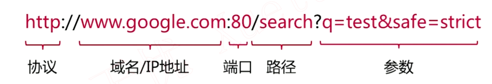

### 2.2域名 DNS 的解析过程

域名解析简图


从右向左解析域名
- 域名都会省略掉`.root`根域名


域名的层级
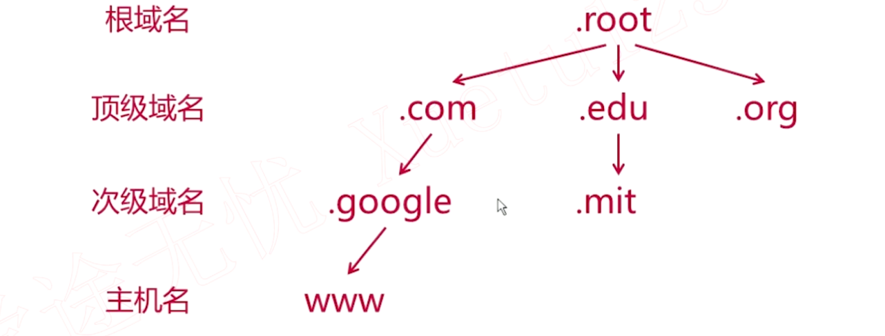

### 2.3 域名 DNS 查询的两种方式：递归与迭代

DNS递归查询
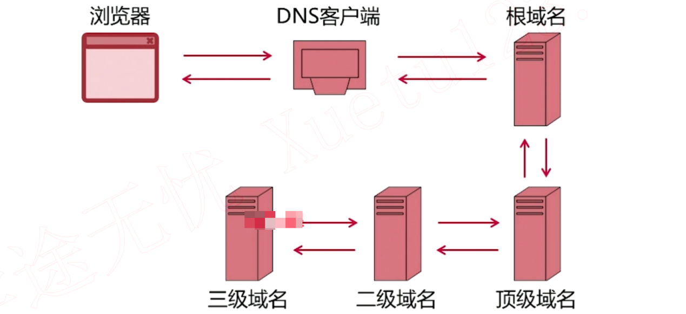


DNS迭代查询
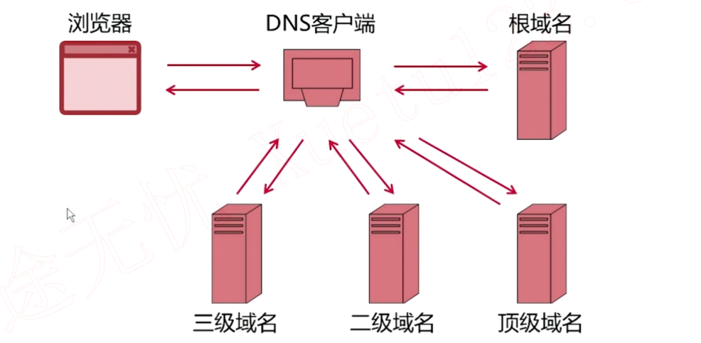

### 2.4 网络协议快速扫盲

五层协议
- 应用层：最接近用户的一层
- 传输层：可以端口到端口的连接
- 网络层：主机到主机的联系
- 链路层：网卡和网卡之间的传输
- 实体层：真实的机器的连接了，光缆变成电信号

为什么需要这么多层来处理
- 每一层只需要依赖于它的下一层，不需要关心其他层的实现，并且每层的变化如果不影响它的上一层的功能，这样是可以进行更改的。不需要担心其他层的改变

### 2.5 网络协议分门别类

各协议层级
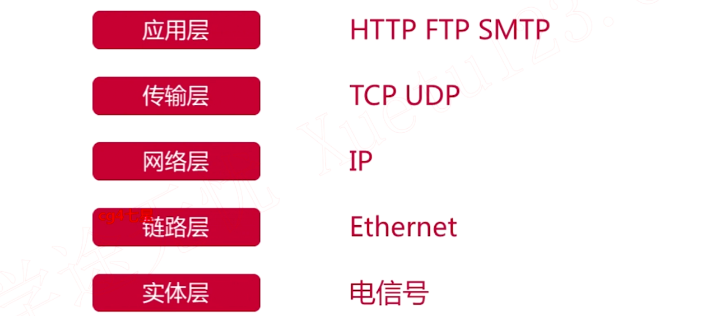


### 2.6 连接一切(物理、网卡、主机、端口的连接)

| 层级 |  应用 |
|----------|---------------|
|   实体层        | 计算机之间的物理连接 |
|   链路层        | 网卡之间的连接（mac地址） |
|   网络层        | 主机之间的连接 |
|   传输层        | 端口之间的连接 |
|   应用层        | 应用程序数据格式 |

### 2.7 网络各个层的数据包格式

链路层数据包格式
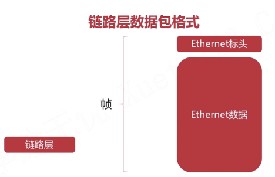

网络层数据包格式
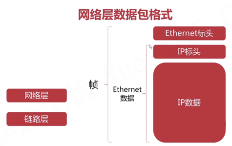

传输层数据包格式
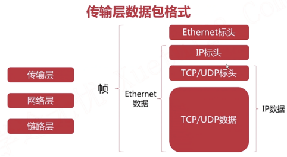

应用层数据包格式
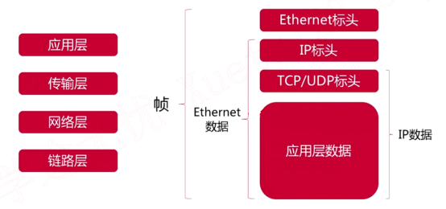

## 3.解读java.io专业术语

### 3.1 java.io 之字符流

网络编程的本质是进程间通信


通信的基础是 IO 模型对象、字符串都可以是数据源
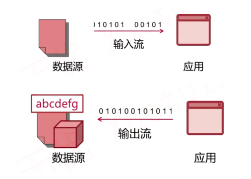

java.io划分
- 字节是可以操作的最小单位，而字符方便阅读。

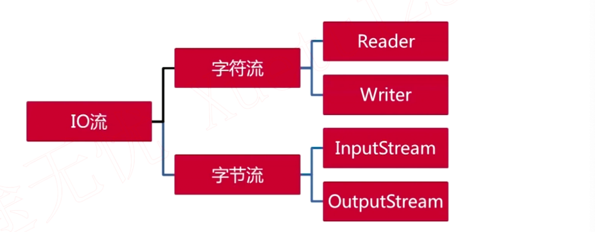

字符流
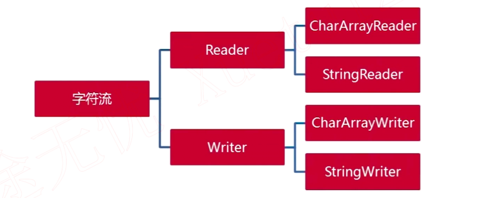

- Reader 和 Writer并不是独立存在，都好像是叠加在另外一个 Reader或Writer 之上一起来作用的，在创建的时候，都需要再额外的传入一个 Reader或Writer 才可以。
- InputStreamReader：字节流和字符流连接桥梁
- FileReader：对InputStreamReader进行了封装，文件底层都是字节，可以直接读字节，然后封装成字符流，进行数据的读取

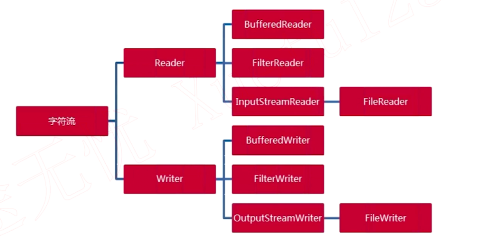


### 3.2 java.io 之字节流

基本字节流
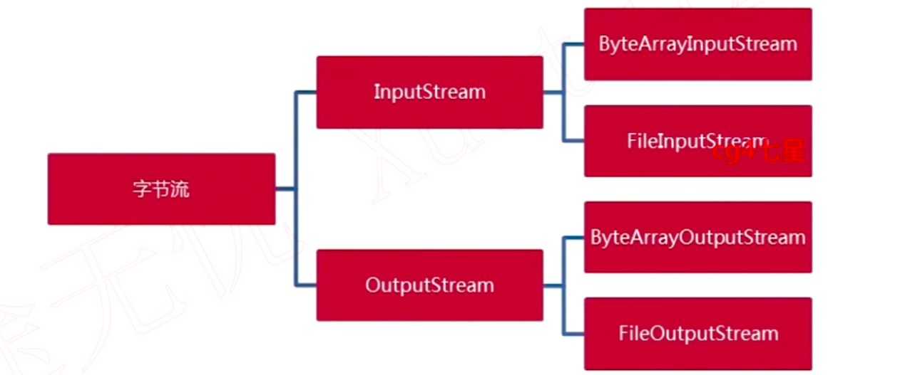

高级字节流
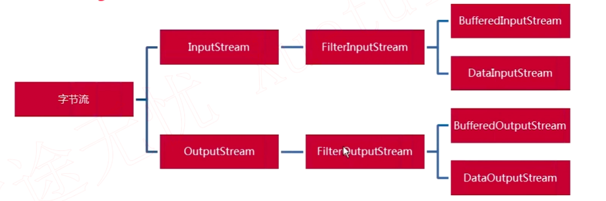

java.io 里面的装饰器模式
- 稍微高级一点的流处理类`FilterReader`、`FilterInputStream`、`BufferedReader`、`BufferedInputStream`等，在创建这样类的时候，他不是独立存在的，而是要在创建的时候传入另外的一个比较基本的输入或输出流，然后在传入的这个类之上在额外添加一些功能，这种设计模式称为装饰器模式。

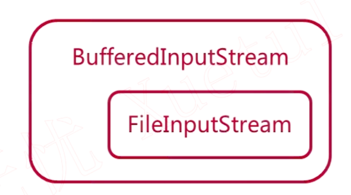

奶茶店里面的装饰器模式
- 奶茶加了点珍珠（装饰）之后，珍珠奶茶还是奶茶，加了点装饰性的配料，任然是奶茶，并不改变其基本的属性。
- 装饰器模式简单的来说就是可以在原有东西的基础上叠加一些新的功能特性，但是叠加之后的对象任然不改变其基础属性，加了珍珠的奶茶还是奶茶，加了缓冲区的`FileInputStream`还是一个`InputStream` 并不改变其基本属性。

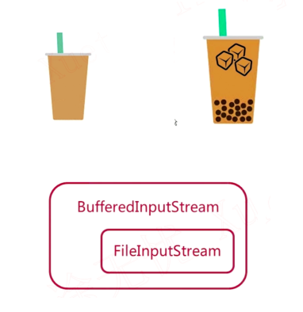


### 3.3 Socket 概述

多种多样的数据源
- Socket 也是一种数据源

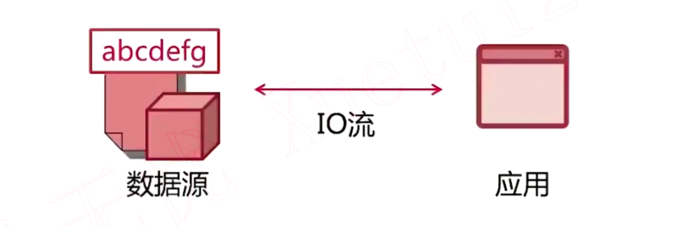

Socket网络通信的端点
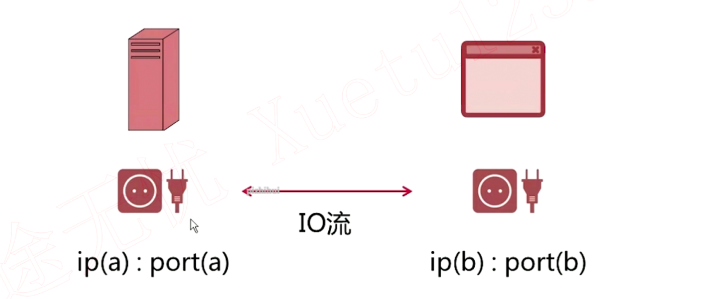


通过 Socket 发送数据
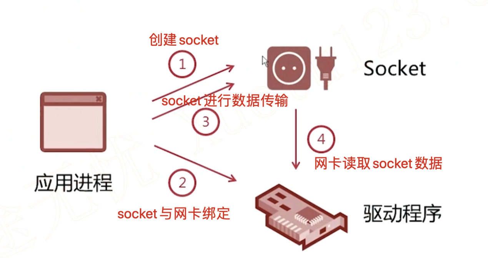

通过 Socket 读取数据
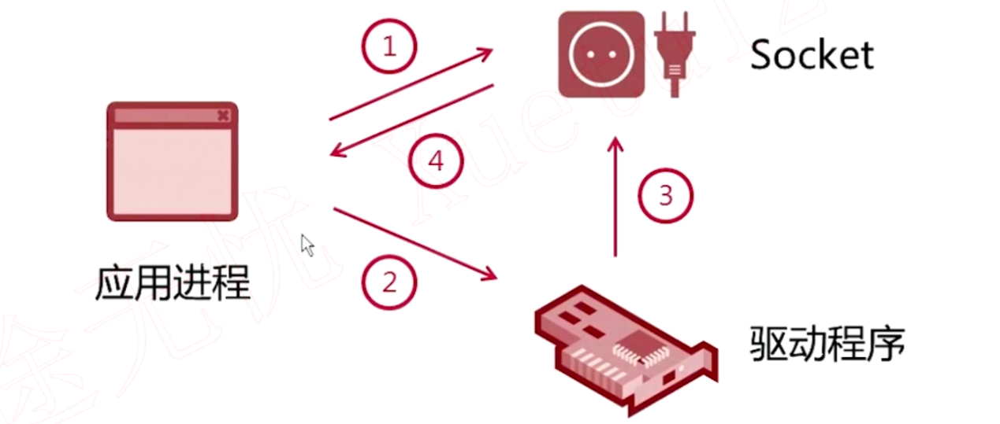

### 3.4 同步异步-阻塞非阻塞

同步通信机制
- 类似男孩向女孩表白，女孩陷入沉思，在考虑要不要接受男孩的表白，男孩同时也在默默的等待，直到女孩做出回应


异步通信机制
- 男孩向女孩表白，女孩立马有可能说那你给我几天时间考虑，等我考虑考好了过几天我给你发个消息告诉你结果，男孩此时并不知道最终的结果。


阻塞
- 男孩子向女孩子表白之后，不管女孩什么反应，男孩什么事情都干不了了，茶饭不思，就一心一意的想着女孩子会不会接受，这种情况就非常类似于阻塞式调用。指发出请求的一方在等待调用的结果，在收到结果之前什么都干不了，专心的等待调用结果。

非阻塞式调用
- 男孩子表白之后，不管女孩子说先让我回去想几天，还是啥的，这时候男孩子还是很活跃，他并没有每天24小时想着这件事情，他一会去打打游戏，一会去打打球。即在收到结果之前完全没有收到任何影响，这就类似于非阻塞式调用。


同步和异步是通信机制的不同（同步与异步可以简单认为是被调用者的工作模式）
阻塞和非阻塞是等待消息的结果的不同的状态（阻塞与非阻塞可以简单认为是调用者的工作模式）

关于同步与异步、阻塞与非阻塞这篇文章介绍的也不错：`https://www.cnblogs.com/linkenpark/p/12376343.html`

同步阻塞：发送消息后，傻等结果，不等到结果坚决不干任何事，对方处理完后返回结果

异步阻塞：发送消息后，傻等结果，不等到结果坚决不干任何事，对方会先响应一个状态给调用者，有结果后再返回。

同步非阻塞：发送消息后，我并没有傻等结果，同时可以干别的事，对方处理完成后返回结果

异步非阻塞：发送消息后，我并没有傻等结果，同时可以干别的事，对方会先响应一个状态给调用者，有结果后再返回。

排列组合
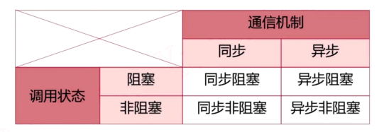


### 3.5 网络通信中的线程池

多个线程并发处理
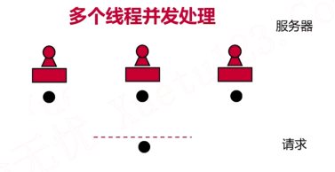

多线程处理中的代价，创建和回收线程都是比较昂贵的操作，都是很耗资源的。
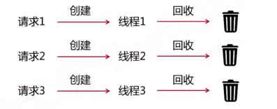

线程池线程复用
- 频繁创建和回收线程是很耗资源的，可以用复用线程的方法来解决
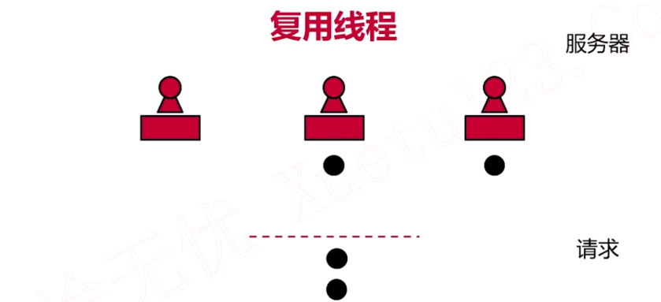

Java 提供的线程池
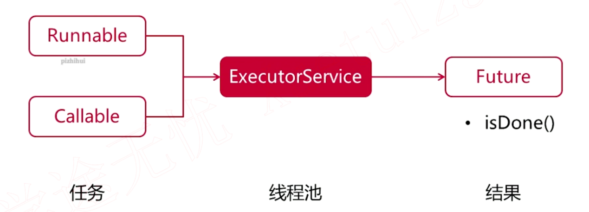

java 提供的创建线程池的方法
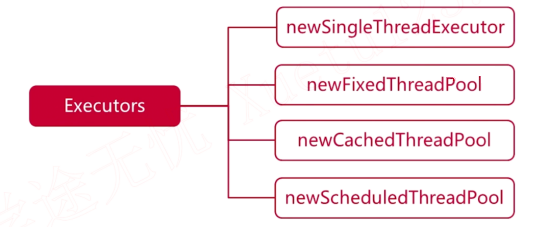


## 4.JavaIO的“前世”：BIO阻塞模型

通过分析BIO编程模型，了解BIO设计思想掌握BIO编程核心类和网络编程原理

### 4.1 Socket与ServerSocket
客户端和服务端的流程
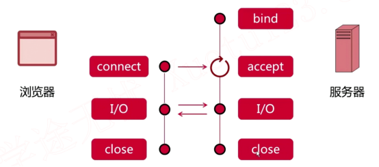

### 4.2 实战：ServerSocket
`Server.java`
```java
public class Server {
    public static void main(String[] args) {
         final int DEFAULT_PORT = 8888;
         ServerSocket serverSocket = null;     
         try {
             // 绑定监听端口
             ServerSocket = new ServerSocket(DEFAULT_PORT);  
             System.out.println("启动服务器，监听端口" + DEFAULT_PORT);
             while (true) {
                // 等待客户端连接
                Socket socket = serverSocket.accept();
                System.out.println("客户端[" + socket.getPort() + "]已连接");
                BufferedReader reader = 
                   new BufferedReader(new InputStreamReader(socket.getInputStream()));
                BufferedWriter writer = 
                   new BufferedWriter(new OutputStreamWriter(socket.getOututSream()));
                // 读取客户端发送的消息，这个时候只能读取一行的消息，后面改善
                String msg = reader.readLine();
                if (null != msg) {
                    System.out.println("客户端[" + socket.getPort + "]: " + msg);
                    // 回复客户端发送的消息
                    writer.write("服务器:" + msg + "\n");
                    writer.flush(); // 缓冲区的数据发送出去
                }
             }
         } catch (Exception e) {
           e.printStackTrace();
         } finally {
            if (null != serverSocket) {
               try {
                  serverSocket.close();
                  System.out.println("关闭ServerSocket");  
               }catch(Exception e) {}
            }
         }
    }
}
```


### 4.3 实战：Socket
`Client.java`
```java
public class Client {
    public static void main(String[] args) {
         final String DEFAULT_SERVER_HOST = "127.0.0.1";
         final int DEFAULT_PORT = 8888;
         Socket socket = null;
         BufferedWriter writer;
         try {
            // 创建 socket
            socket = new Socket(DEFAULT_SERVER_HOST, DEFAULT_PORT);
            // 创建 IO 流
            BufferedReader reader = 
               new BufferedReader(new InputStreamReader(socket.getInputStream()));
            writer = 
               new BufferedWriter(new OutputStreamWriter(socket.getOutputStream()));
            // 等待用户输入信息
            BufferedRaeder consoleReader = 
               new BufferedRreader(new InputStreamReader(System.in));
            String input = consoleReader.readLine();
            // 发送消息给服务器
            writer.write(input + "\n");
            writer.flush();
            // 读取服务器返回的消息
            String msg = reader.readLine();
            System.out.println("" + msg); 
         } catch(IOException e) {
            
         } finall {
           if (null != writer ) {
              try {
                writer.close();
                System.out.println("关闭 Socket");     
              } catch(){}              
           }
        }
    }
}
```

### 4.4 运行简单的服务器客户端实例

运行 Server 和 Client 的代码

### 4.5 运行改进的服务器客户端实例

1. 客户端可以一直发送数据，如果发送的是 quit 的数据，那么服务器就关闭，客户端这个时候也需要关闭

- 服务端
```java
public class Server {
    public static void main(String[] args) {
         final String QUIT = "quit"; 
         final int DEFAULT_PORT = 8888;
         ServerSocket serverSocket = null;     
         try {
             // 绑定监听端口
             ServerSocket = new ServerSocket(DEFAULT_PORT);  
             System.out.println("启动服务器，监听端口" + DEFAULT_PORT);
             while (true) {
                // 等待客户端连接
                Socket socket = serverSocket.accept();
                System.out.println("客户端[" + socket.getPort() + "]已连接");
                BufferedReader reader = 
                   new BufferedReader(new InputStreamReader(socket.getInputStream()));
                BufferedWriter writer = 
                   new BufferedWriter(new OutputStreamWriter(socket.getOututSream()));
                String msg = null;
                while((msg = reader.readLine()) != null) {
                      System.out.println("客户端[" + socket.getPort + "]: " + msg);
                       // 回复客户端发送的消息
                       writer.write("服务器:" + msg + "\n");
                       writer.flush(); // 缓冲区的数据发送出去
                       // 查看客户端是否退出，其实这里的代码不用写，因为如果客户端的 Socket 关闭的话，那么 readerLine的返回的内容是 null 的，也就不会进入这个循环了
                       if(QUIT.equals(msg)) {
                          System.out.println("客户端[" + socket.getPort + "]已断开");
                          break;
                       }
                  }
                }                
             }
         } catch (Exception e) {
           e.printStackTrace();
         } finally {
            if (null != serverSocket) {
               try {
                  serverSocket.close();
                  System.out.println("关闭ServerSocket");  
               }catch(Exception e) {}
            }
         }
    }
}
```
- 客户端
```java
public class Client {
    public static void main(String[] args) {
         final String QUIT = "quit";
         final String DEFAULT_SERVER_HOST = "127.0.0.1";
         final int DEFAULT_PORT = 8888;
         Socket socket = null;
         BufferedWriter writer;
         try {
            // 创建 socket
            socket = new Socket(DEFAULT_SERVER_HOST, DEFAULT_PORT);
            // 创建 IO 流
            BufferedReader reader = 
               new BufferedReader(new InputStreamReader(socket.getInputStream()));
            writer = 
               new BufferedWriter(new OutputStreamWriter(socket.getOutputStream()));
            // 等待用户输入信息
            BufferedRaeder consoleReader = 
               new BufferedRreader(new InputStreamReader(System.in));
            while(true) {
               String input = consoleReader.readLine();
              // 发送消息给服务器
              writer.write(input + "\n");
              writer.flush();
              // 读取服务器返回的消息
              String msg = reader.readLine();
              System.out.println("" + msg); 
              // 查看用户是否退出
              if(QUIT.equals(input)) {
                  break;
              }
            }            
         } catch(IOException e) {
            
         } finall {
           if (null != writer ) {
              try {
                writer.close();
                System.out.println("关闭 Socket");     
              } catch(){}              
           }
        }
    }
}
```

## 5.实战：基于BIO的多人聊天室设计与实现


### 5.1 BIO编程模型简析
jdk1.4 之前对 IO 的支持比较简单，都是使用 BIO，就是 Block IO 的模型来进行编码

BIO 编程模型如图，acceptor 是阻塞的，那么新来的客户端是怎么处理得的？就是新建一个 Handler 的线程去处理，这样就不阻塞了当前的客户端了，所以第二个客户端就可以继续与服务器端发送消息。

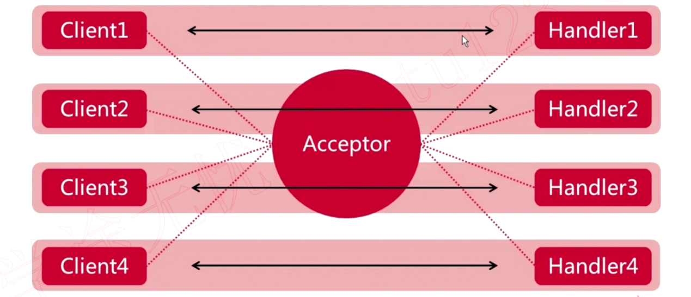

### 5.2 多人聊天室功能概述

需要实心的功能
- 基于BIO模型
- 支持多人同时在线
- 每个用户发言都被转发给其他在线用户

### 5.3 多人聊天室设计

Client1 发送消息的时候，Handler1 需要发送给其它客户端，因此需要存储一下所有客户端的列表的集合

客户端在等待输入文本的时候，这个时候是阻塞的，那么这个时候还需要收到其他客户端发送的消息，所以客户端需要两个线程来做这两件事请


### 5.4 多人聊天室设计UML建模之时序图

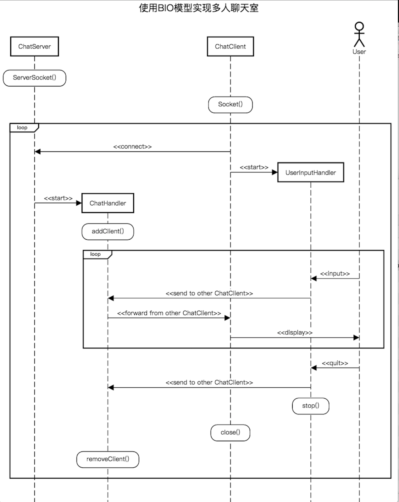

ChatHandler 是启动的一个新的线程，首先在这个线程里面添加客户端到客户端集合里面，这个时候客户端输入的是一个阻塞的函数，为了同时能够收到消息，新建一个 UserInputHandler 的线程，专门处理用户输入的线程。如果有输入，就发送给服务器端发送消息

用户发送 "quit" 消息的时候，这个时候服务器端就知道某个客户端要退出了，首先要做的事情就是先移除客户端列表，然后客户端关闭 socket

最外面的 loop 循环的大框，就是服务器的一个主要的循环，一直在等待 accept 函数的执行，如果有就新建一个 Handler 去进行处理


### 5.5 实现服务端：ChatServer

不停的监听和接收客户端的消息

转发给在线的所有的客户端

需要保存所有的在线客户端列表

当用户输入 quit 的时候，这个客户就不想留在服务器端，就需要将它从在线用户列表中移除

```java
public class ChatServer {
    private int DEFAULT_PORT = 8888;
    private final String QUIT = "quit";
   
    private ServerSocket serverSocket;
    // 连接的客户端列表，value 是需要写消息的 writer
    private Map<Integer, Writer> connectedClients;
    
    public ChatServer() {
       connectedClients = new HashMap();
    }
    
    // 添加客户端
    public synchronized void addClient(Socket socket) throws IOException {
        if(null != socket) {
            int port = socket.getPort();
            OutputStream out = scoket.getOutputStream();
            BufferedWriter writer = new BufferedWriter(new OutputStreamWriter(out));
            connectedClients.put(port, writer); // 线程安全问题，用synchronized关键字解决
            System.out.println("客户端[" + port + "已经连接到服务器");
        }
    }
    // 移除客户端，还需要关闭
    public synchronized void removeClient(Socket socket) throws IOException {
       if(null != socket) {
           int port = socket.getPort();
           if(connectedClients.containsKey(port)) {
              Writer writer = connectedClients.get(port);
               writer.close();
           }
           connectedClients.remove(port);
System.out.println("客户端[" + port + "已经断开连接");
       }
    }
    // 转发消息给所有的客户端
    public synchronized void forwardMessage(Socket socket, String fwdMsg) 
                                       throws IOException {
        for(Map.Entry<Integer, Writer> entry: connectedClients.entrySet()) {
           int port = entry.getKey();
           if((socket.getPort != port)) {
               Writer writer = entry.getValue();
               writer.writer(fwdMsg);
               writer.flush();
           }
        }
    }

    // 检查是否退出
    public boolean readToQuit(String msg) {
         return QUIT.equals(msg);
    }
   
    // 关闭
    public synchronized void close() {
       if(null != serverSocket) {
           try {
               serverSocket.close();
           }catch(Exception e) {
               e.printStackTrace();
           }
       }
    }

    // 启动逻辑
    public void start() {
        try {
            // 绑定监听端口
            serverSocket = new ServerSocket(DEFAULT_PORT);
            System.out.println("启动服务器，监听端口"  + DEFAULT_PORT + "...");

            while(true) {
                // 等待客户端的连接
                Socket socket = serverSocket.accept();
                // 创建 ChatHandler线程
                new Thread(new ChatHandler(this, socket)).start();
            }
        } catch (Exception e) {
           e.printStackTrace();
        } finally {
           close();
        }
   }

    public static void main(String[] args) {
        ChatServer chatServer = new ChatServer();
        chatServer.start();        
    }
}
```

### 5.6 实现监听器：ChatHandler

需要 ChatServer 的对象：很多的操作都是依赖于 ChatServer 的 connectedClients 对象

需要客户端的 Socket 对象

前面的 ChatServer 代码中添加 readToQuit 方法代码

最后需要注意线程安全问题，需要注意一下

```java
public class ChatHandler implements Runable{
   private ChatServer server;
   private Socket socket;
   
   public ChatHandler(ChatServer server, Socket socket) {
      this. server = server;
      this.socket = socket;
   }
   
   @Ovverride
   public void run() {
      try {
         // 存储新上线用户
         server.addClient(socket);
         // 读取用户发送的消息
         BufferedReader reader = 
               new BufferedReader(new InputStreamReader(socket.getInputStream()))
         // readLine是一直阻塞的，除非收到换行符就会读取
         String msg = null;
         while ((msg = reader.readLine()) != null) {
             String fwdMsg = "客户端[" + socket.getPort + "]:" + msg + "\n";
             System.out.println(fwdMsg );
             // 将消息转发给聊天室在线的其他用户
             server.forwadMessge(socket, fwdMsg);
             // 检查是否准备退出
             if(server.readToQuit()) {
                 break; // 如果收到退出命令，那么就直接退出
             }
         }
      }catch(IOException e) {
         e.printStachTrace();
      } finall{
         try {
           server.removeClient(socket); 
         }catch(Exception e) {
           e.printStachTrace();
         }
      }
   }
}
```

### 5.7 实现客户端：ChatClient

先完成主线程：将消息发送给服务器，接收服务器返回的消息

```java
public class ChatClient {
   private String DEFAULT_SERVER_HOST = "127.0.0.1";
   private int DEFAULT_SERVER_PORT = 8888;
   private final String QUIT = "quit";
   
   private Socket socket; 
   private BufferedReader reader;
   private BufferedWriter writer;
   
   public ChatClinet() {
      
   }

   // 发送消息给服务器
   public void send(String msg) throws IOException {
     if(!socket.isOuputShutdown()) {
        writer.write(msg + "\n");
        writer.flush();
     }
   }  
 
   // 接收消息从服务器
   public String receive() {
      String msg = null;
      if(!socket.IsInputShutdown()){
        try{
          msg = reader.readLine();  
}catch(IOException e){
  e.printStackTrace();
}       
      }
      return msg;
    }

    // 检查是否退出
    public boolean readyToQuit(String msg) {
        return QUIT.equals(msg);
    }

    public void close() {
       if(null != writer) {
          try {
             wirter.close();
          } catch (Exceptio e) {
             e.printStackTrace();
          }
       }
    }	
     
    public void start() {
       
       try {
          // 创建 Socket
          socket = new Socket( DEFAULT_SERVER_HOST, DEFAULT_SERVER_PORT);
          // 创建 IO 流
          reader = new BufferedReader(new InputStreamReader(socket.getInputStream()));
          writer = new BufferedWriter(new OutStreamWriter(socket.getOutputStream));

          // 处理用户的输入(需要额外开线程来进行处理)
          new Thread(new UserInputHanderl(this)).start();
          
          // 时刻监听是否有从服务器其他用户发过来的消息
          String msg = null;
          while ((msg = receive()) != null) {
             System.out.println(msg);
          }
       } catch (Exception e) {
         e.printStackTrace();
       } finally {
          close();
       }
       
    }
    
    public static void main(String[] args) {
         ChatClient chatClient = new ChatClient();
         chatClient.start();
    }
}
```

### 5.8 实现：UserInputHandler

实现用户输入监听器

```java
public class UserInputHandler implements Runable {
   private ChatClient chatClient;
   
   public UserInputHandler(ChatClient chatClient) {
      this.chatClient = chatClient;
   }
   @Ovveride
   public void run() {
      // 等待用户输入信息
      BufferedReader consoleReader = 
             new BufferedReader(new InputStreamReader(System.in));
      whie(true) {
         try {
            String input = consoleReader.readLine();
            // 向服务器发送消息
            chatClient.send(input);
            // 检查用户是否退出
            if (chatClient.readyToQuit(input)) {
                 break;
            }
         } catch (Exception e) {
            e.printStrackTrace();
         }         
      }
   }
}
```


### 5.9 多人聊天室演示

### 5.10 伪异步IO编程模型简析

之前说的BIO模型简单是简单，不过伸缩性不是太好，10个客户端就是10个线程，100个客户端就是100个线程，那么成千上万的客户端来了？不可能创建成千上万的线程来进行处理的，这个是不现实的。

解决办法：通过线程池来解决线程随着客户端增加而增加的问题，增加线程的复用性。

伪异步IO编程模型。增加了线程池的模型，就不会导致突然客户端增加的时候，服务器的资源紧张都用完的情况。

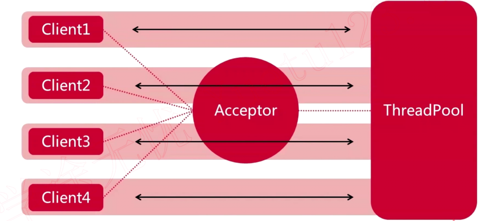


### 5.11 使用伪异步IO改进多人聊天室

聊天场景中，适合使用哪种线程池了？

限制线程池的数量

```java
public class ChatServer {
   private ExecutorService executorService;

   public ChatServer() {
      // 创建固定的线程
      this. executorService = Executors.newFixedThreadPool(10);
   }
   
   public void start() {
       while(true) {
           // 改造这一段代码
           // new Thread(new ChatHandler(this, socket)).start();
           // 修改为下面的代码
           executorService.execute(new ChatHandler(this, socket));
       }
   }  
    
}
```

## 6.JavaIO的“今生”：NIO非阻塞模型

### 6.1 NIO概述

回顾下 BIO 阻塞的部分
- ServerSocket.accept()
- InputStream.read()
- OutputStream.write()
- 无法在同一个线程里处理多个Stream IO


NIO非阻塞式 New IO 或者 Non-Blocking IO，两种解释都是可以的

要不停的问 channel，数据是否准备好了？
- 使用 Channel 代替 Stream
- 使用 Selector 监控多条 Channel
- 可以在一个线程里处理多个 Channel IO


盲目使用线程需要考虑的因素
- 线程的上下文的切换
- 创建线程的所需要的资源

### 6.2 Buffer简析

clear()

compact()

Channel 是双向的，即可以读也可以写，向 Channel 读或写都是通过 Buffer，可以理解为Buffer也是可以读和写

Buffer 其实就是内存上的一片可以读写的区域


Buffer 内部有三个主要的指针式的结构
- `capacity` 代表Buffer的容量大小
- `position` 指示目前所在的位置
- `limit` 初始的时候位置与 `capacity` 相同

```text
# 其值大小关系
0 <= mark <= position <= limit <= capacity
```

向 Buffer 写入数据
- 创建一个 Buffer 对象的时候，会设置一个大小，最初的位置

  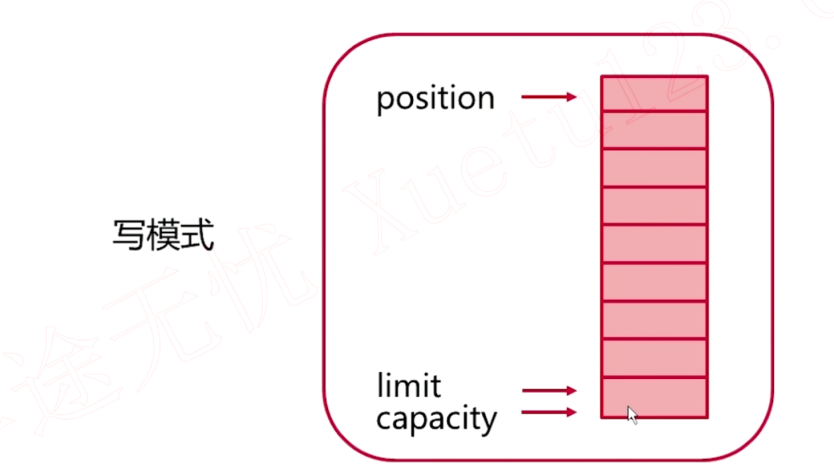

- 往Buffer中写数据，空白格子部分假设是写入的数据

  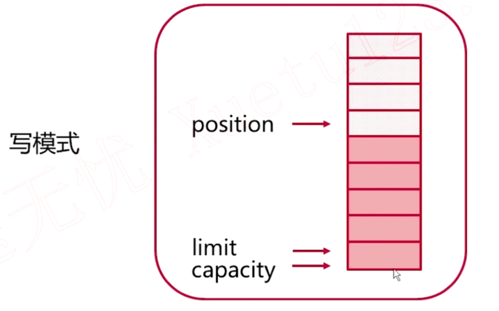
  
- 然后想要读取刚刚写入的数据的时候需要用到 `flip`，就是翻转一下，写变为读模式
  - 调整 `position` 指针位置到开始位置
  - 调整 `limit` 指针位置到上次写入的结束位置

  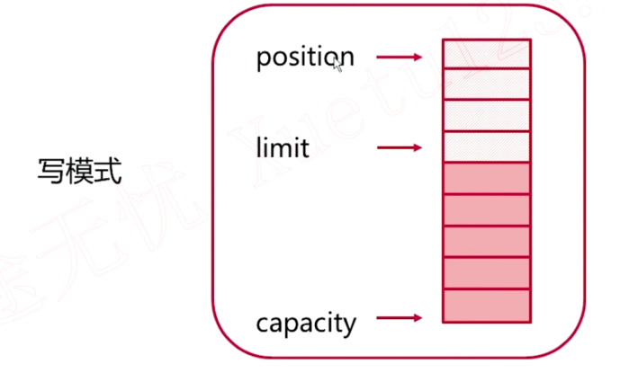

读取的模式
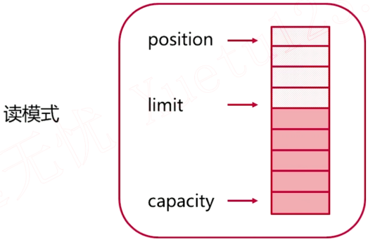

- 第一种读取的情况：一口气读完，读到limit指针的位置

  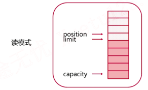

  - 这个时候想写数据了，需要 `clear()` 翻转。如图其实 `clear()` 只是移动了指针，并没有清除 buffer 里面的数据
  
  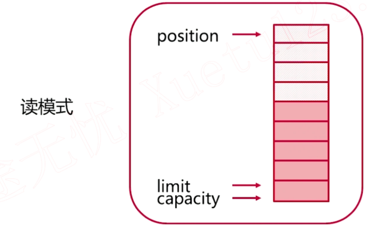

- 另外的一种读取的数据的情况：读取部分数据后面未读的数据保留起来，以后来读，但是这个时候调整为写模式，希望的就是写完数据后，上次没有读完的数据依然能读取出来。`compact()` 方法就能达到这个目的
  - 这里假设前3条数据是已读的，第4条数据是还没有来得及读完，但是又想在之后继续读取的数据。

  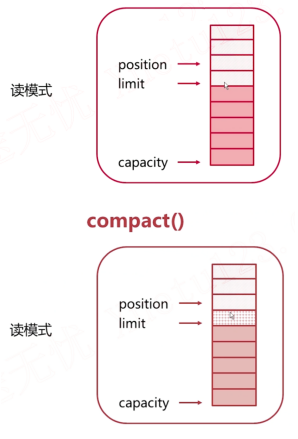

`compact()`函数会把未读取的数据拷贝到整个 Buffer 最开始的位置，也就是说，下次如果再要读数据的话，未读的数据肯定是出现在 Buffer 对象的最开始的位置。之后会把 position 指针移动到未读的数据的接下来的位置

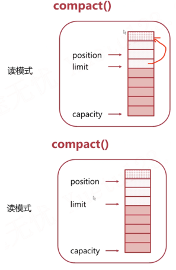

接下来，`limit`指针移动到与`capacity`同样的位置，之后由读模式翻转回写模式

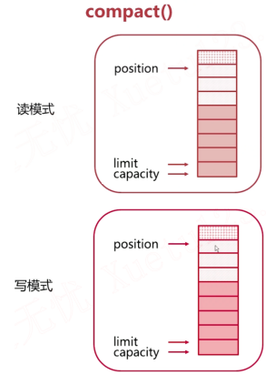

之后再想写数据，就会从`position`所指的位置开始写，这样就不会覆盖掉上一次读取模式时还没有读完的数据。

### 6.3 Channel简析

NIO 中要就操作的数据打包到缓冲区中，而缓冲区中的数据想要传输到目的地就要依赖于 Channel。

Channel 之间是可以传输数据

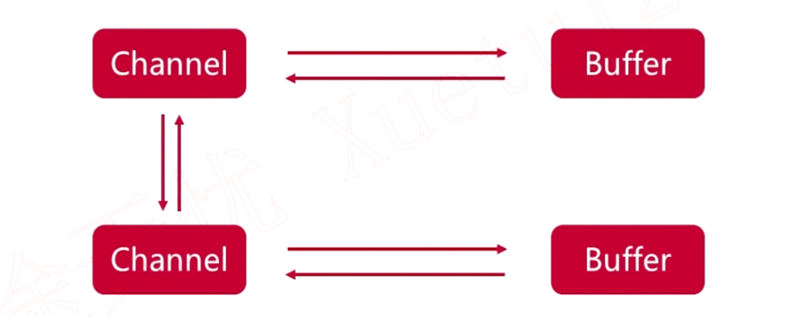

几个重要的 channel

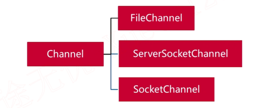


### 6.4 实战：多方法实现本地文件拷贝

本地进行文件拷贝几种不同的文件拷贝方式
- 传统文件流实现文件拷贝可使用缓冲流和不使用缓冲流
- 然后就是通过 NIO实现文件拷贝
  ```java
  interface FileCopyRunner {
      // source 文件拷贝到 target 的文件中
      void copyFile(File source, File target);
  }
  public class FileCopyDemo {
  
          private static void close(Closeable close) {
             if(null != close) {
                try{
                   close.close();
  }catch(Exception e){
     e.printStackTrace();
  }
             }
          }
           
          // 不使用用任何缓冲的流进行拷贝文件
          private static FileCopyRunner noBufferStreamCopy = (source, target) -> {
               InputStream fin = null;
               OutputStream fout = null;
               try {
                   fin = new FileInputStream(source);
                   fout = new FileOutputStream(target);
                   int result;
                   whie((result = fin.read()) != -1) {
                      fout.write(result);
                   }
               } catch (Exception e) {
                  e.printStackTrace(); 
               } finally {
                  close(fin); 
                  close(fout);
               }
          };
          
          // 使用缓冲进行拷贝文件
          private static FileCopyRunner bufferedStreamCopy = (source, target) -> {
              InputStream fin = null;
              OutputStream fout = null;
              try {
                 fin = new BufferedInputStream(new FileInputStream(source));
                 fout = new OutputStream(new OutputStream(target));
                 byte[] buffer = new byte[1024];
                 int result;
                 // 最多读取 1024 个字节，如最后一次，可能只剩 10 个字节，
                 // result 就是 buffer 读取的字节数
                 while((result != fin.read(buffer)) != -1) {
                    fout.write(buffer, 0, result); 
                 }                
              }catch(Exception e) {
                e.printStackTrace(); 
              } finally {
                close(fin);
                close(fout);
              }
          };
  
          
          // 使用 nio 的 buffer 进行拷贝文件
          private static FileCopyRunner nioBufferCopy = (source, target) -> {
              FileChannel fin = null;
              FileChannel fout = null;
              
              try {
                  fin = new FileInputStream(source).getChannel();
                  fout = new FileInputStream(target).getChannel();
                  ByteBuffer buffer = ByteBuffer.allocate(1024);
                  while(fin.read(buffer) != -1) {
                     buffer.flip(); // 转换为写的模式
                     while(buffer.hasRemaing())  {
                          fout.write(buffer);
                     }
                     buffer.clear(); // 调整为读模式
                  }
              } catch (Exception e) {
                 e.printStackTrace();
              } finally {
                 close(fin);
                 close(fout);
              }
          };
          
          // 使用 nio 直接进行拷贝
          private static FileCopyRunner nioTransferCopy = (source, target) -> {
              FileChannel fin = null;
              FileChannel fout = null;
              
              try {
                  fin = new FileInputStream(source).getChannel();
                  fout = new FileInputStream(target).getChannel();
                  
                  long transferred = 0L;
                  long size = fin.size();
                  while(transferred != size) {  
                    // 如果拷贝的大小没有达到源文件的大小就一直拷贝
                    transferred += fin.transerTo(0, size, fout);
                  }
                                  
              } catch (Exception e) {
                 e.printStackTrace();
              } finally {
                 close(fin);
                 close(fout);
              }
          };
  }
  ```

### 6.5 本地文件拷贝测试

测试文件拷贝
```java
public class FileCopyDemo {
   
   private static final int ROUNDS = 5; 
   
   private static void benchmark(FileCopyRunner test, File source, File target) {
      long elapsed = 0L;
      for (int i = 0; i < ROUNDS; i++) {
          long startTime = System.currentTimeMillis();
          test.copyFile(source, target);
          elapsed += System.currentTimeMillis() - startTime;
          target.delete();
      }
      System.out.println(test + ":" + elapsed / ROUNDS);
      
   }
    
   File smallFile = new File("/var/tmp/smallFile");
   File smallFileCopy = new File("/var/tmp/smallFile-copy");

   System.out.println("---Copying small file---");
   benchMark(noBufferedStreamCopy, smallFile, samllFileCopy);
   benchMark(bufferedStreamCopy, smallFile, samllFileCopy);
   benchMark(nioBufferedCopy, smallFile, samllFileCopy);
   benchMark(nioTransferCopy, smallFile, samllFileCopy);

   File bigFile = new File("/var/tmp/smallFile");
   File bigFileCopy = new File("/var/tmp/smallFile-copy");

   System.out.println("---Copying bigFile file---");
   benchMark(noBufferedStreamCopy, bigFile , bigFileCopy );
   benchMark(bufferedStreamCopy, bigFile , bigFileCopy );
   benchMark(nioBufferedCopy, bigFile , bigFileCopy );
   benchMark(nioTransferCopy, bigFile , bigFileCopy );

   File hugeFile = new File("/var/tmp/smallFile");
   File hugeFileCopy = new File("/var/tmp/smallFile-copy");

   System.out.println("---Copying hugeFile file---");
   benchMark(noBufferedStreamCopy, hugeFile , hugeFileCopy );
   benchMark(bufferedStreamCopy, hugeFile , hugeFileCopy );
   benchMark(nioBufferedCopy, hugeFile , hugeFileCopy );
   benchMark(nioTransferCopy, hugeFile , hugeFileCopy );
   
}
```

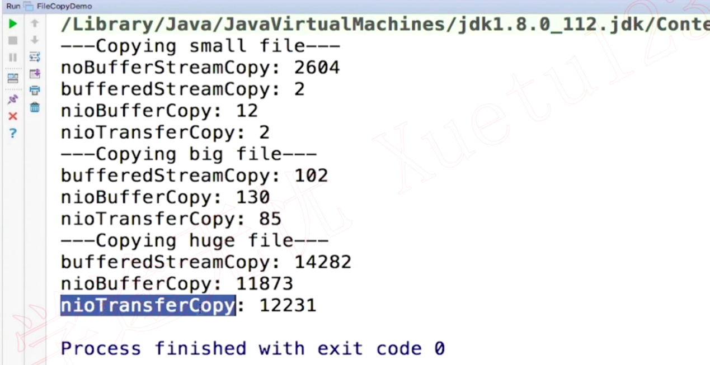

总结：nio 的效果在文件很大的时候是有一定效果的，文件小的小时候并不明显，为什么？
- nio 是 1.4 版本推出的。后面版本传统的 IO 底层实现已经修改为 nio 的实现了。表现的效果就是不那么明显了


### 6.6 Selector 简析

通道如果是处于空闲状态的时候，`selector` 可以监听多个通道的是否是空闲状态

首先 Channel 需要注册在 Selector 上

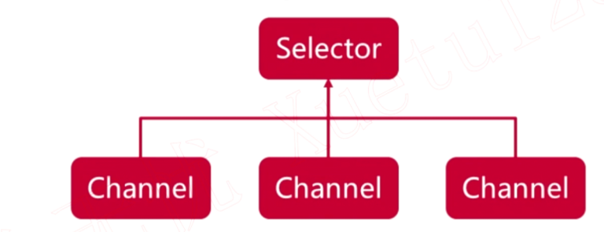

根据 Channel 的不同状态，就可以对 Channel 进行不同的操作。


Selector 上的具体方法后面用具体的实例来演示及 SelectionKey 的作用。

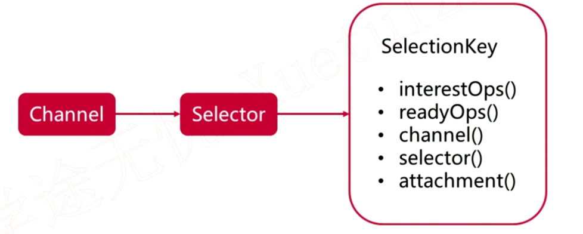

假设这个时候已经有了 Selector 了。

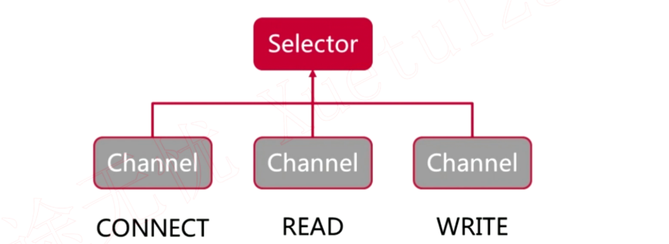

下图有一个 Channel 变为 connect 的状态，拿到 SelectionKey 就可以进一步拿到其对象。

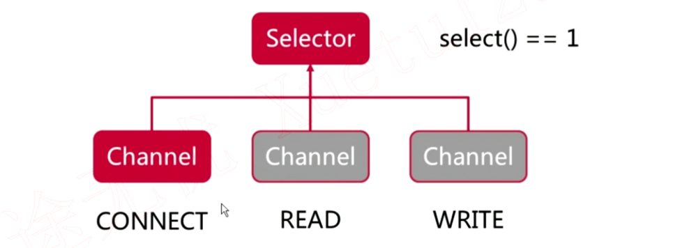

如下一步操作，第二个 Channel 进入了 read 状态，第三个 Channel 进入了 write 状态。

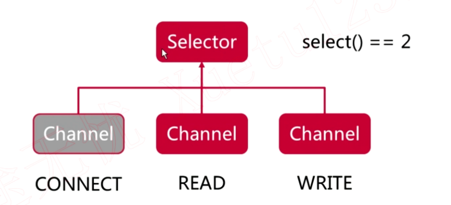

## 7.实战：使用NIO改造多人聊天室

### 7.1 NIO编程模型

使用 Selector 来监视各个不同的 Channel（不同的聊天室的客户）

注册 Accept 事件，让 Selector 监视 Accept 事件
- 当有客户端发送连接请求，服务接受了连接请求的时候，相当于触发了这个 Selector 上的 Accept 事件，效果与 BIO 编程模型上的 accept() 函数的效果是一样的


接受了客户端的连接，触发了 Accept 事件后使用 handles 来处理建立连接的客户端

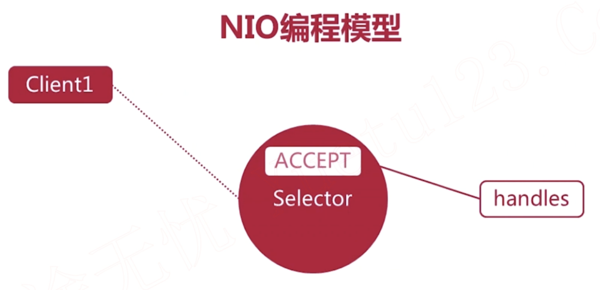

之后为新连接的客户端再到 Selector 上注册一个 read 事件
- 意思是告诉 Selector 有一个新的客户与建立了连接，Selector 要监视这个客户的 socket channel 通道上是否触发了 read 事件，即在客户向服务器发送了数据之后，那么在这个客户的 socket
 channel 上就有可供服务器读取的数据。
- 这里处理都是在 Selector 同一个线程中所进行的（之前使用bio编写的多人聊天的案例中 accept 是在主线程中的，之后又开启了一个新的线程等待客户端向服务端发送消息，即使客户端什么都没有做，也必须阻塞在哪里等待客户发送消息）

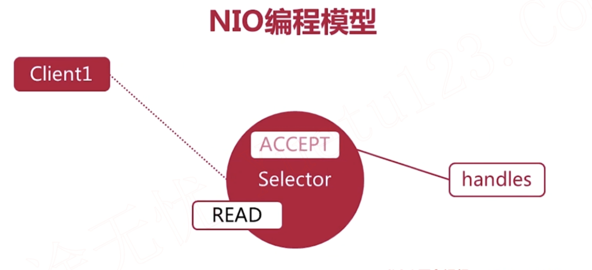

各个 Channel 读和写都是非阻塞式的，但是 Selector 自己本身监听各个通道上面是否发生事件Selector#select()是阻塞式的，如果这个 Selector 所监听的所有的通道上边都没有触发任何所监视的事件，那么会阻塞Selector#select()方法的调用。

接下来假如现在又有第二个客户想要加入多人聊天室，这个客户端首先还是向服务端发送一个连接请求。这样在服务器端又触发了 server socket channel 这条通道上面的 accept 事件，因为 server socket 首先要接受第二个客户端的连接请求，之后要在 Selector 上面再注册一个 read 事件要求 Selector 开始监听新连接的第二个客户端所使用的这一条 socket channel 上面是否发生了 read 可读事件。即一个客户端有一个 socket channel 通道，两个客户端就有两个 socket channel 通道，这个就是使用nio编程模型来用一个 Selector 对象在一个线程里边监听以及处理多个通道的IO的操作

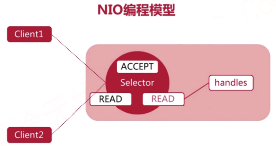

刚刚的例子，只是讲了两个客户。当然可以应付更多的客户。还有对于刚刚的例子，每一次都只触发了一个事件。这个主要是因为演示上会比较清晰。要明白的，所有注册在 Selector 上的事件。并不是说每一次调用 Selector#select()方法，只能返回一个被触发的事件。如果当前有多个事件同时被触发，那么调用 Selector#select()方法，就会把所有被触发的事件全部返回。


### 7.2 NIO 模型实现 ChatServer

```java
import java.io.Closeable;
import java.io.IOException;
import java.net.InetSocketAddress;
import java.nio.ByteBuffer;
import java.nio.channels.*;
import java.nio.charset.Charset;
import java.util.Set;

/**
 * 使用nio编程模型实现多人聊天室-服务端
 *
 * @author caojx created on 2020/6/23 6:50 下午
 */
public class ChatServer {

    private static final int DEFAULT_PORT = 8888;

    private static final String QUIT = "quit";

    /**
     * 缓冲区大小
     */
    private static final int BUFFER = 1024;

    /**
     * 服务器端通道，使用通道进行通信
     */
    private ServerSocketChannel serverSocketChannel;

    /**
     * 选择器
     */
    private Selector selector;

    /**
     * 用来读取消息的buffer
     */
    private ByteBuffer rBuffer = ByteBuffer.allocate(BUFFER);

    /**
     * 用来写入信息的buffer
     */
    private ByteBuffer wBeBuffer = ByteBuffer.allocate(BUFFER);

    private Charset charset = Charset.forName("UTF-8");

    private int port;

    public ChatServer(int port) {
        this.port = port;
    }

    /**
     * 检查是否退出
     *
     * @param msg
     * @return
     */
    public boolean readyToQuit(String msg) {
        return QUIT.equals(msg);
    }

    /**
     * 开始启动
     */
    public void start() {
        try {
            // 创建一个ServerSocketChannel通道
            serverSocketChannel = ServerSocketChannel.open();
            // 设置通道为未非阻塞（默认是阻塞的）
            serverSocketChannel.configureBlocking(false);
            // 绑定到监听端口
            serverSocketChannel.socket().bind(new InetSocketAddress(port));
            // 创建selector
            selector = Selector.open();
            // 服务端通道上注册需要监听的ACCEPT客户端连接请求事件
            serverSocketChannel.register(selector, SelectionKey.OP_ACCEPT);
            System.out.println("启动服务器，监听端口:" + port + ".....");
            // 进入监听模式
            while (true) {
                // select()函数是阻塞式的
                selector.select();
                // 获取监听事件，每一个被触发的事件与他相关的信息都包装在SelectionKey对象中
                Set<SelectionKey> selectionKeys = selector.selectedKeys();
                for (SelectionKey selectionKey : selectionKeys) {
                    // 处理被触发事件
                    handles(selectionKey);
                }
                // 手动把已处理的事件清空
                selectionKeys.clear();
            }
        } catch (IOException e) {
            e.printStackTrace();
        } finally {
            close(selector);
        }
    }

    /**
     * 处理被触发事件
     * 主要处理两种事件
     * 1.客户端连接请求时间ACCEPT事件
     * 2.已连接的客户端发送消息后的READ事件
     *
     * @param selectionKey
     * @throws IOException
     */
    private void handles(SelectionKey selectionKey) throws IOException {
        // ACCEPT事件--和客户建立了链接
        if (selectionKey.isAcceptable()) {
            // 获服务器通道，即返回为之创建此键的通道
            ServerSocketChannel server = (ServerSocketChannel) selectionKey.channel();
            // 获取客户端通道，并接受客户端连接请求
            SocketChannel client = server.accept();
            // 设置非阻塞
            client.configureBlocking(false);
            // 客户端通道上注册需要监听的READ事件
            client.register(selector, SelectionKey.OP_READ);
            System.out.println("客户端[" + client.socket().getPort() + "]" + "客户端链接了");
            // READ事件---客户发送消息，有了可读的事件
        } else if (selectionKey.isReadable()) {
            // 获取客户端通道，并读取客户端发送过来的消息
            SocketChannel client = (SocketChannel) selectionKey.channel();
            String fwMsg = receive(client);

            if (fwMsg.isEmpty()) {
                // 客户端异常，不再监听该客户端可能发送过来的消息
                selectionKey.cancel();
                // 事件发生了变化，更新selector监听的事件
                selector.wakeup();
            } else {
                // 消息转发给其他在线的客户端
                forwardMessage(client, fwMsg);
                // 检查用户是否退出
                if (readyToQuit(fwMsg)) {
                    selectionKey.cancel();
                    selector.wakeup();
                    System.out.println("客户端[" + client.socket().getPort() + "]" + "断开链接了");
                }
            }
        }

    }

    /**
     * 转发消息给客户端
     *
     * @param client 发送消息的客户端本身
     * @param fwMsg  消息
     */
    private void forwardMessage(SocketChannel client, String fwMsg) throws IOException {
        // selector.keys() 会返回所有已经注册在selector上的SelectionKey的集合，
        // 我们可以认为注册在selector上的SelectionKey即是当前在线的客户端
        for (SelectionKey key : selector.keys()) {

            // 跳过服务器端的通道 ServerSocketChannel
            Channel connectedClient = key.channel();
            if (connectedClient instanceof ServerSocketChannel) {
                continue;
            }
            // 检测channel没有被关闭，且通道不是自己本身
            if (key.isValid() && !client.equals(connectedClient)) {
                wBeBuffer.clear();
                wBeBuffer.put(charset.encode(fwMsg));
                wBeBuffer.flip();
                while (wBeBuffer.hasRemaining()) {
                    ((SocketChannel) connectedClient).write(wBeBuffer);
                }
            }
            System.out.println("客户端[" + client.socket().getPort() + "]" + fwMsg);
        }

    }

    /**
     * 读取channel上面的信息
     *
     * @param client
     * @return
     * @throws IOException
     */
    private String receive(SocketChannel client) throws IOException {
        // 清理残留的内容
        rBuffer.clear();
        while (client.read(rBuffer) > 0) ;
        // 写模式切换回读模式
        rBuffer.flip();
        return String.valueOf(charset.decode(rBuffer));
    }

    /**
     * 关闭资源
     */
    public void close(Closeable closeable) {
        if (closeable != null) {
            try {
                closeable.close();
            } catch (IOException e) {
                e.printStackTrace();
            }
        }
    }

    public static void main(String[] args) {
        ChatServer charServer = new ChatServer(DEFAULT_PORT);
        charServer.start();
    }
}
```


### 7.3 NIO 模型实现 ChatClient

```java
import java.io.Closeable;
import java.io.IOException;
import java.net.InetSocketAddress;
import java.nio.ByteBuffer;
import java.nio.channels.ClosedSelectorException;
import java.nio.channels.SelectionKey;
import java.nio.channels.Selector;
import java.nio.channels.SocketChannel;
import java.nio.charset.Charset;
import java.util.Set;

/**
 * 使用nio编程模型实现多人聊天室-客户端
 *
 * @author caojx created on 2020/6/26 6:50 下午
 */
public class ChatClient {

    private static final String DEFAULT_SERVER_HOST = "127.0.0.1";

    private static final int DEFAULT_SERVER_PORT = 9999;

    private static final String QUIT = "quit";

    /**
     * 缓冲区大小
     */
    private static final int BUFFER = 1024;

    private String host;

    private int port;

    private SocketChannel client;

    /**
     * 选择器
     */
    private Selector selector;

    /**
     * 用来读取消息的buffer
     */
    private ByteBuffer rBuffer = ByteBuffer.allocate(BUFFER);

    /**
     * 用来写入信息的buffer
     */
    private ByteBuffer wBeBuffer = ByteBuffer.allocate(BUFFER);


    private Charset charset = Charset.forName("UTF-8");

    public void start() {
        try {
            // 创建客户端通道
            client = SocketChannel.open();
            client.configureBlocking(false);
            selector = Selector.open();
            // 注册客户端需要监听的连接事件 CONNECT
            client.register(selector, SelectionKey.OP_CONNECT);
            // 向服务器发送连接请求
            client.connect(new InetSocketAddress(host, port));
            while (true) {
                selector.select();
                // 获取被触发的事件
                Set<SelectionKey> selectionKeys = selector.selectedKeys();
                for (SelectionKey selectionKey : selectionKeys) {
                    handles(selectionKey);
                }
                selectionKeys.clear();
            }
        } catch (IOException e) {
            e.printStackTrace();
        }catch (ClosedSelectorException e){
            // 用户正常退出
        } finally {
            close(selector);
        }
    }

    /**
     * 处理被触发的事件
     *
     * @param selectionKey
     * @throws IOException
     */
    private void handles(SelectionKey selectionKey) throws IOException {
        // CONNECT事件---连接就绪事件
        if (selectionKey.isConnectable()) {
            // 获取selectionKey上对应的客户端通道
            SocketChannel client = (SocketChannel) selectionKey.channel();
            // 请求是否已经链接
            if (client.isConnectionPending()) {
                // 正式建立链接
                client.finishConnect();

                // 处理用户的输入信息
                new Thread(new UserInputHandler(this)).start();
            }

            // 注册READ事件，接收其他客户端转发过来的消息
            client.register(selector, SelectionKey.OP_READ);
        }
        // READ事件---服务器转发消息事件
        else if (selectionKey.isReadable()) {
            SocketChannel client = (SocketChannel) selectionKey.channel();
            String msg = receive(client);
            if (msg.isEmpty()) {
                // 服务器异常，关闭selector，客户端退出
                close(selector);
            } else {
                System.out.println("客户端["+client.socket().getPort()+"]"+msg);
            }
        }
    }

    /**
     * 读取消息
     *
     * @param client
     * @return
     * @throws IOException
     */
    private String receive(SocketChannel client) throws IOException {
        rBuffer.clear();
        while (client.read(rBuffer) > 0) ;
        rBuffer.flip();
        return String.valueOf(charset.decode(rBuffer));
    }

    public ChatClient() {
        this(DEFAULT_SERVER_HOST, DEFAULT_SERVER_PORT);
    }

    public ChatClient(String host, int port) {
        this.host = host;
        this.port = port;
    }

    /**
     * 检查是否退出
     *
     * @param msg
     * @return
     */
    public boolean readyToQuit(String msg) {
        return QUIT.equals(msg);
    }

    /**
     * 发送消息
     *
     * @param msg
     * @throws IOException
     */
    public void send(String msg) throws IOException {
        if (msg.isEmpty()) {
            return;
        }
        wBeBuffer.clear();
        wBeBuffer.put(charset.encode(msg));
        wBeBuffer.flip();
        while (wBeBuffer.hasRemaining()) {
            client.write(wBeBuffer);
        }
        //检查用户是否准备推出
        if (readyToQuit(msg)) {
            close(selector);
        }
    }

    /**
     * 关闭资源
     */
    public void close(Closeable closeable) {
        if (closeable != null) {
            try {
                closeable.close();
            } catch (IOException e) {
                e.printStackTrace();
            }
        }
    }

    public static void main(String[] args) {
        ChatClient chartClient = new ChatClient("127.0.0.1", 8888);
        chartClient.start();
    }
}
```

### 7.4 NIO模型实现UserInputHandler

```java
import java.io.BufferedReader;
import java.io.IOException;
import java.io.InputStreamReader;

/**
 * 使用nio编程模型实现多人聊天室-处理用户输入信息
 *
 * @author caojx created on 2020/6/26 6:55 下午
 */
public class UserInputHandler implements Runnable {

    private ChatClient chartClient;

    public UserInputHandler(ChatClient chartClient) {
        this.chartClient = chartClient;
    }

    @Override
    public void run() {
        // 等待用户输入消息
        BufferedReader consoleReader = new BufferedReader(new InputStreamReader(System.in));
        while (true) {
            try {
                String input = consoleReader.readLine();
                // 向服务器发送消息
                chartClient.send(input);
                // 检查一下用户是否准备推出了
                if (chartClient.readyToQuit(input)) {
                    break;
                }
            } catch (IOException e) {
                e.printStackTrace();
            }
        }
    }
}
```


### 7.5 NIO 模型多人聊天室演示

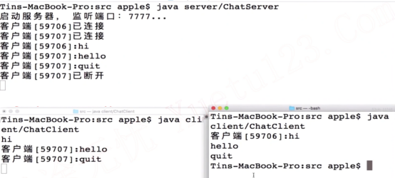

## 8.JavaIO的“后世”之师：AIO异步通信模型

JDK中AIO核心类及实现原理并梳理AIO编程步骤。

通过BIO和NIO这两大模型，对于这些不同的网络编程模型。可以再用另外一个新的角度来总结和比对一下这些模型，然后再引入第三个AIO模型。 之前都是在这个应用程序的层面实现网络编程模型。其实还可以再深入一步。应用程序层面，一定要通过和操作系统的内核层面进行一定的互动，才能真正的完成信息或者数据在网络编程当中实现真正的通信和交互。一般来说，想从网络中的其他计算机或者其他的进程收到数据，这个数据首先通过物理的连接到达机器，然后通过网卡设备接收数据，之后数据会被拷贝到操作系统内核的缓冲区，之后会从内核的缓冲区再复制到应用程序所对应的缓冲区，然后才可以从应用程序取得这个数据

在这个更深层一点的这种数据的交互当中，I/O模型是以什么样的一种方法来体现呢？深入到内核层面，它所支持的I/O模型也和应用程序层面的BIO、NIO、AIO几大模型有对应之处。首先从操作系统的内核角度，首先支持的最基本的I/O模型就是阻塞式I/O，这个阻塞是I/O它是一个什么样的流程呢？

首先从应用程序层面，想要看一看有没有收到从网络中传送给这个应用程序进程的新的数据，需要使用一些系统调用的方法，一些系统调用函数去和这个操作系统的内核进行沟通，不同的操作系统的内核的实际的函数的实现上可能会有所区别，不过从模型的角度上来讲还是大同小异，下边基于unix的操作系统作为一个例子对各种IO模型进行分析

### 8.1 内核 IO 模型

阻塞式I/O模型
- 这种模型对应的就是BIO模型
- 应用程序首先需要调用内核的一些特定的函数，这样才可以去询问操作系统，看一看网络上发送给这个应用程序的数据有没有准备好。假设这个时候数据还没有准备好，对于上面所实现的多人聊天室来说，若服务器想要知道客户端有没有向服务器端发送新的信息，就会去询问操作系统有没有收到新的数据，也许这个时候没有收到任何的数据，客户端那边用户还没有输入任何的文本，那怎么办呢？
- 既然阻塞式的I/O模型，那么在这种情况下，系统调用就会被阻塞在那里，不会返回，会一直在那里等待阻塞式的死等，直到有数据真的从网卡里面收到，然后数据也已经拷贝到了操作系统内核对应的缓冲区，那么这个时候系统调用知道数据来了，接下来数据会被复制到应用程序所对应的缓冲区，然后这个数据就可以被应用程序真的进行接下来的操作了，内核的系统调用的也就可以成功的返回了。这就是一个典型的阻塞式I/O模型。
- 可以看到在整个等待网络中的数据到达以及把数据经过各种层面的复制，直到把数据成功的复制到应用系统可以直接进行操作的缓冲区，整个过程中系统调用全部都是被阻塞在这里的。也就是说，在这个等待的过程中，做不了其他的事情，就只能在这里等待，直到数据被准备好。

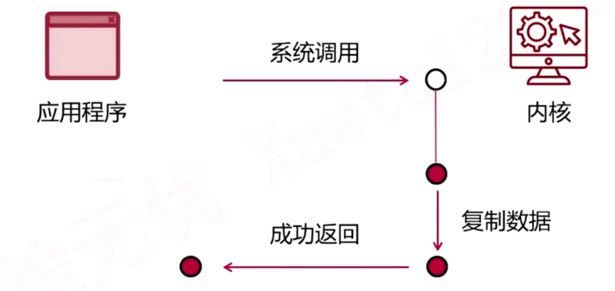

非阻塞式I/O
- 不停询问服务器数据有没有准备好，没有准备的好的时候直接返回即非阻塞式的。
- 这种模型对应的就是NIO模型，但是并不包括 Selector监听模式，仅仅是NIO中的非阻塞式模式。
- 非阻塞式I/O既然是非阻塞式，当应用程序进行系统调用，去询问内核等待的数据有没有传送过来？有没有准备好？假如第一次查询的时候数据还没有传输过来的，还没有准备好，那么既然是非阻塞式的模型，系统调用并不会等待在这里，而是返回。
- 当然这个返回的状态和有数据时的返回的状态是不同的，根据返回的状态应用程序可知现在想要的数据还没有准备好，还没有收到，那没关系，可以过一会儿再去询问一次。如果这个时候还是没有准备好这个数据，还是马上返回了，不会阻塞。系统应用即使知道目前没有任何的数据是准备好的，仍然会立刻返回。那么过一会再问，假设这次询问的时候，数据已经成功的被网卡设备收到，并且已经被复制拷贝到内核的缓冲区了。
- 那么接下来就可以像之前的那个I/O模型一样，把这部分数据从内核的缓冲区拷贝到应用程序可以进行操作的缓冲区。然后这次返回这个调用的就是一次成功返回，就是说这一次是真正的收到了想要的数据。
- 这样模型就叫做非阻塞式I/O，之所以叫这个名字的是因为在这个过程中进行了多次系统调用，每次都不会被阻塞，都会很快的返回。
- 只不过这个系统调用返回并不一定代表着数据已经收到了，有些时候返回是因为还没有数据就直接返回了，但是如果不停的不停的去询问，那么总有一次在查询的时候数据真的已经收到了。这个时候就可以通过系统调用真正的得到想要的等待的数据，在此流程中可以看到它完全是非阻塞式的。只不过由于是非阻塞式的，这就导致要不停不停的去询问内核数据到底有没有来呀。
- 这样的模式就对应NIO模型，但它并不包括上面 NIO案例Selector监听的模式，这里所说的NIO模型，纯粹指的就是使用NIO模型去实现多人聊天室的时使用的这些不管是server socket还是socket，都要把它配制成非阻塞模式，要把它从默认的阻塞模式转换成非阻塞模式，然后即使不使用现成 Selector。照样也可以自己通过一个循环，不停的轮询，不停的去检查这个server socket或socket是否接收到了数据。

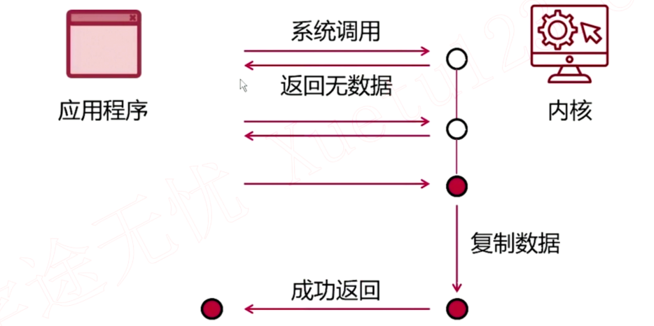

I/O多路复用
- I/O多路复用对应的就是通过 Selector选择器监听其注册所有通道的事件变更NIO的模式。
- 应用程序端发起新的询问是不是又数据可以进行操作了，如果数据没有准备好，并不会使用上边的纯粹的非阻塞式I/O模型里边所使用的那种不停的询问方法，而是告诉内核来监听这个I/O通道，直到有了数据准备好在那里可以供应用程序进行操作了，再来通知应用程序。
- 这个监听过程，就好像使用的`Selector#select()`方法，过程本身是阻塞式的，直到所监听的这个I/O
真的收到了数据，而且这个数据已经在缓冲区已经准备好了，可以供应用程序进行一步操作。此时监听系统调用的就会返回给应用程序。所监听的这个I/O有新的状态变化了。这里只是返回状态的变更并不是把数据复制给应用程序。接下来还要再进行系统调用，把这个已经在内核缓冲区准备好的数据复制到应用程序可以操作的缓冲区。而后才算是读取到数据。这样的模型叫做I/O的多路复用。
- 同一时刻内核可以监听多个I/O，这些I/O上有任何一个I/O出现了状态变更，就会通知相应应用程序然后就可以根据返回状态确定再一次的系统调用。I/O多路复用的模型，所对应的使用NIO加上Selector的这样一个模型。即不只是纯粹的使用了非阻塞式I/O模型，还使用到了I/O多路复用。
- 因此Selector也有翻译成I/O多路复用器。

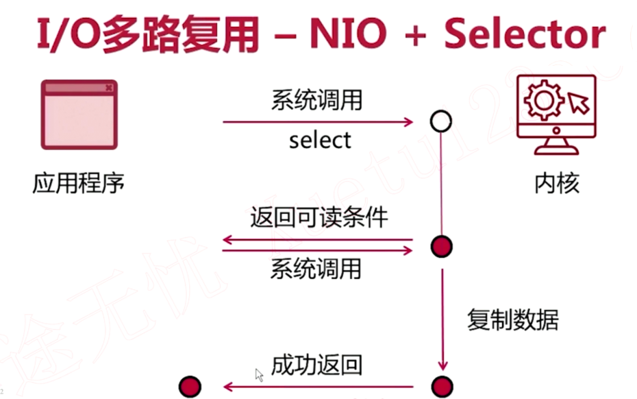

AIO异步I/O
- 上面描述的都是同步IO模型，下面就是真正的异步IO模型
- 不管是阻塞式IO还是非阻塞式IO还是IO多路复用。其实都可以算作同步IO模型。在发起系统调用后不管在发起调用的当时数据有没有在内核的缓冲区准备好也可立即返回系统调用。只不过需要去轮询系统调用，否则没有办法收到数据。之所以说是同步的。就是因为等待数据，必须要再发起新的系统调用，再次询问内核数据是否准备好。主动二次调用是没有办法被省略，而非内核数据准备好，会自动通知。阻塞式IO还是非阻塞式IO还是IO多路复用这三种操作系统内核的I/O模型里，都是必须要通过发起新的调用直到获取到数据。
- 异步IO模型流程。首先应用程序层面发起系统调用，然后询问内核数据有没有准备好，可以让应用程序进行接下的处理。如果没有立即返回不会阻塞等待。此后应用程序层面不需要发起新的系统调用。当收到数据操作系统自动把内核缓冲区的数据复制到应用程序所对应的缓冲区数据完全准备好后，内核会发送一个信号，来通知应用程序。
- 异步IO模型模型里，异步体现在一开始应用程序发起了系统调要用数据没有准备好返回了不需要再发起新一个系统调用内核把数据准备好后会来通知。在收到通知后，再处理数据逻辑。这就是和阻塞式IO还是非阻塞式IO还是IO多路复用这三种内核的I/O模型的最大的区别本质上都是同步的模型。

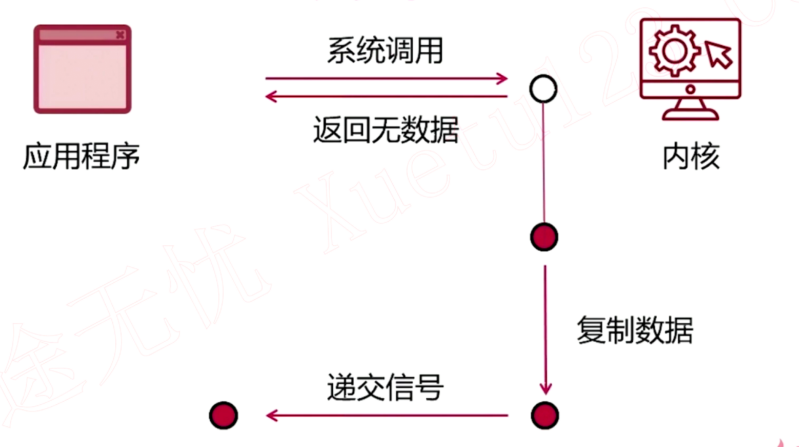

### 8.2 异步调用机制

AIO中的异步操作


通过 Future 进行异步操作
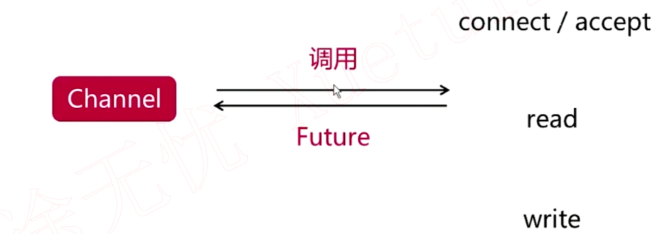

通过 CompletionHandler 会有一个回调方法，当数据真正有的时候，就会进行回调方法的执行
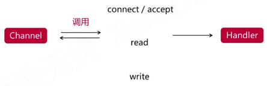

### 8.3 服务端实现-EchoServer

实现一个简单的 EchoServer 和 EchoClient 的代码，客户端发送消息给服务端，服务端直接就把消息返回给客户端
- 服务器端使用回调的方式来实现异步
- 客户端使用 Future 的方式来实现异步
- attachment 附加信息，可以是任意对象类型，这里用于告诉 ClientHandler 是写操作还是读操作

accept 中的 Handler 是在哪里的线程执行了？
- AsynchronousChannelGroup 这个就类似于线程池，例子中使用默认的 group，也可以自定义 group 来绑定到特定的 channel 上面去。

```java
import java.io.Closeable;
import java.net.InetSocketAddress;
import java.nio.ByteBuffer;
import java.nio.channels.AsynchronousServerSocketChannel;
import java.nio.channels.AsynchronousSocketChannel;
import java.nio.channels.CompletionHandler;
import java.util.HashMap;
import java.util.Map;

/**
 * 服务器端使用回调的方式来实现异步-aio
 */
public class EchoServer {
    private static final String LOCALHOST = "localhost";
    private static final int DEFAULT_PORT = 8888;

    /**
     * 服务器端的异步通道
     */
    AsynchronousServerSocketChannel serverChannel;


    /**
     * 关闭资源
     *
     * @param close
     */
    private void close(Closeable close) {
        if (null != close) {
            try {
                close.close();
                System.out.println("关闭" + close);
            } catch (Exception e) {
                e.printStackTrace();
            }
        }
    }

    public void start() {
        try {
            // 绑定监听端口
            // 里面有一个AsynchronousChannelGroup，类似一个线程池，提供一些异步的通道，可以共享的一些系统资源
            serverChannel = AsynchronousServerSocketChannel.open();
            serverChannel.bind(new InetSocketAddress(LOCALHOST, DEFAULT_PORT));
            System.out.println("启动服务器，监听端口：" + DEFAULT_PORT);

            /*
             * 等待并接收新的客户端的连接请求由于 serverChannel.accept()是异步的调用，即等不到真正的结果完成，
             * 也就是说我在调用serverChannel.accept()的时候可能完全没有客户端发送过来连接请求，
             * 即使这样，我们的调用也会立即返回，因为他是异步的调用，返回之后，我们要等到直到有客户端
             * 发来连接请求的时候，我们定义的AcceptHandler里边的回调函数才会被系统调用，
             * 即我们要保证我们服务器端的主线程还在工作，所以需要将 serverChannel.accept(null, new AcceptHandler()); 放到while循环中
             */
            while (true) {
                // attachment：任意对象，辅助信息
                // AcceptHandler：CompletionHandler的实现，用来处理accept结束时的结果
                serverChannel.accept(null, new AcceptHandler());
                // 阻塞式调用，避免while循环过于频繁
                System.in.read();
            }
        } catch (Exception e) {
            e.printStackTrace();
        } finally {
            close(serverChannel);
        }
    }

    /**
     * 创建服务端的AcceptHandler
     * <p>
     * 由AsynchronousChannelGroup中的线程回调
     */
    private class AcceptHandler implements CompletionHandler<AsynchronousSocketChannel, Object> {

        /**
         * 异步调用函数成功返回时调用
         *
         * @param result     与服务端建立连接的异步的客户端通道
         * @param attachment 额外的信息或数据
         */
        @Override
        public void completed(AsynchronousSocketChannel result, Object attachment) {
            if (serverChannel.isOpen()) {
                // 服务端接着等待下一个客户端来连接的请求
                serverChannel.accept(null, this);  // 底层限制了accept里边调用accept的层级，保证了不会出现 stackOverflow 的错误
            }

            // 处理读写操作
            AsynchronousSocketChannel clientChannel = result;
            if (null != clientChannel && clientChannel.isOpen()) {
                ClientHandler handler = new ClientHandler(clientChannel);
                ByteBuffer buffer = ByteBuffer.allocate(1024);
                Map<String, Object> attachmentInfo = new HashMap();
                attachmentInfo.put("type", "read");
                attachmentInfo.put("buffer", buffer);

                // 读取客户端发送的消息到buffer中，并交给ClientHandler处理把消息转发回客户端
                clientChannel.read(buffer, attachmentInfo, handler);
            }
        }

        /**
         * 异步调用失败的时候调用
         *
         * @param exc
         * @param attachment
         */
        @Override
        public void failed(Throwable exc, Object attachment) {
            // 处理一些错误的情况
        }
    }

    /***
     * 创建客户端的ClientHandler
     */
    private class ClientHandler implements CompletionHandler<Integer, Object> {

        private AsynchronousSocketChannel clientChannel;

        public ClientHandler(AsynchronousSocketChannel clientChannel) {
            this.clientChannel = clientChannel;
        }

        @Override
        public void completed(Integer result, Object attachment) {
            Map<String, Object> info = (Map<String, Object>) attachment;
            // 判断是读操作还是写操作
            String type = (String) info.get("type");
            // 如果是读操作，读取到数据后，将数据写回客户端
            if ("read".equals(type)) {
                ByteBuffer buffer = (ByteBuffer) info.get("buffer");
                // 将 buffer 从写变为读模式
                buffer.flip();
                info.put("type", "write");
                clientChannel.write(buffer, info, this);
                buffer.clear();
            }
            // 如果之前已经把客户端发送过来的数据又重新发回给了客户端，则继续去调用read函数，继续去监听客户端发送过来的数据
            else if ("write".equals(type)) {
                // 又去读客户端发送过来的数据
                ByteBuffer buffer = ByteBuffer.allocate(1024);
                info.put("type", "read");
                info.put("buffer", buffer);
                clientChannel.read(buffer, info, this);
            }
        }

        @Override
        public void failed(Throwable exc, Object attachment) {
            // 处理一些错误的情况
        }
    }

    public static void main(String[] args) {
        EchoServer server = new EchoServer();
        server.start();
    }

}
```

### 8.4 客户端实现-EchoClient

```java
import java.io.BufferedReader;
import java.io.Closeable;
import java.io.InputStreamReader;
import java.net.InetSocketAddress;
import java.nio.ByteBuffer;
import java.nio.channels.AsynchronousSocketChannel;
import java.util.concurrent.Future;

/**
 * 客户端使用 Future 的方式来实现异步-aio
 */
public class EchoClient {

    final String LOCALHOST = "localhost";

    final int DEFAULT_PORT = 8888;

    AsynchronousSocketChannel clientChannel;

    /**
     * 回收资源
     *
     * @param close
     */
    private void close(Closeable close) {
        if (null != close) {
            try {
                close.close();
                System.out.println("关闭" + close);
            } catch (Exception e) {
                e.printStackTrace();
            }
        }
    }

    public void start() {
        try {
            // 创建客户端channel
            clientChannel = AsynchronousSocketChannel.open();
            Future<Void> future = clientChannel.connect(new InetSocketAddress(LOCALHOST, DEFAULT_PORT));
            // 阻塞式调用get方法，等待连接成功
            future.get();
            // 等待用户的输入
            BufferedReader consoleReader = new BufferedReader(new InputStreamReader(System.in));
            while (true) {
                String input = consoleReader.readLine(); // 阻塞式调用
                byte[] inputBytes = input.getBytes();
                // 构建ByteBuffer
                ByteBuffer buffer = ByteBuffer.wrap(inputBytes);
                // 客户端的Channel往服务器发送数据
                Future<Integer> writeResult = clientChannel.write(buffer);
                // 阻塞等待客户端往服务器发送数据完成
                writeResult.get();

                buffer.flip(); // 变换为读模式
                Future<Integer> readResult = clientChannel.read(buffer);
                // 阻塞获取服务器返回的数据
                readResult.get();

                String echo = new String(buffer.array());
                System.out.println(echo);
                buffer.clear();
            }
        } catch (Exception e) {
            e.printStackTrace();
        } finally {
            close(clientChannel);
        }
    }

    public static void main(String[] args) {
        EchoClient client = new EchoClient();
        client.start();
    }

}
```

### 8.5 执行服务端和客户端

## 9.实战：基于AIO改造多人聊天室

### 9.1 AIO 模型

再梳理一下AIO变成模型运行的机制
- 服务端创建`AsyncServerSocketChannel`即异步的服务器通道，同时把通道绑定到服务器端监听的端口
  - 其实`AsyncServerSocketChannel`是属于某个`AsyncChannelGroup` 通道组的，这个通道组指的是一组可以被多个异步通道所共享的资源群组，里边最主要的是线程池，之所以需要 `AsyncChannelGroup` 来保存 `AsyncServerSocketChannel` 是因为在IO编程模型里，系统操作系统已经做了很多的事情，使用起来方便高效。当操作系统准备好数据后，会以异步的方式来通知或者通过设定的 handler 做异步操作。操作系统怎样来进行dispatch各种handler需要做的工作？在实际的实现当中，操作系统需要使用各种各样的性的资源，比如如果给定一个线程池，那么操作系统就可以重复利用线程池里边这些可供使用的线程来dispatch一些handler执行处理业务逻辑。这个就是创建AsyncServerSocketChannel的时指定AsynchronousChannelGroup的原因所在。

  

- 在一开始没有专门的额外的去设定 AsyncServerSocketChannel 的 group，当不设置 AsynchronousChannelGroup 时，系统会使用默认的 AsynchronousChannelGroup 默认的group是整个系统层面上被共享的 channel group。

- 后面会演示怎么创建一个特定的channel group。并且让异步的通道，比如说 AsyncServerSocketChannel将它放置在指定的group里并且让这个异步的channel通道也可以去共享整个channel group中的系统资源。

有了 group、ServerSocketChannel那么异步机制怎么样实现？
- 较常用的方法就是创建一个 handler 然后有IO事件发生的时操作系统就可以dispatch指定 handler 完成相应操作。比如说创建 AsyncServerSocketChannel 后首先需要 Handler 去 accept 新的客户的连接IO事件。

  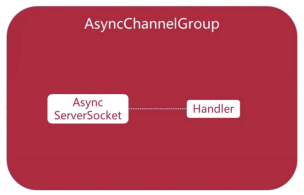

- 当有客户端请求发过来，要求和服务器端进行建立连接的时，这个IO事件就会触发注册的 handler，也可以叫做AcceptHandler。触发这个handler去处理客户端发起连接的事件，就会建立好客户和服务器之间的连接。
- 当建立连接后。在服务器端就可以取得连接 AsyncSocketChannel对象这个socket channel的就可以用来由服务器向客户端收发数据，异步的socket channel针对socket channel不管read或write都是异步的。所以也都需要指定handler处理相应读写事件

  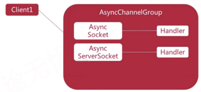

- 当然还可能会有多个客户端来发起连接，新的客户端发出连接请求，首先 accept handler 被触发然后为新客户端对应的socket channel注册handler，而后从某个客户端收到消息事件服务器端使用相应socket channel进行读read操作。由于是异步的，即使当时调用read时没有任何的数据可读，但等到真的有数据从客户端发过来可读时，就会触发相对应socket channel所注册过的handler。

  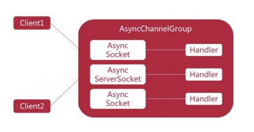

上面梳理AIO编程模型的运行的机制。和BIO和NIO的模型都有非常大的区别。异步的调用机制是它最特别的地方。

### 9.2 AIO ChatServer 服务器的创建

```java
/**
 * 使用AIO编程模型实现多人聊天室-服务端
 */
public class ChatServer {

    private static final String LOCALHOST = "localhost";
    private static final int DEFAULT_PORT = 8888;
    private static final String QUIT = "quit";
    private static final int BUFFER = 1024;

    /**
     * 使用自定义的异步共享通道组
     */
    private AsynchronousChannelGroup asynchronousChannelGroup;

    /**
     * 服务器端通道
     */
    private AsynchronousServerSocketChannel serverSocketChannel;

    /**
     * 在线客户端列表
     */
    private List<ClientHandler> connectedClients;

    /**
     * 编码方式
     */
    private Charset charset = Charset.forName("UTF-8");

    private int port;

    public ChatServer(int port) {
        this.port = port;
        this.connectedClients = new ArrayList<>();
    }


    public void start() {
        try {
            // 自定义AsynchronousChannelGroup
            ExecutorService executorService = Executors.newFixedThreadPool(10);
            // 将线程池加入到异步通道中
            asynchronousChannelGroup = AsynchronousChannelGroup.withThreadPool(executorService);

            // 打开通道,使用自定义的asynchronousChannelGroup
            serverSocketChannel = AsynchronousServerSocketChannel.open(asynchronousChannelGroup);

            // 通道绑定本地主机和端口
            serverSocketChannel.bind(new InetSocketAddress(LOCALHOST, DEFAULT_PORT));
            System.out.println("启动服务器,监听端口" + DEFAULT_PORT);

            // while循环，持续监听客户端的连接请求
            while (true) {
                // 一直调用accept函数,接收要与服务端建立连接的用户
                serverSocketChannel.accept(null, new AcceptHandler());
                // 阻塞式调用,防止占用系统资源
                System.in.read();
            }
        } catch (Exception e) {
            e.printStackTrace();
        } finally {
            close(serverSocketChannel);
        }
    }

    /**
     * 创建AcceptHandler，用来处理accept函数的异步调用的返回结果，即接收客户端的连接请求后，进行回调
     */
    private class AcceptHandler implements CompletionHandler<AsynchronousSocketChannel, Object> {

        @Override
        public void completed(AsynchronousSocketChannel clientChannel, Object attachment) {
            if (serverSocketChannel.isOpen()) {
                // 继续等待监听新的客户端的连接请求
                serverSocketChannel.accept(null, this);
            }

            // 处理当前已连接的客户端的数据读写
            if (clientChannel != null && clientChannel.isOpen()) {
                // 为该新连接的用户创建handler,用于读写操作
                ClientHandler clientHandler = new ClientHandler(clientChannel);

                // 数据读写需要通过buffer
                ByteBuffer byteBuffer = ByteBuffer.allocate(BUFFER);

                // 将新用户添加到在线列表
                addClient(clientHandler);

                // 第一个buffer：表示从clientChannel中读取的信息写入到buffer缓冲区中
                // 第二个buffer：handler回调函数被调用时,buffer会被当做一个attachment参数传入到该回调函数中
                // buffer、attachment、使用ClientHandler来处理read函数的异步调用的返回结果
                clientChannel.read(byteBuffer, byteBuffer, clientHandler);
            }
        }

        @Override
        public void failed(Throwable exc, Object attachment) {
            System.out.println("连接失败" + exc);
        }
    }

    /**
     * 创建客户端的ClientHandler，用来处理read函数的异步调用的返回结果
     */
    private class ClientHandler implements CompletionHandler<Integer, Object> {

        /**
         * 当前处理对应的客户端通道
         */
        private AsynchronousSocketChannel clientChannel;

        private ClientHandler(AsynchronousSocketChannel clientChannel) {
            this.clientChannel = clientChannel;
        }

        /**
         * 成功的异步回调
         *
         * @param result     表示我们从read中读取了多少数据
         * @param attachment
         */
        @Override
        public void completed(Integer result, Object attachment) {
            ByteBuffer byteBuffer = (ByteBuffer) attachment;
            if (byteBuffer != null) {
                if (result <= 0) {
                    // result<=0，非正整数，可以理解为客户端异常
                    // 将客户移除出在线列表
                    removeClient(this);
                } else {
                    // 将 buffer 从写变为读模式
                    byteBuffer.flip();

                    // 打印消息
                    String fwdMsg = receive(byteBuffer);
                    System.out.println(getClientName(clientChannel) + ":" + fwdMsg);

                    // 转发消息给当前的其他在线用户
                    fwdwordMessage(clientChannel, fwdMsg);

                    // 重置buffer
                    byteBuffer.clear();

                    // 如果客户端发送的是quit退出消息，则把客户移除监听的客户列表
                    if (readyToQuit(fwdMsg)) {
                        // 将客户从在线客户列表中去除
                        removeClient(this);
                    } else {
                        // 如果不是则继续等待读取用户输入的信息
                        clientChannel.read(byteBuffer, byteBuffer, this);
                    }
                }
            }
        }

        @Override
        public void failed(Throwable exc, Object attachment) {
            System.out.println("读写失败:" + exc);
        }
    }

    /**
     * 添加一个新的客户端进客户端列表(list集合)
     *
     * @param handler
     */
    private synchronized void addClient(ClientHandler handler) {
        connectedClients.add(handler);
        System.out.println(getClientName(handler.clientChannel) + "已经连接到服务器");
    }

    /**
     * 将该客户(下线)从列表中删除
     *
     * @param clientHandler
     */
    private synchronized void removeClient(ClientHandler clientHandler) {
        connectedClients.remove(clientHandler);
        System.out.println(getClientName(clientHandler.clientChannel) + "已断开连接");
        //关闭该客户对应流
        close(clientHandler.clientChannel);
    }

    /**
     * 服务器其实客户端发送的信息,并将该信息进行utf-8解码
     *
     * @param buffer
     * @return
     */
    private synchronized String receive(ByteBuffer buffer) {
        return String.valueOf(charset.decode(buffer));
    }

    /**
     * 服务器端转发该客户发送的消息到其他客户控制室上(转发信息)
     *
     * @param clientChannel
     * @param fwdMsg
     */
    private synchronized void fwdwordMessage(AsynchronousSocketChannel clientChannel, String fwdMsg) {
        for (ClientHandler handler : connectedClients) {
            // 该信息不用再转发到发送信息的那个人那
            if (!handler.clientChannel.equals(clientChannel)) {
                try {
                    // 将要转发的信息写入到缓冲区中
                    ByteBuffer buffer = charset.encode(getClientName(handler.clientChannel) + ":" + fwdMsg);
                    // 将相应的信息写入到用户通道中,用户再通过获取通道中的信息读取到对应转发的内容
                    handler.clientChannel.write(buffer, null, handler);
                } catch (Exception e) {
                    e.printStackTrace();
                }
            }
        }
    }


    /**
     * 获取客户端的端口号并打印出来
     *
     * @param clientChannel
     * @return
     */
    private String getClientName(AsynchronousSocketChannel clientChannel) {
        int clientPort = -1;
        try {
            InetSocketAddress inetSocketAddress = (InetSocketAddress) clientChannel.getRemoteAddress();
            clientPort = inetSocketAddress.getPort();
        } catch (IOException e) {
            e.printStackTrace();
        }
        return "客户端[" + clientPort + "]:";
    }

    /**
     * 判断是否退出
     *
     * @param msg
     * @return
     */
    public boolean readyToQuit(String msg) {
        return QUIT.equals(msg);
    }

    /**
     * 回收资源
     *
     * @param closeable
     */
    public void close(Closeable closeable) {
        if (closeable != null) {
            try {
                closeable.close();
            } catch (IOException e) {
                e.printStackTrace();
            }
        }
    }

    public static void main(String[] args) {
        ChatServer charServer = new ChatServer(8886);
        charServer.start();
    }
}
```


### 9.3 AIO ChatClient客户端实现

```java
/**
 * 使用AIO编程模型实现多人聊天室-客户端
 */
public class ChatClient {

    private static final String LOCALHOST = "localhost";
    private static final int DEFAULT_PORT = 8888;
    private static final String QUIT = "quit";
    private static final int BUFFER = 1024;

    /**
     * 异步通道
     */
    private AsynchronousSocketChannel clientChannel;

    /**
     * 编码方式
     */
    private Charset charset = Charset.forName("UTF-8");


    private void start() {

        try {
            // 创建异步通道channel，并发起连接请求
            clientChannel = AsynchronousSocketChannel.open();
            Future<Void> future = clientChannel.connect(new InetSocketAddress(LOCALHOST, DEFAULT_PORT));

            // 阻塞式调用，等待客户端连接成功
            future.get();
            System.out.println("已连接到服务器");

            // 处理用户输入事件
            new Thread(new UserInputHandler(this)).start();

            // 主线程中循环中读取服务器转发过来的其他客户端消息
            ByteBuffer buffer = ByteBuffer.allocate(BUFFER);
            while (true) {
                Future<Integer> readResult = clientChannel.read(buffer);
                // 阻塞式读取数据
                int result = readResult.get();
                if (result <= 0) {
                    // 发生异常，没有读取到数据
                    close(clientChannel);
                    System.out.println("与服务器连接异常");
                    System.exit(1);
                } else {
                    // 正常打印消息
                    buffer.flip();
                    String message = String.valueOf(charset.decode(buffer));
                    buffer.clear();
                    System.out.println(message);
                }
            }
        } catch (Exception e) {
            e.printStackTrace();
        } finally {
            close(clientChannel);
        }
    }

    /**
     * 向服务器发送消息
     *
     * @param message
     * @throws Exception
     */
    public void send(String message) throws Exception {
        if (message.isEmpty()) {
            return;
        }
        ByteBuffer byteBuffer = charset.encode(message);
        Future<Integer> writeResult = clientChannel.write(byteBuffer);
        writeResult.get();
    }

    public boolean readyToQuit(String msg) {
        return QUIT.equals(msg);
    }


    /**
     * 回收资源
     *
     * @param closeable
     */
    public void close(Closeable closeable) {
        if (closeable != null) {
            try {
                closeable.close();
            } catch (IOException e) {
                e.printStackTrace();
            }
        }
    }

    public static void main(String[] args) {
        ChatClient client = new ChatClient();
        client.start();
    }
}
```


### 9.4 AIO UserInputHandler客户端实现消息发送

```java
/**
 * 客户端发送消息
 */
public class UserInputHandler implements Runnable {

    private ChatClient chatClient;

    public UserInputHandler(ChatClient chatClient) {
        this.chatClient = chatClient;
    }

    @Override
    public void run() {
        // 等待用户的输入
        BufferedReader consoleReader = new BufferedReader(new InputStreamReader(System.in));
        while (true) {
            try {
                // 阻塞式去读控制台信息
                String message = consoleReader.readLine();
                chatClient.send(message);
                if (chatClient.readyToQuit(message)) {
                    System.out.println("已退出聊天室");
                    break;
                }
            } catch (Exception e) {
                e.printStackTrace();
            }
        }
    }
}
```


### 9.5 AIO 多人聊天室演示

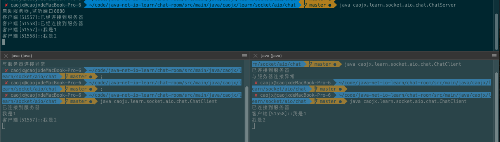

## 10.综合实战：简易版Web服务器

分析web服务器的原理及使用实现一个乞丐版web服务器。


### 10.1 向服务器请求资源

资源分为静态资源和动态资源

静态资源
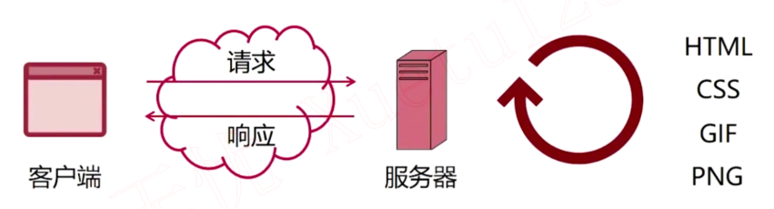

动态资源
- 随着请求发起方、发起事件、请求内容等因素而变化
- 服务器通过一个容器来获取动态资源

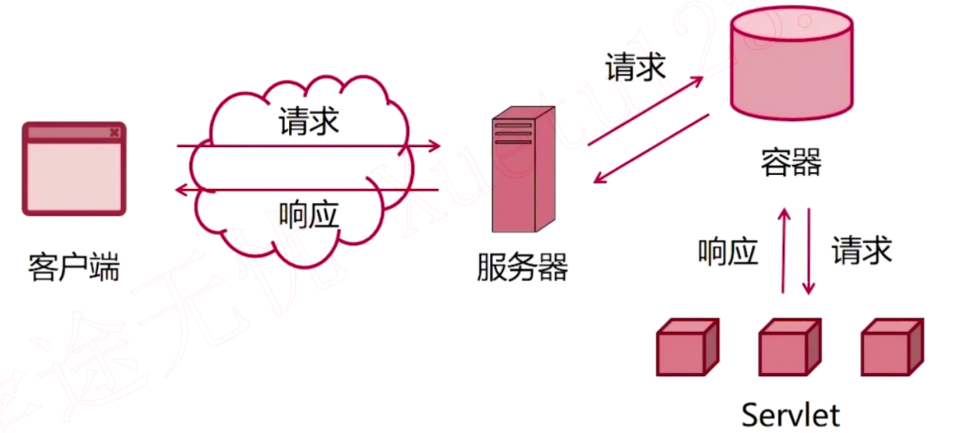


### 10.2 Tomcat 结构

 Tomcat 实现了 JavaEE 的规范，如 Servlet、JSP。

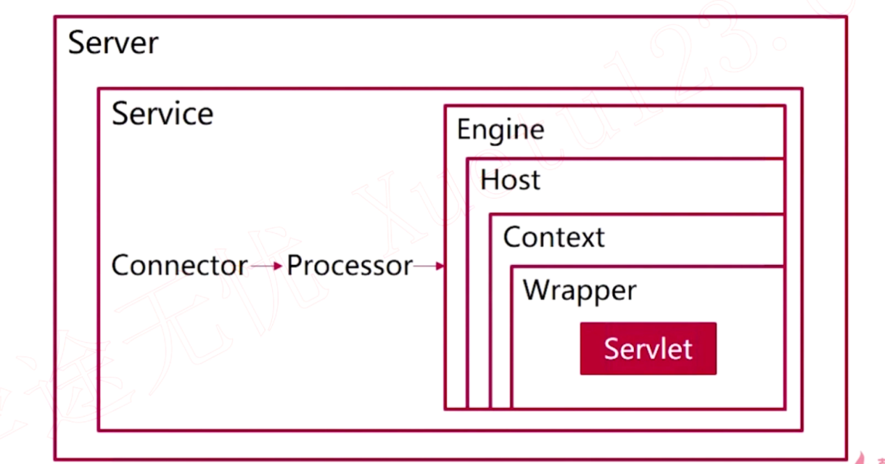

Server 组件
- Tomcat服务器最顶层组件
- 负责运行Tomcat服务器
- 负责加载服务器资源和环境变量

Service 组件
- 集合Connector和Engine的抽象组件
- 一个Server可以包含多个Service
- 一个Service可以包含多个Connector和Engine

Connector、Processor
- Connector提供基于不同特定协议的实现
- Connector接受解析请求，返回响应
- 经Processor派遣请求至Engine进行处理

Engine
- 容器是Tomcat用来处理请求的组件
- 容器内部的组件按照层级排列
- Engine是容器的顶层组件

Host
- Host代表一个虚拟主机
- 一个Engine可以支持多个虚拟主机的请求
- Engine通过解析请求来决定将请求发送给哪一个Host

Context
- Context代表一个Web Application
- Tomcat最复杂的组件之一
- 应用资源管理、应用类加载、Servlet管理、安全管理等

Wrapper
- Wrapper是容器的最底层组件
- 包裹住Servlet实例
- 负责管理Servlet实例的生命周期

### 10.3 实现 Request

webserver-tutorial工程

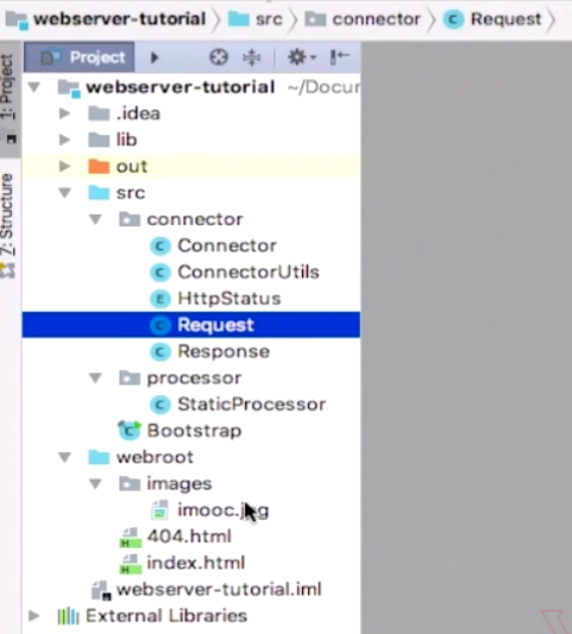

静态资源
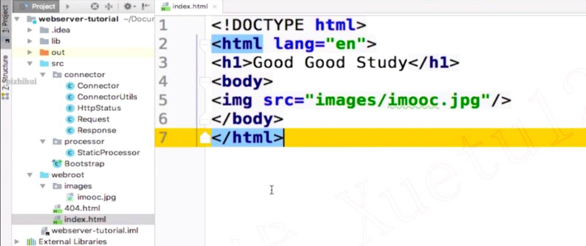

一般 http 请求
```text
GET /index.html HTTP/1.1
Host: localhost:8888
Connection: keep-alive
Cache-Control: max-age=0
Upgrade-Insecure-Requests: 1
User-Agent: Mozilla/5.0 (Windows NT 10.0; …) Gecko/20100101 Firefox/68.0
```

具体代码
```java
public class Request {
    private static final int BUFFER_SIZE = 1024;

    private InputStream input;  // 与对应的请求的 socket 对应的输入流
    private String uri;    // 请求资源的地址

    public Request(InputStream input) {
      this.input = input;
    }

    public String getRequestURI() {
        return uri;
    }

    public void parse() {
       int length = 0;
       byte[] buffer = new byte[BUFFER_SIZE];
       try {
          length = input.read(buffer);
       } catch (Exception e) {
          e.printStackTrace();
       }
       StringBuilder request = new StringBuilder();
       for (int i = 0 ; i < length; i ++) {
           request.append((char)buffer[i]);   // 每个字节转为字符
       }
       uri = parseUri(request.toString());
    }
    
    private String parseUri(String s) {
       int index1, index2;
       index1 = s.indexOf(' ');  // 寻找第一个空格
       if(index1 != -1) { // 如果能找到第一个空格的位置
           index2 = s.indexOf('  ', index2); // 寻找第二个空格
           if(index2 > index1) {
              return s.subString(index1 + 1, index2); // 截取出来
           }
       }
       return "";
    }
}
```


### 10.4 测试 Request
添加测试用例
```java
/**
 * 测试request
 */
public class RequestTest {

    /**
     * 有效请求
     */
    private static final String validRequest = "GET /index.html HTTP/1.1";

    /**
     * 静态资源请求测试，测试是否能成功的获取的请求的静态资源
     */
    @Test
    public void givenValidRequest_thenExtrackUri() {
        Request request = TestUtils.createRequest(validRequest);
        Assert.assertEquals("/index.html", request.getRequestURI());
    }
}
```

### 10.5 实现 Response

404 Not Found 页面
```java
public class ConnectorUtils {
    public static final String WEB_ROOT = System.getProperty("user.dir") + File.separator + "webroot";
    public static final String PROTOCOL = "HTTP/1.1";
    public static final String CARRIAGE = "\r";
    public static final String NEWLINE = "\n";
    public static final String SPACE = " ";

    /**
     * 响应状态行，比如 HTTP/1.1 200 OK
     *
     * @param status 状态码
     * @return
     */
    public static String renderStatus(HttpStatus status) {
        StringBuilder sb = new StringBuilder(PROTOCOL)
                .append(SPACE)
                .append(status.getStatusCode())
                .append(SPACE)
                .append(status.getReason())
                .append(CARRIAGE).append(NEWLINE)
                .append(CARRIAGE).append(NEWLINE);
        return sb.toString();
    }
}

public enum HttpStatus {
    SC_OK(200, "OK"),
    SC_NOT_FOUND(404, "File Not Found");
    private int statusCode;
    pirvate String reason;
    HttpStatus(int code, String reason) {
        this.statusCode = code;
        this.reason = reason;
    }
    // ... getter方法
}

//Response的格式 HTTP/1.1 200 OK
public class Response {
   private static final int BUFFER_SIZE = 1024;
   Request request;   // 需要 Request 得到 URI
   OutputStream output; // 与客户端连接的输出流

   public Response(OutputStream output) {
      this.output = output;
   }
   
   public void setReqeust(Request request) {
     this.request = reqeust;
   }
   
   // 最重要的方法，通过 Request 中 URI，来获取真正的资源，然后写入到 OutputStream 中
   public void sendStaticResource() {
      File file = new File(ConnectorUtils.WEB_ROOT, request.getRequestURI());
      try {
         write(file, HttpStatus.SC_OK);
      } catch (Exception e) {
         File errorFile = new File(ConnectorUtils.WEB_ROOT, "404.html");
         write(errorFile, HttpStatus.SC_NOT_FOUND); // 有异常就统一返回 404 异常
      }      
   }
    
   private void wirte(File resource, HttpStatus status) throws IOException {
      try(FileInputStream fis = new FileInputStream(resource);) {
          // 写状态
          ouput.write(ConnectorUtils.renderStatus(stauts).getBytes());
          // 写资源文件
          byte[] buffer = new byte[BUFFER_SIZE];
          int length = 0;
          while((length = fis.read(buffer, 0, BUFFER_SIZE)) != -1) {
              output.write(buffer, 0, length);
          }
      }
      
   }
}
```

### 10.6 测试 Response

```java
/**
 * 测试response
 */
public class ResponseTest {

    private static final String validRequest = "GET /index.html HTTP/1.1";
    private static final String invalidRequest = "GET /notfound.html HTTP/1.1";

    private static final String status200 = "HTTP/1.1 200 OK\r\n\r\n";
    private static final String status404 = "HTTP/1.1 404 File Not Found\r\n\r\n";

    /**
     * 有效的请求响应测试
     *
     * @throws IOException
     */
    @Test
    public void givenValidRequest_thenReturnStaticResource() throws IOException {
        Request request = TestUtils.createRequest(validRequest);
        ByteArrayOutputStream out = new ByteArrayOutputStream();
        Response response = new Response(out);
        response.setRequest(request);
        response.sendStaticResource();

        String resource = TestUtils.readFileToString(ConnectorUtils.WEB_ROOT + request.getRequestURI());
        Assert.assertEquals(status200 + resource, out.toString());
    }

    /**
     * 无效的请求响应测试
     *
     * @throws IOException
     */
    @Test
    public void givenInvalidRequest_thenReturnError() throws IOException {
        Request request = TestUtils.createRequest(invalidRequest);
        ByteArrayOutputStream out = new ByteArrayOutputStream();
        Response response = new Response(out);
        response.setRequest(request);
        response.sendStaticResource();

        String resource = TestUtils.readFileToString(ConnectorUtils.WEB_ROOT + "/404.html");
        Assert.assertEquals(status404 + resource, out.toString());
    }
}
```


抽取 TestUtils 代码
```java
public class TestUtils {

    /**
     * 创建request对象
     *
     * @param requestStr 比如，GET /index.html HTTP/1.1
     * @return
     */
    public static Request createRequest(String requestStr) {
        InputStream input = new ByteArrayInputStream(requestStr.getBytes());
        Request request = new Request(input);
        request.parse();
        return request;
    }

    /**
     * 读取文件内容
     *
     * @param filename
     * @return
     * @throws IOException
     */
    public static String readFileToString(String filename) throws IOException {
        return new String(Files.readAllBytes(Paths.get(filename)));
    }
}
```


### 10.7 实现 Connector 和 Processor

connector只负责请求，具体的处理交给 Processor 的。

```java
/**
 * 处理静态的资源请求
 */
public class StaticProcessor {

    public void process(Request request, Response response) {
        try {
            response.sendStaticResource();
        } catch (IOException e) {
            e.printStackTrace();
        }
    }
}
```

使用BIO模型实现Connector

```java
/**
 * 使用BIO模型
 */
public class ConnectorBIOSocket implements Runnable {

    private static final int DEFAULT_PORT = 8888;
    private ServerSocket server;
    private int port;

    public ConnectorSocket() {
        this(DEFAULT_PORT);
    }

    public ConnectorSocket(int port) {
        this.port = port;
    }

    public void start() {
        Thread thread = new Thread(this);
        thread.start();
    }

    @Override
    public void run() {
        try {
            // 创建ServerSocket开始监听对应的服务端口
            server = new ServerSocket(port);
            System.out.println("启动服务器，监听端口：" + port);

            while (true) {
                // 创建socket
                Socket socket = server.accept();
                InputStream input = socket.getInputStream();
                OutputStream output = socket.getOutputStream();

                // 创建request与response
                Request request = new Request(input);
                request.parse();

                Response response = new Response(output);
                response.setRequest(request);

                // 处理静态资源请求
                StaticProcessor processor = new StaticProcessor();
                processor.process(request, response);

                // 关闭连接
                close(socket);
            }
        } catch (IOException e) {
            e.printStackTrace();
        } finally {
            close(server);
        }
    }

    private void close(Closeable closable) {
        if (closable != null) {
            try {
                closable.close();
            } catch (IOException e) {
                e.printStackTrace();
            }
        }
    }
}
```

### 10.8 启动服务器Bootstrap

```java
/**
 * 启动服务器
 */
public final class Bootstrap {

    public static void main(String[] args) {
        ConnectorBIOSocket connector = new ConnectorBIOSocket();
        connector.start();
    }
}
```

### 10.9 实现 TestClient

```java
/**
 * 测试客户端，发送网络请求（模拟实现postman那种工具）
 */
public class TestClient {

    public static void main(String[] args) throws Exception {
        // 创建socket连接服务器
        Socket socket = new Socket("localhost", 8888);

        // 发送请求
        OutputStream output = socket.getOutputStream();
        output.write("GET /index.html  HTTP/1.1".getBytes());
        socket.shutdownOutput();

        // 读取服务器响应消息
        InputStream input = socket.getInputStream();
        byte[] buffer = new byte[2048];
        int length = input.read(buffer);
        StringBuilder response = new StringBuilder();
        for (int j = 0; j < length; j++) {
            response.append((char) buffer[j]);
        }
        System.out.println(response.toString());
        socket.shutdownInput();

        // 关闭客户端
        socket.close();
    }
}
```

执行后可以成功获取静态资源


### 10.10 向 webserver 请求静态资源

访问index.html

访问一个不存在的静态资源

### 10.11 实现 ServletRequest 和 ServletResponse

实现动态资源的处理，需要实现 ServletRequest 和 ServletResponse

Request实现ServletRequest，实现ServletRequest要实现对应的接口这里实现默认的即可

```java
/*
GET /index.html HTTP/1.1
        Host: localhost:8888
        Connection: keep-alive
        Cache-Control: max-age=0
        Upgrade-Insecure-Requests: 1
        User-Agent: Mozilla/5.0 (Macintosh; Intel Mac OS X 10_13_6) AppleWebKit/537.36 (KHTML, like Gecko) Chrome/77.0.3865.90 Safari/537.36
*/
public class Request implements ServletRequest {

    private static final int BUFFER_SIZE = 1024;

    /**
     * 输入流，即和socket所对应的InputStream
     */
    private InputStream input;

    /**
     * 请求的uri，如 /index.html
     */
    private String uri;

    public Request(InputStream input) {
        this.input = input;
    }

    public String getRequestURI() {
        return uri;
    }

    public void parse() {
        int length = 0;
        byte[] buffer = new byte[BUFFER_SIZE];
        try {
            length = input.read(buffer);
        } catch (IOException e) {
            e.printStackTrace();
        }

        StringBuilder request = new StringBuilder();
        for (int j = 0; j < length; j++) {
            request.append((char) buffer[j]);
        }
        uri = parseUri(request.toString());
    }

    /**
     * 解析请求中的请求url
     * <p>
     * 假设请求是有空格分割的内容，我们要获取的就是第一个空格与第二个空格之间的内容
     *
     * 假设请求的格式如下：
     * GET /index.html HTTP/1.1
     *         Host: localhost:8888
     *         Connection: keep-alive
     *         Cache-Control: max-age=0
     *         Upgrade-Insecure-Requests: 1
     *         User-Agent: Mozilla/5.0 (Macintosh; Intel Mac OS X 10_13_6) AppleWebKit/537.36 (KHTML, like Gecko) Chrome/77.0.3865.90 Safari/537.36
     *
     * @param s
     * @return
     */
    private String parseUri(String s) {
        int index1, index2;

        // 获取第一个空格的位置
        index1 = s.indexOf(' ');
        if (index1 != -1) {
            // 从第一个空格后边的位置开始寻找第二个空格
            index2 = s.indexOf(' ', index1 + 1);

            // 获取url
            if (index2 > index1) {
                return s.substring(index1 + 1, index2);
            }
        }
        return "";
    }

    @Override
    public Object getAttribute(String s) {
        return null;
    }

    @Override
    public Enumeration getAttributeNames() {
        return null;
    }

    @Override
    public String getCharacterEncoding() {
        return null;
    }

    @Override
    public void setCharacterEncoding(String s) throws UnsupportedEncodingException {

    }

    @Override
    public int getContentLength() {
        return 0;
    }

    @Override
    public String getContentType() {
        return null;
    }

    @Override
    public ServletInputStream getInputStream() throws IOException {
        return null;
    }

    @Override
    public String getParameter(String s) {
        return null;
    }

    @Override
    public Enumeration getParameterNames() {
        return null;
    }

    @Override
    public String[] getParameterValues(String s) {
        return new String[0];
    }

    @Override
    public Map getParameterMap() {
        return null;
    }

    @Override
    public String getProtocol() {
        return null;
    }

    @Override
    public String getScheme() {
        return null;
    }

    @Override
    public String getServerName() {
        return null;
    }

    @Override
    public int getServerPort() {
        return 0;
    }

    @Override
    public BufferedReader getReader() throws IOException {
        return null;
    }

    @Override
    public String getRemoteAddr() {
        return null;
    }

    @Override
    public String getRemoteHost() {
        return null;
    }

    @Override
    public void setAttribute(String s, Object o) {

    }

    @Override
    public void removeAttribute(String s) {

    }

    @Override
    public Locale getLocale() {
        return null;
    }

    @Override
    public Enumeration getLocales() {
        return null;
    }

    @Override
    public boolean isSecure() {
        return false;
    }

    @Override
    public RequestDispatcher getRequestDispatcher(String s) {
        return null;
    }

    @Override
    public String getRealPath(String s) {
        return null;
    }

    @Override
    public int getRemotePort() {
        return 0;
    }

    @Override
    public String getLocalName() {
        return null;
    }

    @Override
    public String getLocalAddr() {
        return null;
    }

    @Override
    public int getLocalPort() {
        return 0;
    }

    @Override
    public ServletContext getServletContext() {
        return null;
    }

    @Override
    public AsyncContext startAsync() throws IllegalStateException {
        return null;
    }

    @Override
    public AsyncContext startAsync(ServletRequest servletRequest, ServletResponse servletResponse) throws IllegalStateException {
        return null;
    }

    @Override
    public boolean isAsyncStarted() {
        return false;
    }

    @Override
    public boolean isAsyncSupported() {
        return false;
    }

    @Override
    public AsyncContext getAsyncContext() {
        return null;
    }

    @Override
    public DispatcherType getDispatcherType() {
        return null;
    }
}
```

Response实现ServletResponse，实现其中的getWriter其它的使用默认实现
```java
/*
响应的抽象

HTTP/1.1 200 OK
 */
public class Response implements ServletResponse {

    private static final int BUFFER_SIZE = 1024;

    /**
     * 请求Request，用于获取请求资源的url
     */
    private Request request;

    /**
     * 用于将获取到的资源写回给客户端
     */
    private OutputStream output;

    public Response(OutputStream output) {
        this.output = output;
    }

    public void setRequest(Request request) {
        this.request = request;
    }

    /**
     * 响应静态资源
     *
     * @throws IOException
     */
    public void sendStaticResource() throws IOException {
        File file = new File(ConnectorUtils.WEB_ROOT, request.getRequestURI());
        try {
            write(file, HttpStatus.SC_OK);
        } catch (IOException e) {
            write(new File(ConnectorUtils.WEB_ROOT, "404.html"), HttpStatus.SC_NOT_FOUND);
        }
    }

    private void write(File resource, HttpStatus status) throws IOException {
        try (FileInputStream fis = new FileInputStream(resource)) {
            output.write(ConnectorUtils.renderStatus(status).getBytes());
            byte[] buffer = new byte[BUFFER_SIZE];
            int length = 0;
            while ((length = fis.read(buffer, 0, BUFFER_SIZE)) != -1) {
                output.write(buffer, 0, length);
            }
        }
    }

    @Override
    public String getCharacterEncoding() {
        return null;
    }

    @Override
    public String getContentType() {
        return null;
    }

    @Override
    public ServletOutputStream getOutputStream() throws IOException {
        return null;
    }

    @Override
    public PrintWriter getWriter() throws IOException {
        PrintWriter writer = new PrintWriter(output, true);
        return writer;
    }

    @Override
    public void setCharacterEncoding(String s) {

    }

    @Override
    public void setContentLength(int i) {

    }

    @Override
    public void setContentType(String s) {

    }

    @Override
    public void setBufferSize(int i) {

    }

    @Override
    public int getBufferSize() {
        return 0;
    }

    @Override
    public void flushBuffer() throws IOException {

    }

    @Override
    public void resetBuffer() {

    }

    @Override
    public boolean isCommitted() {
        return false;
    }

    @Override
    public void reset() {

    }

    @Override
    public void setLocale(Locale locale) {

    }

    @Override
    public Locale getLocale() {
        return null;
    }
}
```

### 10.12 实现 TimeServlet

```java
/**
 * 动态资源，servlet，返回当前的日期与时间
 */
public class TimeServlet implements Servlet {

    @Override
    public void init(ServletConfig servletConfig) throws ServletException {

    }

    @Override
    public ServletConfig getServletConfig() {
        return null;
    }

    @Override
    public void service(ServletRequest servletRequest, ServletResponse servletResponse) throws ServletException, IOException {
        PrintWriter out = servletResponse.getWriter();
        out.println(ConnectorUtils.renderStatus(HttpStatus.SC_OK));
        out.println("What time is it now?");
        out.println(new SimpleDateFormat("yyyy-MM-dd HH:mm:ss").format(new Date()));
        out.flush();
    }

    @Override
    public String getServletInfo() {
        return null;
    }

    @Override
    public void destroy() {

    }
}
```

### 10.13 实现 ServletProcessor

```java
/**
 * 处理servlet动态资源请求
 */
public class ServletProcessor {

    URLClassLoader getServletLoader() throws MalformedURLException {
        File webRoot = new File(ConnectorUtils.WEB_ROOT);
        URL webRootUrl = webRoot.toURI().toURL();
        return new URLClassLoader(new URL[]{webRootUrl});
    }

    Servlet getServlet(URLClassLoader loader, Request request) throws ClassNotFoundException, IllegalAccessException, InstantiationException {
        /*
         /servlet/TimeServlet--> TimeServlet
        */
        String uri = request.getRequestURI();
        String servletName = uri.substring(uri.lastIndexOf("/") + 1);

        // 返回对应的实例
        Class servletClass = loader.loadClass(servletName);
        Servlet servlet = (Servlet) servletClass.newInstance();
        return servlet;
    }

    public void process(Request request, Response response) throws IOException {
        URLClassLoader loader = getServletLoader();
        try {
            // 获取servlet实例
Servlet servlet = getServlet(loader, request);
            servlet.service(request, response);
        } catch (ClassNotFoundException e) {
            e.printStackTrace();
        } catch (IllegalAccessException e) {
            e.printStackTrace();
        } catch (InstantiationException e) {
            e.printStackTrace();
        } catch (ServletException e) {
            e.printStackTrace();
        }
    }
}
```

### 10.14 测试动态资源请求 ProcessorTest

```java
/**
 * 测试动态资源
 */
public class ProcessorTest {

    /**
     * 动态资源请求
     */
    private static final String servletRequest = "GET /servlet/TimeServlet HTTP/1.1";

    @Test
    public void givenServletRequest_thenLoadServlet() throws MalformedURLException, IllegalAccessException, InstantiationException, ClassNotFoundException {
        // 创建请求request
        Request request = TestUtils.createRequest(servletRequest);

        // 创建处理动态资源的ServletProcessor
        ServletProcessor processor = new ServletProcessor();
        URLClassLoader loader = processor.getServletLoader();
        Servlet servlet = processor.getServlet(loader, request);

        // 验证是否取得TimeServlet实例
        Assert.assertEquals("TimeServlet", servlet.getClass().getName());
    }
}
```

### 10.15 使用 facade 模式

使用外观模式包装 ServletRequest 和 ServletResponse 内部全部调用内部成员的方法，这样做的好处就是在 Request 类中定义的 parse 函数，在 RequestFacade 中就消失了被屏蔽了Servlet的开发人员只能操作RequestFacade这个类对象的方法，通过这个对象，没有办法去调用 Request 类中不属于 ServletRequest 接口定义的任何函数了。

```java

/**
 * 外观模式，包装ServletRequest，内部全部调用内部成员的方法
 * 这样做的好处就是：我们在Request类中定义的parse函数，在RequestFacade中就消失* 了，被屏蔽了，我们要求操作Servlet的开发人员只能操作RequestFacade这个类对象的
* 方法，通过这个对象，他们就没有办法去调用Request类中不属于ServletRequest接口定* 义的任何函数了
 */
public class RequestFacade implements ServletRequest {

    private ServletRequest request = null;

    public RequestFacade(Request request) {
        this.request = request;
    }

    @Override
    public Object getAttribute(String attribute) {
        return request.getAttribute(attribute);
    }

    @Override
    public Enumeration getAttributeNames() {
        return request.getAttributeNames();
    }

    @Override
    public String getRealPath(String path) {
        return request.getRealPath(path);
    }

    @Override
    public int getRemotePort() {
        return request.getRemotePort();
    }

    @Override
    public String getLocalName() {
        return request.getLocalName();
    }

    @Override
    public String getLocalAddr() {
        return request.getLocalAddr();
    }

    @Override
    public int getLocalPort() {
        return request.getLocalPort();
    }

    @Override
    public ServletContext getServletContext() {
        return request.getServletContext();
    }

    @Override
    public AsyncContext startAsync() throws IllegalStateException {
        return request.startAsync();
    }

    @Override
    public AsyncContext startAsync(ServletRequest servletRequest, ServletResponse servletResponse) throws IllegalStateException {
        return request.startAsync(servletRequest, servletResponse);
    }

    @Override
    public boolean isAsyncStarted() {
        return request.isAsyncStarted();
    }

    @Override
    public boolean isAsyncSupported() {
        return request.isAsyncSupported();
    }

    @Override
    public AsyncContext getAsyncContext() {
        return request.getAsyncContext();
    }

    @Override
    public DispatcherType getDispatcherType() {
        return request.getDispatcherType();
    }

    @Override
    public RequestDispatcher getRequestDispatcher(String path) {
        return request.getRequestDispatcher(path);
    }

    @Override
    public boolean isSecure() {
        return request.isSecure();
    }

    @Override
    public String getCharacterEncoding() {
        return request.getCharacterEncoding();
    }

    @Override
    public int getContentLength() {
        return request.getContentLength();
    }

    @Override
    public String getContentType() {
        return request.getContentType();
    }

    @Override
    public ServletInputStream getInputStream() throws IOException {
        return request.getInputStream();
    }

    @Override
    public Locale getLocale() {
        return request.getLocale();
    }

    @Override
    public Enumeration getLocales() {
        return request.getLocales();
    }

    @Override
    public String getParameter(String name) {
        return request.getParameter(name);
    }

    @Override
    public Map getParameterMap() {
        return request.getParameterMap();
    }

    @Override
    public Enumeration getParameterNames() {
        return request.getParameterNames();
    }

    @Override
    public String[] getParameterValues(String parameter) {
        return request.getParameterValues(parameter);
    }

    @Override
    public String getProtocol() {
        return request.getProtocol();
    }

    @Override
    public BufferedReader getReader() throws IOException {
        return request.getReader();
    }

    @Override
    public String getRemoteAddr() {
        return request.getRemoteAddr();
    }

    @Override
    public String getRemoteHost() {
        return request.getRemoteHost();
    }

    @Override
    public String getScheme() {
        return request.getScheme();
    }

    @Override
    public String getServerName() {
        return request.getServerName();
    }

    @Override
    public int getServerPort() {
        return request.getServerPort();
    }

    @Override
    public void removeAttribute(String attribute) {
        request.removeAttribute(attribute);
    }

    @Override
    public void setAttribute(String key, Object value) {
        request.setAttribute(key, value);
    }

    @Override
    public void setCharacterEncoding(String encoding)
            throws UnsupportedEncodingException {
        request.setCharacterEncoding(encoding);
    }

}
```


```java
/**
 * 外观模式，包装ServletResponse，内部全部调用内部成员的方法
 */
public class ResponseFacade implements ServletResponse {

    private ServletResponse response;

    public ResponseFacade(Response response) {
        this.response = response;
    }

    @Override
    public void flushBuffer() throws IOException {
        response.flushBuffer();
    }

    @Override
    public int getBufferSize() {
        return response.getBufferSize();
    }

    @Override
    public String getCharacterEncoding() {
        return response.getCharacterEncoding();
    }

    @Override
    public String getContentType() {
        return response.getContentType();
    }

    @Override
    public Locale getLocale() {
        return response.getLocale();
    }

    @Override
    public ServletOutputStream getOutputStream() throws IOException {
        return response.getOutputStream();
    }

    @Override
    public PrintWriter getWriter() throws IOException {
        return response.getWriter();
    }

    @Override
    public void setCharacterEncoding(String s) {
        response.setCharacterEncoding(s);
    }

    @Override
    public boolean isCommitted() {
        return response.isCommitted();
    }

    @Override
    public void reset() {
        response.reset();
    }

    @Override
    public void resetBuffer() {
        response.resetBuffer();
    }

    @Override
    public void setBufferSize(int size) {
        response.setBufferSize(size);
    }

    @Override
    public void setContentLength(int length) {
        response.setContentLength(length);
    }

    @Override
    public void setContentType(String type) {
        response.setContentType(type);
    }

    @Override
    public void setLocale(Locale locale) {
        response.setLocale(locale);
    }

}
```

### 10.16 使外观模式改造 ServletProcessor

```java
/**
 * 处理servlet动态资源请求
 */
public class ServletProcessor {

    /**
     * 加载webroot下的servlet
     *
     * @return
     * @throws MalformedURLException
     */
    URLClassLoader getServletLoader() throws MalformedURLException {
        File webRoot = new File(ConnectorUtils.WEB_ROOT);
        URL webRootUrl = webRoot.toURI().toURL();
        return new URLClassLoader(new URL[]{webRootUrl});
    }

    /**
     * 获取servlet实例
     *
     * @param loader
     * @param request
     * @return
     * @throws ClassNotFoundException
     * @throws IllegalAccessException
     * @throws InstantiationException
     */
    Servlet getServlet(URLClassLoader loader, Request request) throws ClassNotFoundException, IllegalAccessException, InstantiationException {
        /*
         /servlet/TimeServlet--> TimeServlet
        */
        String uri = request.getRequestURI();
        String servletName = uri.substring(uri.lastIndexOf("/") + 1);

        // 返回对应的实例
        Class servletClass = loader.loadClass(servletName);
        Servlet servlet = (Servlet) servletClass.newInstance();
        return servlet;
    }

    /**
     * 加载Servlet类，并通过反射获取实例，之后调用service方法
     *
     * @param request
     * @param response
     * @throws IOException
     */
    public void process(Request request, Response response) throws IOException {
        URLClassLoader loader = getServletLoader();
        try {
            // 获取servlet实例
            Servlet servlet = getServlet(loader, request);

//            servlet.service(request, response);

            // 使用外观模式包裹request和response，避免用户可以直接访问request或response中非Servlet的方法
            RequestFacade requestFacade = new RequestFacade(request);
            ResponseFacade responseFacade = new ResponseFacade(response);

            // 传入外观模式包装的对象，避免后续用户可以直接访问Request对象中的方法
            servlet.service(requestFacade, responseFacade);
        } catch (ClassNotFoundException e) {
            e.printStackTrace();
        } catch (IllegalAccessException e) {
            e.printStackTrace();
        } catch (InstantiationException e) {
            e.printStackTrace();
        } catch (ServletException e) {
            e.printStackTrace();
        }
    }
}
```

### 10.17 向 webserver 请求动态资源

启动Bootstrap服务器

发起动态资源请求


### 10.18 使用 nio 模型重写 connector

```java
/**
 * 使用NIO模型，仅用于处理连接
 */
public class Connector implements Runnable {

    private static final int DEFAULT_PORT = 8888;
    private ServerSocketChannel server;
    private Selector selector;
    private int port;

    public Connector() {
        this(DEFAULT_PORT);
    }

    public Connector(int port) {
        this.port = port;
    }

    public void start() {
        Thread thread = new Thread(this);
        thread.start();
    }

    @Override
    public void run() {
        try {

            // 创建一个ServerSocketChannel通道
            server = ServerSocketChannel.open();
            // 设置通道为未非阻塞（默认是阻塞的）
            server.configureBlocking(false);
            // 绑定到监听端口
            server.socket().bind(new InetSocketAddress(port));

            // 创建selector，帮我们监听ACCEPT事件
            selector = Selector.open();
            server.register(selector, SelectionKey.OP_ACCEPT);
            System.out.println("启动服务器， 监听端口：" + port + "...");

            while (true) {
                // select()函数阻塞式的监听事件的发生
                selector.select();

                // 逐个处理监听到的事件
                Set<SelectionKey> selectionKeys = selector.selectedKeys();
                for (SelectionKey key : selectionKeys) {
                    // 处理被触发的事件
                    handles(key);
                }

                // 清理本次监听到的事件，以便处理下一次监听到的事件
                selectionKeys.clear();
            }

        } catch (IOException e) {
            e.printStackTrace();
        } finally {
            close(selector);
        }
    }

    /**
     * 处理事件
     *
     * @param key
     * @throws IOException
     */
    private void handles(SelectionKey key) throws IOException {
        // ACCEPT
        if (key.isAcceptable()) {
            // 获取当前通道的ServerSocketChannel
            ServerSocketChannel server = (ServerSocketChannel) key.channel();
            // 接收连接
            SocketChannel client = server.accept();
            // 非阻塞式
            client.configureBlocking(false);
            // 让selector开始监听改客户端上的READ事件，处理客户端给服务端发送的请求
            client.register(selector, SelectionKey.OP_READ);
        }
        // READ
        else {

            // 获取客户端SocketChannel
            SocketChannel client = (SocketChannel) key.channel();
            /**
             * InputStream、OutPutStream 都是只支持阻塞式IO的，而Channel可以支持阻塞式和非阻塞式IO
             * 当我们的SocketChannel他本身是注册在selector上面，有注册过需要监听的事件的时候，也就是说当我们这条SocketChannel是和selector
             * 一起使用的时候，我们必须保证这条Channel是处于非阻塞式的状态，如果这时改变这条channel的状态就会有异常被抛出，告诉你channel处于一个无效的状态
             *
             * 那么既然我们想取得 InputStream、OutPutStream，并操作 InputStream、OutPutStream，我们只能选择阻塞式的操作方法
             * 我们还要想一个办法避免selector抛出任何的异常，我们可以调用 key.cancel();表示不希望这个channel继续被selector轮询监听了，彻底的把这条channel和
             * selector之间的关系解锁，做完这样一个操作之后，这条channel就和selector没有关系了，你就可以再次把这条channel恢复到阻塞状态，然后对于一个阻塞状态的
             * channel我们就可以去取得下边的socket的InputStream、OutPutStream
             */
            key.cancel();
            client.configureBlocking(true);

            Socket clientSocket = client.socket();
            InputStream input = clientSocket.getInputStream();
            OutputStream output = clientSocket.getOutputStream();

            Request request = new Request(input);
            request.parse();

            Response response = new Response(output);
            response.setRequest(request);

            if (request.getRequestURI().startsWith("/servlet/")) {
                // 处理动态资源请求
                ServletProcessor processor = new ServletProcessor();
                processor.process(request, response);
            } else {
                // 处理静态资源请求
                StaticProcessor processor = new StaticProcessor();
                processor.process(request, response);
            }

            // 每次处理完成直接关闭连接（后续可以优化成客户端xxx时间没有发送请求，关闭连接）
            close(client);
        }
    }

    private void close(Closeable closable) {
        if (closable != null) {
            try {
                closable.close();
            } catch (IOException e) {
                e.printStackTrace();
            }
        }
    }
}
```

### 10.19 修改后的 webserver 发送请求


## 11.JavaIO聊天室性能评估

### 11.1 BIO 聊天室运行状态

使用visual VM，jdk8以及之前的版本自带了，往后的版本需要自己下载

使用BIO模型，开启50个客户端，每来一个请求，服务端就需要创建一个线程，随着客户端的增加，线程需要的资源也指数式增长


### 11.2 使用线程池的 BIO 聊天室运行状态

1.开启50个客户端


2.服务端有线程池限制，线程池大小为10，所以暂时只接受10个客户端的连接请求，只有当有客户端退出之后，才会接受新的连接请求


线程的使用比没有线程池的时候少了很多


### 11.3 NIO 聊天室运行状态
NIO模型，使用单一的线程就可以处理所有的连接
1. 开启50个客户端


2. 服务端接受了50个客户端的连接


线程使用的数量进一步减少


### 11.4 AIO 聊天是运行状态
1. 开启50个客户端
2. 服务端接受50个连接请求
3. AIO模型比NIO模型需要的系统资源稍微多一些，因为AIO各个类的内部都是需要用到一些线程池来让我们的进程来分享系统资源的，即内部会使用稍微多一点的线程


### 11.5 三种 IO 模型的适用的场景

BIO：连接数目少，服务器资源多，开发难度低

NIO：连接数目多，任务时间应该尽量短，开发难度较高，由于是使用单一线程，需要尽可能避免某几个任务花费时间过多，导致其他任务没有被及时处理

AIO：连接数目多，可以处理时间长任务，异步调用，即使有某几个任务花费较多的时间，也不会影响其他任务的处理，开发难度较高

## 12.思维导图总结

