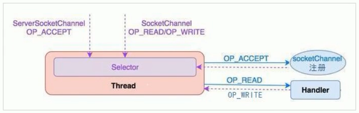
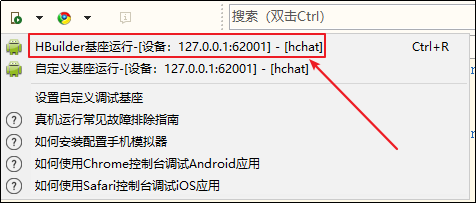

## 基于Netty网络编程

## 1. Netty介绍与相关基础知识

### 1.1 Netty介绍 

Netty是由JBOSS提供的一个Java开源框架。Netty提供**异步**的、**事件驱动**的网络应用程序框架和工具，用以快速开发高性能、高可靠性的网络服务器和客户端程序。

Netty 是一个基于NIO的客户、服务器端编程框架，使用Netty可以确保你快速和简单的开发出一个网络应用，例如实现了某种协议的客户、服务端应用。Netty相当于简化和流线化了网络应用的编程开发过程，例如：基于TCP和UDP的socket服务开发。

“快速”和“简单”并不用产生维护性或性能上的问题。Netty 是一个吸收了多种协议（包括FTP、SMTP、HTTP等各种二进制文本协议）的实现经验，并经过相当精心设计的项目。最终 Netty 成功的找到了一种方式，在保证易于开发的同时还保证了其应用的性能，稳定性和伸缩性。

- Netty提供了简单易用的API
- 基于事件驱动的编程方式来编写网络通信程序
- 更高的吞吐量
- 学习难度低

应用场景
- Dubbo框架
- 大数据 Apache Storm
  - Supervisor worker进程间的通信也是基于Netty来实现的

### 1.2 BIO、NIO、AIO介绍与区别

阻塞与非阻塞
- 主要指的是访问IO的线程是否会阻塞（或者说是等待）
- 线程访问资源，该资源是否准备就绪的一种处理方式。


同步和异步
- 主要是指的数据的请求方式
- 同步和异步是指访问数据的一种机制


BIO 全称 Block IO 同步阻塞IO，IO操作时会阻塞线程，并发处理能力低。
- Java Socket编程就是BIO，一个Socket连接一个处理线程（这个线程负责这个Socket连接的一系列数据传输操作）。阻塞的原因在于：操作系统允许的线程数量是有限的，多个Socket申请与服务端建立连接时，服务端不能提供相应数量的处理线程，没有分配到处理线程的连接就会阻塞等待或被拒绝。


NIO 全称 None-Block IO 同步非阻塞IO
- NIO 是对 BIO 的改进，基于 Reactor 模型。
- 一个Socket连接只有在特点时候才会发生数据传输IO操作，大部分时间这个“数据通道”是空闲的，但还是占用着线程。NIO 作出的改进就是“一个请求一个线程”，在连接到服务端的众多Socket中，只有需要进行IO操作的才能获取服务端的处理线程进行IO。这样就不会因为线程不够用而限制了Socket的接入。


AIO(NIO 2.0) 异步非阻塞IO
- 这种IO模型是由操作系统先完成了客户端请求处理再通知服务器去启动线程进行处理。
- AIO 也称 NIO2.0，在JDK7开始支持。

### 1.3 Netty Reactor模型 - 单线程模型、多线程模型、主从多线程模型介绍

#### 1.3.1 单线程模型

用户发起IO请求到Reactor线程,Reactor线程将用户的IO请求放入到通道，然后再进行后续处理处理完成后，Reactor线程重新获得控制权，继续其他客户端的处理

这种模型一个时间点只有一个任务在执行，这个任务执行完了，再去执行下一个任务。
- 单线程的Reactor模型每一个用户事件都在一个线程中执行
- 性能有极限，不能处理成百上千的事件
- 当负荷达到一定程度时，性能将会下降
- 某一个事件处理器发生故障，不能继续处理其他事件




#### 1.3.2 Reactor多线程模型

Reactor 多线程模型是由一组 NIO 线程来处理IO操作(之前是单个线程)，所以在请求处理上会比上一中模型效率更高，可以处理更多的客户端请求。

这种模式使用多个线程执行多个任务，任务可以同时执行


但是如果并发仍然很大，Reactor仍然无法处理大量的客户端请求

#### 1.3.3 Reactor主从多线程模型

这种线程模型是 Netty 推荐使用的线程模型

这种模型适用于高并发场景，一组线程池接收请求，一组线程池处理IO。


### 1.4 Netty - 基于web socket简单聊天DEMO实现

导入依赖
```xml
<dependencies>
    <dependency>
        <groupId>io.netty</groupId>
        <artifactId>netty-all</artifactId>
        <version>4.1.15.Final</version>
    </dependency>
</dependencies>

<build>
    <plugins>
        <plugin>
            <groupId>org.apache.maven.plugins</groupId>
            <artifactId>maven-compiler-plugin</artifactId>
            <version>3.1</version>
            <configuration>
                <target>1.8</target>
                <source>1.8</source>
            </configuration>
        </plugin>
    </plugins>
</build>
```


编写Netty Server
```java
public class WebsocketServer {
    public static void main(String[] args) throws InterruptedException {
        // 初始化主线程池（boss线程池）
        NioEventLoopGroup mainGroup = new NioEventLoopGroup();
        // 初始化从线程池(worker线程池)
        NioEventLoopGroup subGroup = new NioEventLoopGroup();

        try {
            // 创建服务器启动器
            ServerBootstrap b = new ServerBootstrap();

            // 指定使用主线程池和从线程池
            b.group(mainGroup, subGroup)
                    // 指定使用Nio通道类型
                    .channel(NioServerSocketChannel.class)
                    // 指定通道初始化器加载通道处理器
                    .childHandler(new WsServerInitializer());

            // 绑定端口号启动服务器，并等待服务器启动
            // ChannelFuture是Netty的回调消息
            ChannelFuture future = b.bind(9090).sync();
            // 等待服务器socket关闭
            future.channel().closeFuture().sync();
        } finally {
            // 优雅关闭boos线程池和worker线程池
            mainGroup.shutdownGracefully();
            subGroup.shutdownGracefully();
        }
    }
}
```

编写通道初始化器
```java
public class WsServerInitializer extends ChannelInitializer<SocketChannel> {
    @Override
    protected void initChannel(SocketChannel ch) throws Exception {
        ChannelPipeline pipeline = ch.pipeline();

        // ------------------
        // 用于支持Http协议

        // websocket基于http协议，需要有http的编解码器
        pipeline.addLast(new HttpServerCodec());
        // 对写大数据流的支持
        pipeline.addLast(new ChunkedWriteHandler());
        // 添加对HTTP请求和响应的聚合器:只要使用Netty进行Http编程都需要使用
        // 对HttpMessage进行聚合，聚合成FullHttpRequest或者FullHttpResponse
        // 在netty编程中都会使用到Handler
        pipeline.addLast(new HttpObjectAggregator(1024 * 64));


        // ---------支持Web Socket -----------------

        // websocket服务器处理的协议，用于指定给客户端连接访问的路由: /ws
        // 本handler会帮你处理一些握手动作: handshaking(close, ping, pong) ping + pong = 心跳
        // 对于websocket来讲，都是以frames进行传输的，不同的数据类型对应的frames也不同
        pipeline.addLast(new WebSocketServerProtocolHandler("/ws"));

        // 添加自定义的handler
        pipeline.addLast(new ChatHandler());
    }
}
```

编写处理消息的ChannelHandler
```java
/**
 * 处理消息的handler
 * TextWebSocketFrame: 在netty中，是用于为websocket专门处理文本的对象，frame是消息的载体
 */
public class ChatHandler extends SimpleChannelInboundHandler<TextWebSocketFrame> {

    // 用于记录和管理所有客户端的Channel
    private static ChannelGroup clients = new DefaultChannelGroup(GlobalEventExecutor.INSTANCE);

    @Override
    protected void channelRead0(ChannelHandlerContext ctx, TextWebSocketFrame msg) throws Exception {
        // 获取从客户端传输过来的消息
        String text = msg.text();
        System.out.println("接收到的数据:" + text);

        // 将接收到消息发送到所有客户端
        for(Channel channel : clients) {
            // 注意所有的websocket数据都应该以TextWebSocketFrame进行封装
            channel.writeAndFlush(new TextWebSocketFrame("[服务器接收到消息:]"
                    + LocalDateTime.now() + ",消息为:" + text));
        }
    }

    /**
     * 当客户端连接服务端之后（打开连接）
     * 获取客户端的channel，并且放入到ChannelGroup中去进行管理
     * @param ctx
     * @throws Exception
     */
    @Override
    public void handlerAdded(ChannelHandlerContext ctx) throws Exception {
        // 将channel添加到客户端
        clients.add(ctx.channel());
    }

    @Override
    public void handlerRemoved(ChannelHandlerContext ctx) throws Exception {
        // 当触发handlerRemoved，ChannelGroup会自动移除对应客户端的channel
        //clients.remove(ctx.channel());

        // asLongText()——唯一的ID
        // asShortText()——短ID（有可能会重复)
        System.out.println("客户端断开, channel对应的长id为:" + ctx.channel().id().asLongText());
        System.out.println("客户端断开, channel对应的短id为:" + ctx.channel().id().asShortText());
    }
}
```


## 1.5 websocket以及前端代码编写

WebSocket protocol 是HTML5一种新的协议。它实现了浏览器与服务器全双工通信(full-duplex)。一开始的握手需要借助HTTP请求完成。Websocket是应用层第七层上的一个应用层协议，它必须依赖 HTTP 协议进行一次握手，握手成功后，数据就直接从 TCP 通道传输，与 HTTP 无关了。

前端编写
```html
<!DOCTYPE html>
<html>
   <head>
      <meta charset="UTF-8">
      <title></title>
   </head>
   <body>
      <div>发送消息</div>
      <input type="text" id="msgContent" />
      <input type="button" value="点击发送" onclick="CHAT.chat()"/>
      
      <div>接收消息:</div>
      <div id="recMsg" style="background-color: gainsboro;"></div>
      
      <script type="application/javascript">
         window.CHAT = {
            socket: null,
            init: function() {
               // 判断浏览器是否支持websocket
               if(window.WebSocket) {
                  // 支持WebScoekt
                  // 连接创建socket，注意要添加ws后缀
                  CHAT.socket = new WebSocket("ws://127.0.0.1:9001/ws");
                  CHAT.socket.onopen = function() {
                     console.log("连接建立成功");
                  };
                  
                  CHAT.socket.onclose = function() {
                     console.log("连接关闭")
                  };
                  
                  CHAT.socket.onerror = function() {
                     console.log("发生错误");
                  };
                  
                  CHAT.socket.onmessage = function(e) {
                     console.log("接收到消息:" + e.data);
                     var recMsg = document.getElementById("recMsg");
                     var html = recMsg.innerHTML;
                     recMsg.innerHTML = html + "<br/>" + e.data;
                  };
                  
               }
               else {
                  alert("浏览器不支持websocket协议");
               }
            },
            chat: function() {
               var msg = document.getElementById("msgContent");
               CHAT.socket.send(msg.value);
            }
         }
         
         CHAT.init();
      </script>
   </body>
</html>
```


## 1.6 MUI、HTML5+、HBuilder介绍

[MUI介绍](http://dev.dcloud.net.cn/mui/)
- MUI是一个轻量级的前端框架。MUI以iOS平台UI为基础，补充部分Android平台特有的UI控件。MUI不依赖任何第三方JS库，压缩后的JS和CSS文件仅有100+K和60+K，可以根据自己的需要，自定义去下载对应的模块。并且MUI编写的前端，可以打包成APK和IPA安装文件，在手机端运行。也就是，编写一套代码，就可以在Android、IOS下运行。
- [API地址](http://dev.dcloud.net.cn/mui/ui/)

H5+提供了对HTML5的增强，提供了 40W API 给程序员使用。使用H5+ API可以轻松开发二维码扫描、摄像头、地图位置、消息推送等功能
- [API地址](http://www.html5plus.org/doc/zh_cn/accelerometer.html#)

  

HBuilder 前端开发工具。本次项目所有的前端使用HBuilder开发。在项目开发完后，也会使用HBuilder来进行打包Android/IOS的安装包。[地址](http://www.dcloud.io/)

### 1.7 MUI前端开发
#### 1.7.1 创建项目/页面/添加MUI元素

创建MUI移动App项目


页面创建，添加组件
 - [API地址](http://dev.dcloud.net.cn/mui/ui/#accordion)

```html
<header class="mui-bar mui-bar-nav">
    <h1 class="mui-title">登录页面</h1>
</header>
<div class="mui-content">
    <form class="mui-input-group">
        <div class="mui-input-row">
            <label>用户名</label>
            <input type="text" class="mui-input-clear" placeholder="请输入用户名">
        </div>
        <div class="mui-input-row">
            <label>密码</label>
            <input type="password" class="mui-input-password" placeholder="请输入密码">
        </div>
        <div class="mui-button-row">
            <button type="button" class="mui-btn mui-btn-primary">确认</button>
            <button type="button" class="mui-btn mui-btn-danger">取消</button>
        </div>
    </form>
</div>
```

#### 1.7.2 获取页面元素/添加点击事件

获取页面元素
```js
mui.plusReady(function() {
    // 使用document.getElementById来获取Input组件数据
    var username = document.getElementById("username");
    var password = document.getElementById("password");
    var confirm = document.getElementById("confirm");
    
    // 绑定事件
    confirm.addEventListener("tap", function() {
        alert("按下按钮");
    });
});
```

批量绑定页面元素的点击事件
```js
mui(".mui-table-view").on('tap','.mui-table-view-cell',function(){

});
```

使用原生JS的事件绑定方式
```js
// 绑定事件
confirm.addEventListener("tap", function() {
    alert("按下按钮");
});
```


#### 1.7.3 发起ajax请求

前端当点击确认按钮的时候，将用户名和密码发送给后端服务器


```js
// 发送ajax请求
mui.ajax('http://192.168.1.106:9000/login', {
    data: {
        username: username.value,
        password: password.value
    },
    dataType: 'json', //服务器返回json格式数据
    type: 'post', //HTTP请求类型
    timeout: 10000, //超时时间设置为10秒；
    headers: {
        'Content-Type': 'application/json'
    },
    success: function(data) {
        // 可以使用console.log打印数据，一般用于调试
        console.log(data);
    },
    error: function(xhr, type, errorThrown) {
        //异常处理；
        console.log(type);
    }
});
```

后端基于 SpringBoot 编写一个web应用，主要是用于接收ajax请求，响应一些数据到前端
```java
@RestController
public class LoginController {

    @RequestMapping("/login")
    public Map login(@RequestBody User user) {
        System.out.println(user);

        Map map = new HashMap<String, Object>();

        if("tom".equals(user.getUsername()) && "123".equals(user.getPassword())) {
            map.put("success", true);
            map.put("message", "登录成功");
        }
        else {
            map.put("success", false);
            map.put("message", "登录失败，请检查用户名和密码是否输入正确");
        }

        return map;
    }
}
```

#### 1.7.4 字符串转JSON对象以及JSON对象转字符串

将JSON对象转换为字符串
```java
// 使用JSON.stringify可以将JSON对象转换为String字符串
console.log(JSON.stringify(data));
```

将字符串转换为JSON对象
```java
var jsonObj = JSON.parse(jsonStr);
```

#### 1.7.5 页面跳转

```js
mui.openWindow({
	url: 'login_succss.html', 
	id:'login_succss.html'
});
```

#### 1.7.6 App客户端缓存操作

大量的App很多时候都需要将服务器端响应的数据缓存到手机App本地。[相关API](http://www.html5plus.org/doc/zh_cn/storage.html)

在App中缓存的数据，就是以key/value键值对来存放的。


将数据放入到本地缓存中
```js
var user =  {
	username: username.value,
	password: password.value
}
// 将对象数据放入到缓存中，需要转换为字符串
plus.storage.setItem("user", JSON.stringify(user));
```

从本地缓存中读取数据
```js
// 从storage本地缓存中获取对应的数据
var userStr = plus.storage.getItem("user");
```

## 2 构建项目
### 2.1 项目功能需求、技术架构介绍

功能需求
- 登录/注册
- 个人信息
- 搜索添加好友
- 好友聊天

技术架构
- 前端
  - 开发工具：HBuilder 
  - 框架：MUI、H5+
- 后端
  - 开发工具：IDEA
  - 框架：Spring Boot、MyBatis、Spring MVC、FastDFS、Netty
  - 数据库：mysql

### 2.2 使用模拟器进行测试

安装附件中的夜神Android模拟器`nox_setup_v6.2.3.8_full.exe`
- 双击桌面图标启动模拟器

  

- 安装后找到模拟器的安装目录

  

- 命令行中执行以下命令
  ```shell script
  nox_adb connect 127.0.0.1:62001
  nox_adb devices
  ```

进入到Hbuilder安装目录下的tools/adbs目录


- 切换到命令行中执行以下命令
```shell script
adb connect 127.0.0.1:62001
adb devices
```

- 打开HBuilder开始调试

  

### 2.3 前端 - HBuilder前端项目导入

将资料中的`heima-chat.zip`解压，并导入到HBuilder中。

### 2.4 后端 - 导入数据库/SpringBoot项目/MyBatis逆向工程

导入数据库脚本
```mysql
/*
SQLyog Ultimate v12.09 (64 bit)
MySQL - 5.1.30-community : Database - hchat
*********************************************************************
*/

/*!40101 SET NAMES utf8 */;

/*!40101 SET SQL_MODE=''*/;

/*!40014 SET @OLD_UNIQUE_CHECKS=@@UNIQUE_CHECKS, UNIQUE_CHECKS=0 */;
/*!40014 SET @OLD_FOREIGN_KEY_CHECKS=@@FOREIGN_KEY_CHECKS, FOREIGN_KEY_CHECKS=0 */;
/*!40101 SET @OLD_SQL_MODE=@@SQL_MODE, SQL_MODE='NO_AUTO_VALUE_ON_ZERO' */;
/*!40111 SET @OLD_SQL_NOTES=@@SQL_NOTES, SQL_NOTES=0 */;
CREATE DATABASE /*!32312 IF NOT EXISTS*/`hchat` /*!40100 DEFAULT CHARACTER SET utf8 */;

USE `hchat`;

/*Table structure for table `tb_chat_record` */

DROP TABLE IF EXISTS `tb_chat_record`;

CREATE TABLE `tb_chat_record` (
  `id` varchar(255) NOT NULL COMMENT 'id',
  `userid` varchar(255) DEFAULT NULL COMMENT '用户id',
  `friendid` varchar(255) DEFAULT NULL COMMENT '好友id',
  `has_read` int(1) DEFAULT NULL COMMENT '是否已读',
  `createtime` date DEFAULT NULL COMMENT '聊天时间',
  `has_delete` int(1) DEFAULT NULL COMMENT '是否删除',
  `message` varchar(1024) DEFAULT NULL COMMENT '消息',
  PRIMARY KEY (`id`)
) ENGINE=InnoDB DEFAULT CHARSET=utf8;

/*Data for the table `tb_chat_record` */

insert  into `tb_chat_record`(`id`,`userid`,`friendid`,`has_read`,`createtime`,`has_delete`,`message`) values ('1054336768620494848','1053865859895918592','1053866017622720512',1,'2018-10-22',0,'12333'),('1054345911163027456','1053865859895918592','1053866017622720512',1,'2018-10-22',0,'12333123'),('1054345921866891264','1053865859895918592','1053866017622720512',1,'2018-10-22',0,'1233'),('1054345939197755392','1053865859895918592','1053866017622720512',1,'2018-10-22',0,'打发'),('1054345954632794112','1053866017622720512','1053865859895918592',1,'2018-10-22',0,'大方法 a的孙菲菲'),('1054345967593193472','1053866017622720512','1053865859895918592',1,'2018-10-22',0,'是的方法发斯蒂芬'),('1054345981967073280','1053865859895918592','1053866017622720512',1,'2018-10-22',0,'阿斯顿发'),('1054346300146974720','1053865859895918592','1053866017622720512',1,'2018-10-22',0,'12333123'),('1054346310108446720','1053866017622720512','1053865859895918592',1,'2018-10-22',0,'1233123'),('1054346803471843328','1053865859895918592','1053866017622720512',1,'2018-10-22',0,'12333123'),('1054347352837586944','1053865859895918592','1053866017622720512',1,'2018-10-22',0,'123123123'),('1054347374660550656','1053865859895918592','1053866017622720512',1,'2018-10-22',0,'12333'),('1054349491265732608','1053865859895918592','1053866017622720512',1,'2018-10-22',0,'12333'),('1054349499641757696','1053866017622720512','1053865859895918592',1,'2018-10-22',0,'1231323'),('1054349510282706944','1053866017622720512','1053865859895918592',1,'2018-10-22',0,'12333123'),('1054349518822309888','1053865859895918592','1053866017622720512',1,'2018-10-22',0,'12333333'),('1054349528045584384','1053866017622720512','1053865859895918592',1,'2018-10-22',0,'12333'),('1054349563634253824','1053865859895918592','1053866017622720512',1,'2018-10-22',0,'你好，我的名字叫做陈圆圆'),('1054358949668716544','1053865859895918592','1053866017622720512',1,'2018-10-22',0,'测试'),('1054358988776407040','1053865859895918592','1053866017622720512',1,'2018-10-22',0,'1111'),('1054358998712713216','1053865859895918592','1053866017622720512',1,'2018-10-22',0,'4444'),('1054359038499880960','1053865859895918592','1053866017622720512',1,'2018-10-22',0,'测试'),('1054359306767564800','1053865859895918592','1053866017622720512',1,'2018-10-22',0,'测试'),('1054360455734231040','1053866017622720512','1053624336767909888',0,'2018-10-22',0,'而是'),('1054361147450458112','1053865702823428096','1053866017622720512',0,'2018-10-22',1,'ces'),('1054361191524204544','1053865702823428096','1053866017622720512',0,'2018-10-22',1,'我爱你'),('1054361576641003520','1053865702823428096','1053866017622720512',0,'2018-10-22',1,'12333'),('1054361921781891072','1053865702823428096','1053866017622720512',0,'2018-10-22',1,'我是爱你的'),('1054361975003414528','1053865702823428096','1053865859895918592',0,'2018-10-22',1,'wo ye 爱你'),('1054362752665124864','1053865702823428096','1053866017622720512',0,'2018-10-22',1,'111'),('1054362779961655296','1053865702823428096','1053866017622720512',0,'2018-10-22',1,'ces'),('1054362844759457792','1053865702823428096','1053865859895918592',0,'2018-10-22',1,'故意的吧，我才不吃这套'),('1054363194069483520','1053865859895918592','1053865702823428096',1,'2018-10-22',0,'12333'),('1054363205322801152','1053865859895918592','1053865702823428096',1,'2018-10-22',0,'444'),('1054365974054174720','1053865702823428096','1053866017622720512',0,'2018-10-22',1,'123333'),('1054366023047839744','1053865702823428096','1053865859895918592',1,'2018-10-22',1,'ces'),('1054366088009220096','1053865702823428096','1053866017622720512',0,'2018-10-22',1,'玩意'),('1054366839477501952','1053865702823428096','1053866017622720512',0,'2018-10-22',1,'12333'),('1054367895074766848','1053865702823428096','1053866017622720512',0,'2018-10-22',1,'擦'),('1054367983650078720','1053865702823428096','1053866017622720512',0,'2018-10-22',1,'ces aaa'),('1054368063102779392','1053866017622720512','1053866017622720512',0,'2018-10-22',0,'测试侧啊哈'),('1054368123295236096','1053866017622720512','1053865702823428096',1,'2018-10-22',0,'测试'),('1054370202835353600','1053865859895918592','1053866017622720512',1,'2018-10-22',0,'1231233'),('1054370251246010368','1053866017622720512','1053865859895918592',1,'2018-10-22',0,'测试'),('1054375740956606464','1053866017622720512','1053865859895918592',1,'2018-10-22',0,'你说什么呢？'),('1054375827506069504','1053866017622720512','1053865859895918592',1,'2018-10-22',0,'不错啊~'),('1054375849870098432','1053866017622720512','1053865859895918592',1,'2018-10-22',0,'是谁~~'),('1054375908871372800','1053866017622720512','1053865859895918592',1,'2018-10-22',0,'不错啊'),('1054702152733294592','1053866017622720512','1053865702823428096',1,'2018-10-23',0,'1'),('1054702170240319488','1053866017622720512','1053865702823428096',1,'2018-10-23',0,'2222'),('1054702253123960832','1053865702823428096','1053865859895918592',0,'2018-10-23',1,'测试'),('1054704666241269760','1053865702823428096','1053866017622720512',1,'2018-10-23',1,'1233'),('1054704780280201216','1053865702823428096','1053865859895918592',0,'2018-10-23',1,'12333'),('1054709646394261504','1053865702823428096','1053865859895918592',0,'2018-10-23',1,'daf'),('1054709697808039936','1053865702823428096','1053865859895918592',0,'2018-10-23',1,'我爱你\n\n\n你呢？'),('1054709997335871488','1053865702823428096','1053865859895918592',0,'2018-10-23',1,'你爱我像谁？');

/*Table structure for table `tb_friend` */

DROP TABLE IF EXISTS `tb_friend`;

CREATE TABLE `tb_friend` (
  `id` varchar(255) NOT NULL,
  `userid` varchar(255) DEFAULT NULL COMMENT '用户id',
  `friends_id` varchar(255) DEFAULT NULL COMMENT '好友id',
  `comments` varchar(255) DEFAULT NULL COMMENT '备注',
  `createtime` date DEFAULT NULL COMMENT '添加好友日期',
  PRIMARY KEY (`id`),
  UNIQUE KEY `UK` (`userid`,`friends_id`)
) ENGINE=InnoDB DEFAULT CHARSET=utf8;

/*Data for the table `tb_friend` */

insert  into `tb_friend`(`id`,`userid`,`friends_id`,`comments`,`createtime`) values ('1','1','2','小红','2018-10-18'),('1053698078500061184','1052862740374355968','1052863429469143040',NULL,'2018-10-21'),('1053698078500061185','1052863429469143040','1052862740374355968',NULL,'2018-10-21'),('1053841611563335680','1','1052863429469143040',NULL,'2018-10-21'),('1053841611563335681','1052863429469143040','1',NULL,'2018-10-21'),('1053868447122980864','1053866017622720512','1053865702823428096',NULL,'2018-10-21'),('1053868447122980865','1053865702823428096','1053866017622720512',NULL,'2018-10-21'),('1053868517524373504','1053866017622720512','1053865859895918592',NULL,'2018-10-21'),('1053868517528567808','1053865859895918592','1053866017622720512',NULL,'2018-10-21'),('1053873962859233280','1053866017622720512','1053624336767909888',NULL,'2018-10-21'),('1053873962859233281','1053624336767909888','1053866017622720512',NULL,'2018-10-21'),('1053874659499573248','1053624336767909888','1',NULL,'2018-10-21'),('1053874659499573249','1','1053624336767909888',NULL,'2018-10-21'),('1053875535396077568','1','1053865859895918592',NULL,'2018-10-21'),('1053875827177029632','1053865702823428096','1053865859895918592',NULL,'2018-10-21'),('1053875827177029633','1053865859895918592','1053865702823428096',NULL,'2018-10-21');

/*Table structure for table `tb_friend_req` */

DROP TABLE IF EXISTS `tb_friend_req`;

CREATE TABLE `tb_friend_req` (
  `id` varchar(255) NOT NULL COMMENT 'id',
  `from_userid` varchar(255) DEFAULT NULL COMMENT '请求好友用户id',
  `to_userid` varchar(255) DEFAULT NULL COMMENT '被请求好友用户id',
  `createtime` date DEFAULT NULL COMMENT '请求时间',
  `message` varchar(255) DEFAULT NULL COMMENT '发送的消息',
  `status` int(1) DEFAULT NULL COMMENT '是否已处理',
  PRIMARY KEY (`id`)
) ENGINE=InnoDB DEFAULT CHARSET=utf8;

/*Data for the table `tb_friend_req` */

insert  into `tb_friend_req`(`id`,`from_userid`,`to_userid`,`createtime`,`message`,`status`) values ('1','1','2','2018-10-18','约吗？',0),('1053676663482744832','1052863429469143040','1052862740374355968','2018-10-20',NULL,0),('1053867078517391360','1053866017622720512','1053865702823428096','2018-10-21',NULL,1),('1053867789531611136','1053866017622720512','1053865859895918592','2018-10-21',NULL,1),('1053873903123955712','1053866017622720512','1053624336767909888','2018-10-21',NULL,1),('1053874175137153024','1053624336767909888','1','2018-10-21',NULL,1),('1053875437597491200','1','1053865859895918592','2018-10-21',NULL,1),('1053875785401761792','1053865702823428096','1053865859895918592','2018-10-21',NULL,1),('1053977669869371392','1053865859895918592','1052862740374355968','2018-10-21',NULL,0),('1054367737066946560','1053865702823428096','1052862740374355968','2018-10-22',NULL,0),('1054698132467744768','1053865859895918592','1052863429469143040','2018-10-23',NULL,0),('2','1052862740374355968','1052863429469143040','2018-10-21',NULL,1),('3','1','1052863429469143040','2018-10-21',NULL,1);

/*Table structure for table `tb_user` */

DROP TABLE IF EXISTS `tb_user`;

CREATE TABLE `tb_user` (
  `id` varchar(255) NOT NULL COMMENT 'ID',
  `username` varchar(255) DEFAULT NULL COMMENT '用户名',
  `password` varchar(255) DEFAULT NULL COMMENT '密码',
  `pic_small` varchar(255) DEFAULT NULL COMMENT '头像（小尺寸）',
  `pic_normal` varchar(255) DEFAULT NULL COMMENT '头像（正常尺寸）',
  `nickname` varchar(255) DEFAULT NULL COMMENT '昵称',
  `qrcode` varchar(255) DEFAULT NULL COMMENT '二维码',
  `client_id` varchar(255) DEFAULT NULL COMMENT '手机端唯一ID',
  `sign` varchar(1024) DEFAULT NULL COMMENT '签名',
  `createtime` date DEFAULT NULL COMMENT '注册日期',
  `phone` varchar(255) DEFAULT NULL COMMENT '绑定手机',
  PRIMARY KEY (`id`)
) ENGINE=InnoDB DEFAULT CHARSET=utf8;

/*Data for the table `tb_user` */

insert  into `tb_user`(`id`,`username`,`password`,`pic_small`,`pic_normal`,`nickname`,`qrcode`,`client_id`,`sign`,`createtime`,`phone`) values ('1','xiaoming','c4ca4238a0b923820dcc509a6f75849b','group1/M00/00/00/wKgZh1vLBgyAPTjOAAC_SchJrPk207_150x150.png','group1/M00/00/00/wKgZh1vLBgyAPTjOAAC_SchJrPk207.png','小明',NULL,'001','我是小明，是一个老实人','2018-10-18','13899009900'),('1052862740374355968','123','c4ca4238a0b923820dcc509a6f75849b','group1/M00/00/00/wKgZh1vLBgyAPTjOAAC_SchJrPk207_150x150.png','group1/M00/00/00/wKgZh1vLBgyAPTjOAAC_SchJrPk207.png','123','','ebf198c74a79cca033fa729dcb6f2f92',NULL,'2018-10-18',NULL),('1052863429469143040','123123','c4ca4238a0b923820dcc509a6f75849b','group1/M00/00/00/wKgZh1vMZDiABdAwAAPyBUblp3I984_150x150.png','group1/M00/00/00/wKgZh1vMZDiABdAwAAPyBUblp3I984.png','师哥','','ebf198c74a79cca033fa729dcb6f2f92',NULL,'2018-10-18',NULL),('1053624336767909888','zhoufeng','c4ca4238a0b923820dcc509a6f75849b','group1/M00/00/00/wKgZh1vLBgyAPTjOAAC_SchJrPk207_150x150.png','group1/M00/00/00/wKgZh1vLBgyAPTjOAAC_SchJrPk207_150x150.png','zhoufeng123123','group1/M00/00/00/wKgZh1vLH8CADN1mAAABlWmOIYM605.png','null',NULL,'2018-10-20',NULL),('1053865702823428096','zinv','c4ca4238a0b923820dcc509a6f75849b','group1/M00/00/00/wKgZh1vMAJuAJBi9AABxk6tMqIU831_150x150.png','group1/M00/00/00/wKgZh1vMAJuAJBi9AABxk6tMqIU831.png','紫女','group1/M00/00/00/wKgZh1vMAIuAYKnEAAABL25nAZA682.png','ebf198c74a79cca033fa729dcb6f2f92',NULL,'2018-10-21',NULL),('1053865859895918592','yanlj','c4ca4238a0b923820dcc509a6f75849b','group1/M00/00/00/wKgZh1vPB7eAYtF9AABAYwGAXF8706_150x150.png','group1/M00/00/00/wKgZh1vPB7eAYtF9AABAYwGAXF8706.png','焰灵姬','group1/M00/00/00/wKgZh1vMAK-AVG4tAAABMQi6VuY521.png','ebf198c74a79cca033fa729dcb6f2f92',NULL,'2018-10-21',NULL),('1053866017622720512','weizhuang','c4ca4238a0b923820dcc509a6f75849b','group1/M00/00/00/wKgZh1vMASWAKraPAAKnlzT6qmE449_150x150.png','group1/M00/00/00/wKgZh1vMASWAKraPAAKnlzT6qmE449.png','卫庄','group1/M00/00/00/wKgZh1vMANWAczzAAAABJXDq5OQ972.png','ebf198c74a79cca033fa729dcb6f2f92',NULL,'2018-10-21',NULL),('2','xiaohong','000000','group1/M00/00/00/wKgZh1vLBgyAPTjOAAC_SchJrPk207_150x150.png','group1/M00/00/00/wKgZh1vLBgyAPTjOAAC_SchJrPk207.png','小红',NULL,'002','我是小红，出名的背锅侠','2018-10-18','13899009901');

/*!40101 SET SQL_MODE=@OLD_SQL_MODE */;
/*!40014 SET FOREIGN_KEY_CHECKS=@OLD_FOREIGN_KEY_CHECKS */;
/*!40014 SET UNIQUE_CHECKS=@OLD_UNIQUE_CHECKS */;
/*!40111 SET SQL_NOTES=@OLD_SQL_NOTES */;
```

使用MyBatis逆向工程生成代码
- `generatorSqlmapCustom`项目导入到IDEA中，并配置项目所使用的JDK

创建Spring Boot项目
- `pom.xml`
  ```xml
  <?xml version="1.0" encoding="UTF-8"?>
  <project xmlns="http://maven.apache.org/POM/4.0.0"
           xmlns:xsi="http://www.w3.org/2001/XMLSchema-instance"
           xsi:schemaLocation="http://maven.apache.org/POM/4.0.0 http://maven.apache.org/xsd/maven-4.0.0.xsd">
      <modelVersion>4.0.0</modelVersion>
  
      <groupId>com.itheima.hchat</groupId>
      <artifactId>hchat-server</artifactId>
      <version>1.0-SNAPSHOT</version>
      <build>
          <plugins>
              <plugin>
                  <groupId>org.springframework.boot</groupId>
                  <artifactId>spring-boot-maven-plugin</artifactId>
                  <version>1.5.14.RELEASE</version>
                  <configuration>
                      <fork>true</fork>
                  </configuration>
              </plugin>
          </plugins>
      </build>
  
      <parent>
          <groupId>org.springframework.boot</groupId>
          <artifactId>spring-boot-starter-parent</artifactId>
          <version>1.5.14.RELEASE</version>
      </parent>
  
      <properties>
          <project.build.sourceEncoding>UTF-8</project.build.sourceEncoding>
          <project.reporting.outputEncoding>UTF-8</project.reporting.outputEncoding>
          <java.version>1.8</java.version>
      </properties>
  
      <dependencies>
          <dependency>
              <groupId>org.springframework.boot</groupId>
              <artifactId>spring-boot-starter-web</artifactId>
          </dependency>
  
          <dependency>
              <groupId>org.springframework.boot</groupId>
              <artifactId>spring-boot-starter-jdbc</artifactId>
          </dependency>
  
          <dependency>
              <groupId>org.mybatis.spring.boot</groupId>
              <artifactId>mybatis-spring-boot-starter</artifactId>
              <version>1.3.1</version>
          </dependency>
  
          <dependency>
              <groupId>mysql</groupId>
              <artifactId>mysql-connector-java</artifactId>
              <version>5.1.6</version>
          </dependency>
  
          <!-- 热部署 -->
          <dependency>
              <groupId>org.springframework.boot</groupId>
              <artifactId>spring-boot-devtools</artifactId>
          </dependency>
  
          <!--整合Netty-->
          <dependency>
              <groupId>io.netty</groupId>
              <artifactId>netty-all</artifactId>
              <version>4.1.25.Final</version>
          </dependency>
  
          <!--整合FastDFS-->
          <dependency>
              <groupId>com.github.tobato</groupId>
              <artifactId>fastdfs-client</artifactId>
              <version>1.25.2-RELEASE</version>
          </dependency>
  
          <dependency>
              <groupId>org.springframework.boot</groupId>
              <artifactId>spring-boot-starter-test</artifactId>
          </dependency>
  
          <!-- 二维码 -->
          <dependency>
              <groupId>com.google.zxing</groupId>
              <artifactId>javase</artifactId>
              <version>3.3.3</version>
          </dependency>
  
          <dependency>
              <groupId>com.alibaba</groupId>
              <artifactId>fastjson</artifactId>
              <version>1.2.28</version>
          </dependency>
      </dependencies>
  </project>
  ```
- `application.properties`配置文件
  ```properties
  server.port=9000
  server.context-path=/
  
  #临时文件保存目录
  hcat.tmpdir=C:/Users/Administrator
  
  #数据库源配置
  spring.datasource.driver-class-name=com.mysql.jdbc.Driver
  spring.datasource.url=jdbc:mysql://localhost:3306/hchat?useUnicode=true&characterEncoding=UTF-8
  spring.datasource.username=root
  spring.datasource.password=000000
  spring.datasource.hikari.connection-timeout=30000
  spring.datasource.hikari.minimum-idle=5
  spring.datasource.hikari.maximum-pool-size=15
  spring.datasource.hikari.auto-commit=true
  
  #Mybatis配置
  mybatis.type-aliases-package=tk.deriwotua.hchat.pojo
  mybatis.mapper-locations=classpath:mapper/*.xml
  
  #整合FASTDFS
  fdfs.soTimeout=1501
  fdfs.connectTimeout=601 
  #缩略图生成参数
  fdfs.thumbImage.width=150
  fdfs.thumbImage.height=150
  #TrackerList参数,支持多个
  fdfs.trackerList[0]=192.168.25.135:22122
  
  #HTTP URL
  fdfs.httpurl=http://192.168.25.135/
  ```

### 2.5 后端 - Spring Boot整合Netty搭建后台

Spring boot整合Netty导入spring-netty中的java文件

启动Spring Boot，导入HTML页面,使用浏览器打开测试Netty是否整合成功

## 3 业务开发 - 用户注册/登录/个人信息
 
### 3.1 用户登录功能 -后端开发

导入`IdWorker.java`雪花算法ID生成器

初始化IdWorker
```java
@SpringBootApplication
@MapperScan(basePackages = "com.itheima.hchat.mapper")
public class Application {
    public static void main(String[] args) {
        SpringApplication.run(Application.class);
    }

    @Bean
    public IdWorker idWorker() {
        return new IdWorker(0, 0);
    }
}
```

创建Result实体类
```java
/**
 * 将返回给客户端的数据封装到实体类中
 */
public class Result {
    private boolean success; // 是否操作成功
    private String message; // 返回消息
    private Object result; // 返回附件的对象

    public Result(boolean success, String message) {
        this.success = success;
        this.message = message;
    }

    public Result(boolean success, String message, Object result) {
        this.success = success;
        this.message = message;
        this.result = result;
    }

    public boolean isSuccess() {
        return success;
    }

    public void setSuccess(boolean success) {
        this.success = success;
    }

    public String getMessage() {
        return message;
    }

    public void setMessage(String message) {
        this.message = message;
    }

    public Object getResult() {
        return result;
    }

    public void setResult(Object result) {
        this.result = result;
    }
}
```

创建返回给客户端的User实体类
```java
/**
 * 用来返回给客户端
 */
public class User {
    private String id;
    private String username;
    private String picSmall;
    private String picNormal;
    private String nickname;
    private String qrcode;
    private String clientId;
    private String sign;
    private Date createtime;
    private String phone;

    public String getId() {
        return id;
    }

    public void setId(String id) {
        this.id = id;
    }

    public String getUsername() {
        return username;
    }

    public void setUsername(String username) {
        this.username = username;
    }

    public String getPicSmall() {
        return picSmall;
    }

    public void setPicSmall(String picSmall) {
        this.picSmall = picSmall;
    }

    public String getPicNormal() {
        return picNormal;
    }

    public void setPicNormal(String picNormal) {
        this.picNormal = picNormal;
    }

    public String getNickname() {
        return nickname;
    }

    public void setNickname(String nickname) {
        this.nickname = nickname;
    }

    public String getQrcode() {
        return qrcode;
    }

    public void setQrcode(String qrcode) {
        this.qrcode = qrcode;
    }

    public String getClientId() {
        return clientId;
    }

    public void setClientId(String clientId) {
        this.clientId = clientId;
    }

    public String getSign() {
        return sign;
    }

    public void setSign(String sign) {
        this.sign = sign;
    }

    public Date getCreatetime() {
        return createtime;
    }

    public void setCreatetime(Date createtime) {
        this.createtime = createtime;
    }

    public String getPhone() {
        return phone;
    }

    public void setPhone(String phone) {
        this.phone = phone;
    }

    @Override
    public String toString() {
        return "User{" +
                "username='" + username + '\'' +
                ", picSmall='" + picSmall + '\'' +
                ", picNormal='" + picNormal + '\'' +
                '}';
    }
}
```
UserController实现 
```java
@RequestMapping("/login")
public Result login(@RequestBody TbUser user) {
    try {
        User _user = userService.login(user.getUsername(), user.getPassword());

        if(_user == null) {
            return new Result(false, "登录失败，将检查用户名或者密码是否正确");
        }
        else {
            return new Result(true, "登录成功", _user);
        }
    } catch (Exception e) {
        e.printStackTrace();
        return new Result(false, "登录错误");
    }
}
```
UserService接口定义
```java
/**
 * 登录
 * @param user
 * @return
 */
User login(TbUser user);
```
编写UserServiceImpl实现
```java
@Override
public User login(TbUser user) {
    TbUserExample example = new TbUserExample();
    TbUserExample.Criteria criteria = example.createCriteria();
    criteria.andUsernameEqualTo(user.getUsername());

    List<TbUser> userList = userMapper.selectByExample(example);
    if(userList != null && userList.size() == 1) {
        TbUser userInDB = userList.get(0);
        // MD5加密认证
        if(userInDB.getPassword().equals(DigestUtils.md5DigestAsHex(user.getPassword().getBytes()))) {
            return loadUserById(userInDB.getId());
        }
        else {
            throw new RuntimeException("用户名或密码错误");
        }
    }
    else {
        throw new RuntimeException("用户不存在");
    }
}
```

### 3.2 用户登录功能 - 前端&测试

### 3.3 注册功能 - 后端
UserController
```java
@RequestMapping("/register")
public Result register(@RequestBody TbUser user) {
    try {
        userService.register(user);
        return new Result(true, "注册成功");
    } catch (RuntimeException e) {
        return new Result(false, e.getMessage());
    }
}
```
UserService接口
```java
void register(TbUser user);
```
UserServiceImpl实现
```java
@Override
public void register(TbUser user) {
    // 1. 查询用户是否存在
    TbUserExample example = new TbUserExample();
    TbUserExample.Criteria criteria = example.createCriteria();
    criteria.andUsernameEqualTo(user.getUsername());

    List<TbUser> userList = userMapper.selectByExample(example);

    // 1.1 如果存在抛出异常
    if(userList != null && userList.size() > 0 ) {
        throw new RuntimeException("用户名已经存在!");
    }
    else {
        user.setId(idWorker.nextId());
        // MD5加密保存
        user.setPassword(DigestUtils.md5DigestAsHex(user.getPassword().getBytes()));
        user.setPicSmall("");
        user.setPicNormal("");
        user.setNickname(user.getUsername());
        user.setQrcode(""); 
        user.setCreatetime(new Date());
        userMapper.insert(user);
    }
}
```

### 3.4 注册功能 - 前端&测试

### 3.5 FastDFS - 文件服务器介绍与搭建

FastDFS 是用 C 语言编写的一款开源的分布式文件系统。FastDFS 为互联网量身定制，充分考虑了冗余备份、负载均衡、线性扩容等机制，并注重高可用、高性能等指标，使用 FastDFS 很容易搭建一套高性能的文件服务器集群提供文件上传、下载等服务。

FastDFS 架构包括 Tracker server 和 Storage server。
- 客户端请求 Tracker server 进行文件上传、下载，通过 Tracker server 调度最终由 Storage server 完成文件上传和下载。
  - Tracker server 作用是负载均衡和调度，通过 Tracker server 在文件上传时可以根据一些策略找到 Storage server 提供文件上传服务。可以将 tracker 称为追踪服务器或调度服务器。
- Storage server 作用是文件存储，客户端上传的文件最终存储在 Storage 服务器上，Storageserver 没有实现自己的文件系统而是利用操作系统 的文件系统来管理文件。可以将storage称为存储服务器。


服务端两个角色
- Tracker：管理集群，tracker 也可以实现集群。每个 tracker 节点地位平等。收集 Storage 集群的状态。
- Storage：实际保存文件 Storage 分为多个组，每个组之间保存的文件是不同的。每个组内部可以有多个成员，组成员内部保存的内容是一样的，组成员的地位是一致的，没有主从的概念。

`fastdfs-image-server.zip`VM镜像

### 3.6 FastDFS - 整合Spring Boot

`ComponetImport.java`工具类
```java
package tk.deriwotua.hchat.config;

import com.github.tobato.fastdfs.FdfsClientConfig;
import org.springframework.context.annotation.Configuration;
import org.springframework.context.annotation.EnableMBeanExport;
import org.springframework.context.annotation.Import;
import org.springframework.jmx.support.RegistrationPolicy;

/**
 * 导入FastDFS-Client组件
 *
 * @author tobato
 *
 */
@Configuration
@Import(FdfsClientConfig.class)
// 解决jmx重复注册bean的问题
@EnableMBeanExport(registration = RegistrationPolicy.IGNORE_EXISTING)
public class ComponetImport {

}
```

FastDFSClient.java、FileUtils.java工具类
```java
package tk.deriwotua.hchat.util;

import java.io.ByteArrayInputStream;
import java.io.File;
import java.io.FileInputStream;
import java.io.IOException;
import java.nio.charset.Charset;

import com.github.tobato.fastdfs.domain.StorePath;
import com.github.tobato.fastdfs.exception.FdfsUnsupportStorePathException;
import com.github.tobato.fastdfs.service.FastFileStorageClient;
import org.apache.commons.io.FileUtils;
import org.apache.commons.io.FilenameUtils;
import org.apache.commons.lang3.StringUtils;
import org.springframework.beans.factory.annotation.Autowired;
import org.springframework.stereotype.Component;
import org.springframework.web.multipart.MultipartFile;

@Component
public class FastDFSClient {

	@Autowired
	private FastFileStorageClient storageClient;

//	@Autowired
//	private AppConfig appConfig; // 项目参数配置

	/**
	 * 上传文件
	 * 
	 * @param file
	 *            文件对象
	 * @return 文件访问地址
	 * @throws IOException
	 */
	public String uploadFile(MultipartFile file) throws IOException {
		StorePath storePath = storageClient.uploadFile(file.getInputStream(), file.getSize(),
				FilenameUtils.getExtension(file.getOriginalFilename()), null);

		return storePath.getGroup() + "/" + storePath.getPath();
	}

	public String uploadFile(File file) throws IOException {
		StorePath storePath = storageClient.uploadFile(new FileInputStream(file), FileUtils.sizeOf(file),
				FilenameUtils.getExtension(file.getName()), null);

		return storePath.getGroup() + "/" + storePath.getPath();
	}
	
	public String uploadFile2(MultipartFile file) throws IOException {
		StorePath storePath = storageClient.uploadImageAndCrtThumbImage(file.getInputStream(), file.getSize(),
				FilenameUtils.getExtension(file.getOriginalFilename()), null);

		return storePath.getGroup() + "/" + storePath.getPath();
	}
	
	public String uploadQRCode(MultipartFile file) throws IOException {
		StorePath storePath = storageClient.uploadFile(file.getInputStream(), file.getSize(),
				"png", null);
		
		return storePath.getGroup() + "/" + storePath.getPath();
	}
	
	public String uploadFace(MultipartFile file) throws IOException {
		StorePath storePath = storageClient.uploadImageAndCrtThumbImage(file.getInputStream(), file.getSize(),
				"png", null);
		
		return storePath.getGroup() + "/" + storePath.getPath();
	}
	
	public String uploadBase64(MultipartFile file) throws IOException {
		StorePath storePath = storageClient.uploadImageAndCrtThumbImage(file.getInputStream(), file.getSize(),
				"png", null);
		
		return storePath.getGroup() + "/" + storePath.getPath();
	}
	
	/**
	 * 将一段字符串生成一个文件上传
	 * 
	 * @param content
	 *            文件内容
	 * @param fileExtension
	 * @return
	 */
	public String uploadFile(String content, String fileExtension) {
		byte[] buff = content.getBytes(Charset.forName("UTF-8"));
		ByteArrayInputStream stream = new ByteArrayInputStream(buff);
		StorePath storePath = storageClient.uploadFile(stream, buff.length, fileExtension, null);
		return storePath.getGroup() + "/" + storePath.getPath();
	}

	// 封装图片完整URL地址
//	private String getResAccessUrl(StorePath storePath) {
//		String fileUrl = AppConstants.HTTP_PRODOCOL + appConfig.getResHost() + ":" + appConfig.getFdfsStoragePort()
//				+ "/" + storePath.getFullPath();
//		return fileUrl;
//	}

	/**
	 * 删除文件
	 * 
	 * @param fileUrl
	 *            文件访问地址
	 * @return
	 */
	public void deleteFile(String fileUrl) {
		if (StringUtils.isEmpty(fileUrl)) {
			return;
		}
		try {
			StorePath storePath = StorePath.praseFromUrl(fileUrl);
			storageClient.deleteFile(storePath.getGroup(), storePath.getPath());
		} catch (FdfsUnsupportStorePathException e) {
			e.getMessage();
		}
	}
}


package tk.deriwotua.hchat.util;

import java.io.BufferedOutputStream;
import java.io.ByteArrayOutputStream;
import java.io.File;
import java.io.FileInputStream;
import java.io.FileOutputStream;
import java.io.IOException;
import java.io.InputStream;
import java.net.HttpURLConnection;
import java.net.URL;

import org.springframework.mock.web.MockMultipartFile;
import org.springframework.stereotype.Service;
import org.springframework.util.Base64Utils;
import org.springframework.web.multipart.MultipartFile;

@Service
public class FileUtils {
	/**
	 * 根据url拿取file
	 * 
	 * @param url
	 * @param suffix
	 *            文件后缀名
	 */
	public static File createFileByUrl(String url, String suffix) {
		byte[] byteFile = getImageFromNetByUrl(url);
		if (byteFile != null) {
			File file = getFileFromBytes(byteFile, suffix);
			return file;
		} else {
			return null;
		}
	}

	/**
	 * 根据地址获得数据的字节流
	 * 
	 * @param strUrl
	 *            网络连接地址
	 * @return
	 */
	private static byte[] getImageFromNetByUrl(String strUrl) {
		try {
			URL url = new URL(strUrl);
			HttpURLConnection conn = (HttpURLConnection) url.openConnection();
			conn.setRequestMethod("GET");
			conn.setConnectTimeout(5 * 1000);
			InputStream inStream = conn.getInputStream();// 通过输入流获取图片数据
			byte[] btImg = readInputStream(inStream);// 得到图片的二进制数据
			return btImg;
		} catch (Exception e) {
			e.printStackTrace();
		}
		return null;
	}

	/**
	 * 从输入流中获取数据
	 * 
	 * @param inStream
	 *            输入流
	 * @return
	 * @throws Exception
	 */
	private static byte[] readInputStream(InputStream inStream) throws Exception {
		ByteArrayOutputStream outStream = new ByteArrayOutputStream();
		byte[] buffer = new byte[1024];
		int len = 0;
		while ((len = inStream.read(buffer)) != -1) {
			outStream.write(buffer, 0, len);
		}
		inStream.close();
		return outStream.toByteArray();
	}

	// 创建临时文件
	private static File getFileFromBytes(byte[] b, String suffix) {
		BufferedOutputStream stream = null;
		File file = null;
		try {
			file = File.createTempFile("pattern", "." + suffix);
			System.out.println("临时文件位置：" + file.getCanonicalPath());
			FileOutputStream fstream = new FileOutputStream(file);
			stream = new BufferedOutputStream(fstream);
			stream.write(b);
		} catch (Exception e) {
			e.printStackTrace();
		} finally {
			if (stream != null) {
				try {
					stream.close();
				} catch (IOException e) {
					e.printStackTrace();
				}
			}
		}
		return file;
	}

	public static MultipartFile createImg(String url) {
		try {
			// File转换成MutipartFile
			File file = FileUtils.createFileByUrl(url, "jpg");
			FileInputStream inputStream = new FileInputStream(file);
			MultipartFile multipartFile = new MockMultipartFile(file.getName(), inputStream);
			return multipartFile;
		} catch (IOException e) {
			e.printStackTrace();
			return null;
		}
	}

	public static MultipartFile fileToMultipart(String filePath) {
		try {
			// File转换成MutipartFile
			File file = new File(filePath);
			FileInputStream inputStream = new FileInputStream(file);
			MultipartFile multipartFile = new MockMultipartFile(file.getName(), "png", "image/png", inputStream);
			return multipartFile;
		} catch (IOException e) {
			// TODO Auto-generated catch block
			e.printStackTrace();
			return null;
		}
	}

	public static void main(String[] args) {
		// WebFileUtils.createFileByUrl("http://122.152.205.72:88/group1/M00/00/01/CpoxxFr7oIaAZ0rOAAC0d3GKDio580.png",
		// "png");
		// WebFileUtils.createImg("http://122.152.205.72:88/group1/M00/00/01/CpoxxFr7oIaAZ0rOAAC0d3GKDio580.png");
	}

	public static boolean base64ToFile(String filePath, String base64Data)  throws Exception {
		String dataPrix = "";
        String data = "";
        
        if(base64Data == null || "".equals(base64Data)){
            return false;
        }else{
            String [] d = base64Data.split("base64,");
            if(d != null && d.length == 2){
                dataPrix = d[0];
                data = d[1];
            }else{
                return false;
            }
        }

        // 因为BASE64Decoder的jar问题，此处使用spring框架提供的工具包
        byte[] bs = Base64Utils.decodeFromString(data);
        // 使用apache提供的工具类操作流
        org.apache.commons.io.FileUtils.writeByteArrayToFile(new File(filePath), bs);
        
        return true;
	}
}
```

### 3.7 个人信息 - 后端照片上传功能开发
注入FastDFS相关Bean
```java
@Autowired
private Environment env;
@Autowired
private FastDFSClient fastDFSClient;
```


编写UserController update Handler上传照片
```java
@RequestMapping("/upload")
public Result upload(MultipartFile file, String userid) {
    try {
        // 上传
        String url = fastDFSClient.uploadFace(file);
        String suffix = "_150x150.";
        String[] pathList = url.split("\\.");
        String thumpImgUrl = pathList[0] + suffix + pathList[1];

        // 更新用户头像
        User user = userService.updatePic(userid, url, thumpImgUrl);
        user.setPicNormal(env.getProperty("fdfs.httpurl") + user.getPicNormal());
        user.setPicSmall(env.getProperty("fdfs.httpurl") + user.getPicSmall());

        return new Result(true, "上传成功", user);
    } catch (IOException e) {
        e.printStackTrace();
        return new Result(false, "上传失败");
    }
}
```
编写UserService将新上传的图片保存到用户信息数据库中
```java
/**
 * 更新用户头像
 * @param userid
 * @param url
 * @param thumpImgUrl
 */
User updatePic(String userid, String url, String thumpImgUrl);
```

编写UserServiceImpl
```java
@Override
public User updatePic(String userid, String url, String thumpImgUrl) {
    TbUser user = userMapper.selectByPrimaryKey(userid);
    user.setPicNormal(url);
    user.setPicSmall(thumpImgUrl);;
    userMapper.updateByPrimaryKey(user);

    User userVo = new User();
    BeanUtils.copyProperties(user, userVo);
    return userVo;
}
```

### 3.8 个人信息 - 前端&测试头像上传
  
### 3.9 个人信息 - 修改昵称后端实现

编写UserController
```java
@RequestMapping("/updateNickname")
public Result updateNickname(@RequestBody TbUser user) {
    try {
        userService.updateNickname(user.getId(), user.getNickname());
        return new Result(true, "修改成功");
    } catch (Exception e) {
        e.printStackTrace();
        return new Result(false, "修改失败");
    }
}
```
UserSevice接口
```java
/**
 * 根据用户id更新用户昵称
 * @param userid
 * @param nickname
 */
void updateNickname(String userid, String nickname);
```
UserServiceImpl实现
```java
@Override
public void updateNickname(String userid, String nickname) {
    System.out.println(userid);
    TbUser user = userMapper.selectByPrimaryKey(userid);
    user.setNickname(nickname);

    userMapper.updateByPrimaryKey(user);
}
```

### 3.10 个人信息 -重新加载用户信息后端实现
Controller
```java
@RequestMapping("/findById")
public User findById(String userid) {
    return userService.findById(userid);
}
```

UserService
```java
/**
 * 根据用户id查找用户信息
 * @param userid 用户id
 * @return 用户对象
 */
User findById(String userid);
```
UserServiceImpl
```java
@Override
public User findById(String userid) {
    TbUser tbUser = userMapper.selectByPrimaryKey(userid);
    User user = new User();
    BeanUtils.copyProperties(tbUser, user);

    return user;
}
```
### 3.11 个人信息 - 修改昵称前端测试
 

### 3.12 个人信息 - 二维码生成后端编写

二维码是在用户注册的时候，就根据用户的用户名来自动生成一个二维码图片，并且保存到FastDFS中。
需要对注册的方法进行改造，在注册用户时，编写逻辑保存二维码。并将二维码图片的链接保存到数据库中。

二维码前端页面展示


二维码生成工具类
```java
package tk.deriwotua.hchat.util;

import java.awt.image.BufferedImage;
import java.io.File;
import java.nio.file.Path;
import java.util.HashMap;

import javax.imageio.ImageIO;

import org.springframework.stereotype.Component;

import com.google.zxing.BarcodeFormat;
import com.google.zxing.BinaryBitmap;
import com.google.zxing.EncodeHintType;
import com.google.zxing.MultiFormatReader;
import com.google.zxing.MultiFormatWriter;
import com.google.zxing.Result;
import com.google.zxing.client.j2se.BufferedImageLuminanceSource;
import com.google.zxing.client.j2se.MatrixToImageWriter;
import com.google.zxing.common.BitMatrix;
import com.google.zxing.common.HybridBinarizer;
import com.google.zxing.qrcode.decoder.ErrorCorrectionLevel;

@Component
public class QRCodeUtils {
	
	public void createQRCode(String filePath, String content) {
		int width=300;      		//图片的宽度
        int height=300;     		//图片的高度
        String format="png";    	//图片的格式\

        /**
         * 定义二维码的参数
         */
        HashMap hints=new HashMap();
        hints.put(EncodeHintType.CHARACTER_SET,"utf-8");    //指定字符编码为“utf-8”
        hints.put(EncodeHintType.ERROR_CORRECTION,ErrorCorrectionLevel.M);  //指定二维码的纠错等级为中级
        hints.put(EncodeHintType.MARGIN, 2);    //设置图片的边距

        /**
         * 生成二维码
         */
        try {
            BitMatrix bitMatrix=new MultiFormatWriter().encode(content, BarcodeFormat.QR_CODE, width, height,hints);
            Path file=new File(filePath).toPath();
            MatrixToImageWriter.writeToPath(bitMatrix, format, file);
        } catch (Exception e) {
            e.printStackTrace();
        }
	}
	
	public String getContentFromQRCode(String filePath) {
		MultiFormatReader formatReader=new MultiFormatReader();
        File file=new File(filePath);
        BufferedImage image;
        try {
            image = ImageIO.read(file);
            BinaryBitmap binaryBitmap=new BinaryBitmap(new HybridBinarizer
                                    (new BufferedImageLuminanceSource(image)));
            HashMap hints=new HashMap();
            hints.put(EncodeHintType.CHARACTER_SET,"utf-8");    //指定字符编码为“utf-8”
            Result result=formatReader.decode(binaryBitmap,hints);
            return result.toString();
        } catch (Exception e) {
            e.printStackTrace();
            return null;
        }
	}
}
```

UserServiceImpl修改注册方法，在注册时，将使用二维码生成工具将二维码保存到FastDFS，并保存链接更新数据库
```java
@Override
public void register(TbUser user) {
    // 1. 查询用户是否存在
    TbUserExample example = new TbUserExample();
    TbUserExample.Criteria criteria = example.createCriteria();
    criteria.andUsernameEqualTo(user.getUsername());

    List<TbUser> userList = userMapper.selectByExample(example);

    // 1.1 如果存在抛出异常
    if(userList != null && userList.size() > 0 ) {
        throw new RuntimeException("用户名已经存在!");
    }
    else {
        user.setId(idWorker.nextId());
        // MD5加密保存
        user.setPassword(DigestUtils.md5DigestAsHex(user.getPassword().getBytes()));
        user.setPicSmall("");
        user.setPicNormal("");
        user.setNickname(user.getUsername());

        // 获取临时目录
        String tmpFolder = env.getProperty("hcat.tmpdir");
        String qrCodeFile = tmpFolder + "/" + user.getUsername() + ".png";
        qrCodeUtils.createQRCode(qrCodeFile, "user_code:" + user.getUsername());
        try {
            String url = fastDFSClient.uploadFile(new File(qrCodeFile));
            user.setQrcode(url);
        } catch (IOException e) {
            e.printStackTrace();
            throw new RuntimeException("上传文件失败");
        }
        user.setCreatetime(new Date());
        userMapper.insert(user);
    }
}
```

### 3.13 个人信息 - 二维码生成前端测试

## 4 业务开发 - 发现页面与通信录

### 4.1 搜索朋友 - 后端开发
在搜索朋友的时候需要进行以下判断
- 不能添加自己为好友
- 如果搜索的用户已经是好友了，就不能再添加了
- 如果已经申请过好友并且好友并没有处理这个请求了，也不能再申请。

搜索朋友其实就是用户搜索，所以只需要根据用户名将对应的用户搜索出来即可。

编写UserController
```java
@RequestMapping("/findUserById")
public User findUserById(String userid) {
    System.out.println(userid);
    return userService.loadUserById(userid);
}
```

编写UserService接口
```java
/**
 * 根据用户id加载用户信息
 * @param userid
 * @return
 */
User findUserById(String userid);
```

编写UserServiceImpl实现
```java
@Override
public User findUserById(String userid) {
    TbUser tbUser = userMapper.selectByPrimaryKey(userid);
    User user = new User();
    BeanUtils.copyProperties(tbUser, user);

    if(StringUtils.isNotBlank(user.getPicNormal())) {
        user.setPicNormal(env.getProperty("fdfs.httpurl") + user.getPicNormal());
    }
    if(StringUtils.isNotBlank(user.getPicSmall())) {
        user.setPicSmall(env.getProperty("fdfs.httpurl") + user.getPicSmall());
    }
    user.setQrcode(env.getProperty("fdfs.httpurl") + user.getQrcode());

    return user;
}
```

### 4.2 搜索朋友 - 前端测试联调
### 4.3 添加好友 - 发送好友请求后端开发

添加好友需要发送一个好友请求。

编写FriendController
```java
@RequestMapping("/sendRequest")
public Result sendRequest(@RequestBody TbFriendReq tbFriendReq) {
    try {
        friendService.sendRequest(tbFriendReq);
        return new Result(true, "发送请求成功");
    }
    catch (RuntimeException e) {
        return new Result(false, e.getMessage());
    }
    catch (Exception e) {
        e.printStackTrace();
        return new Result(false, "发送请求失败");
    }
}
```
编写FriendService
```java
/**
 * 发送好友请求
 */
void sendRequest(TbFriendReq friendReq);

编写FriendServiceImpl实现

@Override
public void sendRequest(TbFriendReq friendReq) {

    // 判断用户是否已经发起过好友申请
    TbFriendReqExample example = new TbFriendReqExample();
    TbFriendReqExample.Criteria criteria = example.createCriteria();
    criteria.andFromUseridEqualTo(friendReq.getFromUserid());
    criteria.andToUseridEqualTo(friendReq.getToUserid());

    List<TbFriendReq> friendReqList = friendReqMapper.selectByExample(example);

    if(friendReqList == null || friendReqList.size() == 0) {
        friendReq.setId(idWorker.nextId());
        friendReq.setCreatetime(new Date());
        // 设置请求未处理
        friendReq.setStatus(0);

        friendReqMapper.insert(friendReq);
    }
    else {
        throw new RuntimeException("您已经请求过了");
    }
}
```

### 4.4 添加好友 -前端测试

### 4.5 展示好友请求 -后端开发

编写Controller
```java
@RequestMapping("/findFriendReqByUserid")
public List<FriendReq> findMyFriendReq(String userid) {
    return friendService.findMyFriendReq(userid);
}
```
编写FriendService
```java
/**
 * 根据用户id查找好友请求
 * @param userid
 * @return
 */
List<FriendReq> findMyFriendReq(String userid);
```
编写FriendServiceImpl实现
```java
@Override
public List<FriendReq> findMyFriendReq(String userid) {
    // 查询好友请求
    TbFriendReqExample example = new TbFriendReqExample();
    TbFriendReqExample.Criteria criteria = example.createCriteria();
    criteria.andToUseridEqualTo(userid);
    // 查询没有处理的好友请求
    criteria.andStatusEqualTo(0);

    List<TbFriendReq> tbFriendReqList = friendReqMapper.selectByExample(example);
    List<FriendReq> friendReqList = new ArrayList<FriendReq>();

    // 加载好友信息
    for (TbFriendReq tbFriendReq : tbFriendReqList) {
        TbUser tbUser = userMapper.selectByPrimaryKey(tbFriendReq.getFromUserid());
        FriendReq friendReq = new FriendReq();
        BeanUtils.copyProperties(tbUser, friendReq);
        friendReq.setId(tbFriendReq.getId());
        // 添加HTTP前缀
        friendReq.setPicSmall(env.getProperty("fdfs.httpurl") + friendReq.getPicSmall());
        friendReq.setPicNormal(env.getProperty("fdfs.httpurl") + friendReq.getPicNormal());

        friendReqList.add(friendReq);
    }

    return friendReqList;
}
```

### 4.6 展示好友请求 - 前端测试

### 4.7 添加好友 - 接受好友请求后端开发

添加好友需要双方互相添加。
- A接受B的好友申请，则将A成为B的好友，同时B也成为A的好友。

编写FriendController
```java
@RequestMapping("/acceptFriendReq")
public Result acceptFriendReq(String reqid) {
    try {
        friendService.acceptFriendReq(reqid);
        return new Result(true, "添加好友成功");
    } catch (Exception e) {
        e.printStackTrace();
        return new Result(false, "添加好友失败");
    }
}
```
编写FriendService
```java
/**
 * 接受好友请求
 * @param reqid 好友请求ID
 */
void acceptFriendReq(String reqid);
```
编写FriendServiceImpl
```java
@Override
public void acceptFriendReq(String reqid) {
    // 设置请求状态为1
    TbFriendReq tbFriendReq = friendReqMapper.selectByPrimaryKey(reqid);
    tbFriendReq.setStatus(1);
    friendReqMapper.updateByPrimaryKey(tbFriendReq);

    // 互相添加为好友
    // 添加申请方好友
    TbFriend friend1 = new TbFriend();
    friend1.setId(idWorker.nextId());
    friend1.setUserid(tbFriendReq.getFromUserid());
    friend1.setFriendsId(tbFriendReq.getToUserid());
    friend1.setCreatetime(new Date());

    // 添加接受方好友
    TbFriend friend2 = new TbFriend();
    friend2.setId(idWorker.nextId());
    friend2.setFriendsId(tbFriendReq.getFromUserid());
    friend2.setUserid(tbFriendReq.getToUserid());
    friend2.setCreatetime(new Date());

    friendMapper.insert(friend1);
    friendMapper.insert(friend2);

    // 发送消息更新通信录
    // 获取发送好友请求方Channel
    Channel channel = UserChannelMap.get(tbFriendReq.getFromUserid());
    if(channel != null){
        Message message = new Message();
        message.setType(4);

        channel.writeAndFlush(new TextWebSocketFrame(JSON.toJSONString(message)));
    }
}
```

### 4.8 添加好友 -拒绝添加好友后端开发
在用户选择忽略好友请求时，只需要将之前的好友请求状态（status）设置为1。无需添加好友。

编写FriendController
```java
@RequestMapping("/ignoreFriendReq")
public Result ignoreFriendReq(String reqid) {
    try {
        friendService.ignoreFriendReq(reqid);
        return new Result(true, "忽略成功");
    } catch (Exception e) {
        e.printStackTrace();
        return new Result(false, "忽略失败");
    }
}
```
编写FriendService接口
```java
/**
 * 忽略好友请求
 * @param reqid 好友请求id
 */
void ignoreFriendReq(String reqid);
```

编写FriendServiceImpl实现
```java
@Override
public void ignoreFriendReq(String reqId) {
    // 设置请求状态为1
    TbFriendReq tbFriendReq = friendReqMapper.selectByPrimaryKey(reqId);
    tbFriendReq.setStatus(1);
    friendReqMapper.updateByPrimaryKey(tbFriendReq);
}
```

### 4.9 通信录功能 - 后端
通信录功能就是要根据当前登录用户的id，获取到用户的好友列表。

编写FriendController
```java
/**
 * 根据用户id查询好友
 * @param userid
 * @return
 */
@RequestMapping("/findFriendsByUserid")
public List<User> findFriendsByUserid(String userid) {
    return friendService.findFriendsByUserid(userid);
}
```
编写FriendService
```java
/**
 * 根据用户id查找好友
 * @param userid
 * @return
 */
List<User> findFriendsByUserid(String userid);
```
编写FriendServiceImpl
```java
@Override
public List<User> findFriendsByUserid(String userid) {
    TbFriendExample example = new TbFriendExample();
    TbFriendExample.Criteria criteria = example.createCriteria();
    criteria.andUseridEqualTo(userid);

    List<TbFriend> tbFriendList = friendMapper.selectByExample(example);
    List<User> userList = new ArrayList<User>();

    for (TbFriend tbFriend : tbFriendList) {
        TbUser tbUser = userMapper.selectByPrimaryKey(tbFriend.getFriendsId());
        User user = new User();
        BeanUtils.copyProperties(tbUser, user);
        // 添加HTTP前缀
        user.setPicSmall(env.getProperty("fdfs.httpurl") + user.getPicSmall());
        user.setPicNormal(env.getProperty("fdfs.httpurl") + user.getPicNormal());

        userList.add(user);
    }

    return userList;
}
```

## 5 业务开发 - 聊天业务
### 5.1 聊天业务 - 用户id关联Netty通道后端开发


要使用netty来进行两个客户端之间的通信，需要提前建立好用户id与Netty通道的关联。

服务器端需要对消息进行保存。

每一个App客户端登录的时候，就需要建立用户id与通道的关联。

SpringUtil工具类主要用来在普通Java类中获取Spring容器中的bean
```java
package tk.deriwotua.hchat.util;

import org.springframework.beans.BeansException;
import org.springframework.context.ApplicationContext;
import org.springframework.context.ApplicationContextAware;
import org.springframework.stereotype.Component;

/**
 * @Description: 提供手动获取被spring管理的bean对象
 */
@Component
public class SpringUtil implements ApplicationContextAware {
	
	private static ApplicationContext applicationContext;

	@Override
	public void setApplicationContext(ApplicationContext applicationContext) throws BeansException {
		if (SpringUtil.applicationContext == null) {
			SpringUtil.applicationContext = applicationContext;
		}
	}

	// 获取applicationContext
	public static ApplicationContext getApplicationContext() {
		return applicationContext;
	}

	// 通过name获取 Bean.
	public static Object getBean(String name) {
		return getApplicationContext().getBean(name);
	}

	// 通过class获取Bean.
	public static <T> T getBean(Class<T> clazz) {
		return getApplicationContext().getBean(clazz);
	}

	// 通过name,以及Clazz返回指定的Bean
	public static <T> T getBean(String name, Class<T> clazz) {
		return getApplicationContext().getBean(name, clazz);
	}

}
```
定义消息实体类
```java
public class Message implements Serializable{

    private Integer type;   // 消息类型
    private TbChatRecord chatRecord; // 消息体
    private String ext;             // 扩展字段

    // getter/setter
}
```
定义UserChannelMap用来保存用户id与Channel通道关联
```java
public class UserChannelMap {
    public static HashMap<String, Channel> userChannelMap = new HashMap<>();

    public static void put(String userid, Channel channel) {
        userChannelMap.put(userid, channel);
    }

    public static Channel get(String userid) {
        return userChannelMap.get(userid);
    }
}
```
编写ChatHandller用户在第一次登陆到手机App时，会自动发送一个type为0的消息，此时，需要建立用户与Channel通道的关联。后续，将会根据userid获取到Channel，给用户推送消息。
```java
/**
 * 处理消息的handler
 * TextWebSocketFrame: 在netty中，是用于为websocket专门处理文本的对象，frame是消息的载体
 */
public class ChatHandler extends SimpleChannelInboundHandler<TextWebSocketFrame> {

    // 用于记录和管理所有客户端的Channel
    private static ChannelGroup clients = new DefaultChannelGroup(GlobalEventExecutor.INSTANCE);

    @Override
    protected void channelRead0(ChannelHandlerContext ctx, TextWebSocketFrame msg) throws Exception {
        // 1. 获取从客户端传输过来的消息
        String text = msg.text();

        // 2. 判断消息的类型，根据不同的消息类型执行不同的处理
        System.out.println(text);
        Message message = JSON.parseObject(text, Message.class);
        Integer type = message.getType();

        switch (type) {
            case 0:
                // 2.1 当websocket第一次Open的时候，初始化channel，channel关联到userid
                String userid = message.getChatRecord().getUserid();
                // 保存userid对应的channel
                UserChannelMap.put(userid, channel);

                for (Channel client : clients) {
                    System.out.println("客户端连接id：" + client.id());
                }

                // 打印当前在线用户
                for(String uid : UserChannelMap.userChannelMap.keySet()) {
                    System.out.print("用户id:" + uid + "\n\n");
                    System.out.println("Channelid:" + UserChannelMap.get(uid));
                }

                break;
            case 1:
                // 2.2 聊天记录保存到数据库，标记消息的签收状态[未签收]
                break;
            case 2:
                // 2.3 签收消息，修改数据库中的消息签收状态[已签收]
                // 表示消息id的列表
                break;
            case 3:
                // 2.4 心跳类型的消息
                break;
        }
    }

    /**
     * 当客户端连接服务端之后（打开连接）
     * 获取客户端的channel，并且放入到ChannelGroup中去进行管理
     * @param ctx
     * @throws Exception
     */
    @Override
    public void handlerAdded(ChannelHandlerContext ctx) throws Exception {
        // 将channel添加到客户端
        clients.add(ctx.channel());
    }

    @Override
    public void handlerRemoved(ChannelHandlerContext ctx) throws Exception {
        // 当触发handlerRemoved，ChannelGroup会自动移除对应客户端的channel
        clients.remove(ctx.channel());
    }

    @Override
    public void exceptionCaught(ChannelHandlerContext ctx, Throwable cause) throws Exception {
        // 抛出异常时移除通道
        cause.printStackTrace();
        ctx.channel().close();
        clients.remove(ctx.channel());
    }
}
```

### 5.2 聊天业务 - 用户断开连接、连接异常取消关联通道
服务器端应该根据通道的ID，来取消用户id与通道的关联关系。

UserChannelMap类
```java
/**
 * 根据通道id移除用户与channel的关联
 * @param channelId 通道的id
 */
public static void removeByChannelId(String channelId) {
    if(!StringUtils.isNotBlank(channelId)) {
        return;
    }

    for (String s : userChannelMap.keySet()) {
        Channel channel = userChannelMap.get(s);
        if(channelId.equals(channel.id().asLongText())) {
            System.out.println("客户端连接断开,取消用户" + s + "与通道" + channelId + "的关联");
            userChannelMap.remove(s);
            break;
        }
    }
}
```
ChatHandler类
```java
@Override
public void exceptionCaught(ChannelHandlerContext ctx, Throwable cause) throws Exception {
    UserChannelMap.removeByChannelId(ctx.channel().id().asLongText());
    ctx.channel().close();
}

@Override
public void handlerRemoved(ChannelHandlerContext ctx) throws Exception {
    System.out.println("关闭通道");
    UserChannelMap.removeByChannelId(ctx.channel().id().asLongText());
    UserChannelMap.print();
}
```

### 5.3 聊天业务 - 发送聊天消息后端开发
将消息发送到好友对应的Channel通道，并将消息记录保存到数据库中

编写ChatHandler获取ChatRecordService服务
```java
Channel channel = ctx.channel();
ChatRecordService chatRecordService = (ChatRecordService) SpringUtil.getBean("chatRecordServiceImpl");

case 1:
    // 2.2 聊天记录保存到数据库，标记消息的签收状态[未签收]
    TbChatRecord chatRecord = message.getChatRecord();
    String msgText = chatRecord.getMessage();
    String friendid = chatRecord.getFriendid();
    String userid1 = chatRecord.getUserid();

    // 保存到数据库，并标记为未签收

    String messageId = chatRecordService.insert(chatRecord);
    chatRecord.setId(messageId);

    // 发送消息
    Channel channel1 = UserChannelMap.get(friendid);
    if(channel1 != null) {
        // 从ChannelGroup查找对应的额Channel是否存在
        Channel channel2 = clients.find(channel1.id());
        if(channel2 != null) {
            // 用户在线,发送消息到对应的通道
            System.out.println("发送消息到" + JSON.toJSONString(message));
            channel2.writeAndFlush(new TextWebSocketFrame(JSON.toJSONString(message)));
        }
    }

    break;
```
编写ChatRecordService接口
```java
/**
 * 保存聊天记录到服务器
 * @param chatRecord
 */
String insert(TbChatRecord chatRecord);

编写ChatRecordServiceImpl实现

@Override
public String insert(TbChatRecord chatRecord) {
    chatRecord.setId(idWorker.nextId());
    chatRecord.setHasRead(0);
    chatRecord.setCreatetime(new Date());
    chatRecord.setHasDelete(0);

    chatRecordMapper.insert(chatRecord);

    return chatRecord.getId();
}
```

### 5.4 聊天业务 - 加载聊天记录功能
根据userid和friendid加载未读的聊天记录

编写ChatRecordController
```java
@RequestMapping("/findUnreadByUserIdAndFriendId")
public List<TbChatRecord> findUnreadByUserIdAndFriendId(String userid, String friendid) {
    return chatRecordService.findUnreadByUserIdAndFriendId(userid, friendid);
}
```
编写ChatRecordService
```java
/**
 * 根据用户ID和朋友ID获取未读的消息
 * @param userid
 * @param friendId
 * @return
 */
List<TbChatRecord> findUnreadByUserIdAndFriendId(String userid, String friendId);
```
编写ChatRecordServiceImpl实现
```java
@Override
public List<TbChatRecord> findUnreadByUserIdAndFriendId(String userid, String friendid) {
    TbChatRecordExample example = new TbChatRecordExample();
    TbChatRecordExample.Criteria criteria1 = example.createCriteria();

    criteria1.andUseridEqualTo(friendid);
    criteria1.andFriendidEqualTo(userid);
    criteria1.andHasReadEqualTo(0);
    criteria1.andHasDeleteEqualTo(0);

    TbChatRecordExample.Criteria criteria2 = example.createCriteria();
    criteria2.andUseridEqualTo(userid);
    criteria2.andFriendidEqualTo(friendid);
    criteria2.andHasReadEqualTo(0);
    criteria2.andHasDeleteEqualTo(0);

    example.or(criteria1);
    example.or(criteria2);

    // 加载未读消息
    List<TbChatRecord> chatRecordList = chatRecordMapper.selectByExample(example);

    // 将消息标记为已读
    for (TbChatRecord tbChatRecord : chatRecordList) {
        tbChatRecord.setHasRead(1);
        chatRecordMapper.updateByPrimaryKey(tbChatRecord);
    }

    return chatRecordList;
}
```

### 5.5 聊天业务 - 已读/未读消息状态标记
已读消息当用户接收到聊天消息，且聊天窗口被打开，就会发送一条用来签收的消息到Netty服务器
用户打开聊天窗口，加载所有聊天记录，此时会把发给他的所有消息设置为已读

未读消息如果用户没有打开聊天窗口，就认为消息是未读的

ChatRecordController
```java
@RequestMapping("/findUnreadByUserid")
public List<TbChatRecord> findUnreadByUserid(String userid) {
    try {
        return chatRecordService.findUnreadByUserid(userid);
    } catch (Exception e) {
        e.printStackTrace();
        return new ArrayList<TbChatRecord>();
    }
}
```
ChatRecordService
```java
/**
 * 设置消息为已读
 * @param id 聊天记录的id
 */
void updateStatusHasRead(String id);

ChatRecordServiceImpl

@Override
public void updateStatusHasRead(String id) {
    TbChatRecord tbChatRecord = chatRecordMapper.selectByPrimaryKey(id);
    tbChatRecord.setHasRead(1);

    chatRecordMapper.updateByPrimaryKey(tbChatRecord);
}
```
ChatHandler
```java
case 2:
    // 将消息记录设置为已读
    chatRecordService.updateStatusHasRead(message.getChatRecord().getId());
    break;
```


### 5.6 聊天业务 - 未读消息读取
在用户第一次打开App的时候，需要将所有的未读消息加载到App

ChatRecordController
```java
@RequestMapping("/findUnreadByUserid")
public List<TbChatRecord> findUnreadByUserid(String userid) {
    try {
        return chatRecordService.findUnreadByUserid(userid);
    } catch (Exception e) {
        e.printStackTrace();
        return new ArrayList<TbChatRecord>();
    }
}
```
ChatRecordService
```java
/**
 * 根据用户id，查询发给他的未读消息记录
 * @param userid 用户id
 * @return 未读消息列表
 */
List<TbChatRecord> findUnreadByUserid(String userid);

ChatRecordServiceImpl

@Override
public List<TbChatRecord> findUnreadByUserid(String userid) {
    TbChatRecordExample example = new TbChatRecordExample();
    TbChatRecordExample.Criteria criteria = example.createCriteria();

    // 设置查询发给userid的消息
    criteria.andFriendidEqualTo(userid);
    criteria.andHasReadEqualTo(0);

    return chatRecordMapper.selectByExample(example);
}
```

## 6 业务开发 - 心跳机制

### 6.1 Netty心跳处理以及读写超时设置
Netty并不能监听到客户端设置为飞行模式时，自动关闭对应的通道资源。我们需要让Netty能够定期检测某个通道是否空闲，如果空闲超过一定的时间，就可以将对应客户端的通道资源关闭。


编写后端Netty心跳检查的Handler
```java
/**
 * 检测Channel的心跳Handler
 */
public class HeartBeatHandler extends ChannelInboundHandlerAdapter {
    // 客户端在一定的时间没有动作就会触发这个事件
    @Override
    public void userEventTriggered(ChannelHandlerContext ctx, Object evt) throws Exception {
        // 用于触发用户事件，包含读空闲/写空闲
        if(evt instanceof IdleStateEvent) {
            IdleStateEvent event = (IdleStateEvent)evt;

            if(event.state() == IdleState.READER_IDLE) {
                System.out.println("读空闲...");
            }
            else if(event.state() == IdleState.WRITER_IDLE) {
                System.out.println("写空闲...");
            }
            else if(event.state() == IdleState.ALL_IDLE) {
                System.out.println("关闭客户端通道");
                // 关闭通道，避免资源浪费
                ctx.channel().close();
            }
        }
    }
}
```
在通道初始化器中（WebSocketInitailizer）添加心跳检查
```java
// 增加心跳事件支持
// 第一个参数:  读空闲4秒
// 第二个参数： 写空闲8秒
// 第三个参数： 读写空闲12秒
pipeline.addLast(new IdleStateHandler(4, 8, 12));

pipeline.addLast(new HeartBeatHandler());
```

### 6.2 测试Netty心跳机制