[TOC]

# ElasticSearch

## 学习目标：

1. 能够理解ElasticSearch的作用
2. 能够安装ElasticSearch服务
3. 能够理解ElasticSearch的相关概念
4. 能够使用Postman发送Restful请求操作ElasticSearch
5. 能够理解分词器的作用
6. 能够使用ElasticSearch集成IK分词器
7. 能够完成es集群搭建

# 第一章 ElasticSearch简介

## 1.1 什么是ElasticSearch

ElasticSearch，简称为es， es是一个开源的高扩展的分布式全文检索引擎，它可以近乎实时的存储、检索数据；本身扩展性很好，可以扩展到上百台服务器，处理PB级别的数据。es也使用Java开发并使用`Lucene`
作为其核心来实现所有索引和搜索的功能，但是它的目的是通过简单的`RESTful API`来隐藏Lucene的复杂性，从而让全文搜索变得简单。

## 1.2 ElasticSearch的使用案例

- 2013年初，GitHub抛弃了Solr，采取 ElasticSearch 来做PB级的搜索。 “GitHub使用ElasticSearch搜索20TB的数据，包括13亿文件和1300亿行代码”
- 维基百科：启动以elasticsearch为基础的核心搜索架构
- SoundCloud：“SoundCloud使用ElasticSearch为1.8亿用户提供即时而精准的音乐搜索服务”
- 百度：百度目前广泛使用ElasticSearch作为文本数据分析，采集百度所有服务器上的各类指标数据及用户自定义数据，通过对各种数据进行多维分析展示，辅助定位分析实例异常或业务层面异常。目前覆盖百度内部20多个业务线（包括casio、云分析、网盟、预测、文库、直达号、钱包、风控等），单集群最大100台机器，200个ES节点，每天导入30TB+数据
- 新浪使用ES 分析处理32亿条实时日志
- 阿里使用ES 构建挖财自己的日志采集和分析体系

## 1.3 ElasticSearch对比Solr

- Solr 利用 Zookeeper 进行分布式管理，而 Elasticsearch 自身带有分布式协调管理功能;
- Solr 支持更多格式的数据，而 Elasticsearch 仅支持json文件格式；
- Solr 官方提供的功能更多，而 Elasticsearch 本身更注重于核心功能，高级功能多有第三方插件提供；
- Solr 在传统的搜索应用中表现好于 Elasticsearch，但在处理实时搜索应用时效率明显低于 Elasticsearch

# 第二章 ElasticSearch安装与启动

## 2.1 下载ES压缩包

ElasticSearch分为Linux和Window版本，基于主要学习的是ElasticSearch的Java客户端的使用，这里使用的是安装较为简便的Window版本，项目上线后，公司的运维人员会安装Linux版的ES供连接使用。

ElasticSearch的官方地址： `https://www.elastic.co/products/elasticsearch`


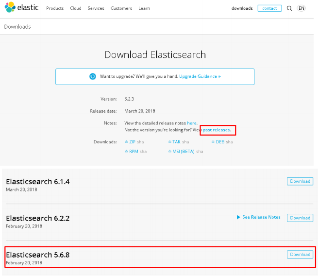

## 2.2 安装ES服务

Window版的ElasticSearch的安装很简单，类似Window版的Tomcat，解压开即安装完毕，解压后的ElasticSearch的目录结构如下：


允许elasticsearch跨越访问
- 如果不安装后面的`elasticsearch-head`是可以不修改，直接启动。
- 修改elasticsearch配置文件：`config/elasticsearch.yml`，增加以下两句命令：

  ```yaml
  http.cors.enabled: true
  http.cors.allow-origin: "*"
  ```

## 2.3 启动ES服务

点击ElasticSearch下的`bin/elasticsearch.bat`启动，控制台显示的日志信息如下：

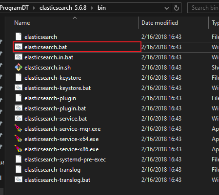

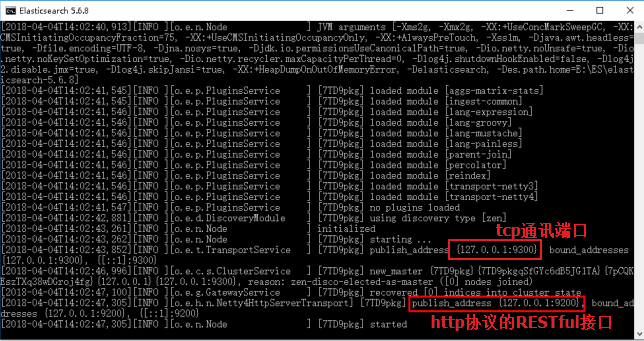

注意：`9300`是tcp通讯端口，集群间和TCPClient都执行该端口，9200是http协议的RESTful接口 。

通过浏览器访问ElasticSearch服务器，看到如下返回的json信息，代表服务启动成功：

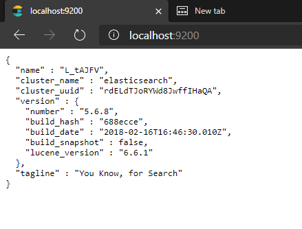

> 注意：ElasticSearch是使用java开发的，且本版本的es需要的jdk版本要是`1.8以上`，所以安装ElasticSearch之前保证JDK1.8+安装完毕，并正确的配置好JDK环境变量，否则启动ElasticSearch失败。

## 2.4 安装ES的图形化界面插件

ElasticSearch不同于Solr自带图形化界面，可以通过安装ElasticSearch的`head`插件，完成图形化界面的效果，完成索引数据的查看。安装插件的方式有两种，在线安装和本地安装。这里采用本地安装方式进行`head`插件的安装。`elasticsearch-5-*`以上版本安装`head`需要安装`node`和`grunt`

- 下载`head`插件：[https://github.com/mobz/elasticsearch-head](https://github.com/mobz/elasticsearch-head)  

  - 将`elasticsearch-head-master`压缩包解压到任意目录，但是要和`elasticsearch`的安装目录区别开
- 下载 [nodejs](https://nodejs.org/en/download)

  - 安装后cmd控制台输入 `node -v` 查看版本号
- 将`grunt`安装为全局命令 ，`Grunt`是基于Node.js的项目构建工具
  - 在cmd控制台中输入如下执行命令
    ```shell script
    npm install -g grunt-cli
    ```

- 进入`elasticsearch-head-master`目录启动`head`，在命令提示符下输入命令
  ```shell script
  >npm install
  >grunt server
  ```

  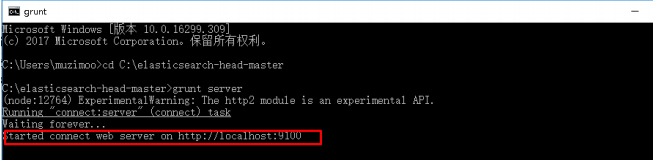

- 打开浏览器，输入 `http://localhost:9100`，看到如下页面：

  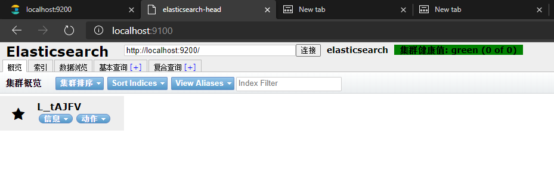

  - 如果不能成功连接到es服务，需要修改ElasticSearch的config目录下的配置文件：`config/elasticsearch.yml`，增加以下两句命令开启跨域访问。然后重新启动ElasticSearch服务。
    ```yaml
    http.cors.enabled: true
    http.cors.allow-origin: "*"
    ```

# 第三章 ElasticSearch相关概念(术语)

## 3.1 概述

Elasticsearch是面向文档(`document oriented`)的，这意味着它可以存储整个对象或文档(document)。然而它不仅仅是存储，还会索引(index)每个文档的内容使之可以被搜索。在Elasticsearch中，你可以对文档（而非成行成列的数据）进行索引、搜索、排序、过滤。Elasticsearch比传统关系型数据库如下

```
Relational DB -> Databases -> Tables -> Rows -> Columns
Elasticsearch -> Indices   -> Types  -> Documents -> Fields
```

## 3.2 **Elasticsearch核心概念** 

### 3.2.1 索引 index
> 相当于关系数据库 Databases

一个索引就是一个拥有几分相似特征的文档的集合。比如说，可以有一个客户数据的索引，另一个产品目录的索引，还有一个订单数据的索引。一个索引由一个名字来标识（**必须全部是小写字母的**），并且要对对应于这个索引中的文档进行索引、搜索、更新和删除的时候，都要使用到这个名字。在一个集群中，可以定义任意多的索引。

### 3.2.2 类型 type
> 相当于关系数据库仓库下的 tables

在一个索引中，可以定义一种或多种类型。**一个类型是索引的一个逻辑上的分类/分区**，其语义完全自定义。通常，会为具有一组共同字段的文档定义一个类型。比如说，假设你运营一个博客平台并且将所有的数据存储到一个索引中。在这个索引中，可以为用户数据定义一个类型，为博客数据定义另一个类型，当然，也可以为评论数据定义另一个类型。

### 3.2.3 字段Field

相当于是关系数据库数据表的列字段，对文档数据根据不同属性进行的分类标识

### 3.2.4 映射 mapping

`mapping`是处理数据的方式和规则方面做一些限制，如某个字段的数据类型、默认值、分析器、是否被索引等等，这些都是映射里面可以设置的，其它就是处理es里面数据的一些使用规则设置也叫做映射，按着最优规则处理数据对性能提高很大，因此才需要建立映射，并且需要思考如何建立映射才能对性能更好。

### 3.2.5 文档 document
> 相当于关系数据库表 行数据

一个文档是一个可被索引的基础信息单元。比如，可以拥有某一个客户的文档，某一个产品的一个文档，当然，也可以拥有某个订单的一个文档。文档以`JSON`（Javascript Object Notation）格式来表示，而JSON是一个到处存在的互联网数据交互格式。

在一个`index/type`里面，可以存储任意多的文档。注意，尽管一个文档，物理上存在于一个索引之中，文档必须被索引/赋予一个索引的`type`。

### 3.2.6 接近实时 NRT

Elasticsearch是一个接近实时的搜索平台。这意味着，从索引一个文档直到这个文档能够被搜索到有一个轻微的延迟（通常是1秒以内）

### 3.2.7 集群 cluster

一个集群就是由一个或多个节点组织在一起，它们共同持有整个的数据，并一起提供索引和搜索功能。一个集群由一个唯一的名字标识，这个名字默认就是“elasticsearch”。这个名字是重要的，因为一个节点只能通过指定某个集群的名字，来加入这个集群

### 3.2.8 节点 node

一个节点是集群中的一个服务器，作为集群的一部分，它存储数据，参与集群的索引和搜索功能。和集群类似，一个节点也是由一个名字来标识的，默认情况下，这个名字是一个随机的漫威漫画角色的名字，这个名字会在启动的时候赋予节点。这个名字对于管理工作来说挺重要的，因为在这个管理过程中，会去确定网络中的哪些服务器对应于Elasticsearch集群中的哪些节点。

一个节点可以通过配置集群名称的方式来加入一个指定的集群。默认情况下，每个节点都会被安排加入到一个叫做“elasticsearch”的集群中，这意味着，如果在网络中启动了若干个节点，并假定它们能够相互发现彼此，它们将会自动地形成并加入到一个叫做“elasticsearch”的集群中。

在一个集群里，可以拥有任意多个节点。而且，如果当前网络中没有运行任何Elasticsearch节点，这时启动一个节点，会默认创建并加入一个叫做“elasticsearch”的集群。

### 3.2.9 分片和复制 shards&replicas

一个索引可以存储超出单个结点硬件限制的大量数据。比如，一个具有10亿文档的索引占据1TB的磁盘空间，而任一节点都没有这样大的磁盘空间；或者单个节点处理搜索请求，响应太慢。为了解决这个问题，Elasticsearch
提供了将索引划分成多份的能力，这些份就叫做分片。当创建一个索引的时候，可以指定你想要的分片的数量。每个分片本身也是一个功能完善并且独立的“索引”，这个“索引”可以被放置到集群中的任何节点上。分片很重要，主要有两方面的原因
- 允许水平分割/扩展内容容量。 
- 允许在分片（潜在地，位于多个节点上）之上进行分布式的、并行的操作，进而提高性能/吞吐量。

至于一个分片怎样分布，它的文档怎样聚合回搜索请求，是完全由Elasticsearch管理的，对于作为用户来说，这些都是透明的。

在一个网络/云的环境里，失败随时都可能发生，在某个分片/节点不知怎么的就处于离线状态，或者由于任何原因消失了，这种情况下，有一个故障转移机制是非常有用并且是强烈推荐的。为此目的，Elasticsearch允许创建分片的一份或多份拷贝，这些拷贝叫做**复制分片**，或者直接叫复制。

复制之所以重要，有两个主要原因： 在分片/节点失败的情况下，提供了高可用性。因为这个原因，注意到**复制分片从不与原/主要（original/primary）分片置于同一节点上是非常重要的**。扩展搜索量/吞吐量，因为搜索可以在所有的复制上并行运行。总之，每个索引可以被分成多个分片。一个索引也可以被复制0次（意思是没有复制）或多次。一旦复制了，每个索引就有了主分片（作为复制源的原来的分片）和复制分片（主分片的拷贝）之别。分片和复制的数量可以在索引创建的时候指定。在索引创建之后，可以在任何时候动态地改变复制的数量，但是事后不能改变分片的数量。

默认情况下，Elasticsearch中的**每个索引被分片5个主分片和1个复制**，这意味着，如果集群中至少有两个节点，索引将会有5个主分片和另外5个复制分片（1个完全拷贝），这样的话每个索引总共就有10个分片。

# 第四章 ElasticSearch的客户端操作

实际开发中，主要有三种方式可以作为elasticsearch服务的客户端：

- 第一种，`elasticsearch-head`插件
- 第二种，使用elasticsearch提供的`Restful接口`直接访问
- 第三种，使用elasticsearch提供的`API`进行访问

## 4.1 安装Postman工具

Postman中文版是postman这款强大网页调试工具的windows客户端，提供功能强大的Web API & HTTP 请求调试。软件功能非常强大，界面简洁明晰、操作方便快捷，设计得很人性化。Postman中文版能够发送任何类型的HTTP 请求 (GET, HEAD, POST, PUT..)，且可以附带任何数量的参数。

## 4.1 下载Postman工具

Postman官网：`https://www.getpostman.com`

## 4.2 使用Postman工具进行Restful接口访问

### 4.2.1 ElasticSearch的接口语法

```shell script
curl -v -X<VERB> '<PROTOCOL>://<HOST>:<PORT>/<PATH>?<QUERY_STRING>' -d '<BODY>'
```

其中：

| 参数             | 解释                                       |
| -------------- | ---------------------------------------- |
| `v`            | 显示请求的信息。 |
| `VERB`         | 适当的 HTTP *方法* 或 *谓词* : `GET`、 `POST`、 `PUT`、 `HEAD` 或者 `DELETE`。 |
| `PROTOCOL`     | `http` 或者 `https`（如果你在 Elasticsearch 前面有一个 `https` 代理） |
| `HOST`         | Elasticsearch 集群中任意节点的主机名，或者用 `localhost` 代表本地机器上的节点。 |
| `PORT`         | 运行 Elasticsearch HTTP 服务的端口号，默认是 `9200` 。 |
| `PATH`         | API 的终端路径（例如 `_count` 将返回集群中文档数量）。Path 可能包含多个组件，例如：`_cluster/stats` 和 `_nodes/stats/jvm` 。 |
| `QUERY_STRING` | 任意可选的查询字符串参数 (例如 `?pretty` 将格式化地输出 JSON 返回值，使其更容易阅读) |
| `BODY`         | 一个 JSON 格式的请求体 (如果请求需要的话)                |

发送`GET`请求
```shell script
curl -v http://localhost:9200

C:\Users>curl -v http://localhost:9200
#<<<<<<<<<<<<<<返回信息如下注释
#* Rebuilt URL to: http://localhost:9200/
#*   Trying ::1...
#* TCP_NODELAY set
#* Connected to localhost (::1) port 9200 (#0)
#> GET / HTTP/1.1
#> Host: localhost:9200
#> User-Agent: curl/7.55.1
#> Accept: */*
#>
#< HTTP/1.1 200 OK
#< content-type: application/json; charset=UTF-8
#< content-length: 327
#<
#{
#  "name" : "L_tAJFV",
#  "cluster_name" : "elasticsearch",
#  "cluster_uuid" : "rdELdTJoRYWd8JwffIHaQA",
#  "version" : {
#    "number" : "5.6.8",
#    "build_hash" : "688ecce",
#    "build_date" : "2018-02-16T16:46:30.010Z",
#    "build_snapshot" : false,
#    "lucene_version" : "6.6.1"
#  },
#  "tagline" : "You Know, for Search"
#}
#* Connection #0 to host localhost left intact
#
C:\Users>curl http://localhost:9200
#<<<<<<<<<<<<<<返回信息
#{
#  "name" : "L_tAJFV",
#  "cluster_name" : "elasticsearch",
#  "cluster_uuid" : "rdELdTJoRYWd8JwffIHaQA",
#  "version" : {
#    "number" : "5.6.8",
#    "build_hash" : "688ecce",
#    "build_date" : "2018-02-16T16:46:30.010Z",
#    "build_snapshot" : false,
#    "lucene_version" : "6.6.1"
#  },
#  "tagline" : "You Know, for Search"
#}
```

发送`POST`请求
```shell script
curl -v -X POST http://localhost:9200 -d "{JSON格式参数}"
```

发送`PUT`请求创建索引 `blog`
```shell script
curl -v -X PUT http://localhost:9200/blog

#<<<<<<<<<<<<<<返回信息
#C:\Users>curl -v -X PUT http://localhost:9200/blog
#*   Trying ::1...
#* TCP_NODELAY set
#* Connected to localhost (::1) port 9200 (#0)
#> PUT /blog HTTP/1.1
#> Host: localhost:9200
#> User-Agent: curl/7.55.1
#> Accept: */*
#>
#< HTTP/1.1 200 OK
#< content-type: application/json; charset=UTF-8
#< content-length: 63
#<
#{"acknowledged":true,"shards_acknowledged":true,"index":"blog"}* Connection #0 to host localhost left intact
```
- 在es-head页面查看
  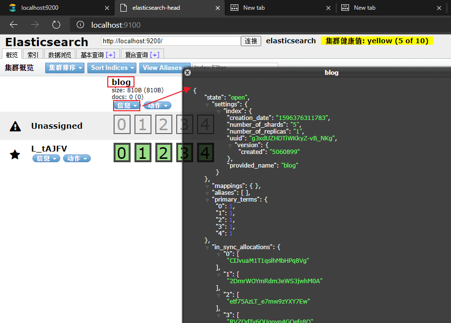

### 4.2.2 创建索引index和映射mapping
> 使用curl命令发送请求对于参数需要转义手敲比较麻烦使用postman工具发送请求

上面使用 curl 创建了blog索引但没有参数所以blog的mapping是空的
- 创建 blog1 并设置 mapping 
  ```json
  //PUT		localhost:9200/blog1
  // 请求体：
  {
      "mappings": {
          "article": { // 这里的article 就是 type 名称 相当于表的概念
              "properties": {  
                  "id": {  // id 就是 field 字段名称 相当于关系数据库列
                    "type": "long", // 字段类型
                     "store": true, // 是否存储
                     "index":"not_analyzed" // analyzed 索引  not_analyzed不索引
                  },
                  "title": {
                  	"type": "text",
                      "store": true,
                      "index":"analyzed",
                      "analyzer":"standard" // 分词器
                  },
                  "content": {
                  	"type": "text",
                      "store": true,
                      "index":"analyzed",
                      "analyzer":"standard"
                  }
              }
          }
      }
  }
  ```

postman截图：

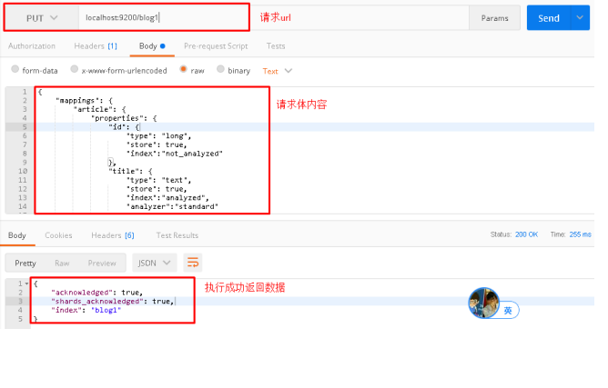

elasticsearch-head查看：

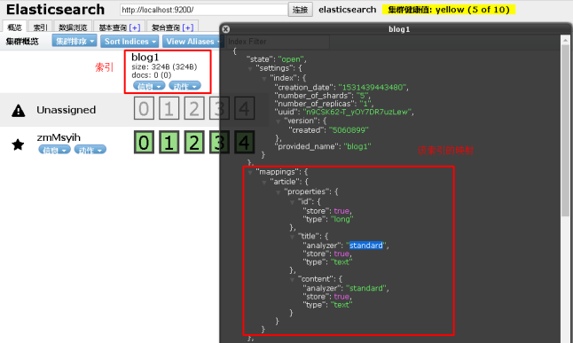

###4.2.3 创建索引后设置Mapping

可以在创建索引时设置mapping信息，当然也可以先创建索引然后再设置mapping。

在上一个步骤中不设置mapping信息，直接使用`put/post`方法创建一个索引，然后设置mapping信息。
- 想上面 curl 创建的 blog索引中添加一个type名称为hello的mapping
```json
// 格式 POST http://es主机;端口/index名称/type名称/_mapping
// POST	http://127.0.0.1:9200/blog/hello/_mapping
//请求体
{
    "hello": { // type名称
        "properties": {
            "id":{
                "type":"long",
                "store":true
            },
            "title":{
                "type":"text",
                "store":true,
                "index":true,
                "analyzer":"standard"
            },
            "content":{
                "type":"text",
                "store":true,
                "index":true,
                "analyzer":"standard"
            }
        }
    }
}
```
PostMan截图
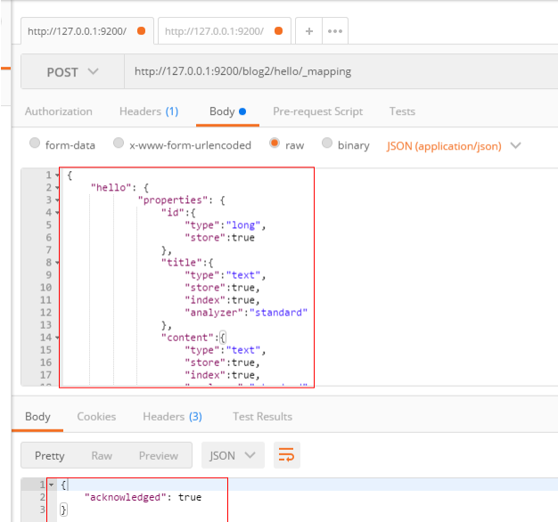

### 4.2.4 删除索引index

请求
```shell script
curl -v -X DELETE http://localhost:9200/blog1

C:\Users>curl -v -X DELETE http://localhost:9200/blog1
#<<<<<<<<<<<<<<<<<<<<<<<
#*   Trying ::1...
#* TCP_NODELAY set
#* Connected to localhost (::1) port 9200 (#0)
#> DELETE /blog1 HTTP/1.1
#> Host: localhost:9200
#> User-Agent: curl/7.55.1
#> Accept: */*
#>
#< HTTP/1.1 200 OK
#< content-type: application/json; charset=UTF-8
#< content-length: 21
#<
#{"acknowledged":true}* Connection #0 to host localhost left intact
```

postman截图：

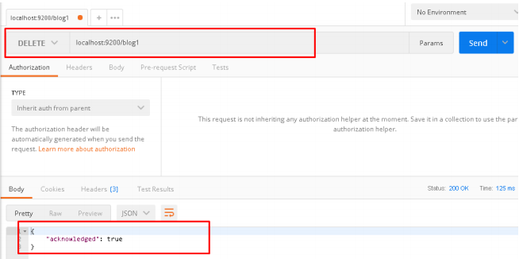

elasticsearch-head查看：

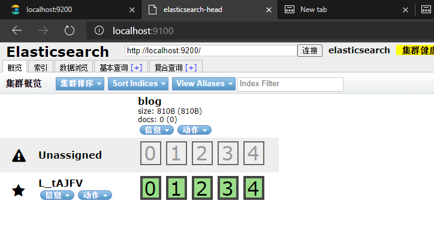

### 4.2.5 创建文档document

向 blog1索引库type名为article下创建文档名为1的文档
```text
POST	localhost:9200/blog1/article/1
```

请求体：
```json
{
	"id":1,
	"title":"ElasticSearch是一个基于Lucene的搜索服务器",
	"content":"它提供了一个分布式多用户能力的全文搜索引擎，基于RESTful web接口。Elasticsearch是用Java开发的，并作为Apache许可条款下的开放源码发布，是当前流行的企业级搜索引擎。设计用于云计算中，能够达到实时搜索，稳定，可靠，快速，安装使用方便。"
}
```

postman截图：

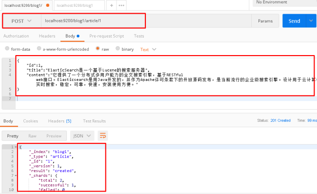

elasticsearch-head查看：

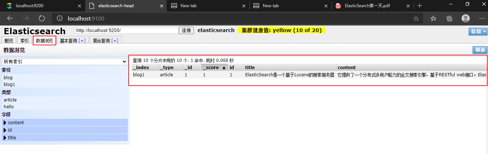

###  4.2.6 修改文档document

修改 blog1索引库type名为article下文档名为1的文档
```text
POST	localhost:9200/blog1/article/1
```

请求体：
```json
{
	"id":1,
	"title":"【修改】ElasticSearch是一个基于Lucene的搜索服务器",
	"content":"【修改】它提供了一个分布式多用户能力的全文搜索引擎，基于RESTful web接口。Elasticsearch是用Java开发的，并作为Apache许可条款下的开放源码发布，是当前流行的企业级搜索引擎。设计用于云计算中，能够达到实时搜索，稳定，可靠，快速，安装使用方便。"
}
```

postman截图：

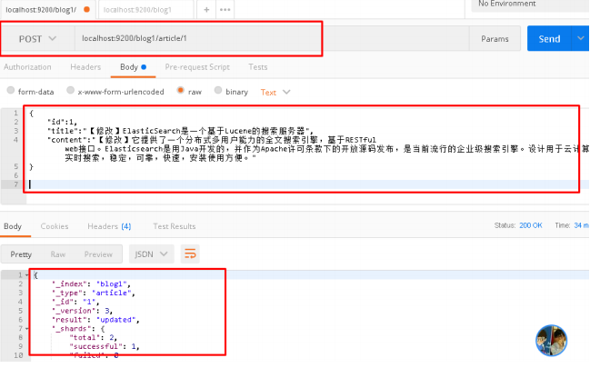

elasticsearch-head查看：

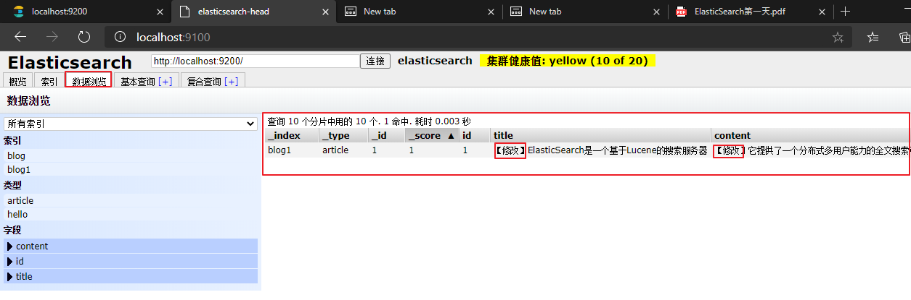

### 4.2.7 删除文档document

删除 blog1索引库type名为article下`_id`为1的文档
- 这里的`_id`是es自动生成的`_id` 而不是文档的id字段
```shell script
curl -v -X DELETE http://localhost:9200/blog1/article/{_id}

C:\Users>curl -v -X DELETE http://localhost:9200/blog1/article/1
*   Trying ::1...
* TCP_NODELAY set
* Connected to localhost (::1) port 9200 (#0)
> DELETE /blog1/article/1 HTTP/1.1
> Host: localhost:9200
> User-Agent: curl/7.55.1
> Accept: */*
>
< HTTP/1.1 200 OK
< content-type: application/json; charset=UTF-8
< content-length: 139
<
{"found":true,"_index":"blog1","_type":"article","_id":"1","_version":3,"result":"deleted","_shards":{"total":2
,"successful":1,"failed":0}}* Connection #0 to host localhost left intact
```

postman截图：

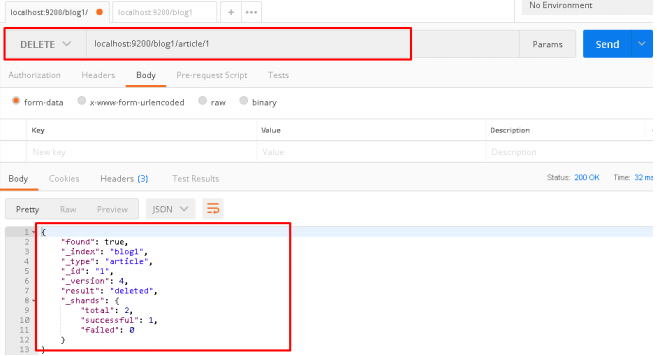


elasticsearch-head查看：

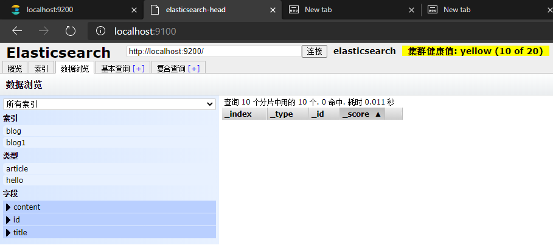

### 4.2.8 查询文档-根据id查询

这里的`_id`是es自动生成的`_id` 而不是文档的id字段
```shell script
curl -v http://localhost:9200/blog1/article/{_id}

C:\Users>curl -v http://localhost:9200/blog1/article/22
*   Trying ::1...
* TCP_NODELAY set
* Connected to localhost (::1) port 9200 (#0)
> GET /blog1/article/22 HTTP/1.1
> Host: localhost:9200
> User-Agent: curl/7.55.1
> Accept: */*
>
< HTTP/1.1 200 OK
< content-type: application/json; charset=UTF-8
< content-length: 529
<
{"_index":"blog1","_type":"article","_id":"22","_version":2,"found":true,"_source":{
        "id":23,
        "title":"【修改】ElasticSearch是一个基于Lucene的搜索服务器",
        "content":"【修改】它提供了一个分布式多用户能力的全文搜索引擎，基于RESTful web接口。Elasticsearch是用Java开发的 ，并作为Apache许可条款下的开放源码发布，是当前流行的企业级搜索引擎。设计用于云计算中，能够达到实时搜索，稳定，可靠，快速，安装使用方便。"
}}* Connection #0 to host localhost left intact
```

postman截图：

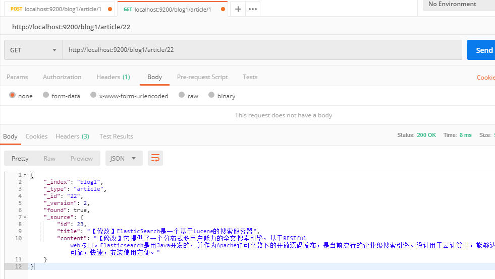

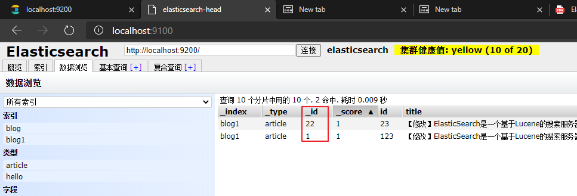

### 4.2.9 查询文档-querystring查询

请求url：

```json
POST	localhost:9200/blog1/article/_search
```

请求体：

```json
{
    "query": {
        "query_string": {
            "default_field": "title",
            "query": "搜索服务器"
        }
    }
}
```

postman截图：


注意：

将搜索内容"搜索服务器"修改为"钢索"，同样也能搜索到文档，该原因会在下面讲解中得到答案

```json
{
    "query": {
        "query_string": {
            "default_field": "title",
            "query": "钢索"
        }
    }
}
```


### 4.2.10 查询文档-term查询

请求url：

```json
POST	localhost:9200/blog1/article/_search
```

请求体：

```json
{
    "query": {
        "term": {
            "title": "搜索"
        }
    }
}
```

postman截图：

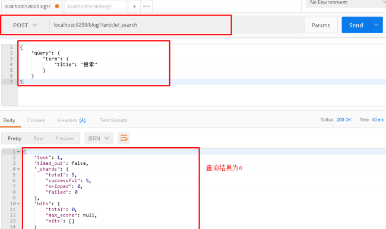


# 第五章 IK 分词器和ElasticSearch集成使用

## 5.1 上述查询存在问题分析

在进行字符串查询时，发现去搜索"搜索服务器"和"钢索"都可以搜索到数据；

而在进行词条查询时，搜索"搜索"却没有搜索到数据；

究其原因是ElasticSearch的标准分词器导致的，当创建索引时，字段使用的是标准分词器：

```json
{
    "mappings": {
        "article": {
            "properties": {
                "id": {
                	"type": "long",
                    "store": true,
                    "index":"not_analyzed"
                },
                "title": {
                	"type": "text",
                    "store": true,
                    "index":"analyzed",
                    "analyzer":"standard"	//标准分词器
                },
                "content": {
                	"type": "text",
                    "store": true,
                    "index":"analyzed",
                    "analyzer":"standard"	//标准分词器
                }
            }
        }
    }
}
```

例如对 "我是程序员" 进行分词

标准分词器分词效果测试：

```shell script
curl -v http://127.0.0.1:9200/_analyze?analyzer=standard&pretty=true&text=我是程序员
```

分词结果：

```json
{
  "tokens" : [
    {
      "token" : "我",
      "start_offset" : 0,
      "end_offset" : 1,
      "type" : "<IDEOGRAPHIC>",
      "position" : 0
    },
    {
      "token" : "是",
      "start_offset" : 1,
      "end_offset" : 2,
      "type" : "<IDEOGRAPHIC>",
      "position" : 1
    },
    {
      "token" : "程",
      "start_offset" : 2,
      "end_offset" : 3,
      "type" : "<IDEOGRAPHIC>",
      "position" : 2
    },
    {
      "token" : "序",
      "start_offset" : 3,
      "end_offset" : 4,
      "type" : "<IDEOGRAPHIC>",
      "position" : 3
    },
    {
      "token" : "员",
      "start_offset" : 4,
      "end_offset" : 5,
      "type" : "<IDEOGRAPHIC>",
      "position" : 4
    }
  ]
}
```

而需要的分词效果是：我、是、程序、程序员

这样的话就需要对中文支持良好的分析器的支持，支持中文分词的分词器有很多，`word分词器`、`庖丁解牛`、`盘古分词`、`Ansj分词`等，但常用的还是下面要介绍的IK分词器。

## 5.2 IK分词器简介

IKAnalyzer是一个开源的，基于java语言开发的轻量级的中文分词工具包。从2006年12月推出1.0版开始，IKAnalyzer已经推出 了3个大版本。最初，它是以开源项目Lucene为应用主体的，结合词典分词和文法分析算法的中文分词组件。新版本的IKAnalyzer3.0则发展为 面向Java的公用分词组件，独立于Lucene项目，同时提供了对Lucene的默认优化实现。

IK分词器3.0的特性如下

- 采用了特有的“正向迭代最细粒度切分算法“，具有60万字/秒的高速处理能力。
- 采用了多子处理器分析模式，支持：英文字母（IP地址、Email、URL）、数字（日期，常用中文数量词，罗马数字，科学计数法），中文词汇（姓名、地名处理）等分词处理。
- 对中英联合支持不是很好,在这方面的处理比较麻烦.需再做一次查询,同时是支持个人词条的优化的词典存储，更小的内存占用。
- 支持用户词典扩展定义。
- 针对Lucene全文检索优化的查询分析器IKQueryParser；采用歧义分析算法优化查询关键字的搜索排列组合，能极大的提高Lucene检索的命中率。

## 5.3 ElasticSearch集成IK分词器

### 5.3.1 IK分词器的安装

下载地址：`https://github.com/medcl/elasticsearch-analysis-ik/releases  ` 

将解压后的elasticsearch文件夹拷贝到`elasticsearch-5.6.8\plugins`下，并重命名文件夹为`analysis-ik`

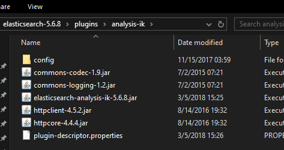

重新启动ElasticSearch，即可加载IK分词器

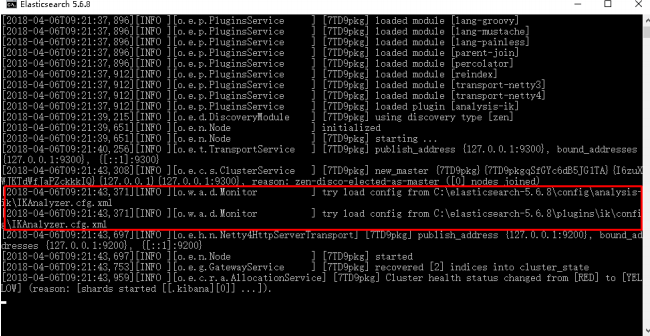


### 5.3.2 IK分词器测试

IK提供了两个分词算法`ik_smart` 和 `ik_max_word`
- `ik_smart` 为最少切分
- `ik_max_word`为最细粒度划分

分别来试一下
- `ik_smart`最小切分：在浏览器地址栏输入地址`http://127.0.0.1:9200/_analyze?analyzer=ik_smart&pretty=true&text=我是程序员`
  - 输出的结果为
  ```json
  {
    "tokens" : [
      {
        "token" : "我",
        "start_offset" : 0,
        "end_offset" : 1,
        "type" : "CN_CHAR",
        "position" : 0
      },
      {
        "token" : "是",
        "start_offset" : 1,
        "end_offset" : 2,
        "type" : "CN_CHAR",
        "position" : 1
      },
      {
        "token" : "程序员",
        "start_offset" : 2,
        "end_offset" : 5,
        "type" : "CN_WORD",
        "position" : 2
      }
    ]
  }
  ```
- `ik_max_word`最细切分：在浏览器地址栏输入地址`http://127.0.0.1:9200/_analyze?analyzer=ik_max_word&pretty=true&text=我是程序员`
  - 输出的结果为
  ```json
  {
    "tokens" : [
      {
        "token" : "我",
        "start_offset" : 0,
        "end_offset" : 1,
        "type" : "CN_CHAR",
        "position" : 0
      },
      {
        "token" : "是",
        "start_offset" : 1,
        "end_offset" : 2,
        "type" : "CN_CHAR",
        "position" : 1
      },
      {
        "token" : "程序员",
        "start_offset" : 2,
        "end_offset" : 5,
        "type" : "CN_WORD",
        "position" : 2
      },
      {
        "token" : "程序",
        "start_offset" : 2,
        "end_offset" : 4,
        "type" : "CN_WORD",
        "position" : 3
      },
      {
        "token" : "员",
        "start_offset" : 4,
        "end_offset" : 5,
        "type" : "CN_CHAR",
        "position" : 4
      }
    ]
  }
  ```


## 5.4 修改索引映射mapping

### 5.4.1 重建索引

删除原有blog1索引

```shell script
curl -v -X DELETE http://localhost:9200/blog1

C:\Users>curl -v -X DELETE http://localhost:9200/blog1
*   Trying ::1...
* TCP_NODELAY set
* Connected to localhost (::1) port 9200 (#0)
> DELETE /blog1 HTTP/1.1
> Host: localhost:9200
> User-Agent: curl/7.55.1
> Accept: */*
>
< HTTP/1.1 200 OK
< content-type: application/json; charset=UTF-8
< content-length: 21
<
{"acknowledged":true}* Connection #0 to host localhost left intact
```

创建blog1索引，此时分词器使用ik_max_word

```json
PUT		localhost:9200/blog1
```

```json
{
    "mappings": {
        "article": {
            "properties": {
                "id": {
                	"type": "long",
                    "store": true,
                    "index":"not_analyzed"
                },
                "title": {
                	"type": "text",
                    "store": true,
                    "index":"analyzed",
                    "analyzer":"ik_max_word"
                },
                "content": {
                	"type": "text",
                    "store": true,
                    "index":"analyzed",
                    "analyzer":"ik_max_word"
                }
            }
        }
    }
}
```

创建文档

```json
POST	localhost:9200/blog1/article/1

{
	"id":1,
	"title":"ElasticSearch是一个基于Lucene的搜索服务器",
	"content":"它提供了一个分布式多用户能力的全文搜索引擎，基于RESTful web接口。Elasticsearch是用Java开发的，并作为Apache许可条款下的开放源码发布，是当前流行的企业级搜索引擎。设计用于云计算中，能够达到实时搜索，稳定，可靠，快速，安装使用方便。"
}
```

### 5.4.2 再次测试queryString查询

请求url：

```json
POST	localhost:9200/blog1/article/_search
```

请求体：

```json
{
    "query": {
        "query_string": {
            "default_field": "title",
            "query": "搜索服务器"
        }
    }
}
```

postman截图：

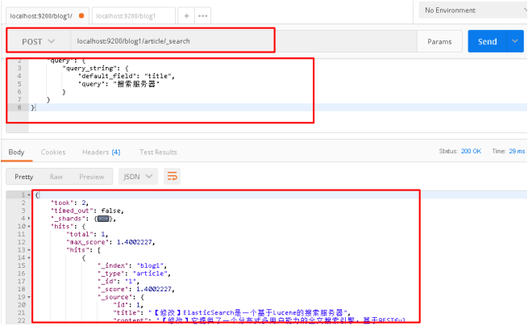

将请求体搜索字符串修改为"钢索"，再次查询：

```json
{
    "query": {
        "query_string": {
            "default_field": "title",
            "query": "钢索"
        }
    }
}
```

postman截图：

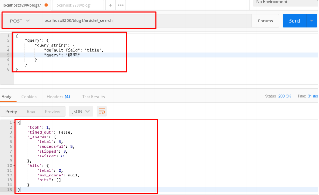

### 5.4.3 再次测试term测试

请求url：

```json
POST	localhost:9200/blog1/article/_search
```

请求体：

```json
{
    "query": {
        "term": {
            "title": "搜索"
        }
    }
}
```

postman截图：

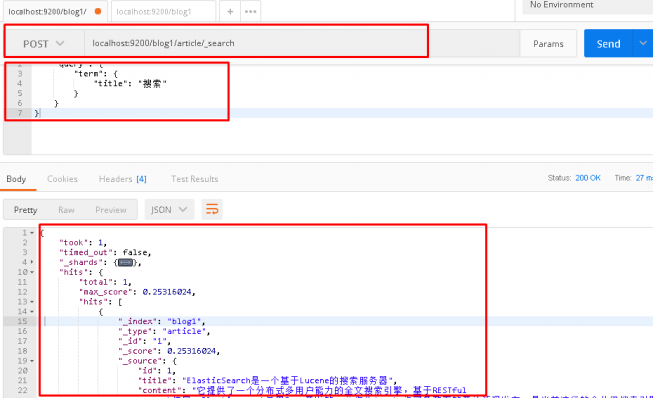


# 第六章 ElasticSearch集群

ES集群是一个 P2P类型(使用 gossip 协议)的分布式系统，除了集群状态管理以外，其他所有的请求都可以发送到集群内任意一台节点上，这个节点可以自己找到需要转发给哪些节点，并且直接跟这些节点通信。所以，从网络架构及服务配置上来说，构建集群所需要的配置极其简单。在 Elasticsearch 2.0 之前，无阻碍的网络下，所有配置了相同 `cluster.name` 的节点都自动归属到一个集群中。2.0 版本之后，基于安全的考虑避免开发环境过于随便造成的麻烦，从 2.0 版本开始，默认的自动发现方式改为了`unicast`单播方式。配置里提供几台节点的地址，ES 将其视作 `gossip router` 角色，借以完成集群的发现。由于这只是 ES 内一个很小的功能，所以 `gossip router` 角色并不需要单独配置，每个 ES 节点都可以担任。所以，采用单播方式的集群，各节点都配置相同的几个节点列表作为 router 即可。

集群中节点数量没有限制，一般大于等于2个节点就可以看做是集群了。一般处于高性能及高可用方面来考虑一般集群中的节点数量都是3个及3个以上。

## 6.1 集群的相关概念

### 6.1.1 集群 cluster

一个集群就是由一个或多个节点组织在一起，它们共同持有整个的数据，并一起提供索引和搜索功能。一个**集群由一个唯一的名字标识**，这个名字默认就是 `elasticsearch`。这个名字是重要的，因为一个节点只能通过指定某个集群的名字，来加入这个集群

### 6.1.2 节点 node

一个节点是集群中的一个服务器，作为集群的一部分，它存储数据，参与集群的索引和搜索功能。和集群类似，一个节点也是由一个名字来标识的，默认情况下，这个名字是一个随机的漫威漫画角色的名字，这个名字会在启动的时候赋予节点。这个名字对于管理工作来说挺重要的，因为在这个管理过程中，你会去确定网络中的哪些服务器对应于Elasticsearch集群中的哪些节点。

一个节点可以通过配置集群名称的方式来加入一个指定的集群。默认情况下，每个节点都会被安排加入到一个叫做 `elasticsearch` 的集群中，这意味着，如果网络中启动了若干个节点，并假定它们能够相互发现彼此，它们将会自动地形成并加入到一个叫做`elasticsearch` 的集群中。

在一个集群里可以拥有任意多个节点。而且，如果当前网络中没有运行任何Elasticsearch节点，这时启动一个节点，会默认创建并加入一个叫做`elasticsearch` 的集群。

### 6.1.3 分片和复制 shards&replicas

一个索引可以存储超出单个结点硬件限制的大量数据。比如，一个具有10亿文档的索引占据1TB的磁盘空间，而任一节点都没有这样大的磁盘空间；或者单个节点处理搜索请求，响应太慢。为了解决这个问题，Elasticsearch提供了将索引划分成多份的能力，这些份就叫做分片。当创建一个索引的时候，可以指定想要的分片的数量。每个分片本身也是一个功能完善并且独立的 `索引` ，这个 `索引` 可以被放置到集群中的任何节点上。分片很重要，主要有两方面的原因
- 允许水平分割/扩展内容容量。 
- 允许在分片（潜在地，位于多个节点上）之上进行分布式的、并行的操作，进而提高性能/吞吐量。

至于一个分片怎样分布，它的文档怎样聚合回搜索请求，是完全由Elasticsearch管理的，这些都是透明的。

在一个网络/云的环境里，失败随时都可能发生，在某个分片/节点不知怎么的就处于离线状态，或者由于任何原因消失了，这种情况下，有一个故障转移机制是非常有用并且是强烈推荐的。为此目的，Elasticsearch允许创建分片的一份或多份拷贝，这些拷贝叫做复制分片，或者直接叫复制。

复制之所以重要，有两个主要原因： 在分片/节点失败的情况下，提供了高可用性。因为这个原因，注意到**复制分片从不与原/主要（original/primary）分片置于同一节点上是非常重要的**。扩展搜索量/吞吐量，因为搜索可以在所有的复制上并行运行。总之，每个索引可以被分成多个分片。一个索引也可以被复制0次（意思是没有复制）或多次。一旦复制了，每个索引就有了主分片（作为复制源的原来的分片）和复制分片（主分片的拷贝）之别。分片和复制的数量可以在索引创建的时候指定。在索引创建之后，可以在任何时候动态地改变复制的数量，但是事后不能改变分片的数量。

默认情况下，Elasticsearch中的每个索引被分片5个主分片和1个复制，这意味着，如果集群中至少有两个节点，索引将会有5个主分片和另外5个复制分片（1个完全拷贝），这样的话每个索引总共就有10个分片。

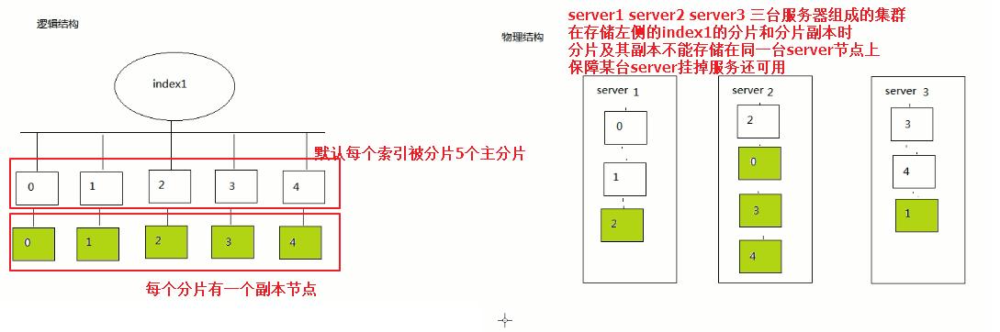

## 6.2 集群的搭建

### 6.2.1 准备三台elasticsearch服务器

创建`elasticsearch-cluster`文件夹，在内部复制三个elasticsearch服务
- 硬件有限在同一台服务器上可以复制多个 `elasticsearch-5.6.8` 作为多个节点。复制需要注意需要保证`elasticsearch-5.6.8/data
`目录下没有数据。该目录下保存的就是节点的索引库。存在数据时集群搭建会失败。即复制`elasticsearch-5.6.8`后需要把`elasticsearch-5.6.8/data`文件夹删除

  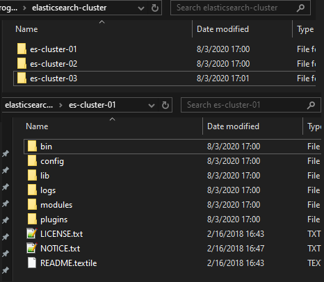
### 6.2.2 修改每台服务器配置

修改每个节点`config/elasticsearch.yml`配置文件
- node1节点
  ```yaml
  #节点1的配置信息：
  #集群名称，同集群一致 
  cluster.name: my-elasticsearch
  #节点名称，必须不一样
  node.name: node-1
  #必须为本机的ip地址
  network.host: 127.0.0.1
  #服务端口号，在同一机器下必须不一样
  http.port: 9201
  #集群间通信端口号，在同一机器下必须不一样
  transport.tcp.port: 9301
  #设置集群自动发现机器ip集合
  discovery.zen.ping.unicast.hosts: ["127.0.0.1:9301","127.0.0.1:9302","127.0.0.1:9303"]
  ```
- node2节点
  ```yaml
  #节点1的配置信息：
  #集群名称，同集群一致
  cluster.name: es-cluster
  #节点名称，必须不一样
  node.name: node-2
  #必须为本机的ip地址
  network.host: 127.0.0.1
  #服务端口号，在同一机器下必须不一样
  http.port: 9202
  #集群间通信端口号，在同一机器下必须不一样
  transport.tcp.port: 9302
  #设置集群自动发现机器ip集合
  discovery.zen.ping.unicast.hosts: ["127.0.0.1:9301","127.0.0.1:9302","127.0.0.1:9303"]
  ```
- node3节点
  ```yaml
  #节点1的配置信息：
  #集群名称，同集群一致
  cluster.name: es-cluster
  #节点名称，必须不一样
  node.name: node-3
  #必须为本机的ip地址
  network.host: 127.0.0.1
  #服务端口号，在同一机器下必须不一样
  http.port: 9203
  #集群间通信端口号，在同一机器下必须不一样
  transport.tcp.port: 9303
  #设置集群自动发现机器ip集合
  discovery.zen.ping.unicast.hosts: ["127.0.0.1:9301","127.0.0.1:9302","127.0.0.1:9303"]
  ```

### 6.2.3 启动各个节点服务器

双击 `bin/elasticsearch.bat` 启动各个节点后根据配置会自动组建集群

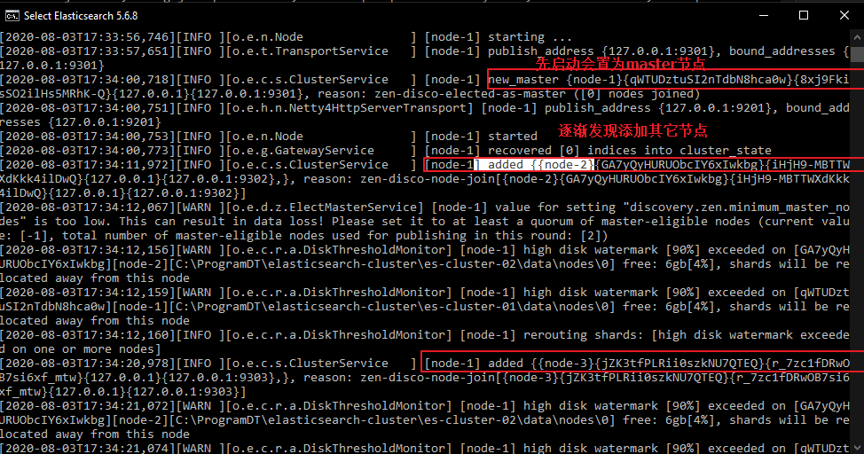

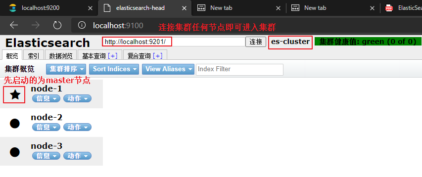
### 6.2.4 集群测试

`es-head`页面上添加节点
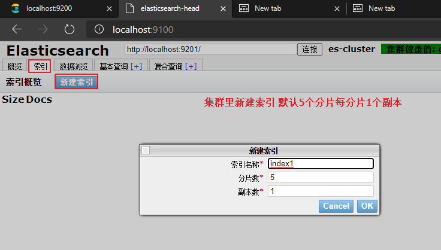

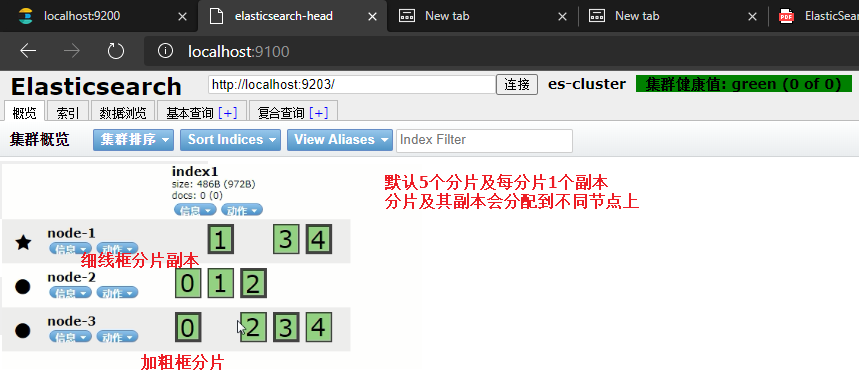

需要注意如果磁盘使用率高于 85% 创建索引时不会分片，创建后集群健康状态为红色

#### 添加索引和映射

通过postman在集群中创建索引
```json
PUT		localhost:9201/blog1

{
    "mappings": {
        "article": {
            "properties": {
                "id": {
                	"type": "long",
                    "store": true,
                    "index":"not_analyzed"
                },
                "title": {
                	"type": "text",
                    "store": true,
                    "index":"analyzed",
                    "analyzer":"standard"
                },
                "content": {
                	"type": "text",
                    "store": true,
                    "index":"analyzed",
                    "analyzer":"standard"
                }
            }
        }
    }
}
```

#### 添加文档

```json
POST	localhost:9200/blog1/article/1
```

```json
{
	"id":1,
	"title":"ElasticSearch是一个基于Lucene的搜索服务器",
	"content":"它提供了一个分布式多用户能力的全文搜索引擎，基于RESTful web接口。Elasticsearch是用Java开发的，并作为Apache许可条款下的开放源码发布，是当前流行的企业级搜索引擎。设计用于云计算中，能够达到实时搜索，稳定，可靠，快速，安装使用方便。"
}
```

#### 使用elasticsearch-header查看集群情况

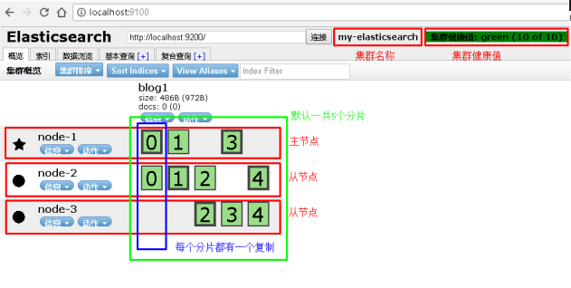


# java操作es

[java操作es](./es-with-java.md)