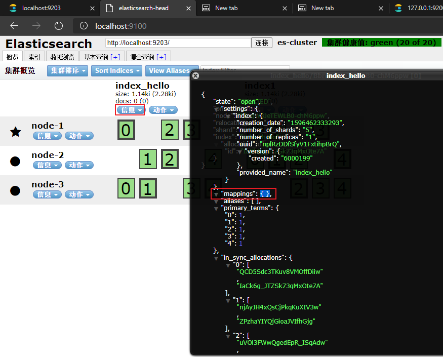

[TOC]


## 学习目标：

1. 能够使用java客户端完成创建、删除索引的操作
2. 能够使用java客户端完成文档的增删改的操作
3. 能够使用java客户端完成文档的查询操作
4. 能够完成文档的分页操作
5. 能够完成文档的高亮查询操作
6. 能够搭建Spring Data ElasticSearch的环境
7. 能够完成Spring Data ElasticSearch的基本增删改查操作
8. 能够掌握基本条件查询的方法命名规则


# 第一章 ElasticSearch编程操作

## 1.1 创建工程，导入坐标

创建 `elasticsearch-quickstart`项目 `pom.xml`坐标

```xml
<?xml version="1.0" encoding="UTF-8"?>
<project xmlns="http://maven.apache.org/POM/4.0.0"
         xmlns:xsi="http://www.w3.org/2001/XMLSchema-instance"
         xsi:schemaLocation="http://maven.apache.org/POM/4.0.0 http://maven.apache.org/xsd/maven-4.0.0.xsd">
    <modelVersion>4.0.0</modelVersion>

    <groupId>tk.deriwotua</groupId>
    <artifactId>elasticsearch-quickstart</artifactId>
    <version>1.0-SNAPSHOT</version>

    <properties>
        <maven.compiler.source>1.9</maven.compiler.source>
        <maven.compiler.target>1.9</maven.compiler.target>
    </properties>

    <dependencies>
        <dependency>
            <groupId>org.elasticsearch</groupId>
            <artifactId>elasticsearch</artifactId>
            <version>5.6.8</version>
        </dependency>
        <dependency>
            <groupId>org.elasticsearch.client</groupId>
            <artifactId>transport</artifactId>
            <version>5.6.8</version>
        </dependency>
        <dependency>
            <groupId>org.apache.logging.log4j</groupId>
            <artifactId>log4j-to-slf4j</artifactId>
            <version>2.9.1</version>
        </dependency>
        <dependency>
            <groupId>org.slf4j</groupId>
            <artifactId>slf4j-api</artifactId>
            <version>1.7.24</version>
        </dependency>
        <dependency>
            <groupId>org.slf4j</groupId>
            <artifactId>slf4j-simple</artifactId>
            <version>1.7.21</version>
        </dependency>
        <dependency>
            <groupId>log4j</groupId>
            <artifactId>log4j</artifactId>
            <version>1.2.12</version>
        </dependency>
        <dependency>
            <groupId>junit</groupId>
            <artifactId>junit</artifactId>
            <version>4.12</version>
        </dependency>
        <dependency>
            <groupId>com.alibaba</groupId>
            <artifactId>fastjson</artifactId>
            <version>1.2.56</version>
        </dependency>
    </dependencies>
</project>
```

## 1.2 创建索引index

创建索引库
- 创建一个`org.elasticsearch.common.settings.Settings`对象，相当于是一个配置信息。主要配置集群的名称。
  ```java
  // 根据cluster.name集群名称为es-cluster声明es配置信息
  Settings settings = Settings.builder()
                  .put("cluster.name", "es-cluster")
                  .build();
  ```
- 根据`org.elasticsearch.common.settings.Settings`配置对象创建一个客户端 `org.elasticsearch.client.transport.TransportClient` Client对象
  ```java
  // 创建一个客户端Client对象
  TransportClient client = new PreBuiltTransportClient(settings);
  // 客户端添加TCP节点地址 
  client.addTransportAddress(new InetSocketTransportAddress(InetAddress.getByName("127.0.0.1"), 9301));
  client.addTransportAddress(new InetSocketTransportAddress(InetAddress.getByName("127.0.0.1"), 9302));
  client.addTransportAddress(new InetSocketTransportAddress(InetAddress.getByName("127.0.0.1"), 9303));
  ```
- 使用client对象创建一个索引库
  ```java
  // 使用client对象创建一个名称为index_hello索引库
  client.admin().indices().prepareCreate("index_hello")
          //执行操作
          .get();
  ```
- 关闭client对象
  ```java
  client.close();
  ```


```java
@Test
public void createIndex() throws Exception {
    //1、创建一个Settings对象，相当于是一个配置信息。主要配置集群的名称。
    Settings settings = Settings.builder()
            .put("cluster.name", "es-cluster")
            .build();
    //2、创建一个客户端Client对象
    TransportClient client = new PreBuiltTransportClient(settings);
    // 客户端添加TCP节点地址
    client.addTransportAddress(new InetSocketTransportAddress(InetAddress.getByName("127.0.0.1"), 9301));
    client.addTransportAddress(new InetSocketTransportAddress(InetAddress.getByName("127.0.0.1"), 9302));
    client.addTransportAddress(new InetSocketTransportAddress(InetAddress.getByName("127.0.0.1"), 9303));
    //3、使用client对象创建一个索引库
    client.admin().indices().prepareCreate("index_hello")
            //执行操作
            .get();
    //4、关闭client对象
    client.close();
}
```





## 1.3 创建映射mapping

使用Java客户端设置Mappings
- 创建一个`org.elasticsearch.common.settings.Settings`对象
- 创建一个`org.elasticsearch.client.transport.TransportClient` Client对象
- 创建一个mapping信息，应该是一个json据，可以是字符串，也可以是`org.elasticsearch.common.xcontent.XContentBuilder`对象
- 使用client向es服务器发送mapping信息
- 关闭client对象

```java
@Test
public void setMappings() throws Exception {
    //创建一个Settings对象
    Settings settings = Settings.builder()
            .put("cluster.name", "es-cluster")
            .build();
    //创建一个TransPortClient对象
    TransportClient client = new PreBuiltTransportClient(settings)
            .addTransportAddress(new InetSocketTransportAddress(InetAddress.getByName("127.0.0.1"), 9301))
            .addTransportAddress(new InetSocketTransportAddress(InetAddress.getByName("127.0.0.1"), 9302))
            .addTransportAddress(new InetSocketTransportAddress(InetAddress.getByName("127.0.0.1"), 9303));

    /*{
        "article":{
            "properties":{
                "id":{
                    "type":"long",
                    "store":true
                },
                "title":{
                    "type":"text",
                     "store":true,
                     "index":true,
                     "analyzer":"ik_smart"
                },
                "content":{
                    "type":"text",
                     "store":true,
                     "index":true,
                     "analyzer":"ik_smart"
                }
            }
        }
    }*/
    //创建一个Mappings信息
    XContentBuilder xContentBuilder = XContentFactory.jsonBuilder()
            .startObject()
                // type
                .startObject("article")
                    // document
                    .startObject("properties")
                        // field
                        .startObject("id")
                            .field("type","long")
                            .field("store", true)
                        .endObject()
                        .startObject("title")
                            .field("type", "text")
                            .field("store", true)
                            .field("analyzer", "ik_smart")
                        .endObject()
                        .startObject("content")
                            .field("type", "text")
                            .field("store", true)
                            .field("analyzer","ik_smart")
                        .endObject()
                    .endObject()
                .endObject()
            .endObject();
    //使用client把mapping信息设置到索引库中
    //方式一
    /*client.admin().indices()
            //设置要做映射的索引
            .preparePutMapping("index_hello")
            //设置要做映射的type
            .setType("article")
            //mapping信息，可以是XContentBuilder对象可以是json格式的字符串
            .setSource(xContentBuilder)
            //执行操作
            .get();*/
    // 方式二
    PutMappingRequest mapping = Requests.putMappingRequest("index_hello")
            .type("article").source(xContentBuilder);
    client.admin().indices().putMapping(mapping).get();
    //关闭链接
    client.close();
}
```


## 1.4 建立文档document

### 1.4.1 建立文档（通过XContentBuilder）

添加文档
- 创建一个Settings对象
- 创建一个Client对象
- 创建一个文档对象，创建一个json格式的字符串，或者使用XContentBuilder
- 使用Client对象吧文档添加到索引库中
- 关闭client

```java
@Test
//创建文档(通过XContentBuilder)
public void test4() throws Exception{
    // 创建Client连接对象
    Settings settings = Settings.builder().put("cluster.name", "my-elasticsearch").build();
    TransportClient client = new PreBuiltTransportClient(settings)
        .addTransportAddress(new InetSocketTransportAddress(InetAddress.getByName("127.0.0.1"), 9300));

    //创建文档信息
    XContentBuilder builder = XContentFactory.jsonBuilder()
        .startObject()
        .field("id", 1)
        .field("title", "ElasticSearch是一个基于Lucene的搜索服务器")
        .field("content",
               "它提供了一个分布式多用户能力的全文搜索引擎，基于RESTful web接口。Elasticsearch是用Java开发的，并作为Apache许可条款下的开放源码发布，是当前流行的企业级搜索引擎。设计用于云计算中，能够达到实时搜索，稳定，可靠，快速，安装使用方便。")
        .endObject();

    // 建立文档对象
    /**
         * 参数一blog1：表示索引对象
         * 参数二article：类型
         * 参数三1：建立id
         */
    client.prepareIndex("blog2", "article", "1").setSource(builder).get();

    //释放资源
    client.close();
}
```


### 1.4.2 建立文档（使用Jackson转换实体）
> 添加文档第二种方式

创建Article实体

```java
public class Article {
	private Integer id;
	private String title;
	private String content;
    getter/setter...
}
```

添加使用fastjson序列化对象

```xml
<dependency>
    <groupId>com.alibaba</groupId>
    <artifactId>fastjson</artifactId>
    <version>1.2.56</version>
</dependency>
```

代码实现

```java
@Test
public void testAddDocument2() throws Exception {
    //创建一个Article对象
    Article article = new Article();
    //设置对象的属性
    article.setId(3l);
    article.setTitle("MH370坠毁在柬埔寨密林?中国一公司调十颗卫星去拍摄");
    article.setContent("警惕荒唐的死亡游戏!俄15岁少年输掉游戏后用电锯自杀");
    //把article对象转换成json格式的字符串。
    String jsonDocument = JSONObject.toJSONString(article);
    System.out.println(jsonDocument);
    //使用client对象把文档写入索引库
    client.prepareIndex("index_hello","article", "3")
            .setSource(jsonDocument, XContentType.JSON).get();
    client.prepareIndex("index_hello","article", "6")
            .setSource(jsonDocument.getBytes(), XContentType.JSON).get();
    //下面两个添加方法已标注过期
    client.prepareIndex("index_hello","article", "4")
            .setSource(jsonDocument).get();
    client.prepareIndex("index_hello","article", "5")
            .setSource(jsonDocument.getBytes()).get();

    //关闭客户端
    client.close();
}
```


## 1.5 查询文档操作

### 1.5.1关键词查询

根据Term查询（关键词）
- `QueryBuilder queryBuilder = QueryBuilders.termQuery("title", "北方");`

```java
public class SearchIndexTest {
    private TransportClient client;

    @Before
    public void init() throws Exception {
        //创建一个Settings对象
        Settings settings = Settings.builder()
                .put("cluster.name", "es-cluster")
                .build();
        //创建一个TransPortClient对象
        client = new PreBuiltTransportClient(settings)
                .addTransportAddress(new InetSocketTransportAddress(InetAddress.getByName("127.0.0.1"), 9301))
                .addTransportAddress(new InetSocketTransportAddress(InetAddress.getByName("127.0.0.1"), 9302))
                .addTransportAddress(new InetSocketTransportAddress(InetAddress.getByName("127.0.0.1"), 9303));

    }

    // 关键词查询
    @Test
    public void testTermQuery() throws Exception{
        //2、设置搜索条件
        SearchResponse searchResponse = client.prepareSearch("index_hello")
                .setTypes("article")
                .setQuery(QueryBuilders.termQuery("content", "搜索")).get();

        //3、遍历搜索结果数据
        SearchHits hits = searchResponse.getHits(); // 获取命中次数，查询结果有多少对象
        System.out.println("查询结果有：" + hits.getTotalHits() + "条");
        Iterator<SearchHit> iterator = hits.iterator();
        while (iterator.hasNext()) {
            SearchHit searchHit = iterator.next(); // 每个查询对象
            System.out.println(searchHit.getSourceAsString()); // 获取字符串格式打印
            System.out.println("title:" + searchHit.getSource().get("title"));
        }

        //4、释放资源
        client.close();
    }
}
```

### 2.5.2  字符串查询

字符串查询方式（带分析的查询）
- `QueryBuilder queryBuilder = QueryBuilders.queryStringQuery("速度与激情").defaultField("title");`

```java
public class SearchIndexTest {
    private TransportClient client;

    @Before
    public void init() throws Exception {
        //创建一个Settings对象
        Settings settings = Settings.builder()
                .put("cluster.name", "es-cluster")
                .build();
        //创建一个TransPortClient对象
        client = new PreBuiltTransportClient(settings)
                .addTransportAddress(new InetSocketTransportAddress(InetAddress.getByName("127.0.0.1"), 9301))
                .addTransportAddress(new InetSocketTransportAddress(InetAddress.getByName("127.0.0.1"), 9302))
                .addTransportAddress(new InetSocketTransportAddress(InetAddress.getByName("127.0.0.1"), 9303));

    }

    @Test
    public void testStringQuery() throws Exception{
        //2、设置搜索条件
        SearchResponse searchResponse = client.prepareSearch("index_hello")
                .setTypes("article")
                .setQuery(QueryBuilders.queryStringQuery("搜索")).get();

        //3、遍历搜索结果数据
        SearchHits hits = searchResponse.getHits(); // 获取命中次数，查询结果有多少对象
        System.out.println("查询结果有：" + hits.getTotalHits() + "条");
        Iterator<SearchHit> iterator = hits.iterator();
        while (iterator.hasNext()) {
            SearchHit searchHit = iterator.next(); // 每个查询对象
            System.out.println(searchHit.getSourceAsString()); // 获取字符串格式打印
            System.out.println("title:" + searchHit.getSource().get("title"));
        }

        //4、释放资源
        client.close();
    }
}
```

### 2.5.2 使用文档ID查询文档

根据id搜索
- `QueryBuilder queryBuilder = QueryBuilders.idsQuery().addIds("1", "2");`

```java
public class SearchIndexTest {
    private TransportClient client;

    @Before
    public void init() throws Exception {
        //创建一个Settings对象
        Settings settings = Settings.builder()
                .put("cluster.name", "es-cluster")
                .build();
        //创建一个TransPortClient对象
        client = new PreBuiltTransportClient(settings)
                .addTransportAddress(new InetSocketTransportAddress(InetAddress.getByName("127.0.0.1"), 9301))
                .addTransportAddress(new InetSocketTransportAddress(InetAddress.getByName("127.0.0.1"), 9302))
                .addTransportAddress(new InetSocketTransportAddress(InetAddress.getByName("127.0.0.1"), 9303));

    }

    @Test
    public void testIdQuery() throws Exception {
        //client对象为TransportClient对象
        SearchResponse response = client.prepareSearch("index_hello")
                .setTypes("article")
                //设置要查询的id
                .setQuery(QueryBuilders.idsQuery().addIds("test002"))
                //执行查询
                .get();
        //取查询结果
        SearchHits searchHits = response.getHits();
        //取查询结果总记录数
        System.out.println(searchHits.getTotalHits());
        Iterator<SearchHit> hitIterator = searchHits.iterator();
        while(hitIterator.hasNext()) {
            SearchHit searchHit = hitIterator.next();
            //打印整行数据
            System.out.println(searchHit.getSourceAsString());
        }
    }
}
```

### 2.5.3 通用查询方法

```java
package tk.deriwotua;

import org.elasticsearch.action.search.SearchRequestBuilder;
import org.elasticsearch.action.search.SearchResponse;
import org.elasticsearch.client.transport.TransportClient;
import org.elasticsearch.common.settings.Settings;
import org.elasticsearch.common.text.Text;
import org.elasticsearch.common.transport.InetSocketTransportAddress;
import org.elasticsearch.index.query.QueryBuilder;
import org.elasticsearch.index.query.QueryBuilders;
import org.elasticsearch.search.SearchHit;
import org.elasticsearch.search.SearchHits;
import org.elasticsearch.search.fetch.subphase.highlight.HighlightBuilder;
import org.elasticsearch.search.fetch.subphase.highlight.HighlightField;
import org.elasticsearch.transport.client.PreBuiltTransportClient;
import org.junit.Before;
import org.junit.Test;

import java.net.InetAddress;
import java.util.Iterator;
import java.util.Map;

public class SearchIndexTest {
    private TransportClient client;

    @Before
    public void init() throws Exception {
        //创建一个Settings对象
        Settings settings = Settings.builder()
                .put("cluster.name", "es-cluster")
                .build();
        //创建一个TransPortClient对象
        client = new PreBuiltTransportClient(settings)
                .addTransportAddress(new InetSocketTransportAddress(InetAddress.getByName("127.0.0.1"), 9301))
                .addTransportAddress(new InetSocketTransportAddress(InetAddress.getByName("127.0.0.1"), 9302))
                .addTransportAddress(new InetSocketTransportAddress(InetAddress.getByName("127.0.0.1"), 9303));
    }

    private void search(QueryBuilder queryBuilder) throws Exception {
        //执行查询
        SearchResponse searchResponse = client.prepareSearch("index_hello")
                .setTypes("article")
                .setQuery(queryBuilder)
                //设置分页信息
                .setFrom(0)
                //每页显示的行数
                .setSize(5).get();
        //取查询结果
        SearchHits searchHits = searchResponse.getHits();
        //取查询结果的总记录数
        System.out.println("查询结果总记录数：" + searchHits.getTotalHits());
        //查询结果列表
        Iterator<SearchHit> iterator = searchHits.iterator();
        while(iterator.hasNext()) {
            SearchHit searchHit = iterator.next();
            //打印文档对象，以json格式输出
            System.out.println(searchHit.getSourceAsString());
            //取文档的属性
            System.out.println("-----------文档的属性");
            Map<String, Object> document = searchHit.getSource();
            System.out.println(document.get("id"));
            System.out.println(document.get("title"));
            System.out.println(document.get("content"));

        }
        //关闭client
        client.close();
    }

    @Test
    public void test(){
        //创建一个client对象
        //创建一个查询对象
        QueryBuilder queryBuilder = QueryBuilders.idsQuery().addIds("1", "2");
        search(queryBuilder);

        //创建一个QueryBuilder对象
        //参数1：要搜索的字段
        //参数2：要搜索的关键词
        QueryBuilder queryBuilder = QueryBuilders.termQuery("title", "北方");
        //执行查询
        search(queryBuilder);
    }

}
```

## 2.6 查询文档分页操作

### 2.6.1 分页查询

分页的处理
- 在client对象执行查询之前，设置分页信息。
- 然后再执行查询

```java
public class SearchIndexTest {
    private TransportClient client;

    @Before
    public void init() throws Exception {
        //创建一个Settings对象
        Settings settings = Settings.builder()
                .put("cluster.name", "es-cluster")
                .build();
        //创建一个TransPortClient对象
        client = new PreBuiltTransportClient(settings)
                .addTransportAddress(new InetSocketTransportAddress(InetAddress.getByName("127.0.0.1"), 9301))
                .addTransportAddress(new InetSocketTransportAddress(InetAddress.getByName("127.0.0.1"), 9302))
                .addTransportAddress(new InetSocketTransportAddress(InetAddress.getByName("127.0.0.1"), 9303));
    }

    @Test
    //分页查询
    public void testPage() throws Exception{
        // 搜索所有数据
        SearchRequestBuilder searchRequestBuilder = client.prepareSearch("index_hello").setTypes("article")
                .setQuery(QueryBuilders.matchAllQuery());//默认每页10条记录

        // 查询第2页数据，每页20条
        //setFrom()：从第几条开始检索，默认是0。
        //setSize():每页最多显示的记录数。
        searchRequestBuilder.setFrom(0).setSize(5);
        SearchResponse searchResponse = searchRequestBuilder.get();

        // 获取命中次数，查询结果有多少对象
        SearchHits hits = searchResponse.getHits();
        System.out.println("查询结果有：" + hits.getTotalHits() + "条");
        Iterator<SearchHit> iterator = hits.iterator();
        while (iterator.hasNext()) {
            SearchHit searchHit = iterator.next(); // 每个查询对象
            System.out.println(searchHit.getSourceAsString()); // 获取字符串格式打印
            System.out.println("id:" + searchHit.getSource().get("id"));
            System.out.println("title:" + searchHit.getSource().get("title"));
            System.out.println("content:" + searchHit.getSource().get("content"));
            System.out.println("-----------------------------------------");
        }

        //释放资源
        client.close();
    }
}
```


## 2.7 查询结果高亮操作

### 2.7.1 什么是高亮显示

在进行关键字搜索时，搜索出的内容中的关键字会显示不同的颜色，称之为高亮

### 2.7.2 高亮显示的html分析

通过开发者工具查看高亮数据的html代码实现：


ElasticSearch可以对查询出的内容中关键字部分进行标签和样式的设置，但是需要告诉ElasticSearch使用什么标签对高亮关键字进行包裹

### 2.7.3 高亮显示代码实现

查询结果高亮显示
- 高亮配置
  - 设置高亮显示的字段名
  - 设置高亮显示的前缀
  - 设置高亮显示的后缀
- 在client对象执行查询之前，设置高亮显示的信息。
- 遍历结果列表时可以从结果中取高亮结果。

```java
public class SearchIndexTest {
    private TransportClient client;

    @Before
    public void init() throws Exception {
        //创建一个Settings对象
        Settings settings = Settings.builder()
                .put("cluster.name", "es-cluster")
                .build();
        //创建一个TransPortClient对象
        client = new PreBuiltTransportClient(settings)
                .addTransportAddress(new InetSocketTransportAddress(InetAddress.getByName("127.0.0.1"), 9301))
                .addTransportAddress(new InetSocketTransportAddress(InetAddress.getByName("127.0.0.1"), 9302))
                .addTransportAddress(new InetSocketTransportAddress(InetAddress.getByName("127.0.0.1"), 9303));
    }

    @Test
    //高亮查询
    public void testHighlight() throws Exception{
        // 搜索数据
        SearchRequestBuilder searchRequestBuilder = client
                .prepareSearch("index_hello").setTypes("article")
                .setQuery(QueryBuilders.termQuery("title", "昏迷"));

        //设置高亮数据
        HighlightBuilder hiBuilder=new HighlightBuilder();
        //设置高亮显示的前缀
        hiBuilder.preTags("<font style='color:red'>");
        //设置高亮显示的后缀
        hiBuilder.postTags("</font>");
        //设置高亮显示的字段名
        hiBuilder.field("title");
        searchRequestBuilder.highlighter(hiBuilder);

        //获得查询结果数据
        SearchResponse searchResponse = searchRequestBuilder.get();

        //获取查询结果集
        SearchHits searchHits = searchResponse.getHits();
        System.out.println("共搜到:"+searchHits.getTotalHits()+"条结果!");
        //遍历结果
        for(SearchHit hit:searchHits){
            System.out.println("String方式打印文档搜索内容:");
            System.out.println(hit.getSourceAsString());
            System.out.println("Map方式打印高亮内容");
            System.out.println(hit.getHighlightFields());

            System.out.println("遍历高亮集合，打印高亮片段:");
            Text[] text = hit.getHighlightFields().get("title").getFragments();
            for (Text str : text) {
                System.out.println(str);
            }
        }

        //释放资源
        client.close();
    }
}
```


### 2.7.4 通用查询支持高亮

```java
package tk.deriwotua;

import org.elasticsearch.action.search.SearchRequestBuilder;
import org.elasticsearch.action.search.SearchResponse;
import org.elasticsearch.client.transport.TransportClient;
import org.elasticsearch.common.settings.Settings;
import org.elasticsearch.common.text.Text;
import org.elasticsearch.common.transport.InetSocketTransportAddress;
import org.elasticsearch.index.query.QueryBuilder;
import org.elasticsearch.index.query.QueryBuilders;
import org.elasticsearch.search.SearchHit;
import org.elasticsearch.search.SearchHits;
import org.elasticsearch.search.fetch.subphase.highlight.HighlightBuilder;
import org.elasticsearch.search.fetch.subphase.highlight.HighlightField;
import org.elasticsearch.transport.client.PreBuiltTransportClient;
import org.junit.Before;
import org.junit.Test;

import java.net.InetAddress;
import java.util.Iterator;
import java.util.Map;

public class SearchIndexTest {
    private TransportClient client;

    @Before
    public void init() throws Exception {
        //创建一个Settings对象
        Settings settings = Settings.builder()
                .put("cluster.name", "es-cluster")
                .build();
        //创建一个TransPortClient对象
        client = new PreBuiltTransportClient(settings)
                .addTransportAddress(new InetSocketTransportAddress(InetAddress.getByName("127.0.0.1"), 9301))
                .addTransportAddress(new InetSocketTransportAddress(InetAddress.getByName("127.0.0.1"), 9302))
                .addTransportAddress(new InetSocketTransportAddress(InetAddress.getByName("127.0.0.1"), 9303));
    }

    private void search(QueryBuilder queryBuilder, String highlightField) throws Exception {
        HighlightBuilder highlightBuilder = new HighlightBuilder();
        //高亮显示的字段
        highlightBuilder.field(highlightField);
        highlightBuilder.preTags("<em>");
        highlightBuilder.postTags("</em>");
        //执行查询
        SearchResponse searchResponse = client.prepareSearch("index_hello")
                .setTypes("article")
                .setQuery(queryBuilder)
                //设置分页信息
                .setFrom(0)
                //每页显示的行数
                .setSize(5)
                //设置高亮信息
                .highlighter(highlightBuilder)
                .get();
        //取查询结果
        SearchHits searchHits = searchResponse.getHits();
        //取查询结果的总记录数
        System.out.println("查询结果总记录数：" + searchHits.getTotalHits());
        //查询结果列表
        Iterator<SearchHit> iterator = searchHits.iterator();
        while(iterator.hasNext()) {
            SearchHit searchHit = iterator.next();
            //打印文档对象，以json格式输出
            System.out.println(searchHit.getSourceAsString());
            //取文档的属性
            System.out.println("-----------文档的属性");
            Map<String, Object> document = searchHit.getSource();
            System.out.println(document.get("id"));
            System.out.println(document.get("title"));
            System.out.println(document.get("content"));
            System.out.println("************高亮结果");
            Map<String, HighlightField> highlightFields = searchHit.getHighlightFields();
            System.out.println(highlightFields);
            //取title高亮显示的结果
            HighlightField field = highlightFields.get(highlightField);
            Text[] fragments = field.getFragments();
            if (fragments != null) {
                String title = fragments[0].toString();
                System.out.println(title);
            }

        }
        //关闭client
        client.close();
    }

    @Test
    public void testQueryStringQuery() throws Exception {
        //创建一个QueryBuilder对象
        QueryBuilder queryBuilder = QueryBuilders.queryStringQuery("女护士")
                .defaultField("title");
        //执行查询
        search(queryBuilder, "title");
    }
}
```

# 第三章 Spring Data ElasticSearch 使用

## 3.1 Spring Data ElasticSearch简介

### 3.1.1 什么是Spring Data

Spring Data是一个用于简化数据库访问，并支持云服务的开源框架。其主要目标是使得对数据的访问变得方便快捷，并支持`map-reduce`框架和云计算数据服务。 Spring Data可以极大的简化JPA的写法，可以在几乎不用写实现的情况下，实现对数据的访问和操作。除了CRUD外，还包括如分页、排序等一些常用的功能。

Spring Data的官网：`http://projects.spring.io/spring-data/`

Spring Data常用的功能模块如下：


### 3.1.2 什么是Spring Data ElasticSearch

Spring Data ElasticSearch 基于 spring data API 简化 elasticSearch 操作，将原始操作elasticSearch的客户端API 进行封装 。Spring Data为Elasticsearch项目提供集成搜索引擎。Spring Data Elasticsearch POJO的关键功能区域为中心的模型与Elastichsearch交互文档和轻松地编写一个存储库数据访问层。[官方网站](http://projects.spring.io/spring-data-elasticsearch/)

## 3.2 Spring Data ElasticSearch入门

创建 `springdata-es`模块 导入 `Spring Data ElasticSearch`相关依赖
```xml
<?xml version="1.0" encoding="UTF-8"?>
<project xmlns="http://maven.apache.org/POM/4.0.0"
         xmlns:xsi="http://www.w3.org/2001/XMLSchema-instance"
         xsi:schemaLocation="http://maven.apache.org/POM/4.0.0 http://maven.apache.org/xsd/maven-4.0.0.xsd">
    <modelVersion>4.0.0</modelVersion>

    <groupId>tk.deriwotua</groupId>
    <artifactId>springdata-es</artifactId>
    <version>1.0-SNAPSHOT</version>

    <properties>
        <maven.compiler.source>1.9</maven.compiler.source>
        <maven.compiler.target>1.9</maven.compiler.target>
    </properties>

    <dependencies>
        <dependency>
            <groupId>org.elasticsearch</groupId>
            <artifactId>elasticsearch</artifactId>
            <version>5.6.8</version>
        </dependency>
        <dependency>
            <groupId>org.elasticsearch.client</groupId>
            <artifactId>transport</artifactId>
            <version>5.6.8</version>
        </dependency>
        
        <dependency>
            <groupId>org.apache.logging.log4j</groupId>
            <artifactId>log4j-to-slf4j</artifactId>
            <version>2.9.1</version>
        </dependency>
        <dependency>
            <groupId>org.slf4j</groupId>
            <artifactId>slf4j-api</artifactId>
            <version>1.7.24</version>
        </dependency>
        <dependency>
            <groupId>org.slf4j</groupId>
            <artifactId>slf4j-simple</artifactId>
            <version>1.7.21</version>
        </dependency>
        <dependency>
            <groupId>log4j</groupId>
            <artifactId>log4j</artifactId>
            <version>1.2.12</version>
        </dependency>
        
        <dependency>
            <groupId>org.springframework.data</groupId>
            <artifactId>spring-data-elasticsearch</artifactId>
            <version>3.0.5.RELEASE</version>
            <exclusions>
                <exclusion>
                    <groupId>org.elasticsearch.plugin</groupId>
                    <artifactId>transport-netty4-client</artifactId>
                </exclusion>
            </exclusions>
        </dependency>
        <dependency>
            <groupId>org.springframework</groupId>
            <artifactId>spring-test</artifactId>
            <version>5.0.4.RELEASE</version>
        </dependency>
        <dependency>
            <groupId>junit</groupId>
            <artifactId>junit</artifactId>
            <version>4.12</version>
        </dependency>

        <dependency>
            <groupId>com.alibaba</groupId>
            <artifactId>fastjson</artifactId>
            <version>1.2.56</version>
        </dependency>
    </dependencies>
</project>
```

创建`applicationContext.xml`配置文件，`xmlns:elasticsearch`引入elasticsearch命名空间
```xml
<?xml version="1.0" encoding="UTF-8"?>
<beans xmlns="http://www.springframework.org/schema/beans"
	xmlns:xsi="http://www.w3.org/2001/XMLSchema-instance"
	xmlns:context="http://www.springframework.org/schema/context"
	xmlns:elasticsearch="http://www.springframework.org/schema/data/elasticsearch"
	xsi:schemaLocation="
		http://www.springframework.org/schema/beans 
		http://www.springframework.org/schema/beans/spring-beans.xsd
		http://www.springframework.org/schema/context 
		http://www.springframework.org/schema/context/spring-context.xsd
		http://www.springframework.org/schema/data/elasticsearch
		http://www.springframework.org/schema/data/elasticsearch/spring-elasticsearch-1.0.xsd
		">
		
</beans>
```

编写实体Article

```java
package tk.deriwotua.es.entity;

public class Article {
    private long id;
    private String title;
    private String content;
    // setter/getter
}
```

编写Dao

```java
package tk.deriwotua.es.repositories;

import tk.deriwotua.es.entity.Article;
import org.springframework.data.domain.Pageable;
import org.springframework.data.elasticsearch.repository.ElasticsearchRepository;

import java.util.List;

/**
 * 继承ElasticSearchRepository接口
 */
public interface ArticleRepository extends ElasticsearchRepository<Article, Long> {
    List<Article> findByTitle(String title);
    List<Article> findByTitleOrContent(String title, String content);
    List<Article> findByTitleOrContent(String title, String content, Pageable pageable);
}
```

编写Service

```java
package tk.deriwotua.es.service;

import tk.deriwotua.es.entity.Article;

public interface ArticleService {

    void save(Article article);

}

@Service
public class ArticleServiceImpl implements ArticleService {

    @Autowired
    private ArticleRepository articleRepository;

    public void save(Article article) {
        articleRepository.save(article);
    }

}
```

配置 `applicationContext.xml `
```xml
<?xml version="1.0" encoding="UTF-8"?>
<beans xmlns="http://www.springframework.org/schema/beans"
       xmlns:xsi="http://www.w3.org/2001/XMLSchema-instance"
       xmlns:context="http://www.springframework.org/schema/context"
       xmlns:elasticsearch="http://www.springframework.org/schema/data/elasticsearch"
       xsi:schemaLocation="
		http://www.springframework.org/schema/beans
		http://www.springframework.org/schema/beans/spring-beans.xsd
		http://www.springframework.org/schema/context
		http://www.springframework.org/schema/context/spring-context.xsd
		http://www.springframework.org/schema/data/elasticsearch
		http://www.springframework.org/schema/data/elasticsearch/spring-elasticsearch-1.0.xsd">
    <!-- 配置elasticSearch的连接 -->
    <!--elastic客户对象的配置 节点逗号分隔-->
    <elasticsearch:transport-client id="esClient" cluster-name="es-cluster"
                                    cluster-nodes="127.0.0.1:9301,127.0.0.1:9302,127.0.0.1:9303"/>
    <!--配置包扫描器,扫描dao的包 自动创建实例-->
    <elasticsearch:repositories base-package="tk.deriwotua.es.repositories"/>

    <!-- 扫描Service包，创建Service的实体 -->
    <context:component-scan base-package="tk.deriwotua.service"/>

    <!-- ElasticSearch模版对象 -->
    <bean id="elasticsearchTemplate" class="org.springframework.data.elasticsearch.core.ElasticsearchTemplate">
        <constructor-arg name="client" ref="esClient"/>
    </bean>

</beans>
```

配置实体
- 基于spring data elasticsearch注解配置索引、映射和实体的关系

```java
package tk.deriwotua.es.entity;

import org.springframework.data.annotation.Id;
import org.springframework.data.elasticsearch.annotations.Document;
import org.springframework.data.elasticsearch.annotations.Field;
import org.springframework.data.elasticsearch.annotations.FieldType;

/**
 * 通过注解 JavaBean（pojo）映射到一个Document上
 *
 * @Document 文档对象 （索引信息、文档类型 ）
 *  @Document(indexName="index_spring_data", type="article")：
 *      indexName：索引的名称（必填项）
 *      type：索引的类型
 * @Id 文档主键 唯一标识
 * @Field 每个文档的字段配置（类型、是否分词、是否存储、分词器 ）
 *  @Field(index=true, analyzer="ik_smart", store=true, searchAnalyzer="ik_smart", type = FieldType.text)
 *      index：是否设置分词
 *      analyzer：存储时使用的分词器
 *      store：是否存储
 *      searchAnalyze：搜索时使用的分词器
 *      type: 数据类型
 */
@Document(indexName = "index_spring_data", type = "article")
public class Article {
    //@Id 文档主键 唯一标识
    @Id
    //@Field 每个文档的字段配置（类型、是否分词、是否存储、分词器 ）
    @Field(store = true, index = false, type = FieldType.Integer)
    private Long id;
    @Field(index = true, analyzer = "ik_smart", store = true, searchAnalyzer = "ik_smart", type = FieldType.text)
    private String title;
    @Field(index = true, analyzer = "ik_smart", store = true, searchAnalyzer = "ik_smart", type = FieldType.text)
    private String content;

    public Long getId() {
        return id;
    }

    public void setId(Long id) {
        this.id = id;
    }

    public String getTitle() {
        return title;
    }

    public void setTitle(String title) {
        this.title = title;
    }

    public String getContent() {
        return content;
    }

    public void setContent(String content) {
        this.content = content;
    }

    @Override
    public String toString() {
        return "Article{" +
                "id=" + id +
                ", title='" + title + '\'' +
                ", content='" + content + '\'' +
                '}';
    }
}
```


创建测试类 `SpringDataESTest`

```java
package tk.deriwotua;

import tk.deriwotua.es.entity.Article;
import tk.deriwotua.es.repositories.ArticleRepository;
import org.elasticsearch.client.transport.TransportClient;
import org.junit.Test;
import org.junit.runner.RunWith;
import org.springframework.beans.factory.annotation.Autowired;
import org.springframework.data.elasticsearch.core.ElasticsearchTemplate;
import org.springframework.test.context.ContextConfiguration;
import org.springframework.test.context.junit4.SpringJUnit4ClassRunner;

@RunWith(SpringJUnit4ClassRunner.class)
@ContextConfiguration(locations="classpath:applicationContext.xml")
public class SpringDataESTest {

    @Autowired
    private ArticleService articleService;

    @Autowired
    private TransportClient client;

    @Autowired
    private ElasticsearchTemplate elasticsearchTemplate;

    /**创建索引和映射*/
    @Test
    public void createIndex() throws Exception {
        //创建索引，并配置映射关系
        elasticsearchTemplate.createIndex(Article.class);
        //配置映射关系
        //elasticsearchTemplate.putMapping(Article.class);
    }

    /**测试保存文档*/
    @Test
    public void addDocument() throws Exception {
        Article article = new Article();
        article.setId(100L);
        article.setTitle("测试SpringData ElasticSearch");
        article.setContent("Spring Data ElasticSearch 基于 spring data API 简化 elasticSearch操作，将原始操作elasticSearch的客户端API 进行封装 \n" +
                "    Spring Data为Elasticsearch Elasticsearch项目提供集成搜索引擎");
        articleRepository.save(article);
    }

}
```


## 3.3 Spring Data ElasticSearch的常用操作

### 3.3.1 增删改查方法测试 

```java
package tk.deriwotua;

import org.elasticsearch.client.transport.TransportClient;
import org.elasticsearch.index.query.QueryBuilders;
import org.junit.Test;
import org.junit.runner.RunWith;
import org.springframework.beans.factory.annotation.Autowired;
import org.springframework.data.domain.Page;
import org.springframework.data.domain.PageRequest;
import org.springframework.data.domain.Pageable;
import org.springframework.data.elasticsearch.core.ElasticsearchTemplate;
import org.springframework.data.elasticsearch.core.query.NativeSearchQuery;
import org.springframework.data.elasticsearch.core.query.NativeSearchQueryBuilder;
import org.springframework.test.context.ContextConfiguration;
import org.springframework.test.context.junit4.SpringJUnit4ClassRunner;
import tk.deriwotua.es.entity.Article;
import tk.deriwotua.es.repositories.ArticleRepository;

import java.util.List;
import java.util.Optional;

@RunWith(SpringJUnit4ClassRunner.class)
@ContextConfiguration("classpath:applicationContext.xml")
public class SpringDataElasticSearchTest {

    @Autowired
    private ArticleRepository articleRepository;

    @Autowired
    private ElasticsearchTemplate elasticsearchTemplate;

    /**创建索引和映射*/
    @Test
    public void createIndex() throws Exception {
        //创建索引，并配置映射关系
        elasticsearchTemplate.createIndex(Article.class);
        //配置映射关系
        //elasticsearchTemplate.putMapping(Article.class);
    }

    /**测试保存文档*/
    @Test
    public void addDocument() throws Exception {
        Article article = new Article();
        article.setId(100L);
        article.setTitle("测试SpringData ElasticSearch");
        article.setContent("Spring Data ElasticSearch 基于 spring data API 简化 elasticSearch操作，将原始操作elasticSearch的客户端API 进行封装 \n" +
                "    Spring Data为Elasticsearch Elasticsearch项目提供集成搜索引擎");
        articleRepository.save(article);
    }


    @Test
    public void addDocumentBatch() throws Exception {
        for (long i = 10; i <= 20; i++) {
            //创建一个Article对象
            Article article = new Article();
            article.setId(i);
            article.setTitle("【图解】测试SpringData ElasticSearch" + i);
            article.setContent("盛会再携手—各国政要高度评价东博会和商务与投资峰会");
            //把文档写入索引库
            articleRepository.save(article);
        }
    }

    /**测试更新*/
    @Test
    public void update(){
        Article article = new Article();
        article.setId(1001L);
        article.setTitle("elasticSearch 3.0版本发布...更新");
        article.setContent("ElasticSearch是一个基于Lucene的搜索服务器。它提供了一个分布式多用户能力的全文搜索引擎，基于RESTful web接口");
        articleRepository.save(article);
    }

    /**测试删除*/
    @Test
    public void delete(){
        Article article = new Article();
        article.setId(1001L);
        articleRepository.delete(article);
    }

    @Test
    public void deleteDocumentById() throws Exception {
        articleRepository.deleteById(1l);
        //全部删除
        //articleRepository.deleteAll();
    }

    @Test
    public void findAll() throws Exception {
        Iterable<Article> articles = articleRepository.findAll();
        articles.forEach(a -> System.out.println(a));
    }

    /**分页查询*/
    @Test
    public void findAllPage(){
        Pageable pageable = PageRequest.of(1,10);
        Page<Article> page = articleRepository.findAll(pageable);
        for(Article article:page.getContent()){
            System.out.println(article);
        }
    }
}
```

### 3.3.2 常用查询命名规则

| 关键字           | 命名规则                  | 解释                  | 示例                    |
| ------------- | --------------------- | ------------------- | --------------------- |
| and           | findByField1AndField2 | 根据Field1和Field2获得数据 | findByTitleAndContent |
| or            | findByField1OrField2  | 根据Field1或Field2获得数据 | findByTitleOrContent  |
| is            | findByField           | 根据Field获得数据         | findByTitle           |
| not           | findByFieldNot        | 根据Field获得补集数据       | findByTitleNot        |
| between       | findByFieldBetween    | 获得指定范围的数据           | findByPriceBetween    |
| lessThanEqual | findByFieldLessThan   | 获得小于等于指定值的数据        | findByPriceLessThan   |

### 3.3.3 查询方法测试

dao层实现

```java
package tk.deriwotua.es.repositories;

import tk.deriwotua.es.entity.Article;
import org.springframework.data.domain.Pageable;
import org.springframework.data.elasticsearch.repository.ElasticsearchRepository;

import java.util.List;

/**
 * 继承ElasticSearchRepository接口
 */
public interface ArticleRepository extends ElasticsearchRepository<Article, Long> {
    ////根据标题查询
    List<Article> findByTitle(String title);
    List<Article> findByTitleOrContent(String title, String content);
    ////根据标题或内容查询(含分页)
    List<Article> findByTitleOrContent(String title, String content, Pageable pageable);
}
```

测试代码
```java
@RunWith(SpringJUnit4ClassRunner.class)
@ContextConfiguration("classpath:applicationContext.xml")
public class SpringDataElasticSearchTest {

    @Autowired
    private ArticleRepository articleRepository;

    @Autowired
    private ElasticsearchTemplate elasticsearchTemplate;

    @Autowired
    private ArticleService articleService;

    @Autowired
    private TransportClient client;

    @Autowired
    private ElasticsearchTemplate elasticsearchTemplate;

    @Test
    public void testFindByTitle() throws Exception {
        List<Article> list = articleRepository.findByTitle("maven是一个工程构建工具");
        list.stream().forEach(a -> System.out.println(a));
    }

    /**条件分页查询*/
    @Test
    public void testFindByTitleOrContent() throws Exception {
        Pageable pageable = PageRequest.of(1, 15);
        articleRepository.findByTitleOrContent("maven", "商务与投资", pageable)
                .forEach(a -> System.out.println(a));
    }
}

```

### 3.3.4使用Elasticsearch的原生查询对象进行查询。

使用原生的查询条件查询NativeSearchQuery对象。
- 创建一个NativeSearchQuery对象
  - 设置查询条件，QueryBuilder对象
- 使用ElasticSearchTemplate对象执行查询
- 取查询结果
```java
@RunWith(SpringJUnit4ClassRunner.class)
@ContextConfiguration("classpath:applicationContext.xml")
public class SpringDataElasticSearchTest {

    @Autowired
    private ArticleRepository articleRepository;

    @Autowired
    private ElasticsearchTemplate elasticsearchTemplate;

    @Test
    public void testNativeSearchQuery() throws Exception {
        // 创建一个SearchQuery对象
        NativeSearchQuery query = new NativeSearchQueryBuilder()
                // 设置查询条件，此处可以使用QueryBuilders创建多种查询
                .withQuery(QueryBuilders.queryStringQuery("maven是一个工程构建工具").defaultField("title"))
                // 设置分页信息
                .withPageable(PageRequest.of(0, 15))
                // 创建SearchQuery对象
                .build();
        // 使用模板对象执行查询
        List<Article> articleList = elasticsearchTemplate.queryForList(query, Article.class);
        articleList.forEach(a -> System.out.println(a));
    }
}
```

# by the way

`tk.deriwotua.es.last` 包下放的是以前通过拼接es格式参数直接`http`请求es API

