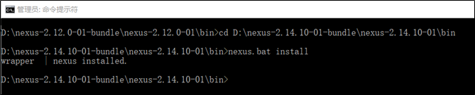
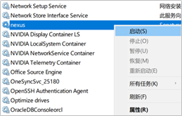
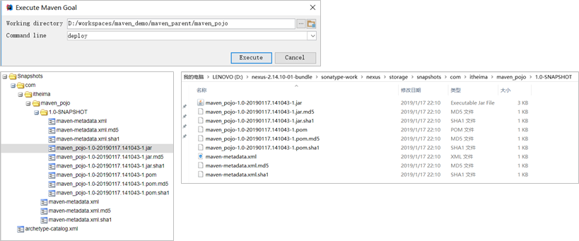

## Maven高级

## 1.maven基础知识回顾

### 1.1 maven介绍

maven 是一个项目管理工具，主要作用是在项目开发阶段对Java项目进行依赖管理和项目构建。
- `依赖管理`就是对jar包的管理。通过导入maven坐标，就相当于将仓库中的jar包导入了当前项目中。
- `项目构建`通过maven的一个命令就可以完成项目从清理、编译、测试、报告、打包，部署整个过程。


### 1.2 maven的仓库类型

本地仓库 
远程仓库
- maven中央仓库`http://repo2.maven.org/maven2/`
- maven私服（公司局域网内的仓库，需要自己搭建）
- 其他公共远程仓库例如apache提供的远程仓库`http://repo.maven.apache.org/maven2/`

### 1.3 maven常用命令

`clean` 清理
`compile` 编译
`test` 测试
`package` 打包
`install` 安装

### 1.4 maven坐标书写规范


### 1.5 maven的依赖范围

| 依赖范围 | 对于编译classpath有效 | 对于测试classpath有效 | 对于运行时classpath有效 | 例子                        |
| -------- | --------------------- | --------------------- | ----------------------- | --------------------------- |
| compile  | Y                     | Y                     | Y                       | spring-core                 |
| test     | -                     | Y                     | -                       | Junit                       |
| provided | Y                     | Y                     | -                       | servlet-api                 |
| runtime  | -                     | Y                     | Y                       | JDBC驱动                    |
| system   | Y                     | Y                     | -                       | 本地的，maven仓库之外的类库 |

## 2. maven的依赖传递

### 2.1 什么是依赖传递

在maven中，依赖是可以传递的，假设存在三个项目，分别是项目A，项目B以及项目C。假设C依赖B，B依赖A，那么我们可以根据maven项目依赖的特征不难推出项目C也依赖A。


通过上面的图可以看到，我们的web项目直接依赖了`spring-webmvc`，而`spring-webmvc`依赖了`spring-aop`、`spring-beans`等。最终的结果就是在我们的web项目中间接依赖了`spring-aop`、`spring-beans`等。

### 2.2 什么是依赖冲突

由于依赖传递现象的存在， `spring-webmvc` 依赖 `spring-beans-4.2.4`，`spring-aop` 依赖 `spring-beans-5.0.2`，但是发现 `spirng-beans-4.2.4`加入到了工程中，而我们希望 `spring-beans-5.0.2` 加入工程。这就造成了依赖冲突。


### 2.3 如何解决依赖冲突

1.使用maven提供的依赖调解原则，`第一声明者优先原则`即路径近者优先原则

2.排除依赖

3.锁定版本 

### 2.4 依赖调节原则`第一声明者优先原则`

在 `pom` 文件中定义依赖，以先声明的依赖为准。其实就是根据坐标导入的顺序来确定最终使用哪个传递过来的依赖。


结论：通过上图可以看到，`spring-aop`和`spring-webmvc`都传递过来了`spring-beans`，但是因为`spring-aop`在前面，所以最终使用的`spring-beans`是由`spring-aop`传递过来的，而`spring-webmvc`传递过来的`spring-beans`则被忽略了。

### 2.5 排除依赖

可以使用exclusions标签将传递过来的依赖排除出去。


### 2.6 版本锁定

采用直接锁定版本的方法确定依赖jar包的版本，版本锁定后则不考虑依赖的声明顺序或依赖的路径，以锁定的版本为准添加到工程中，此方法在企业开发中经常使用。

版本锁定的使用方式
- 首先在`dependencyManagement`标签中锁定依赖的版本

- 然后在`dependencies`标签中声明需要导入的maven坐标


## 3.基于maven构建SSM工程案例

### 3.1 需求描述

本案例基于maven构建 SSM（Spring+SpringMVC+Mybatis）工程，通过maven坐标进行依赖管理。最终实现根据 id 查询商品信息的功能。

### 3.2 构建maven工程

数据库环境搭建 
- 创建数据库`ssmtest`

  
- 创建商品表item

  ```sql
  CREATE TABLE `item` (
    `id` int(11) NOT NULL auto_increment,
    `name` varchar(255) default NULL,
    `price` float default NULL,
    `createtime` datetime default NULL,
    `detail` varchar(255) default NULL,
    PRIMARY KEY  (`id`)
  ) ENGINE=InnoDB DEFAULT CHARSET=utf8
  ```
maven项目构建 
- 创建maven web项目
- 配置pom.xml文件
- 实现spring+mybatis整合
  - 创建POJO类
    ```java
    public class Item {
        private Integer id;
        private String name;
        private Float price;
        private Date createtime;
        private String detail;
        //省略setter、getter
    }
    ```
  - 持久层DAO接口编写

    ```java
    public interface ItemMapper {
           public Item findById(int id);
    }
    ```
  - Mapper映射文件编写

    ```xml
    <?xml version="1.0" encoding="UTF-8" ?>
    <!DOCTYPE mapper PUBLIC "-//mybatis.org//DTD Mapper 3.0//EN" "http://mybatis.org/dtd/mybatis-3-mapper.dtd">
    <mapper namespace="tk.deriwotua.ssm.dao.ItemMapper">
        <select id="findById" parameterType="int" resultType="Item">
            select * from item where id = #{id}
        </select>
    </mapper>
    ```
  - 业务层Service编写

    ```java
    package tk.deriwotua.ssm.service;
    import tk.deriwotua.ssm.pojo.Item;
    public interface ItemService {
        public Items findById(int id);
    } 
    @Service
    @Transactional
    public class ItemServiceImpl implements ItemService {
        @Autowired
        private ItemMapper itemMapper;
        public Item findById(int id) {
            return itemMapper.findById(id);
        }
    }
    ```
  - spring配置文件`applicationContext-dao.xml`编写

    ```xml
    <?xml version="1.0" encoding="UTF-8"?>
    <beans xmlns="http://www.springframework.org/schema/beans"
           xmlns:context="http://www.springframework.org/schema/context"
           xmlns:p="http://www.springframework.org/schema/p"
           xmlns:aop="http://www.springframework.org/schema/aop"
           xmlns:tx="http://www.springframework.org/schema/tx"
           xmlns:xsi="http://www.w3.org/2001/XMLSchema-instance"
           xsi:schemaLocation="http://www.springframework.org/schema/beans
    						   http://www.springframework.org/schema/beans/spring-beans.xsd
    						   http://www.springframework.org/schema/context
    						   http://www.springframework.org/schema/context/spring-context.xsd
    						   http://www.springframework.org/schema/aop
    						   http://www.springframework.org/schema/aop/spring-aop.xsd
    						   http://www.springframework.org/schema/tx
    						   http://www.springframework.org/schema/tx/spring-tx.xsd">
    
        <!--配置数据源信息，使用druid连接池-->
        <bean id="dataSource" class="com.alibaba.druid.pool.DruidDataSource">
            <property name="driverClassName" value="com.mysql.jdbc.Driver"/>
            <property name="url" value="jdbc:mysql://localhost:3306/ssmtest"/>
            <property name="username" value="root"/>
            <property name="password" value="root"/>
        </bean>
        <!--配置spring整合mybatis框架的SQLSessionFactoryBean-->
        <bean id="sqlSessionFactory" class="org.mybatis.spring.SqlSessionFactoryBean">
            <property name="dataSource" ref="dataSource"/>
            <!--扫描pojo包，为实体类创建别名-->
            <property name="typeAliasesPackage" value="tk.deriwotua.ssm.pojo"/>
        </bean>
    
        <!--mapper扫描器，用于产生代理对象-->
        <bean class="org.mybatis.spring.mapper.MapperScannerConfigurer">
            <property name="basePackage" value="tk.deriwotua.ssm.dao"/>
        </bean>
    </beans>
    ```
  - spring配置文件`applicationContext-service.xml`编写
    ```xml
    <?xml version="1.0" encoding="UTF-8"?>
    <beans xmlns="http://www.springframework.org/schema/beans"
           xmlns:context="http://www.springframework.org/schema/context"
           xmlns:p="http://www.springframework.org/schema/p"
           xmlns:aop="http://www.springframework.org/schema/aop"
           xmlns:tx="http://www.springframework.org/schema/tx"
           xmlns:xsi="http://www.w3.org/2001/XMLSchema-instance"
           xsi:schemaLocation="http://www.springframework.org/schema/beans
    						   http://www.springframework.org/schema/beans/spring-beans.xsd
    						   http://www.springframework.org/schema/context
    						   http://www.springframework.org/schema/context/spring-context.xsd
    						   http://www.springframework.org/schema/aop
    						   http://www.springframework.org/schema/aop/spring-aop.xsd
    						   http://www.springframework.org/schema/tx
    						   http://www.springframework.org/schema/tx/spring-tx.xsd">
    
        <!--配置扫描器，扫描Service-->
        <context:component-scan base-package="tk.deriwotua.ssm.service"/>
    
        <!--事务管理器-->
        <bean id="transactionManager" class="org.springframework.jdbc.datasource.DataSourceTransactionManager">
            <property name="dataSource" ref="dataSource"/>
        </bean>
    
        <!--事物注解驱动-->
        <tx:annotation-driven transaction-manager="transactionManager"/>
    </beans>
    ```
- 加入spring-mvc相关配置
  - 表现层Controller编写

    ```java
    @Controller
    @RequestMapping("/item")
    public class ItemController {
       @Autowired
       private ItemService itemService;
      @RequestMapping("/showItem/{id}")
      public String showItem(@PathVariable("id") int id, Model model){
            Item item = itemService.findById(id);
            model.addAttribute("item",item);
            return "item";   
      }
    }
    ```
  - `springmvc.xml`文件编写

    ```xml
    <?xml version="1.0" encoding="UTF-8"?>
    <beans xmlns="http://www.springframework.org/schema/beans"
           xmlns:context="http://www.springframework.org/schema/context"
           xmlns:p="http://www.springframework.org/schema/p"
           xmlns:aop="http://www.springframework.org/schema/aop"
           xmlns:tx="http://www.springframework.org/schema/tx"
           xmlns:xsi="http://www.w3.org/2001/XMLSchema-instance"
           xsi:schemaLocation="http://www.springframework.org/schema/beans
    						   http://www.springframework.org/schema/beans/spring-beans.xsd
    						   http://www.springframework.org/schema/context
    						   http://www.springframework.org/schema/context/spring-context.xsd
    						   http://www.springframework.org/schema/aop
    						   http://www.springframework.org/schema/aop/spring-aop.xsd
    						   http://www.springframework.org/schema/tx
    						   http://www.springframework.org/schema/tx/spring-tx.xsd">
    
        <!--配置扫描器，扫描Controller-->
        <context:component-scan base-package="tk.deriwotua.ssm.controller"/>
    
        <!--视图解析器-->
        <bean class="org.springframework.web.servlet.view.InternalResourceViewResolver">
            <property name="prefix" value="/WEB-INF/jsp"/>
            <property name="suffix" value=".jsp"/>
        </bean>
    </beans>
    ```
- jsp页面编写
  - 配置`web.xml`文件
    ```xml
    <!DOCTYPE web-app PUBLIC
     "-//Sun Microsystems, Inc.//DTD Web Application 2.3//EN"
     "http://java.sun.com/dtd/web-app_2_3.dtd" >
    <web-app>
      <display-name>Archetype Created Web Application</display-name>
    
      <!--指定Spring配置文件位置-->
      <context-param>
        <param-name>contextConfigLocation</param-name>
        <param-value>classpath*:applicationContext*.xml</param-value>
      </context-param>
    
      <!--配置Spring框架启动时使用的监听器-->
      <listener>
        <listener-class>org.springframework.web.context.ContextLoaderListener</listener-class>
      </listener>
      <!--配置SpringMVC的前端控制器-->
      <servlet>
        <servlet-name>springmvc</servlet-name>
        <servlet-class>org.springframework.web.servlet.DispatcherServlet</servlet-class>
      </servlet>
      <servlet-mapping>
        <servlet-name>springmvc</servlet-name>
        <url-pattern>*.do</url-pattern>
      </servlet-mapping>
    </web-app>
    ```

## 4.分模块构建maven工程

### 4.1 分模块构建maven工程分析

在现实生活中，汽车厂家进行汽车生产时，由于整个生产过程非常复杂和繁琐，工作量非常大，所以车场都会将整个汽车的部件分开生产，最终再将生产好的部件进行组装，形成一台完整的汽车。


### 4.2 maven工程的继承

在Java语言中，类之间是可以继承的，通过继承，子类就可以引用父类中非private的属性和方法。同样，在maven工程之间也可以继承，子工程继承父工程后，就可以使用在父工程中引入的依赖。继承的目的是为了消除重复代码。

创建maven项目`pom.xml`文件中指定打包方式为`pom`
```xml
<?xml version="1.0" encoding="UTF-8"?>
<project xmlns="http://maven.apache.org/POM/4.0.0"
         xmlns:xsi="http://www.w3.org/2001/XMLSchema-instance"
         xsi:schemaLocation="http://maven.apache.org/POM/4.0.0 http://maven.apache.org/xsd/maven-4.0.0.xsd">
    <modelVersion>4.0.0</modelVersion>

    <!--被继承的maven工程通常称为父工程，父工程的打包方式必须为pom。因此区分maven是否为父工程就看这个工程打包方式是否为pom-->              
    <groupId>tk.deriwotua</groupId>
    <artifactId>maven-parent</artifactId>
    <version>1.0-SNAPSHOT</version>
    <packaging>pom</packaging>


</project>
```
在子maven项目中继承父maven项目
```xml
<?xml version="1.0" encoding="UTF-8"?>
<project xmlns="http://maven.apache.org/POM/4.0.0"
         xmlns:xsi="http://www.w3.org/2001/XMLSchema-instance"
         xsi:schemaLocation="http://maven.apache.org/POM/4.0.0 http://maven.apache.org/xsd/maven-4.0.0.xsd">
    <modelVersion>4.0.0</modelVersion>

    <!--继承其他maven工程为子工程 pom.xml通过配置parent标签指定父工程-->
    <parent>
        <groupId>tk.deriwotua</groupId>
        <artifactId>maven-parent</artifactId>
        <version>1.0-SNAPSHOT</version>
    </parent>

    <artifactId>maven-children</artifactId>
    <version>1.0-SNAPSHOT</version>

</project>
```

### 4.3 maven工程的聚合

在maven工程的`pom.xml`文件中可以使用`<modules>`标签将其他maven工程聚合到一起，聚合的目的是为了进行统一操作。
拆分后的maven工程有多个，如果要进行打包，就需要针对每个工程分别执行打包命令，操作起来非常繁琐。这时就可以使用`<modules>`标签将这些工程统一聚合到maven工程中，需要打包的时候，只需要在此工程中执行一次打包命令，其下被聚合的工程就都会被打包了。


### 4.4 分模块构建maven工程具体实现

创建maven-aggregation父工程
- 配置其`pom.xml`
  ```xml
  <?xml version="1.0" encoding="UTF-8"?>
  <project xmlns="http://maven.apache.org/POM/4.0.0"
           xmlns:xsi="http://www.w3.org/2001/XMLSchema-instance"
           xsi:schemaLocation="http://maven.apache.org/POM/4.0.0 http://maven.apache.org/xsd/maven-4.0.0.xsd">
      <modelVersion>4.0.0</modelVersion>
  
      <groupId>tk.deriwotua</groupId>
      <artifactId>maven-aggregation</artifactId>
      <version>1.0-SNAPSHOT</version>
      <packaging>pom</packaging>    
  
      <properties>
          <spring.version>5.0.5.RELEASE</spring.version>
          <springmvc.version>5.0.5.RELEASE</springmvc.version>
          <mybatis.version>3.4.5</mybatis.version>
      </properties>
  
      <!--锁定jar版本-->
      <dependencyManagement>
          <dependencies>
              <!-- Mybatis -->
              <dependency>
                  <groupId>org.mybatis</groupId>
                  <artifactId>mybatis</artifactId>
                  <version>${mybatis.version}</version>
              </dependency>
              <!-- springMVC -->
              <dependency>
                  <groupId>org.springframework</groupId>
                  <artifactId>spring-webmvc</artifactId>
                  <version>${springmvc.version}</version>
              </dependency>
              <!-- spring -->
              <dependency>
                  <groupId>org.springframework</groupId>
                  <artifactId>spring-context</artifactId>
                  <version>${spring.version}</version>
              </dependency>
              <dependency>
                  <groupId>org.springframework</groupId>
                  <artifactId>spring-core</artifactId>
                  <version>${spring.version}</version>
              </dependency>
              <dependency>
                  <groupId>org.springframework</groupId>
                  <artifactId>spring-aop</artifactId>
                  <version>${spring.version}</version>
              </dependency>
              <dependency>
                  <groupId>org.springframework</groupId>
                  <artifactId>spring-web</artifactId>
                  <version>${spring.version}</version>
              </dependency>
              <dependency>
                  <groupId>org.springframework</groupId>
                  <artifactId>spring-expression</artifactId>
                  <version>${spring.version}</version>
              </dependency>
              <dependency>
                  <groupId>org.springframework</groupId>
                  <artifactId>spring-beans</artifactId>
                  <version>${spring.version}</version>
              </dependency>
              <dependency>
                  <groupId>org.springframework</groupId>
                  <artifactId>spring-aspects</artifactId>
                  <version>${spring.version}</version>
              </dependency>
              <dependency>
                  <groupId>org.springframework</groupId>
                  <artifactId>spring-context-support</artifactId>
                  <version>${spring.version}</version>
              </dependency>
              <dependency>
                  <groupId>org.springframework</groupId>
                  <artifactId>spring-test</artifactId>
                  <version>${spring.version}</version>
              </dependency>
              <dependency>
                  <groupId>org.springframework</groupId>
                  <artifactId>spring-jdbc</artifactId>
                  <version>${spring.version}</version>
              </dependency>
              <dependency>
                  <groupId>org.springframework</groupId>
                  <artifactId>spring-tx</artifactId>
                  <version>${spring.version}</version>
              </dependency>
          </dependencies>
      </dependencyManagement>
  
      <build>
          <plugins>
              <plugin>
                  <groupId>org.apache.maven.plugins</groupId>
                  <artifactId>maven-compiler-plugin</artifactId>
                  <version>3.1</version>
                  <configuration>
                      <source>1.8</source>
                      <target>1.8</target>
                      <encoding>UTF-8</encoding>
                  </configuration>
              </plugin>
          </plugins>
      </build>
  </project>
  ```

构建maven-aggregation-pojo子模块
- `pom.xml`文件配置
  ```xml
  <?xml version="1.0" encoding="UTF-8"?>
  <project xmlns="http://maven.apache.org/POM/4.0.0"
           xmlns:xsi="http://www.w3.org/2001/XMLSchema-instance"
           xsi:schemaLocation="http://maven.apache.org/POM/4.0.0 http://maven.apache.org/xsd/maven-4.0.0.xsd">
      <modelVersion>4.0.0</modelVersion>
  
      <groupId>tk.deriwotua</groupId>
      <artifactId>maven-aggregation-pojo</artifactId>
      <version>1.0-SNAPSHOT</version>
  
      <dependencies>
          <dependency>
              <groupId>log4j</groupId>
              <artifactId>log4j</artifactId>
              <version>1.2.12</version>
          </dependency>
          <dependency>
              <groupId>c3p0</groupId>
              <artifactId>c3p0</artifactId>
              <version>0.9.1.2</version>
          </dependency>
      </dependencies>
  </project>
  ```
- `maven-aggregation`聚合`maven-aggregation-pojo`子模块
  - 首先指定`maven-aggregation-pojo`父模块。首先在`maven-aggregation-pojo`中配置`parent`
    ```xml
    <?xml version="1.0" encoding="UTF-8"?>
    <project xmlns="http://maven.apache.org/POM/4.0.0"
             xmlns:xsi="http://www.w3.org/2001/XMLSchema-instance"
             xsi:schemaLocation="http://maven.apache.org/POM/4.0.0 http://maven.apache.org/xsd/maven-4.0.0.xsd">
        <!--表示当前maven工程继承了maven-aggregation父工程-->
        <parent>
            <artifactId>maven-aggregation</artifactId>
            <groupId>tk.deriwotua</groupId>
            <version>1.0-SNAPSHOT</version>
        </parent>
        <modelVersion>4.0.0</modelVersion>
    
        <artifactId>maven-aggregation-pojo</artifactId>
        <version>1.0-SNAPSHOT</version>
    
        <dependencies>
            <dependency>
                <groupId>log4j</groupId>
                <artifactId>log4j</artifactId>
                <version>1.2.12</version>
            </dependency>
            <dependency>
                <groupId>c3p0</groupId>
                <artifactId>c3p0</artifactId>
                <version>0.9.1.2</version>
            </dependency>
        </dependencies>
    </project>
    ```
  - 然后`maven-aggregation`聚合子模块
    ```xml
    <?xml version="1.0" encoding="UTF-8"?>
    <project xmlns="http://maven.apache.org/POM/4.0.0"
             xmlns:xsi="http://www.w3.org/2001/XMLSchema-instance"
             xsi:schemaLocation="http://maven.apache.org/POM/4.0.0 http://maven.apache.org/xsd/maven-4.0.0.xsd">
        <modelVersion>4.0.0</modelVersion>
    
        <groupId>tk.deriwotua</groupId>
        <artifactId>maven-aggregation</artifactId>
        <version>1.0-SNAPSHOT</version>
        <packaging>pom</packaging>
        <!--用于聚合其他maven工程-->
        <modules>
            <module>../maven-aggregation-pojo</module>
        </modules>
    
        <properties>
            <spring.version>5.0.5.RELEASE</spring.version>
            <springmvc.version>5.0.5.RELEASE</springmvc.version>
            <mybatis.version>3.4.5</mybatis.version>
        </properties>
    
        <!--锁定jar版本-->
        <dependencyManagement>
            <dependencies>
                <!-- Mybatis -->
                <dependency>
                    <groupId>org.mybatis</groupId>
                    <artifactId>mybatis</artifactId>
                    <version>${mybatis.version}</version>
                </dependency>
                <!-- springMVC -->
                <dependency>
                    <groupId>org.springframework</groupId>
                    <artifactId>spring-webmvc</artifactId>
                    <version>${springmvc.version}</version>
                </dependency>
                <!-- spring -->
                <dependency>
                    <groupId>org.springframework</groupId>
                    <artifactId>spring-context</artifactId>
                    <version>${spring.version}</version>
                </dependency>
                <dependency>
                    <groupId>org.springframework</groupId>
                    <artifactId>spring-core</artifactId>
                    <version>${spring.version}</version>
                </dependency>
                <dependency>
                    <groupId>org.springframework</groupId>
                    <artifactId>spring-aop</artifactId>
                    <version>${spring.version}</version>
                </dependency>
                <dependency>
                    <groupId>org.springframework</groupId>
                    <artifactId>spring-web</artifactId>
                    <version>${spring.version}</version>
                </dependency>
                <dependency>
                    <groupId>org.springframework</groupId>
                    <artifactId>spring-expression</artifactId>
                    <version>${spring.version}</version>
                </dependency>
                <dependency>
                    <groupId>org.springframework</groupId>
                    <artifactId>spring-beans</artifactId>
                    <version>${spring.version}</version>
                </dependency>
                <dependency>
                    <groupId>org.springframework</groupId>
                    <artifactId>spring-aspects</artifactId>
                    <version>${spring.version}</version>
                </dependency>
                <dependency>
                    <groupId>org.springframework</groupId>
                    <artifactId>spring-context-support</artifactId>
                    <version>${spring.version}</version>
                </dependency>
                <dependency>
                    <groupId>org.springframework</groupId>
                    <artifactId>spring-test</artifactId>
                    <version>${spring.version}</version>
                </dependency>
                <dependency>
                    <groupId>org.springframework</groupId>
                    <artifactId>spring-jdbc</artifactId>
                    <version>${spring.version}</version>
                </dependency>
                <dependency>
                    <groupId>org.springframework</groupId>
                    <artifactId>spring-tx</artifactId>
                    <version>${spring.version}</version>
                </dependency>
            </dependencies>
        </dependencyManagement>
    
        <build>
            <plugins>
                <plugin>
                    <groupId>org.apache.maven.plugins</groupId>
                    <artifactId>maven-compiler-plugin</artifactId>
                    <version>3.1</version>
                    <configuration>
                        <source>1.8</source>
                        <target>1.8</target>
                        <encoding>UTF-8</encoding>
                    </configuration>
                </plugin>
            </plugins>
        </build>
    </project>
    ```
- 创建`Item.java`实体
  ```java
  package tk.deriwotua.ssm.pojo;
  
  import java.util.Date;
  
  /**
   * 订单实体
   */
  public class Item {
      private int id;
      private String name;
      private float price;
      private Date createtime;
      private String detail;
      setXXX()/getXXX();   
  }
  ```  

构建`maven-aggregation-dao`子模块
- 配置`pom.xml`文件
  ```xml
  <?xml version="1.0" encoding="UTF-8"?>
  <project xmlns="http://maven.apache.org/POM/4.0.0"
           xmlns:xsi="http://www.w3.org/2001/XMLSchema-instance"
           xsi:schemaLocation="http://maven.apache.org/POM/4.0.0 http://maven.apache.org/xsd/maven-4.0.0.xsd">
      <modelVersion>4.0.0</modelVersion>
  
      <groupId>tk.deriwotua</groupId>
      <artifactId>maven-aggregation-dao</artifactId>
      <version>1.0-SNAPSHOT</version>
  
      <dependencies>
          <dependency>
              <groupId>tk.deriwotua</groupId>
              <artifactId>maven-aggregation-pojo</artifactId>
              <version>1.0-SNAPSHOT</version>
          </dependency>
          <!-- Mybatis和mybatis与spring的整合 -->
          <dependency>
              <groupId>org.mybatis</groupId>
              <artifactId>mybatis</artifactId>
          </dependency>
          <dependency>
              <groupId>org.mybatis</groupId>
              <artifactId>mybatis-spring</artifactId>
              <version>1.3.1</version>
          </dependency>
          <!-- MySql驱动 -->
          <dependency>
              <groupId>mysql</groupId>
              <artifactId>mysql-connector-java</artifactId>
              <version>5.1.32</version>
          </dependency>
          <!-- druid数据库连接池 -->
          <dependency>
              <groupId>com.alibaba</groupId>
              <artifactId>druid</artifactId>
              <version>1.0.9</version>
          </dependency>
          <!-- spring相关 -->
          <dependency>
              <groupId>org.springframework</groupId>
              <artifactId>spring-context</artifactId>
          </dependency>
          <dependency>
              <groupId>org.springframework</groupId>
              <artifactId>spring-core</artifactId>
          </dependency>
          <dependency>
              <groupId>org.springframework</groupId>
              <artifactId>spring-aop</artifactId>
          </dependency>
          <dependency>
              <groupId>org.springframework</groupId>
              <artifactId>spring-expression</artifactId>
          </dependency>
          <dependency>
              <groupId>org.springframework</groupId>
              <artifactId>spring-beans</artifactId>
          </dependency>
          <dependency>
              <groupId>org.springframework</groupId>
              <artifactId>spring-aspects</artifactId>
          </dependency>
          <dependency>
              <groupId>org.springframework</groupId>
              <artifactId>spring-context-support</artifactId>
          </dependency>
          <dependency>
              <groupId>org.springframework</groupId>
              <artifactId>spring-test</artifactId>
          </dependency>
          <dependency>
              <groupId>org.springframework</groupId>
              <artifactId>spring-jdbc</artifactId>
          </dependency>
          <dependency>
              <groupId>org.springframework</groupId>
              <artifactId>spring-tx</artifactId>
          </dependency>
          <!-- junit测试 -->
          <dependency>
              <groupId>junit</groupId>
              <artifactId>junit</artifactId>
              <version>4.12</version>
          </dependency>
      </dependencies>
  </project>
  ```
- `maven-aggregation`聚合`maven-aggregation-dao`子模块
  ```xml
  <!--maven-aggregation模块pom.xml中添加聚合配置-->
  <!--用于聚合其他maven工程-->
  <modules>
      <module>../maven-aggregation-pojo</module>
      <module>../maven-aggregation-dao</module>
  </modules>
  
  <!-- -&#45;&#45;&#45;&#45;&#45;&#45;&#45;&#45;&#45;-->
  
  <!--maven-aggregation-dao子模块pom.xml指定父模块-->
  <!--表示当前maven工程继承了maven-aggregation父工程-->
  <parent>
      <artifactId>maven-aggregation</artifactId>
      <groupId>tk.deriwotua</groupId>
      <version>1.0-SNAPSHOT</version>
  </parent>
  <modelVersion>4.0.0</modelVersion>

  <artifactId>maven-aggregation-dao</artifactId>
  <version>1.0-SNAPSHOT</version>
  ```

- 创建DAO接口
  ```java
  package tk.deriwotua.ssm.dao;
  
  import tk.deriwotua.ssm.pojo.Item;
  
  public interface ItemMapper {
      public Item findById(int id);
  }
  ```
- Mapper映射文件
  ```xml
  <?xml version="1.0" encoding="UTF-8" ?>
  <!DOCTYPE mapper PUBLIC "-//mybatis.org//DTD Mapper 3.0//EN"
          "http://mybatis.org/dtd/mybatis-3-mapper.dtd">
  <mapper namespace="tk.deriwotua.ssm.dao.ItemMapper">
      <select id="findById" parameterType="int" resultType="Item">
          select * from item where id = #{id}
      </select>
  </mapper>
  ```
- 在resources目录下创建spring配置文件`applicationContext-dao.xml`
  ```xml
  <?xml version="1.0" encoding="UTF-8"?>
  <beans xmlns="http://www.springframework.org/schema/beans"
         xmlns:context="http://www.springframework.org/schema/context"
         xmlns:p="http://www.springframework.org/schema/p"
         xmlns:aop="http://www.springframework.org/schema/aop"
         xmlns:tx="http://www.springframework.org/schema/tx"
         xmlns:xsi="http://www.w3.org/2001/XMLSchema-instance"
         xsi:schemaLocation="http://www.springframework.org/schema/beans
  						   http://www.springframework.org/schema/beans/spring-beans.xsd
  						   http://www.springframework.org/schema/context
  						   http://www.springframework.org/schema/context/spring-context.xsd
  						   http://www.springframework.org/schema/aop
  						   http://www.springframework.org/schema/aop/spring-aop.xsd
  						   http://www.springframework.org/schema/tx
  						   http://www.springframework.org/schema/tx/spring-tx.xsd">
  
      <!--配置数据源信息，使用druid连接池-->
      <bean id="dataSource" class="com.alibaba.druid.pool.DruidDataSource">
          <property name="driverClassName" value="com.mysql.jdbc.Driver"/>
          <property name="url" value="jdbc:mysql://localhost:3306/ssmtest"/>
          <property name="username" value="root"/>
          <property name="password" value="root"/>
      </bean>
      <!--配置spring整合mybatis框架的SQLSessionFactoryBean-->
      <bean id="sqlSessionFactory" class="org.mybatis.spring.SqlSessionFactoryBean">
          <property name="dataSource" ref="dataSource"/>
          <!--扫描pojo包，为实体类创建别名-->
          <property name="typeAliasesPackage" value="tk.deriwotua.ssm.pojo"/>
      </bean>
  
      <!--mapper扫描器，用于产生代理对象-->
      <bean class="org.mybatis.spring.mapper.MapperScannerConfigurer">
          <property name="basePackage" value="tk.deriwotua.ssm.dao"/>
      </bean>
  </beans>
  ```

`maven-aggregation-service`子模块构建
- `pom.xml`文件
  ```xml
  <?xml version="1.0" encoding="UTF-8"?>
  <project xmlns="http://maven.apache.org/POM/4.0.0"
           xmlns:xsi="http://www.w3.org/2001/XMLSchema-instance"
           xsi:schemaLocation="http://maven.apache.org/POM/4.0.0 http://maven.apache.org/xsd/maven-4.0.0.xsd">
      <modelVersion>4.0.0</modelVersion>
  
      <groupId>tk.deriwotua</groupId>
      <artifactId>maven-aggregation-service</artifactId>
      <version>1.0-SNAPSHOT</version>
  
      <dependencies>
          <dependency>
              <groupId>tk.deriwotua</groupId>
              <artifactId>maven-aggregation-dao</artifactId>
              <version>1.0-SNAPSHOT</version>
          </dependency>
      </dependencies>
  </project>
  ```
- 同理`maven-aggregation`中聚合`maven-aggregation-service`
- 创建Service接口和实现类
  ```java
  package tk.deriwotua.ssm.service;
  
  import tk.deriwotua.ssm.pojo.Item;
  
  public interface ItemService {
      public Item findById(int id);
  }
  
  package tk.deriwotua.ssm.service;
  
  import tk.deriwotua.ssm.dao.ItemMapper;
  import tk.deriwotua.ssm.pojo.Item;
  import org.springframework.beans.factory.annotation.Autowired;
  import org.springframework.stereotype.Service;
  import org.springframework.transaction.annotation.Transactional;
  
  @Service
  @Transactional
  public class ItemServiceImpl implements ItemService {
      @Autowired
      private ItemMapper itemMapper;
  
      public Item findById(int id) {
          return itemMapper.findById(id);
      }
  }
  ```
- 创建spring配置文件`applicationContext-service.xml`
  ```xml
  <?xml version="1.0" encoding="UTF-8"?>
  <beans xmlns="http://www.springframework.org/schema/beans"
         xmlns:context="http://www.springframework.org/schema/context"
         xmlns:p="http://www.springframework.org/schema/p"
         xmlns:aop="http://www.springframework.org/schema/aop"
         xmlns:tx="http://www.springframework.org/schema/tx"
         xmlns:xsi="http://www.w3.org/2001/XMLSchema-instance"
         xsi:schemaLocation="http://www.springframework.org/schema/beans
  						   http://www.springframework.org/schema/beans/spring-beans.xsd
  						   http://www.springframework.org/schema/context
  						   http://www.springframework.org/schema/context/spring-context.xsd
  						   http://www.springframework.org/schema/aop
  						   http://www.springframework.org/schema/aop/spring-aop.xsd
  						   http://www.springframework.org/schema/tx
  						   http://www.springframework.org/schema/tx/spring-tx.xsd">
  
      <!--配置扫描器，扫描Service-->
      <context:component-scan base-package="tk.deriwotua.ssm.service"/>
  
      <!--事务管理器-->
      <bean id="transactionManager" class="org.springframework.jdbc.datasource.DataSourceTransactionManager">
          <property name="dataSource" ref="dataSource"/>
      </bean>
  
      <!--事物注解驱动-->
      <tx:annotation-driven transaction-manager="transactionManager"/>
  </beans>
  ```

`maven-aggregation-web`子模块构建，注意打包方式为war
- `pom.xml`文件
  ```xml
  <?xml version="1.0" encoding="UTF-8"?>
  <project xmlns="http://maven.apache.org/POM/4.0.0"
           xmlns:xsi="http://www.w3.org/2001/XMLSchema-instance"
           xsi:schemaLocation="http://maven.apache.org/POM/4.0.0 http://maven.apache.org/xsd/maven-4.0.0.xsd">
      <parent>
          <artifactId>maven-aggregation</artifactId>
          <groupId>tk.deriwotua</groupId>
          <version>1.0-SNAPSHOT</version>
      </parent>
      <modelVersion>4.0.0</modelVersion>
  
      <artifactId>maven-aggregation-web</artifactId>
      <version>1.0-SNAPSHOT</version>
      <packaging>war</packaging>
  
      <name>maven-aggregation-web Maven Webapp</name>
      <!-- FIXME change it to the project's website -->
      <url>http://www.example.com</url>
  
      <properties>
          <project.build.sourceEncoding>UTF-8</project.build.sourceEncoding>
          <maven.compiler.source>1.8</maven.compiler.source>
          <maven.compiler.target>1.8</maven.compiler.target>
      </properties>
  
      <dependencies>
          <dependency>
              <groupId>tk.deriwotua</groupId>
              <artifactId>maven-aggregation-service</artifactId>
              <version>1.0-SNAPSHOT</version>
          </dependency>
          <dependency>
              <groupId>org.springframework</groupId>
              <artifactId>spring-webmvc</artifactId>
          </dependency>
      </dependencies>
  
      <build>
          <finalName>maven_web</finalName>
          <pluginManagement><!-- lock down plugins versions to avoid using Maven defaults (may be moved to parent pom) -->
              <plugins>
                  <plugin>
                      <artifactId>maven-clean-plugin</artifactId>
                      <version>3.1.0</version>
                  </plugin>
                  <!-- see http://maven.apache.org/ref/current/maven-core/default-bindings.html#Plugin_bindings_for_war_packaging -->
                  <plugin>
                      <artifactId>maven-resources-plugin</artifactId>
                      <version>3.0.2</version>
                  </plugin>
                  <plugin>
                      <artifactId>maven-compiler-plugin</artifactId>
                      <version>3.8.0</version>
                  </plugin>
                  <plugin>
                      <artifactId>maven-surefire-plugin</artifactId>
                      <version>2.22.1</version>
                  </plugin>
                  <plugin>
                      <artifactId>maven-war-plugin</artifactId>
                      <version>3.2.2</version>
                  </plugin>
                  <plugin>
                      <artifactId>maven-install-plugin</artifactId>
                      <version>2.5.2</version>
                  </plugin>
                  <plugin>
                      <artifactId>maven-deploy-plugin</artifactId>
                      <version>2.8.2</version>
                  </plugin>
              </plugins>
          </pluginManagement>
      </build>
  </project>
  ```
- 创建Controller
  ```java
  package tk.deriwotua.ssm.controller;
  
  import tk.deriwotua.ssm.pojo.Item;
  import tk.deriwotua.ssm.service.ItemService;
  import org.springframework.beans.factory.annotation.Autowired;
  import org.springframework.stereotype.Controller;
  import org.springframework.ui.Model;
  import org.springframework.web.bind.annotation.PathVariable;
  import org.springframework.web.bind.annotation.RequestMapping;
  
  @Controller
  @RequestMapping("/item")
  public class ItemController {
      @Autowired
      private ItemService itemService;
  
      @RequestMapping("/showItem/{id}")
      public String findById(@PathVariable("id") int id, Model model){
          Item item = itemService.findById(id);
          model.addAttribute("item",item);
          return "item";
      }
  }
  ```
- 创建jsp页面
- 配置web.xml
  ```xml
  <!DOCTYPE web-app PUBLIC
   "-//Sun Microsystems, Inc.//DTD Web Application 2.3//EN"
   "http://java.sun.com/dtd/web-app_2_3.dtd" >
  
  <web-app>
    <display-name>Archetype Created Web Application</display-name>
  
    <!--指定Spring配置文件位置-->
    <context-param>
      <param-name>contextConfigLocation</param-name>
      <param-value>classpath*:applicationContext*.xml</param-value>
    </context-param>
  
    <!--配置Spring框架启动时使用的监听器-->
    <listener>
      <listener-class>org.springframework.web.context.ContextLoaderListener</listener-class>
    </listener>
    <!--配置SpringMVC的前端控制器-->
    <servlet>
      <servlet-name>springmvc</servlet-name>
      <servlet-class>org.springframework.web.servlet.DispatcherServlet</servlet-class>
      <init-param>
        <param-name>contextConfigLocation</param-name>
        <param-value>classpath:springmvc.xml</param-value>
      </init-param>
    </servlet>
    <servlet-mapping>
      <servlet-name>springmvc</servlet-name>
      <url-pattern>*.do</url-pattern>
    </servlet-mapping>
  </web-app>
  ```
- 创建spring-mvc配置文件`springmvc.xml`
  ```xml
  <?xml version="1.0" encoding="UTF-8"?>
  <beans xmlns="http://www.springframework.org/schema/beans"
         xmlns:context="http://www.springframework.org/schema/context"
         xmlns:p="http://www.springframework.org/schema/p"
         xmlns:aop="http://www.springframework.org/schema/aop"
         xmlns:tx="http://www.springframework.org/schema/tx"
         xmlns:xsi="http://www.w3.org/2001/XMLSchema-instance"
         xsi:schemaLocation="http://www.springframework.org/schema/beans
  						   http://www.springframework.org/schema/beans/spring-beans.xsd
  						   http://www.springframework.org/schema/context
  						   http://www.springframework.org/schema/context/spring-context.xsd
  						   http://www.springframework.org/schema/aop
  						   http://www.springframework.org/schema/aop/spring-aop.xsd
  						   http://www.springframework.org/schema/tx
  						   http://www.springframework.org/schema/tx/spring-tx.xsd">
  
      <!--配置扫描器，扫描Controller-->
      <context:component-scan base-package="tk.deriwotua.ssm.controller"/>
  
      <!--视图解析器-->
      <bean class="org.springframework.web.servlet.view.InternalResourceViewResolver">
          <property name="prefix" value="/WEB-INF/jsp/"/>
          <property name="suffix" value=".jsp"/>
      </bean>
  </beans>
  ```

项目整体结构如下
- `maven-aggregation`为父模块，其余工程为子模块，都继承父模块`maven-aggregation`
- `maven-aggregation`模块将其子模块都进行了聚合 
- 子模块之间存在依赖关系，比如`maven-aggregation-dao`依赖， `maven-aggregation-pojo`、`maven-aggregation-service`依赖`maven-aggregation-dao`、` maven-aggregation-web`依赖`maven-aggregation-service`

基于依赖传递，parent是不是并不一定都配置为`maven-aggregation`

## 5. maven私服

### 5.1 私服说明 

maven仓库分为本地仓库和远程仓库，而远程仓库又分为maven中央仓库、其他远程仓库和私服（私有服务器）。其中，中央仓库是由maven官方提供的，而私服就需要我们自己搭建了。

maven私服就是公司局域网内的maven远程仓库，每个员工的电脑上安装maven软件并且连接maven私服，程序员可以将自己开发的项目打成jar并发布到私服，其它项目组成员就可以从私服下载所依赖的jar。私服还充当一个代理服务器的角色，当私服上没有jar包时会从maven中央仓库自动下载。

nexus 是一个maven仓库管理器（其实就是一个软件），nexus可以充当maven私服，同时nexus还提供强大的仓库管理、构件搜索等功能。

### 5.2 搭建maven私服

下载[nexus](https://help.sonatype.com/repomanager2/download/download-archives---repository-manager-oss)
安装nexus将下载的压缩包进行解压，进入bin目录


打开cmd窗口并进入上面bin目录下，执行`nexus.bat install`命令安装服务（注意需要以管理员身份运行cmd命令）



启动nexus可以通过如下两种方式启动nexus服务
- 在Windows系统服务中启动nexus



- 在命令行执行`nexus.bat start`命令启动nexus


启动nexus服务后，访问`http://localhost:8081/nexus`。点击右上角LogIn按钮，进行登录。使用默认用户名admin和密码admin123登录系统。登录成功后点击左侧菜单Repositories可以看到nexus内置的仓库列表


nexus仓库类型。nexus默认内置了很多仓库，这些仓库可以划分为4种类型，每种类型的仓库用于存放特定的jar包，具体说明如下：
- `hosted`，宿主仓库，部署自己的jar到这个类型的仓库，包括`Releases`和`Snapshots`两部分，`Releases`为公司内部发布版本仓库、 `Snapshots`为公司内部测试版本仓库 
- `proxy`，代理仓库，用于代理远程的公共仓库，如maven中央仓库，用户连接私服，私服自动去中央仓库下载jar包或者插件
- `group`，仓库组，用来合并多个`hosted/proxy`仓库，通常我们配置自己的maven连接仓库组
- `virtual`(虚拟)：兼容Maven1版本的jar或者插件


nexus仓库类型与安装目录对应关系


### 5.3 将项目发布到maven私服

maven私服是搭建在公司局域网内的maven仓库，公司内的所有开发团队都可以使用。例如技术研发团队开发了一个基础组件，就可以将这个基础组件打成jar包发布到私服，其他团队成员就可以从私服下载这个jar包到本地仓库并在项目中使用。

将项目发布到maven私服操作步骤如下
- 配置maven的`settings.xml`文件
  ```xml
  <server>
  <id>releases</id>
  <username>admin</username>   
  <password>admin123</password>
  </server>
  <server>
  <id>snapshots</id>
  <username>admin</username>
  <password>admin123</password>
  </server>
  ```

- 配置项目的`pom.xml`文件，添加`distributionManagement`标签
  ```xml
  <!--添加到要上传的项目pom中确定上传路径开始-->
  <distributionManagement>
      <repository>
          <id>releases</id>
          <url>http://localhost:8081/nexus/content/repositories/releases/</url>
      </repository>
      <snapshotRepository>
          <id>snapshots</id>
          <url>http://localhost:8081/nexus/content/repositories/snapshots/</url>
      </snapshotRepository>
  </distributionManagement>
  <!--添加到要上传的项目pom中确定上传路径结束-->
  ```

3. 执行`mvn deploy`命令



### 5.4 从私服下载jar到本地仓库

前面我们已经完成了将本地项目打成jar包发布到maven私服，下面我们就需要从maven私服下载jar包到本地仓库。
- 在maven的`settings.xml`文件中配置下载模板
  ```xml
  <profile>
  	<id>dev</id>
    <repositories>
        <repository>
            <id>nexus</id>
            <!--仓库地址，即nexus仓库组的地址-->
            <url>
            http://localhost:8081/nexus/content/groups/public/</url>
            <!--是否下载releases构件-->
            <releases>
            <enabled>true</enabled>
            </releases>
            <!--是否下载snapshots构件-->
            <snapshots>
                <enabled>true</enabled>
            </snapshots>
        </repository>
    </repositories>
    <pluginRepositories>
  	    <!-- 插件仓库，maven的运行依赖插件，也需要从私服下载插件 -->
  	    <pluginRepository>
  		    <id>public</id>
  		    <name>Public Repositories</name>
  		    <url>http://localhost:8081/nexus/content/groups/public/</url>
  		</pluginRepository>
  	</pluginRepositories>
  </profile>
  ```
- 在maven的`settings.xml`文件中配置激活下载模板
  ```xml
  <activeProfiles>
  	<activeProfile>dev</activeProfile>
  </activeProfiles>
  ```

## 6. 将第三方jar安装到本地仓库和maven私服

在maven工程的`pom.xml`文件中配置某个jar包的坐标后，如果本地的maven仓库不存在这个jar包，maven工具会自动到配置的maven私服下载，如果私服中也不存在，maven私服就会从maven中央仓库进行下载。

但是并不是所有的jar包都可以从中央仓库下载到，比如常用的Oracle数据库驱动的jar包在中央仓库就不存在。此时需要到Oracle的官网下载驱动jar包，然后将此jar包通过maven命令安装到我们本地的maven仓库或者maven私服中，这样在maven项目中就可以使用maven坐标引用到此jar包了。

### 6.1 将第三方jar安装到本地仓库

首先下载Oracle的jar包（略）
然后`mvn install`命令进行安装
```shell script
mvn install:install-file -Dfile=ojdbc14-10.2.0.4.0.jar -DgroupId=com.oracle -DartifactId=ojdbc14 –Dversion=10.2.0.4.0 -Dpackaging=jar
```
最后查看本地maven仓库，确认安装是否成功


### 6.2 将第三方jar安装到maven私服

首先下载Oracle的jar包（略）
然后在maven的`settings.xml`配置文件中配置第三方仓库的server信息
  ```xml
  <server>
    <id>thirdparty</id>
    <username>admin</username>
    <password>admin123</password>
  </server>
  ```
然后执行`mvn deploy`命令进行安装
```shell script
mvn deploy:deploy-file -Dfile=ojdbc14-10.2.0.4.0.jar -DgroupId=com.oracle -DartifactId=ojdbc14 -Dversion=10.2.0.4.0 -Dpackaging=jar –Durl=http://localhost:8081/nexus/content/repositories/thirdparty/ -DrepositoryId=thirdparty
```