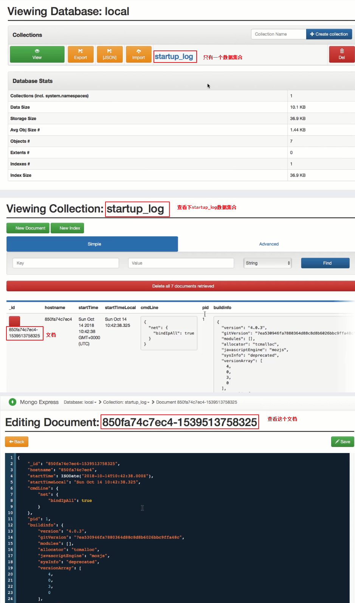

### mongodb 是什么

> 存储文档的非关系型数据库


非关系型数据库


mongodb结构


docker中运行mongodb

```shell
# 下载mongodb官方镜像
docker pull mongo:4
# 查看下载的镜像
docker images

# 启动mongodb服务器容器
# -- name mymongo 指定容器名称
# -v /mymongo/data:/data/db 挂载数据目录
# -d 后台运行
docker run --name mymongo -v /mymongo/data:/data/db -d mongo:4

# 运行后查看docker容器状态
docker ps
# 查看数据库服务器日志
docker logs mymongo
```

mongo工具
- `mongo express` 基于网络的mongodb数据库管理界面

```shell
# 下载mongo-express镜像
docker pull mongo-express
# 运行mongo-express
# --link 连接上面启动的mymongo镜像实例
docker run --link mymongo:mongo -p 8081:8081 mongo-express
```

启动后在浏览器中访问`localhost:8081`进入mongo-express页面。默认有三个系统数据库`admin`、`config`、`local`


进入`local`查看下



mongo shell是用来操作mongodb的javascript客户端界面

```shell
# 运行mongo shell 
docker exec -it mymongo mongo

# 进入mongo shell 后就是javascript语法操作
> print('helloworld');
hello
# 退出mongo shell
> exit
```

### mongo shell 进行基本CRUD操作

mongodb中存放的文档都存在其专属`_id`字段存放文档主键唯一性，除了数组外所有的数据类型都可以用来作为文档主键即数字类型值可以作为文档主键、字符串类型UUID也可以作为文档主键甚至文档本身可以作为另一个文档的主键即复合主键。

在创建文档时不指定主键mongodb客户端启动会默认生成对象主键ObjectId作为文档主键
- 对象主键作为文档默认主键是一个可以快速生成长度为12字节的id
- 对象主键的前4字节是主键生成的时间精确到秒，大部分时间可以认为对象主键顺序就是文档创建时顺序，但是有几个特殊情况
  - 首先如果有多个文档在同一秒被存储到数据库中对象主键的顺序是无法区分文档创建先后顺序
  - 对象主键是在客户端驱动生成的如果各客户端系统时间不同也会使得对象主键的顺序是无法区分分文档创建先后顺序

创建文档
- 基本命令
  ```shell
  db.collection.insert()
  db.collection.save()
  ```
- 使用mongo shell 创建文档
  ```shell
  # 运行mongo shell 
  docker exec -it mymongo mongo
  # 切换到test数据库
  > use test
  switched to db test
  # 查看test数据库中的集合
  > show collections
  >
  # 创建单个文档 db.collection.insertOne()
  # 命令格式
  # db.<collection>.insertOne(
  #    <document>,
  #    {
  #        writeConcern: <document>
  #    }
  # )
  # <collection> 要替换成文档将要写入的集合名
  # <document> 要替换成将要写入的文档本身
  # writeConcern文档定义了本次文档创建操作的安全写级别
  # 安全写级别用来判断一次数据库写入操作是否成功
  # 安全写级别越高丢失数据的风险就越低，然而写入操作的延迟就可能越高
  # 如果不指定writeConcern文档，mongodb使用默认的安全写级别
  # 把下面Json文档写入accounts集合里
  # {
  #   _id: "account1",
  #	  name: "alice",
  #   balance: 100
  # }
  > db.accounts.insertOne(
  >   {
  >       _id: "account1",
  >       name: "alice",
  >       balance: 100
  >   }
  > ) 
  # 未指定安全写级别采用默认级别
  # 执行后会返回如下信息（其实返回的信息也是一个文档）
  { "acknowledged" : true, "insertedId" : "account1" }
  # "acknowledged" : true 表示安全写级别被启用，由于上面并没有指定安全写级别writeConcern文档，这里显示的是mongodb默认的安全写级别启用状态
  # insertedId显示了被写入的文档_id
  # 需要注意的是执行下面命令时并没有创建过accounts集合也没有指定集合
  # 再次查看现在的集合列表
  > show collections
  accounts # db.accounts.insertOne()命令时发现没有accounts集合时会自动创建相应集合
  
  # 在创建文档时如果_id主键重复时报错
  > db.accounts.insertOne(
  >   {
  >       _id: "account1",
  >       name: "bob",
  >       balance: 50
  >   }
  > ) 
  WriteError: E11000 duplicate key error collection: test.accounts index: _id_dup_key:{ : "account1" ....}  
  ```


