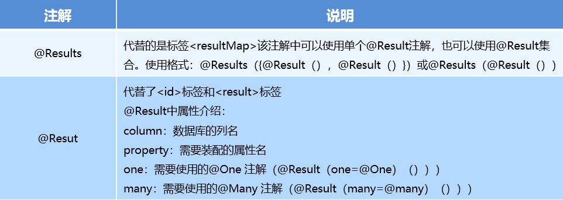

### 1.Mybatis多表查询

#### 1.1 一对一查询 

##### 1.1.1 一对一查询的模型`MapperScannerConfigurer`

用户表和订单表的关系为，一个用户有多个订单，一个订单只从属于一个用户
一对一查询的需求：查询一个订单，与此同时查询出该订单所属的用户


##### 1.1.2一对一查询的语句

对应的sql语句`select *  from orders o,user u where o.uid=u.id;`

查询的结果如下：


##### 1.1.3 创建Order和User实体

```java
public class Order {

    private int id;
    private Date ordertime;
    private double total;

    //代表当前订单从属于哪一个客户
    private User user;
}

public class User {
    
    private int id;
    private String username;
    private String password;
    private Date birthday;

}
```

##### 1.1.4 创建OrderMapper接口

```java
public interface OrderMapper {

    //查询全部的方法
    public List<Order> findAll();

}
```

##### 1.1.5 配置OrderMapper.xml

```xml
<?xml version="1.0" encoding="UTF-8" ?>
<!DOCTYPE mapper PUBLIC "-//mybatis.org//DTD Mapper 3.0//EN" "http://mybatis.org/dtd/mybatis-3-mapper.dtd">
<mapper namespace="tk.deriwotua.multi.mapper.OrderMapper">

    <resultMap id="orderMap" type="tk.deriwotua.multi.domain.Order">
        <!--手动指定字段与实体属性的映射关系
            column: 数据表的字段名称
            property：实体的属性名称
        -->
        <result column="uid" property="user.id"></result>
        <result column="username" property="user.username"></result>
        <result column="password" property="user.password"></result>
        <result column="birthday" property="user.birthday"></result>
    </resultMap>
    <select id="findAll" resultMap="orderMap">
        select * from orders o,user u where o.uid=u.id
    </select>
</mapper>
```

其中<resultMap>还可以配置如下：

```xml
<?xml version="1.0" encoding="UTF-8" ?>
<!DOCTYPE mapper PUBLIC "-//mybatis.org//DTD Mapper 3.0//EN" "http://mybatis.org/dtd/mybatis-3-mapper.dtd">
<mapper namespace="tk.deriwotua.multi.mapper.OrderMapper">

    <resultMap id="orderMap" type="tk.deriwotua.multi.domain.Order">
        <!--手动指定字段与实体属性的映射关系
            column: 数据表的字段名称
            property：实体的属性名称
        -->
        <id column="oid" property="id"></id>
        <result column="ordertime" property="ordertime"></result>
        <result column="total" property="total"></result>
        <!--<result column="uid" property="user.id"></result>
        <result column="username" property="user.username"></result>
        <result column="password" property="user.password"></result>
        <result column="birthday" property="user.birthday"></result>-->

        <!--
            property: 当前实体(order)中的属性名称(private User user)
            javaType: 当前实体(order)中的属性的类型(User)
        -->
        <association property="user" javaType="tk.deriwotua.multi.domain.User">
            <id column="uid" property="id"></id>
            <result column="username" property="username"></result>
            <result column="password" property="password"></result>
            <result column="birthday" property="birthday"></result>
        </association>

    </resultMap>

    <select id="findAll" resultMap="orderMap">
         SELECT *,o.id oid FROM orders o,USER u WHERE o.uid=u.id
    </select>

</mapper>
```

##### 1.1.6 测试结果

```java
@Test
public void test1() throws IOException {
    InputStream resourceAsStream = Resources.getResourceAsStream("multi/sqlMapConfig.xml");
    SqlSessionFactory sqlSessionFactory = new SqlSessionFactoryBuilder().build(resourceAsStream);
    SqlSession sqlSession = sqlSessionFactory.openSession();

    OrderMapper mapper = sqlSession.getMapper(OrderMapper.class);
    List<Order> orderList = mapper.findAll();
    for (Order order : orderList) {
        System.out.println(order);
    }

    sqlSession.close();
}
```


#### 1.2 一对多查询

##### 1.2.1 一对多查询的模型

用户表和订单表的关系为，一个用户有多个订单，一个订单只从属于一个用户

一对多查询的需求：查询一个用户，与此同时查询出该用户具有的订单

  

##### 1.2.2 一对多查询的语句

对应的sql语句：`select *,o.id oid from user u left join orders o on u.id=o.uid;`

查询的结果如下：


##### 1.2.3 修改User实体

```java
public class Order {

    private int id;
    private Date ordertime;
    private double total;

    //代表当前订单从属于哪一个客户
    private User user;
}

public class User {
    
    private int id;
    private String username;
    private String password;
    private Date birthday;
    //代表当前用户具备哪些订单
    private List<Order> orderList;
}

```

##### 1.2.4 创建UserMapper接口

```java
public interface UserMapper {

    public List<User> findAll();

}
```

##### 1.2.5 配置`UserMapper.xml`

```xml
<?xml version="1.0" encoding="UTF-8" ?>
<!DOCTYPE mapper PUBLIC "-//mybatis.org//DTD Mapper 3.0//EN" "http://mybatis.org/dtd/mybatis-3-mapper.dtd">
<mapper namespace="tk.deriwotua.multi.mapper.UserMapper">

    <resultMap id="userMap" type="tk.deriwotua.multi.domain.User">
        <id column="uid" property="id"></id>
        <result column="username" property="username"></result>
        <result column="password" property="password"></result>
        <result column="birthday" property="birthday"></result>
        <!--配置集合信息
            property:集合名称
            ofType：当前集合中的数据类型
        -->
        <collection property="orderList" ofType="tk.deriwotua.multi.domain.Role">
            <!--封装order的数据-->
            <id column="oid" property="id"></id>
            <result column="ordertime" property="ordertime"></result>
            <result column="total" property="total"></result>
        </collection>
    </resultMap>

    <select id="findAll" resultMap="userMap">
        SELECT *,o.id oid FROM USER u,orders o WHERE u.id=o.uid
    </select>
</mapper>
```

##### 1.2.6 测试结果

```java
@Test
public void test2() throws IOException {
    InputStream resourceAsStream = Resources.getResourceAsStream("multi/sqlMapConfig.xml");
    SqlSessionFactory sqlSessionFactory = new SqlSessionFactoryBuilder().build(resourceAsStream);
    SqlSession sqlSession = sqlSessionFactory.openSession();

    UserMapper mapper = sqlSession.getMapper(UserMapper.class);
    List<User> userList = mapper.findAll();
    for (User user : userList) {
        System.out.println(user);
    }

    sqlSession.close();
}
```


#### 1.3 多对多查询

##### 1.3.1 多对多查询的模型

用户表和角色表的关系为，一个用户有多个角色，一个角色被多个用户使用

多对多查询的需求：查询用户同时查询出该用户的所有角色


##### 1.3.2 多对多查询的语句

对应的sql语句
```sql
select u.*,r.*,r.id rid from user u 
left join user_role ur on u.id=ur.user_id
inner join role r on ur.role_id=r.id;
```

查询的结果如下：


##### 1.3.3 创建Role实体，修改User实体

```java
public class User {
    private int id;
    private String username;
    private String password;
    private Date birthday;
    //代表当前用户具备哪些订单
    private List<Order> orderList;
    //代表当前用户具备哪些角色
    private List<Role> roleList;
}

public class Role {

    private int id;
    private String rolename;

}

```

##### 1.3.4  添加UserMapper接口方法

```java
public interface UserMapper {

    public List<User> findAll();

    public List<User> findUserAndRoleAll();

}
```

##### 1.3.5 配置UserMapper.xml

```xml
<?xml version="1.0" encoding="UTF-8" ?>
<!DOCTYPE mapper PUBLIC "-//mybatis.org//DTD Mapper 3.0//EN" "http://mybatis.org/dtd/mybatis-3-mapper.dtd">
<mapper namespace="tk.deriwotua.multi.mapper.UserMapper">

    <resultMap id="userMap" type="tk.deriwotua.multi.domain.User">
        <id column="uid" property="id"></id>
        <result column="username" property="username"></result>
        <result column="password" property="password"></result>
        <result column="birthday" property="birthday"></result>
        <!--配置集合信息
            property:集合名称
            ofType：当前集合中的数据类型
        -->
        <collection property="orderList" ofType="tk.deriwotua.multi.domain.Role">
            <!--封装order的数据-->
            <id column="oid" property="id"></id>
            <result column="ordertime" property="ordertime"></result>
            <result column="total" property="total"></result>
        </collection>
    </resultMap>

    <select id="findAll" resultMap="userMap">
        SELECT *,o.id oid FROM USER u,orders o WHERE u.id=o.uid
    </select>

    <!--#############################################################################-->

    <resultMap id="userRoleMap" type="tk.deriwotua.multi.domain.User">
        <!--user的信息-->
        <id column="userId" property="id"></id>
        <result column="username" property="username"></result>
        <result column="password" property="password"></result>
        <result column="birthday" property="birthday"></result>
        <!--user内部的roleList信息-->
        <collection property="roleList" ofType="tk.deriwotua.multi.domain.Role">
            <id column="roleId" property="id"></id>
            <result column="roleName" property="roleName"></result>
            <result column="roleDesc" property="roleDesc"></result>
        </collection>
    </resultMap>

    <select id="findUserAndRoleAll" resultMap="userRoleMap">
        SELECT * FROM USER u,sys_user_role ur,sys_role r WHERE u.id=ur.userId AND ur.roleId=r.id
    </select>

</mapper>
```

##### 1.3.6 测试结果

```java
@Test
public void test3() throws IOException {
    InputStream resourceAsStream = Resources.getResourceAsStream("multi/sqlMapConfig.xml");
    SqlSessionFactory sqlSessionFactory = new SqlSessionFactoryBuilder().build(resourceAsStream);
    SqlSession sqlSession = sqlSessionFactory.openSession();

    UserMapper mapper = sqlSession.getMapper(UserMapper.class);
    List<User> userAndRoleAll = mapper.findUserAndRoleAll();
    for (User user : userAndRoleAll) {
        System.out.println(user);
    }

    sqlSession.close();
}
```


#### 1.4 知识小结

MyBatis多表配置方式
- **一对一配置：使用`<resultMap>`做配置**
- **一对多配置：使用`<resultMap>+<collection>`做配置**
- **多对多配置：使用`<resultMap>+<collection>`做配置**

### 2.Mybatis的注解开发

#### 2.1 MyBatis的常用注解 

这几年来注解开发越来越流行，Mybatis也可以使用注解开发方式，这样我们就可以减少编写Mapper映射文件了。先围绕一些基本的CRUD来学习，再学习复杂映射多表操作。
- `@Insert` 实现新增
- `@Update` 实现更新
- `@Delete` 实现删除
- `@Select` 实现查询
- `@Result` 实现结果集封装
- `@Results`可以与`@Result` 一起使用，封装多个结果集
- `@One`实现一对一结果集封装
- `@Many`实现一对多结果集封装

#### 2.2 MyBatis的增删改查 

简单的user表的增删改查的操作
- 编写持久层`UserMapper.java` 使用注解替代映射文件
  ```java
  package tk.deriwotua.annotation.mapper;
  
  import tk.deriwotua.annotation.domain.User;
  import org.apache.ibatis.annotations.*;
  
  import java.util.List;
  /**
   * 采用注解的方式实现基本的CRUD
   */
  public interface UserMapper {
  
      @Insert("insert into user values(#{id},#{username},#{password},#{birthday})")
      public void save(User user);
  
      @Update("update user set username=#{username},password=#{password} where id=#{id}")
      public void update(User user);
  
      @Delete("delete from user where id=#{id}")
      public void delete(int id);
  
      @Select("select * from user where id=#{id}")
      public User findById(int id);
  
      @Select("select * from user")
      public List<User> findAll();
  }
  ```
- mybatis核心配置文件`sqlMapConfig.xml`文件使用`mappers-package`标签配置加载使用注解的Mapper接口
  ```xml
  <?xml version="1.0" encoding="UTF-8" ?>
  <!DOCTYPE configuration PUBLIC "-//mybatis.org//DTD Config 3.0//EN" "http://mybatis.org/dtd/mybatis-3-config.dtd">
  <configuration>
  
      <!--通过properties标签加载外部properties文件-->
      <properties resource="jdbc.properties"></properties>
  
      <!--自定义别名-->
      <typeAliases>
          <typeAlias type="com.itheima.domain.User" alias="user"></typeAlias>
      </typeAliases>
  
  
      <!--数据源环境-->
      <environments default="development">
          <environment id="development">
              <transactionManager type="JDBC"></transactionManager>
              <dataSource type="POOLED">
                  <property name="driver" value="${jdbc.driver}"/>
                  <property name="url" value="${jdbc.url}"/>
                  <property name="username" value="${jdbc.username}"/>
                  <property name="password" value="${jdbc.password}"/>
              </dataSource>
          </environment>
      </environments>
  
    <!--加载映射关系-->
    <mappers>
        <!--使用注解替代映射文件在配置文件中需要指定持久层Mapper类全路径名即可-->
        <!--<mapper class="tk.deriwotua.annotation.mapper.UserMapper"></mapper>-->
        <!--持久层多单个配置不方便可直接指定接口所在的包-->
        <package name="tk.deriwotua.annotation.mapper"></package>
    </mappers>
  
  </configuration>
  ```
- 编写测试类
  ```java
  package tk.deriwotua.annotation;
  
  import tk.deriwotua.annotation.domain.User;
  import tk.deriwotua.annotation.mapper.UserMapper;
  import org.apache.ibatis.io.Resources;
  import org.apache.ibatis.session.SqlSession;
  import org.apache.ibatis.session.SqlSessionFactory;
  import org.apache.ibatis.session.SqlSessionFactoryBuilder;
  import org.junit.Before;
  import org.junit.Test;
  
  import java.io.IOException;
  import java.io.InputStream;
  import java.util.List;
  
  public class MyBatisTest {
  
      private UserMapper mapper;
  
      @Before
      public void before() throws IOException {
          InputStream resourceAsStream = Resources.getResourceAsStream("annotation/sqlMapConfig.xml");
          SqlSessionFactory sqlSessionFactory = new SqlSessionFactoryBuilder().build(resourceAsStream);
          SqlSession sqlSession = sqlSessionFactory.openSession(true);
          mapper = sqlSession.getMapper(UserMapper.class);
      }
  
      @Test
      public void testSave(){
          User user = new User();
          user.setUsername("tom");
          user.setPassword("abc");
          mapper.save(user);
      }
  
      @Test
      public void testUpdate(){
          User user = new User();
          user.setId(18);
          user.setUsername("lucy");
          user.setPassword("123");
          mapper.update(user);
      }
  
      @Test
      public void testDelete(){
          mapper.delete(18);
      }
  
      @Test
      public void testFindById(){
          User user = mapper.findById(2);
          System.out.println(user);
      }
  
      @Test
      public void testFindAll(){
          List<User> all = mapper.findAll();
          for (User user : all) {
              System.out.println(user);
          }
      }
  }
  ```

#### 2.3 MyBatis的注解实现复杂映射开发

实现复杂关系映射之前我们可以在映射文件中通过配置`<resultMap>`来实现，使用注解开发后，可以使用`@Results`注解，`@Result`注解，`@One`注解，`@Many`注解组合完成复杂关系的配置




#### 2.4 一对一查询
##### 2.4.1 一对一查询的模型

用户表和订单表的关系为，一个用户有多个订单，一个订单只从属于一个用户

一对一查询的需求：查询一个订单，与此同时查询出该订单所属的用户


##### 2.4.2 一对一查询的语句

对应的sql语句
```sql
select * from orders user;
```

查询的结果如下：


##### 2.4.3 创建Order和User实体

```java
public class Order {

    private int id;
    private Date ordertime;
    private double total;

    //代表当前订单从属于哪一个客户
    private User user;
}

public class User {
    
    private int id;
    private String username;
    private String password;
    private Date birthday;

}
```

##### 2.4.4 创建OrderMapper接口

```java
public interface OrderMapper {
    List<Order> findAll();
}
```

##### 2.4.5 使用注解配置Mapper

```java
public interface OrderMapper {
    @Select("select * from orders")
    @Results({
            @Result(column = "id",property = "id"),
            @Result(column = "ordertime",property = "ordertime"),
            @Result(column = "total",property = "total"),
            @Result(
                    property = "user", //要封装的属性名称
                    column = "uid", //根据那个字段去查询user表的数据
                    javaType = User.class, //要封装的实体类型
                    //select属性 代表查询那个接口的方法获得数据
                    one = @One(select = "tk.deriwotua.annotation.mapper.UserMapper.findById")
            )
    })
    public List<Order> findAll();
}

public interface UserMapper {

    @Select("select * from user where id=#{id}")
    User findById(int id);
    
}
```

##### 2.4.6 测试结果

```java
package tk.deriwotua.annotation;

import org.apache.ibatis.io.Resources;
import org.apache.ibatis.session.SqlSession;
import org.apache.ibatis.session.SqlSessionFactory;
import org.apache.ibatis.session.SqlSessionFactoryBuilder;
import org.junit.Before;
import org.junit.Test;
import tk.deriwotua.annotation.domain.Order;
import tk.deriwotua.annotation.mapper.OrderMapper;

import java.io.IOException;
import java.io.InputStream;
import java.util.List;

public class MyBatisTest2 {

    private OrderMapper mapper;

    @Before
    public void before() throws IOException {
        InputStream resourceAsStream = Resources.getResourceAsStream("annotation/sqlMapConfig.xml");
        SqlSessionFactory sqlSessionFactory = new SqlSessionFactoryBuilder().build(resourceAsStream);
        SqlSession sqlSession = sqlSessionFactory.openSession(true);
        mapper = sqlSession.getMapper(OrderMapper.class);
    }

    @Test
    public void testSave(){
        List<Order> all = mapper.findAll();
        for (Order order : all) {
            System.out.println(order);
        }
    }

}
```


#### 2.5 一对多查询

##### 2.5.1 一对多查询的模型

用户表和订单表的关系为，一个用户有多个订单，一个订单只从属于一个用户

一对多查询的需求：查询一个用户，与此同时查询出该用户具有的订单


##### 2.5.2 一对多查询的语句

对应的sql语句：
```sql
select * from user;
select * from orders where uid=查询出用户的id;
```

查询的结果如下


##### 2.5.3 修改User实体

```java
public class Order {

    private int id;
    private Date ordertime;
    private double total;

    //代表当前订单从属于哪一个客户
    private User user;
}

public class User {
    
    private int id;
    private String username;
    private String password;
    private Date birthday;
    //代表当前用户具备哪些订单
    private List<Order> orderList;
}
```

##### 2.5.4 创建UserMapper接口

```java
List<User> findAllUserAndOrder();
```

##### 2.5.5 使用注解配置Mapper

```java
public interface UserMapper {
    @Select("select * from user")
    @Results({
            @Result(id=true ,column = "id",property = "id"),
            @Result(column = "username",property = "username"),
            @Result(column = "password",property = "password"),
            @Result(
                    property = "orderList",
                    column = "id",
                    javaType = List.class,
                    many = @Many(select = "tk.deriwotua.annotation.mapper.OrderMapper.findByUid")
            )
    })
    public List<User> findUserAndOrderAll();
}

public interface OrderMapper {
    @Select("select * from orders where uid=#{uid}")
    List<Order> findByUid(int uid);

}
```

##### 2.5.6 测试结果

```java
package tk.deriwotua.annotation;

import org.apache.ibatis.io.Resources;
import org.apache.ibatis.session.SqlSession;
import org.apache.ibatis.session.SqlSessionFactory;
import org.apache.ibatis.session.SqlSessionFactoryBuilder;
import org.junit.Before;
import org.junit.Test;
import tk.deriwotua.annotation.domain.User;
import tk.deriwotua.annotation.mapper.UserMapper;

import java.io.IOException;
import java.io.InputStream;
import java.util.List;

public class MyBatisTest3 {

    private UserMapper mapper;

    @Before
    public void before() throws IOException {
        InputStream resourceAsStream = Resources.getResourceAsStream("annotation/sqlMapConfig.xml");
        SqlSessionFactory sqlSessionFactory = new SqlSessionFactoryBuilder().build(resourceAsStream);
        SqlSession sqlSession = sqlSessionFactory.openSession(true);
        mapper = sqlSession.getMapper(UserMapper.class);
    }

    @Test
    public void testSave(){
        List<User> userAndOrderAll = mapper.findUserAndOrderAll();
        for(User user : userAndOrderAll){
            System.out.println(user.getUsername());
            List<Order> orderList = user.getOrderList();
            for(Order order : orderList){
                System.out.println(order);
            }
            System.out.println("-----------------------------");
        }
    }
}
```


#### 2.6 多对多查询

##### 2.6.1 多对多查询的模型

用户表和角色表的关系为，一个用户有多个角色，一个角色被多个用户使用

多对多查询的需求：查询用户同时查询出该用户的所有角色


##### 2.6.2 多对多查询的语句

对应的sql语句：
```sql
select * from user;
select * from role r,user_role ur where r.id=ur.role_id and ur.user_id=用户的id
```

查询的结果如下：


##### 2.6.3 创建Role实体，修改User实体

```java
public class User {
    private int id;
    private String username;
    private String password;
    private Date birthday;
    //代表当前用户具备哪些订单
    private List<Order> orderList;
    //代表当前用户具备哪些角色
    private List<Role> roleList;
}

public class Role {

    private int id;
    private String rolename;

}
```

##### 2.6.4 添加UserMapper接口方法

```java
List<User> findAllUserAndRole();
```

##### 2.6.5 使用注解配置Mapper

```java
public interface UserMapper {
    @Select("SELECT * FROM USER")
    @Results({
            @Result(id = true,column = "id",property = "id"),
            @Result(column = "username",property = "username"),
            @Result(column = "password",property = "password"),
            @Result(
                    property = "roleList",
                    column = "id",
                    javaType = List.class,
                    many = @Many(select = "tk.deriwotua.annotation.mapper.RoleMapper.findByUid")
            )
    })
    public List<User> findUserAndRoleAll();
}

public interface RoleMapper {
    @Select("select * from role r,user_role ur where r.id=ur.role_id and ur.user_id=#{uid}")
    List<Role> findByUid(int uid);
}
```

##### 2.6.6 测试结果

```java
package tk.deriwotua.annotation;

import tk.deriwotua.annotation.domain.User;
import tk.deriwotua.annotation.mapper.UserMapper;
import org.apache.ibatis.io.Resources;
import org.apache.ibatis.session.SqlSession;
import org.apache.ibatis.session.SqlSessionFactory;
import org.apache.ibatis.session.SqlSessionFactoryBuilder;
import org.junit.Before;
import org.junit.Test;

import java.io.IOException;
import java.io.InputStream;
import java.util.List;

public class MyBatisTest4 {

    private UserMapper mapper;

    @Before
    public void before() throws IOException {
        InputStream resourceAsStream = Resources.getResourceAsStream("annotation/sqlMapConfig.xml");
        SqlSessionFactory sqlSessionFactory = new SqlSessionFactoryBuilder().build(resourceAsStream);
        SqlSession sqlSession = sqlSessionFactory.openSession(true);
        mapper = sqlSession.getMapper(UserMapper.class);
    }

    @Test
    public void testSave(){
        List<User> userAndRoleAll = mapper.findUserAndRoleAll();
        for(User user : userAndRoleAll){
            System.out.println(user.getUsername());
            List<Role> roleList = user.getRoleList();
            for(Role role : roleList){
                System.out.println(role);
            }
            System.out.println("----------------------------------");
        }
    }
}
```


