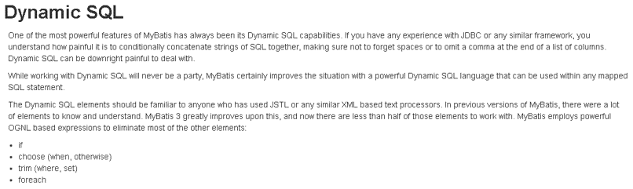

### 1.Mybatis的Dao层实现

#### 1.1 传统开发方式

##### 1.1.1编写UserDao接口

```java
public interface UserDao {
    List<User> findAll() throws IOException;
}
```

##### 1.1.2.编写UserDaoImpl实现

```java
public class UserDaoImpl implements UserDao {
    public List<User> findAll() throws IOException {
        InputStream resourceAsStream = Resources.getResourceAsStream("SqlMapConfig.xml");
        SqlSessionFactory sqlSessionFactory = new SqlSessionFactoryBuilder().build(resourceAsStream);
        SqlSession sqlSession = sqlSessionFactory.openSession();
        List<User> userList = sqlSession.selectList("userMapper.findAll");
        sqlSession.close();
        return userList;
    }
}
```

##### 1.1.3 测试传统方式

```java
@Test
public void testTraditionDao() throws IOException {
    UserDao userDao = new UserDaoImpl();
    List<User> all = userDao.findAll();
    System.out.println(all);
}
```

#### 1.2 代理开发方式

##### 1.2.1 代理开发方式介绍

采用 Mybatis 的代理开发方式实现 DAO 层的开发，这种方式是我们后面进入企业的主流。
Mapper 接口开发方法只需要程序员编写Mapper 接口（相当于Dao 接口），由Mybatis 框架根据接口定义创建接口的动态代理对象，代理对象的方法体同上边Dao接口实现类方法。

Mapper 接口开发需要遵循以下规范
- **`Mapper.xml`文件中的`namespace`与`mapper`接口的全限定名相同**
- **`Mapper`接口方法名和`Mapper.xml`中定义的每个`statement`的`id`相同**
- **`Mapper`接口方法的输入参数类型和`mapper.xml`中定义的每个sql的`parameterType`的类型相同**
- **`Mapper`接口方法的输出参数类型和`mapper.xml`中定义的每个sql的`resultType`的类型相同**

##### 1.2.2 编写UserMapper接口


##### 1.2.3测试代理方式

```java
@Test
public void testProxyDao() throws IOException {
    InputStream resourceAsStream = Resources.getResourceAsStream("SqlMapConfig.xml");
    SqlSessionFactory sqlSessionFactory = new SqlSessionFactoryBuilder().build(resourceAsStream);
    SqlSession sqlSession = sqlSessionFactory.openSession();
    //获得MyBatis框架生成的UserMapper接口的实现类
    UserMapper userMapper = sqlSession.getMapper(UserMapper.class);
    User user = userMapper.findById(1);
    System.out.println(user);
    sqlSession.close();
}
```

#### 1.3 知识小结

MyBatis的Dao层实现的两种方式：
- 手动对Dao进行实现：传统开发方式
- **代理方式对Dao进行实现：** `UserMapper userMapper = sqlSession.getMapper(UserMapper.class);`

### 2.MyBatis映射文件深入

#### 2.1 动态sql语句

##### 2.1.1动态sql语句概述

Mybatis 的映射文件中，前面我们的 SQL 都是比较简单的，有些时候业务逻辑复杂时，我们的 SQL是动态变化的，此时在前面的学习中我们的 SQL 就不能满足要求了。

参考的官方文档，描述如下：



##### 2.1.2动态 SQL  之<**if>** 

我们根据实体类的不同取值，使用不同的 SQL语句来进行查询。比如在 id如果不为空时可以根据id查询，如果username 不同空时还要加入用户名作为条件。这种情况在我们的多条件组合查询中经常会碰到。

```xml
<select id="findByCondition" parameterType="user" resultType="user">
    select * from User
    <where>
        <if test="id!=0">
            and id=#{id}
        </if>
        <if test="username!=null">
            and username=#{username}
        </if>
    </where>
</select>
```

```java
package tk.deriwotua.mapper.mapper;

import tk.deriwotua.mapper.domain.User;

import java.util.List;

public interface UserMapper {

    public List<User> findByCondition(User user);

    public List<User> findByIds(List<Integer> ids);

}
```

当查询条件id和username都存在时，控制台打印的sql语句如下：
```java
@Test
public void test1() throws IOException {
    InputStream resourceAsStream = Resources.getResourceAsStream("mapper/sqlMapConfig.xml");
    SqlSessionFactory sqlSessionFactory = new SqlSessionFactoryBuilder().build(resourceAsStream);
    SqlSession sqlSession = sqlSessionFactory.openSession();

    UserMapper mapper = sqlSession.getMapper(UserMapper.class);

    //模拟条件user
    User condition = new User();
    condition.setId(1);
    condition.setUsername("zhangsan");
    condition.setPassword("123");

    List<User> userList = mapper.findByCondition(condition);
    System.out.println(userList);
}
```


当查询条件只有id存在时，控制台打印的sql语句如下：

```java
@Test
public void test1() throws IOException {
    InputStream resourceAsStream = Resources.getResourceAsStream("mapper/sqlMapConfig.xml");
    SqlSessionFactory sqlSessionFactory = new SqlSessionFactoryBuilder().build(resourceAsStream);
    SqlSession sqlSession = sqlSessionFactory.openSession();

    UserMapper mapper = sqlSession.getMapper(UserMapper.class);
    User condition = new User();
    condition.setId(1);
    List<User> userList = mapper.findByIds(ids);
    System.out.println(userList);
}
```


##### 2.1.3 动态 SQL  之<**foreach>** 

循环执行sql的拼接操作，例如：`SELECT * FROM USER WHERE id IN (1,2,5)`。

 ```xml
<select id="findByIdArrays" parameterType="list" resultType="user">
    select * from User
    <where>
        <foreach collection="array" open="id in(" close=")" item="id" separator=",">
            #{id}
        </foreach>
    </where>
</select>

<select id="findByIds" parameterType="list" resultType="user">
    <include refid="selectUser"></include>
    <where>
        <foreach collection="list" open="id in(" close=")" item="id" separator=",">
            #{id}
        </foreach>
    </where>
</select>
 ```

测试代码片段如下：

```java
@Test
public void test1() throws IOException {
    InputStream resourceAsStream = Resources.getResourceAsStream("mapper/sqlMapConfig.xml");
    SqlSessionFactory sqlSessionFactory = new SqlSessionFactoryBuilder().build(resourceAsStream);
    SqlSession sqlSession = sqlSessionFactory.openSession();

    //获得MyBatis框架生成的UserMapper接口的实现类
    UserMapper userMapper = sqlSession.getMapper(UserMapper.class);
    int[] ids = new int[]{2,5};
    List<User> userList = userMapper.findByIdArrays(ids);
    System.out.println(userList);

    //模拟ids的数据
    List<Integer> ids = new ArrayList<Integer>();
    ids.add(1);
    ids.add(2);
    userList = mapper.findByIds(ids);
    System.out.println(userList);
}
```


`foreach`标签用于遍历集合
- `collection`：代表要遍历的集合元素，注意编写时不要写#{}
- `open`：代表语句的开始部分
- `close`：代表结束部分
- `item`：代表遍历集合的每个元素，生成的变量名
- `sperator`：代表分隔符

#### 2.2 SQL片段抽取

Sql 中可将重复的 sql 提取出来，使用时用 `include` 引用即可，最终达到 sql 重用的目的

```xml
<?xml version="1.0" encoding="UTF-8" ?>
<!DOCTYPE mapper PUBLIC "-//mybatis.org//DTD Mapper 3.0//EN" "http://mybatis.org/dtd/mybatis-3-mapper.dtd">
<mapper namespace="tk.deriwotua.mapper.mapper.UserMapper">

    <!--sql语句抽取-->
    <sql id="selectUser">select * from user</sql>

    <select id="findByCondition" parameterType="user" resultType="user">
        <include refid="selectUser"></include>
        <where>
            <if test="id!=0">
                and id=#{id}
            </if>
            <if test="username!=null">
                and username=#{username}
            </if>
            <if test="password!=null">
                and password=#{password}
            </if>
        </where>
    </select>

    <select id="findById" parameterType="int" resultType="user">
        <include refid="selectUser"></include> where id=#{id}
    </select>

    <select id="findByIdArrays" parameterType="list" resultType="user">
        <include refid="selectUser"></include>
        <where>
            <foreach collection="array" open="id in(" close=")" item="id" separator=",">
                #{id}
            </foreach>
        </where>
    </select>

    <select id="findByIds" parameterType="list" resultType="user">
        <include refid="selectUser"></include>
        <where>
            <foreach collection="list" open="id in(" close=")" item="id" separator=",">
                #{id}
            </foreach>
        </where>
    </select>

</mapper>
```

#### 2.3 知识小结

MyBatis映射文件配置
- `<select>`：查询
- `<insert>`：插入
- `<update>`：修改
- `<delete>`：删除
- `<where>`：where条件
- `<if>`：if判断
- `<foreach>`：循环
- `<sql>`：sql片段抽取

### 3. MyBatis核心配置文件深入
#### 3.1`typeHandlers`标签

无论是 MyBatis 在预处理语句`PreparedStatement`中设置一个参数时，还是从结果集中取出一个值时， 都会用类型处理器将获取的值以合适的方式转换成 Java 类型。下表描述了一些默认的类型处理器（截取部分）。

 

你可以重写类型处理器或创建你自己的类型处理器来处理不支持的或非标准的类型。具体做法为：实现 `org.apache.ibatis.type.TypeHandler` 接口， 或继承一个很便利的类 `org.apache.ibatis
.type.BaseTypeHandler`， 然后可以选择性地将它映射到一个JDBC类型。例如需求：一个Java中的Date数据类型，将之存到数据库的时候存成一个1970年至今的毫秒数，取出来时转换成java的Date，即**java的Date与数据库的varchar毫秒值之间转换**

开发步骤：
- 定义转换类继承类`BaseTypeHandler<T>`
- 覆盖4个未实现的方法，其中`org.apache.ibatis.type.BaseTypeHandler.setNonNullParameter(java.sql.PreparedStatement, int, T, org.apache.ibatis.type.JdbcType)`为java程序设置数据到数据库的回调方法，`org.apache.ibatis.type.BaseTypeHandler.getNullableResult(java.sql.ResultSet, java.lang.String)`为查询时 mysql的字符串类型转换成 java的Type类型的方法
- 在MyBatis核心配置文件中进行注册

测试转换是否正确
```java
package tk.deriwotua.config.handler;

import org.apache.ibatis.type.BaseTypeHandler;
import org.apache.ibatis.type.JdbcType;

import java.sql.CallableStatement;
import java.sql.PreparedStatement;
import java.sql.ResultSet;
import java.sql.SQLException;
import java.util.Date;

public class DateTypeHandler extends BaseTypeHandler<Date> {
    //将java类型 转换成 数据库需要的类型
    public void setNonNullParameter(PreparedStatement preparedStatement, int i, Date date, JdbcType jdbcType) throws SQLException {
        long time = date.getTime();
        preparedStatement.setLong(i,time);
    }

    /**
     * 将数据库中类型 转换成java类型
     * @param resultSet 查询出的结果集
     * @param s 要转换的字段名称
     * @return Date
     * @throws SQLException
     */
    public Date getNullableResult(ResultSet resultSet, String s) throws SQLException {
        //获得结果集中需要的数据(long) 转换成Date类型 返回
        long aLong = resultSet.getLong(s);
        Date date = new Date(aLong);
        return date;
    }

    //将数据库中类型 转换成java类型
    public Date getNullableResult(ResultSet resultSet, int i) throws SQLException {
        /*long aLong = resultSet.getLong(i);
        Date date = new Date(aLong);
        return date;*/

        return new Date(resultSet.getLong(i));
    }

    //将数据库中类型 转换成java类型
    public Date getNullableResult(CallableStatement callableStatement, int i) throws SQLException {
        /*long aLong = callableStatement.getLong(i);
        Date date = new Date(aLong);
        return date;*/

        return callableStatement.getDate(i);
    }
}
```
mybatis核心配置文件中注册类型处理器
```xml
<?xml version="1.0" encoding="UTF-8" ?>
<!DOCTYPE configuration PUBLIC "-//mybatis.org//DTD Config 3.0//EN" "http://mybatis.org/dtd/mybatis-3-config.dtd">
<configuration>

    <!--通过properties标签加载外部properties文件-->
    <properties resource="jdbc.properties"></properties>

    <!--自定义别名-->
    <typeAliases>
        <typeAlias type="tk.deriwotua.config.domain.User" alias="user"></typeAlias>
    </typeAliases>

    <!--注册类型处理器-->
    <typeHandlers>
        <typeHandler handler="tk.deriwotua.config.handler.DateTypeHandler"></typeHandler>
    </typeHandlers>

    <!--数据源环境-->
    <environments default="development">
        <environment id="development">
            <transactionManager type="JDBC"></transactionManager>
            <dataSource type="POOLED">
                <property name="driver" value="${jdbc.driver}"/>
                <property name="url" value="${jdbc.url}"/>
                <property name="username" value="${jdbc.username}"/>
                <property name="password" value="${jdbc.password}"/>
            </dataSource>
        </environment>
    </environments>
    
    <!--加载映射文件-->
    <mappers>
        <mapper resource="config/tk/deriwotua/mapper/UserMapper.xml"></mapper>
    </mappers>

</configuration>
```

测试添加操作：

```java
@Test
public void test1() throws IOException {
    InputStream resourceAsStream = Resources.getResourceAsStream("config/sqlMapConfig.xml");
    SqlSessionFactory sqlSessionFactory = new SqlSessionFactoryBuilder().build(resourceAsStream);
    SqlSession sqlSession = sqlSessionFactory.openSession();
    UserMapper mapper = sqlSession.getMapper(UserMapper.class);

    //创建user
    User user = new User();
    user.setUsername("ceshi");
    user.setPassword("abc");
    user.setBirthday(new Date()); //Date 到 varchar
    //执行保存操作
    mapper.save(user);

    sqlSession.commit();
    sqlSession.close();
}

@Test
public void test2() throws IOException {
    InputStream resourceAsStream = Resources.getResourceAsStream("config/sqlMapConfig.xml");
    SqlSessionFactory sqlSessionFactory = new SqlSessionFactoryBuilder().build(resourceAsStream);
    SqlSession sqlSession = sqlSessionFactory.openSession();
    UserMapper mapper = sqlSession.getMapper(UserMapper.class);

    User user = mapper.findById(15);
    System.out.println("user中的birthday："+user.getBirthday());

    sqlSession.commit();
    sqlSession.close();
}
```

数据库数据


测试查询操作


#### 3.2 plugins标签

MyBatis可以使用第三方的插件来对功能进行扩展，分页助手`PageHelper`是将分页的复杂操作进行封装，使用简单的方式即可获得分页的相关数据

开发步骤
- 导入通用PageHelper的坐标
- 在mybatis核心配置文件中配置PageHelper插件
- 测试分页数据获取

##### ①导入通用PageHelper坐标

```xml
<!-- 分页助手 -->
<dependency>
    <groupId>com.github.pagehelper</groupId>
    <artifactId>pagehelper</artifactId>
    <version>3.7.5</version>
</dependency>
<dependency>
    <groupId>com.github.jsqlparser</groupId>
    <artifactId>jsqlparser</artifactId>
    <version>0.9.1</version>
</dependency>
```

##### ②在mybatis核心配置文件中配置PageHelper插件

```xml
<?xml version="1.0" encoding="UTF-8" ?>
<!DOCTYPE configuration PUBLIC "-//mybatis.org//DTD Config 3.0//EN" "http://mybatis.org/dtd/mybatis-3-config.dtd">
<configuration>

    <!--通过properties标签加载外部properties文件-->
    <properties resource="jdbc.properties"></properties>

    <!--自定义别名-->
    <typeAliases>
        <typeAlias type="tk.deriwotua.config.domain.User" alias="user"></typeAlias>
    </typeAliases>

    <!--注册类型处理器-->
    <typeHandlers>
        <typeHandler handler="tk.deriwotua.config.handler.DateTypeHandler"></typeHandler>
    </typeHandlers>

    <!--配置分页助手插件-->
    <!-- 注意：分页助手的插件  配置在通用mapper之前 -->
    <plugins>
        <plugin interceptor="com.github.pagehelper.PageHelper">
            <property name="dialect" value="mysql"></property>
        </plugin>
    </plugins>

    <!--数据源环境-->
    <environments default="development">
        <environment id="development">
            <transactionManager type="JDBC"></transactionManager>
            <dataSource type="POOLED">
                <property name="driver" value="${jdbc.driver}"/>
                <property name="url" value="${jdbc.url}"/>
                <property name="username" value="${jdbc.username}"/>
                <property name="password" value="${jdbc.password}"/>
            </dataSource>
        </environment>
    </environments>

    <!--加载映射文件-->
    <mappers>
        <mapper resource="config/tk/deriwotua/mapper/UserMapper.xml"></mapper>
    </mappers>

</configuration>
```

##### ③测试分页代码实现

```java
@Test
public void test3() throws IOException {
    InputStream resourceAsStream = Resources.getResourceAsStream("config/sqlMapConfig.xml");
    SqlSessionFactory sqlSessionFactory = new SqlSessionFactoryBuilder().build(resourceAsStream);
    SqlSession sqlSession = sqlSessionFactory.openSession();
    UserMapper mapper = sqlSession.getMapper(UserMapper.class);

    //设置分页相关参数   当前页+每页显示的条数
    PageHelper.startPage(3,3);

    List<User> userList = mapper.findAll();
    for (User user : userList) {
        System.out.println(user);
    }
}
```

**获得分页相关的其他参数**

```java
@Test
public void test3() throws IOException {
    InputStream resourceAsStream = Resources.getResourceAsStream("config/sqlMapConfig.xml");
    SqlSessionFactory sqlSessionFactory = new SqlSessionFactoryBuilder().build(resourceAsStream);
    SqlSession sqlSession = sqlSessionFactory.openSession();
    UserMapper mapper = sqlSession.getMapper(UserMapper.class);

    //设置分页相关参数   当前页+每页显示的条数
    PageHelper.startPage(3,3);

    List<User> userList = mapper.findAll();
    for (User user : userList) {
        System.out.println(user);
    }

    //获得与分页相关参数
    PageInfo<User> pageInfo = new PageInfo<User>(userList);
    System.out.println("当前页："+pageInfo.getPageNum());
    System.out.println("每页显示条数："+pageInfo.getPageSize());
    System.out.println("总条数："+pageInfo.getTotal());
    System.out.println("总页数："+pageInfo.getPages());
    System.out.println("上一页："+pageInfo.getPrePage());
    System.out.println("下一页："+pageInfo.getNextPage());
    System.out.println("是否是第一个："+pageInfo.isIsFirstPage());
    System.out.println("是否是最后一个："+pageInfo.isIsLastPage());

    sqlSession.close();
}
```