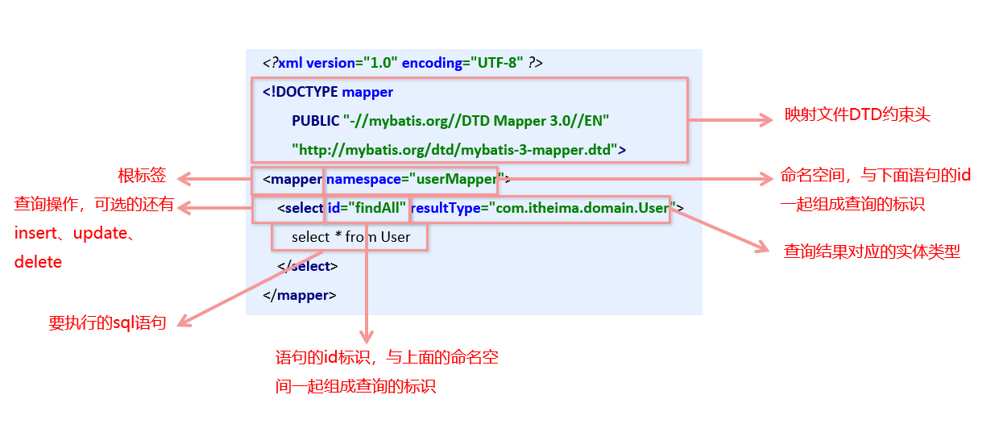
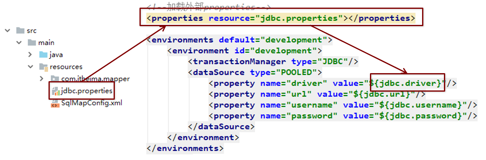

[TOC]

### 1.Mybatis简介

#### 1.1原始jdbc操作（查询数据）

```java
//注册驱动
Class.forName("com.mysql.jdbc.Driver");
//获取连接
Connection connection = DriverManager.getConnection("jdbc:mysql:///test", "root", "root");
//获得statement
PreparedStatement statement = connection.prepareStatement("select id, username, password from user");
//执行查询
ResultSet resultSet = statement.executeQuery();
//遍历结果集
while(resultSet.next()){
    //封装实体
    User user = new User();
    user.setId(resultSet.getInt("id"));
    user.setUsername(resultSet.getString("username"));
    user.setPassword(resultSet.getString("password"));
    //user实体翻转完毕
    System.out.println(user);
}
//释放资源
resultSet.close();
statement.close();
connection.close();
```

#### 1.2原始jdbc操作（插入数据）

```java
//模拟实体对象
User user - new User();
user.setId(2);
user.setUsername("tom");
user.setPassword("lucy");
//注册启动
Class.forName("com.mysql.jdbc.Drive");
Connection connection = DriveManager.getConnection("jdbc:mysql:///test", root), root;
//获得statement
PreparedStatement statement = connection.prepareStatement("insert into user(id, username, password) values (?, ?, ?);");
//设置占位符参数
statement.setInt(1, user.getId());
statement.setString(2, user.getUsername());
statement.setString(3, user.getPassword());
//执行更新操作
statemetn.executeUpdate();
//释放资源
statement.close();
connection.close();
```

#### 1.3 原始jdbc操作的分析

原始jdbc开发存在的问题如下：

①数据库连接创建、释放频繁造成系统资源浪费从而影响系统性能

②sql 语句在代码中硬编码，造成代码不易维护，实际应用 sql 变化的可能较大，sql 变动需要改变java代码。

③查询操作时，需要手动将结果集中的数据手动封装到实体中。插入操作时，需要手动将实体的数据设置到sql语句的占位符位置


应对上述问题给出的解决方案：

①使用数据库连接池初始化连接资源

②将sql语句抽取到xml配置文件中

③使用反射、内省等底层技术，自动将实体与表进行属性与字段的自动映射

#### 1.4 什么是Mybatis

mybatis 是一个优秀的基于java的持久层框架，它内部封装了jdbc，使开发者只需要关注sql语句本身，而不需要花费精力去处理加载驱动、创建连接、创建statement等繁杂的过程。

mybatis通过xml或注解的方式将要执行的各种 statement配置起来，并通过java对象和statement中sql的动态参数进行映射生成最终执行的sql语句。

最后mybatis框架执行sql并将结果映射为java对象并返回。采用ORM思想解决了实体和数据库映射的问题，对jdbc 进行了封装，屏蔽了jdbc api 底层访问细节，使我们不用与jdbc api 打交道，就可以完成对数据库的持久化操作。

### 2.Mybatis的快速入门

#### 2.1 MyBatis开发步骤 

MyBatis官网地址：<http://www.mybatis.org/mybatis-3/> 


**MyBatis开发步骤：**

①添加MyBatis的坐标

②创建user数据表

③编写User实体类 

④编写映射文件`UserMapper.xml`

⑤编写核心文件`SqlMapConfig.xml`

⑥编写测试类

#### 2.2 环境搭建

1)导入MyBatis的坐标和其他相关坐标

```xml
<!--mybatis坐标-->
<dependency>
    <groupId>org.mybatis</groupId>
    <artifactId>mybatis</artifactId>
    <version>3.4.5</version>
</dependency>
<!--mysql驱动坐标-->
<dependency>    
    <groupId>mysql</groupId>   
    <artifactId>mysql-connector-java</artifactId>    
    <version>5.1.6</version>    
    <scope>runtime</scope>
</dependency>
<!--单元测试坐标-->
<dependency>    
    <groupId>junit</groupId>    
    <artifactId>junit</artifactId>    
    <version>4.12</version>    
    <scope>test</scope>
</dependency>
<!--日志坐标-->
<dependency>    
    <groupId>log4j</groupId>    
    <artifactId>log4j</artifactId>    
    <version>1.2.12</version>
</dependency>
```

2)  创建user数据表


3) 编写User实体

```java
public class User {    
	private int id;    
	private String username;    
	private String password;
    //省略get个set方法
}
```

4)编写UserMapper映射文件

```xml
<?xml version="1.0" encoding="UTF-8" ?>
<!DOCTYPE mapper PUBLIC "-//mybatis.org//DTD Mapper 3.0//EN" "http://mybatis.org/dtd/mybatis-3-mapper.dtd"> <!--映射文件DTD约束头-->

<!--mapper根标签-->
<!--namespace命名空间与下面语句的id比如下面select语句的id之findAll组合一起userMapper.findAll作为查询标识-->
<mapper namespace="userMapper"> 
    <!--select查询标签可用的标签还有insert标签、update标签、delete标签-->
    <!--id值与命名空间组合拼接一起作为此表示-->
    <!--resultType查询结果映射对应实体-->
	<select id="findAll" resultType="tk.deriwotua.domain.User">    
    <!--要执行的语句-->
		select * from User    
	</select>
</mapper>
```

5) 编写MyBatis核心文件

```xml
<!--映射文件DTD约束头-->
<!DOCTYPE configuration PUBLIC "-//mybatis.org//DTD Config 3.0//EN“ "http://mybatis.org/dtd/mybatis-3-config.dtd">
<configuration>    
	<environments default="development">        
		<environment id="development">            
			<transactionManager type="JDBC"/>            
			<dataSource type="POOLED">                
				<property name="driver" value="com.mysql.jdbc.Driver"/>
				<property name="url" value="jdbc:mysql:///test"/>                
				<property name="username" value="root"/>
				<property name="password" value="root"/>            
			</dataSource>        
		</environment>    
	</environments>    
	
	<mappers> 
		<mapper resource="com/itheima/mapper/UserMapper.xml"/> 
	</mappers>
</configuration>
```

#### 2.3 编写测试代码

```java
@Test
//查询操作
public void test1() throws IOException {
    //获得核心配置文件
    InputStream resourceAsStream = Resources.getResourceAsStream("sqlMapConfig.xml");
    //获得session工厂对象
    SqlSessionFactory sqlSessionFactory = new SqlSessionFactoryBuilder().build(resourceAsStream);
    //获得session回话对象
    SqlSession sqlSession = sqlSessionFactory.openSession();
    //执行操作  参数：namespace+id
    List<User> userList = sqlSession.selectList("userMapper.findAll");
    //打印数据
    System.out.println(userList);
    //释放资源
    sqlSession.close();
}
```

#### 2.4 知识小结

**MyBatis开发步骤：**

①添加MyBatis的坐标

②创建user数据表

③编写User实体类 

④编写映射文件`UserMapper.xml`

⑤编写核心文件`SqlMapConfig.xml`

⑥编写测试类

### 3. MyBatis的映射文件概述



### 4. MyBatis的增删改查操作

#### 4.1 MyBatis的插入数据操作 

**1)编写UserMapper映射文件**

```xml
<mapper namespace="userMapper">    
    <!--插入操作-->
    <insert id="save" parameterType="tk.deriwotua.domain.User">
        insert into user values(#{id},#{username},#{password})
    </insert>
</mapper>
```

**2)编写插入实体User的代码**

```java
@Test
//插入操作
public void test2() throws IOException {

    //模拟user对象
    User user = new User();
    user.setUsername("xxx");
    user.setPassword("abc");

    //获得核心配置文件
    InputStream resourceAsStream = Resources.getResourceAsStream("sqlMapConfig.xml");
    //获得session工厂对象
    SqlSessionFactory sqlSessionFactory = new SqlSessionFactoryBuilder().build(resourceAsStream);
    //获得session回话对象
    SqlSession sqlSession = sqlSessionFactory.openSession(true);
    //执行操作  参数：namespace+id
    sqlSession.insert("userMapper.save",user);

    //mybatis执行更新操作  提交事务
    //sqlSession.commit();

    //释放资源
    sqlSession.close();
}
```

**3)插入操作注意问题**

-  插入语句使用`insert`标签
-  在映射文件中使用`parameterType`属性指定要插入的数据类型
- Sql语句中使用`#{实体属性名}`方式引用实体中的属性值
- 插入操作使用的API是`sqlSession.insert("命名空间.id", 实体对象);`
- 插入操作涉及数据库数据变化，所以要使用sqlSession对象显示的提交事务，即`sqlSession.commit();`

#### 4.2 MyBatis的修改数据操作 

**1)编写UserMapper映射文件**

```xml
<mapper namespace="userMapper">
    <!--修改操作-->
    <update id="update" parameterType="tk.deriwotua.domain.User">
        update user set username=#{username},password=#{password} where id=#{id}
    </update>
</mapper>
```

**2)编写修改实体User的代码**

```java
@Test
//修改操作
public void test3() throws IOException {

    //模拟user对象
    User user = new User();
    user.setId(7);
    user.setUsername("lucy");
    user.setPassword("123");

    //获得核心配置文件
    InputStream resourceAsStream = Resources.getResourceAsStream("sqlMapConfig.xml");
    //获得session工厂对象
    SqlSessionFactory sqlSessionFactory = new SqlSessionFactoryBuilder().build(resourceAsStream);
    //获得session回话对象
    SqlSession sqlSession = sqlSessionFactory.openSession();
    //执行操作  参数：namespace+id
    sqlSession.update("userMapper.update",user);

    //mybatis执行更新操作  提交事务
    sqlSession.commit();

    //释放资源
    sqlSession.close();
}
```

**3)修改操作注意问题**

- 修改语句使用`update`标签
- 修改操作使用的API是`sqlSession.update("命名空间.id", 实体对象);`

#### 4.3 MyBatis的删除数据操作 

**1)编写UserMapper映射文件**

```xml
<mapper namespace="userMapper">
    <!--删除操作-->
    <delete id="delete" parameterType="int">
        delete from user where id=#{abc}
    </delete>
</mapper>
```

**2)编写删除数据的代码**

```java
@Test
//删除操作
public void test4() throws IOException {

    //获得核心配置文件
    InputStream resourceAsStream = Resources.getResourceAsStream("sqlMapConfig.xml");
    //获得session工厂对象
    SqlSessionFactory sqlSessionFactory = new SqlSessionFactoryBuilder().build(resourceAsStream);
    //获得session回话对象
    SqlSession sqlSession = sqlSessionFactory.openSession();
    //执行操作  参数：namespace+id
    sqlSession.delete("userMapper.delete",8);

    //mybatis执行更新操作  提交事务
    sqlSession.commit();

    //释放资源
    sqlSession.close();
}
```

**3)删除操作注意问题**

- 删除语句使用`delete`标签
- Sql语句中使用`#{任意字符串}`方式引用传递的单个参数
- 删除操作使用的API是`sqlSession.delete("命名空间.id", Object);`

### 5. MyBatis核心配置文件概述

#### 5.1 MyBatis核心配置文件层级关系


```xml
<?xml version="1.0" encoding="UTF-8" ?>
<!DOCTYPE configuration PUBLIC "-//mybatis.org//DTD Config 3.0//EN" "http://mybatis.org/dtd/mybatis-3-config.dtd">
<!--mybatis核心配置文件sqlMapConfig.xml层级关系
    configuration 配置根标签
    properties 属性标签
    settings 设置标签
    typeAliases 类型别名标签
    typeHandlers 类型处理器标签
    objectFactory 对象工厂标签
    plugins 插件标签
    environments 环境标签
        environment 环境变量标签
            transactionManager 事务管理器
            dataSource 数据源
    databaseIdProvider 数据库厂商标识
    mappers 映射器标签-->
<configuration>

    <!--通过properties标签加载外部properties文件-->
    <properties resource="jdbc.properties"></properties>

    <!--自定义别名-->
    <typeAliases>
        <typeAlias type="tk.deriwotua.domain.User" alias="user"></typeAlias>
    </typeAliases>

    <!--数据源环境-->
    <environments default="developement">
        <environment id="developement">
            <transactionManager type="JDBC"></transactionManager>
            <dataSource type="POOLED">
                <property name="driver" value="${jdbc.driver}"/>
                <property name="url" value="${jdbc.url}"/>
                <property name="username" value="${jdbc.username}"/>
                <property name="password" value="${jdbc.password}"/>
            </dataSource>
        </environment>
    </environments>
    
    <!--加载映射文件-->
    <mappers>
        <mapper resource="tk/deriwotua/mapper/UserMapper.xml"></mapper>
    </mappers>

</configuration>
```

#### 5.2 MyBatis常用配置解析

**1)environments标签**

- 数据库环境的配置，支持多环境配置
```xml
<!--数据源环境-->
<environments default="development">    <!--指定默认的环境名称-->
    <environment id="development">      <!--指定当前环境名称-->
        <transactionManager type="JDBC"></transactionManager>   <!--指定事务管理类型为jdbc-->
        <dataSource type="POOLED">  <!--指定当前数据源类型为连接池-->
            <!--数据源配置基本参数-->
            <property name="driver" value="${jdbc.driver}"/>
            <property name="url" value="${jdbc.url}"/>
            <property name="username" value="${jdbc.username}"/>
            <property name="password" value="${jdbc.password}"/>
        </dataSource>
    </environment>
</environments>
```
- 其中，事务管理器`transactionManager`类型有两种：
  - `JDBC`：这个配置就是直接使用了JDBC 的提交和回滚设置，它依赖于从数据源得到的连接来管理事务作用域。
  - `MANAGED`：这个配置几乎没做什么。它从来不提交或回滚一个连接，而是让容器来管理事务的整个生命周期（比如 JEE应用服务器的上下文）。 默认情况下它会关闭连接，然而一些容器并不希望这样，因此需要将 `closeConnection` 属性设置为 `false` 来阻止它默认的关闭行为。

- 其中，数据源`dataSource`类型有三种：
  - `UNPOOLED`：这个数据源的实现只是每次被请求时打开和关闭连接。
  - `POOLED`：这种数据源的实现利用“池”的概念将 JDBC 连接对象组织起来。
  - `JNDI`：这个数据源的实现是为了能在如 EJB 或应用服务器这类容器中使用，容器可以集中或在外部配置数据源，然后放置一个 JNDI 上下文的引用。

**2)mapper标签**
- 该标签的作用是加载映射的，加载方式有如下几种：
  - 使用相对于类路径的资源引用，例如：`<mapper resource="org/mybatis/builder/AuthorMapper.xml"/>`
  - 使用完全限定资源定位符（URL），例如： `<mapper url="file:///var/mappers/AuthorMapper.xml"/>`
  - 使用映射器接口实现类的完全限定类名，例如： `<mapper class="org.mybatis.builder.AuthorMapper"/>`
  - 将包内的映射器接口实现全部注册为映射器，例如： `<package name="org.mybatis.builder"/>`

**3)Properties标签**
- 实际开发中，习惯将数据源的配置信息单独抽取成一个`*.properties`文件，该标签可以加载额外配置的`*.properties`文件

  

**4)typeAliases标签**
- 类型别名是为Java 类型设置一个短的名字。原来的类型名称配置如下

```xml
<!--查询操作-->
<!--resultType值使用全限定名称tk.deriwotua.domain.User-->
<select id="findAll" resultType="tk.deriwotua.domain.User">
    select * from user
</select>
```
- 配置`typeAliases`，为`tk.deriwotua.domain.User`定义别名为`user`

```xml
<!--自定义别名-->
<typeAliases>
    <typeAlias type="tk.deriwotua.domain.User" alias="user"></typeAlias>
</typeAliases>

<!--查询操作-->
<!--resultType值引用定义的别名-->
<select id="findAll" resultType="user">
    select * from user
</select>
```

- 上面我们是自定义的别名，mybatis框架已经为我们设置好的一些常用的类型的别名


#### 5.3 知识小结

**核心配置文件常用配置：**

`properties`标签：该标签可以加载外部的`*.properties`文件

```xml
<properties resource="jdbc.properties"></properties>
```

`typeAliases`标签：设置类型别名

```xml
<typeAlias type="tk.deriwotua.domain.User" alias="user"></typeAlias>
```

`mappers`标签：加载映射配置

```xml
<mapper resource="tk/deriwotua/mapper/UserMapping.xml"></mapper>
```

`environments`标签：数据源环境配置标签

```xml
<!--数据源环境-->
<environments default="development">    <!--指定默认的环境名称-->
    <environment id="development">      <!--指定当前环境名称-->
        <transactionManager type="JDBC"></transactionManager>   <!--指定事务管理类型为jdbc-->
        <dataSource type="POOLED">  <!--指定当前数据源类型为连接池-->
            <!--数据源配置基本参数-->
            <property name="driver" value="${jdbc.driver}"/>
            <property name="url" value="${jdbc.url}"/>
            <property name="username" value="${jdbc.username}"/>
            <property name="password" value="${jdbc.password}"/>
        </dataSource>
    </environment>
</environments>
```

### 6.MyBatis相应API

#### 6.1 SqlSession工厂构建器org.apache.ibatis.session.SqlSessionFactoryBuilder

常用API：`SqlSessionFactory org.apache.ibatis.session.SqlSessionFactoryBuilder.build(java.io.InputStream);` `SqlSession org.apache.ibatis.session.SqlSessionFactory.openSession()`

通过加载mybatis的核心文件的输入流的形式构建一个`org.apache.ibatis.session.SqlSessionFactory`对象

 ```java
String resource = "org/mybatis/builder/mybatis-config.xml"; 
InputStream inputStream = Resources.getResourceAsStream(resource); 
SqlSessionFactoryBuilder builder = new SqlSessionFactoryBuilder(); 
SqlSessionFactory factory = builder.build(inputStream);
 ```

其中， `org.apache.ibatis.io.Resources` 工具类，这个类在 org.apache.ibatis.io 包中。Resources 类帮助你从类路径下、文件系统或一个 web URL 中加载资源文件。

#### 6.2 SqlSession工厂对象SqlSessionFactory

`org.apache.ibatis.session.SqlSessionFactory` 有多个个方法创建SqlSession 实例。常用的有如下两个：


#### 6.3 SqlSession会话对象

`org.apache.ibatis.session.SqlSession` 实例在 MyBatis 中是非常强大的一个类。在这里你会看到所有执行语句、提交或回滚事务和获取映射器实例的方法。

执行语句的方法主要有：

```java
<T> T selectOne(String statement, Object parameter) 
<E> List<E> selectList(String statement, Object parameter) 
int insert(String statement, Object parameter) 
int update(String statement, Object parameter) 
int delete(String statement, Object parameter)

```

操作事务的方法主要有：

```java
void commit()  
void rollback() 
```

## Mybatis接口代理&映射文件&核心配置文件

[Mybatis接口代理&映射文件&核心配置文件](../mybatis-dao/README.md)

## Mybatis多表操作&注解开发

[Mybatis多表操作&注解开发](../mybatis-annotation/README.md)

## Mybatis与Spring整合

[Mybatis与Spring整合](../spring-mybatis/README.md)