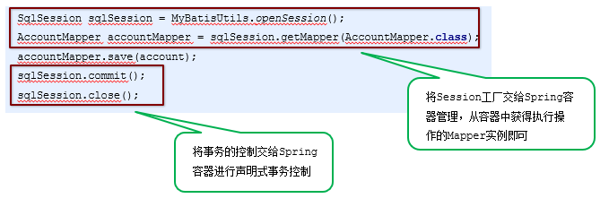

[TOC]

## Mybatis

[mybatis](../mybatis-quickstart/README.md)

## Mybatis接口代理&映射文件&核心配置文件

[Mybatis接口代理&映射文件&核心配置文件](../mybatis-dao/README.md)

## Mybatis多表操作&注解开发

[Mybatis多表操作&注解开发](../mybatis-annotation/README.md)

## Mybatis与Spring整合

[Mybatis与Spring整合](../spring-mybatis/README.md)


### SSM框架整合

#### 1.1 原始方式整合

##### 1.准备工作

```sql
/*
Navicat MySQL Data Transfer

Source Server         : mysql
Source Server Version : 50147
Source Host           : localhost:3306
Source Database       : test

Target Server Type    : MYSQL
Target Server Version : 50147
File Encoding         : 65001

Date: 2019-04-20 16:37:34
*/

SET FOREIGN_KEY_CHECKS=0;

-- ----------------------------
-- Table structure for orders
-- ----------------------------
DROP TABLE IF EXISTS `orders`;
CREATE TABLE `orders` (
  `id` int(11) NOT NULL AUTO_INCREMENT,
  `ordertime` varchar(255) DEFAULT NULL,
  `total` double DEFAULT NULL,
  `uid` int(11) DEFAULT NULL,
  PRIMARY KEY (`id`),
  KEY `uid` (`uid`),
  CONSTRAINT `orders_ibfk_1` FOREIGN KEY (`uid`) REFERENCES `user` (`id`)
) ENGINE=InnoDB AUTO_INCREMENT=4 DEFAULT CHARSET=utf8;

-- ----------------------------
-- Records of orders
-- ----------------------------
INSERT INTO `orders` VALUES ('1', '2018-12-12', '3000', '1');
INSERT INTO `orders` VALUES ('2', '2018-12-12', '4000', '1');
INSERT INTO `orders` VALUES ('3', '2018-12-12', '5000', '2');

-- ----------------------------
-- Table structure for sys_role
-- ----------------------------
DROP TABLE IF EXISTS `sys_role`;
CREATE TABLE `sys_role` (
  `id` int(11) NOT NULL AUTO_INCREMENT,
  `rolename` varchar(255) DEFAULT NULL,
  `roleDesc` varchar(255) DEFAULT NULL,
  PRIMARY KEY (`id`)
) ENGINE=InnoDB AUTO_INCREMENT=3 DEFAULT CHARSET=utf8;

-- ----------------------------
-- Records of sys_role
-- ----------------------------
INSERT INTO `sys_role` VALUES ('1', 'CTO', 'CTO');
INSERT INTO `sys_role` VALUES ('2', 'COO', 'COO');

-- ----------------------------
-- Table structure for sys_user_role
-- ----------------------------
DROP TABLE IF EXISTS `sys_user_role`;
CREATE TABLE `sys_user_role` (
  `userid` int(11) NOT NULL,
  `roleid` int(11) NOT NULL,
  PRIMARY KEY (`userid`,`roleid`),
  KEY `roleid` (`roleid`),
  CONSTRAINT `sys_user_role_ibfk_1` FOREIGN KEY (`userid`) REFERENCES `sys_role` (`id`),
  CONSTRAINT `sys_user_role_ibfk_2` FOREIGN KEY (`roleid`) REFERENCES `user` (`id`)
) ENGINE=InnoDB DEFAULT CHARSET=utf8;

-- ----------------------------
-- Records of sys_user_role
-- ----------------------------
INSERT INTO `sys_user_role` VALUES ('1', '1');
INSERT INTO `sys_user_role` VALUES ('2', '1');
INSERT INTO `sys_user_role` VALUES ('1', '2');
INSERT INTO `sys_user_role` VALUES ('2', '2');

-- ----------------------------
-- Table structure for user
-- ----------------------------
DROP TABLE IF EXISTS `user`;
CREATE TABLE `user` (
  `id` int(11) NOT NULL AUTO_INCREMENT,
  `username` varchar(50) DEFAULT NULL,
  `password` varchar(50) DEFAULT NULL,
  `birthday` varchar(50) DEFAULT NULL,
  PRIMARY KEY (`id`)
) ENGINE=InnoDB AUTO_INCREMENT=3 DEFAULT CHARSET=utf8;

-- ----------------------------
-- Records of user
-- ----------------------------
INSERT INTO `user` VALUES ('1', 'lucy', '123', '2018-12-12');
INSERT INTO `user` VALUES ('2', 'haohao', '123', '2019-12-12');
```

##### 2.创建Maven工程


##### 3.导入Maven坐标

```xml
<dependencies>
    <!--spring相关-->
    <dependency>
        <groupId>org.springframework</groupId>
        <artifactId>spring-context</artifactId>
        <version>5.0.5.RELEASE</version>
    </dependency>
    <dependency>
        <groupId>org.aspectj</groupId>
        <artifactId>aspectjweaver</artifactId>
        <version>1.8.7</version>
    </dependency>
    <dependency>
        <groupId>org.springframework</groupId>
        <artifactId>spring-jdbc</artifactId>
        <version>5.0.5.RELEASE</version>
    </dependency>
    <dependency>
        <groupId>org.springframework</groupId>
        <artifactId>spring-tx</artifactId>
        <version>5.0.5.RELEASE</version>
    </dependency>
    <dependency>
        <groupId>org.springframework</groupId>
        <artifactId>spring-test</artifactId>
        <version>5.0.5.RELEASE</version>
    </dependency>
    <dependency>
        <groupId>org.springframework</groupId>
        <artifactId>spring-webmvc</artifactId>
        <version>5.0.5.RELEASE</version>
    </dependency>

    <!--servlet和jsp-->
    <dependency>
        <groupId>javax.servlet</groupId>
        <artifactId>servlet-api</artifactId>
        <version>2.5</version>
    </dependency>
    <dependency>
        <groupId>javax.servlet.jsp</groupId>
        <artifactId>jsp-api</artifactId>
        <version>2.0</version>
    </dependency>

    <!--mybatis相关-->
    <dependency>
        <groupId>org.mybatis</groupId>
        <artifactId>mybatis</artifactId>
        <version>3.4.5</version>
    </dependency>
    <dependency>
        <groupId>org.mybatis</groupId>
        <artifactId>mybatis-spring</artifactId>
        <version>1.3.1</version>
    </dependency>
    <dependency>
        <groupId>mysql</groupId>
        <artifactId>mysql-connector-java</artifactId>
        <version>5.1.6</version>
    </dependency>
    <dependency>
        <groupId>c3p0</groupId>
        <artifactId>c3p0</artifactId>
        <version>0.9.1.2</version>
    </dependency>

    <dependency>
        <groupId>junit</groupId>
        <artifactId>junit</artifactId>
        <version>4.12</version>
    </dependency>
    <dependency>
        <groupId>jstl</groupId>
        <artifactId>jstl</artifactId>
        <version>1.2</version>
    </dependency>

</dependencies>
```

##### 4.编写实体类

```java
public class Account {
    private int id;
    private String name;
    private double money;
    //省略getter和setter方法
}
```

##### 5.编写Mapper接口

```java
public interface AccountMapper {
    //保存账户数据
    void save(Account account);
    //查询账户数据
    List<Account> findAll();
}
```

##### 6.编写Service接口

```java
public interface AccountService {
    void save(Account account); //保存账户数据
    List<Account> findAll(); //查询账户数据
}
```

##### 7.编写Service接口实现

```java
@Service("accountService")
public class AccountServiceImpl implements AccountService {
    public void save(Account account) {
        SqlSession sqlSession = MyBatisUtils.openSession();
        AccountMapper accountMapper = sqlSession.getMapper(AccountMapper.class);
        accountMapper.save(account);
        sqlSession.commit();
        sqlSession.close();
    }
    public List<Account> findAll() {
        SqlSession sqlSession = MyBatisUtils.openSession();
        AccountMapper accountMapper = sqlSession.getMapper(AccountMapper.class);
        return accountMapper.findAll();
    }
}
```

##### 8.编写Controller

```java
@Controller
public class AccountController {
    @Autowired
    private AccountService accountService;
    @RequestMapping("/save")
    @ResponseBody
    public String save(Account account){
        accountService.save(account);
        return "save success";
    }
    @RequestMapping("/findAll")
    public ModelAndView findAll(){
        ModelAndView modelAndView = new ModelAndView();
        modelAndView.setViewName("accountList");
        modelAndView.addObject("accountList",accountService.findAll());
        return modelAndView;
    }
}
```

##### 9.编写添加页面

```html
<%@ page contentType="text/html;charset=UTF-8" language="java" %>
<html>
<head>
    <title>Title</title>
</head>
<body>
    <h1>保存账户信息表单</h1>
    <form action="${pageContext.request.contextPath}/save.action" method="post">
        用户名称<input type="text" name="name"><br/>
        账户金额<input type="text" name="money"><br/>
        <input type="submit" value="保存"><br/>
    </form>
</body>
</html>
```

##### 10.编写列表页面

```html
<table border="1">
    <tr>
        <th>账户id</th>
        <th>账户名称</th>
        <th>账户金额</th>
    </tr>
    <c:forEach items="${accountList}" var="account">
        <tr>
            <td>${account.id}</td>
            <td>${account.name}</td>
            <td>${account.money}</td>
        </tr>
    </c:forEach>
</table>
```

##### 11.编写相应配置文件(文件参考目录：素材/配置文件)

Spring配置文件：[applicationContext.xml](src/main/resources/applicationContext.xml)
SprngMVC配置文件：[spring-mvc.xml](src/main/resources/spring-mvc.xml)
MyBatis映射文件：[AccountMapper.xml](src/main/resources/tk/deriwotua/mapper/AccountMapper.xml)
MyBatis核心文件：[sqlMapConfig.xml](src/main/resources/sqlMapConfig.xml)
数据库连接信息文件：[jdbc.properties](src/main/resources/jdbc.properties)
Web.xml文件：[web.xml](src/main/webapp/WEB-INF/web.xml)
日志文件：[log4j.properties](src/main/resources/log4j.properties)

##### 12.测试添加账户


##### 13.测试账户列表


#### 1.2 Spring整合MyBatis

##### 1.整合思路



##### 2.将SqlSessionFactory配置到Spring容器中

```xml
<!--加载jdbc.properties-->
<context:property-placeholder location="classpath:jdbc.properties"/>
<!--配置数据源-->
<bean id="dataSource" class="com.mchange.v2.c3p0.ComboPooledDataSource">
    <property name="driverClass" value="${jdbc.driver}"/>
    <property name="jdbcUrl" value="${jdbc.url}"/>
    <property name="user" value="${jdbc.username}"/>
    <property name="password" value="${jdbc.password}"/>
</bean>
<!--配置MyBatis的SqlSessionFactory-->
<bean id="sqlSessionFactory" class="org.mybatis.spring.SqlSessionFactoryBean">
    <property name="dataSource" ref="dataSource"/>
    <property name="configLocation" value="classpath:sqlMapConfig.xml"/>
</bean>
```

##### 3.扫描Mapper，让Spring容器产生Mapper实现类

```xml
<!--配置Mapper扫描-->
<bean class="org.mybatis.spring.mapper.MapperScannerConfigurer">
    <property name="basePackage" value="tk.deriwotua.mapper"/>
</bean>
```

##### 4.配置声明式事务控制

```xml
<!--配置声明式事务控制-->
<bean id="transacionManager" class="org.springframework.jdbc.datasource.DataSourceTransactionManager">
    <property name="dataSource" ref="dataSource"/>
</bean>
<tx:advice id="txAdvice" transaction-manager="transactionManager">
    <tx:attributes>
        <tx:method name="*"/>
    </tx:attributes>
</tx:advice>
<aop:config>
    <aop:pointcut id="txPointcut" expression="execution(* tk.deriwotua.service.impl.*.*(..))"/>
    <aop:advisor advice-ref="txAdvice" pointcut-ref="txPointcut"/>
</aop:config>
```

##### 5.修改Service实现类代码

```java
@Service("accountService")
public class AccountServiceImpl implements AccountService {

    @Autowired
    private AccountMapper accountMapper;

    public void save(Account account) {
        accountMapper.save(account);
    }
    public List<Account> findAll() {
        return accountMapper.findAll();
    }
}
```