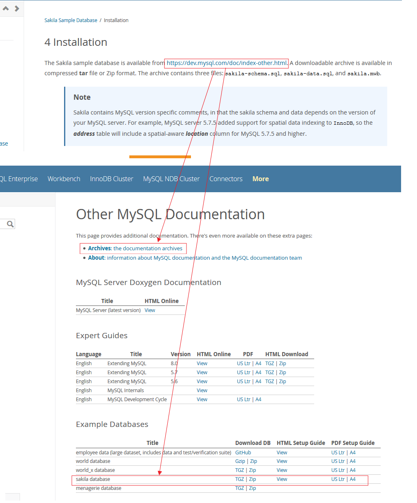
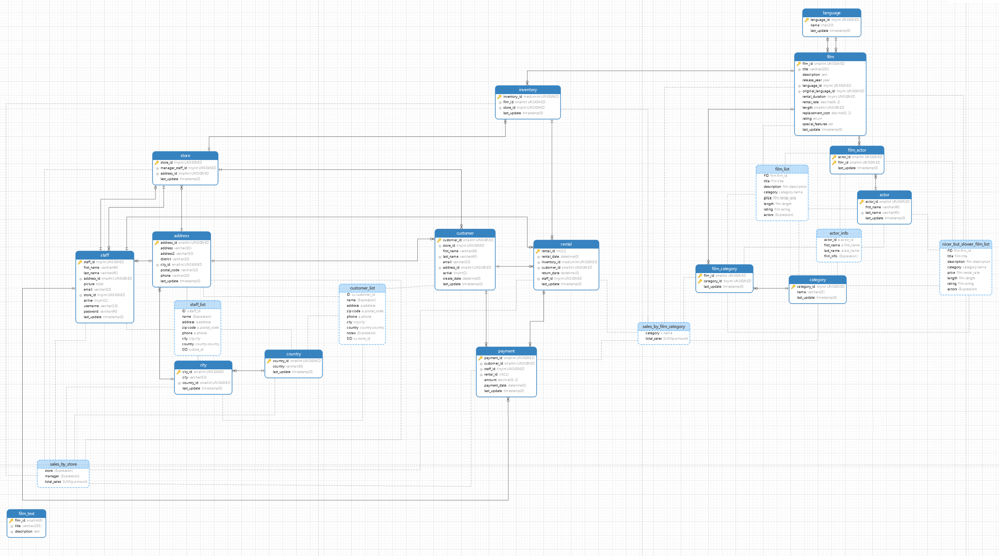
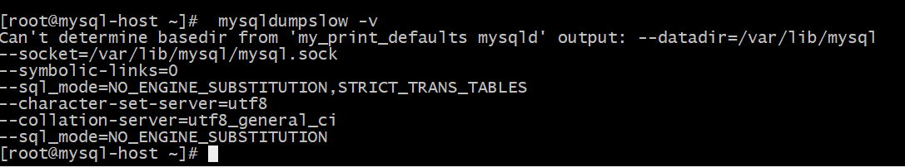
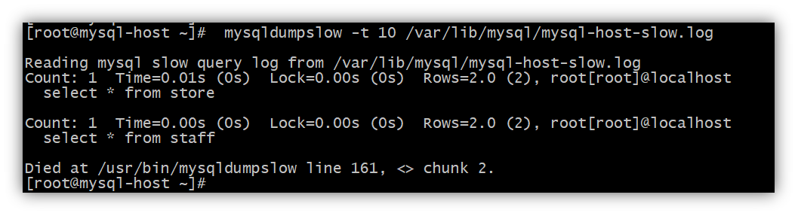
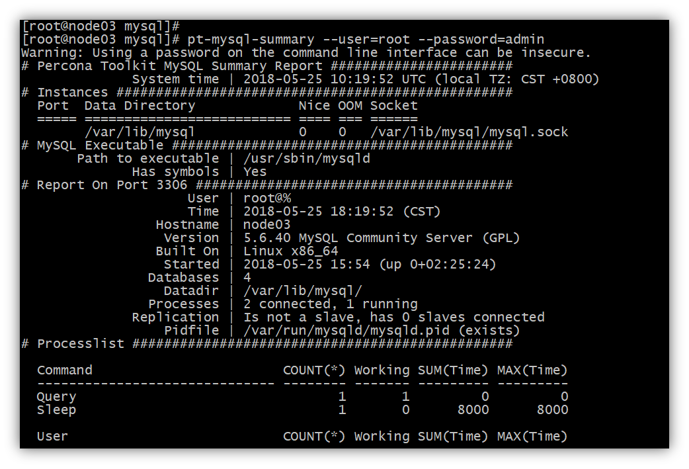

[TOC]


# 1、为什么要进行数据库优化？

## 1.1、 避免网站页面出现访问错误

由于数据库连接`timeout`产生页面5xx错误

由于慢查询造成页面无法加载

由于阻塞造成数据无法提交

## 1.2、 增加数据库的稳定性

很多数据库问题都是由于低效的查询引起的

## 1.3、 优化用户体验

流畅页面的访问速度

良好的网站功能体验


# 2、mysql数据库优化

可以从哪几个方面进行数据库的优化？如下图所示：


## 2.1、 SQL及索引优化

根据需求写出良好的SQL，并创建有效的索引，实现某一种需求可以多种写法，这时候就要选择一种效率最高的写法。这个时候就要了解sql优化

## 2.2、 数据库表结构优化

根据数据库的范式，设计表结构，表结构设计的好直接关系到写SQL语句。

## 2.3、 系统配置优化

大多数运行在Linux机器上，如`tcp`连接数的限制、打开文件数的限制、安全性的限制，因此要对这些配置进行相应的优化。

## 2.4、硬件配置优化

选择适合数据库服务的`cpu`，更快的`IO`，更高的内存；`cpu`并不是越多越好，某些数据库版本有最大的限制，`IO`操作并不是减少阻塞。

注：通过上图可以看出，该金字塔中，优化的成本从下而上逐渐增高，而优化的效果会逐渐降低。

# 3、SQL及索引优化

## 3.1、查看mysql的版本

```shell script
select @@version;
select version();

mysql> select @@version;
+-----------+
| @@version |
+-----------+
| 5.6.25    |
+-----------+
1 row in set (0.00 sec)
```

## 3.2、准备数据

数据使用 MySQL Sakila Sample Database [地址](https://dev.mysql.com/doc/sakila/en/sakila-installation.html)



下载 Sakila DB 解压后目录有三个文件 `sakila-schema.sql`、`sakila-data.sql`、`sakila.mwb`
- The `sakila-schema.sql` file contains all the CREATE statements required to create the structure of the Sakila database including tables, views, stored procedures, and triggers.
- The `sakila-data.sql` file contains the INSERT statements required to populate the structure created by the `sakila-schema.sql` file, along with definitions for triggers that must be created after the initial data load.
- The `sakila.mwb` file is a MySQL Workbench data model that you can open within MySQL Workbench to examine the database structure. For more information, see MySQL Workbench.   


加载上面数据
- 通过命令行来连接数据库
  ```
  shell> mysql -u root -p
  ```

- 创建表及语句执行 `sakila-db/sakila-schema.sql`
  ```
  mysql> SOURCE C:/temp/sakila-db/sakila-schema.sql;
  ```
  
- 加载数据 `sakila-db/sakila-data.sql`
  ```
  mysql> SOURCE C:/temp/sakila-db/sakila-data.sql;
  ```

- 使用数据库
  ```
  USE sakila;
  ```

- 检查创建的表
  ```
  SHOW TABLES;
  
  +----------------------------+
  | Tables_in_sakila           |
  +----------------------------+
  | actor                      |
  | actor_info                 |
  | address                    |
  | category                   |
  | city                       |
  | country                    |
  | customer                   |
  | customer_list              |
  | film                       |
  | film_actor                 |
  | film_category              |
  | film_list                  |
  | film_text                  |
  | inventory                  |
  | language                   |
  | nicer_but_slower_film_list |
  | payment                    |
  | rental                     |
  | sales_by_film_category     |
  | sales_by_store             |
  | staff                      |
  | staff_list                 |
  | store                      |
  +----------------------------+
  ```

- 检验数据是否加载进去
  ```
  mysql> select count(*) from film;
  +----------+
  | count(*) |
  +----------+
  |     1000 |
  +----------+
  1 row in set (0.00 sec)
  
  mysql> select count(*) from payment ;
  +----------+
  | count(*) |
  +----------+
  |    16049 |
  +----------+
  1 row in set (0.00 sec)
  
  mysql> select count(*) from staff ;
  +----------+
  | count(*) |
  +----------+
  |        2 |
  +----------+
  1 row in set (0.00 sec)
  
  mysql> select count(*) from store;
  +----------+
  | count(*) |
  +----------+
  |        2 |
  +----------+
  1 row in set (0.00 sec)
  ```


## 3.3、表结构关系



## 3.4、如何发现有问题的SQL

MySQL**慢查日志**的开启方式和存储格式

### 3.4.1、检查慢查日志是否开启

```shell script
# 检查慢查日志是否开启
show variables like 'slow_query_log'

mysql> show variables like 'slow_query_log';
+----------------+-------+
| Variable_name  | Value |
+----------------+-------+
| slow_query_log | OFF   |
+----------------+-------+
1 row in set (0.00 sec)

# 慢查询日志的位置
set global slow_query_log_file=' /usr/share/mysql/sql_log/mysql-slow.log' 
# 开启慢查询日志
set global log_queries_not_using_indexes=on;
# 大于1秒钟的数据记录到慢日志中，如果设置为默认0，则会有大量的信息存储在磁盘中，磁盘很容易满掉
set global long_query_time=1;  
```

Windows下安装的MySQL慢查询日志默认在 `C:/ProgramData/MySQL/MySQL Server 5.6/data/`

### 3.4.2、查看所有日志的变量信息

```shell script
# 查看所有日志的变量信息
mysql> show variables like '%log%';

+-----------------------------------------+------------------------------------+
| Variable_name                           | Value                              |
+-----------------------------------------+------------------------------------+
| back_log                                | 80                                 |
| binlog_cache_size                       | 32768                              |
| binlog_checksum                         | CRC32                              |
| binlog_direct_non_transactional_updates | OFF                                |
| binlog_error_action                     | IGNORE_ERROR                       |
| binlog_format                           | STATEMENT                          |
| binlog_gtid_simple_recovery             | OFF                                |
| binlog_max_flush_queue_time             | 0                                  |
| binlog_order_commits                    | ON                                 |
| binlog_row_image                        | FULL                               |
| binlog_rows_query_log_events            | OFF                                |
| binlog_stmt_cache_size                  | 32768                              |
| binlogging_impossible_mode              | IGNORE_ERROR                       |
| expire_logs_days                        | 0                                  |
| general_log                             | OFF                                |
| general_log_file                        | /var/lib/mysql/mysql-host.log      |
| innodb_api_enable_binlog                | OFF                                |
| innodb_flush_log_at_timeout             | 1                                  |
| innodb_flush_log_at_trx_commit          | 1                                  |
| innodb_locks_unsafe_for_binlog          | OFF                                |
| innodb_log_buffer_size                  | 8388608                            |
| innodb_log_compressed_pages             | ON                                 |
| innodb_log_file_size                    | 50331648                           |
| innodb_log_files_in_group               | 2                                  |
| innodb_log_group_home_dir               | ./                                 |
| innodb_mirrored_log_groups              | 1                                  |
| innodb_online_alter_log_max_size        | 134217728                          |
| innodb_undo_logs                        | 128                                |
| log_bin                                 | OFF                                |
| log_bin_basename                        |                                    |
| log_bin_index                           |                                    |
| log_bin_trust_function_creators         | OFF                                |
| log_bin_use_v1_row_events               | OFF                                |
| log_error                               | /var/log/mysqld.log                |
| log_output                              | FILE                               |
# log_queries_not_using_indexes
| log_queries_not_using_indexes           | ON                                 |
| log_slave_updates                       | OFF                                |
| log_slow_admin_statements               | OFF                                |
| log_slow_slave_statements               | OFF                                |
|log_throttle_queries_not_using_indexes   | 0                                  |
| log_warnings                            | 1                                  |
| max_binlog_cache_size                   | 18446744073709547520               |
| max_binlog_size                         | 1073741824                         |
| max_binlog_stmt_cache_size              | 18446744073709547520               |
| max_relay_log_size                      | 0                                  |
| relay_log                               |                                    |
| relay_log_basename                      |                                    |
| relay_log_index                         |                                    |
| relay_log_info_file                     | relay-log.info                     |
| relay_log_info_repository               | FILE                               |
| relay_log_purge                         | ON                                 |
| relay_log_recovery                      | OFF                                |
| relay_log_space_limit                   | 0                                  |
| simplified_binlog_gtid_recovery         | OFF                                |
# slow_query_log
|slow_query_log                           | OFF                                |
| slow_query_log_file                     | /var/lib/mysql/mysql-host-slow.log |
| sql_log_bin                             | ON                                 |
| sql_log_off                             | OFF                                |
| sync_binlog                             | 0                                  |
| sync_relay_log                          | 10000                              |
| sync_relay_log_info                     | 10000                              |
+-----------------------------------------+------------------------------------+
61 rows in set (0.01 sec)
```


开启慢查日志
```
 show variables like '%log%'

| log_queries_not_using_indexes           | ON                            |
| slow_query_log                          | OFF                           |
| slow_query_log_file                     | /var/lib/mysql/mysql-slow.log |

# 通过这个命令来查看是否开启慢日志
mysql> set global slow_query_log=on;
Query OK, 0 rows affected (0.32 sec)
```


验证慢查询日志是否开启
```shell script
# 执行 sql 在日志文件中会记录该日志
select count(*) from film;

## 日志信息如下
# Time: 181026  0:39:29
# User@Host: root[root] @ localhost []  Id:     3
# Query_time: 0.000098  Lock_time: 0.000050 Rows_sent: 1  Rows_examined: 2
SET timestamp=1540485569;
select count(*) from film;
## 日志结束

# 再执行下面sql
Show databases;
Use sakila;
select * from store;
select * from staff; 

# 慢查询日志文件会记录
# Time: 200814 23:57:11
# User@Host: root[root] @ localhost [::1]  Id:    11
# Query_time: 0.000000  Lock_time: 0.000000 Rows_sent: 2  Rows_examined: 2
SET timestamp=1597420631;
select * from store;
# Time: 200814 23:57:22
# User@Host: root[root] @ localhost [::1]  Id:    11
# Query_time: 0.000000  Lock_time: 0.000000 Rows_sent: 2  Rows_examined: 2
SET timestamp=1597420642;
select * from staff;
```

监听日志文件查看实时日志
```shell script
tail -2000f /var/lib/mysql/mysql-slow.log
```

### 3.4.3、MySQL慢查日志的存储格式

```text
-- 查询的执行时间
# Time: 200814 23:57:22
-- 执行sql的主机信息
# User@Host: root[root] @ localhost [::1]  Id:    11
-- SQL的执行信息
-- Query_time SQL的查询时间   Lock_time 锁定时间  Rows_sent 所发送的行数    Rows_examined 锁扫描的行数
# Query_time: 0.000000  Lock_time: 0.000000 Rows_sent: 2  Rows_examined: 2
-- SQL执行时间
SET timestamp=1597420642;
-- SQL的执行内容
select * from staff;
```


# 4、MySQL慢查日志分析工具`mysqldumpslow`

## 4.1、介绍
> mysql安装后自带日志分析工具

如何进行查看慢查询日志，如果开启了慢查询日志，就会生成很多的数据，然后就可以通过对日志的分析，生成分析报表，然后通过报表进行优化。

## 4.2、用法

`mysqldumpslow`工具的用法 `mysqldumpslow -h`
- 注意：在mysql数据库所在的服务器上，而不是在mysql>命令行中


查看帮助信息
```shell script
mysqldumpslow -h 
```


查看verbose信息
```shell script
Mysqldumpslow -v
```




上面是Linux环境下使用`mysqldumpslow`命令。在Windows下该命令是`mysqldumpslow.pl`文件需要`perl`编译环境。
- Perl 在 Windows 平台上有 `ActiveStatePerl` 和 `Strawberry Perl` 编译器
  - windows运行`mysqldumpslow.pl` 
    - `ActivePerl-5.28.1.0000-MSWin32-x64-4898c4be_2.msi`安装 `perl`环境
    - 查看`mysqldumpslow.pl`帮助信息
      ```shell script
      perl mysqldumpslow.pl --help
      
      /MySQL Server 5.6/bin>perl mysqldumpslow.pl --help
      Usage: mysqldumpslow [ OPTS... ] [ LOGS... ]
      
      Parse and summarize the MySQL slow query log. Options are
      
        --verbose    verbose
        --debug      debug
        --help       write this text to standard output
      
        -v           verbose
        -d           debug
        -s ORDER     what to sort by (al, at, ar, c, l, r, t), 'at' is default
                      al: average lock time
                      ar: average rows sent
                      at: average query time
                       c: count
                       l: lock time
                       r: rows sent
                       t: query time
        -r           reverse the sort order (largest last instead of first)
        -t NUM       just show the top n queries
        -a           don't abstract all numbers to N and strings to 'S'
        -n NUM       abstract numbers with at least n digits within names
        -g PATTERN   grep: only consider stmts that include this string
        -h HOSTNAME  hostname of db server for *-slow.log filename (can be wildcard),
                     default is '*', i.e. match all
        -i NAME      name of server instance (if using mysql.server startup script)
        -l           don't subtract lock time from total time
      ```

查看慢查询日志的前10个，`mysqldumpslow` 分析的结果如下
```shell script
# 查看慢查询日志的前10个
[root@mysql ~]# mysqldumpslow -t 10 /var/lib/mysql/mysql-slow.log

Reading mysql slow query log from /var/lib/mysql/mysql-slow.log
Count: 1  Time=0.01s (0s)  Lock=0.00s (0s)  Rows=1000.0 (1000), root[root]@localhost
  select * from film

Count: 1  Time=0.00s (0s)  Lock=0.00s (0s)  Rows=200.0 (200), root[root]@localhost
  select * from actor

Count: 2  Time=0.00s (0s)  Lock=0.00s (0s)  Rows=1.0 (2), root[root]@localhost
  select count(*) from film

Count: 2  Time=0.00s (0s)  Lock=0.00s (0s)  Rows=1.0 (2), root[root]@localhost
  select count(*) from staff

Died at /usr/bin/mysqldumpslow line 161, <> chunk 6.
```



如上图两条就是分析的结果，每条结果都显示是执行时间，锁定时间，发送的行数，扫描的行数。
```shell script
[root@mysql mysql]# tail -f /var/lib/mysql/mysql-slow.log
# Time: 181026  0:41:46
# User@Host: root[root] @ localhost []  Id:     3
# Query_time: 0.000121  Lock_time: 0.000059 Rows_sent: 1  Rows_examined: 2
SET timestamp=1540485706;
select count(*) from staff;
# Time: 181026  0:42:12
# User@Host: root[root] @ localhost []  Id:     3
# Query_time: 0.000634  Lock_time: 0.000069 Rows_sent: 200  Rows_examined: 200
SET timestamp=1540485732;
select * from actor;
# Time: 181026  1:05:41
# User@Host: root[root] @ localhost []  Id:     3
# Query_time: 0.008336  Lock_time: 0.000101 Rows_sent: 1000  Rows_examined: 1000
SET timestamp=1540487141;
select * from film;
```

这个工具是最常用的工具，通过安装mysql进行附带安装，但是该工具统计的结果比较少，对优化锁表现的数据还是比较少。

 

# 5、MySQL慢查日志分析工具`pt-query-digest`

## 5.1、介绍及作用

作为一名优秀的mysql dba也需要有掌握几个好用的mysql管理工具，整理和查找一些能够便于管理mysql的利器很重要。

性能的管理一直都是摆在第一位的，dba的很多工作管理层都看不到也没有办法衡量价值，但是如果一个系统慢的跟蜗牛一样，dba通过监控调优把系统从崩溃边缘重新拉回到高铁时代。这种价值和触动应该是巨大的。

mysql 的日志是跟踪mysql性能瓶颈的最快和最直接的方式了，系统性能出现瓶颈的时候，首先要打开慢查询日志，进行跟踪


## 5.2、安装`pt-query-digest`工具
> 号称mysql dba必须掌握的十大工具之首

### 5.2.1、快速安装（注：必须先要安装`wget`）

```shell script
# debian
sudo apt-get install percona-toolkit
# centos
sudo yum install percona-toolkit
```

### 5.2.2、检查是否安装完成

命令行中执行`pt-summary` `pt-query-digest --help`


### 5.2.3、工具使用简介

`pt-summary`安装
```shell script
wget http://percona.com/get/pt-summary
```

`pt-summary`帮助信息
```shell script
[root@mysql ~]# pt-summary --help
Usage: pt-summary

For more information, 'man pt-summary' or 'perldoc /usr/bin/pt-summary'.

Command line options:

  --config          Read this comma-separated list of config files.
  --help            Print help and exit.
  --read-samples    Create a report from the files in this directory.
  --save-samples    Save the collected data in this directory.
  --sleep           How long to sleep when gathering samples from vmstat.
  --summarize-mounts
                    Report on mounted filesystems and disk usage.
  --summarize-network
                    Report on network controllers and configuration.
  --summarize-processes
                    Report on top processes and C<vmstat> output.
  --version         Print tool's version and exit.

Options and values after processing arguments:

  --config                         (No value)
  --help                           TRUE
  --read-samples                   (No value)
  --save-samples                   (No value)
  --sleep                          5
  --summarize-mounts               TRUE
  --summarize-network              TRUE
  --summarize-processes            TRUE
  --version                        FALSE
[root@mysql ~]# pt-summary --version
pt-summary 2.2.16
[root@mysql ~]# 
```

#### 5.2.3.1、查看服务器信息

`pt-summary`查看服务器信息
```shell script
# 查看服务器信息
pt-summary

# pt-summary 文档
[root@mysql ~]# man pt-summary
PT-SUMMARY(1p)        User Contributed Perl Documentation       PT-SUMMARY(1p)

NAME
       pt-summary - Summarize system information nicely.

SYNOPSIS
       Usage: pt-summary

       pt-summary conveniently summarizes the status and configuration of a server.  It is not a tuning tool
       or diagnosis tool.  It produces a report that is easy to diff and can be pasted into emails without
       losing the formatting.  This tool works well on many types of Unix systems.

       Download and run:

          wget http://percona.com/get/pt-summary
          bash ./pt-summary

RISKS
       Percona Toolkit is mature, proven in the real world, and well tested, but all database tools can pose
       a risk to the system and the database server.  Before using this tool, please:

       ·   Read the tool’s documentation

       ·   Review the tool’s known "BUGS"

       ·   Test the tool on a non-production server

       ·   Backup your production server and verify the backups

DESCRIPTION
       pt-summary runs a large variety of commands to inspect system status and configuration, saves the
       output into files in a temporary directory, and then runs Unix commands on these results to format
       them nicely.  It works best when executed as a privileged user, but will also work without
       privileges, although some output might not be possible to generate without root.

OUTPUT
       Many of the outputs from this tool are deliberately rounded to show their magnitude but not the exact
       detail. This is called fuzzy-rounding. The idea is that it doesn’t matter whether a particular
       counter is 918 or 921; such a small variation is insignificant, and only makes the output hard to
       compare to other servers. Fuzzy-rounding rounds in larger increments as the input grows. It begins by
       rounding to the nearest 5, then the nearest 10, nearest 25, and then repeats by a factor of 10 larger
       (50, 100, 250), and so on, as the input grows.

       The following is a simple report generated from a CentOS virtual machine, broken into sections with
       commentary following each section. Some long lines are reformatted for clarity when reading this
       documentation as a manual page in a terminal.

        # Percona Toolkit System Summary Report ######################
                Date | 2012-03-30 00:58:07 UTC (local TZ: EDT -0400)
            Hostname | localhost.localdomain
              Uptime | 20:58:06 up 1 day, 20 min, 1 user,
                       load average: 0.14, 0.18, 0.18
              System | innotek GmbH; VirtualBox; v1.2 ()
         Service Tag | 0
            Platform | Linux
             Release | CentOS release 5.5 (Final)
              Kernel | 2.6.18-194.el5
        Architecture | CPU = 32-bit, OS = 32-bit
           Threading | NPTL 2.5
            Compiler | GNU CC version 4.1.2 20080704 (Red Hat 4.1.2-48).
             SELinux | Enforcing
         Virtualized | VirtualBox

       This section shows the current date and time, and a synopsis of the server and operating system.

        # Processor ##################################################
          Processors | physical = 1, cores = 0, virtual = 1, hyperthreading = no
              Speeds | 1x2510.626
              Models | 1xIntel(R) Core(TM) i5-2400S CPU @ 2.50GHz
              Caches | 1x6144 KB

       This section is derived from /proc/cpuinfo.

        # Memory #####################################################
               Total | 503.2M
                Free | 29.0M
                Used | physical = 474.2M, swap allocated = 1.0M,
                       swap used = 16.0k, virtual = 474.3M
             Buffers | 33.9M
              Caches | 262.6M
               Dirty | 396 kB
             UsedRSS | 201.9M
          Swappiness | 60
         DirtyPolicy | 40, 10
         Locator  Size  Speed    Form Factor  Type    Type Detail
         =======  ====  =====    ===========  ====    ===========

       Information about memory is gathered from "free". The Used statistic is the total of the rss sizes
       displayed by "ps". The Dirty statistic for the cached value comes from /proc/meminfo. On Linux, the
       swappiness settings are gathered from "sysctl". The final portion of this section is a table of the
       DIMMs, which comes from "dmidecode". In this example there is no output.

        # Mounted Filesystems ########################################
          Filesystem                       Size Used Type  Opts Mountpoint
          /dev/mapper/VolGroup00-LogVol00   15G  17% ext3  rw   /
          /dev/sda1                         99M  13% ext3  rw   /boot
          tmpfs                            252M   0% tmpfs rw   /dev/shm

       The mounted filesystem section is a combination of information from "mount" and "df". This section is
       skipped if you disable "--summarize-mounts".

        # Disk Schedulers And Queue Size #############################
                dm-0 | UNREADABLE
                dm-1 | UNREADABLE
                 hdc | [cfq] 128
                 md0 | UNREADABLE
                 sda | [cfq] 128

       The disk scheduler information is extracted from the /sys filesystem in Linux.

        # Disk Partioning ############################################
        Device       Type      Start        End               Size
        ============ ==== ========== ========== ==================
        /dev/sda     Disk                              17179869184
        /dev/sda1    Part          1         13           98703360
        /dev/sda2    Part         14       2088        17059230720

       Information about disk partitioning comes from "fdisk -l".

        # Kernel Inode State #########################################
        dentry-state | 10697 8559  45 0  0  0
             file-nr | 960   0  50539
            inode-nr | 14059 8139

       These lines are from the files of the same name in the /proc/sys/fs directory on Linux. Read the
       "proc" man page to learn about the meaning of these files on your system.

        # LVM Volumes ################################################
        LV       VG         Attr   LSize   Origin Snap% Move Log Copy% Convert
        LogVol00 VolGroup00 -wi-ao 269.00G
        LogVol01 VolGroup00 -wi-ao   9.75G

       This section shows the output of "lvs".

        # RAID Controller ############################################
          Controller | No RAID controller detected

       The tool can detect a variety of RAID controllers by examining "lspci" and "dmesg" information. If
       the controller software is installed on the system, in many cases it is able to execute status
       commands and show a summary of the RAID controller’s status and configuration. If your system is not
       supported, please file a bug report.

        # Network Config #############################################
          Controller | Intel Corporation 82540EM Gigabit Ethernet Controller
         FIN Timeout | 60
          Port Range | 61000

       The network controllers attached to the system are detected from "lspci". The TCP/IP protocol
       configuration parameters are extracted from "sysctl". You can skip this section by disabling the
       "--summarize-network" option.

        # Interface Statistics #######################################
        interface rx_bytes rx_packets rx_errors tx_bytes tx_packets tx_errors
        ========= ======== ========== ========= ======== ========== =========
        lo        60000000      12500         0 60000000      12500         0
        eth0      15000000      80000         0  1500000      10000         0
        sit0             0          0         0        0          0         0

       Interface statistics are gathered from "ip -s link" and are fuzzy-rounded. The columns are received
       and transmitted bytes, packets, and errors.  You can skip this section by disabling the
       "--summarize-network" option.

        # Network Connections ########################################
          Connections from remote IP addresses
            127.0.0.1           2
          Connections to local IP addresses
            127.0.0.1           2
          Connections to top 10 local ports
            38346               1
            60875               1
          States of connections
            ESTABLISHED         5
            LISTEN              8

       This section shows a summary of network connections, retrieved from "netstat" and "fuzzy-rounded" to
       make them easier to compare when the numbers grow large.  There are two sub-sections showing how many
       connections there are per origin and destination IP address, and a sub-section showing the count of
       ports in use.  The section ends with the count of the network connections’ states.  You can skip this
       section by disabling the "--summarize-network" option.

        # Top Processes ##############################################
          PID USER  PR  NI  VIRT  RES  SHR S %CPU %MEM    TIME+  COMMAND
            1 root  15   0  2072  628  540 S  0.0  0.1   0:02.55 init
            2 root  RT  -5     0    0    0 S  0.0  0.0   0:00.00 migration/0
            3 root  34  19     0    0    0 S  0.0  0.0   0:00.03 ksoftirqd/0
            4 root  RT  -5     0    0    0 S  0.0  0.0   0:00.00 watchdog/0
            5 root  10  -5     0    0    0 S  0.0  0.0   0:00.97 events/0
            6 root  10  -5     0    0    0 S  0.0  0.0   0:00.00 khelper
            7 root  10  -5     0    0    0 S  0.0  0.0   0:00.00 kthread
           10 root  10  -5     0    0    0 S  0.0  0.0   0:00.13 kblockd/0
           11 root  20  -5     0    0    0 S  0.0  0.0   0:00.00 kacpid
        # Notable Processes ##########################################
          PID    OOM    COMMAND
         2028    +0    sshd

       This section shows the first few lines of "top" so that you can see what processes are actively using
       CPU time.  The notable processes include the SSH daemon and any process whose out-of-memory-killer
       priority is set to 17. You can skip this section by disabling the "--summarize-processes" option.

        # Simplified and fuzzy rounded vmstat (wait please) ##########
          procs  ---swap-- -----io---- ---system---- --------cpu--------
           r  b    si   so    bi    bo     ir     cs  us  sy  il  wa  st
           2  0     0    0     3    15     30    125   0   0  99   0   0
           0  0     0    0     0     0   1250    800   6  10  84   0   0
           0  0     0    0     0     0   1000    125   0   0 100   0   0
           0  0     0    0     0     0   1000    125   0   0 100   0   0
           0  0     0    0     0   450   1000    125   0   1  88  11   0
        # The End ####################################################

       This section is a trimmed-down sample of "vmstat 1 5", so you can see the general status of the
       system at present. The values in the table are fuzzy-rounded, except for the CPU columns.  You can
       skip this section by disabling the "--summarize-processes" option.

OPTIONS
       --config
           type: string

           Read this comma-separated list of config files.  If specified, this must be the first option on
           the command line.

       --help
           Print help and exit.

       --read-samples
           type: string

           Create a report from the files in this directory.

       --save-samples
           type: string

           Save the collected data in this directory.

       --sleep
           type: int; default: 5

           How long to sleep when gathering samples from vmstat.

       --summarize-mounts
           default: yes; negatable: yes

           Report on mounted filesystems and disk usage.

       --summarize-network
           default: yes; negatable: yes

           Report on network controllers and configuration.

       --summarize-processes
           default: yes; negatable: yes

           Report on top processes and "vmstat" output.

       --version
           Print tool’s version and exit.

ENVIRONMENT
       This tool does not use any environment variables.

SYSTEM REQUIREMENTS
       This tool requires the Bourne shell (/bin/sh).

BUGS
       For a list of known bugs, see http://www.percona.com/bugs/pt-summary <http://www.percona.com/bugs/pt-
       summary>.

       Please report bugs at https://bugs.launchpad.net/percona-toolkit <https://bugs.launchpad.net/percona-
       toolkit>.  Include the following information in your bug report:

       ·   Complete command-line used to run the tool

       ·   Tool "--version"

       ·   MySQL version of all servers involved

       ·   Output from the tool including STDERR

       ·   Input files (log/dump/config files, etc.)

       If possible, include debugging output by running the tool with "PTDEBUG"; see "ENVIRONMENT".

DOWNLOADING
       Visit http://www.percona.com/software/percona-toolkit/ <http://www.percona.com/software/percona-
       toolkit/> to download the latest release of Percona Toolkit.  Or, get the latest release from the
       command line:

          wget percona.com/get/percona-toolkit.tar.gz

          wget percona.com/get/percona-toolkit.rpm

          wget percona.com/get/percona-toolkit.deb

       You can also get individual tools from the latest release:

          wget percona.com/get/TOOL

       Replace "TOOL" with the name of any tool.

AUTHORS
       Baron Schwartz, Kevin van Zonneveld, and Brian Fraser

ABOUT PERCONA TOOLKIT
       This tool is part of Percona Toolkit, a collection of advanced command-line tools for MySQL developed
       by Percona.  Percona Toolkit was forked from two projects in June, 2011: Maatkit and Aspersa.  Those
       projects were created by Baron Schwartz and primarily developed by him and Daniel Nichter.  Visit
       <http://www.percona.com/software/> to learn about other free, open-source software from Percona.

COPYRIGHT, LICENSE, AND WARRANTY
       This program is copyright 2011-2015 Percona LLC and/or its affiliates, 2010-2011 Baron Schwartz.

       THIS PROGRAM IS PROVIDED "AS IS" AND WITHOUT ANY EXPRESS OR IMPLIED WARRANTIES, INCLUDING, WITHOUT
       LIMITATION, THE IMPLIED WARRANTIES OF MERCHANTABILITY AND FITNESS FOR A PARTICULAR PURPOSE.

       This program is free software; you can redistribute it and/or modify it under the terms of the GNU
       General Public License as published by the Free Software Foundation, version 2; OR the Perl Artistic
       License.  On UNIX and similar systems, you can issue ‘man perlgpl’ or ‘man perlartistic’ to read
       these licenses.

       You should have received a copy of the GNU General Public License along with this program; if not,
       write to the Free Software Foundation, Inc., 59 Temple Place, Suite 330, Boston, MA  02111-1307  USA.

VERSION
       pt-summary 2.2.16

perl v5.14.2                      2015-11-06                    PT-SUMMARY(1p)
```


#### 5.2.3.2、查看磁盘开销使用信息


`pt-diskstats`查看磁盘开销使用信息
```
[root@mysql ~]# pt-diskstats
  #ts device    rd_s rd_avkb rd_mb_s rd_mrg rd_cnc   rd_rt    wr_s wr_avkb wr_mb_s wr_mrg wr_cnc   wr_rt busy in_prg    io_s  qtime stime
  1.0 sda        0.0     0.0     0.0     0%    0.0     0.0     5.0     4.0     0.0     0%    0.0     4.8   0%      0     5.0    3.8   1.0
  1.0 sda2       0.0     0.0     0.0     0%    0.0     0.0     5.0     4.0     0.0     0%    0.0     4.8   0%      0     5.0    3.8   1.0
  1.0 dm-0       0.0     0.0     0.0     0%    0.0     0.0     5.0     4.0     0.0     0%    0.0     4.8   0%      0     5.0    3.8   1.0

  1.0 sda        0.0     0.0     0.0     0%    0.0     0.0     0.0     0.0     0.0     0%    0.0     0.0   0%      0     0.0    0.0   0.0
  1.0 sda2       0.0     0.0     0.0     0%    0.0     0.0     0.0     0.0     0.0     0%    0.0     0.0   0%      0     0.0    0.0   0.0
  1.0 dm-0       0.0     0.0     0.0     0%    0.0     0.0     0.0     0.0     0.0     0%    0.0     0.0   0%      0     0.0    0.0   0.0

  1.0 sda        0.0     0.0     0.0     0%    0.0     0.0     0.0     0.0     0.0     0%    0.0     0.0   0%      0     0.0    0.0   0.0
  1.0 sda2       0.0     0.0     0.0     0%    0.0     0.0     0.0     0.0     0.0     0%    0.0     0.0   0%      0     0.0    0.0   0.0
  1.0 dm-0       0.0     0.0     0.0     0%    0.0     0.0     0.0     0.0     0.0     0%    0.0     0.0   0%      0     0.0    0.0   0.0
```

#### 5.2.3.3、查看mysql数据库信息

查看MySQL数据库信息
```shell script
pt-mysql-summary --user=root --password=123456
```



#### 5.2.3.4、分析慢查询日志

`pt-query-digest`分析慢查询日志
```shell script
[root@mysql ~]# pt-query-digest /var/lib/mysql/mysql-slow.log 

# 410ms user time, 110ms system time, 24.40M rss, 204.76M vsz
# Current date: Fri Oct 26 02:02:37 2018
# Hostname: mysql
# Files: /var/lib/mysql/mysql-slow.log
# Overall: 8 total, 6 unique, 0.00 QPS, 0.00x concurrency ________________
# Time range: 2018-10-26 00:36:02 to 01:50:11
# Attribute          total     min     max     avg     95%  stddev  median
# ============     ======= ======= ======= ======= ======= ======= =======
# Exec time           27ms    98us    15ms     3ms    15ms     5ms     1ms
# Lock time            2ms    50us     2ms   293us     2ms   471us   105us
# Rows sent          1.18k       1    1000  150.75  964.41  315.86    0.99
# Rows examine       3.14k       2    1000  401.88  964.41  450.80  578.59
# Query size           279      18      92   34.88   88.31   22.24   24.84

# Profile
# Rank Query ID           Response time Calls R/Call V/M   Item
# ==== ================== ============= ===== ====== ===== ===============
#    1 0x3A23B0CB7839AF05  0.0153 55.9%     1 0.0153  0.00 SELECT INFORMATION_SCHEMA.TRIGGERS
#    2 0x687D590364E29465  0.0083 30.5%     1 0.0083  0.00 SELECT film
#    3 0x9134F278CE0AB549  0.0017  6.2%     1 0.0017  0.00 SELECT mysql.user
#    4 0xEBA2FBA69B1FF476  0.0012  4.2%     2 0.0006  0.00 SELECT film
# MISC 0xMISC              0.0009  3.1%     3 0.0003   0.0 <2 ITEMS>

# Query 1: 0 QPS, 0x concurrency, ID 0x3A23B0CB7839AF05 at byte 1678 _____
# This item is included in the report because it matches --limit.
# Scores: V/M = 0.00
# Time range: all events occurred at 2018-10-26 01:50:11
# Attribute    pct   total     min     max     avg     95%  stddev  median
# ============ === ======= ======= ======= ======= ======= ======= =======
# Count         12       1
# Exec time     55    15ms    15ms    15ms    15ms    15ms       0    15ms
# Lock time     16   387us   387us   387us   387us   387us       0   387us
# Rows sent      0       1       1       1       1       1       0       1
# Rows examine   0       6       6       6       6       6       0       6
# Query size    17      48      48      48      48      48       0      48
# String:
# Databases    sakila
# Hosts        localhost
# Users        root
# Query_time distribution
#   1us
#  10us
# 100us
#   1ms
#  10ms  ################################################################
# 100ms
#    1s
#  10s+
# Tables
#    SHOW TABLE STATUS FROM `INFORMATION_SCHEMA` LIKE 'TRIGGERS'\G
#    SHOW CREATE TABLE `INFORMATION_SCHEMA`.`TRIGGERS`\G
# EXPLAIN /*!50100 PARTITIONS*/
SELECT COUNT(*) FROM INFORMATION_SCHEMA.TRIGGERS\G

# Query 2: 0 QPS, 0x concurrency, ID 0x687D590364E29465 at byte 1208 _____
# This item is included in the report because it matches --limit.
# Scores: V/M = 0.00
# Time range: all events occurred at 2018-10-26 01:05:41
# Attribute    pct   total     min     max     avg     95%  stddev  median
# ============ === ======= ======= ======= ======= ======= ======= =======
# Count         12       1
# Exec time     30     8ms     8ms     8ms     8ms     8ms       0     8ms
# Lock time      4   101us   101us   101us   101us   101us       0   101us
# Rows sent     82    1000    1000    1000    1000    1000       0    1000
# Rows examine  31    1000    1000    1000    1000    1000       0    1000
# Query size     6      18      18      18      18      18       0      18
# String:
# Databases    sakila
# Hosts        localhost
# Users        root
# Query_time distribution
#   1us
#  10us
# 100us
#   1ms  ################################################################
#  10ms
# 100ms
#    1s
#  10s+
# Tables
#    SHOW TABLE STATUS FROM `sakila` LIKE 'film'\G
#    SHOW CREATE TABLE `sakila`.`film`\G
# EXPLAIN /*!50100 PARTITIONS*/
select * from film\G

# Query 3: 0 QPS, 0x concurrency, ID 0x9134F278CE0AB549 at byte 1409 _____
# This item is included in the report because it matches --limit.
# Scores: V/M = 0.00
# Time range: all events occurred at 2018-10-26 01:50:11
# Attribute    pct   total     min     max     avg     95%  stddev  median
# ============ === ======= ======= ======= ======= ======= ======= =======
# Count         12       1
# Exec time      6     2ms     2ms     2ms     2ms     2ms       0     2ms
# Lock time     64     2ms     2ms     2ms     2ms     2ms       0     2ms
# Rows sent      0       1       1       1       1       1       0       1
# Rows examine   0       5       5       5       5       5       0       5
# Query size    32      92      92      92      92      92       0      92
# String:
# Databases    sakila
# Hosts        localhost
# Users        root
# Query_time distribution
#   1us
#  10us
# 100us
#   1ms  ################################################################
#  10ms
# 100ms
#    1s
#  10s+
# Tables
#    SHOW TABLE STATUS FROM `mysql` LIKE 'user'\G
#    SHOW CREATE TABLE `mysql`.`user`\G
# EXPLAIN /*!50100 PARTITIONS*/
SELECT COUNT(*), SUM(user=""), SUM(password=""), SUM(password NOT LIKE "*%") FROM mysql.user\G

# Query 4: 0.01 QPS, 0.00x concurrency, ID 0xEBA2FBA69B1FF476 at byte 0 __
# This item is included in the report because it matches --limit.
# Scores: V/M = 0.00
# Time range: 2018-10-26 00:36:02 to 00:39:22
# Attribute    pct   total     min     max     avg     95%  stddev  median
# ============ === ======= ======= ======= ======= ======= ======= =======
# Count         25       2
# Exec time      4     1ms   413us   746us   579us   746us   235us   579us
# Lock time      7   167us    51us   116us    83us   116us    45us    83us
# Rows sent      0       2       1       1       1       1       0       1
# Rows examine  62   1.95k    1000    1000    1000    1000       0    1000
# Query size    17      50      25      25      25      25       0      25
# String:
# Databases    sakila
# Hosts        localhost
# Users        root
# Query_time distribution
#   1us
#  10us
# 100us  ################################################################
#   1ms
#  10ms
# 100ms
#    1s
#  10s+
# Tables
#    SHOW TABLE STATUS FROM `sakila` LIKE 'film'\G
#    SHOW CREATE TABLE `sakila`.`film`\G
# EXPLAIN /*!50100 PARTITIONS*/
select count(*) from film\G
[root@mysql ~]# 
```

#### 5.2.3.5、查找mysql的从库和同步状态

`pt-slave-find`查看MySQL从库和同步状态
```shell script
[root@mysql ~]# pt-slave-find --host=localhost --user=root --password=123456
localhost
Version         5.6.25
Server ID       0
Uptime          3+01:31:37 (started 2018-10-23T00:31:39)
Replication     Is not a slave, has 0 slaves connected, is not read_only
Filters         
Binary logging  STATEMENT
Slave status    
Slave mode      STRICT
Auto-increment  increment 1, offset 1
InnoDB version  5.6.25
[root@mysql ~]# ^C
[root@mysql ~]# 
```

#### 5.2.3.6、查看mysql的死锁信息

`pt-deadlock-logger`查看死锁信息

```shell script
pt-deadlock-logger --user=root --password=123456 localhost
```

#### 5.2.3.7、从慢查询日志中分析索引使用情况

`pt-index-usage`慢查询日志中分析索引使用情况

```shell script
[root@mysql ~]# pt-index-usage --user=root --password=123456 localhost /var/lib/mysql/mysql-slow.log 
localhost does not exist or is not readable at /usr/bin/pt-index-usage line 4447.

ALTER TABLE `sakila`.`actor` DROP KEY `idx_actor_last_name`; -- type:non-unique

ALTER TABLE `sakila`.`film` DROP KEY `idx_fk_original_language_id`, DROP KEY `idx_title`; -- type:non-unique

ALTER TABLE `sakila`.`staff` DROP KEY `idx_fk_address_id`; -- type:non-unique
```

#### 5.2.3.8、查找数据库表中重复的索引

`pt-duplicate-key-checker`查找重复索引

```shell script
[root@mysql ~]# pt-duplicate-key-checker --host=localhost --user=root --password=123456
# ########################################################################
# menagerie.A                                                             
# ########################################################################

# id is a duplicate of PRIMARY
# Key definitions:
#   KEY `id` (`A_ID`)
#   PRIMARY KEY (`A_ID`),
# Column types:
#         `a_id` int(11) not null auto_increment
# To remove this duplicate index, execute:
ALTER TABLE `menagerie`.`A` DROP INDEX `id`;

# ########################################################################
# Summary of indexes                                                      
# ########################################################################

# Size Duplicate Indexes   12
# Total Duplicate Indexes  1
# Total Indexes            99
[root@mysql ~]# 
```

#### 5.2.3.9、查看mysql表和文件的当前活动IO开销

`pt-ioprofile`查看当前IO开销
```shell script
[root@mysql ~]# pt-ioprofile
Fri Oct 26 02:14:17 CST 2018
Tracing process ID 37860
     total filename
[root@mysql ~]# 
```

#### 5.2.3.10、查看不同mysql配置文件的差异

`pt-config-diff`不同配置文件差异
```shell script
[root@mysql ~]# pt-config-diff /etc/my.cnf /etc/my_master.cnf
[root@mysql ~]# 
```

#### 5.2.3.11、`pt-find`查找mysql表和执行命令，示例如下

`pt-find`查找数据库里大于2G的表：
```shell script
[root@mysql ~]# pt-find --user=root --password=123456 --tablesize +2G
[root@mysql ~]# 
```

查找10天前创建，MyISAM引擎的表：
```shell script
[root@mysql ~]# pt-find --user=root --password=123456 --ctime +10 --engine MyISAM
[root@mysql ~]# 
```

查看表和索引大小并排序
```shell script
[root@mysql ~]# pt-find --user=root --password=123456 --printf "%T\t%D.%N\n" | sort -rn
2785280 `sakila`.`rental`
2228224 `sakila`.`payment`
588216  `mysql`.`help_topic`
376832  `sakila`.`inventory`
278528  `sakila`.`film_actor`
278528  `sakila`.`film`
196608  `sakila`.`film_text`
141280  `mysql`.`help_keyword`
131072  `sakila`.`customer`
98304   `sakila`.`staff`
98304   `sakila`.`address`
81920   `sakila`.`film_category`
65536   `sakila`.`city`
49152   `sakila`.`store`
49152   `mysql`.`innodb_index_stats`
33463   `mysql`.`help_relation`
32768   `sakila`.`actor`
16384   `sakila`.`language`
16384   `sakila`.`country`
16384   `sakila`.`category`
16384   `mysql`.`slave_worker_info`
16384   `mysql`.`slave_relay_log_info`
16384   `mysql`.`slave_master_info`
16384   `mysql`.`innodb_table_stats`
16384   `menagerie`.`shop`
16384   `menagerie`.`pet`
16384   `menagerie`.`employee_tbl`
16384   `menagerie`.`employee`
16384   `menagerie`.`B`
16384   `menagerie`.`A`
16384   `itcast`.`shop`
16384   `itcast`.`pet`
16384   `itcast`.`B`
16384   `itcast`.`A`
12388   `mysql`.`proc`
6506    `mysql`.`proxies_priv`
6000    `mysql`.`db`
4192    `mysql`.`help_category`
4096    `mysql`.`tables_priv`
4096    `mysql`.`procs_priv`
4096    `mysql`.`columns_priv`
2692    `mysql`.`user`
2048    `mysql`.`event`
1024    `mysql`.`time_zone_transition_type`
1024    `mysql`.`time_zone_transition`
1024    `mysql`.`time_zone_name`
1024    `mysql`.`time_zone_leap_second`
1024    `mysql`.`time_zone`
1024    `mysql`.`servers`
1024    `mysql`.`plugin`
1024    `mysql`.`ndb_binlog_index`
1024    `mysql`.`func`
0       `sakila`.`staff_list`
0       `sakila`.`sales_by_store`
0       `sakila`.`sales_by_film_category`
0       `sakila`.`nicer_but_slower_film_list`
0       `sakila`.`film_list`
0       `sakila`.`customer_list`
0       `sakila`.`actor_info`
0       `performance_schema`.`users`
0       `performance_schema`.`threads`
0       `performance_schema`.`table_lock_waits_summary_by_table`
0       `performance_schema`.`table_io_waits_summary_by_table`
0       `performance_schema`.`table_io_waits_summary_by_index_usage`
0       `performance_schema`.`socket_summary_by_instance`
0       `performance_schema`.`socket_summary_by_event_name`
0       `performance_schema`.`socket_instances`
0       `performance_schema`.`setup_timers`
0       `performance_schema`.`setup_objects`
0       `performance_schema`.`setup_instruments`
0       `performance_schema`.`setup_consumers`
0       `performance_schema`.`setup_actors`
0       `performance_schema`.`session_connect_attrs`
0       `performance_schema`.`session_account_connect_attrs`
0       `performance_schema`.`rwlock_instances`
0       `performance_schema`.`performance_timers`
0       `performance_schema`.`objects_summary_global_by_type`
0       `performance_schema`.`mutex_instances`
0       `performance_schema`.`hosts`
0       `performance_schema`.`host_cache`
0       `performance_schema`.`file_summary_by_instance`
0       `performance_schema`.`file_summary_by_event_name`
0       `performance_schema`.`file_instances`
0       `performance_schema`.`events_waits_summary_global_by_event_name`
0       `performance_schema`.`events_waits_summary_by_user_by_event_name`
0       `performance_schema`.`events_waits_summary_by_thread_by_event_name`
0       `performance_schema`.`events_waits_summary_by_instance`
0       `performance_schema`.`events_waits_summary_by_host_by_event_name`
0       `performance_schema`.`events_waits_summary_by_account_by_event_name`
0       `performance_schema`.`events_waits_history_long`
0       `performance_schema`.`events_waits_history`
0       `performance_schema`.`events_waits_current`
0       `performance_schema`.`events_statements_summary_global_by_event_name`
0       `performance_schema`.`events_statements_summary_by_user_by_event_name`
0       `performance_schema`.`events_statements_summary_by_thread_by_event_name`
0       `performance_schema`.`events_statements_summary_by_host_by_event_name`
0       `performance_schema`.`events_statements_summary_by_digest`
0       `performance_schema`.`events_statements_summary_by_account_by_event_name`
0       `performance_schema`.`events_statements_history_long`
0       `performance_schema`.`events_statements_history`
0       `performance_schema`.`events_statements_current`
0       `performance_schema`.`events_stages_summary_global_by_event_name`
0       `performance_schema`.`events_stages_summary_by_user_by_event_name`
0       `performance_schema`.`events_stages_summary_by_thread_by_event_name`
0       `performance_schema`.`events_stages_summary_by_host_by_event_name`
0       `performance_schema`.`events_stages_summary_by_account_by_event_name`
0       `performance_schema`.`events_stages_history_long`
0       `performance_schema`.`events_stages_history`
0       `performance_schema`.`events_stages_current`
0       `performance_schema`.`cond_instances`
0       `performance_schema`.`accounts`
0       `mysql`.`slow_log`
0       `mysql`.`general_log`
[root@mysql ~]# 
```

#### 5.2.3.12、`pt-kill` 杀掉符合标准的mysql进程

显示查询时间大于60秒的查询
```shell script
[root@mysql ~]# pt-kill --user=root --password=123456 --busy-time 60 --print
^C
[root@mysql ~]# 
```

kill掉大于60秒的查询
```shell script
pt-kill --user=root --password=123456 --busy-time 60 --kill
```

#### 5.2.3.13、查看mysql授权


```shell script
[root@mysql ~]# pt-show-grants --user=root --password=123456
-- Grants dumped by pt-show-grants
-- Dumped from server Localhost via UNIX socket, MySQL 5.6.25 at 2018-10-26 02:45:29
-- Grants for 'root'@'%'
GRANT ALL PRIVILEGES ON *.* TO 'root'@'%' IDENTIFIED BY PASSWORD '*6BB4837EB74329105EE4568DDA7DC67ED2CA2AD9';
-- Grants for 'root'@'127.0.0.1'
GRANT ALL PRIVILEGES ON *.* TO 'root'@'127.0.0.1' IDENTIFIED BY PASSWORD '*6E666163AC88D2C7122156EB3B633E3172F24604' WITH GRANT OPTION;
-- Grants for 'root'@'::1'
GRANT ALL PRIVILEGES ON *.* TO 'root'@'::1' IDENTIFIED BY PASSWORD '*6E666163AC88D2C7122156EB3B633E3172F24604' WITH GRANT OPTION;
-- Grants for 'root'@'localhost'
GRANT ALL PRIVILEGES ON *.* TO 'root'@'localhost' IDENTIFIED BY PASSWORD '*6BB4837EB74329105EE4568DDA7DC67ED2CA2AD9' WITH GRANT OPTION;
GRANT PROXY ON ''@'' TO 'root'@'localhost' WITH GRANT OPTION;
-- Grants for 'root'@'mysql'
GRANT ALL PRIVILEGES ON *.* TO 'root'@'mysql' IDENTIFIED BY PASSWORD '*6E666163AC88D2C7122156EB3B633E3172F24604' WITH GRANT OPTION;
GRANT PROXY ON ''@'' TO 'root'@'mysql' WITH GRANT OPTION;
[root@mysql ~]# pt-show-grants --user=root --password=123456 --separate –revoke
```

#### 5.2.3.14、`pt-table-checksu`验证数据库复制的完整性

`pt-table-checksu`验证数据库复制的完整性
```shell script
[root@mysql ~]# pt-table-checksum --user=root --password=123456
Diffs cannot be detected because no slaves were found.  Please read the --recursion-method documentation for information.
            TS ERRORS  DIFFS     ROWS  CHUNKS SKIPPED    TIME TABLE
10-26T02:47:01      0      0        3       1       0   0.010 itcast.A
10-26T02:47:01      0      0        3       1       0   0.011 itcast.B
10-26T02:47:01      0      0        8       1       0   0.025 itcast.pet
10-26T02:47:01      0      0        7       1       0   0.011 itcast.shop
10-26T02:47:01      0      0        3       1       0   0.008 menagerie.A
10-26T02:47:01      0      0        3       1       0   0.007 menagerie.B
10-26T02:47:01      0      0        9       1       0   0.011 menagerie.employee
10-26T02:47:01      0      0        6       1       0   0.026 menagerie.employee_tbl
10-26T02:47:01      0      0        8       1       0   0.007 menagerie.pet
10-26T02:47:01      0      0        7       1       0   0.006 menagerie.shop
10-26T02:47:01      0      0        0       1       0   0.007 mysql.columns_priv
10-26T02:47:01      0      0        2       1       0   0.008 mysql.db
10-26T02:47:01      0      0        0       1       0   0.006 mysql.event
10-26T02:47:01      0      0        0       1       0   0.006 mysql.func
10-26T02:47:01      0      0       40       1       0   0.023 mysql.help_category
10-26T02:47:01      0      0      608       1       0   0.010 mysql.help_keyword
10-26T02:47:01      0      0     1215       1       0   0.018 mysql.help_relation
10-26T02:47:01      0      0      583       1       0   0.039 mysql.help_topic
10-26T02:47:01      0      0        0       1       0   0.008 mysql.ndb_binlog_index
10-26T02:47:01      0      0        0       1       0   0.007 mysql.plugin
10-26T02:47:01      0      0        6       1       0   0.007 mysql.proc
10-26T02:47:01      0      0        0       1       0   0.010 mysql.procs_priv
10-26T02:47:01      0      0        2       1       0   0.007 mysql.proxies_priv
10-26T02:47:01      0      0        0       1       0   0.027 mysql.servers
10-26T02:47:01      0      0        0       1       0   0.007 mysql.tables_priv
10-26T02:47:01      0      0        0       1       0   0.008 mysql.time_zone
10-26T02:47:01      0      0        0       1       0   0.009 mysql.time_zone_leap_second
10-26T02:47:01      0      0        0       1       0   0.008 mysql.time_zone_name
10-26T02:47:01      0      0        0       1       0   0.010 mysql.time_zone_transition
10-26T02:47:01      0      0        0       1       0   0.011 mysql.time_zone_transition_type
10-26T02:47:01      0      0        5       1       0   0.031 mysql.user
10-26T02:47:01      0      0      200       1       0   0.010 sakila.actor
10-26T02:47:01      0      0      603       1       0   0.013 sakila.address
10-26T02:47:01      0      0       16       1       0   0.011 sakila.category
10-26T02:47:01      0      0      600       1       0   0.012 sakila.city
10-26T02:47:01      0      0      109       1       0   0.014 sakila.country
10-26T02:47:01      0      0      599       1       0   0.011 sakila.customer
10-26T02:47:01      0      0     1000       1       0   0.016 sakila.film
10-26T02:47:01      0      0     5462       1       0   0.020 sakila.film_actor
10-26T02:47:01      0      0     1000       1       0   0.013 sakila.film_category
10-26T02:47:01      0      0     1000       1       0   0.013 sakila.film_text
10-26T02:47:01      0      0     4581       1       0   0.058 sakila.inventory
10-26T02:47:01      0      0        6       1       0   0.008 sakila.language
10-26T02:47:01      0      0    16049       1       0   0.059 sakila.payment
10-26T02:47:02      0      0    16044       1       0   0.069 sakila.rental
10-26T02:47:02      0      0        2       1       0   0.008 sakila.staff
10-26T02:47:02      0      0        2       1       0   0.011 sakila.store
[root@mysql ~]# 
```

#### 5.2.3.15、附录

```shell script
# 输出到文件
pt-query-digest  slow-log > slow_log.report
#输出到数据库表
pt-query-digest slow,log -review h=127.0.0.1,D=test,p=root,P=3306,u=root,quey_review --create-reviewtable
```


# 6、如何通过慢查日志发现有问题的SQL

查询次数多且每次查询占用时间长的sql

IO大的sql

未命中的索引的SQL

## 6.1、查询次数多且每次查询占用时间长的sql

通过`pt-query-digest`分析的前几个查询
- 可以很清楚的看出每个SQL执行的次数及百分比等信息，执行的次数多，占比比较大的SQL

## 6.2、IO大的sql

通过`pt-query-digest`分析日志中的`Rows examine`项
- 扫描的行数越多，IO越大。

## 6.3、未命中的索引的SQL

通过`pt-query-digest`分析日志中的`Rows examine` 和`Rows Send`的对比
- 检查行与发送行比值可看出SQL的索引命中率高不高，`Rows examine` 和`Rows Send`比值越接近1说明检测了多少行就发送了多少行命中率就高，对于不高的SQL，就要重点进行关注。


# 7、通过`explain`查询分析SQL的执行计划

## 7.1、使用`explain`查询SQL的执行计划

SQL的执行计划侧面反映出了SQL的执行效率
- 在执行的SQL前面加上`explain`关键词即可

```mysql
# 在要执行的SQL前加上 explain 即可输出该SQL执行计划
mysql> explain select count(*) from staff;
+----+-------------+-------+-------+---------------+-----------------+---------+------+------+-------------+
| id | select_type | table | type  | possible_keys | key             | key_len | ref  | rows | Extra       |
+----+-------------+-------+-------+---------------+-----------------+---------+------+------+-------------+
|  1 | SIMPLE      | staff | index | NULL          | idx_fk_store_id | 1       | NULL |    2 | Using index |
+----+-------------+-------+-------+---------------+-----------------+---------+------+------+-------------+
1 row in set (0.00 sec)
```


## 7.2、`explain`打印信息每个字段的说明

```mysql
# 在要执行的SQL前加上 explain 即可输出该SQL执行计划
mysql> explain select count(*) from staff;
+----+-------------+-------+-------+---------------+-----------------+---------+------+------+-------------+
| id | select_type | table | type  | possible_keys | key             | key_len | ref  | rows | Extra       |
+----+-------------+-------+-------+---------------+-----------------+---------+------+------+-------------+
|  1 | SIMPLE      | staff | index | NULL          | idx_fk_store_id | 1       | NULL |    2 | Using index |
+----+-------------+-------+-------+---------------+-----------------+---------+------+------+-------------+
1 row in set (0.00 sec)
```

`id`列数字越大越先执行，如果说数字一样大，那么就从上往下依次执行，`id`列为`null`的就表示这是一个结果集，不需要使用它来进行查询。

`select_type`列常见的有
- `simple` 表示不需要`union`操作或者不包含子查询的简单`select`查询。有连接查询时，外层的查询为`simple` 且只有一个。即SQL中没有`union`操作也没有子查询操作的简单`select`查询
- `primary` 一个需要`union`操作或者含有子查询的`select`，位于最外层的单位查询的`select_type`即为`primary`且只有一个
- `union` `union`连接的两个`select`查询，第一个查询是`dervied`派生表，除了第一个表外，第二个以后的表`select_type`都是`union`
- `dependent union` 与`union`一样，出现在`union` 或`unionall`语句中，但是这个查询要受到外部查询的影响
- `union result` 包含union的结果集，在`union`和`unionall`语句中,因为它不需要参与查询，所以`id`字段为`null`
- `subquery` 除了`from`字句中包含的子查询外，其他地方出现的子查询都可能是`subquery`
- `dependentsubquery` 与`dependent union`类似，表示这个`subquery`的查询要受到外部表查询的影响
- `derived` `from`字句中出现的子查询，也叫做派生表，其他数据库中可能叫做内联视图或嵌套`select`

`table`
- 显示的查询表名，如果查询使用了别名，那么这里显示的是别名，如果不涉及对数据表的操作，那么这显示为`null`，如果显示为尖括号括起来的`<derived N>`就表示这个是临时表，后边的`N`就是执行计划中的`id`，表示结果来自于这个查询产生。如果是尖括号括起来的`<union M,N>`，与`<derived N>`类似，也是一个临时表，表示这个结果来自于`union`查询的`id`为`M`,`N`的结果集。

`type`
- 依次从好到差：`system`，`const`，`eq_ref`，`ref`，`fulltext`，`ref_or_null`，`unique_subquery`，`index_subquery`，`range`，`index_merge`，`index`，`ALL`，除了all之外，其他的`type`都可以使用到索引，除了`index_merge`之外，其他的`type`只可以用到一个索引
  - `system`表中只有一行数据或者是空表，且只能用于`myisam`和`memory`表。如果是`Innodb`引擎表，`type`列在这个情况通常都是`all`或者`index`
  - `const`使用唯一索引或者主键，返回记录一定是`1`行记录的等值`where`条件时，通常`type`是`const`。其他数据库也叫做`唯一索引扫描`
  - `eq_ref`出现在要连接过个表的查询计划中，驱动表只返回一行数据，且这行数据是第二个表的主键或者唯一索引，且必须为`not null`，唯一索引和主键是多列时，只有所有的列都用作比较时才会出现`eq_ref`
  - `ref`不像`eq_ref`那样要求连接顺序，也没有主键和唯一索引的要求，只要使用相等条件检索时就可能出现，常见与辅助索引的等值查找。或者多列主键、唯一索引中，使用第一个列之外的列作为等值查找也会出现，总之，返回数据不唯一的等值查找就可能出现。
  - `fulltext`全文索引检索，要注意，全文索引的优先级很高，若全文索引和普通索引同时存在时，mysql不管代价，优先选择使用全文索引
  - `ref_or_null`与`ref`方法类似，只是增加了`null`值的比较。实际用的不多。
  - `unique_subquery`用于`where`中的`in`形式子查询，子查询返回不重复值唯一值
  - `index_subquery`用于`in`形式子查询使用到了辅助索引或者`in`常数列表，子查询可能返回重复值，可以使用索引将子查询去重。
  - `range`索引范围扫描，常见于使用`>`、`<`、`is null`、`between` 、`in` 、`like`等运算符的查询中。
  - `index_merge`表示查询使用了两个以上的索引，最后取交集或者并集，常见`and` 、`or`的条件使用了不同的索引，官方排序这个在`ref_or_null`之后，但是实际上由于要读取所个索引，性能可能大部分时间都不如`range`
  - `index`索引全表扫描，把索引从头到尾扫一遍，常见于使用索引列就可以处理不需要读取数据文件的查询、可以使用索引排序或者分组的查询。
  - `all`这个就是全表扫描数据文件，然后再在server层进行过滤返回符合要求的记录。

`possible_keys`查询可能使用到的索引都会在这里列出来

`key`查询真正使用到的索引，`select_type`为`index_merge`时，这里可能出现两个以上的索引，其他的`select_type`这里只会出现一个。

`key_len`用于处理查询的索引长度，如果是单列索引，那就整个索引长度算进去，如果是多列索引，那么查询不一定都能使用到所有的列，具体使用到了多少个列的索引，这里就会计算进去，没有使用到的列，这里不会计算进去。留意下这个列的值，算一下你的多列索引总长度就知道有没有使用到所有的列了。要注意，mysql的ICP特性使用到的索引不会计入其中。另外，`key_len`只计算`where`条件用到的索引长度，而排序和分组就算用到了索引，也不会计算到`key_len`中。

`ref`如果是使用的常数等值查询，这里会显示`const`，如果是连接查询，被驱动表的执行计划这里会显示驱动表的关联字段，如果是条件使用了表达式或者函数，或者条件列发生了内部隐式转换，这里可能显示为`func`

`rows`这里是执行计划中估算的扫描行数，不是精确值

`extra`这个列可以显示的信息非常多，有几十种，常用的有
- `distinct`在`select`部分使用了`distinc`关键字
- `no tables used`不带`from`子句的查询或者`From dual`查询
  ```mysql
  mysql> explain select 1;
  +----+-------------+-------+------+---------------+------+---------+------+------+----------------+
  | id | select_type | table | type | possible_keys | key  | key_len | ref  | rows | Extra          |
  +----+-------------+-------+------+---------------+------+---------+------+------+----------------+
  |  1 | SIMPLE      | NULL  | NULL | NULL          | NULL | NULL    | NULL | NULL | No tables used |
  +----+-------------+-------+------+---------------+------+---------+------+------+----------------+
  1 row in set (0.00 sec)
  ```
- 使用`not in()`形式子查询或`not exists`运算符的连接查询，这种叫做反连接。即，一般连接查询是先查询内表，再查询外表，反连接就是先查询外表，再查询内表。
- `using filesort`排序时无法使用到索引时，就会出现这个。常见于`order by`和`group by`语句中
- `using index`：查询时不需要回表查询，直接通过索引就可以获取查询的数据。
- `using join buffer(block nested loop)/using join buffer(batched key accss)` 5.6.x之后的版本优化关联查询的`BNL/BKA` 特性。主要是减少内表的循环数量以及比较顺序地扫描查询。
- `using sort_union`、`using_union`、`using intersect`、`using sort_intersection`
  - `using intersect`表示使用`and`的各个索引的条件时，该信息表示是从处理结果获取交集
  - `using union`表示使用`or`连接各个使用索引的条件时，该信息表示从处理结果获取并集
  - `using sort_union`和`usingsort_intersection`与前面两个对应的类似，只是他们是出现在用`and`和`or`查询信息量大时，先查询主键，然后进行排序合并后，才能读取记录并返回。
- `using temporary`表示使用了临时表存储中间结果。临时表可以是内存临时表和磁盘临时表，执行计划中看不出来，需要查看`status`变量，`used_tmp_table`，`used_tmp_disk_table`才能看出来。
- `using where`表示存储引擎返回的记录并不是所有的都满足查询条件，需要在server层进行过滤。查询条件中分为限制条件和检查条件，5.6之前，存储引擎只能根据限制条件扫描数据并返回，然后server层根据检查条件进行过滤再返回真正符合查询的数据。5.6.x之后支持ICP特性，可以把检查条件也下推到存储引擎层，不符合检查条件和限制条件的数据，直接不读取，这样就大大减少了存储引擎扫描的记录数量。`extra`列显示`using index condition`
- `firstmatch(tb_name)`5.6.x开始引入的优化子查询的新特性之一，常见于`where`字句含有`in()`类型的子查询。如果内表的数据量比较大，就可能出现这个
- `loosescan(m..n)`5.6.x之后引入的优化子查询的新特性之一，在`in()`类型的子查询中，子查询返回的可能有重复记录时，就可能出现这个
- 除了这些之外，还有很多查询数据字典库，执行计划过程中就发现不可能存在结果的一些提示信息

`filtered`使用`explain extended`时会出现这个列，5.7之后的版本默认就有这个字段，不需要使用`explain extended`了。这个字段表示存储引擎返回的数据在server层过滤后，剩下多少满足查询的记录数量的比例，注意是百分比，不是具体记录数。

`explain`返回各列含义总结
- `table` 显示这一行的数据是关于哪张表的
- `type` 这是重要的列，显示连接使用了何种类型。从最好到最差的连接类型为 `const`、`eq_reg`、`ref`、`range`、`index`、和`ALL`
- `possible_keys` 显示可能应用在这张表中的索引。如果为空，没有可能的索引。
- `key` 实际使用的索引。如果为 `NULL`，则没有使用索引
- `key_len` 使用的索引的长度。在不损失精确性的情况下，长度越短越好
- `ref` 显示索引的哪一列被使用了，如果可能的话，是一个常数
- `rows` MySQL认为必须检查的用来返回请求数据的行数
- **`extra` 列需要注意的返回值**
  - **`using filesort` 看到这个的时候，查询就需要优化了**。MySQL需要额外的步骤来发现如何对返回的行排序。它工具连接类型以及存储排序键值和匹配条件的全部的行指针来排序全部行
  - **`using temporary` 看到者的时候，查询也需要优化了**。这里，MySQL需要创建y一个临时表来存储结果，这通常发生在对不同的列集进行 `order by` 上，而不是 `group by` 上

## 7.3、具体慢查询的优化案例

### 7.3.1、函数`Max()`的优化

查询最后支付时间-优化`max()`函数
```mysql
mysql> select max(payment_date) from payment;
+---------------------+
| max(payment_date)   |
+---------------------+
| 2006-02-14 15:16:03 |
+---------------------+
1 row in set (0.01 sec)
```

执行计划
```mysql
mysql> explain select max(payment_date) from payment;
+----+-------------+---------+------+---------------+------+---------+------+-------+-------+
| id | select_type | table   | type | possible_keys | key  | key_len | ref  | rows  | Extra |
+----+-------------+---------+------+---------------+------+---------+------+-------+-------+
|  1 | SIMPLE      | payment | ALL  | NULL          | NULL | NULL    | NULL | 16086 | NULL  |
+----+-------------+---------+------+---------------+------+---------+------+-------+-------+
1 row in set (0.00 sec)

#查看执行计划详细信息
mysql> explain select max(payment_date) from payment \G
*************************** 1. row ***************************
           id: 1
  select_type: SIMPLE
        table: payment
         type: ALL
possible_keys: NULL
          key: NULL
      key_len: NULL
          ref: NULL
         rows: 16086
        Extra: NULL
1 row in set (0.00 sec)
```

可以看到显示执行计划的`rows: 16086`，检索行数多并不是很高效，可以拖慢服务器的效率，如何优化了？
- 创建索引
  ```mysql
  mysql> create index inx_paydate on payment(payment_date);
  Query OK, 0 rows affected (0.07 sec)
  Records: 0  Duplicates: 0  Warnings: 0
  ```
- 创建索引后再查看执行计划
  ```mysql
  mysql> explain select max(payment_date) from payment \G
  *************************** 1. row ***************************
             id: 1
    select_type: SIMPLE
          table: NULL
           type: NULL
  possible_keys: NULL
            key: NULL
        key_len: NULL
            ref: NULL
           rows: NULL                 # 创建索引后不在行扫描执行效率就会比较恒定
          Extra: Select tables optimized away  # 查询时选择经过优化的表
  1 row in set (0.00 sec)
  ```

索引是顺序操作的，不需要扫描表，执行效率就会比较恒定，

### 7.3.2、函数`Count()`的优化

在一条SQL中同时查出2006年和2007年电影的数量
- 错误的SQL，2006和2007年分别是多少，判断不出来
  ```mysql
  mysql> select count(release_year='2006' or release_year='2007') from film;
  +---------------------------------------------------+
  | count(release_year='2006' or release_year='2007') |
  +---------------------------------------------------+
  |                                              1000 |
  +---------------------------------------------------+
  1 row in set (0.00 sec)
  
  mysql> select count(*) from film where release_year='2006' or release_year='2007';
  +----------+
  | count(*) |
  +----------+
  |     1000 |
  +----------+
  1 row in set (0.00 sec)  
  ```
- 错误的SQL2
  ```mysql
  mysql> select count(release_year='2006') as '06films',count(release_year='2007') as '07films' from film;
  +---------+---------+
  | 06films | 07films |
  +---------+---------+
  |    1000 |    1000 |
  +---------+---------+
  1 row in set (0.00 sec)
  
  mysql> select count(film_id) from film where release_year = '2007';
  +----------------+
  | count(film_id) |
  +----------------+
  |              0 |
  +----------------+
  1 row in set (0.00 sec)
  mysql> select count(release_year = '2007') from film;
  +------------------------------+
  | count(release_year = '2007') |
  +------------------------------+
  |                         1000 |
  +------------------------------+
  1 row in set (0.00 sec)
  mysql> select count(release_year = '2007' or null) from film;
  +--------------------------------------+
  | count(release_year = '2007' or null) |
  +--------------------------------------+
  |                                    0 |
  +--------------------------------------+
  1 row in set (0.00 sec)
  ```

- 正确的编写方式
  ```mysql
  mysql> select count(release_year='2006' or null) as '06films',count(release_year='2007' or null) as '07films' from film;
  +---------+---------+
  | 06films | 07films |
  +---------+---------+
  |    1000 |       0 |
  +---------+---------+
  1 row in set (0.00 sec)
  ```

`count(*)`和`count(id)`区别
- 创建表并插入语句
  ```mysql
   create table t(id int);
   insert into t values(1),(2),(null);
  
  mysql> select * from t;
  +------+
  | id   |
  +------+
  |    1 |
  |    2 |
  | NULL |
  +------+
  3 rows in set (0.00 sec)
  ```
- `count(*)`
  ```mysql
  mysql> select count(*) from t;
  +----------+
  | count(*) |
  +----------+
  |        3 |
  +----------+
  1 row in set (0.00 sec)
  ```
- `count(id)`
  ```mysql
  mysql> select count(id)from t;
  +-----------+
  | count(id) |
  +-----------+
  |         2 |
  +-----------+
  1 row in set (0.00 sec)
  ```
- 总结
  - **`count(id)`是`不`包含`null`的值**
  - **`count(*)`是包含`null`的值**

### 7.3.3、子查询的优化

子查询是在开发过程中经常使用的一种方式，在通常情况下，需要把子查询优化为`join`查询。但在优化时是需要注意关联键是否有一对多的关系，要注意重复数据。

查看所创建的t表
```shell script
mysql> show create table t;
+-------+-----------------------------------------+
| Table | Create Table                            |
+-------+-----------------------------------------+
| t     | CREATE TABLE `t` (
  `id` int(11) DEFAULT NULL
) ENGINE=InnoDB DEFAULT CHARSET=utf8 |
+-------+-----------------------------------------+
1 row in set (0.00 sec)
```

接下来创建一个t1表
```shell script
create table t1(tid int);
# 并插入一条数据
insert into t1 values(1);
mysql> select * from t1;
+------+
| tid  |
+------+
|    1 |
+------+
1 rows in set (0.00 sec)
```

进行一个子查询，查询`t`表中`id`在`t1`表中`tid`的所有数据；
```mysql
mysql> select * from t where t.id in (select t1.tid from t1);
+------+
| id   |
+------+
|    1 |
+------+
1 row in set (0.00 sec)
```

接下来用`join`的操作来进行操作
```mysql
mysql> select id from t join t1 on t.id =t1.tid;
+------+
| id   |
+------+
|    1 |
+------+
1 row in set (0.00 sec)
```

对比上面使用`select`子查询和使用`join`替换子查询执行计划
- 很明显使用`join`替换后执行计划只有两步减少一步效率更高
```mysql
mysql> explain select * from t where t.id in (select t1.tid from t1) \G
*************************** 1. row ***************************
           id: 1
  select_type: SIMPLE
        table: <subquery2>
         type: ALL
possible_keys: NULL
          key: NULL
      key_len: NULL
          ref: NULL
         rows: NULL
        Extra: NULL
*************************** 2. row ***************************
           id: 1
  select_type: SIMPLE
        table: t
         type: ALL
possible_keys: NULL
          key: NULL
      key_len: NULL
          ref: NULL
         rows: 3
        Extra: Using where; Using join buffer (Block Nested Loop)
*************************** 3. row ***************************
           id: 2
  select_type: MATERIALIZED
        table: t1
         type: ALL
possible_keys: NULL
          key: NULL
      key_len: NULL
          ref: NULL
         rows: 1
        Extra: NULL
3 rows in set (0.00 sec)

mysql> explain select id from t join t1 on t.id =t1.tid \G
*************************** 1. row ***************************
           id: 1
  select_type: SIMPLE
        table: t1
         type: ALL
possible_keys: NULL
          key: NULL
      key_len: NULL
          ref: NULL
         rows: 1
        Extra: NULL
*************************** 2. row ***************************
           id: 1
  select_type: SIMPLE
        table: t
         type: ALL
possible_keys: NULL
          key: NULL
      key_len: NULL
          ref: NULL
         rows: 3
        Extra: Using where; Using join buffer (Block Nested Loop)
2 rows in set (0.00 sec)
```

通过上面结果来看，查询的结果是一致的，就将子查询的方式优化为`join`操作效率会提高。

接下来，在t1表中再插入一条数据
```mysql
mysql> insert into t1 values (1);
Query OK, 1 row affected (0.00 sec)

mysql> select * from t1;
+------+
| tid  |
+------+
|    1 |
|    1 |
+------+
2 rows in set (0.00 sec)
```

在这种情况下，如果使用子查询方式进行查询
```mysql
mysql> select * from t where t.id in (select t1.tid from t1);
+------+
| id   |
+------+
|    1 |
+------+
1 row in set (0.00 sec)
```

如果使用`join`方式进行查找
```mysql
mysql> select id from t join t1 on t.id =t1.tid;
+------+
| id   |
+------+
|    1 |
|    1 |
+------+
2 rows in set (0.00 sec)
```

在这种情况下出现了一对多的关系，会出现数据的重复，为了方式数据重复，不得不使用`distinct`关键词进行去重操作
```mysql
mysql> select distinct id from t join t1 on t.id =t1.tid;
+------+
| id   |
+------+
|    1 |
+------+
1 row in set (0.00 sec)
```

注意：这个一对多的关系是开发过程中会遇到的一个坑，出现数据重复，需要大家注意一下。

查询sandra出演的所有影片
```mysql
mysql> explain select title,release_year,length
       from film
       where film_id in (
         select film_id from film_actor where actor_id in (
         select actor_id from actor where first_name='sandra'));
+----+-------------+------------+--------+------------------------+---------+---------+---------------------------+------+------------------------------+
| id | select_type | table      | type   | possible_keys          | key     | key_len | ref                       | rows | Extra                        |
+----+-------------+------------+--------+------------------------+---------+---------+---------------------------+------+------------------------------+
|  1 | SIMPLE      | actor      | ALL    | PRIMARY                | NULL    | NULL    | NULL                      |  200 | Using where; Start temporary |
|  1 | SIMPLE      | film_actor | ref    | PRIMARY,idx_fk_film_id | PRIMARY | 2       | sakila.actor.actor_id     |    1 | Using index                  |
|  1 | SIMPLE      | film       | eq_ref | PRIMARY                | PRIMARY | 2       | sakila.film_actor.film_id |    1 | End temporary                |
+----+-------------+------------+--------+------------------------+---------+---------+---------------------------+------+------------------------------+
3 rows in set (0.00 sec)
```


### 7.3.4、`group by`的优化

最好使用同一表中的列，需求：每个演员所参演影片的数量-（film_actor影片表和actor演员表） 
```mysql
mysql> explain select actor.first_name,actor.last_name,count(*)
       from sakila.film_actor
       inner join sakila.actor using(actor_id)
       group by film_actor.actor_id \G
*************************** 1. row ***************************
           id: 1
  select_type: SIMPLE
        table: actor
         type: ALL
possible_keys: PRIMARY
          key: NULL
      key_len: NULL
          ref: NULL
         rows: 200
        Extra: Using temporary; Using filesort    # 注意这里出现了temporary Using filesort
*************************** 2. row ***************************
           id: 1
  select_type: SIMPLE
        table: film_actor
         type: ref
possible_keys: PRIMARY,idx_fk_film_id
          key: PRIMARY
      key_len: 2
          ref: sakila.actor.actor_id
         rows: 1
        Extra: Using index
2 rows in set (0.00 sec)
```

优化后的SQL
```mysql
mysql> explain select actor.first_name,actor.last_name,c.cnt
       from sakila.actor inner join (
         select actor_id,count(*) as cnt from sakila.film_actor group by actor_id
       )as c using(actor_id) \G
*************************** 1. row ***************************
           id: 1
  select_type: PRIMARY
        table: actor
         type: ALL
possible_keys: PRIMARY
          key: NULL
      key_len: NULL
          ref: NULL
         rows: 200
        Extra: NULL
*************************** 2. row ***************************
           id: 1
  select_type: PRIMARY
        table: <derived2>
         type: ref
possible_keys: <auto_key0>
          key: <auto_key0>
      key_len: 2
          ref: sakila.actor.actor_id
         rows: 27
        Extra: NULL
*************************** 3. row ***************************
           id: 2
  select_type: DERIVED
        table: film_actor
         type: index
possible_keys: PRIMARY,idx_fk_film_id
          key: PRIMARY
      key_len: 4
          ref: NULL
         rows: 5462
        Extra: Using index  # 注意这里 Using index
3 rows in set (0.00 sec)
```
- 从上面的执行计划来看，这种优化后的方式**没有使用临时文件和文件排序**的方式了，取而代之的是使用了索引，查询效率提高了。

表中的数据比较大，扫描会大量的占用IO操作，使用索引优化了sql执行的效率。

在用`Join`进行多表联合查询时，通常使用`On`来建立两个表的关系。其实还有一个更方便的关键字，那就是`Using`。
- mysql 中SQL使用使用`using`关键字前提条件表`a`和表`b`必须要有相同的列。如果两个表的关联字段名是一样的，就可以使用`Using`来建立关系，简洁明了。


### 7.3.5、`Limit`查询优化

`Limit`常用于分页处理，时常会伴随`order by`从句使用，因此大多时候会使用`filesorts`这样会造成大量的IO问题。

需求：查询影片id和描述信息，并根据主题进行排序，取出从序号50条开始的5条数据。
```mysql
mysql> select film_id,description from sakila.film order by title limit 50,5;
+---------+---------------------------------------------------------------------------------------------------------------------------------+
| film_id | description                                                                                                                     |
+---------+---------------------------------------------------------------------------------------------------------------------------------+
|      51 | A Insightful Panorama of a Forensic Psychologist And a Mad Cow who must Build a Mad Scientist in The First Manned Space Station |
|      52 | A Thrilling Documentary of a Composer And a Monkey who must Find a Feminist in California                                       |
|      53 | A Epic Drama of a Madman And a Cat who must Face a A Shark in An Abandoned Amusement Park                                       |
|      54 | A Awe-Inspiring Drama of a Car And a Pastry Chef who must Chase a Crocodile in The First Manned Space Station                   |
|      55 | A Awe-Inspiring Story of a Feminist And a Cat who must Conquer a Dog in A Monastery                                             |
+---------+---------------------------------------------------------------------------------------------------------------------------------+
5 rows in set (0.00 sec)
```

再查看上面sql它的执行计划
```mysql
mysql> explain select film_id,description from sakila.film order by title limit 50,5 \G
*************************** 1. row ***************************
           id: 1
  select_type: SIMPLE
        table: film
         type: ALL
possible_keys: NULL
          key: NULL
      key_len: NULL
          ref: NULL
         rows: 1000
        Extra: Using filesort  # 从这里看出的确使用 filesort 会进行全表扫描
1 row in set (0.00 sec)
```

对于这种操作，该用什么样的优化方式了？
- 优化步骤1
  - 使用有索引的列或主键进行`order by`操作，因为 `innodb` 是按照主键的逻辑顺序进行排序的。可以避免很多的IO操作。
    ```mysql
    mysql> select film_id,description from sakila.film order by film_id limit 50,5;
    +---------+---------------------------------------------------------------------------------------------------------------------------------+
    | film_id | description                                                                                                                     |
    +---------+---------------------------------------------------------------------------------------------------------------------------------+
    |      51 | A Insightful Panorama of a Forensic Psychologist And a Mad Cow who must Build a Mad Scientist in The First Manned Space Station |
    |      52 | A Thrilling Documentary of a Composer And a Monkey who must Find a Feminist in California                                       |
    |      53 | A Epic Drama of a Madman And a Cat who must Face a A Shark in An Abandoned Amusement Park                                       |
    |      54 | A Awe-Inspiring Drama of a Car And a Pastry Chef who must Chase a Crocodile in The First Manned Space Station                   |
    |      55 | A Awe-Inspiring Story of a Feminist And a Cat who must Conquer a Dog in A Monastery                                             |
    +---------+---------------------------------------------------------------------------------------------------------------------------------+
    5 rows in set (0.00 sec)
    ```

查看一下执行计划
```mysql
mysql> explain select film_id,description from sakila.film order by film_id limit 50,5 \G
*************************** 1. row ***************************
           id: 1
  select_type: SIMPLE
        table: film
         type: index
possible_keys: NULL
          key: PRIMARY  # 注意这里
      key_len: 2
          ref: NULL
         rows: 55       # 注意这里
        Extra: NULL     # 不会再做全表扫描
1 row in set (0.00 sec)
```

那如果获取从500行开始的5条记录，执行计划又是什么样的了？
```mysql
# 获取从500行开始的5条记录
mysql> explain select film_id,description from sakila.film order by film_id limit 500,5\G
*************************** 1. row ***************************
           id: 1
  select_type: SIMPLE
        table: film
         type: index
possible_keys: NULL
          key: PRIMARY
      key_len: 2
          ref: NULL
         rows: 505      # 注意这里
        Extra: NULL
1 row in set (0.00 sec)

# 获取从1000行开始的5条记录
mysql> explain select film_id,description from sakila.film order by film_id limit 1000,5\G
*************************** 1. row ***************************
           id: 1
  select_type: SIMPLE
        table: film
         type: index
possible_keys: NULL
          key: PRIMARY
      key_len: 2
          ref: NULL
         rows: 1000      # 注意这里
        Extra: NULL
1 row in set (0.00 sec)
```

随着翻页越往后，表扫描的`rows`行数越来越大IO操作自然也越来越大的，如果一个表有几千万行数据，翻页越后面，会越来越慢，因此要进一步的来优化。
> 注：这里就是曾经遇到过的mongodb翻页的一个问题，库里数据很多mongodb分页前需要做排序但sort空间有限大量数据排序时会占满空间导致报异常，解决方案就可以使用上一次结果里的UUID(基于Twitter的分布式自增ID算法snowflake)跳过前面数据

- 优化步骤2、记录上次返回的主键， 在下次查询时使用主键过滤。这样可以避免数据量大时扫描过多的记录
  ```mysql
  # 上次limit是50,5的操作，因此查询时直接跳过上一次查询出来的数据和下页数据后面数据
  select film_id,description from sakila.film  where film_id >55 and film_id<=60 order by film_id limit 1,5;
  ```
- 查看执行计划
  ```mysql
  mysql> explain select film_id,description from sakila.film  where film_id >55 and film_id<=60 order by film_id limit 1,5 \G
  *************************** 1. row ***************************
             id: 1
    select_type: SIMPLE
          table: film
           type: range
  possible_keys: PRIMARY
            key: PRIMARY
        key_len: 2
            ref: NULL
           rows: 5            # 注意这里扫描的行数变少了效率自然就会提高
          Extra: Using where
  1 row in set (0.00 sec)
  
  # 使用上次的索引记录值 film_id >60 and film_id<=65
  mysql> explain select film_id,description from sakila.film  where film_id >60 and film_id<=65 order by film_id limit 1,5 \G
  *************************** 1. row ***************************
             id: 1
    select_type: SIMPLE
          table: film
           type: range
  possible_keys: PRIMARY
            key: PRIMARY
        key_len: 2
            ref: NULL
           rows: 5            # 注意这里扫描的行数变少了效率自然就会提高
          Extra: Using where
  1 row in set (0.00 sec)
  
  # film_id >600 and film_id<=605
  mysql> explain select film_id,description from sakila.film  where film_id >600 and film_id<=605 order by film_id limit 1,5 \G
  *************************** 1. row ***************************
             id: 1
    select_type: SIMPLE
          table: film
           type: range
  possible_keys: PRIMARY
            key: PRIMARY
        key_len: 2
            ref: NULL
           rows: 5                # 注意这里扫描的行数变少了效率自然就会提高
          Extra: Using where
  1 row in set (0.00 sec)
  ```

结论：**扫描行数不变，执行计划是很固定，效率也是很固定的**

注意事项
- 主键要顺序排序并连续(推算本次分页最大id值，实际如果使用了UUID最多只能保障自增只可跳过分页数据前的数据)，如果主键中间空缺了某一列，或者某几列，会出现列出数据不足5行的数据；如果不连续的情况，建立一个附加的列`index_id`列，保证这一列数据要自增的，并添加索引即可。

### 7.3.6、索引的优化

#### 7.3.6.1、什么是索引？

索引的作用相当于图书的目录，可以根据目录中的页码快速找到所需的内容。

数据库使用索引以找到特定值，然后顺指针找到包含该值的行。在表中建立索引，然后在索引中找到符合查询条件的索引值，最后通过保存在索引中的`ROWID`（相当于页码）快速找到表中对应的记录。索引的建立是表中比较有指向性的字段，相当于目录，比如说行政区域代码，同一个地域的行政区域代码都是相同的，那么给这一列加上索引，避免让它重复扫描，从而达到优化的目的！

#### 7.3.6.2、如何创建索引

在执行`CREATE TABLE`语句时可以创建索引，也可以单独用`CREATE INDEX`或`ALTER TABLE`来为表增加索引。

`ALTER TABLE`用来创建`普通索引`、`UNIQUE索引`或`PRIMARY KEY索引`。
```mysql
ALTER TABLE table_name ADD INDEX index_name (column_list);
ALTER TABLE table_name ADD UNIQUE (column_list);
ALTER TABLE table_name ADD PRIMARY KEY (column_list);
```
- `table_name`是要增加索引的表名
- `column_list`指出对哪些列进行索引，多列时各列之间用逗号分隔
- 索引名`index_name`可选，缺省时，MySQL将根据第一个索引列赋一个名称
- 另外 `ALTER TABLE`允许在单个语句中更改多个表，因此可以在同时创建多个索引。


`CREATE INDEX`可对表增加`普通索引`或`UNIQUE索引`。
```mysql
CREATE INDEX index_name ON table_name (column_list)
CREATE UNIQUE INDEX index_name ON table_name (column_list)
```
- `table_name`、`index_name`和`column_list`具有与`ALTER TABLE`语句中相同的含义，索引名不可选。另外不能用`CREATE INDEX`语句创建`PRIMARY KEY索引`。

索引类型
- 在创建索引时，可以规定索引能否包含重复值。如果不包含，则索引应该创建为`PRIMARY KEY`或`UNIQUE`索引。对于单列惟一性索引，这保证单列不包含重复的值。对于多列惟一性索引，保证多个值的组合不重复。
- `PRIMARY KEY`索引和`UNIQUE`索引非常类似。事实上，`PRIMARY KEY`索引仅是一个具有名称`PRIMARY`的`UNIQUE`索引。这表示一个表只能包含一个`PRIMARY KEY`，因为一个表中不可能具有两个同名的索引。
- 下面的SQL语句对`students`表在`sid`上添加`PRIMARYKEY`索引。
```mysql
ALTER TABLE students ADD PRIMARY KEY (sid)
```

删除索引
- 可利用`ALTER TABLE`或`DROP INDEX`语句来删除索引。类似于`CREATE INDEX`语句，`DROP INDEX`可以在`ALTER TABLE`内部作为一条语句处理，语法如下。
```mysql
DROP INDEX index_name ON talbe_name
ALTER TABLE table_name DROP INDEX index_name
ALTER TABLE table_name DROP PRIMARY KEY
```
- 前两条语句是等价的，删除掉`table_name`中`index_name`索引。
- 第3条语句只在删除`PRIMARYKEY`索引时使用，因为一个表只可能有一个`PRIMARY KEY`索引，因此不需要指定索引名。**如果没有创建`PRIMARY KEY`索引，但表具有一个或多个`UNIQUE`索引，则MySQL将删除第一个`UNIQUE`索引**。
- 如果从表中删除了某列，则索引会受到影响。对于多列组合的索引，如果删除其中的某列，则该列也会从索引中删除。如果删除组成索引的所有列，则整个索引将被删除。

查看索引
```mysql
mysql> show index from tblname;
mysql> show keys from tblname;
```

什么情况下，使用了索引？
- 表的主关键字
- 自动建立唯一索引
- 表的字段唯一约束
- 直接条件查询的字段（在SQL中用于条件约束的字段where条件过滤时就直接走索引）
- 查询中与其它表关联的字段
- 查询中排序的字段（排序的字段如果通过索引去访问那将大大提高排序速度）
- 查询中统计或分组统计的字段
- 表记录太少（如果一个表只有5条记录，采用索引去访问记录的话，那首先需访问索引表，再通过索引表访问数据表，一般索引表与数据表不在同一个数据块）
- 经常插入、删除、修改的表（对一些经常处理的业务表应在查询允许的情况下尽量减少索引）
- 数据重复且分布平均的表字段（假如一个表有10万行记录，有一个字段A只有T和F两种值，且每个值的分布概率大约为50%，那么对这种表A字段建索引一般不会提高数据库的查询速度。）
- 经常和主字段一块查询但主字段索引值比较多的表字段
- 对千万级MySQL数据库建立索引的事项及提高性能的手段

#### 7.3.6.3、如何选择合适的列建立索引

在`where`从句、`group by`从句、`order by`从句、`on`从句中的列添加索引这些会涉及到大量数据扫描

索引字段越小越好（因为数据库数据存储单位是以“页”为单位的，数据存储的越多，IO也会越大）

离散度大的列放到联合索引的前面
- 比如
  ```mysql
  mysql> select * from payment where staff_id =2 and customer_id =584;
  +------------+-------------+----------+-----------+--------+---------------------+---------------------+
  | payment_id | customer_id | staff_id | rental_id | amount | payment_date        | last_update         |
  +------------+-------------+----------+-----------+--------+---------------------+---------------------+
  |      15636 |         584 |        2 |       379 |   4.99 | 2005-05-27 09:25:32 | 2006-02-15 22:22:44 |
  |      15639 |         584 |        2 |      1436 |   3.99 | 2005-06-15 18:35:40 | 2006-02-15 22:22:45 |
  |      15640 |         584 |        2 |      3317 |   6.99 | 2005-06-21 08:22:32 | 2006-02-15 22:22:45 |
  |      15641 |         584 |        2 |      3741 |   2.99 | 2005-07-06 12:00:18 | 2006-02-15 22:22:45 |
  |      15642 |         584 |        2 |      3895 |   7.99 | 2005-07-06 19:04:24 | 2006-02-15 22:22:45 |
  |      15645 |         584 |        2 |      6954 |   0.99 | 2005-07-26 23:55:13 | 2006-02-15 22:22:45 |
  |      15649 |         584 |        2 |      8879 |   4.99 | 2005-07-30 00:16:02 | 2006-02-15 22:22:45 |
  |      15650 |         584 |        2 |      9451 |   3.99 | 2005-07-30 22:10:17 | 2006-02-15 22:22:45 |
  |      15652 |         584 |        2 |     10073 |   2.99 | 2005-07-31 19:53:15 | 2006-02-15 22:22:46 |
  |      15654 |         584 |        2 |     10966 |   0.99 | 2005-08-02 04:00:47 | 2006-02-15 22:22:46 |
  |      15656 |         584 |        2 |     11500 |   6.99 | 2005-08-16 23:01:22 | 2006-02-15 22:22:46 |
  |      15657 |         584 |        2 |     12507 |   8.99 | 2005-08-18 13:19:13 | 2006-02-15 22:22:46 |
  |      15658 |         584 |        2 |     12541 |   2.99 | 2005-08-18 14:18:30 | 2006-02-15 22:22:46 |
  |      15659 |         584 |        2 |     12693 |   5.99 | 2005-08-18 20:10:19 | 2006-02-15 22:22:46 |
  |      15661 |         584 |        2 |     14102 |   5.99 | 2005-08-21 00:35:21 | 2006-02-15 22:22:46 |
  |      15662 |         584 |        2 |     14230 |   5.99 | 2005-08-21 04:57:29 | 2006-02-15 22:22:46 |
  |      15663 |         584 |        2 |     14447 |   4.99 | 2005-08-21 12:12:05 | 2006-02-15 22:22:46 |
  +------------+-------------+----------+-----------+--------+---------------------+---------------------+
  17 rows in set (0.00 sec)
  
  mysql> explain select * from payment where staff_id =2 and customer_id =584 \G
  *************************** 1. row ***************************
             id: 1
    select_type: SIMPLE
          table: payment
           type: index_merge
  possible_keys: idx_fk_staff_id,idx_fk_customer_id
            key: idx_fk_customer_id,idx_fk_staff_id
        key_len: 2,1
            ref: NULL
           rows: 14
          Extra: Using intersect(idx_fk_customer_id,idx_fk_staff_id); Using where  # where条件时使用了联合索引
  1 row in set (0.00 sec)
  ```
  - 注意联合索引时是`index(staff_id，customer_id)`好，还是`index(customer_id，staff_id)`好?怎么进行验证离散度好了？
    - 先查看一下表结构
      ```mysql
      mysql> desc payment;
      +--------------+----------------------+------+-----+-------------------+-----------------------------+
      | Field        | Type                 | Null | Key | Default           | Extra                       |
      +--------------+----------------------+------+-----+-------------------+-----------------------------+
      | payment_id   | smallint(5) unsigned | NO   | PRI | NULL              | auto_increment              |
      | customer_id  | smallint(5) unsigned | NO   | MUL | NULL              |                             |
      | staff_id     | tinyint(3) unsigned  | NO   | MUL | NULL              |                             |
      | rental_id    | int(11)              | YES  | MUL | NULL              |                             |
      | amount       | decimal(5,2)         | NO   |     | NULL              |                             |
      | payment_date | datetime             | NO   |     | NULL              |                             |
      | last_update  | timestamp            | NO   |     | CURRENT_TIMESTAMP | on update CURRENT_TIMESTAMP |
      +--------------+----------------------+------+-----+-------------------+-----------------------------+
      7 rows in set (0.03 sec)
      ```
    - 分别查看这两个字段中不同的id的数量，数量越多，则表明离散程度越大。可以通过下面看出`customer_id` 离散程度大。
      ```mysql
      mysql> select count(distinct staff_id), count(distinct customer_id) from payment;
      +--------------------------+-----------------------------+
      | count(distinct staff_id) | count(distinct customer_id) |
      +--------------------------+-----------------------------+
      |                        2 |                         599 |
      +--------------------------+-----------------------------+
      1 row in set (0.01 sec)
      ```
    - 结论：由于`customer_id` 离散程度大，使用`index(customer_id，staff_id)`好

mysql联合索引
- 命名规则 ：`表名_字段名`
  - 要在`where`条件中字段需要加索引
  - 数据量少的字段不需要加索引
  - 如果`where`条件中是`OR`关系，加索引不起作用
  - 符合最左原则
- 什么是联合索引
  - 两个或更多个列上的索引被称作联合索引，又被称为是复合索引。
  - 利用索引中的附加列，可以缩小搜索的范围，但使用一个具有两列的索引不同于使用两个单独的索引。复合索引的结构与电话簿类似，人名由姓和名构成，电话簿首先按姓氏对进行排序，然后按名字对有相同姓氏的人进行排序。如果知道姓，电话簿将非常有用；如果知道姓和名，电话簿则更为有用，但如果只知道名不知道姓，电话簿将没有用处。

所以说创建复合索引时，应该仔细考虑列的顺序。对索引中的所有列执行搜索或仅对前几列执行搜索时，复合索引非常有用；仅对后面的任意列执行搜索时，复合索引则没有用处。


#### 7.3.6.4、索引优化SQL的方法

索引的维护及优化（重复及冗余索引）
- 增加索引会有利于查询效率，但会降低`insert`，`update`，`delete`的效率，但实际上往往不是这样的，过多的索引会不但会影响使用效率，同时会影响查询效率，这是由于数据库进行查询分析时，首先要选择使用哪一个索引进行查询，如果索引过多，分析过程就会越慢，这样同样的减少查询的效率，因此要知道如何增加，有时候要知道维护和删除不需要的索引

如何找到重复和冗余的索引
- 重复索引是指相同的列以相同的顺序建立的同类型的索引，如下表中的 `primary key`和`ID`列上的索引就是重复索引
  ```mysql
  create table test(
  id int not null primary key,
  name varchar(10) not null,
  title varchar(50) not null,
  unique(id)                    # 与 primary key 形成重复索引
  )engine=innodb;
  ```
- 冗余索引是指多个索引的前缀列相同，或是在联合索引中包含了主键的索引，下面这个例子中`key(name，id)`就是一个冗余索引。
  ```mysql
  create table test(
  id int not null primary key,
  name varchar(10) not null,
  title varchar(50) not null,
  key(name,id)                  # id 是主键默认会添加 手动再添加就冗余了
  )engine=innodb;
  ```
  - 对于`innodb`来说，每一个索引后面，实际上都会包含主键，这时候建立的联合索引，又人为的把主键包含进去，那么这个时候就是一个冗余索引。

如何查找重复索引
- 使用`pt-duplicate-key-checker`工具检查重复及冗余索引
  ```shell script
  [root@mysql-host ~]# pt-duplicate-key-checker -uroot -padmin -h 127.0.0.1
  # #################################
  # Summary of indexes
  # #################################
  
  # Total Indexes 92
  [root@mysql-host ~]#
  ```

索引维护的方法
- 由于业务变更，某些索引是后续不需要使用的，就要进行删除。
- 在mysql中，目前只能通过慢查询日志配合`pt-index-usage`工具来进行索引使用情况的分析
  ```shell script
  [root@mysql-host ~]# pt-index-usage -uroot -padmin /var/lib/mysql/mysql-host-slow.log
  ALTER TABLE 'sakila'.'film' DROP KEY 'idx_fk_language_id', DROP KEY 'idx_fk_original_language_id', DROP KEY     'idx_title'; -- type:non-unique
  
  ALTER TABLE 'sakila'.'staff' DROP KEY 'idx_fk_address_id', DROP KEY 'idx_fk_store_id'; -- type:non-unique
  
  ALTER TABLE 'sakila'.'film' DROP KEY 'idx_address_id'; -- type:non-unique
  ```

- [详细参见](https://www.percona.com/downloads/)

## 7.4、总结

设计好MySql的索引可以让数据库飞起来，大大的提高数据库效率。设计MySql索引的时候有一下几点注意
- 创建索引
  - 对于查询占主要的应用来说，索引显得尤为重要。很多时候性能问题很简单的就是因为忘了添加索引而造成的，或者说没有添加更为有效的索引导致。如果不加索引的话，那么查找任何哪怕只是一条特定的数据都会进行一次全表扫描，如果一张表的数据量很大而符合条件的结果又很少，那么不加索引全表扫描会引起致命的性能下降。
  - 但是也不是什么情况都非得建索引不可，比如性别可能就只有两个值，建索引不仅没什么优势，还会影响到更新速度，这被称为过度索引。

- 复合索引
  - 比如有一条语句是这样的 `select * from users where area=’beijing’ and age=22;`如果是在`area`和`age`上分别创建单个索引的话，由于mysql查询每次只能使用一个索引，所以虽然这样已经相对不做索引时全表扫描提高了很多效率，但是如果在`area、age`两列上创建复合索引的话将带来更高的效率。如果创建了`(area, age,salary)`的复合索引，那么其实相当于创建了`(area,age,salary)`、`(area,age)`、`(area)`三个索引，这被称为最佳左前缀特性。
  - 因此在创建复合索引时应该将最常用作限制条件的列放在最左边，依次递减。

- 索引不会包含有`NULL`值的列
  - 只要列中包含有`NULL`值都将不会被包含在索引中，复合索引中只要有一列含有`NULL`值，那么这一列对于此复合索引就是无效的。所以在数据库设计时不要让字段的默认值为`NULL`。

- 使用短索引
  - 对串列进行索引，如果可能应该指定一个前缀长度。例如，如果有一个`CHAR(255)`的列，如果在前`10` 个或`20` 个字符内，多数值是惟一的，那么就不要对整个列进行索引。短索引不仅可以提高查询速度而且可以节省磁盘空间和I/O操作。

- 排序的索引问题
  - mysql查询只使用一个索引，因此如果`where`子句中已经使用了索引的话，那么`order by` 中的列是不会使用索引的。因此数据库默认排序可以符合要求的情况下不要使用排序操作；尽量不要包含多个列的排序，如果需要最好给这些列创建复合索引。

- `like`语句操作
  - 一般情况下不鼓励使用`like`操作，如果非使用不可，如何使用也是一个问题。`like '%aaa%'` 不会使用索引而 `like 'aaa%'`可以使用索引。

- 不要在列上进行运算
  ```mysql
  select * from users 
  where YEAR(adddate)
  ```

- 不使用`NOT IN`操作
  - `NOT IN`操作都不会使用索引将进行全表扫描。`NOT IN`可以`NOT EXISTS`代替

