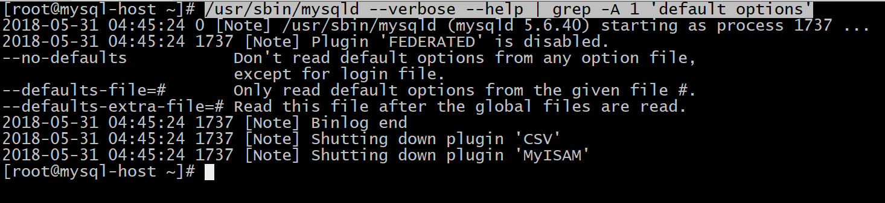

[TOC]

# 1.MYSQL数据库设计规范
## 1.1 数据库命名规范

采用26个英文字母(区分大小写)和0-9的自然数(经常不需要)加上下划线`_`组成;

命名简洁明确(长度不能超过30个字符);

例如：`user`, `stat`, `log`, 也可以`wifi_user`, `wifi_stat`, `wifi_log`给数据库加个前缀;

除非是备份数据库可以加0-9的自然数：user_db_20151210;

## 1.2 数据库表名命名规范
采用26个英文字母(区分大小写)和0-9的自然数(经常不需要)加上下划线`_`组成;

命名简洁明确,多个单词用下划线`_`分隔;
```text
user_login, user_profile, user_detail, user_role, user_role_relation,
user_role_right, user_role_right_relation
```

注：表前缀`user_`可以有效的把相同关系的表显示在一起;

## 1.3 数据库表字段名命名规范

采用26个英文字母(区分大小写)和0-9的自然数(经常不需要)加上下划线`_`组成;

命名简洁明确,多个单词用下划线`_`分隔;
```text
user_login表字段 user_id, user_name, pass_word, eamil, tickit, status, mobile, add_time;
```

每个表中必须有自增主键一般都是通过`add_time()`默认系统时间设置

表与表之间的相关联字段名称要求尽可能的相同;

## 1.4 数据库表字段类型规范
用尽量少的存储空间来存数一个字段的数据;
- 能使用`int`就不要使用`varchar`、`char`,能用`varchar(16)`就不要使用`varchar(256)`;

IP地址最好使用`int`类型;

固定长度的类型最好使用`char`例如：邮编;

能使用`tinyint`就不要使用`smallint`,`int`;

最好给每个字段一个默认值,最好不能为`null`(组合索引列存在null就不会生效);

## 1.5 数据库表索引规范
命名简洁明确。`user_login`表`user_name`字段的索引应为`user_name_index`唯一索引;

为每个表创建一个主键索引;

为每个表创建合理的索引;

建立复合索引请慎重要考虑是否会产生重复索引、复合索引列是否有null值等问题

## 1.6 简单熟悉数据库范式

第一范式(1NF)：字段值具有原子性,不能再分(所有关系型数据库系统都满足第一范式);
- 例如：姓名字段,其中姓和名是一个整体,如果区分姓和名那么必须设立两个独立字段;
         

第二范式(2NF)：一个表必须有主键,即每行数据都能被唯一的区分;
- 必须先满足第一范式;

第三范式(3NF)：一个表中不能包涵其他相关表中非关键字段的信息,即数据表不能有沉余字段;
- 必须先满足第二范式;
- 往往在设计表中不能遵守第三范式,因为合理的沉余字段将会减少`join`的查询;
  - 相册表中会添加图片的点击数字段,在相册图片表中也会添加图片的点击数字段;

# 2.MYSQL数据库设计原则
## 2.1 核心原则

不在数据库做运算;

cpu计算务必移至业务层;

控制列数量(字段少而精,字段数建议在20以内);

平衡范式与冗余(效率优先；往往牺牲范式)

拒绝3B
- 拒绝大sql语句：`big sql`
- 拒绝大事务：`big transaction`
- 拒绝大批量：`big batch`)

## 2.2 字段类原则

用好数值类型(用合适的字段类型节约空间);

字符转化为数字(能转化的最好转化,同样节约空间、提高查询性能);

避免使用`NULL`字段(`NULL`字段很难查询优化、`NULL`字段的索引需要额外空间、`NULL`字段的复合索引无效);

少用`text`类型
- 尽量使用`varchar`代替`text`字段

## 2.3 索引类原则

合理使用索引(改善查询,减慢更新,索引一定不是越多越好)

字符字段必须建前缀索引

不在索引列做列运算索引会无效

innodb主键推荐使用自增列(主键建立聚簇索引,主键不应该被修改,字符串不应该做主键)(理解Innodb的索引保存结构就知道了)

不用外键(由程序保证约束)

## 2.4 sql类原则
sql语句尽可能简单
- 一条sql只能在一个cpu运算,大语句拆小语句,减少锁时间,一条大sql可以堵死整个库

简单的事务;

避免使用`trig/func`(触发器、函数不用客户端程序取而代之);

不用`select *`
- 消耗cpu,io,内存,带宽,这种程序不具有扩展性

`OR`改写为`IN`(`or`的效率是n级别);

`OR`改写为`UNION`(mysql的索引合并很弱智);

```mysql
select id from t where phone = '159' or name = 'john';
# 改为union
select id from t where phone='159'
union
select id from t where name='jonh'
```

避免负向`%`

慎用`count(*)`

`limit`高效分页
- `limit`越大，效率越低

使用`union all`替代`union`
- `union`有去重开销

少用连接`join`

使用`group by`

请使用同类型比较

打散批量更新

# 3.数据库结构的优化

## 3.1 选择合适的数据类型

数据类型的选择，重点在于“合适”二字，如何确定选择的数据类型是否合适了？
- 使用可以存下你的数据的最小的数据类型
  - 时间类型数据：可以使用`varchar`类型，可以使用`int`类型，也可以使用时间戳类型
- 使用简单的数据类型
  - `int`要比`varchar`类型在mysql处理上简单。（`int`类型存储时间是最好的选择）
- 尽可能的使用`not null`定义字段
  - `innodb`的特性所决定，非`not null`的值，需要额外的在字段存储，同时也会增加IO和存储的开销
- 尽量少用`text`类型，非用不可时最好考虑分表。

### 3.1.1 `int`类型存储时间-时间转换

使用`int`来存储日期时间，利用`FROM_UNIXTIME()`、`UNIX_TIMESTAMP()`两个函数来进行转换。


```mysql
# 创建表
create table test(
id int auto_increment not null,
timestr int ,
primary key(id)
);

# 插入数据时使用unix_timestamp将日期格式的数据转换为`int`类型
insert into test (timestr) values (unix_timestamp('2018-05-29 16:00:00'));

mysql> select * from test;
+----+------------+
| id | timestr    |
+----+------------+
|  1 | 1527580800 |
+----+------------+
1 row in set (0.00 sec)

# 取出数据时使用FROM_UNIXTIME将`int`类型转换为时间格式
mysql> select FROM_UNIXTIME(timestr) from test;
+------------------------+
| FROM_UNIXTIME(timestr) |
+------------------------+
| 2018-05-29 16:00:00    |
+------------------------+
1 row in set (0.00 sec)
```
- `unix_timestamp()`函数是将日期格式的数据转换为`int`类型
- `FROM_UNIXTIME(timestr)`函数是将`int`类型转换为时间格式

### 3.1.2 ip地址的存储
在外部应用中，都要记录ip地址，大部分场合都是`varchar(15)`进行存储，就需要15个字节进行存储，但是`bigint`只需要8个字节进行存储，当数据量很大的时候（千万级别的数据），相差7个字节，不能小看这7个字节。
- 一个字段就多很多，那如果这样的字段需要上万个字段了？是需要很多的存储空间的。

使用`bigint(8)`来存储ip地址，利用`INET_ATON()`、`INET_NTOA()`两个函数来进行转换。


```mysql
# 创建表
create table sessions(
id int auto_increment not null,
ipaddress bigint,
primary key (id)
);

# 插入数据使用inet_aton函数将IP地址转换为bigint类型
insert into sessions (ipaddress)values (inet_aton('192.168.0.1'));

# 取出数据时使用inet_ntoa函数将bigint地址转换为IP地址
mysql> select inet_ntoa(ipaddress) from sessions;
+----------------------+
| inet_ntoa(ipaddress) |
+----------------------+
| 192.168.0.1          |
+----------------------+
1 row in set (0.00 sec)

# 检索
mysql> select * from sessions;
+----+------------+
| id | ipaddress  |
+----+------------+
|  1 | 3232235521 |
+----+------------+
1 row in set (0.00 sec)
```


## 3.2 数据库表的范式化优化
### 3.2.1 表范式化
范式化是指数据库设计的规范，目前说道范式化一般是指第三设计范式。也就是要求数据表中不存在非关键字段对任意候选关键字段的传递函数依赖则符合第三范式。

| 商品名称 | 价格 | 重量  | 有效期 | 分类 | 分类描述 |
| :------: | :--: | :---: | :----: | :--: | :------: |
|   可乐   | 3.00 | 250ml | 2014.6 | 饮料 | 碳酸饮料 |
|  北冰洋  | 3.00 | 250ml | 2014.7 | 饮料 | 碳酸饮料 |

存在以下传递函数依赖关系：（商品名称）->（分类）->（分类描述）
也就是说存在非关键字段 “分类描述”对关键字段“商品名称”的传递函数依赖。

不符合第三范式要求的表存在以下问题
- 数据冗余：（分类，分类描述）对于每一个商品都会进行记录。
- 数据的插入异常
- 数据的更新异常
- 数据的删除异常（删除所有数据，分类和分类描述都会删除，没有所有的记录）

如何转换成符合第三范式的表（拆分表）
- 将原来的不符合第三范式的表拆分为3个表商品表、分类表、分类和商品的关系表

| 商品名称 | 价格 | 重量  | 有效期 |   分类   | 分类描述 |
| :------: | :--: | :---: | :----: | :------: | :------: |
|   可乐   | 3.00 | 250ml | 2014.6 |   饮料   | 碳酸饮料 |
|   苹果   | 8.00 | 500g  |        | 生鲜食品 |   水果   |

| 商品名称 | 价格 | 重量  | 有效期 |
| :------: | :--: | :---: | :----: |
|   可乐   | 3.00 | 250ml | 2014.6 |
|   苹果   | 8.00 | 500g  |        |

|   分类   | 分类描述 |
| :------: | :------: |
| 酒水饮料 | 碳酸饮料 |
| 生鲜食品 |   水果   |

|   分类   | 商品名称 |
| :------: | :------: |
| 酒水饮料 | 可乐     |
| 生鲜食品 |   苹果   |


### 3.2.2 反范式化
反范式化是指为了查询效率的考虑把原本符合第三范式的表`适当`的增加冗余，以达到优化查询效率的目的，反范式化是一种以空间来换取时间的操作。


如何查询订单信息？
```mysql
select b.用户名，b.电话，b.地址，a.订单ID，sum(c.商品价格*c.商品数量) as 订单价格
from 订单表 as a
join 用户表 as b on a.用户ID=b.订单ID
join 订单商品表 as c on c.订单ID=b.订单ID
group by b.用户名，b.电话，b.地址，a.订单ID
```
对于这样的表结构，对于`sum()`，`group by`会产生临时表，增加IO量。怎么优化都效率不高，那怎么样才能让它效率高了，就需要一些字段进行冗余。


订单表中增加了冗余字段，那SQL该怎么写了？
```mysql
select a.用户名，a.电话，a.地址，a.订单ID,a.订单价格 
from 订单表 as a
```
- 表结构的设计直接涉及到SQL的查询效率及优化。

## 3.3 数据库表的垂直拆分

### 3.3.1 垂直拆分定义
所谓的垂直拆分，就是把原来一个有很多列的表拆分成多个表，这解决了表的宽度问题。

### 3.3.2 垂直拆分原则
通常垂直拆分可以按以下原则进行
- 把不常用的字段表单独存放到一个表中。
- 把大字段独立存放到一个表中。
- 把经常一起使用的字段放到一起。

以film表为例
```mysql
mysql> show create table film;
+-------+-----------------------------------------------------------------------------------------------------------------------------+
| Table | Create Table                                                                                                                
+-------+-----------------------------------------------------------------------------------------------------------------------------+
| film  | CREATE TABLE `film` (
  `film_id` smallint(5) unsigned NOT NULL AUTO_INCREMENT,
  `title` varchar(255) NOT NULL,
  `description` text,
  `release_year` year(4) DEFAULT NULL,
  `language_id` tinyint(3) unsigned NOT NULL,
  `original_language_id` tinyint(3) unsigned DEFAULT NULL,
  `rental_duration` tinyint(3) unsigned NOT NULL DEFAULT '3',
  `rental_rate` decimal(4,2) NOT NULL DEFAULT '4.99',
  `length` smallint(5) unsigned DEFAULT NULL,
  `replacement_cost` decimal(5,2) NOT NULL DEFAULT '19.99',
  `rating` enum('G','PG','PG-13','R','NC-17') DEFAULT 'G',
  `special_features` set('Trailers','Commentaries','Deleted Scenes','Behind the Scenes') DEFAULT NULL,
  `last_update` timestamp NOT NULL DEFAULT CURRENT_TIMESTAMP ON UPDATE CURRENT_TIMESTAMP,
  PRIMARY KEY (`film_id`),
  KEY `idx_title` (`title`),
  KEY `idx_fk_language_id` (`language_id`),
  KEY `idx_fk_original_language_id` (`original_language_id`),
  CONSTRAINT `fk_film_language` FOREIGN KEY (`language_id`) REFERENCES `language` (`language_id`) ON UPDATE CASCADE,
  CONSTRAINT `fk_film_language_original` FOREIGN KEY (`original_language_id`) REFERENCES `language` (`language_id`) ON UPDATE CASCADE
) ENGINE=InnoDB AUTO_INCREMENT=1001 DEFAULT CHARSET=utf8 |
+-------+-----------------------------------------------------------------------------------------------------------------------------+
1 row in set (0.00 sec)
```
在该表中`title`和`description`这两个字段占空间比较大，况且在使用频率也比较低，因此可以将其提取出来，将上面的一个达标垂直拆分为两个表`film`和`film_ext`


## 3.4 数据库表的水平拆分
### 3.4.1 为什么水平拆分
表的水平拆分是为了解决单表数据量过大的问题，水平拆分的表每一个表的结构都是完全一致的，以下面的`peyment`表为例来说明
```mysql
mysql> desc payment;
+--------------+----------------------+------+-----+-------------------+-----------------------------+
| Field        | Type                 | Null | Key | Default           | Extra                       |
+--------------+----------------------+------+-----+-------------------+-----------------------------+
| payment_id   | smallint(5) unsigned | NO   | PRI | NULL              | auto_increment              |
| customer_id  | smallint(5) unsigned | NO   | MUL | NULL              |                             |
| staff_id     | tinyint(3) unsigned  | NO   | MUL | NULL              |                             |
| rental_id    | int(11)              | YES  | MUL | NULL              |                             |
| amount       | decimal(5,2)         | NO   |     | NULL              |                             |
| payment_date | datetime             | NO   | MUL | NULL              |                             |
| last_update  | timestamp            | NO   |     | CURRENT_TIMESTAMP | on update CURRENT_TIMESTAMP |
+--------------+----------------------+------+-----+-------------------+-----------------------------+
7 rows in set (0.03 sec)

mysql> show create table payment;
+---------+-----------------------------------------------------------------------------------------------------------------------+
| Table   | Create Table                                                                                                          |
+---------+-----------------------------------------------------------------------------------------------------------------------+
| payment | CREATE TABLE `payment` (
  `payment_id` smallint(5) unsigned NOT NULL AUTO_INCREMENT,
  `customer_id` smallint(5) unsigned NOT NULL,
  `staff_id` tinyint(3) unsigned NOT NULL,
  `rental_id` int(11) DEFAULT NULL,
  `amount` decimal(5,2) NOT NULL,
  `payment_date` datetime NOT NULL,
  `last_update` timestamp NOT NULL DEFAULT CURRENT_TIMESTAMP ON UPDATE CURRENT_TIMESTAMP,
  PRIMARY KEY (`payment_id`),
  KEY `idx_fk_staff_id` (`staff_id`),
  KEY `idx_fk_customer_id` (`customer_id`),
  KEY `fk_payment_rental` (`rental_id`),
  KEY `inx_paydate` (`payment_date`),
  CONSTRAINT `fk_payment_customer` FOREIGN KEY (`customer_id`) REFERENCES `customer` (`customer_id`) ON UPDATE CASCADE,
  CONSTRAINT `fk_payment_rental` FOREIGN KEY (`rental_id`) REFERENCES `rental` (`rental_id`) ON DELETE SET NULL ON UPDATE CASCADE,
  CONSTRAINT `fk_payment_staff` FOREIGN KEY (`staff_id`) REFERENCES `staff` (`staff_id`) ON UPDATE CASCADE
) ENGINE=InnoDB AUTO_INCREMENT=16050 DEFAULT CHARSET=utf8 |
+---------+-----------------------------------------------------------------------------------------------------------------------+
1 row in set (0.00 sec)
```


### 3.4.2 水平拆分原因
如果单表的数据量达到上亿条，那么这时候尽管加了完美的索引，查询效率低，写入的效率也相应的降低。

### 3.4.3 如何将数据平均分为N份
通常水平拆分的方法为
- 对`customer_id`进行hash运算，如果要拆分为5个表则使用`mod(customer_id，5)`取出0-4个值。
- 针对不动的`hashid`把数据存储到不同的表中。

### 3.4.4 水平拆分面临的挑战

跨分区表进行数据查询
- 前端业务统计。业务上给不同的用户返回不同的业务信息，对分区表没有大的挑战。
统计及后台报表操作
- 但是对后台进行报表统计时，数据量比较大，后台统计时效性比较低，后台就用汇总表，将前后台的表拆分开。

# 4.数据库系统配置优化

数据库是基于操作系统的，目前大多数MySQL都是安装在linux系统之上，所以对于操作系统的一些参数配置也会影响到MySQL的性能。

## 4.1 优化配置参数-操作系统

优化包括操作系统的优化及MySQL的优化

### 4.1.1 操作系统的优化
网络方面的配置，要修改`/etc/sysctl.conf`
- 增加tcp支持的队列数
  ```properties
  net.ipv4.tcp_max_syn_backlog = 65535
  ```
- 减少断开连接时，资源回收(tcp有连接状态)
```properties
net.ipv4.tcp_max_tw_buckets = 8000 //
net.ipv4.tcp_tw_reuse = 1
net.ipv4.tcp_tw_recycle = 1
net.ipv4.tcp_fin_timeout = 10
```
  - TCP是有连接状态，通过`netstat`查看连接状态，经常会看到`timeout`状态或者`timewait`状态连接，为了加快`timewait`状态的连接回收，就需要调整上面的四个参数，保持TCP连接数在一个适当的状态。

### 4.1.2 打开文件数的限制
打开文件数的限制，可以使用`ulimit –a`查看目录的各个限制，可以修改`/etc/security/limits.conf`文件，增加以下内容以修改打开文件数量的限制（永久生效）
```properties
*Soft nofile 65535
*Hard nofile 65535
```
如果一次有效，就要使用`ulimit –n 65535`即可。（默认情况是1024）

除此之外最好在MySQL服务器上关闭`iptables`、`selinux`等防火墙软件。

## 4.2 优化配置参数- MySQL配置文件优化

### 4.2.1 MySQL配置文件修改
Mysql可以通过启动时指定参数和使用配置文件两种方法进行配置，在大多数情况下配置文件位于`/etc/my.cnf` 或者是 `/etc/mysql/my.cnf`在Windows系统配置文件可以是位于`C://windows//my.ini`文件，MySQL查找配置文件的顺序可以通过以下方法获得。

```shell script
/usr/sbin/mysqld --verbose --help | grep -A 1 'default options'
```




注意：如果存在多个位置存在配置文件，则后面的会覆盖前面的。

## 4.3 MySQL配置文件-常用参数说明
> 详细配置项参见[my.cnf](./my.cnf)

### 4.3.1 连接请求的变量
#### 4.3.1.1 `max_connections`
MySQL的最大连接数，增加该值增加`mysqld` 要求的文件描述符的数量。如果服务器的并发连接请求量比较大，建议调高此值，以增加并行连接数量，当然这建立在机器能支撑的情况下，因为如果连接数越多，介于MySQL会为每个连接提供连接缓冲区，就会开销越多的内存，所以要适当调整该值，不能盲目提高设值。

`max_connections`数值过小会经常出现`ERROR 1040: Too many connections`错误，可以过`conn%`通配符查看当前状态的连接数量，以定夺该值的大小。
```mysql
# 最大连接数
mysql> show variables like 'max_connections';
+-----------------+-------+
| Variable_name   | Value |
+-----------------+-------+
| max_connections | 151   |
+-----------------+-------+
1 row in set (0.00 sec)
# 响应的连接数
mysql> show status like 'max_used_connections';
+----------------------+-------+
| Variable_name        | Value |
+----------------------+-------+
| Max_used_connections | 4     |
+----------------------+-------+
1 row in set (0.00 sec)

mysql> show variables like 'max_used_connections';
Empty set (0.00 sec)
```

理想值设置为多大才合适了？
- `max_used_connections / max_connections * 100%` 理想值 ≈ 85%
- 如果`max_used_connections`跟`max_connections`相同 那么就是`max_connections`设置过低或者超过服务器负载上限了，低于`10%`则设置过大。

#### 4.3.1.2 back_log
MySQL能暂存的连接数量。当主要MySQL线程在一个很短时间内得到非常多的连接请求，这就起作用。如果MySQL的连接数据达到`max_connections`时，新来的请求将会被存在堆栈中，以等待某一连接释放资源，该堆栈的数量即`back_log`，如果等待连接的数量超过`back_log`，将不被授予连接资源。

`back_log`值指出在MySQL暂时停止回答新请求之前的短时间内有多少个请求可以被存在堆栈中。只有如果期望在一个短时间内有很多连接，需要增加它，换句话说，这值对到来的TCP/IP连接的侦听队列的大小。

当观察主机进程列表`mysql> show full processlist`，发现大量`264084 | unauthenticated user | xxx.xxx.xxx.xxx | NULL | Connect | NULL | login | NULL `的待连接进程时，就要加大`back_log` 的值了。

默认数值是`50`，可调优为`128`，对于Linux系统设置范围为小于`512`的整数。
```shell script
mysql> show full processlist;
+----+------+-----------+--------+---------+------+-------+-----------------------+
| Id | User | Host      | db     | Command | Time | State | Info                  |
+----+------+-----------+--------+---------+------+-------+-----------------------+
| 54 | root | localhost | sakila | Query   |    0 | init  | show full processlist |
+----+------+-----------+--------+---------+------+-------+-----------------------+
1 row in set (0.00 sec)
```

#### 4.3.1.3 interactive_timeout
一个交互连接在被服务器在关闭前等待行动的秒数。一个交互的客户被定义为对`mysql_real_connect()`使用`CLIENT_INTERACTIVE`选项的客户。

默认数值是`28800`，可调优为`7200`。

### 4.3.2 缓冲区变量
> 全局缓冲
>
#### 4.3.2.1 key_buffer_size
`key_buffer_size`指定索引缓冲区的大小，它决定索引处理的速度，尤其是索引读的速度。通过检查状态值`Key_read_requests`和`Key_reads`，可以知道`key_buffer_size`设置是否合理。比例`key_reads / key_read_requests`应该尽可能的低，至少是`1:100`，`1:1000`更好
- 上述状态值可以使用`SHOW STATUS LIKE 'key_read%'`获得
  ```mysql
  mysql> SHOW STATUS LIKE 'key_read%';
  +-------------------+-------+
  | Variable_name     | Value |
  +-------------------+-------+
  | Key_read_requests | 58    |
  | Key_reads         | 6     |
  +-------------------+-------+
  2 rows in set (0.00 sec)
  ```

`key_buffer_size`只对`MyISAM`表起作用。即使不使用`MyISAM`表，但是内部的临时磁盘表是`MyISAM`表，也要使用该值。可以使用检查状态值`created_tmp_disk_tables`得知详情。
```mysql
mysql> show status like 'created_tmp_disk_tables';
+-------------------------+-------+
| Variable_name           | Value |
+-------------------------+-------+
| Created_tmp_disk_tables | 0     |
+-------------------------+-------+
1 row in set (0.00 sec)
```


```mysql
mysql> show variables like 'key_buffer_size';
+-----------------+---------+
| Variable_name   | Value   |
+-----------------+---------+
| key_buffer_size | 8388608 |
+-----------------+---------+
1 row in set (0.00 sec)
```

`key_buffer_size`为`512MB`，再看一下`key_buffer_size`的使用情况：
```mysql
mysql> show global status like 'key_read%';
+-------------------+-------+
| Variable_name     | Value |
+-------------------+-------+
| Key_read_requests | 4    |
| Key_reads         | 2     |
+-------------------+-------+
2 rows in set (0.00 sec)
```

一共有`27813678764`个索引读取请求，有`6798830`个请求在内存中没有找到直接从硬盘读取索引，计算索引未命中缓存的概率`key_cache_miss_rate ＝Key_reads / Key_read_requests * 100%`，设置在`1/1000`左右较好。
- 默认配置数值是`8388600(8M)`，主机有4GB内存，可以调优值`268435456(256MB)`。

#### 4.3.2.2 query_cache_size
使用查询缓冲，MySQL将查询结果存放在缓冲区中，今后对于同样的`SELECT`语句（区分大小写），将直接从缓冲区中读取结果。通过检查状态值`Qcache_*`，可以知道`query_cache_size`设置是否合理
- 状态值可以使用`SHOW STATUS LIKE 'Qcache%'`获得
  ```mysql
  mysql> SHOW STATUS LIKE 'Qcache%';
  +-------------------------+-------+
  | Variable_name           | Value |
  +-------------------------+-------+
  | Qcache_free_blocks      | 0     |
  | Qcache_free_memory      | 0     |
  | Qcache_hits             | 0     |
  | Qcache_inserts          | 0     |
  | Qcache_lowmem_prunes    | 0     |
  | Qcache_not_cached       | 0     |
  | Qcache_queries_in_cache | 0     |
  | Qcache_total_blocks     | 0     |
  +-------------------------+-------+
  8 rows in set (0.00 sec)
  ```

如果`Qcache_lowmem_prunes`的值非常大，则表明经常出现缓冲不够的情况，如果`Qcache_hits`的值也非常大，则表明查询缓冲使用非常频繁，此时需要增加缓冲大小；如果`Qcache_hits`的值不大，则表明查询重复率很低，这种情况下使用查询缓冲反而会影响效率，那么可以考虑不用查询缓冲。此外，在`SELECT`语句中加入`SQL_NO_CACHE`可以明确表示不使用查询缓冲。

与查询缓冲有关的参数还有`query_cache_type`、`query_cache_limit`、`query_cache_min_res_unit`
- `query_cache_type`指定是否使用查询缓冲，可以设置为`0`、`1`、`2`，该变量是`SESSION`级的变量。
- `query_cache_limit`指定单个查询能够使用的缓冲区大小，缺省为`1M`。
- `query_cache_min_res_unit`是在4.1版本以后引入的，它指定分配缓冲区空间的最小单位，缺省为`4K`。检查状态值`Qcache_free_blocks`，如果该值非常大，则表明缓冲区中碎片很多，这就表明查询结果都比较小，此时需要减小`query_cache_min_res_unit`。

```mysql
mysql> show global status like 'qcache%';
+-------------------------+---------+
| Variable_name           | Value   |
+-------------------------+---------+
| Qcache_free_blocks      | 1       |
| Qcache_free_memory      | 1031352 |
| Qcache_hits             | 0       |
| Qcache_inserts          | 0       |
| Qcache_lowmem_prunes    | 0       |
| Qcache_not_cached       | 38      |
| Qcache_queries_in_cache | 0       |
| Qcache_total_blocks     | 1       |
+-------------------------+---------+
8 rows in set (0.00 sec)
```

查询缓存碎片率 = `Qcache_free_blocks` / `Qcache_total_blocks` * `100%`
- 如果查询缓存碎片率超过`20%`，可以用`FLUSH QUERY CACHE`整理缓存碎片，或者试试减小`query_cache_min_res_unit`，如果查询都是小数据量的话。

查询缓存利用率 = (`query_cache_size` – `Qcache_free_memory`) / `query_cache_size` * `100%`
- 查询缓存利用率在`25%`以下的话说明`query_cache_size`设置的过大，可适当减小；查询缓存利用率在`80％`以上而且`Qcache_lowmem_prunes > 50`的话说明`query_cache_size`可能有点小，要不就是碎片太多。

查询缓存命中率 = (`Qcache_hits` – `Qcache_inserts`) / `Qcache_hits` * `100%`
- 服务器查询缓存碎片率为`20.46％`，查询缓存利用率为`62.26％`，查询缓存命中率为`1.94％`，命中率很差，可能写操作比较频繁吧，而且可能有些碎片。

#### 4.3.2.3 record_buffer_size
每个进行一个顺序扫描的线程为其扫描的每张表分配这个大小的一个缓冲区。如果做很多顺序扫描，可能要增加该值。

默认数值是`131072(128K)`，可改为`16773120 (16M)`

#### 4.3.2.4 read_rnd_buffer_size
随机读缓冲区大小。当按任意顺序读取行时(例如，按照排序顺序)，将分配一个随机读缓存区。进行排序查询时，MySQL会首先扫描一遍该缓冲，以避免磁盘搜索，提高查询速度，如果需要排序大量数据，可适当调高该值。但MySQL会为每个客户连接发放该缓冲空间，所以应尽量适当设置该值，以避免内存开销过大。一般可设置为`16M`

#### 4.3.2.5 sort_buffer_size
每个需要进行排序的线程分配该大小的一个缓冲区。增加这值加速`ORDER BY`或`GROUP BY`操作。

默认数值是`2097144(2M)`，可改为`16777208(16M)`。

#### 4.3.2.6 join_buffer_size

联合查询操作所能使用的缓冲区大小。

`record_buffer_size`，`read_rnd_buffer_size`，`sort_buffer_size`，`join_buffer_size`为每个线程独占，也就是说，如果有100个线程连接，则占用为`16M*100`

#### 4.3.2.7 table_cache

表高速缓存的大小

每当MySQL访问一个表时，如果在表缓冲区中还有空间，该表就被打开并放入其中，这样可以更快地访问表内容。通过检查峰值时间的状态值`Open_tables`和`Opened_tables`，可以决定是否需要增加`table_cache`的值。如果发现`open_tables`等于`table_cache`，并且`opened_tables`在不断增长，那么就需要增加`table_cache`的值了
- 状态值可以使用`SHOW STATUS LIKE 'Open%tables'`获得
  ```mysql
  mysql> SHOW STATUS LIKE 'Open%tables';
  +---------------+-------+
  | Variable_name | Value |
  +---------------+-------+
  | Open_tables   | 90    |
  | Opened_tables | 0     |
  +---------------+-------+
  2 rows in set (0.00 sec)
  ```

注意，不能盲目地把`table_cache`设置成很大的值。如果设置得太高，可能会造成文件描述符不足，从而造成性能不稳定或者连接失败。
- `1G`内存机器，推荐值是`128－256`。内存在`4GB`左右的服务器该参数可设置为`256M`或`384M`。

#### 4.3.2.8 max_heap_table_size

用户可以创建的内存表(memory table)的大小。这个值用来计算内存表的最大行数值。这个变量支持动态改变`set @max_heap_table_size=#`

这个变量和`tmp_table_size`一起限制了内部内存表的大小。如果某个内部heap（堆积）表大小超过`tmp_table_size`，MySQL可以根据需要自动将内存中的heap表改为基于硬盘的`MyISAM`表。

#### 4.3.2.9 tmp_table_size
通过设置`tmp_table_size`选项来增加一张临时表的大小，例如做高级`GROUP BY`操作生成的临时表。如果调高该值，MySQL同时将增加heap表的大小，可达到提高联接查询速度的效果，建议尽量优化查询，要确保查询过程中生成的临时表在内存中，避免临时表过大导致生成基于硬盘的`MyISAM`表。
```mysql
mysql> show global status like 'created_tmp%';
+-------------------------+-------+
| Variable_name           | Value |
+-------------------------+-------+
| Created_tmp_disk_tables | 7    |
| Created_tmp_files       | 6     |
| Created_tmp_tables      | 35   |
+-------------------------+-------+
3 rows in set (0.00 sec)
```

- 每次创建临时表，`Created_tmp_tables`增加，如果临时表大小超过`tmp_table_size`，则是在磁盘上创建临时表，`Created_tmp_disk_tables`也增加

- `Created_tmp_files`表示MySQL服务创建的临时文件文件数，比较理想的配置是`Created_tmp_disk_tables` / `Created_tmp_tables` * `100%` <= `25%`比如上面的服务器`Created_tmp_disk_tables` / `Created_tmp_tables` * 100% ＝`1.20%`，应该相当好了

默认为`16M`，可调到`64-256`最佳，线程独占，太大可能内存不够I/O堵塞

#### 4.3.2.10 thread_cache_size
可以复用的保存在中的线程的数量。如果有，新的线程从缓存中取得，当断开连接的时候如果有空间，客户的线置在缓存中。如果有很多新的线程，为了提高性能可以这个变量值。

通过比较 `Connections`和`Threads_created`状态的变量，可以看到这个变量的作用。
- 默认值为`110`，可调优为`80`。

#### 4.3.2.11 thread_concurrency

推荐设置为服务器 CPU核数的2倍
- 双核的CPU, 那么`thread_concurrency`的应该为`4`
- 2个双核的cpu, `thread_concurrency`的值应为`8`

#### 4.3.2.12 wait_timeout

指定一个请求的最大连接时间，对于4GB左右内存的服务器可以设置为`5-10`。

### 4.3.3 配置`InnoDB`的几个变量
#### 4.3.3.1 `innodb_buffer_pool_size`
对于`InnoDB`表来说，`innodb_buffer_pool_size`的作用就相当于`key_buffer_size`对于`MyISAM`表的作用一样。`InnoDB`使用该参数指定大小的内存来缓冲数据和索引。对于单独的MySQL数据库服务器，最大可以把该值设置成物理内存的`80%`。

根据MySQL手册，对于`2G`内存的机器，推荐值是`1G(50%)`。
```mysql
mysql> show status like 'innodb%';
+---------------------------------------+-------------+
| Variable_name                         | Value       |
+---------------------------------------+-------------+
| Innodb_buffer_pool_dump_status        | not started |
| Innodb_buffer_pool_load_status        | not started |
| Innodb_buffer_pool_pages_data         | 1034        |
| Innodb_buffer_pool_bytes_data         | 16941056    |
| Innodb_buffer_pool_pages_dirty        | 0           |
| Innodb_buffer_pool_bytes_dirty        | 0           |
| Innodb_buffer_pool_pages_flushed      | 1512        |
| Innodb_buffer_pool_pages_free         | 11112       |
| Innodb_buffer_pool_pages_misc         | 14          |
| Innodb_buffer_pool_pages_total        | 12160       |
| Innodb_buffer_pool_read_ahead_rnd     | 0           |
| Innodb_buffer_pool_read_ahead         | 0           |
| Innodb_buffer_pool_read_ahead_evicted | 0           |
| Innodb_buffer_pool_read_requests      | 502142      |
| Innodb_buffer_pool_reads              | 488         |
| Innodb_buffer_pool_wait_free          | 0           |
| Innodb_buffer_pool_write_requests     | 258500      |
| Innodb_data_fsyncs                    | 959         |
| Innodb_data_pending_fsyncs            | 0           |
| Innodb_data_pending_reads             | 0           |
| Innodb_data_pending_writes            | 0           |
| Innodb_data_read                      | 10162176    |
| Innodb_data_reads                     | 709         |
| Innodb_data_writes                    | 2256        |
| Innodb_data_written                   | 57477120    |
| Innodb_dblwr_pages_written            | 1512        |
| Innodb_dblwr_writes                   | 62          |
| Innodb_have_atomic_builtins           | ON          |
| Innodb_log_waits                      | 0           |
| Innodb_log_write_requests             | 16194       |
| Innodb_log_writes                     | 267         |
| Innodb_os_log_fsyncs                  | 325         |
| Innodb_os_log_pending_fsyncs          | 0           |
| Innodb_os_log_pending_writes          | 0           |
| Innodb_os_log_written                 | 7900672     |
| Innodb_page_size                      | 16384       |
| Innodb_pages_created                  | 547         |
| Innodb_pages_read                     | 487         |
| Innodb_pages_written                  | 1512        |
| Innodb_row_lock_current_waits         | 0           |
| Innodb_row_lock_time                  | 0           |
| Innodb_row_lock_time_avg              | 0           |
| Innodb_row_lock_time_max              | 0           |
| Innodb_row_lock_waits                 | 0           |
| Innodb_rows_deleted                   | 1           |
| Innodb_rows_inserted                  | 47300       |
| Innodb_rows_read                      | 71256       |
| Innodb_rows_updated                   | 1           |
| Innodb_num_open_files                 | 45          |
| Innodb_truncated_status_writes        | 0           |
| Innodb_available_undo_logs            | 128         |
+---------------------------------------+-------------+
51 rows in set (0.00 sec)
```

#### 4.3.3.2 `innodb_flush_log_at_trx_commit`
主要控制了`innodb`将`log buffer`中的数据写入日志文件并`flush`磁盘的时间点，取值分别为`0`、`1`、`2`三个
- `0`表示当事务提交时，不做日志写入操作，而是每秒钟将`log buffer`中的数据写入日志文件并`flush`磁盘一次
- `1`则在每秒钟或是每次事物的提交都会引起日志文件写入、`flush`磁盘的操作，确保了事务的`ACID`
- `2`每次事务提交引起写入日志文件的动作，但每秒钟完成一次`flush`磁盘操作。

实际测试发现，该值对插入数据的速度影响非常大
- 设置为`2`时插入`10000`条记录只需要`2`秒，设置为0时只需要1秒
- 设置为`1`时则需要`229`秒

因此，MySQL手册也建议尽量将插入操作合并成一个事务，这样可以大幅提高速度。

根据MySQL手册，在允许丢失最近部分事务的危险的前提下，可以把该值设为`0`或`2`。

#### 4.3.3.3 innodb_log_buffer_size

`log`缓存大小，一般为`1-8M`，默认为`1M`，对于较大的事务，可以增大缓存大小。可设置为`4M`或`8M`。

#### 4.3.3.4 innodb_additional_mem_pool_size
该参数指定`InnoDB`用来存储数据字典和其他内部数据结构的内存池大小。缺省值是`1M`。通常不用太大，只要够用就行，应该与表结构的复杂度有关系。如果不够用，MySQL会在错误日志中写入一条警告信息。

根据MySQL手册，对于`2G`内存的机器，推荐值是`20M`，可适当增加。

`innodb_thread_concurrency=8` 推荐设置为` 2*(NumCPUs+NumDisks)`，默认一般为`8`

```properties
[client]
port = 3306
socket = /tmp/mysql.sock
[mysqld]
port = 3306
socket = /tmp/mysql.sock
basedir = /usr/local/mysql
datadir = /data/mysql
pid-file = /data/mysql/mysql.pid
user = mysql
bind-address = 0.0.0.0
server-id = 1 #表示是本机的序号为1,一般来讲就是master的意思
```

#### 4.3.3.5 `skip-name-resolve`

禁止MySQL对外部连接进行DNS解析，使用这一选项可以消除MySQL进行DNS解析的时间。但需要注意，如果开启该选项，则所有远程主机连接授权都要使用IP地址方式，否则MySQL将无法正常处理连接请求

#### 4.3.3.6 其他配置项

> 更多的配置项参见[my.cnf](./my.cnf)


`skip-networking`

`back_log = 600`MySQL能有的连接数量。当主要MySQL线程在一个很短时间内得到非常多的连接请求，这就起作用，然后主线程花些时间(尽管很短)检查连接并且启动一个新线程。`back_log`值指出在MySQL暂时停止回答新请求之前的短时间内多少个请求可以被存在堆栈中。如果期望在一个短时间内有很多连接，需要增加它。也就是说，如果MySQL的连接数据达到`max_connections`时，新来的请求将会被存在堆栈中，以等待某一连接释放资源，该堆栈的数量即`back_log`，如果等待连接的数量超过`back_log`，将不被授予连接资源。另外，这`back_log`值限于您的操作系统对到来的TCP/IP连接的侦听队列的大小。操作系统在这个队列大小上有它自己的限制（可以检查你的OS文档找出这个变量的最大值），试图设定`back_log`高于操作系统的限制将是无效的。

`max_connections = 1000`MySQL的最大连接数，如果服务器的并发连接请求量比较大，建议调高此值，以增加并行连接数量，当然这建立在机器能支撑的情况下，因为如果连接数越多，介于MySQL会为每个连接提供连接缓冲区，就会开销越多的内存，所以要适当调整该值，不能盲目提高设值。可以过`conn%`通配符查看当前状态的连接数量，以定夺该值的大小。

`max_connect_errors = 6000`对于同一主机，如果有超出该参数值个数的中断错误连接，则该主机将被禁止连接。如需对该主机进行解禁，执行 `FLUSH HOST`。

`open_files_limit = 65535`MySQL打开的文件描述符限制，默认最小`1024`
- 当`open_files_limit`没有被配置的时候，比较`max_connections*5`和`ulimit -n`的值，哪个大用哪个
- 当`open_file_limit`被配置的时候，比较`open_files_limit`和`max_connections*5`的值，哪个大用哪个。

`table_open_cache = 128`MySQL每打开一个表，都会读入一些数据到`table_open_cache`缓存中，当MySQL在这个缓存中找不到相应信息时，才会去磁盘上读取。默认值`64`
- 假定系统有`200`个并发连接，则需将此参数设置为`200*N`(`N`为每个连接所需的文件描述符数目)；
- 当把`table_open_cache`设置为很大时，如果系统处理不了那么多文件描述符，那么就会出现客户端失效，连接不上

`max_allowed_packet = 4M`接受的数据包大小；增加该变量的值十分安全，这是因为仅当需要时才会分配额外内存。
- 仅当发出长查询或MySQLd必须返回大的结果行时MySQLd才会分配更多内存。
- 该变量之所以取较小默认值是一种预防措施，以捕获客户端和服务器之间的错误信息包，并确保不会因偶然使用大的信息包而导致内存溢出。

`binlog_cache_size = 1M`一个事务，在没有提交的时候，产生的日志，记录到`Cache`中；等到事务提交需要提交的时候，则把日志持久化到磁盘。默认`binlog_cache_size`大小`32K`

`max_heap_table_size = 8M`定义了用户可以创建的内存表(memory table)的大小。这个值用来计算内存表的最大行数值。这个变量支持动态改变

`tmp_table_size = 16M`MySQL的heap（堆积）表缓冲大小。所有联合在一个`DML`指令内完成，并且大多数联合甚至可以不用临时表即可以完成。大多数临时表是基于内存的(HEAP)表。具有大的记录长度的临时表 (所有列的长度的和)或包含BLOB列的表存储在硬盘上。如果某个内部heap（堆积）表大小超过`tmp_table_size`，MySQL可以根据需要自动将内存中的heap表改为基于硬盘的`MyISAM`表。还可以通过设置`tmp_table_size`选项来增加临时表的大小。也就是说，如果调高该值，MySQL同时将增加heap表的大小，可达到提高联接查询速度的效果

`read_buffer_size = 2M`MySQL读入缓冲区大小。对表进行顺序扫描的请求将分配一个读入缓冲区，MySQL会为它分配一段内存缓冲区。`read_buffer_size`变量控制这一缓冲区的大小。如果对表的顺序扫描请求非常频繁，并且认为频繁扫描进行得太慢，可以通过增加该变量值以及内存缓冲区大小提高其性能

`read_rnd_buffer_size = 8M`MySQL的随机读缓冲区大小。当按任意顺序读取行时(例如，按照排序顺序)，将分配一个随机读缓存区。进行排序查询时，MySQL会首先扫描一遍该缓冲，以避免磁盘搜索，提高查询速度，如果需要排序大量数据，可适当调高该值。但MySQL会为每个客户连接发放该缓冲空间，所以应尽量适当设置该值，以避免内存开销过大

`sort_buffer_size = 8M`MySQL执行排序使用的缓冲大小。如果想要增加`ORDER BY`的速度，首先看是否可以让MySQL使用索引而不是额外的排序阶段。如果不能，可以尝试增加`sort_buffer_size`变量的大小

`join_buffer_size = 8M`联合查询操作所能使用的缓冲区大小，和`sort_buffer_size`一样，该参数对应的分配内存也是每连接独享

`thread_cache_size = 8`这个值（默认`8`）表示可以重新利用保存在缓存中线程的数量，当断开连接时如果缓存中还有空间，那么客户端的线程将被放到缓存中，如果线程重新被请求，那么请求将从缓存中读取,如果缓存中是空的或者是新的请求，那么这个线程将被重新创建,如果有很多新的线程，增加这个值可以改善系统性能.通过比较`Connections`和`Threads_created`状态的变量，可以看到这个变量的作用。
```text
# 根据物理内存设置规则如下：
# 1G —> 8
# 2G —> 16
# 3G —> 32
# 大于3G —> 64
```

`query_cache_size = 8M`MySQL的查询缓冲大小（从4.0.1开始，MySQL提供了查询缓冲机制）使用查询缓冲，MySQL将`SELECT`语句和查询结果存放在缓冲区中，今后对于同样的`SELECT`语句（区分大小写），将直接从缓冲区中读取结果。根据MySQL用户手册，使用查询缓冲最多可以达到`238%`的效率。
- 通过检查状态值`Qcache_%`，可以知道`query_cache_size`设置是否合理
  - 如果`Qcache_lowmem_prunes`的值非常大，则表明经常出现缓冲不够的情况，如果`Qcache_hits`的值也非常大，则表明查询缓冲使用非常频繁，此时需要增加缓冲大小；如果`Qcache_hits`的值不大，则表明你的查询重复率很低，这种情况下使用查询缓冲反而会影响效率，那么可以考虑不用查询缓冲。此外，在`SELECT`语句中加入`SQL_NO_CACHE`可以明确表示不使用查询缓冲

`query_cache_limit = 2M`指定单个查询能够使用的缓冲区大小，默认`1M`

`key_buffer_size = 4M`指定用于索引的缓冲区大小，增加它可得到更好处理的索引(对所有读和多重写)，到你能负担得起那样多。如果你使它太大，系统将开始换页并且真的变慢了。对于内存在4GB左右的服务器该参数可设置为`384M`或`512M`。
- 通过检查状态值`Key_read_requests`和`Key_reads`，可以知道`key_buffer_size`设置是否合理。比例`key_reads/key_read_requests`应该尽可能的低，至少是`1:100`，`1:1000`更好
  - 状态值可以使用`SHOW STATUS LIKE 'key_read%'`获得
 - 注意：该参数值设置的过大反而会是服务器整体效率降低

`ft_min_word_len = 4`分词词汇最小长度，默认`4`

`transaction_isolation = REPEATABLE-READ`MySQL支持4种事务隔离级别
- `READ-UNCOMMITTED`
- `READ-COMMITTED`
- `REPEATABLE-READ`
- `SERIALIZABLE`
如没有指定，MySQL默认采用的是`REPEATABLE-READ`，ORACLE默认的是`READ-COMMITTED`

```properties
log_bin = mysql-bin
binlog_format = mixed
expire_logs_days = 30 #超过30天的binlog删除
log_error = /data/mysql/mysql-error.log #错误日志路径
slow_query_log = 1
long_query_time = 1 #慢查询时间 超过1秒则为慢查询
slow_query_log_file = /data/mysql/mysql-slow.log
performance_schema = 0
explicit_defaults_for_timestamp
#lower_case_table_names = 1 #不区分大小写
skip-external-locking #MySQL选项以避免外部锁定。该选项默认开启
default-storage-engine = InnoDB #默认存储引擎
```

`innodb_file_per_table = 1`InnoDB为独立表空间模式，每个数据库的每个表都会生成一个数据空间
- 独立表空间优点：
  - 每个表都有自已独立的表空间。
  - 每个表的数据和索引都会存在自已的表空间中。
  - 可以实现单表在不同的数据库中移动。
  - 空间可以回收（除`drop table`操作处，表空不能自已回收）
- 缺点：单表增加过大，如超过100G
- 结论：共享表空间在`Insert`操作上少有优势。其它都没独立表空间表现好。当启用独立表空间时，请合理调整`innodb_open_files`

`innodb_open_files = 500`限制`Innodb`能打开的表的数据，如果库里的表特别多的情况，请增加这个。这个值默认是`300`

`innodb_buffer_pool_size = 64M` InnoDB使用一个缓冲池来保存索引和原始数据, 不像`MyISAM`.
- 这里设置越大,在存取表里面数据时所需要的磁盘I/O越少.
- 在一个独立使用的数据库服务器上,可以设置这个变量到服务器物理内存大小的`80%`
- 不要设置过大,否则,由于物理内存的竞争可能导致操作系统的换页颠簸.
- 注意在32位系统上你每个进程可能被限制在 `2-3.5G` 用户层面内存限制,所以不要设置的太高.

`innodb_write_io_threads = 4`、`innodb_read_io_threads = 4`innodb使用后台线程处理数据页上的读写 I/O(输入输出)请求,根据 CPU 核数来更改,默认是`4`
- 这两个参数不支持动态改变,需要把该参数加入到`my.cnf`里，修改完后重启MySQL服务,允许值的范围从 `1-64`

`innodb_thread_concurrency = 0`默认设置为 `0`,表示不限制并发数，这里推荐设置为`0`，更好去发挥CPU多核处理能力，提高并发量

`innodb_purge_threads = 1`InnoDB中的清除操作是一类定期回收无用数据的操作。在之前的几个版本中，清除操作是主线程的一部分，这意味着运行时它可能会堵塞其它的数据库操作。从MySQL5.5.X版本开始，该操作运行于独立的线程中,并支持更多的并发数。用户可通过设置`innodb_purge_threads`配置参数来选择清除操作是否使用单独线程,默认情况下参数设置为0(不使用单独线程),设置为 `1` 时表示使用单独的清除线程。建议为`1`

`innodb_flush_log_at_trx_commit = 2`
- 值三种情况
  - 如果`innodb_flush_log_at_trx_commit`的值为`0`,`log buffer`每秒就会被刷写日志文件到磁盘，提交事务的时候不做任何操作（执行是由mysql的`master thread
 `线程来执行的。主线程中每秒会将重做日志缓冲写入磁盘的重做日志文件(REDO LOG)中。不论事务是否已经提交）默认的日志文件是`ib_logfile0`,`ib_logfile1`
  - 当设为默认值`1`的时候，每次提交事务的时候，都会将`log buffer`刷写到日志。
  - 如果设为`2`,每次提交事务都会写日志，但并不会执行刷的操作。每秒定时会刷到日志文件。要注意的是，并不能保证`100%`每秒一定都会刷到磁盘，这要取决于进程的调度。

- 每次事务提交的时候将数据写入事务日志，而这里的写入仅是调用了文件系统的写入操作，而文件系统是有缓存的，所以这个写入并不能保证数据已经写入到物理磁盘默认值`1`是为了保证完整的`ACID`。
  - 当然，可以将这个配置项设为`1`以外的值来换取更高的性能，但是在系统崩溃的时候，将会丢失`1`秒的数据。
  - 设为`0`的话，`mysqld`进程崩溃的时候，就会丢失最后`1`秒的事务
  - 设为`2`,只有在操作系统崩溃或者断电的时候才会丢失最后`1`秒的数据。InnoDB在做恢复的时候会忽略这个值。
- 总结
  - 设`为1`当然是最安全的，但性能页是最差的（相对其他两个参数而言，但不是不能接受）。如果对数据一致性和完整性要求不高，完全可以设为`2`，如果只最求性能，例如高并发写的日志服务器，设为`0`来获得更高性能

`innodb_log_buffer_size = 2M`此参数确定些日志文件所用的内存大小，以M为单位。缓冲区更大能提高性能，但意外的故障将会丢失数据。MySQL开发人员建议设置为`1－8M`之间

`innodb_log_file_size = 32M`此参数确定数据日志文件的大小，更大的设置可以提高性能，但也会增加恢复故障数据库所需的时间

`innodb_log_files_in_group = 3`为提高性能，MySQL可以以循环方式将日志文件写到多个文件。推荐设置为`3`

`innodb_max_dirty_pages_pct = 90`innodb主线程刷新缓存池中的数据，使脏数据比例小于`90%`

`innodb_lock_wait_timeout = 120`InnoDB事务在被回滚之前可以等待一个锁定的超时秒数。InnoDB在它自己的锁定表中自动检测事务死锁并且回滚事务。InnoDB用`LOCK TABLES`语句注意到锁定设置。默认值是`50`秒

`bulk_insert_buffer_size = 8M`批量插入缓存大小，这个参数是针对`MyISAM`存储引擎来说的。适用于在一次性插入`100-1000+`条记录时，提高效率。默认值是`8M`。可以针对数据量的大小，翻倍增加。

`myisam_sort_buffer_size = 8M` `MyISAM`设置恢复表之时使用的缓冲区的尺寸，当在`REPAIR TABLE`或用`CREATE INDEX`创建索引或`ALTER TABLE`过程中排序 `MyISAM`索引分配的缓冲区

`myisam_max_sort_file_size = 10G`如果临时文件会变得超过索引，不要使用快速排序索引方法来创建一个索引
- 这个参数以字节的形式给出

`myisam_repair_threads = 1`如果该值大于`1`，在`Repair by sorting`过程中并行创建`MyISAM`表索引每个索引在自己的线程内

`interactive_timeout = 28800`服务器关闭交互式连接前等待活动的秒数。交互式客户端定义为在`mysql_real_connect()`中使用`CLIENT_INTERACTIVE`选项的客户端。默认值：`28800`秒（8小时）

`wait_timeout = 28800`服务器关闭非交互连接之前等待活动的秒数。
- 在线程启动时，根据全局`wait_timeout`值或全局`interactive_timeout`值初始化会话`wait_timeout`值，取决于客户端类型(由`mysql_real_connect()`的连接选项`CLIENT_INTERACTIVE`定义)。
- 参数默认值：`28800`秒（8小时）
- MySQL服务器所支持的最大连接数是有上限的，因为每个连接的建立都会消耗内存，因此希望客户端在连接到MySQL Server处理完相应的操作后，应该断开连接并释放占用的内存。如果你的MySQL Server有大量的闲置连接，不仅会白白消耗内存，而且如果连接一直在累加而不断开，最终肯定会达到MySQL Server的连接上限数，这会报`too many connections`的错误。
- 对于`wait_timeout`的值设定，应该根据系统的运行情况来判断。在系统运行一段时间后，可以通过`show processlist`命令查看当前系统的连接状态，如果发现有大量的`sleep`状态的连接进程，则说明该参数设置的过大，可以进行适当的调整小些。要同时设置`interactive_timeout和wait_timeout`才会生效。

```properties
[mysqldump]
quick
max_allowed_packet = 16M #服务器发送和接受的最大包长度
[myisamchk]
key_buffer_size = 8M
sort_buffer_size = 8M
read_buffer = 4M
write_buffer = 4M
```

查看innodb的相关参数信息
```mysql
mysql> show variables like 'innodb%';
+------------------------------------------+------------------------+
| Variable_name                            | Value                  |
+------------------------------------------+------------------------+
| innodb_adaptive_flushing                 | ON                     |
| innodb_adaptive_flushing_lwm             | 10                     |
| innodb_adaptive_hash_index               | ON                     |
| innodb_adaptive_max_sleep_delay          | 150000                 |
| innodb_additional_mem_pool_size          | 5242880                |
| innodb_api_bk_commit_interval            | 5                      |
| innodb_api_disable_rowlock               | OFF                    |
| innodb_api_enable_binlog                 | OFF                    |
| innodb_api_enable_mdl                    | OFF                    |
| innodb_api_trx_level                     | 0                      |
| innodb_autoextend_increment              | 64                     |
| innodb_autoinc_lock_mode                 | 1                      |
| innodb_buffer_pool_dump_at_shutdown      | OFF                    |
| innodb_buffer_pool_dump_now              | OFF                    |
| innodb_buffer_pool_filename              | ib_buffer_pool         |
| innodb_buffer_pool_instances             | 8                      |
| innodb_buffer_pool_load_abort            | OFF                    |
| innodb_buffer_pool_load_at_startup       | OFF                    |
| innodb_buffer_pool_load_now              | OFF                    |
| innodb_buffer_pool_size                  | 199229440              |
| innodb_change_buffer_max_size            | 25                     |
| innodb_change_buffering                  | all                    |
| innodb_checksum_algorithm                | crc32                  |
| innodb_checksums                         | ON                     |
| innodb_cmp_per_index_enabled             | OFF                    |
| innodb_commit_concurrency                | 0                      |
| innodb_compression_failure_threshold_pct | 5                      |
| innodb_compression_level                 | 6                      |
| innodb_compression_pad_pct_max           | 50                     |
| innodb_concurrency_tickets               | 5000                   |
| innodb_data_file_path                    | ibdata1:12M:autoextend |
| innodb_data_home_dir                     |                        |
| innodb_disable_sort_file_cache           | OFF                    |
| innodb_doublewrite                       | ON                     |
| innodb_fast_shutdown                     | 1                      |
| innodb_file_format                       | Antelope               |
| innodb_file_format_check                 | ON                     |
| innodb_file_format_max                   | Antelope               |
| innodb_file_per_table                    | ON                     |
| innodb_flush_log_at_timeout              | 1                      |
| innodb_flush_log_at_trx_commit           | 1                      |
| innodb_flush_method                      |                        |
| innodb_flush_neighbors                   | 1                      |
| innodb_flushing_avg_loops                | 30                     |
| innodb_force_load_corrupted              | OFF                    |
| innodb_force_recovery                    | 0                      |
| innodb_ft_aux_table                      |                        |
| innodb_ft_cache_size                     | 8000000                |
| innodb_ft_enable_diag_print              | OFF                    |
| innodb_ft_enable_stopword                | ON                     |
| innodb_ft_max_token_size                 | 84                     |
| innodb_ft_min_token_size                 | 3                      |
| innodb_ft_num_word_optimize              | 2000                   |
| innodb_ft_result_cache_limit             | 2000000000             |
| innodb_ft_server_stopword_table          |                        |
| innodb_ft_sort_pll_degree                | 2                      |
| innodb_ft_total_cache_size               | 640000000              |
| innodb_ft_user_stopword_table            |                        |
| innodb_io_capacity                       | 200                    |
| innodb_io_capacity_max                   | 2000                   |
| innodb_large_prefix                      | OFF                    |
| innodb_lock_wait_timeout                 | 50                     |
| innodb_locks_unsafe_for_binlog           | OFF                    |
| innodb_log_buffer_size                   | 3145728                |
| innodb_log_compressed_pages              | ON                     |
| innodb_log_file_size                     | 50331648               |
| innodb_log_files_in_group                | 2                      |
| innodb_log_group_home_dir                | .\                     |
| innodb_lru_scan_depth                    | 1024                   |
| innodb_max_dirty_pages_pct               | 75                     |
| innodb_max_dirty_pages_pct_lwm           | 0                      |
| innodb_max_purge_lag                     | 0                      |
| innodb_max_purge_lag_delay               | 0                      |
| innodb_mirrored_log_groups               | 1                      |
| innodb_monitor_disable                   |                        |
| innodb_monitor_enable                    |                        |
| innodb_monitor_reset                     |                        |
| innodb_monitor_reset_all                 |                        |
| innodb_old_blocks_pct                    | 37                     |
| innodb_old_blocks_time                   | 1000                   |
| innodb_online_alter_log_max_size         | 134217728              |
| innodb_open_files                        | 300                    |
| innodb_optimize_fulltext_only            | OFF                    |
| innodb_page_size                         | 16384                  |
| innodb_print_all_deadlocks               | OFF                    |
| innodb_purge_batch_size                  | 300                    |
| innodb_purge_threads                     | 1                      |
| innodb_random_read_ahead                 | OFF                    |
| innodb_read_ahead_threshold              | 56                     |
| innodb_read_io_threads                   | 4                      |
| innodb_read_only                         | OFF                    |
| innodb_replication_delay                 | 0                      |
| innodb_rollback_on_timeout               | OFF                    |
| innodb_rollback_segments                 | 128                    |
| innodb_sort_buffer_size                  | 1048576                |
| innodb_spin_wait_delay                   | 6                      |
| innodb_stats_auto_recalc                 | ON                     |
| innodb_stats_method                      | nulls_equal            |
| innodb_stats_on_metadata                 | OFF                    |
| innodb_stats_persistent                  | ON                     |
| innodb_stats_persistent_sample_pages     | 20                     |
| innodb_stats_sample_pages                | 8                      |
| innodb_stats_transient_sample_pages      | 8                      |
| innodb_status_output                     | OFF                    |
| innodb_status_output_locks               | OFF                    |
| innodb_strict_mode                       | OFF                    |
| innodb_support_xa                        | ON                     |
| innodb_sync_array_size                   | 1                      |
| innodb_sync_spin_loops                   | 30                     |
| innodb_table_locks                       | ON                     |
| innodb_thread_concurrency                | 9                      |
| innodb_thread_sleep_delay                | 0                      |
| innodb_undo_directory                    | .                      |
| innodb_undo_logs                         | 128                    |
| innodb_undo_tablespaces                  | 0                      |
| innodb_use_native_aio                    | ON                     |
| innodb_use_sys_malloc                    | ON                     |
| innodb_version                           | 5.6.21                 |
| innodb_write_io_threads                  | 4                      |
+------------------------------------------+------------------------+
119 rows in set (0.00 sec)
```

查看innodb的相关参数状态
```mysql
mysql> show status like 'innodb%';
+---------------------------------------+-------------+
| Variable_name                         | Value       |
+---------------------------------------+-------------+
| Innodb_buffer_pool_dump_status        | not started |
| Innodb_buffer_pool_load_status        | not started |
| Innodb_buffer_pool_pages_data         | 1034        |
| Innodb_buffer_pool_bytes_data         | 16941056    |
| Innodb_buffer_pool_pages_dirty        | 0           |
| Innodb_buffer_pool_bytes_dirty        | 0           |
| Innodb_buffer_pool_pages_flushed      | 1512        |
| Innodb_buffer_pool_pages_free         | 11112       |
| Innodb_buffer_pool_pages_misc         | 14          |
| Innodb_buffer_pool_pages_total        | 12160       |
| Innodb_buffer_pool_read_ahead_rnd     | 0           |
| Innodb_buffer_pool_read_ahead         | 0           |
| Innodb_buffer_pool_read_ahead_evicted | 0           |
| Innodb_buffer_pool_read_requests      | 502142      |
| Innodb_buffer_pool_reads              | 488         |
| Innodb_buffer_pool_wait_free          | 0           |
| Innodb_buffer_pool_write_requests     | 258500      |
| Innodb_data_fsyncs                    | 959         |
| Innodb_data_pending_fsyncs            | 0           |
| Innodb_data_pending_reads             | 0           |
| Innodb_data_pending_writes            | 0           |
| Innodb_data_read                      | 10162176    |
| Innodb_data_reads                     | 709         |
| Innodb_data_writes                    | 2256        |
| Innodb_data_written                   | 57477120    |
| Innodb_dblwr_pages_written            | 1512        |
| Innodb_dblwr_writes                   | 62          |
| Innodb_have_atomic_builtins           | ON          |
| Innodb_log_waits                      | 0           |
| Innodb_log_write_requests             | 16194       |
| Innodb_log_writes                     | 267         |
| Innodb_os_log_fsyncs                  | 325         |
| Innodb_os_log_pending_fsyncs          | 0           |
| Innodb_os_log_pending_writes          | 0           |
| Innodb_os_log_written                 | 7900672     |
| Innodb_page_size                      | 16384       |
| Innodb_pages_created                  | 547         |
| Innodb_pages_read                     | 487         |
| Innodb_pages_written                  | 1512        |
| Innodb_row_lock_current_waits         | 0           |
| Innodb_row_lock_time                  | 0           |
| Innodb_row_lock_time_avg              | 0           |
| Innodb_row_lock_time_max              | 0           |
| Innodb_row_lock_waits                 | 0           |
| Innodb_rows_deleted                   | 1           |
| Innodb_rows_inserted                  | 47300       |
| Innodb_rows_read                      | 71256       |
| Innodb_rows_updated                   | 1           |
| Innodb_num_open_files                 | 45          |
| Innodb_truncated_status_writes        | 0           |
| Innodb_available_undo_logs            | 128         |
+---------------------------------------+-------------+
51 rows in set (0.00 sec)
```

# 5.MySQL的执行顺序
> 了解过程便于应用时过滤大量数据放在哪一步SQL效率更高

MySQL的语句一共分为11步，如下图所标注的那样，最先执行的总是`FROM`操作，最后执行的是`LIMIT`操作。其中每一个操作都会产生一张虚拟的表，这个虚拟的表作为一个处理的输入，只是这些虚拟的表对用户来说是透明的，但是只有最后一个虚拟的表才会被作为结果返回。如果没有在语句中指定某一个子句，那么将会跳过相应的步骤。

```text
(8)  SELECT (9) DISTINCT<select_list>
(1)  FROM<left_table>
(3)  <join_type>JOIN<right_table>
(2)         ON<join_condition>
(4)  WHERE<where_condition>
(5)  GROUP BY<group_by_list>
(6)  WITH {CUBE|ROLLUP}
(7)  HAVING<having_condition>
(10) ORDER BY<order_by_list>
(11) LIMIT <limit_number>
```

下面具体分析一下查询处理的每一个阶段
1. `FORM`对`FROM`的左边的表和右边的表计算笛卡尔积。产生虚表`VT1`
2. `ON`对虚表`VT1`进行`ON`筛选，只有那些符合`<join-condition>`的行才会被记录在虚表`VT2`中。
3. `JOIN`如果指定了`OUTER JOIN`（比如`left join`、 `right join`），那么保留表中未匹配的行就会作为外部行添加到虚拟表`VT2`中，产生虚拟表`VT3`, `rug from`子句中包含两个以上的表的话，那么就会对上一个`join`连接产生的结果`VT3`和下一个表重复执行步骤`1~3`这三个步骤，一直到处理完所有的表为止。
4. `WHERE`对虚拟表`VT3`进行`WHERE`条件过滤。只有符合`<where-condition>`的记录才会被插入到虚拟表`VT4`中。
5. `GROUP BY`根据`group by`子句中的列，对`VT4`中的记录进行分组操作，产生`VT5`.
6. `CUBE | ROLLUP`对表`VT5`进行`cube`或者`rollup`操作，产生表`VT6`.
7. `HAVING`对虚拟表`VT6`应用`having`过滤，只有符合`<having-condition>`的记录才会被插入到虚拟表`VT7`中。

# 6.MySQL执行引擎介绍（了解）
## 6.1 `MyISAM`存储引擎
不支持事务、也不支持外键，优势是访问速度快，对事务完整性没有要求或者以`select`，`insert`为主的应用基本上可以用这个引擎来创建表。`支持3种不同的存储格式，分别是：`静态表`；`动态表`；`压缩表`
- 静态表。表中的字段都是非变长字段，这样每个记录都是固定长度的
  - 优点存储非常迅速，容易缓存，出现故障容易恢复
  - 缺点是占用的空间通常比动态表多（因为存储时会按照列的宽度定义补足空格）在取数据的时候，默认会把字段后面的空格去掉，如果不注意会把数据本身带的空格也会忽略。
- 动态表。记录不是固定长度的，这样存储的优点是占用的空间相对较少
  - 缺点是频繁的更新、删除数据容易产生碎片，需要定期执行`OPTIMIZE TABLE`或者`myisamchk-r`命令来改善性能
- 压缩表。因为每个记录是被单独压缩的，所以只有非常小的访问开支

## 6.2 `InnoDB`存储引擎
该存储引擎提供了具有提交、回滚和崩溃恢复能力的事务安全。但是对比`MyISAM`引擎，写的处理效率会差一些，并且会占用更多的磁盘空间以保留数据和索引。 

`InnoDB`存储引擎的特点
- 支持自动增长列
- 支持外键约束

## 6.3 `MEMORY`存储引擎
`Memory`存储引擎使用存在于内存中的内容来创建表。每个`memory`表只实际对应一个磁盘文件，格式是`.frm`。`memory`类型的表访问非常的快，因为它的数据是放在内存中的，并且默认使用`HASH`索引，但是一旦服务关闭，表中的数据就会丢失掉。 

`MEMORY`存储引擎的表可以选择使用`BTREE`索引或者`HASH`索引，两种不同类型的索引有其不同的使用范围
- `Hash`索引优点是`Hash`索引结构的特殊性，其检索效率非常高，索引的检索可以一次定位，不像`B-Tree`索引需要从根节点到枝节点，最后才能访问到页节点这样多次的IO访问，所以 `Hash` 索引的查询效率要远高于 `B-Tree`索引。 
- `Hash`索引缺点是针对不那么精确查找，也很明显，因为`hash`算法是基于等值计算的，所以对于`like`等范围查找`hash`索引无效，不支持

`Memory`类型的存储引擎主要用于哪些内容变化不频繁的代码表，或者作为统计操作的中间结果表，便于高效地对中间结果进行分析并得到最终的统计结果。对存储引擎为`memory`的表进行更新操作要谨慎，因为数据并没有实际写入到磁盘中，所以一定要对下次重新启动服务后如何获得这些修改后的数据有所考虑。

## 6.4 `MERGE`存储引擎
`Merge`存储引擎是一组`MyISAM`表的组合，这些`MyISAM`表必须结构完全相同，`merge`表本身并没有数据，对`merge`类型的表可以进行查询、更新、删除操作，这些操作实际上是对内部的`MyISAM`表进行的。

# 7. MySQL操作

MySQL登录命令
```shell script
# 初始无密码，这个mysql可执行文件在/usr/bin/mysql
mysql [-u username] [-h host] [-p[password]] [dbname]
```
MySQL目录
- 数据库目录`/var/lib/mysql/`
- mysql.server命令及配置文件配置文件`/usr/share/mysql`
- 相关命令目录`/usr/bin`
- 启动脚本目录`/etc/rc.d/init.d/`

修改登录密码
```shell script
#MySQL默认没有密码
usr/bin/mysqladmin -u root password 'new-password'
# 格式 mysqladmin -u用户名 -p旧密码 password 新密码
```

MySQL启动与停止
- 启动`/etc/init.d/mysql start`
- 停止`/usr/bin/mysqladmin -u root -p shutdown`
- 重新启动`/etc/init.d/mysql restart` 

MySQL配置文件
- 将`/usr/share/mysql/my-medium.cnf`复制到`/etc/my.cnf`，以后修改`my.cnf`文件来修改mysql的全局设置
- 设置字符集MySQL的默认编码是Latin1，不支持中文，要支持需要把数据库的默认编码修改为gbk或者utf8。
  - 中止MySQL服务`mysqladmin -u root shutdown`
  - 打开my.cnf以后，在`[client]`和`[mysqld]`下面均加上`default-character-set=utf8`，保存并关闭
  - 启动MySQL服务
   - 查询字符集`show variables like '%set%';`

增加MySQL用户
```shell script
# 格式：grant select on 数据库.* to 用户名@登录主机 identified by "密码"
grant select,insert,update,delete on *.* to user_1@'%' Identified by '123';
grant all on *.* to user_1@'localhost' Identified by '123';
```

备份与恢复
- 备份`cd /val/lib/mysql`进入到库目录`mysqldump -u root -p --opt aaa > back_aaa`
- 恢复`mysql -u root -p ccc < back_aaa`