# RabbitMQ进阶 #
> RabbitMQ 高级特性
> RabbitMQ 应用问题
> RabbitMQ 集群搭建

RabbitMQ高级特性
- 消息可靠性投递
- Consumer ACK
- 消费端限流
- TTL
- 死信队列
- 延迟队列
- 日志与监控
- 消息可靠性分析与追踪
- 管理

RabbitMQ应用问题
- 消息可靠性保障
- 消息幂等性处理

RabbitMQ集群搭建
- RabbitMQ高可用集群

## 1. RabbitMQ 高级特性 ##
在使用 RabbitMQ 的时候，作为消息发送方希望杜绝任何消息丢失或者投递失败场景。
RabbitMQ 为提供了两种方式用来控制消息的投递可靠性模式。
- `confirm` 确认模式
- `return` 退回模式

rabbitmq 整个消息投递的路径为
```text
producer--->rabbitmq broker--->exchange--->queue--->consumer
```
- 消息从 `producer` 投递到 `exchange` 则可返回一个 `confirmCallback`回调方法确认消息投递到`exchange`成功或失败 。
- 消息从 `exchange` 投递到 `queue` 投递失败则会返回一个 `returnCallback`回调方法 。
利用这两个 `callback` 控制消息的可靠性投递
### 1.1 消息的可靠投递 ###

#### 1.1.1 `confirm` 确认模式 ####
创建`advanced-mq-producer`工程
- 配置`pom.xml`
  ```xml
  <?xml version="1.0" encoding="UTF-8"?>
  <project xmlns="http://maven.apache.org/POM/4.0.0"
           xmlns:xsi="http://www.w3.org/2001/XMLSchema-instance"
           xsi:schemaLocation="http://maven.apache.org/POM/4.0.0 http://maven.apache.org/xsd/maven-4.0.0.xsd">
      <modelVersion>4.0.0</modelVersion>
  
      <groupId>tk.deriwotua</groupId>
      <artifactId>advanced-mq-producer</artifactId>
      <version>1.0-SNAPSHOT</version>
  
      <dependencies>
          <dependency>
              <groupId>org.springframework</groupId>
              <artifactId>spring-context</artifactId>
              <version>5.1.7.RELEASE</version>
          </dependency>
  
          <dependency>
              <groupId>org.springframework.amqp</groupId>
              <artifactId>spring-rabbit</artifactId>
              <version>2.1.8.RELEASE</version>
          </dependency>
  
          <dependency>
              <groupId>junit</groupId>
              <artifactId>junit</artifactId>
              <version>4.12</version>
          </dependency>
  
          <dependency>
              <groupId>org.springframework</groupId>
              <artifactId>spring-test</artifactId>
              <version>5.1.7.RELEASE</version>
          </dependency>
      </dependencies>
  
      <build>
          <plugins>
              <plugin>
                  <groupId>org.apache.maven.plugins</groupId>
                  <artifactId>maven-compiler-plugin</artifactId>
                  <version>3.8.0</version>
                  <configuration>
                      <source>1.8</source>
                      <target>1.8</target>
                  </configuration>
              </plugin>
          </plugins>
      </build>
  </project>
  ```
- `rabbitmq.properties`配置文件
  ```properties
  rabbitmq.host=127.0.0.1
  rabbitmq.port=5672
  rabbitmq.username=guest
  rabbitmq.password=guest
  rabbitmq.virtual-host=/
  ```
- 交由spring管理rabbitmq，开启消息可靠性投递confirm 确认模式第一步需要设置`ConnectionFactory`的`publisher-confirms="true"` 开启确认模式
  ```xml
  <?xml version="1.0" encoding="UTF-8"?>
  <beans xmlns="http://www.springframework.org/schema/beans"
         xmlns:xsi="http://www.w3.org/2001/XMLSchema-instance"
         xmlns:context="http://www.springframework.org/schema/context"
         xmlns:rabbit="http://www.springframework.org/schema/rabbit"
         xsi:schemaLocation="http://www.springframework.org/schema/beans
         http://www.springframework.org/schema/beans/spring-beans.xsd
         http://www.springframework.org/schema/context
         https://www.springframework.org/schema/context/spring-context.xsd
         http://www.springframework.org/schema/rabbit
         http://www.springframework.org/schema/rabbit/spring-rabbit.xsd">
      <!--加载配置文件-->
      <context:property-placeholder location="classpath:rabbitmq.properties"/>
  
      <!-- 定义rabbitmq connectionFactory -->
      <!--消息可靠性投递：confirm 确认模式 第一步需要在connectionFactory中开启publisher-confirms默认false不开启-->
      <rabbit:connection-factory id="connectionFactory" host="${rabbitmq.host}"
                                 port="${rabbitmq.port}"
                                 username="${rabbitmq.username}"
                                 password="${rabbitmq.password}"
                                 virtual-host="${rabbitmq.virtual-host}"
                                 <!--开启消息可靠性投递：confirm 确认模式-->
                                 publisher-confirms="true"/>
      <!--定义管理交换机、队列-->
      <rabbit:admin connection-factory="connectionFactory"/>
  
      <!--定义rabbitTemplate对象操作可以在代码中方便发送消息-->
      <rabbit:template id="rabbitTemplate" connection-factory="connectionFactory"/>
  
      <!--消息可靠性投递（生产端）-->
      <!--创建队列-->
      <rabbit:queue id="test_queue_confirm" name="test_queue_confirm"></rabbit:queue>
      <!--创建direct路由模式交换机-->
      <rabbit:direct-exchange name="test_exchange_confirm">
          <!--绑定队列 并设置路由key: confirem-->
          <rabbit:bindings>
              <rabbit:binding queue="test_queue_confirm" key="confirm"></rabbit:binding>
          </rabbit:bindings>
      </rabbit:direct-exchange>
  
  </beans>
  ```
- 编写测试代码。
  - 开启`confirm` 确认模式消息的可靠投递第二步使用`rabbitTemplate.setConfirmCallback`设置回调函数。当消息发送到`exchange`后回调`confirm`方法。
    - 在方法中判断`ack`，如果为`true`，则发送成功，如果为`false`，则发送失败，需要处理
    ```java
    package tk.deriwotua;
    
    import org.junit.Test;
    import org.junit.runner.RunWith;
    import org.springframework.amqp.AmqpException;
    import org.springframework.amqp.core.Message;
    import org.springframework.amqp.core.MessagePostProcessor;
    import org.springframework.amqp.rabbit.connection.CorrelationData;
    import org.springframework.amqp.rabbit.core.RabbitTemplate;
    import org.springframework.beans.factory.annotation.Autowired;
    import org.springframework.test.context.ContextConfiguration;
    import org.springframework.test.context.junit4.SpringJUnit4ClassRunner;
    
    @RunWith(SpringJUnit4ClassRunner.class)
    @ContextConfiguration(locations = "classpath:spring-rabbitmq-producer.xml")
    public class ProducerTest {
    
        @Autowired
        private RabbitTemplate rabbitTemplate;
    
        /**
         * 确认模式：
         * 步骤：
         * 1. 确认模式开启：ConnectionFactory中开启publisher-confirms="true"
         * 2. 在rabbitTemplate定义ConfirmCallBack回调函数
         */
        @Test
        public void testConfirm() {
            //2. 定义回调
            rabbitTemplate.setConfirmCallback(new RabbitTemplate.ConfirmCallback() {
                /**
                 *
                 * @param correlationData 相关配置信息
                 * @param ack   exchange交换机 是否成功收到了消息。true 成功，false代表失败
                 * @param cause 失败原因
                 */
                @Override
                public void confirm(CorrelationData correlationData, boolean ack, String cause) {
                    System.out.println("confirm方法被执行了....");
    
                    if (ack) {
                        //接收成功
                        System.out.println("接收成功消息" + cause);
                    } else {
                        //接收失败
                        System.out.println("接收失败消息" + cause);
                        //做一些处理，让消息再次发送。
                    }
                }
            });
    
            //3. 发送消息
            rabbitTemplate.convertAndSend("test_exchange_confirm", "confirm", "message confirm....");
            // 由于不存在test_exchange_confirm111交换机所以执行上面回调时ack为false, cause为exchange不存在
            rabbitTemplate.convertAndSend("test_exchange_confirm111", "confirm", "message confirm....");
        }
    }
    ```
#### 1.1.2 return 退回模式消息的可靠投递 ####
  
`return`退回模式： 当消息发送给`Exchange`后，`Exchange`路由到`Queue`**失败**后才会执行`ReturnCallBack`
- 步骤
  - ConnectionFactory开启回退模式`publisher-returns="true"`
    ```xml
    <?xml version="1.0" encoding="UTF-8"?>
      <beans xmlns="http://www.springframework.org/schema/beans"
             xmlns:xsi="http://www.w3.org/2001/XMLSchema-instance"
             xmlns:context="http://www.springframework.org/schema/context"
             xmlns:rabbit="http://www.springframework.org/schema/rabbit"
             xsi:schemaLocation="http://www.springframework.org/schema/beans
             http://www.springframework.org/schema/beans/spring-beans.xsd
             http://www.springframework.org/schema/context
             https://www.springframework.org/schema/context/spring-context.xsd
             http://www.springframework.org/schema/rabbit
             http://www.springframework.org/schema/rabbit/spring-rabbit.xsd">
          <!--加载配置文件-->
          <context:property-placeholder location="classpath:rabbitmq.properties"/>
      
          <!-- 定义rabbitmq connectionFactory -->
          <!--消息可靠性投递：confirm 确认模式 第一步需要在connectionFactory中开启publisher-confirms默认false不开启-->
          <rabbit:connection-factory id="connectionFactory" host="${rabbitmq.host}"
                                     port="${rabbitmq.port}"
                                     username="${rabbitmq.username}"
                                     password="${rabbitmq.password}"
                                     virtual-host="${rabbitmq.virtual-host}"
                                     <!--开启消息可靠性投递：confirm 确认模式-->
                                     publisher-confirms="true"
                                     <!--开启`return`退回模式消息可靠性投递-->
                                     publisher-returns="true"/>
          <!--定义管理交换机、队列-->
          <rabbit:admin connection-factory="connectionFactory"/>
      
          <!--定义rabbitTemplate对象操作可以在代码中方便发送消息-->
          <rabbit:template id="rabbitTemplate" connection-factory="connectionFactory"/>
      
          <!--消息可靠性投递（生产端）-->
          <!--创建队列-->
          <rabbit:queue id="test_queue_confirm" name="test_queue_confirm"></rabbit:queue>
          <!--创建direct路由模式交换机-->
          <rabbit:direct-exchange name="test_exchange_confirm">
              <!--绑定队列 并设置路由key: confirem-->
              <rabbit:bindings>
                  <rabbit:binding queue="test_queue_confirm" key="confirm"></rabbit:binding>
              </rabbit:bindings>
          </rabbit:direct-exchange>
      
      </beans>
    ```
  - 设置`org.springframework.amqp.rabbit.core.RabbitTemplate.setReturnCallback()`函数
    ```java
    @RunWith(SpringJUnit4ClassRunner.class)
    @ContextConfiguration(locations = "classpath:spring-rabbitmq-producer.xml")
    public class ProducerTest {
    
        @Autowired
        private RabbitTemplate rabbitTemplate;
        /**
         * 回退模式： 当消息发送给Exchange后，Exchange路由到Queue失败是 才会执行 ReturnCallBack
         * 步骤：
         * 1. 开启回退模式:publisher-returns="true"
         * 2. 设置ReturnCallBack
         * 3. 设置Exchange处理消息的模式：
         * 1. 如果消息没有路由到Queue，则丢弃消息（默认）
         * 2. 如果消息没有路由到Queue，返回给消息发送方ReturnCallBack
         */
        @Test
        public void testReturn() {
            //设置交换机处理失败消息的模式,不设置默认丢弃
            rabbitTemplate.setMandatory(true);
            //2.设置ReturnCallBack
            rabbitTemplate.setReturnCallback(new RabbitTemplate.ReturnCallback() {
                /**
                 *
                 * @param message   消息对象
                 * @param replyCode 错误码
                 * @param replyText 错误信息
                 * @param exchange  交换机
                 * @param routingKey 路由键
                 */
                @Override
                public void returnedMessage(Message message, int replyCode, String replyText, String exchange, String routingKey) {
                    System.out.println("return 执行了....");
    
                    System.out.println(message);
                    System.out.println(replyCode);
                    System.out.println(replyText);
                    System.out.println(exchange);
                    System.out.println(routingKey);
                    //处理
                }
            });
    
            //3. 发送消息
            rabbitTemplate.convertAndSend("test_exchange_confirm", "confirm", "message confirm....");
        }
    }
    ```
  - 设置`Exchange`处理失败后消息的模式
    - 如果消息没有路由到`Queue`，则丢弃消息（默认）
    - 如果消息没有路由到`Queue`，返回给消息发送方`ReturnCallBack`

### 1.1 消息的可靠投递小结 ###
confirms确认模式
- 设置`ConnectionFactory`的`publisher-confirms="true"` 开启 确认模式。
- 使用`rabbitTemplate.setConfirmCallback`设置回调函数。当消息发送到`exchange`后回调`confirm`方法。在方法中判断`ack`，如果为`true`，则发送成功，如果为`false`，则发送失败，需要处理。
returns回退模式
- 设置`ConnectionFactory`的`publisher-returns="true"` 开启 退回模式。
- 使用`rabbitTemplate.setReturnCallback`设置退回函数，当消息从`exchange`路由到`queue`失败后，如果设置了`rabbitTemplate.setMandatory(true)`参数，则会将消息退回给`producer`。并执行回调函数`returnedMessage`。

RabbitMQ中也提供了事务机制，但是性能较差，此处不做讲解。
- 使用`channel`下列方法，完成事务控制
  - `txSelect()`用于将当前`channel`设置成`transaction`模式
  - `txCommit()`用于提交事务
  - `txRollback()`用于回滚事务

 
## 1.2 Consumer Ack消费端消息可靠保障 ##
`ack`指`Acknowledge`确认。表示消费端收到消息后的确认方式。
消费端收到消息后三种确认方式
- 自动确认`acknowledge="none"` 收到消息后就给`broker`回执签收，不关注消息是否处理成功与否。当消息一旦被`Consumer`接收到，则自动确认收到，并将相应 `message` 从 `RabbitMQ
` 的消息缓存中移除。但是在实际业务处理中，很可能消息接收到业务处理出现异常就相当于丢失了。
- 手动确认`acknowledge="manual"`手动签收。收到消息后不会立即给`broker`回执签收而是等业务处理没有问题后再去手动调用`channel.basicAck()`手动签收，这里失败就可以进行一些补救措施调用`channel.basicNack()`方法，让其自动重新发送消息让`broker`重新发送消息也是可能的
- 根据异常情况确认`acknowledge="auto"`，这种一般基于判断抛出的异常不同情况分别来处理（这种方式使用麻烦，不作讲解）

创建`advanced-mq-consumer`工程测试
- `pom.xml`
  ```xml
  <?xml version="1.0" encoding="UTF-8"?>
  <project xmlns="http://maven.apache.org/POM/4.0.0"
           xmlns:xsi="http://www.w3.org/2001/XMLSchema-instance"
           xsi:schemaLocation="http://maven.apache.org/POM/4.0.0 http://maven.apache.org/xsd/maven-4.0.0.xsd">
      <modelVersion>4.0.0</modelVersion>
  
      <groupId>tk.deriwotua</groupId>
      <artifactId>advanced-mq-consumer</artifactId>
      <version>1.0-SNAPSHOT</version>
  
      <dependencies>
          <dependency>
              <groupId>org.springframework</groupId>
              <artifactId>spring-context</artifactId>
              <version>5.1.7.RELEASE</version>
          </dependency>
  
          <dependency>
              <groupId>org.springframework.amqp</groupId>
              <artifactId>spring-rabbit</artifactId>
              <version>2.1.8.RELEASE</version>
          </dependency>
  
          <dependency>
              <groupId>junit</groupId>
              <artifactId>junit</artifactId>
              <version>4.12</version>
          </dependency>
  
          <dependency>
              <groupId>org.springframework</groupId>
              <artifactId>spring-test</artifactId>
              <version>5.1.7.RELEASE</version>
          </dependency>
      </dependencies>
  
      <build>
          <plugins>
              <plugin>
                  <groupId>org.apache.maven.plugins</groupId>
                  <artifactId>maven-compiler-plugin</artifactId>
                  <version>3.8.0</version>
                  <configuration>
                      <source>1.8</source>
                      <target>1.8</target>
                  </configuration>
              </plugin>
          </plugins>
      </build>
  </project>
  ```
- 配置`spring-rabbitmq-consumer.xml`文件
  ```xml
  <?xml version="1.0" encoding="UTF-8"?>
  <beans xmlns="http://www.springframework.org/schema/beans"
         xmlns:xsi="http://www.w3.org/2001/XMLSchema-instance"
         xmlns:context="http://www.springframework.org/schema/context"
         xmlns:rabbit="http://www.springframework.org/schema/rabbit"
         xsi:schemaLocation="http://www.springframework.org/schema/beans
         http://www.springframework.org/schema/beans/spring-beans.xsd
         http://www.springframework.org/schema/context
         https://www.springframework.org/schema/context/spring-context.xsd
         http://www.springframework.org/schema/rabbit
         http://www.springframework.org/schema/rabbit/spring-rabbit.xsd">
      <!--加载配置文件-->
      <context:property-placeholder location="classpath:rabbitmq.properties"/>
  
      <!-- 定义rabbitmq connectionFactory -->
      <rabbit:connection-factory id="connectionFactory" host="${rabbitmq.host}"
                                 port="${rabbitmq.port}"
                                 username="${rabbitmq.username}"
                                 password="${rabbitmq.password}"
                                 virtual-host="${rabbitmq.virtual-host}"/>
  
      <!--定义扫描包扫描相应注解bean加载到IOC-->
      <context:component-scan base-package="tk.deriwotua.listener" />
  
      <!--定义监听器容器-->
      <!--acknowledge="manual"设置手动签收-->
      <rabbit:listener-container connection-factory="connectionFactory" acknowledge="manual">
          <!--指定监听类-->
         <!-- <rabbit:listener ref="ackListener" queue-names="test_queue_confirm"></rabbit:listener>-->
      </rabbit:listener-container>
  
  </beans>
  ```
- 创建监听类
  ```java
  package tk.deriwotua.listener;
  
  import com.rabbitmq.client.Channel;
  import org.springframework.amqp.core.Message;
  import org.springframework.amqp.rabbit.listener.api.ChannelAwareMessageListener;
  import org.springframework.stereotype.Component;
  
  /**
   * Consumer ACK机制：默认就是自动签收
   *  1. 设置手动签收。acknowledge="manual"
   *  2. 自动签收时可以让监听类实现MessageListener接口onMessage()方法
   *      手动签收是调用channel的方法实现手动签收测试就不能实现MessageListener接口onMessage()
   *      这里需要让监听器类实现ChannelAwareMessageListener接口onMessage()方法会附带channel参数
   *  3. 如果消息成功处理，则调用channel的 basicAck()签收
   *  4. 如果消息处理失败，则调用channel的basicNack()拒绝签收，broker重新发送给consumer
   */
  @Component
  public class AckListener implements ChannelAwareMessageListener {
  
      @Override
      public void onMessage(Message message, Channel channel) throws Exception {
          long deliveryTag = message.getMessageProperties().getDeliveryTag();
          try {
              //1.接收转换消息
              System.out.println(new String(message.getBody()));
  
              //2. 处理业务逻辑
              System.out.println("处理业务逻辑...");
              int i = 3/0;//出现错误
              //3. 手动签收
              channel.basicAck(deliveryTag,true);
          } catch (Exception e) {
              /*
               * 4.拒绝签收
               *  第三个参数：requeue：重回队列。如果设置为true，则消息重新回到queue，broker会重新发送该消息给消费端
               */
              channel.basicNack(deliveryTag,true,true);
              // 拒绝签收单条消息
              //channel.basicReject(deliveryTag,true);
          }
      }
  }
  ```  

### 1.2 Consumer Ack 小结 ###
在`rabbit:listener-container`标签中设置`acknowledge`属性
- ack值: `none`自动确认，`manual`手动确认
如果在消费端没有出现异常，则调用`channel.basicAck(deliveryTag,false);`方法确认签收消息
如果出现异常，则在catch中调用 `basicNack`或 `basicReject`，拒绝消息，让MQ重新发送消息。

### 1.3 消息可靠性总结 ###

保障消息可靠性几种方式
- 持久化，可以设置rabbitmq持久化属性`broker`重启后可恢复消息
  - `exchange`要持久化
  - `queue`要持久化
  - `message`要持久化
- 生产方Confirm确认模式/returns退回模式
- 消费端收到消息后的确认方式
- `Broker`高可用


## 1.4 消费端限流 ##

后台承载能力始终是有限的，当瞬间大量请求打到后端系统超过负荷肯定会宕机。此时就可以利用mq来削峰填谷。
后端每秒从mq中拉取1000个请求，这个对于mq讲就是对消费者限流

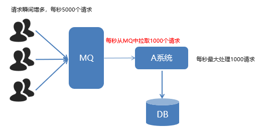

Consumer 限流机制
- 确保`Consumer ACK`机制为手动确认。
- mq监听器容器`listener-container`配置`perfetch`属性
  - `perfetch = 1`即消费端每次从mq拉去一条消息来消费，直到手动确认消费完毕后，才会继续拉去下一条消息。

```xml
<?xml version="1.0" encoding="UTF-8"?>
<beans xmlns="http://www.springframework.org/schema/beans"
       xmlns:xsi="http://www.w3.org/2001/XMLSchema-instance"
       xmlns:context="http://www.springframework.org/schema/context"
       xmlns:rabbit="http://www.springframework.org/schema/rabbit"
       xsi:schemaLocation="http://www.springframework.org/schema/beans
       http://www.springframework.org/schema/beans/spring-beans.xsd
       http://www.springframework.org/schema/context
       https://www.springframework.org/schema/context/spring-context.xsd
       http://www.springframework.org/schema/rabbit
       http://www.springframework.org/schema/rabbit/spring-rabbit.xsd">
    <!--加载配置文件-->
    <context:property-placeholder location="classpath:rabbitmq.properties"/>

    <!-- 定义rabbitmq connectionFactory -->
    <rabbit:connection-factory id="connectionFactory" host="${rabbitmq.host}"
                               port="${rabbitmq.port}"
                               username="${rabbitmq.username}"
                               password="${rabbitmq.password}"
                               virtual-host="${rabbitmq.virtual-host}"/>

    <!--定义扫描包扫描相应注解bean加载到IOC-->
    <context:component-scan base-package="tk.deriwotua.listener" />

    <!--定义监听器容器-->
    <!--限流首先确保consumer ack机制为手动确认即acknowledge="manual"-->
    <!--其次mq容器要配置prefetch属性 值即为限流值-->
    <!--perfetch = 1,表示消费端每次从mq拉去一条消息来消费，直到手动确认消费完毕后，才会继续拉去下一条消息。-->
    <rabbit:listener-container connection-factory="connectionFactory" acknowledge="manual" prefetch="1" >
        <!--限流监听器-->
       <rabbit:listener ref="qosListener" queue-names="test_queue_confirm"></rabbit:listener>
    </rabbit:listener-container>

</beans>
```
编写`QosListener`测试
```java
package tk.deriwotua.listener;

import com.rabbitmq.client.Channel;
import org.springframework.amqp.core.Message;
import org.springframework.amqp.rabbit.listener.api.ChannelAwareMessageListener;
import org.springframework.stereotype.Component;

/**
 * Consumer 限流机制
 *  1. 确保ack机制为手动确认。
 *  2. mq监听器容器`listener-container`配置`perfetch`属性
 *      perfetch = 1,表示消费端每次从mq拉去一条消息来消费，直到手动确认消费完毕后，才会继续拉去下一条消息。
 */
@Component
public class QosListener implements ChannelAwareMessageListener {
    @Override
    public void onMessage(Message message, Channel channel) throws Exception {
        Thread.sleep(1000);
        //1.获取消息
        System.out.println(new String(message.getBody()));

        //2. 处理业务逻辑

        //3. 签收
        channel.basicAck(message.getMessageProperties().getDeliveryTag(),true);
    }
}
```
  
### 1.4.1 消费端限流小结 ###
在`<rabbit:listener-container>` 中配置 `prefetch`属性设置消费端一次拉取多少消息
消费端实现`org.springframework.amqp.rabbit.listener.api.ChannelAwareMessageListener.onMessage(org.springframework.amqp.core.Message, com.rabbitmq.client.Channel)`方法且确认模式一定为手动确认`acknowledge="manual"`


## 1.5 TTL ##

`TTL` 全称 `Time To Live`（存活时间/过期时间）。
当消息到达存活时间后，还没有被消费，会被自动清除。
RabbitMQ可以对消息设置过期时间，也可以对整个队列（Queue）设置过期时间。

订单系统下单消息推送到mq后会设置其`TTL``过期时间比如设置30分钟，在30分钟内这条消息还没有被支付系统消费掉时这条订单就自动失效
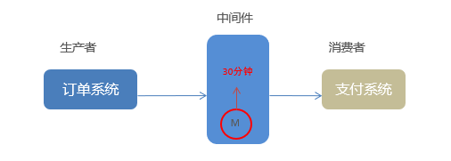

设置过期时间
- 在管理页面设置过期时间
  - 创建存在过期时间的队列
  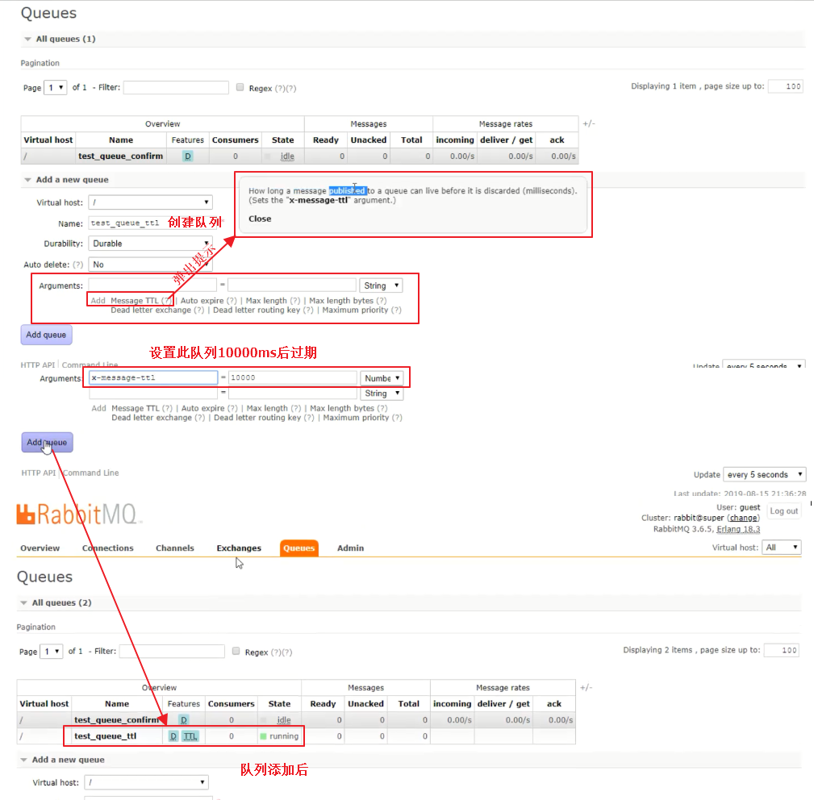
  
  - 创建交换机
  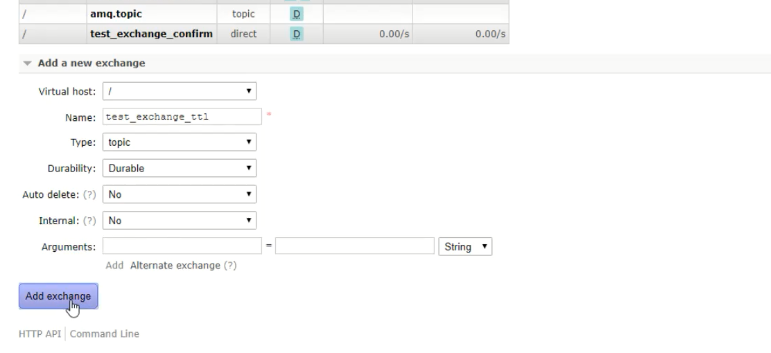
  
  - 交换机绑定队列
  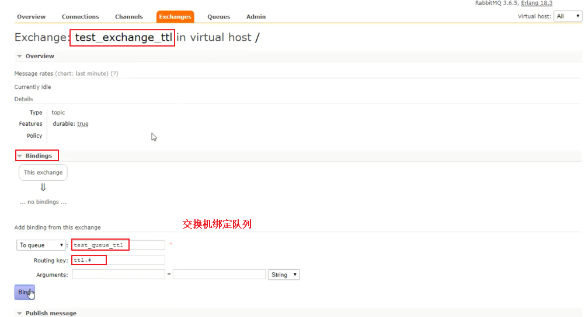
  
  - 交换机面板里发送消息测试
  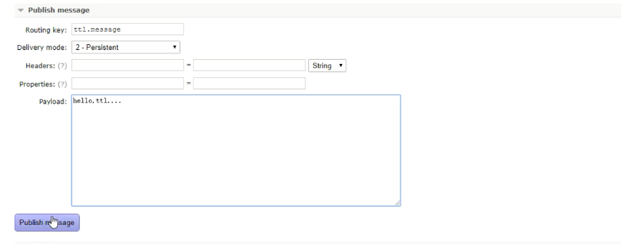
  
  - 发送后，进入刚刚创建的队列页面查看此条消息等待10s会发现该消息自动消失了
  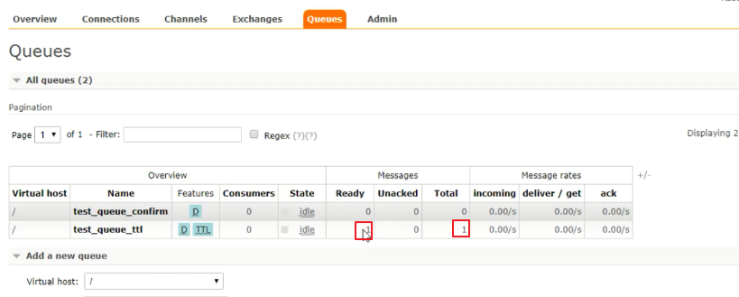

- 代码中实现消息过期
  - 第一种：队列统一过期。
    - 配置中声明队列设置`queue`的`x-message-ttl=10000`参数值并指定其参数类型
      ```xml
      <!--创建ttl队列-->
      <rabbit:queue name="test_queue_ttl" id="test_queue_ttl">
          <!--设置queue的参数-->
          <rabbit:queue-arguments>
              <!--entry就是参数属性表签 x-message-ttl指队列的过期时间参数名 -->
              <!--x-message-ttl 是一个数值类型需要指定其类型 单位是ms 下面设置10s过期-->
              <entry key="x-message-ttl" value="100000" value-type="java.lang.Integer"></entry>
          </rabbit:queue-arguments>
      </rabbit:queue>
      ```
    - 配置中声明交换机绑定该队列
      ```xml
      <!--声明topic交换机-->
      <rabbit:topic-exchange name="test_exchange_ttl" >
          <!--绑定上面ttl队列并配置其通配符-->
          <rabbit:bindings>
              <rabbit:binding pattern="ttl.#" queue="test_queue_ttl"></rabbit:binding>
          </rabbit:bindings>
      </rabbit:topic-exchange>
      ```
    - 代码中测试
      ```java
      @RunWith(SpringJUnit4ClassRunner.class)
      @ContextConfiguration(locations = "classpath:spring-rabbitmq-producer.xml")
      public class ProducerTest {
      
          @Autowired
          private RabbitTemplate rabbitTemplate;
          /**
           * TTL:过期时间
           *  队列统一过期
           */
          @Test
          public void testTtl() {
            for (int i = 0; i < 10; i++) {
                  // 发送消息
                  rabbitTemplate.convertAndSend("test_exchange_ttl", "ttl.hehe", "message ttl....");
              }
          }
      }
      ```
  - 第二种：消息单独过期。复用第一种方式创建的ttl队列和topic交换机  
    - 单独过期就是给消息通过`org.springframework.amqp.core.MessagePostProcessor.postProcessMessage(org.springframework.amqp.core.Message)`方法设置单独的属性
    - 单独过期消息参数`expiration`
    - 单独过期消息需要注意当设置了消息的过期时间，也设置了队列的过期时间，它以时间短的为准。
      - 队列过期后，会将队列所有消息全部移除
      - 队列中的存在过期时间即意味者在清理过期消息是需要轮询判断哪条消息过期效率太低
        - rabbitmq做法是消息过期后，只有消息在队列顶端，才会判断其是否过期(移除掉)即不在顶端过期消息不会移除
    - 测试代码
      ```java
      @RunWith(SpringJUnit4ClassRunner.class)
      @ContextConfiguration(locations = "classpath:spring-rabbitmq-producer.xml")
      public class ProducerTest {
      
          @Autowired
          private RabbitTemplate rabbitTemplate;
          /**
           * TTL:过期时间
           * 1. 队列统一过期
           * <p>
           * 2. 消息单独过期
           * <p>
           * <p>
           * 如果设置了消息的过期时间，也设置了队列的过期时间，它以时间短的为准。
           * 队列过期后，会将队列所有消息全部移除。
           * 队列中的存在过期时间即意味者在清理过期消息是需要轮询判断哪条消息过期效率太低
           *      rabbitmq做法是消息过期后，只有消息在队列顶端，才会判断其是否过期(移除掉)即不在顶端过期消息不会移除
           */
          @Test
          public void testTtl() {
              // 消息后处理对象，设置一些消息的参数信息
              MessagePostProcessor messagePostProcessor = new MessagePostProcessor() {
                  @Override
                  public Message postProcessMessage(Message message) throws AmqpException {
                      //1.设置message的参数
                      message.getMessageProperties().setExpiration("5000");//消息的过期时间 单位毫秒
                      //2.返回该消息
                      return message;
                  }
              };
      
              //消息单独过期
              //rabbitTemplate.convertAndSend("test_exchange_ttl", "ttl.hehe", "message ttl....",messagePostProcessor);
      
              /**
               * 下面测试 rabbitmq做法是消息过期后，只有消息在队列顶端，才会判断其是否过期(移除掉)即不在顶端过期消息不会移除
               *  在第五秒时发送一个单独过期的消息
               *  此消息在队列中间而非队列顶端，在管理页面会看到即使过了该消息过期时间后消息条数也不会减少
               *      队列先进先出等待前四条消息出队列被消费后此时该消息即队列顶端此时会判断是否过期然后移除
               */
              for (int i = 0; i < 10; i++) {
                  if (i == 5) {
                      //消息单独过期
                      rabbitTemplate.convertAndSend("test_exchange_ttl", "ttl.hehe", "message ttl....", messagePostProcessor);
                  } else {
                      //不过期的消息
                      rabbitTemplate.convertAndSend("test_exchange_ttl", "ttl.hehe", "message ttl....");
                  }
              }
      
          }
      }
      ```
    
### 1.5.1 TTL 小结 ###

设置队列过期时间使用参数：`x-message-ttl`，单位`ms`(毫秒)，会对整个队列消息统一过期。
设置消息过期时间使用参数：`expiration`。单位`ms`(毫秒)，当该消息在队列头部时（消费时），会单独判断这一消息是否过期。
如果两者都进行了设置，以时间短的为准。

## 1.6 死信队列 ##

死信队列，英文缩写：`DLX` 。`Dead Letter Exchange`（死信交换机），当消息成为Dead message后，可以被重新发送到另一个交换机，这个交换机就是DLX。
- 死信队列与英文不一致在于其他消息队列产品中很多是没有交换机这个概念的叫做`Dead Letter Queue`死信队列，而rabbitmq中是`Dead Letter Exchange`死信交换机
- 比如过期消息过期后一般会丢弃但是如果绑定了死信交换机那么过期消息不会被丢弃而是进入死信交换机

当消息由Producer发送到Exchange后由Exchange路由到相应的Queue，当消息或队列设置了过期时间且消息过期前未被Consumer1消费。消息成为死信会被移除到队列绑定的死信交换机中。此后可再次被死信交换机绑定的Consumer2消费
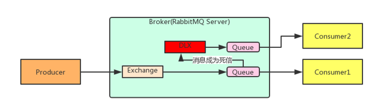

### 1.6.1 消息成为死信情况 ###
消息成为死信的三种情况
- 队列消息长度到达限制，新推送过来的消息即为死信
- 消费者拒接消费消息，`basicNack/basicReject`,并且`requeue=false`不把消息重新放入原目标队列此时消息也成为死信
- 原队列存在消息过期设置，消息到达超时时间未被消费

### 1.6.2 队列绑定死信交换机 ###

队列绑定死信交换机只需给队列设置
- `x-dead-letter-exchange`死信交换机名称
- `x-dead-letter-routing-key`队列到死信交换机路由key

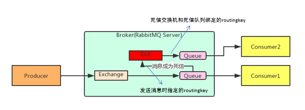

死信队列
- 声明正常的队列(`test_queue_dlx`)和交换机(`test_exchange_dlx`)
  ```xml
  <!--1. 声明正常的队列(test_queue_dlx)和交换机(test_exchange_dlx)-->
  <rabbit:queue name="test_queue_dlx" id="test_queue_dlx"></rabbit:queue>
  <rabbit:topic-exchange name="test_exchange_dlx">
      <rabbit:bindings>
          <rabbit:binding pattern="test.dlx.#" queue="test_queue_dlx"></rabbit:binding>
      </rabbit:bindings>
  </rabbit:topic-exchange>
  ```
  
- 声明死信队列(`queue_dlx`)和死信交换机(`exchange_dlx`)
  ```xml
  <!--2. 声明死信队列(queue_dlx)和死信交换机(exchange_dlx)-->
  <rabbit:queue name="queue_dlx" id="queue_dlx"></rabbit:queue>
  <rabbit:topic-exchange name="exchange_dlx">
      <rabbit:bindings>
          <rabbit:binding pattern="dlx.#" queue="queue_dlx"></rabbit:binding>
      </rabbit:bindings>
  </rabbit:topic-exchange>
  ```
- 正常队列绑定死信交换机
  - 设置两个参数
    - `x-dead-letter-exchange`死信交换机名称
    - `x-dead-letter-routing-key`发送给死信交换机的`routingkey`
    ```xml
    <!--1. 声明正常的队列(test_queue_dlx)和交换机(test_exchange_dlx)-->
    <rabbit:queue name="test_queue_dlx" id="test_queue_dlx">
        <!--3. 正常队列绑定死信交换机-->
        <rabbit:queue-arguments>
            <!--3.1 x-dead-letter-exchange：死信交换机名称-->
            <entry key="x-dead-letter-exchange" value="exchange_dlx" />
    
            <!--3.2 x-dead-letter-routing-key：发送给死信交换机的routingkey-->
            <entry key="x-dead-letter-routing-key" value="dlx.hehe" />
        </rabbit:queue-arguments>
    </rabbit:queue>
    <rabbit:topic-exchange name="test_exchange_dlx">
        <rabbit:bindings>
            <rabbit:binding pattern="test.dlx.#" queue="test_queue_dlx"></rabbit:binding>
        </rabbit:bindings>
    </rabbit:topic-exchange>
    ```
- 设置队列的过期时间 `ttl`    
  ```xml
  <!--1. 声明正常的队列(test_queue_dlx)和交换机(test_exchange_dlx)-->
  <rabbit:queue name="test_queue_dlx" id="test_queue_dlx">
      <!--3. 正常队列绑定死信交换机-->
      <rabbit:queue-arguments>
          <!--3.1 x-dead-letter-exchange：死信交换机名称-->
          <entry key="x-dead-letter-exchange" value="exchange_dlx" />
  
          <!--3.2 x-dead-letter-routing-key：发送给死信交换机的routingkey-->
          <entry key="x-dead-letter-routing-key" value="dlx.hehe" />
          <!--成为死信三种情况-->
          <!--4.1 设置队列的过期时间 ttl-->
          <entry key="x-message-ttl" value="10000" value-type="java.lang.Integer" />
          <!--4.2 设置队列的长度限制 max-length -->
          <entry key="x-max-length" value="10" value-type="java.lang.Integer" />
      </rabbit:queue-arguments>
  </rabbit:queue>
  <rabbit:topic-exchange name="test_exchange_dlx">
      <rabbit:bindings>
          <rabbit:binding pattern="test.dlx.#" queue="test_queue_dlx"></rabbit:binding>
      </rabbit:bindings>
  </rabbit:topic-exchange>
  ```
- 生产者发送消息后消息过期或队列长度过长促使成为死信
  ```java
  @RunWith(SpringJUnit4ClassRunner.class)
  @ContextConfiguration(locations = "classpath:spring-rabbitmq-producer.xml")
  public class ProducerTest {
      /**
       * 发送测试死信消息：
       * 1. 过期时间
       * 2. 长度限制
       * 3. 消息拒收
       */
      @Test
      public void testDlx() {
          //1. 给正常交换机发送消息测试过期时间，死信消息 
          //rabbitTemplate.convertAndSend("test_exchange_dlx","test.dlx.haha","我是一条消息，我会死吗？");
          // 当消息过期后消息被发送到queue_dlx队列中
  
          //2. 测试队列长度限制后，消息死信
         /* for (int i = 0; i < 20; i++) {
              rabbitTemplate.convertAndSend("test_exchange_dlx","test.dlx.haha","我是一条消息，我会死吗？");
          }*/
  
          //3. 测试消息拒收 在消费者那边拒收消息并且设置消息不重回队列
          rabbitTemplate.convertAndSend("test_exchange_dlx", "test.dlx.haha", "我是一条消息，我会死吗？");
      }
  }
  ```
- 消费者拒收并设置消息不重回队列
  ```java
  package tk.deriwotua.listener;
  
  import com.rabbitmq.client.Channel;
  import org.springframework.amqp.core.Message;
  import org.springframework.amqp.rabbit.listener.api.ChannelAwareMessageListener;
  import org.springframework.stereotype.Component;
  
  @Component
  public class DlxListener implements ChannelAwareMessageListener {
  
      @Override
      public void onMessage(Message message, Channel channel) throws Exception {
          long deliveryTag = message.getMessageProperties().getDeliveryTag();
  
          try {
              //1.接收转换消息
              System.out.println(new String(message.getBody()));
  
              //2. 处理业务逻辑
              System.out.println("处理业务逻辑...");
              int i = 3/0;//出现错误
              //3. 手动签收
              channel.basicAck(deliveryTag,true);
          } catch (Exception e) {
              //e.printStackTrace();
              System.out.println("出现异常，拒绝接受");
              //4.拒绝签收，不重回队列 requeue=false
              channel.basicNack(deliveryTag,true,false);
          }
      }
  }
  ```
  
  - 配置文件中注册该监听器
    ```xml
    <?xml version="1.0" encoding="UTF-8"?>
    <beans xmlns="http://www.springframework.org/schema/beans"
           xmlns:xsi="http://www.w3.org/2001/XMLSchema-instance"
           xmlns:context="http://www.springframework.org/schema/context"
           xmlns:rabbit="http://www.springframework.org/schema/rabbit"
           xsi:schemaLocation="http://www.springframework.org/schema/beans
           http://www.springframework.org/schema/beans/spring-beans.xsd
           http://www.springframework.org/schema/context
           https://www.springframework.org/schema/context/spring-context.xsd
           http://www.springframework.org/schema/rabbit
           http://www.springframework.org/schema/rabbit/spring-rabbit.xsd">
        <!--加载配置文件-->
        <context:property-placeholder location="classpath:rabbitmq.properties"/>
    
        <!-- 定义rabbitmq connectionFactory -->
        <rabbit:connection-factory id="connectionFactory" host="${rabbitmq.host}"
                                   port="${rabbitmq.port}"
                                   username="${rabbitmq.username}"
                                   password="${rabbitmq.password}"
                                   virtual-host="${rabbitmq.virtual-host}"/>
    
        <!--定义扫描包扫描相应注解bean加载到IOC-->
        <context:component-scan base-package="tk.deriwotua.listener" />
    
        <!--定义监听器容器-->
        <rabbit:listener-container connection-factory="connectionFactory" acknowledge="manual" prefetch="1" >
            <!--定义监听器，监听正常队列-->
            <rabbit:listener ref="dlxListener" queue-names="test_queue_dlx"></rabbit:listener>
        </rabbit:listener-container>
    
    </beans>
    ```

### 1.6.3 死信队列小结 ###
死信交换机和死信队列和普通的没有区别
当消息成为死信后，如果该队列绑定了死信交换机，则消息会被死信交换机重新路由到死信队列，未绑定则丢失
消息成为死信的三种情况
- 队列消息长度到达限制
- 消费者拒接消费消息，并且不重回队列
- 原队列存在消息过期设置，消息到达超时时间未被消费

## 1.7 延迟队列 ##
延迟队列，即消息进入队列后不会立即被消费，只有到达指定时间后，才会被消费。
常见应用
- 下单后，30分钟未支付，取消订单，回滚库存。
- 新用户注册成功7天后，发送短信问候。

实现方式
- 定时器
  - 对于订单可以通过比对下单时间和当前时间时差过了30min判断订单支付状态。未支付取消订单，回滚库存。实现上不算优雅不好定义执行间隔。每秒执行存在性能问题，间隔长了又存在时间误差
- 延迟队列

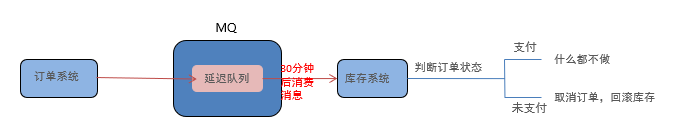


### 1.7.1 延迟队列实现 ###
很可惜，在RabbitMQ中并未提供延迟队列功能。
但是可以使用：`TTL+死信队列` 组合实现延迟队列的效果。

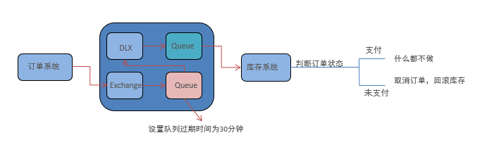

延迟队列
- 定义正常交换机（order_exchange）和队列(order_queue)
  ```xml
  <!-- 1. 定义正常交换机（order_exchange）和队列(order_queue)-->
  <rabbit:queue id="order_queue" name="order_queue"></rabbit:queue>
  <rabbit:topic-exchange name="order_exchange">
      <rabbit:bindings>
          <rabbit:binding pattern="order.#" queue="order_queue"></rabbit:binding>
      </rabbit:bindings>
  </rabbit:topic-exchange>
  ```
- 定义死信交换机（order_exchange_dlx）和队列(order_queue_dlx)
  ```xml
    <!-- 1. 定义正常交换机（order_exchange）和队列(order_queue)-->
    <rabbit:queue id="order_queue" name="order_queue"></rabbit:queue>
    <rabbit:topic-exchange name="order_exchange">
        <rabbit:bindings>
            <rabbit:binding pattern="order.#" queue="order_queue"></rabbit:binding>
        </rabbit:bindings>
    </rabbit:topic-exchange>
  <!--  2. 定义死信交换机（order_exchange_dlx）和队列(order_queue_dlx)-->
  <rabbit:queue id="order_queue_dlx" name="order_queue_dlx"></rabbit:queue>
  <rabbit:topic-exchange name="order_exchange_dlx">
      <rabbit:bindings>
          <rabbit:binding pattern="dlx.order.#" queue="order_queue_dlx"></rabbit:binding>
      </rabbit:bindings>
  </rabbit:topic-exchange>
  ```
- 绑定，设置正常队列过期时间为30分钟
  ```xml
  <!--延迟队列：
          1. 定义正常交换机（order_exchange）和队列(order_queue)
          2. 定义死信交换机（order_exchange_dlx）和队列(order_queue_dlx)
          3. 绑定，设置正常队列过期时间为30分钟-->
  <!-- 1. 定义正常交换机（order_exchange）和队列(order_queue)-->
  <rabbit:queue id="order_queue" name="order_queue">
      <!-- 3. 绑定，设置正常队列过期时间为30分钟-->
      <rabbit:queue-arguments>
          <entry key="x-dead-letter-exchange" value="order_exchange_dlx" />
          <entry key="x-dead-letter-routing-key" value="dlx.order.cancel" />
          <entry key="x-message-ttl" value="10000" value-type="java.lang.Integer" />
      </rabbit:queue-arguments>
  </rabbit:queue>
  <rabbit:topic-exchange name="order_exchange">
      <rabbit:bindings>
          <rabbit:binding pattern="order.#" queue="order_queue"></rabbit:binding>
      </rabbit:bindings>
  </rabbit:topic-exchange>
  
  <!--  2. 定义死信交换机（order_exchange_dlx）和队列(order_queue_dlx)-->
  <rabbit:queue id="order_queue_dlx" name="order_queue_dlx"></rabbit:queue>
  <rabbit:topic-exchange name="order_exchange_dlx">
      <rabbit:bindings>
          <rabbit:binding pattern="dlx.order.#" queue="order_queue_dlx"></rabbit:binding>
      </rabbit:bindings>
  </rabbit:topic-exchange>
  ```
- 生产者发送消息
  ```java
  @RunWith(SpringJUnit4ClassRunner.class)
  @ContextConfiguration(locations = "classpath:spring-rabbitmq-producer.xml")
  public class ProducerTest {
        @Test
        public void testDelay() throws InterruptedException {
            //1.发送订单消息。 将来是在订单系统中，下单成功后，发送消息
            rabbitTemplate.convertAndSend("order_exchange", "order.msg", "订单信息：id=1,time=2019年8月17日16:41:47");
    
            /*//2.打印倒计时10秒 后消息进入死信队列
            for (int i = 10; i > 0 ; i--) {
                System.out.println(i+"...");
                Thread.sleep(1000);
            }*/
        }
  }
  ```
- 消费者消费消息
  ```java
  package tk.deriwotua.listener;
  
  import com.rabbitmq.client.Channel;
  import org.springframework.amqp.core.Message;
  import org.springframework.amqp.rabbit.listener.api.ChannelAwareMessageListener;
  import org.springframework.stereotype.Component;
  
  @Component
  public class OrderListener implements ChannelAwareMessageListener {
  
      @Override
      public void onMessage(Message message, Channel channel) throws Exception {
          long deliveryTag = message.getMessageProperties().getDeliveryTag();
  
          try {
              //1.接收转换消息
              System.out.println(new String(message.getBody()));
  
              //2. 处理业务逻辑
              System.out.println("处理业务逻辑...");
              System.out.println("根据订单id查询其状态...");
              System.out.println("判断状态是否为支付成功");
              System.out.println("取消订单，回滚库存....");
              //3. 手动签收
              channel.basicAck(deliveryTag,true);
          } catch (Exception e) {
              //e.printStackTrace();
              System.out.println("出现异常，拒绝接受");
              //4.拒绝签收，不重回队列 requeue=false
              channel.basicNack(deliveryTag,true,false);
          }
      }
  }
  ```
  
  - 注册监听器
    ```xml
    <!--定义监听器容器-->
    <rabbit:listener-container connection-factory="connectionFactory" acknowledge="manual" prefetch="1" >
        <!--延迟队列效果实现：  一定要监听的是 死信队列！！！-->
        <rabbit:listener ref="orderListener" queue-names="order_queue_dlx"></rabbit:listener>
    </rabbit:listener-container>
    ```

### 1.7.2 延迟队列小结 ###
延迟队列 指消息进入队列后，可以被延迟一定时间，再进行消费。
RabbitMQ没有提供延迟队列功能，但是可以使用 ： `TTL + DLX` 来实现延迟队列效果。

## 1.8 日志与监控 ##
### 1.8.1 RabbitMQ日志 ###

RabbitMQ默认日志存放路径`/var/log/rabbitmq/rabbit@xxx.log` `xxx`代表主机名

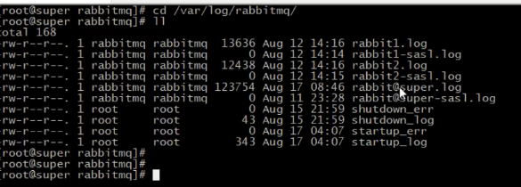

日志包含了`RabbitMQ的版本号`、`Erlang的版本号`、`RabbitMQ服务节点名称`、`cookie的hash值`、`RabbitMQ配置文件地址`、`内存限制`、`磁盘限制`、`默认账户guest的创建以及权限配置`等等。

### 1.8.2 web管控台监控 ###

web管理页面可以查看服务状态及一些创建交换机创建队列等等功能
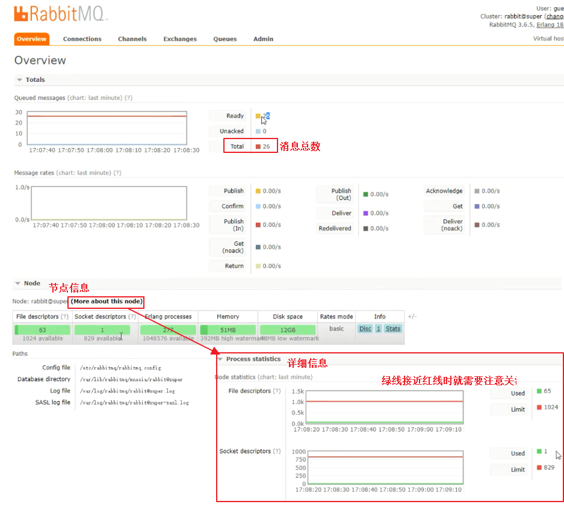

### 1.8.3 rabbitmqctl管理和监控 ###
> 同样通过命令行也能执行一些功能

查看虚拟主机
```shell script
# rabbitmqctl list_vhost
```

查看队列
```shell script
# rabbitmqctl list_queues
```

查看exchanges
```shell script
# rabbitmqctl list_exchanges
```

查看用户
```shell script
# rabbitmqctl list_users
```

查看连接
```shell script
# rabbitmqctl list_connections
```

查看消费者信息
```shell script
# rabbitmqctl list_consumers
```

查看环境变量
```shell script
# rabbitmqctl environment
```

查看未被确认的队列
```shell script
# rabbitmqctl list_queues name messages_unacknowledged
```

查看单个队列的内存使用
```shell script
# rabbitmqctl list_queues name memory
```

查看准备就绪的队列
```shell script
# rabbitmqctl list_queues name messages_ready
```

## 1.9 消息追踪
在使用任何消息中间件的过程中，难免会出现某条消息异常丢失的情况。对于RabbitMQ而言，可能是因为生产者或消费者与RabbitMQ断开了连接，而它们与RabbitMQ又采用了不同的确认机制；也有可能是因为交换器与队列之间不同的转发策略；甚至是交换器并没有与任何队列进行绑定，生产者又不感知或者没有采取相应的措施；另外RabbitMQ本身的集群策略也可能导致消息的丢失。这个时候就需要有一个较好的机制跟踪记录消息的投递过程，以此协助开发和运维人员进行问题的定位。
在RabbitMQ中可以使用`Firehose`和`rabbitmq_tracing`插件功能来实现消息追踪。

### 1.9.1 消息追踪-`Firehose` ###
`firehose`的机制是将生产者投递给`rabbitmq`的消息，`rabbitmq`投递给消费者的消息按照指定的格式发送到默认的`exchange`上。这个消息是`rabbitmq`内部消息不会丢失
- 这个默认的`exchange`的名称为`amq.rabbitmq.trace`，
  - 它是一个`topic`类型的`exchange`。
  - 发送到这个`exchange`上的消息的`routing key`为 `publish.exchangename` 和`deliver.queuename`。
    - 其中`exchangename`和`queuename`为实际`exchange`和`queue`的名称，分别对应生产者投递到`exchange`的消息，和消费者从`queue`上获取的消息。

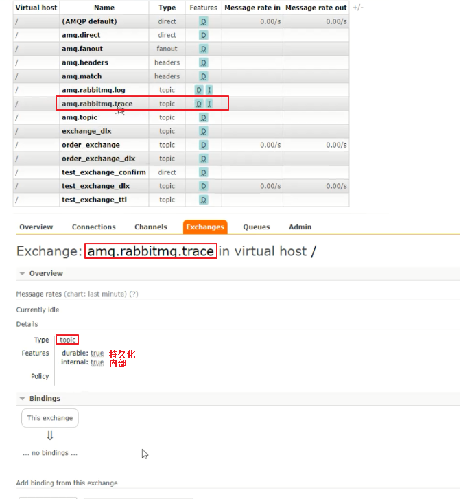

```shell script
# 开启Firehose命令
rabbitmqctl trace_on
# 关闭Firehose命令
rabbitmqctl trace_off
```
开启后可以创建一个队列绑定到该交换机上，以此获取到该`rabbitmq`内部详细日志记录消息

### 1.9..2 消息追踪-`rabbitmq_tracing` ###
`rabbitmq_tracing`和`Firehose`在实现上如出一辙，只不过`rabbitmq_tracing`的方式比`Firehose`多了一层GUI的包装，可以在管理页面更容易使用和管理。
启用插件
```shell script
rabbitmq-plugins enable rabbitmq_tracing
```

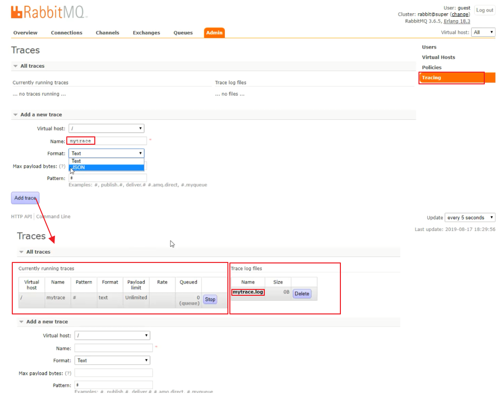

排错时上面的详细是非常必要的但是需要注意生产环境打开 `trace` 会影响mq性能，适当打开后请关闭。

# 2. RabbitMQ 应用问题 #

RabbitMQ应用问题
- 消息可靠性保障
  - 消息补偿机制
- 消息幂等性保障
  - 乐观锁解决方案

## 2.1 消息可靠性保障 ##
需求：100%确保消息发送成功

### 2.1.1 消息可靠性保障--消息补偿 ###

Producer发送消息给Q1后延迟若干时间把同样的消息再发送给Q3为延迟消息
当Q1消息被监听的Consumer消费后Consumer再发送一条Q1消息被消费确认消息给Q2，然后被监听的回调检查服务收到消息并将Consumer发送给Q2确认消息里包含的Q1消息的主键id唯一值持久化到MDB
等到Q3延迟消息也被回调检查服务监听到后查询MDB中是否存在被Consumer回复Q2的确认消费过的主键id
  - 存在则说明Q3延迟消息被消费过了不再处理
  - 不存在则说明`Producer->Q1->Consumer`消息丢失。（`Consumer->Q2->回调服务->MDB`正常下）然后回调服务回调Producer重新发送消息。
当`Producer->Q1`和`Producer->Q3`也存在消息丢失时此时通过定时检查服务比对DB和MDB数据不一致时再调用Producer重新发送消息


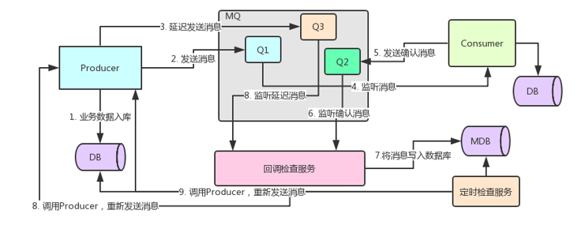


## 2.2 消息幂等性保障 ##
幂等性指一次和多次请求某一个资源，对于资源本身应该具有同样的结果。也就是说，其任意多次执行对资源本身所产生的影响均与一次执行的影响相同。
在MQ中指，**消费多条相同的消息，得到与消费该消息一次相同的结果**。

### 2.2.1 消息幂等性保障--乐观锁机制 ###

Producer->Q1时，Consumer宕机了导致消息未被消费
然后定时检查服务比对DB和MDB后发现数据不一致此时调用Producer再次推送消息给Q1甚至通过Producer->Q3->回调检查服务->Producer->Q1，这样就会导致Consumer再次上线后Q1可能存在重复消息此时如果不加区别Consumer肯定就重复执行了

解决这个问题可以通过version版本号解决消息中附带版本号Consumer执行SQL拼接上version作为参数同时执行后把version累加，这样重复的消息会因为无法匹配version值不会命中相关记录

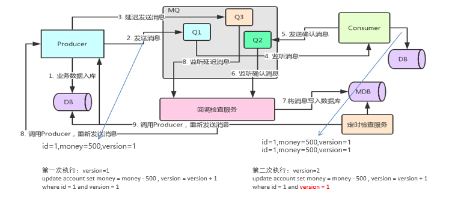