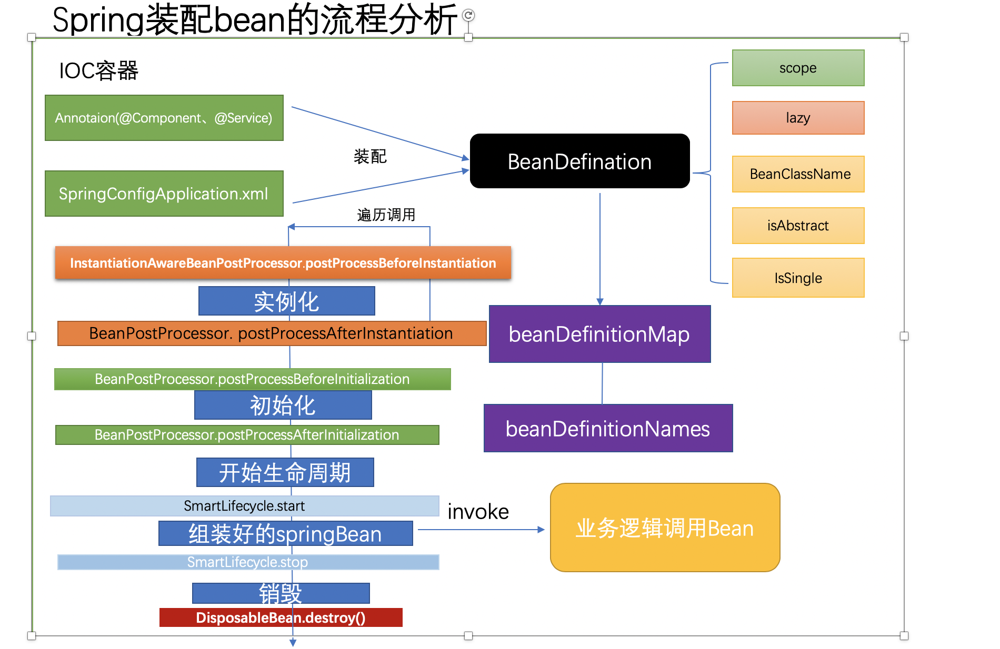
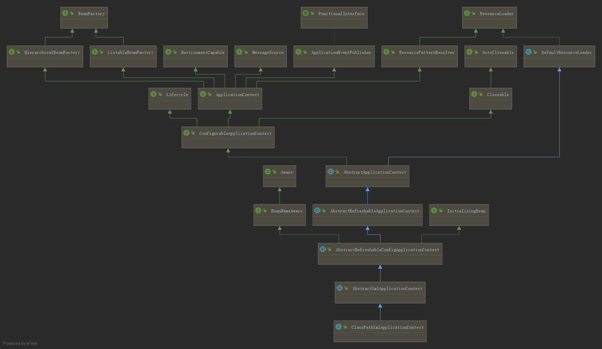
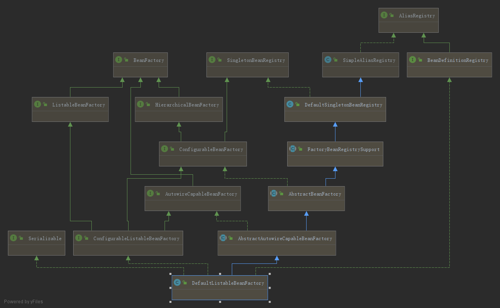
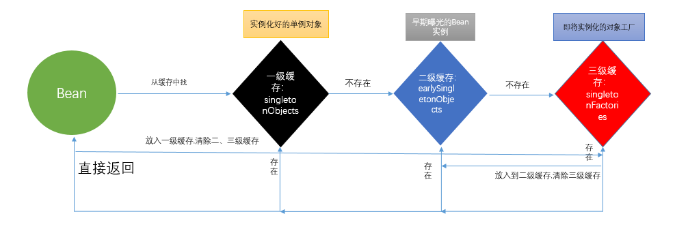

[TOC]

## Bean加载流程
> [SPRINGBOOT启动流程及其原理](https://www.cnblogs.com/theRhyme/p/11057233.html)




### ClassPathXmlApplicationContext 加载入口

Spring代码加载的入口
```java
public class SpringTest {

    /**
     * 测试Spring容器产生person对象
     * @throws Exception
     */
    @Test
    public void test4() throws Exception {
        ApplicationContext app = new ClassPathXmlApplicationContext("applicationContext.xml");
        Person person = app.getBean(Person.class);
        System.out.println(person.toString());
    }

}
```

`org.springframework.context.support.ClassPathXmlApplicationContext`这个类的继承关系


`org.springframework.context.support.ClassPathXmlApplicationContext`存储内容

对象名 	                    | 类  型 	                        | 作  用 	                                                        | 归属类
--------------|------------------------|-----------------|----------------
configResources 	        | Resource[] 	                    | 配置文件资源对象数组 	                                        | ClassPathXmlApplicationContext
configLocations 	        | String[] 	                        | 配置文件字符串数组，存储配置文件路径 	                        | AbstractRefreshableConfigApplicationContext
beanFactory 	            | DefaultListableBeanFactory      | 上下文使用的Bean工厂 	                                        | AbstractRefreshableApplicationContext
beanFactoryMonitor 	        | Object 	                        | Bean工厂使用的同步监视器 	                                    | AbstractRefreshableApplicationContext
id 	                        | String 	                        | 上下文使用的唯一Id，标识此ApplicationContext 	                	| AbstractApplicationContext
parent 	                    | ApplicationContext 	            | 父级ApplicationContext 	                                        | AbstractApplicationContext
beanFactoryPostProcessors 	| List<BeanFactoryPostProcessor> 	| 存储BeanFactoryPostProcessor接口，Spring提供的一个扩展点 	    	| AbstractApplicationContext
startupShutdownMonitor 	    | Object 	                        | refresh方法和destory方法公用的一个监视器，避免两个方法同时执行 	| AbstractApplicationContext
shutdownHook 	            | Thread 	                        | Spring提供的一个钩子，JVM停止执行时会运行Thread里面的方法 	    	| AbstractApplicationContext
resourcePatternResolver 	| ResourcePatternResolver 	    | 上下文使用的资源格式解析器 	                                    | AbstractApplicationContext
lifecycleProcessor 	        | LifecycleProcessor 	            | 用于管理Bean生命周期的生命周期处理器接口 	                    	| AbstractApplicationContext
messageSource 	            | MessageSource 	                | 用于实现国际化的一个接口 	                                    	| AbstractApplicationContext
applicationEventMulticaster | ApplicationEventMulticaster 	| Spring提供的事件管理机制中的事件多播器接口 	                    | AbstractApplicationContext
applicationListeners 	    | Set<ApplicationListener> 	    | Spring提供的事件管理机制中的应用监听器 	                        | AbstractApplicationContext

`org.springframework.context.support.ClassPathXmlApplicationContext`构造方法
```java
public class ClassPathXmlApplicationContext extends AbstractXmlApplicationContext {
    @Nullable
    private Resource[] configResources;

    public ClassPathXmlApplicationContext() {
    }

    public ClassPathXmlApplicationContext(ApplicationContext parent) {
        super(parent);
    }
    
    /**
     * 这里调用的就是这个构造方法
    */
    public ClassPathXmlApplicationContext(String configLocation) throws BeansException {
        this(new String[]{configLocation}, true, (ApplicationContext)null);
    }

    public ClassPathXmlApplicationContext(String... configLocations) throws BeansException {
        this(configLocations, true, (ApplicationContext)null);
    }

    public ClassPathXmlApplicationContext(String[] configLocations, @Nullable ApplicationContext parent) throws BeansException {
        this(configLocations, true, parent);
    }

    public ClassPathXmlApplicationContext(String[] configLocations, boolean refresh) throws BeansException {
        this(configLocations, refresh, (ApplicationContext)null);
    }
    /**
     * 最终调用的这个构造方法
    */
    public ClassPathXmlApplicationContext(String[] configLocations, boolean refresh, @Nullable ApplicationContext parent) throws BeansException {
        // 设置一下父级ApplicationContext，这里是null
        super(parent);
        /**
         * setConfigLocations主要干了两件事
         *  将指定的Spring配置文件的路径存储到本地
         *  解析Spring配置文件路径中的${PlaceHolder}占位符，替换为系统变量中PlaceHolder对应的Value值，
         *   System本身就自带一些系统变量比如class.path、os.name、user.dir等，也可以通过System.setProperty()方法设置自己需要的系统变量
         */
        this.setConfigLocations(configLocations);
        if (refresh) {
            /**
             * 整个Spring Bean加载的核心
             * 是父类 {@link org.springframework.context.support.AbstractApplicationContext#refresh()} 的一个方法
             * 用于刷新整个Spring上下文信息
             * 定义了整个Spring上下文加载的流程
             */ 
            this.refresh();
        }

    }

    public ClassPathXmlApplicationContext(String path, Class<?> clazz) throws BeansException {
        this(new String[]{path}, clazz);
    }

    public ClassPathXmlApplicationContext(String[] paths, Class<?> clazz) throws BeansException {
        this(paths, clazz, (ApplicationContext)null);
    }

    public ClassPathXmlApplicationContext(String[] paths, Class<?> clazz, @Nullable ApplicationContext parent) throws BeansException {
        super(parent);
        Assert.notNull(paths, "Path array must not be null");
        Assert.notNull(clazz, "Class argument must not be null");
        this.configResources = new Resource[paths.length];

        for(int i = 0; i < paths.length; ++i) {
            this.configResources[i] = new ClassPathResource(paths[i], clazz);
        }

        this.refresh();
    }

    @Nullable
    protected Resource[] getConfigResources() {
        return this.configResources;
    }
}
```

### refresh方法Bean加载的核心
`org.springframework.context.support.AbstractApplicationContext#refresh()`方法是整个Spring Bean加载的核心
```java
public abstract class AbstractApplicationContext extends DefaultResourceLoader implements ConfigurableApplicationContext {
    public void refresh() throws BeansException, IllegalStateException {
        /**
         * 加锁避免多线程同时刷新Spring上下文
         * 没有在方法前加synchronized关键字，而使用了对象锁 startUpShutdownMonitor，这样做有两个好处
         *      {@link org.springframework.context.support.AbstractApplicationContext#refresh()}方法和 close()方法都使用了startUpShutdownMonitor对象锁加锁，
         *          这就保证了在调用refresh()方法的时候无法调用close()方法，反之亦然，避免了冲突
         *      减小了同步的范围，只对不能并发的代码块进行加锁，提高了整体代码运行的效率
         * 方法里面使用了每个子方法定义了整个refresh()方法的流程，使得整个方法流程清晰易懂
         *      必免一个方法里面几十行甚至上百行代码写在一起
         */
        synchronized(this.startupShutdownMonitor) {
            // 准备刷新Spring上下文
            this.prepareRefresh();
            /**
             * 获取刷新Spring上下文的Bean工厂这里即 {@link org.springframework.beans.factory.support.DefaultListableBeanFactory} 构造Bean的核心类
             *      DefaultListableBeanFactory 实现了 ConfigurableListableBeanFactory 接口
             *      接着在 {@link org.springframework.context.support.AbstractXmlApplicationContext#loadBeanDefinitions() }方法里
             *          通过 DefaultListableBeanFactory 读取配置文件完成了 BeanDefinitions bean元数据加载 
             *          需要注意因为这里是通过XML配置方式所以 BeanDefinition 加载是上面流程，
             *          如果使用了注解扫描包方式，则是在下面{@link org.springframework.context.support.AbstractApplicationContext#invokeBeanFactoryPostProcessors}
             */
            ConfigurableListableBeanFactory beanFactory = this.obtainFreshBeanFactory();
            this.prepareBeanFactory(beanFactory);

            try {
                this.postProcessBeanFactory(beanFactory);
                /**
                 * 使用了注解扫描包方式时在这个方法里完成扫描解析这些属性封装到 BeanDefinition 接口实现类中然后注册到 DefaultListableBeanFactory#beanDefinitionMap
                 *   {@link org.springframework.context.annotation.ConfigurationClassPostProcessor#processConfigBeanDefinitions}
                 *   {@link org.springframework.context.annotation.ConfigurationClassParser#doProcessConfigurationClass}
                 *   {@link org.springframework.context.annotation.ClassPathBeanDefinitionScanner#doScan} 扫描包
                 *   {@link org.springframework.context.annotation.ClassPathScanningCandidateComponentProvider#findCandidateComponents} 属性封装到 BeanDefinition
                 *   {@link org.springframework.context.annotation.ClassPathBeanDefinitionScanner#registerBeanDefinition}
                 *   {@link org.springframework.beans.factory.support.BeanDefinitionReaderUtils#registerBeanDefinition}
                 *   先通过扫描指定包路径下的spring注解，
                 *   比如@Component、@Service、@Lazy @Sope等spring识别的注解或者是xml配置的属性(通过读取流,解析成Document，Document)
                 *   然后spring会解析这些属性，将这些属性封装到 BeanDefinition 这个接口的实现类中，
                 *   然后再注册到 DefaultListableBeanFactory 即放入beanDefinitionMap(ConcurrentHashMap类型)中
                 * 
                 */ 
                this.invokeBeanFactoryPostProcessors(beanFactory);
                // Register bean processors that intercept bean creation
                this.registerBeanPostProcessors(beanFactory);
                this.initMessageSource();
                this.initApplicationEventMulticaster();
                this.onRefresh();
                this.registerListeners();
                /**
                 * finishBeanFactoryInitialization() 方法完成了对于所有非懒加载的Bean的初始化
                 *  内部通过调用 {@link org.springframework.beans.factory.support.DefaultListableBeanFactory#preInstantiateSingletons() }
                 *      初始化所有的单例Bean
                 */ 
                this.finishBeanFactoryInitialization(beanFactory);
                this.finishRefresh();
            } catch (BeansException var9) {
                if (this.logger.isWarnEnabled()) {
                    this.logger.warn("Exception encountered during context initialization - cancelling refresh attempt: " + var9);
                }
                this.destroyBeans();
                this.cancelRefresh(var9);
                throw var9;
            } finally {
                this.resetCommonCaches();
            }

        }
    }

	/**
	 * Prepare this context for refreshing, setting its startup date and
	 * active flag as well as performing any initialization of property sources.
	 */
	protected void prepareRefresh() {
        // 设置一下刷新Spring上下文的开始时间
		this.startupDate = System.currentTimeMillis();
		this.closed.set(false);
        // 将active标识位设置为true
		this.active.set(true);

		if (logger.isInfoEnabled()) {
            // 日志打印了真正加载Spring上下文的Java类
			logger.info("Refreshing " + this);
		}

		// Initialize any placeholder property sources in the context environment
		initPropertySources();

		// Validate that all properties marked as required are resolvable
		// see ConfigurablePropertyResolver#setRequiredProperties
		getEnvironment().validateRequiredProperties();

		// Allow for the collection of early ApplicationEvents,
		// to be published once the multicaster is available...
		this.earlyApplicationEvents = new LinkedHashSet<>();
	}

	protected abstract void refreshBeanFactory() throws BeansException, IllegalStateException;

	/**
	 * Tell the subclass to refresh the internal bean factory.
	 * @return the fresh BeanFactory instance
	 * @see #refreshBeanFactory()
	 * @see org.springframework.context.support.AbstractApplicationContext#getBeanFactory()
	 */
	protected ConfigurableListableBeanFactory obtainFreshBeanFactory() {
        /**
         * 抽象方法
         * AbstractRefreshableApplicationContext和GenericApplicationContext这两个子类实现了这个方法
         * 这里是 {@link org.springframework.context.support.AbstractRefreshableApplicationContext#refreshBeanFactory()}
         * GenericApplicationContext 针对注解的方式
         */
		refreshBeanFactory();
		ConfigurableListableBeanFactory beanFactory = getBeanFactory();
		if (logger.isDebugEnabled()) {
			logger.debug("Bean factory for " + getDisplayName() + ": " + beanFactory);
		}
		return beanFactory;
	}

}

public abstract class AbstractRefreshableApplicationContext extends AbstractApplicationContext {

	@Override
	protected final void refreshBeanFactory() throws BeansException {
		if (hasBeanFactory()) {
			destroyBeans();
			closeBeanFactory();
		}
		try {
            // DefaultListableBeanFactory 构造Bean的核心类
			DefaultListableBeanFactory beanFactory = createBeanFactory();
			beanFactory.setSerializationId(getId());
			customizeBeanFactory(beanFactory);
            // xml 配置在这里加载配置文件解析后属性封装到 BeanDefinition
			loadBeanDefinitions(beanFactory);
			synchronized (this.beanFactoryMonitor) {
				this.beanFactory = beanFactory;
			}
		}
		catch (IOException ex) {
			throw new ApplicationContextException("I/O error parsing bean definition source for " + getDisplayName(), ex);
		}
	}
}
```

#### BeanDefinition

```java
@Scope("singleton")
@Lazy
public class Person implements InitializingBean, BeanNameAware, BeanClassLoaderAware {

    private String name;

    private Integer age;
}
```

spring读取配置或注解的过程
- 先通过扫描指定包路径下的spring注解，比如`@Component`、`@Service`、`@Lazy` `@Sope`等spring识别的注解或者是xml配置的属性(通过读取流,解析成Document，Document)然后spring
会解析这些属性，将这些属性封装到 `BeanDefinition` 这个接口的实现类中.

比如这个配置Bean,spring也会将className、scope、lazy等这些属性装配到Person对应的`BeanDefinition`中.具体采用的是`BeanDefinitionParser`接口中的`parse
(Element element, ParserContext parserContext)`方法,该接口有很多不同的实现类。通过实现类去解析注解或者xml然后放到`BeanDefinition`中,`BeanDefinition`的作用是集成了我们的配置对象中的各种属性，重要的有这个bean的ClassName，还有是否是Singleton、对象的属性和值等（如果是单例的话，后面会将这个单例对象放入到spring的单例池中）。spring后期如果需要这些属性就会直接从它中获取。然后，再注册到一个`ConcurrentHashMap`中，在spring中具体的方法就是`registerBeanDefinition()`，这个Map存的key是对象的名字，比如Person这个对象，它的名字就是person,值是 `BeanDefinition`,它位于`DefaultListableBeanFactory`类下面的beanDefinitionMap类属性中，同时将所有的bean的名字放入到`beanDefinitionNames`这个list中,目的就是方便取beanName;

### DefaultListableBeanFactory构造Bean的核心类

`org.springframework.beans.factory.support.DefaultListableBeanFactory`构造Bean的核心类


`org.springframework.beans.factory.support.DefaultListableBeanFactory`中存储的一些重要对象及对象中的内容，`DefaultListableBeanFactory`基本就是操作这些对象

对象名 							| 类  型 	 						| 	作    用 										| 	归属类
--------|-------------|-----------|---------------------
aliasMap 						| Map<String, String> 				| 存储Bean名称->Bean别名映射关系  	 				| SimpleAliasRegistry
**singletonObjects**  			| **Map<String, Object>** 	 		| **存储单例Bean名称->单例Bean实现映射关系** 			| **DefaultSingletonBeanRegistry**
singletonFactories 	 			| Map<String, ObjectFactory> 		| 存储Bean名称->ObjectFactory实现映射关系  			| DefaultSingletonBeanRegistry 
earlySingletonObjects			| Map<String, Object> 				| 存储Bean名称->预加载Bean实现映射关系   	 			| DefaultSingletonBeanRegistry 
registeredSingletons			| Set<String>  						| 存储注册过的Bean名 	 							| DefaultSingletonBeanRegistry 
singletonsCurrentlyInCreation	| Set<String> 						| 存储当前正在创建的Bean名  	  						| DefaultSingletonBeanRegistry  
disposableBeans 	 			| Map<String, Object>  				| 存储Bean名称->Disposable接口实现Bean实现映射关系 	| DefaultSingletonBeanRegistry   
factoryBeanObjectCache 	 		| Map<String, Object> 				| 存储Bean名称->FactoryBean接口Bean实现映射关系 		| FactoryBeanRegistrySupport 
propertyEditorRegistrars  	 	| Set<PropertyEditorRegistrar> 		| 存储PropertyEditorRegistrar接口实现集合 			| AbstractBeanFactory 
embeddedValueResolvers 			| List<StringValueResolver>  		| 存储StringValueResolver（字符串解析器）接口实现列表 | AbstractBeanFactory 
beanPostProcessors  			| List<BeanPostProcessor>  			| 存储 BeanPostProcessor接口实现列表 				| AbstractBeanFactory
mergedBeanDefinitions  			| Map<String, RootBeanDefinition>  	| 存储Bean名称->合并过的根Bean定义映射关系  			| AbstractBeanFactory 
alreadyCreated 					| Set<String>  						| 存储至少被创建过一次的Bean名集合  	 				| AbstractBeanFactory  
ignoredDependencyInterfaces  	| Set<Class>  						| 存储不自动装配的接口Class对象集合  					| AbstractAutowireCapableBeanFactory 
resolvableDependencies 			| Map<Class, Object>  				| 存储修正过的依赖映射关系  							| DefaultListableBeanFactory 
beanDefinitionMap  				| Map<String, BeanDefinition>  		| 存储Bean名称-->Bean定义映射关系  					| DefaultListableBeanFactory  
beanDefinitionNames 			| List<String> 						| 存储Bean定义名称列表  	 							| DefaultListableBeanFactory  

#### preInstantiateSingletons初始化所有的单例Bean

`org.springframework.beans.factory.support.DefaultListableBeanFactory#preInstantiateSingletons()`初始化所有非懒加载单例Bean
```java
public class DefaultListableBeanFactory extends AbstractAutowireCapableBeanFactory implements ConfigurableListableBeanFactory, BeanDefinitionRegistry, Serializable {
     public void preInstantiateSingletons() throws BeansException {
        if (this.logger.isDebugEnabled()) {
            this.logger.debug("Pre-instantiating singletons in " + this);
        }

        List<String> beanNames = new ArrayList(this.beanDefinitionNames);
        Iterator var2 = beanNames.iterator();

        while(true) {
            String beanName;
            Object bean;
            do {
                while(true) {
                    RootBeanDefinition bd;
                    do {
                        do {
                            do {
                                if (!var2.hasNext()) {
                                    var2 = beanNames.iterator();

                                    while(var2.hasNext()) {
                                        beanName = (String)var2.next();
                                        Object singletonInstance = this.getSingleton(beanName);
                                        if (singletonInstance instanceof SmartInitializingSingleton) {
                                            SmartInitializingSingleton smartSingleton = (SmartInitializingSingleton)singletonInstance;
                                            if (System.getSecurityManager() != null) {
                                                AccessController.doPrivileged(() -> {
                                                    smartSingleton.afterSingletonsInstantiated();
                                                    return null;
                                                }, this.getAccessControlContext());
                                            } else {
                                                smartSingleton.afterSingletonsInstantiated();
                                            }
                                        }
                                    }

                                    return;
                                }

                                beanName = (String)var2.next();
                                /**
                                 * 根据beanName拿到RootBeanDefinition
                                 * Bean定义公共的抽象类是AbstractBeanDefinition，
                                 * 普通的Bean在Spring加载Bean定义的时候，实例化出来的是GenericBeanDefinition，
                                 * 而Spring上下文包括实例化所有Bean用的AbstractBeanDefinition是RootBeanDefinition，
                                 * 这时候就使用getMergedLocalBeanDefinition方法做了一次转化，
                                 * 将非RootBeanDefinition转换为RootBeanDefinition以供后续操作
                                 * 
                                 * getMergedLocalBeanDefinition() 方法实例化的是所有非懒加载的单例Bean，因此要实例化Bean必须满足三个定义
                                 *      不是抽象的
                                 *      必须是单例的
                                 *      必须是非懒加载的
                                 *  即这里while条件
                                 */
                                bd = this.getMergedLocalBeanDefinition(beanName);
                            } while(bd.isAbstract());
                        } while(!bd.isSingleton());
                    } while(bd.isLazyInit());
    
                    // 判断一下Bean是否FactoryBean的实现
                    if (this.isFactoryBean(beanName)) {
                        // 获取Bean对象实例
                        bean = this.getBean("&" + beanName);
                        break;
                    }
                    // 获取Bean对象实例
                    this.getBean(beanName);
                }
            } while(!(bean instanceof FactoryBean));

            FactoryBean<?> factory = (FactoryBean)bean;
            boolean isEagerInit;
            // Bean是否SmartFactoryBean的实现
            if (System.getSecurityManager() != null && factory instanceof SmartFactoryBean) {
                SmartFactoryBean var10000 = (SmartFactoryBean)factory;
                ((SmartFactoryBean)factory).getClass();
                isEagerInit = (Boolean)AccessController.doPrivileged(var10000::isEagerInit, this.getAccessControlContext());
            } else {
                // 假如Bean是SmartFactoryBean的实现并且eagerInit渴望加载需要立即加载会立即实例化这个Bean
                isEagerInit = factory instanceof SmartFactoryBean && ((SmartFactoryBean)factory).isEagerInit();
            }
            
            if (isEagerInit) {
                // 获取Bean对象实例
                this.getBean(beanName);
            }
        }
    }
}
```

#### doGetBean方法获取实例对象

`org.springframework.beans.factory.support.DefaultListableBeanFactory#preInstantiateSingletons()`通过调用父类`org.springframework.beans.factory.support.AbstractBeanFactory#getBean()`获取Bean对象实例，最终调用的是父类`org.springframework.beans.factory.support.AbstractBeanFactory#doGetBean()`方法

```java
public abstract class AbstractBeanFactory extends FactoryBeanRegistrySupport implements ConfigurableBeanFactory {
    public <T> T getBean(String name, @Nullable Class<T> requiredType, @Nullable Object... args) throws BeansException {
        return this.doGetBean(name, requiredType, args, false);
    }

    protected <T> T doGetBean(String name, @Nullable Class<T> requiredType, @Nullable Object[] args, boolean typeCheckOnly) throws BeansException {
        String beanName = this.transformedBeanName(name);
        /**
         * getSingleton方法内部
         *  首先检查一下 singletonObjects 本地的 类型为ConcurrentHashMap 单例缓存是否已经加载过Bean
         *  没有的话再检查 earlySingletonObjects 类型为HashMap缓存是否已经加载过Bean
         */
        Object sharedInstance = this.getSingleton(beanName);
        Object bean;
        if (sharedInstance != null && args == null) {
            if (this.logger.isDebugEnabled()) {
                if (this.isSingletonCurrentlyInCreation(beanName)) {
                    this.logger.debug("Returning eagerly cached instance of singleton bean '" + beanName + "' that is not fully initialized yet - a consequence of a circular reference");
                } else {
                    this.logger.debug("Returning cached instance of singleton bean '" + beanName + "'");
                }
            }

            bean = this.getObjectForBeanInstance(sharedInstance, name, beanName, (RootBeanDefinition)null);
        } else {
            // 执行的都是一些基本的检查和简单的操作，包括bean是否是prototype的（prototype的Bean当前创建会抛出异常）、是否抽象的、将beanName加入alreadyCreated这个Set中等
            if (this.isPrototypeCurrentlyInCreation(beanName)) {
                throw new BeanCurrentlyInCreationException(beanName);
            }

            BeanFactory parentBeanFactory = this.getParentBeanFactory();
            if (parentBeanFactory != null && !this.containsBeanDefinition(beanName)) {
                String nameToLookup = this.originalBeanName(name);
                if (parentBeanFactory instanceof AbstractBeanFactory) {
                    return ((AbstractBeanFactory)parentBeanFactory).doGetBean(nameToLookup, requiredType, args, typeCheckOnly);
                }

                if (args != null) {
                    return parentBeanFactory.getBean(nameToLookup, args);
                }

                return parentBeanFactory.getBean(nameToLookup, requiredType);
            }

            if (!typeCheckOnly) {
                this.markBeanAsCreated(beanName);
            }

            try {
                RootBeanDefinition mbd = this.getMergedLocalBeanDefinition(beanName);
                this.checkMergedBeanDefinition(mbd, beanName, args);
                // bean标签中depends-on这个属性，就是通过这段保证了depends-on依赖的Bean会优先于当前Bean被加载
                String[] dependsOn = mbd.getDependsOn();
                String[] var11;
                if (dependsOn != null) {
                    var11 = dependsOn;
                    int var12 = dependsOn.length;

                    for(int var13 = 0; var13 < var12; ++var13) {
                        String dep = var11[var13];
                        if (this.isDependent(beanName, dep)) {
                            throw new BeanCreationException(mbd.getResourceDescription(), beanName, "Circular depends-on relationship between '" + beanName + "' and '" + dep + "'");
                        }

                        this.registerDependentBean(dep, beanName);

                        try {
                            this.getBean(dep);
                        } catch (NoSuchBeanDefinitionException var24) {
                            throw new BeanCreationException(mbd.getResourceDescription(), beanName, "'" + beanName + "' depends on missing bean '" + dep + "'", var24);
                        }
                    }
                }
                // 因为这里是单例的所以会执行下面这个判断
                if (mbd.isSingleton()) {
                    /**
                     * 调用 {@link org.springframework.beans.factory.ObjectFactory#getObject() }方法来获取到单例Bean对象
                     * 实现是调用了AbstractBeanFactory的子类 {@link org.springframework.beans.factory.support.AbstractAutowireCapableBeanFactory#createBean() }方法
                     */
                    sharedInstance = this.getSingleton(beanName, () -> {
                        try {
                            /**
                             * 实现是调用了AbstractBeanFactory的子类 {@link org.springframework.beans.factory.support.AbstractAutowireCapableBeanFactory#createBean() }方法
                             */
                            return this.createBean(beanName, mbd, args);
                        } catch (BeansException var5) {
                            this.destroySingleton(beanName);
                            throw var5;
                        }
                    });
                    bean = this.getObjectForBeanInstance(sharedInstance, name, beanName, mbd);
                } else if (mbd.isPrototype()) {
                    var11 = null;

                    Object prototypeInstance;
                    try {
                        this.beforePrototypeCreation(beanName);
                        prototypeInstance = this.createBean(beanName, mbd, args);
                    } finally {
                        this.afterPrototypeCreation(beanName);
                    }

                    bean = this.getObjectForBeanInstance(prototypeInstance, name, beanName, mbd);
                } else {
                    String scopeName = mbd.getScope();
                    Scope scope = (Scope)this.scopes.get(scopeName);
                    if (scope == null) {
                        throw new IllegalStateException("No Scope registered for scope name '" + scopeName + "'");
                    }

                    try {
                        Object scopedInstance = scope.get(beanName, () -> {
                            this.beforePrototypeCreation(beanName);

                            Object var4;
                            try {
                                var4 = this.createBean(beanName, mbd, args);
                            } finally {
                                this.afterPrototypeCreation(beanName);
                            }

                            return var4;
                        });
                        bean = this.getObjectForBeanInstance(scopedInstance, name, beanName, mbd);
                    } catch (IllegalStateException var23) {
                        throw new BeanCreationException(beanName, "Scope '" + scopeName + "' is not active for the current thread; consider defining a scoped proxy for this bean if you intend to refer to it from a singleton", var23);
                    }
                }
            } catch (BeansException var26) {
                this.cleanupAfterBeanCreationFailure(beanName);
                throw var26;
            }
        }

        if (requiredType != null && !requiredType.isInstance(bean)) {
            try {
                T convertedBean = this.getTypeConverter().convertIfNecessary(bean, requiredType);
                if (convertedBean == null) {
                    throw new BeanNotOfRequiredTypeException(name, requiredType, bean.getClass());
                } else {
                    return convertedBean;
                }
            } catch (TypeMismatchException var25) {
                if (this.logger.isDebugEnabled()) {
                    this.logger.debug("Failed to convert bean '" + name + "' to required type '" + ClassUtils.getQualifiedName(requiredType) + "'", var25);
                }

                throw new BeanNotOfRequiredTypeException(name, requiredType, bean.getClass());
            }
        } else {
            return bean;
        }
    }
}
```

#### createBean方法反射创建单例Bean对象
`org.springframework.beans.factory.support.AbstractAutowireCapableBeanFactory#createBean()`方法创建单例Bean对象
```java
public abstract class AbstractAutowireCapableBeanFactory extends AbstractBeanFactory implements AutowireCapableBeanFactory {
    protected Object createBean(String beanName, RootBeanDefinition mbd, @Nullable Object[] args) throws BeanCreationException {
        if (this.logger.isDebugEnabled()) {
            this.logger.debug("Creating instance of bean '" + beanName + "'");
        }

        RootBeanDefinition mbdToUse = mbd;
        Class<?> resolvedClass = this.resolveBeanClass(mbd, beanName, new Class[0]);
        if (resolvedClass != null && !mbd.hasBeanClass() && mbd.getBeanClassName() != null) {
            mbdToUse = new RootBeanDefinition(mbd);
            mbdToUse.setBeanClass(resolvedClass);
        }

        try {
            mbdToUse.prepareMethodOverrides();
        } catch (BeanDefinitionValidationException var9) {
            throw new BeanDefinitionStoreException(mbdToUse.getResourceDescription(), beanName, "Validation of method overrides failed", var9);
        }

        Object beanInstance;
        try {
            beanInstance = this.resolveBeforeInstantiation(beanName, mbdToUse);
            if (beanInstance != null) {
                return beanInstance;
            }
        } catch (Throwable var10) {
            throw new BeanCreationException(mbdToUse.getResourceDescription(), beanName, "BeanPostProcessor before instantiation of bean failed", var10);
        }

        try {
            // 执行创建对象
            beanInstance = this.doCreateBean(beanName, mbdToUse, args);
            if (this.logger.isDebugEnabled()) {
                this.logger.debug("Finished creating instance of bean '" + beanName + "'");
            }

            return beanInstance;
        } catch (ImplicitlyAppearedSingletonException | BeanCreationException var7) {
            throw var7;
        } catch (Throwable var8) {
            throw new BeanCreationException(mbdToUse.getResourceDescription(), beanName, "Unexpected exception during bean creation", var8);
        }
    }

    protected Object doCreateBean(String beanName, RootBeanDefinition mbd, @Nullable Object[] args) throws BeanCreationException {
        BeanWrapper instanceWrapper = null;
        if (mbd.isSingleton()) {
            instanceWrapper = (BeanWrapper)this.factoryBeanInstanceCache.remove(beanName);
        }

        if (instanceWrapper == null) {
            /**
             * createBeanInstance() 方法 创建出Bean的实例，并包装为BeanWrapper
             */
            instanceWrapper = this.createBeanInstance(beanName, mbd, args);
        }

        Object bean = instanceWrapper.getWrappedInstance();
        Class<?> beanType = instanceWrapper.getWrappedClass();
        if (beanType != NullBean.class) {
            mbd.resolvedTargetType = beanType;
        }

        synchronized(mbd.postProcessingLock) {
            if (!mbd.postProcessed) {
                try {
                    this.applyMergedBeanDefinitionPostProcessors(mbd, beanType, beanName);
                } catch (Throwable var17) {
                    throw new BeanCreationException(mbd.getResourceDescription(), beanName, "Post-processing of merged bean definition failed", var17);
                }

                mbd.postProcessed = true;
            }
        }

        boolean earlySingletonExposure = mbd.isSingleton() && this.allowCircularReferences && this.isSingletonCurrentlyInCreation(beanName);
        if (earlySingletonExposure) {
            if (this.logger.isDebugEnabled()) {
                this.logger.debug("Eagerly caching bean '" + beanName + "' to allow for resolving potential circular references");
            }

            this.addSingletonFactory(beanName, () -> {
                return this.getEarlyBeanReference(beanName, mbd, bean);
            });
        }

        Object exposedObject = bean;

        try {
            /**
             * 上面通过反射生成Bean的实例并不会直接返回而是会被包装为 BeanWrapper而后在这里通过 populateBean() 填充方法属性注入
             */
            this.populateBean(beanName, mbd, instanceWrapper);
            exposedObject = this.initializeBean(beanName, exposedObject, mbd);
        } catch (Throwable var18) {
            if (var18 instanceof BeanCreationException && beanName.equals(((BeanCreationException)var18).getBeanName())) {
                throw (BeanCreationException)var18;
            }

            throw new BeanCreationException(mbd.getResourceDescription(), beanName, "Initialization of bean failed", var18);
        }

        if (earlySingletonExposure) {
            Object earlySingletonReference = this.getSingleton(beanName, false);
            if (earlySingletonReference != null) {
                if (exposedObject == bean) {
                    exposedObject = earlySingletonReference;
                } else if (!this.allowRawInjectionDespiteWrapping && this.hasDependentBean(beanName)) {
                    String[] dependentBeans = this.getDependentBeans(beanName);
                    Set<String> actualDependentBeans = new LinkedHashSet(dependentBeans.length);
                    String[] var12 = dependentBeans;
                    int var13 = dependentBeans.length;

                    for(int var14 = 0; var14 < var13; ++var14) {
                        String dependentBean = var12[var14];
                        if (!this.removeSingletonIfCreatedForTypeCheckOnly(dependentBean)) {
                            actualDependentBeans.add(dependentBean);
                        }
                    }

                    if (!actualDependentBeans.isEmpty()) {
                        throw new BeanCurrentlyInCreationException(beanName, "Bean with name '" + beanName + "' has been injected into other beans [" + StringUtils.collectionToCommaDelimitedString(actualDependentBeans) + "] in its raw version as part of a circular reference, but has eventually been wrapped. This means that said other beans do not use the final version of the bean. This is often the result of over-eager type matching - consider using 'getBeanNamesOfType' with the 'allowEagerInit' flag turned off, for example.");
                    }
                }
            }
        }

        try {
            this.registerDisposableBeanIfNecessary(beanName, bean, mbd);
            return exposedObject;
        } catch (BeanDefinitionValidationException var16) {
            throw new BeanCreationException(mbd.getResourceDescription(), beanName, "Invalid destruction signature", var16);
        }
    }

    /**
     * createBeanInstance() 方法 创建出Bean的实例，并包装为BeanWrapper
     */
    protected BeanWrapper createBeanInstance(String beanName, RootBeanDefinition mbd, @Nullable Object[] args) {
        Class<?> beanClass = this.resolveBeanClass(mbd, beanName, new Class[0]);
        if (beanClass != null && !Modifier.isPublic(beanClass.getModifiers()) && !mbd.isNonPublicAccessAllowed()) {
            throw new BeanCreationException(mbd.getResourceDescription(), beanName, "Bean class isn't public, and non-public access not allowed: " + beanClass.getName());
        } else {
            Supplier<?> instanceSupplier = mbd.getInstanceSupplier();
            if (instanceSupplier != null) {
                return this.obtainFromSupplier(instanceSupplier, beanName);
            } else if (mbd.getFactoryMethodName() != null) {
                return this.instantiateUsingFactoryMethod(beanName, mbd, args);
            } else {
                boolean resolved = false;
                boolean autowireNecessary = false;
                if (args == null) {
                    synchronized(mbd.constructorArgumentLock) {
                        if (mbd.resolvedConstructorOrFactoryMethod != null) {
                            resolved = true;
                            autowireNecessary = mbd.constructorArgumentsResolved;
                        }
                    }
                }

                if (resolved) {
                    return autowireNecessary ? this.autowireConstructor(beanName, mbd, (Constructor[])null, (Object[])null) : this.instantiateBean(beanName, mbd);
                } else {
                    // 构造函数
                    Constructor<?>[] ctors = this.determineConstructorsFromBeanPostProcessors(beanClass, beanName);
                    /**
                     * bean标签使用构造函数注入属性的话执行 autowireConstructor() 方法
                     *  否则执行 instantiateBean()
                     * 这里如果使用默认构造函数，使用setter注入属性就会执行 instantiateBean()
                     */
                    return ctors == null 
                            && mbd.getResolvedAutowireMode() != 3 
                            && !mbd.hasConstructorArgumentValues() 
                            && ObjectUtils.isEmpty(args) ? this.instantiateBean(beanName, mbd) : this.autowireConstructor(beanName, mbd, ctors, args);
                }
            }
        }
    }

    /**
     * 如果使用默认构造函数，使用setter注入属性就会执行 instantiateBean()方法
     */
    protected BeanWrapper instantiateBean(String beanName, RootBeanDefinition mbd) {
        try {
            Object beanInstance;
            if (System.getSecurityManager() != null) {
                beanInstance = AccessController.doPrivileged(() -> {
                    return thisx.getInstantiationStrategy().instantiate(mbd, beanName, this);
                }, this.getAccessControlContext());
            } else {
                /**
                 * 通过org.springframework.beans.factory.support.SimpleInstantiationStrategy#instantiate()方法
                 *  校验是否实例化一个接口那么将报错
                 *  然后选择一个使用的构造函数
                 * 最终调用 {@link org.springframework.beans.BeanUtils#instantiateClass() } 方法通过反射生成Bean的实例
                 */
                beanInstance = this.getInstantiationStrategy().instantiate(mbd, beanName, this);
            }

            // 通过反射生成Bean的实例并不会直接返回而是会被包装为 BeanWrapper 继续在后面使用
            BeanWrapper bw = new BeanWrapperImpl(beanInstance);
            this.initBeanWrapper(bw);
            return bw;
        } catch (Throwable var6) {
            throw new BeanCreationException(mbd.getResourceDescription(), beanName, "Instantiation of bean failed", var6);
        }
    }

}

public abstract class BeanUtils {
    // 通过反射生成Bean的实例
    public static <T> T instantiateClass(Constructor<T> ctor, Object... args) throws BeanInstantiationException {
        Assert.notNull(ctor, "Constructor must not be null");

        try {
            // 即使Bean的构造函数是private、protected的，依然不影响Bean的构造
            ReflectionUtils.makeAccessible(ctor);
            return KotlinDetector.isKotlinType(ctor.getDeclaringClass()) ? BeanUtils.KotlinDelegate.instantiateClass(ctor, args) : ctor.newInstance(args);
        } catch (InstantiationException var3) {
            throw new BeanInstantiationException(ctor, "Is it an abstract class?", var3);
        } catch (IllegalAccessException var4) {
            throw new BeanInstantiationException(ctor, "Is the constructor accessible?", var4);
        } catch (IllegalArgumentException var5) {
            throw new BeanInstantiationException(ctor, "Illegal arguments for constructor", var5);
        } catch (InvocationTargetException var6) {
            throw new BeanInstantiationException(ctor, "Constructor threw exception", var6.getTargetException());
        }
    }
}
```

#### populateBean属性注入
> PopulateBean()会对bean的依赖属性进行填充，@AutoWired注解注入的属性就发生这个阶段，假如我们的bean有很多依赖的对象，那么spring会依次调用这些依赖的对象进行实例化，注意这里可能会有循环依赖的问题。后面我们会讲到spring是如何解决循环依赖的问题

通过反射生成Bean的实例并不会直接返回而是会被包装为 `BeanWrapper` 而后在这里通过 `org.springframework.beans.factory.support.AbstractAutowireCapableBeanFactory#populateBean()` 填充方法属性注入
```java
public abstract class AbstractAutowireCapableBeanFactory extends AbstractBeanFactory implements AutowireCapableBeanFactory {
    // 执行创建对象
    protected Object doCreateBean(String beanName, RootBeanDefinition mbd, @Nullable Object[] args) throws BeanCreationException {
        BeanWrapper instanceWrapper = null;
        if (mbd.isSingleton()) {
            instanceWrapper = (BeanWrapper)this.factoryBeanInstanceCache.remove(beanName);
        }

        if (instanceWrapper == null) {
            /**
             * createBeanInstance() 方法 创建出Bean的实例，并包装为BeanWrapper
             */
            instanceWrapper = this.createBeanInstance(beanName, mbd, args);
        }

        Object bean = instanceWrapper.getWrappedInstance();

        // ...........
        // ...........

        Object exposedObject = bean;

        try {
            /**
             * 上面通过反射生成Bean的实例并不会直接返回而是会被包装为 BeanWrapper而后在这里通过 populateBean() 填充方法属性注入
             */
            this.populateBean(beanName, mbd, instanceWrapper);
            exposedObject = this.initializeBean(beanName, exposedObject, mbd);
        } catch (Throwable var18) {
            if (var18 instanceof BeanCreationException && beanName.equals(((BeanCreationException)var18).getBeanName())) {
                throw (BeanCreationException)var18;
            }

            throw new BeanCreationException(mbd.getResourceDescription(), beanName, "Initialization of bean failed", var18);
        }

        // ...........
        // ...........

        try {
            this.registerDisposableBeanIfNecessary(beanName, bean, mbd);
            return exposedObject;
        } catch (BeanDefinitionValidationException var16) {
            throw new BeanCreationException(mbd.getResourceDescription(), beanName, "Invalid destruction signature", var16);
        }
    }
    
    /**
     * 属性填充(初始化)
     */
    protected void populateBean(String beanName, RootBeanDefinition mbd, @Nullable BeanWrapper bw) {
        if (bw == null) {
            if (mbd.hasPropertyValues()) {
                throw new BeanCreationException(mbd.getResourceDescription(), beanName, "Cannot apply property values to null instance");
            }
        } else {
            boolean continueWithPropertyPopulation = true;
            if (!mbd.isSynthetic() && this.hasInstantiationAwareBeanPostProcessors()) {
                Iterator var5 = this.getBeanPostProcessors().iterator();

                while(var5.hasNext()) {
                    BeanPostProcessor bp = (BeanPostProcessor)var5.next();
                    if (bp instanceof InstantiationAwareBeanPostProcessor) {
                        InstantiationAwareBeanPostProcessor ibp = (InstantiationAwareBeanPostProcessor)bp;
                        if (!ibp.postProcessAfterInstantiation(bw.getWrappedInstance(), beanName)) {
                            continueWithPropertyPopulation = false;
                            break;
                        }
                    }
                }
            }

            if (continueWithPropertyPopulation) {
                PropertyValues pvs = mbd.hasPropertyValues() ? mbd.getPropertyValues() : null;
                if (mbd.getResolvedAutowireMode() == 1 || mbd.getResolvedAutowireMode() == 2) {
                    MutablePropertyValues newPvs = new MutablePropertyValues((PropertyValues)pvs);
                    if (mbd.getResolvedAutowireMode() == 1) {
                        this.autowireByName(beanName, mbd, bw, newPvs);
                    }

                    if (mbd.getResolvedAutowireMode() == 2) {
                        this.autowireByType(beanName, mbd, bw, newPvs);
                    }

                    pvs = newPvs;
                }

                boolean hasInstAwareBpps = this.hasInstantiationAwareBeanPostProcessors();
                boolean needsDepCheck = mbd.getDependencyCheck() != 0;
                if (hasInstAwareBpps || needsDepCheck) {
                    if (pvs == null) {
                        pvs = mbd.getPropertyValues();
                    }

                    PropertyDescriptor[] filteredPds = this.filterPropertyDescriptorsForDependencyCheck(bw, mbd.allowCaching);
                    if (hasInstAwareBpps) {
                        Iterator var9 = this.getBeanPostProcessors().iterator();

                        while(var9.hasNext()) {
                            BeanPostProcessor bp = (BeanPostProcessor)var9.next();
                            if (bp instanceof InstantiationAwareBeanPostProcessor) {
                                InstantiationAwareBeanPostProcessor ibp = (InstantiationAwareBeanPostProcessor)bp;
                                pvs = ibp.postProcessPropertyValues((PropertyValues)pvs, filteredPds, bw.getWrappedInstance(), beanName);
                                if (pvs == null) {
                                    return;
                                }
                            }
                        }
                    }

                    if (needsDepCheck) {
                        this.checkDependencies(beanName, mbd, filteredPds, (PropertyValues)pvs);
                    }
                }

                if (pvs != null) {
                    /**
                     *
                     * PropertyValues 每一个PropertyValue包含了此Bean属性的属性名与属性值
                     */
                    this.applyPropertyValues(beanName, mbd, bw, (PropertyValues)pvs);
                }

            }
        }
    }

    protected void applyPropertyValues(String beanName, BeanDefinition mbd, BeanWrapper bw, PropertyValues pvs) {
        if (!pvs.isEmpty()) {
            if (System.getSecurityManager() != null && bw instanceof BeanWrapperImpl) {
                ((BeanWrapperImpl)bw).setSecurityContext(this.getAccessControlContext());
            }

            MutablePropertyValues mpvs = null;
            List original;
            if (pvs instanceof MutablePropertyValues) {
                mpvs = (MutablePropertyValues)pvs;
                if (mpvs.isConverted()) {
                    try {
                        bw.setPropertyValues(mpvs);
                        return;
                    } catch (BeansException var18) {
                        throw new BeanCreationException(mbd.getResourceDescription(), beanName, "Error setting property values", var18);
                    }
                }

                original = mpvs.getPropertyValueList();
            } else {
                original = Arrays.asList(pvs.getPropertyValues());
            }

            TypeConverter converter = this.getCustomTypeConverter();
            if (converter == null) {
                converter = bw;
            }

            BeanDefinitionValueResolver valueResolver = new BeanDefinitionValueResolver(this, beanName, mbd, (TypeConverter)converter);
            /**
             * 只是名字叫做深拷贝而已，其实就是遍历PropertyValue然后一个一个赋值到一个新的List而不是Java语义上的Clone，这里使用深拷贝是为了解析Values值中的所有引用
             * 将PropertyValue一个一个赋值到一个新的List里面去，起名为deepCopy
             */
            List<PropertyValue> deepCopy = new ArrayList(original.size());
            boolean resolveNecessary = false;
            Iterator var11 = original.iterator();

            while(true) {
                while(var11.hasNext()) {
                    PropertyValue pv = (PropertyValue)var11.next();
                    if (pv.isConverted()) {
                        deepCopy.add(pv);
                    } else {
                        String propertyName = pv.getName();
                        Object originalValue = pv.getValue();
                        Object resolvedValue = valueResolver.resolveValueIfNecessary(pv, originalValue);
                        Object convertedValue = resolvedValue;
                        boolean convertible = bw.isWritableProperty(propertyName) && !PropertyAccessorUtils.isNestedOrIndexedProperty(propertyName);
                        if (convertible) {
                            convertedValue = this.convertForProperty(resolvedValue, propertyName, bw, (TypeConverter)converter);
                        }

                        if (resolvedValue == originalValue) {
                            if (convertible) {
                                pv.setConvertedValue(convertedValue);
                            }

                            deepCopy.add(pv);
                        } else if (convertible && originalValue instanceof TypedStringValue && !((TypedStringValue)originalValue).isDynamic() && !(convertedValue instanceof Collection) && !ObjectUtils.isArray(convertedValue)) {
                            pv.setConvertedValue(convertedValue);
                            deepCopy.add(pv);
                        } else {
                            resolveNecessary = true;
                            deepCopy.add(new PropertyValue(pv, convertedValue));
                        }
                    }
                }

                if (mpvs != null && !resolveNecessary) {
                    mpvs.setConverted();
                }

                try {
                    /**
                     * 最后进行复制，bw即BeanWrapper，持有Bean实例的一个Bean包装类
                     *  内部实现比较长大致流程
                     *      拿到写方法并将方法的可见性设置为true
                     *      拿到Value值，对Bean通过反射调用写方法
                     *  这样完成了对于Bean属性值的设置
                     */
                    bw.setPropertyValues(new MutablePropertyValues(deepCopy));
                    return;
                } catch (BeansException var19) {
                    throw new BeanCreationException(mbd.getResourceDescription(), beanName, "Error setting property values", var19);
                }
            }
        }
    }


}
```

#### initializeBean初始化Bean内实现Aware注入
> 初始化的过程包括将初始化好的bean放入到spring的缓存中、填充我们预设的属性进一步做后置处理等

Aware注入在使用Spring的时候将自己的Bean实现`BeanNameAware`接口、`BeanFactoryAware`接口等，依赖容器帮我们注入当前Bean的名称或者Bean工厂，其代码实现先追溯到上面`org
.springframework.beans.factory.support.AbstractAutowireCapableBeanFactory#doCreateBean.()`方法内调用的`org.springframework.beans.factory.support.AbstractAutowireCapableBeanFactory#initializeBean()`方法
```java
public abstract class AbstractAutowireCapableBeanFactory extends AbstractBeanFactory implements AutowireCapableBeanFactory {
    // 执行创建对象
    protected Object doCreateBean(String beanName, RootBeanDefinition mbd, @Nullable Object[] args) throws BeanCreationException {
        BeanWrapper instanceWrapper = null;
        if (mbd.isSingleton()) {
            instanceWrapper = (BeanWrapper)this.factoryBeanInstanceCache.remove(beanName);
        }

        if (instanceWrapper == null) {
            /**
             * createBeanInstance() 方法 创建出Bean的实例，并包装为BeanWrapper
             */
            instanceWrapper = this.createBeanInstance(beanName, mbd, args);
        }

        Object bean = instanceWrapper.getWrappedInstance();

        // ...........
        // ...........

        Object exposedObject = bean;

        try {
            /**
             * 上面通过反射生成Bean的实例并不会直接返回而是会被包装为 BeanWrapper而后在这里通过 populateBean() 填充方法属性注入
             */
            this.populateBean(beanName, mbd, instanceWrapper);
            /**
             * initializeBean() Aware注入
             */
            exposedObject = this.initializeBean(beanName, exposedObject, mbd);
        } catch (Throwable var18) {
            if (var18 instanceof BeanCreationException && beanName.equals(((BeanCreationException)var18).getBeanName())) {
                throw (BeanCreationException)var18;
            }

            throw new BeanCreationException(mbd.getResourceDescription(), beanName, "Initialization of bean failed", var18);
        }

        // ...........
        // ...........

        try {
            this.registerDisposableBeanIfNecessary(beanName, bean, mbd);
            return exposedObject;
        } catch (BeanDefinitionValidationException var16) {
            throw new BeanCreationException(mbd.getResourceDescription(), beanName, "Invalid destruction signature", var16);
        }
    }

    /**
     * Aware注入
     */
    protected Object initializeBean(String beanName, Object bean, @Nullable RootBeanDefinition mbd) {
        if (System.getSecurityManager() != null) {
            AccessController.doPrivileged(() -> {
                /**
                 * 如果bean是BeanNameAware接口的实现类会调用setBeanName方法、
                 * 如果bean是BeanClassLoaderAware接口的实现类会调用setBeanClassLoader方法、
                 * 如果是BeanFactoryAware接口的实现类会调用setBeanFactory方法，注入对应的属性值
                 */
                this.invokeAwareMethods(beanName, bean);
                return null;
            }, this.getAccessControlContext());
        } else {
            this.invokeAwareMethods(beanName, bean);
        }

        Object wrappedBean = bean;
        if (mbd == null || !mbd.isSynthetic()) {
            wrappedBean = this.applyBeanPostProcessorsBeforeInitialization(bean, beanName);
        }

        try {
            this.invokeInitMethods(beanName, wrappedBean, mbd);
        } catch (Throwable var6) {
            throw new BeanCreationException(mbd != null ? mbd.getResourceDescription() : null, beanName, "Invocation of init method failed", var6);
        }

        if (mbd == null || !mbd.isSynthetic()) {
            wrappedBean = this.applyBeanPostProcessorsAfterInitialization(wrappedBean, beanName);
        }

        return wrappedBean;
    }

    /**
     * 如果bean是BeanNameAware接口的实现类会调用setBeanName方法、
     * 如果bean是BeanClassLoaderAware接口的实现类会调用setBeanClassLoader方法、
     * 如果是BeanFactoryAware接口的实现类会调用setBeanFactory方法，注入对应的属性值
     */
    private void invokeAwareMethods(String beanName, Object bean) {
        if (bean instanceof Aware) {
            if (bean instanceof BeanNameAware) {
                ((BeanNameAware)bean).setBeanName(beanName);
            }

            if (bean instanceof BeanClassLoaderAware) {
                ClassLoader bcl = this.getBeanClassLoader();
                if (bcl != null) {
                    ((BeanClassLoaderAware)bean).setBeanClassLoader(bcl);
                }
            }

            if (bean instanceof BeanFactoryAware) {
                ((BeanFactoryAware)bean).setBeanFactory(this);
            }
        }

    }    
}
```

#### initializeBean初始化Bean内实现BeanPostProcessor#postProcessBeforeInitialization()调用
> bean初始化方法前被调用

调用`org.springframework.beans.factory.config.BeanPostProcessor#postProcessBeforeInitialization()`方法
```java
public abstract class AbstractAutowireCapableBeanFactory extends AbstractBeanFactory implements AutowireCapableBeanFactory {
    // 执行创建对象
    protected Object doCreateBean(String beanName, RootBeanDefinition mbd, @Nullable Object[] args) throws BeanCreationException {
        BeanWrapper instanceWrapper = null;
        if (mbd.isSingleton()) {
            instanceWrapper = (BeanWrapper)this.factoryBeanInstanceCache.remove(beanName);
        }

        if (instanceWrapper == null) {
            /**
             * createBeanInstance() 方法 创建出Bean的实例，并包装为BeanWrapper
             */
            instanceWrapper = this.createBeanInstance(beanName, mbd, args);
        }

        Object bean = instanceWrapper.getWrappedInstance();

        // ...........
        // ...........

        Object exposedObject = bean;

        try {
            /**
             * 上面通过反射生成Bean的实例并不会直接返回而是会被包装为 BeanWrapper而后在这里通过 populateBean() 填充方法属性注入
             */
            this.populateBean(beanName, mbd, instanceWrapper);
            /**
             * initializeBean() Aware注入
             */
            exposedObject = this.initializeBean(beanName, exposedObject, mbd);
        } catch (Throwable var18) {
            if (var18 instanceof BeanCreationException && beanName.equals(((BeanCreationException)var18).getBeanName())) {
                throw (BeanCreationException)var18;
            }

            throw new BeanCreationException(mbd.getResourceDescription(), beanName, "Initialization of bean failed", var18);
        }

        // ...........
        // ...........

        try {
            this.registerDisposableBeanIfNecessary(beanName, bean, mbd);
            return exposedObject;
        } catch (BeanDefinitionValidationException var16) {
            throw new BeanCreationException(mbd.getResourceDescription(), beanName, "Invalid destruction signature", var16);
        }
    }

    /**
     * Aware注入
     */
    protected Object initializeBean(String beanName, Object bean, @Nullable RootBeanDefinition mbd) {
        if (System.getSecurityManager() != null) {
            AccessController.doPrivileged(() -> {
                /**
                 * 如果bean是BeanNameAware接口的实现类会调用setBeanName方法、
                 * 如果bean是BeanClassLoaderAware接口的实现类会调用setBeanClassLoader方法、
                 * 如果是BeanFactoryAware接口的实现类会调用setBeanFactory方法，注入对应的属性值
                 */
                this.invokeAwareMethods(beanName, bean);
                return null;
            }, this.getAccessControlContext());
        } else {
            this.invokeAwareMethods(beanName, bean);
        }

        Object wrappedBean = bean;
        if (mbd == null || !mbd.isSynthetic()) {
            /**
             * 遍历每个 {@link org.springframework.beans.factory.config.BeanPostProcessor }接口实现，调用postProcessBeforeInitialization方法
             */
            wrappedBean = this.applyBeanPostProcessorsBeforeInitialization(bean, beanName);
        }

        try {
            this.invokeInitMethods(beanName, wrappedBean, mbd);
        } catch (Throwable var6) {
            throw new BeanCreationException(mbd != null ? mbd.getResourceDescription() : null, beanName, "Invocation of init method failed", var6);
        }

        if (mbd == null || !mbd.isSynthetic()) {
            wrappedBean = this.applyBeanPostProcessorsAfterInitialization(wrappedBean, beanName);
        }

        return wrappedBean;
    }
 
    public Object applyBeanPostProcessorsBeforeInitialization(Object existingBean, String beanName) throws BeansException {
        Object result = existingBean;

        Object current;
        for(Iterator var4 = this.getBeanPostProcessors().iterator(); var4.hasNext(); result = current) {
            BeanPostProcessor beanProcessor = (BeanPostProcessor)var4.next();
            /**
             * 遍历每个 {@link org.springframework.beans.factory.config.BeanPostProcessor }接口实现，调用postProcessBeforeInitialization方法
             */
            current = beanProcessor.postProcessBeforeInitialization(result, beanName);
            if (current == null) {
                return result;
            }
        }

        return result;
    }
}
```

#### initializeBean初始化Bean内实现初始化方法调用

调用初始化方法
```java
public abstract class AbstractAutowireCapableBeanFactory extends AbstractBeanFactory implements AutowireCapableBeanFactory {
    // 执行创建对象
    protected Object doCreateBean(String beanName, RootBeanDefinition mbd, @Nullable Object[] args) throws BeanCreationException {
        BeanWrapper instanceWrapper = null;
        if (mbd.isSingleton()) {
            instanceWrapper = (BeanWrapper)this.factoryBeanInstanceCache.remove(beanName);
        }

        if (instanceWrapper == null) {
            /**
             * createBeanInstance() 方法 创建出Bean的实例，并包装为BeanWrapper
             */
            instanceWrapper = this.createBeanInstance(beanName, mbd, args);
        }

        Object bean = instanceWrapper.getWrappedInstance();

        // ...........
        // ...........

        Object exposedObject = bean;

        try {
            /**
             * 上面通过反射生成Bean的实例并不会直接返回而是会被包装为 BeanWrapper而后在这里通过 populateBean() 填充方法属性注入
             */
            this.populateBean(beanName, mbd, instanceWrapper);
            /**
             * initializeBean() Aware注入
             */
            exposedObject = this.initializeBean(beanName, exposedObject, mbd);
        } catch (Throwable var18) {
            if (var18 instanceof BeanCreationException && beanName.equals(((BeanCreationException)var18).getBeanName())) {
                throw (BeanCreationException)var18;
            }

            throw new BeanCreationException(mbd.getResourceDescription(), beanName, "Initialization of bean failed", var18);
        }

        // ...........
        // ...........

        try {
            this.registerDisposableBeanIfNecessary(beanName, bean, mbd);
            return exposedObject;
        } catch (BeanDefinitionValidationException var16) {
            throw new BeanCreationException(mbd.getResourceDescription(), beanName, "Invalid destruction signature", var16);
        }
    }

    /**
     * 初始化bean
     */
    protected Object initializeBean(String beanName, Object bean, @Nullable RootBeanDefinition mbd) {
        if (System.getSecurityManager() != null) {
            AccessController.doPrivileged(() -> {
                /**
                 * 如果bean是BeanNameAware接口的实现类会调用setBeanName方法、
                 * 如果bean是BeanClassLoaderAware接口的实现类会调用setBeanClassLoader方法、
                 * 如果是BeanFactoryAware接口的实现类会调用setBeanFactory方法，注入对应的属性值
                 */
                this.invokeAwareMethods(beanName, bean);
                return null;
            }, this.getAccessControlContext());
        } else {
            this.invokeAwareMethods(beanName, bean);
        }

        Object wrappedBean = bean;
        if (mbd == null || !mbd.isSynthetic()) {
            /**
             * 遍历每个 {@link org.springframework.beans.factory.config.BeanPostProcessor }接口实现，调用postProcessBeforeInitialization方法
             */
            wrappedBean = this.applyBeanPostProcessorsBeforeInitialization(bean, beanName);
        }

        try {
            /**
             * 调用初始化方法两种方式
             *  先判断Bean是否 {@link org.springframework.beans.factory.InitializingBean } 的实现类，
             *      是的话，将Bean强转为InitializingBean，直接调用afterPropertiesSet()方法
             *          自定义属性值该方法允许对对象中的属性进行设置，
             *          假如在某些业务中，一个对象的某些属性为null,但是不能显示为null，比如显示0或者其他的固定数值，就可以在这个方法实现中将null值转换为特定的值
             *  尝试去拿init-method，假如有的话，通过反射，调用initMethod
             * 两种方法各有优劣
             *      使用实现 InitializingBean 接口的方式效率更高一点，因为init-method方法是通过反射进行调用的；
             *      从另外一个角度讲，使用init-method方法之后和Spring的耦合度会更低一点。具体使用哪种方式调用初始化方法，看个人喜好
             */
            this.invokeInitMethods(beanName, wrappedBean, mbd);
        } catch (Throwable var6) {
            throw new BeanCreationException(mbd != null ? mbd.getResourceDescription() : null, beanName, "Invocation of init method failed", var6);
        }

        if (mbd == null || !mbd.isSynthetic()) {
            wrappedBean = this.applyBeanPostProcessorsAfterInitialization(wrappedBean, beanName);
        }

        return wrappedBean;
    }

    /**
     * 调用初始化方法两种方式
     *  先判断Bean是否 {@link org.springframework.beans.factory.InitializingBean } 的实现类，
     *      是的话，将Bean强转为InitializingBean，直接调用afterPropertiesSet()方法
     *  尝试去拿init-method，假如有的话，通过反射，调用initMethod
     * 两种方法各有优劣
     *      使用实现 InitializingBean 接口的方式效率更高一点，因为init-method方法是通过反射进行调用的；
     *      从另外一个角度讲，使用init-method方法之后和Spring的耦合度会更低一点。具体使用哪种方式调用初始化方法，看个人喜好
     */
    protected void invokeInitMethods(String beanName, Object bean, @Nullable RootBeanDefinition mbd) throws Throwable {
        // 先判断Bean是否InitializingBean的实现类，是的话，将Bean强转为InitializingBean，直接调用afterPropertiesSet()方法
        boolean isInitializingBean = bean instanceof InitializingBean;
        if (isInitializingBean && (mbd == null || !mbd.isExternallyManagedInitMethod("afterPropertiesSet"))) {
            if (this.logger.isDebugEnabled()) {
                this.logger.debug("Invoking afterPropertiesSet() on bean with name '" + beanName + "'");
            }

            if (System.getSecurityManager() != null) {
                try {
                    AccessController.doPrivileged(() -> {
                        ((InitializingBean)bean).afterPropertiesSet();
                        return null;
                    }, this.getAccessControlContext());
                } catch (PrivilegedActionException var6) {
                    throw var6.getException();
                }
            } else {
                ((InitializingBean)bean).afterPropertiesSet();
            }
        }

        if (mbd != null && bean.getClass() != NullBean.class) {
            // 尝试去拿init-method，假如有的话，通过反射，调用initMethod
            String initMethodName = mbd.getInitMethodName();
            if (StringUtils.hasLength(initMethodName) 
                    && (!isInitializingBean || !"afterPropertiesSet".equals(initMethodName))
                    && !mbd.isExternallyManagedInitMethod(initMethodName)) {
                this.invokeCustomInitMethod(beanName, bean, mbd);
            }
        }

    }
}
```


#### initializeBean初始化Bean内实现BeanPostProcessor#postProcessAfterInitialization()方法调用
> 可以在这个方法中进行bean的实例化之后被调用
> 比如自定义注解，对依赖对象的版本控制自动路由切换
> 比如有一个服务依赖了两种版本的实现，如何实现自动切换呢？
>   这时候可以自定义一个路由注解,假如叫@RouteAnnotaion，然后实现BeanPostProcessor接口，在其中通过反射拿到自定义的注解@RouteAnnotaion再进行路由规则的设定。

调用`org.springframework.beans.factory.config.BeanPostProcessor#postProcessAfterInitialization()`方法
```java
public abstract class AbstractAutowireCapableBeanFactory extends AbstractBeanFactory implements AutowireCapableBeanFactory {
    // 执行创建对象
    protected Object doCreateBean(String beanName, RootBeanDefinition mbd, @Nullable Object[] args) throws BeanCreationException {
        BeanWrapper instanceWrapper = null;
        if (mbd.isSingleton()) {
            instanceWrapper = (BeanWrapper)this.factoryBeanInstanceCache.remove(beanName);
        }

        if (instanceWrapper == null) {
            /**
             * createBeanInstance() 方法 创建出Bean的实例，并包装为BeanWrapper
             */
            instanceWrapper = this.createBeanInstance(beanName, mbd, args);
        }

        Object bean = instanceWrapper.getWrappedInstance();

        // ...........
        // ...........

        Object exposedObject = bean;

        try {
            /**
             * 上面通过反射生成Bean的实例并不会直接返回而是会被包装为 BeanWrapper而后在这里通过 populateBean() 填充方法属性注入
             */
            this.populateBean(beanName, mbd, instanceWrapper);
            /**
             * initializeBean() Aware注入
             */
            exposedObject = this.initializeBean(beanName, exposedObject, mbd);
        } catch (Throwable var18) {
            if (var18 instanceof BeanCreationException && beanName.equals(((BeanCreationException)var18).getBeanName())) {
                throw (BeanCreationException)var18;
            }

            throw new BeanCreationException(mbd.getResourceDescription(), beanName, "Initialization of bean failed", var18);
        }

        // ...........
        // ...........

        try {
            this.registerDisposableBeanIfNecessary(beanName, bean, mbd);
            return exposedObject;
        } catch (BeanDefinitionValidationException var16) {
            throw new BeanCreationException(mbd.getResourceDescription(), beanName, "Invalid destruction signature", var16);
        }
    }

    /**
     * 初始化bean
     */
    protected Object initializeBean(String beanName, Object bean, @Nullable RootBeanDefinition mbd) {
        if (System.getSecurityManager() != null) {
            AccessController.doPrivileged(() -> {
                /**
                 * 如果bean是BeanNameAware接口的实现类会调用setBeanName方法、
                 * 如果bean是BeanClassLoaderAware接口的实现类会调用setBeanClassLoader方法、
                 * 如果是BeanFactoryAware接口的实现类会调用setBeanFactory方法，注入对应的属性值
                 */
                this.invokeAwareMethods(beanName, bean);
                return null;
            }, this.getAccessControlContext());
        } else {
            this.invokeAwareMethods(beanName, bean);
        }

        Object wrappedBean = bean;
        if (mbd == null || !mbd.isSynthetic()) {
            /**
             * 遍历每个 {@link org.springframework.beans.factory.config.BeanPostProcessor }接口实现，调用postProcessBeforeInitialization方法
             */
            wrappedBean = this.applyBeanPostProcessorsBeforeInitialization(bean, beanName);
        }

        try {
            /**
             * 调用初始化方法两种方式
             *  先判断Bean是否 {@link org.springframework.beans.factory.InitializingBean } 的实现类，
             *      是的话，将Bean强转为InitializingBean，直接调用afterPropertiesSet()方法
             *  尝试去拿init-method，假如有的话，通过反射，调用initMethod
             * 两种方法各有优劣
             *      使用实现 InitializingBean 接口的方式效率更高一点，因为init-method方法是通过反射进行调用的；
             *      从另外一个角度讲，使用init-method方法之后和Spring的耦合度会更低一点。具体使用哪种方式调用初始化方法，看个人喜好
             */
            this.invokeInitMethods(beanName, wrappedBean, mbd);
        } catch (Throwable var6) {
            throw new BeanCreationException(mbd != null ? mbd.getResourceDescription() : null, beanName, "Invocation of init method failed", var6);
        }

        if (mbd == null || !mbd.isSynthetic()) {
            /**
             * 遍历每个 {@link org.springframework.beans.factory.config.BeanPostProcessor }接口实现，调用postProcessAfterInitialization方法
             *
             *  BeanPostProcessor 方法总结
             *      在初始化每一个Bean的时候都会调用每一个配置的BeanPostProcessor的方法
             *      在Bean属性设置、Aware设置后调用postProcessBeforeInitialization方法
             *      在初始化方法调用后调用postProcessAfterInitialization方法
             */
            wrappedBean = this.applyBeanPostProcessorsAfterInitialization(wrappedBean, beanName);
        }

        return wrappedBean;
    }

    public Object applyBeanPostProcessorsAfterInitialization(Object existingBean, String beanName) throws BeansException {
        Object result = existingBean;

        Object current;
        for(Iterator var4 = this.getBeanPostProcessors().iterator(); var4.hasNext(); result = current) {
            BeanPostProcessor beanProcessor = (BeanPostProcessor)var4.next();
            /**
             * 遍历每个 {@link org.springframework.beans.factory.config.BeanPostProcessor }接口实现，调用postProcessAfterInitialization方法
             *
             *  BeanPostProcessor 方法总结
             *      在初始化每一个Bean的时候都会调用每一个配置的BeanPostProcessor的方法
             *      在Bean属性设置、Aware设置后调用postProcessBeforeInitialization方法
             *      在初始化方法调用后调用postProcessAfterInitialization方法
             */
            current = beanProcessor.postProcessAfterInitialization(result, beanName);
            if (current == null) {
                return result;
            }
        }

        return result;
    }
}
```

#### doCreateBean创建对象最后一步注册需要执行销毁方法的Bean

注册需要执行销毁方法的Bean
```java
public abstract class AbstractAutowireCapableBeanFactory extends AbstractBeanFactory implements AutowireCapableBeanFactory {
    // 执行创建对象
    protected Object doCreateBean(String beanName, RootBeanDefinition mbd, @Nullable Object[] args) throws BeanCreationException {
        BeanWrapper instanceWrapper = null;
        if (mbd.isSingleton()) {
            instanceWrapper = (BeanWrapper)this.factoryBeanInstanceCache.remove(beanName);
        }

        if (instanceWrapper == null) {
            /**
             * createBeanInstance() 方法 创建出Bean的实例，并包装为BeanWrapper
             */
            instanceWrapper = this.createBeanInstance(beanName, mbd, args);
        }

        Object bean = instanceWrapper.getWrappedInstance();

        // ...........
        // ...........

        Object exposedObject = bean;

        try {
            /**
             * 上面通过反射生成Bean的实例并不会直接返回而是会被包装为 BeanWrapper而后在这里通过 populateBean() 填充方法属性注入
             */
            this.populateBean(beanName, mbd, instanceWrapper);
            /**
             * initializeBean() Aware注入
             */
            exposedObject = this.initializeBean(beanName, exposedObject, mbd);
        } catch (Throwable var18) {
            if (var18 instanceof BeanCreationException && beanName.equals(((BeanCreationException)var18).getBeanName())) {
                throw (BeanCreationException)var18;
            }

            throw new BeanCreationException(mbd.getResourceDescription(), beanName, "Initialization of bean failed", var18);
        }

        // ...........
        // ...........

        try {
            /**
             * 完成了创建Bean的最后一件事情
             *      注册需要执行销毁方法的Bean
             */
            this.registerDisposableBeanIfNecessary(beanName, bean, mbd);
            return exposedObject;
        } catch (BeanDefinitionValidationException var16) {
            throw new BeanCreationException(mbd.getResourceDescription(), beanName, "Invalid destruction signature", var16);
        }
    }

    /**
     * 完成了创建Bean的最后一件事情
     *      注册需要执行销毁方法的Bean
     */
    protected void registerDisposableBeanIfNecessary(String beanName, Object bean, RootBeanDefinition mbd) {
        AccessControlContext acc = System.getSecurityManager() != null ? this.getAccessControlContext() : null;
        /**
         * 必须不是prototype（原型）的且要满足三个条件之一
         * 要注册销毁方法Bean需要至少满足以下三个条件之一
         *      Bean是DisposableBean的实现类，此时执行DisposableBean的接口方法destroy()
         *      Bean标签中有配置destroy-method属性，此时执行destroy-method配置指定的方法
         *      当前Bean对应的BeanFactory中持有DestructionAwareBeanPostProcessor接口的实现类，
         *          此时执行DestructionAwareBeanPostProcessor的接口方法postProcessBeforeDestruction
         */
        if (!mbd.isPrototype() && this.requiresDestruction(bean, mbd)) {
            if (mbd.isSingleton()) {
                // 在满足上面三个条件之一的情况下，容器便会注册销毁该Bean
                this.registerDisposableBean(beanName, new DisposableBeanAdapter(bean, beanName, mbd, this.getBeanPostProcessors(), acc));
            } else {
                Scope scope = (Scope)this.scopes.get(mbd.getScope());
                if (scope == null) {
                    throw new IllegalStateException("No Scope registered for scope name '" + mbd.getScope() + "'");
                }

                scope.registerDestructionCallback(beanName, new DisposableBeanAdapter(bean, beanName, mbd, this.getBeanPostProcessors(), acc));
            }
        }
    }
    protected boolean requiresDestruction(Object bean, RootBeanDefinition mbd) {
        return bean.getClass() != NullBean.class 
            && (DisposableBeanAdapter.hasDestroyMethod(bean, mbd)  // Bean是DisposableBean的实现类，此时执行DisposableBean的接口方法destroy()
                    /**
                     * 当前Bean对应的BeanFactory中持有DestructionAwareBeanPostProcessor接口的实现类，
                     *    此时执行DestructionAwareBeanPostProcessor的接口方法postProcessBeforeDestruction
                     */
                    || this.hasDestructionAwareBeanPostProcessors() 
                    && DisposableBeanAdapter.hasApplicableProcessors(bean, this.getBeanPostProcessors()));
    }

    /**
     * 在满足上面三个条件之一的情况下，容器便会注册销毁该Bean
     */
    public void registerDisposableBean(String beanName, DisposableBean bean) {
        synchronized(this.disposableBeans) {
            /**
             * 容器销毁的时候，会遍历disposableBeans(类型为 LinkedHashMap)，逐一执行销毁方法
             */
            this.disposableBeans.put(beanName, bean);
        }
    }
}
```

### FactoryBean和BeanFactory的区别？

`BeanFactory`是个bean 工厂类接口，是负责生产和管理bean的工厂，是IOC容器最底层和基础的接口，spring用它来管理和装配普通bean的IOC容器,它有多种实现，比如`AnnotationConfigApplicationContext`、`XmlWebApplicationContext`等。

`FactoryBean`属于spring的一个bean，在IOC容器的基础上给Bean的实现加上了一个简单工厂模式和装饰模式，是一个可以生产对象和装饰对象的工厂bean，由spring管理，生产的对象是由`getObject()`方法决定的。注意：它是泛型的，只能固定生产某一类对象，而不像`BeanFactory`那样可以生产多种类型的Bean。在对于某些特殊的Bean的处理中，比如Bean本身就是一个工厂，那么在其进行单独的实例化操作逻辑中，可能并不想走spring的那一套逻辑，此时就可以实现`FactoryBean`接口自己控制逻辑。


### Spring如何解决循环依赖问题

循环依赖问题就是`A->B->A`，spring在创建A的时候,发现需要依赖B,因为去创建B实例,发现B又依赖于A,又去创建A,因为形成一个闭环，无法停止下来就可能会导致cpu计算飙升

spring解决这个问题主要靠巧妙的三层缓存，所谓的缓存主要是指这三个map,`singletonObjects`主要存放的是单例对象，属于第一级缓存；`singletonFactories`属于单例工厂对象，属于第三级缓存；`earlySingletonObjects`属于第二级缓存，如何理解early这个标识呢？它表示只是经过了实例化尚未初始化的对象。Spring首先从`singletonObjects`（一级缓存）中尝试获取，如果获取不到并且对象在创建中，则尝试从`earlySingletonObjects`(二级缓存)中获取，如果还是获取不到并且允许从`singletonFactories`通过`getObject`获取，则通过`singletonFactory.getObject()`(三级缓存)获取。如果获取到了则移除对应的`singletonFactory`,将`singletonObject`放入到`earlySingletonObjects`，其实就是将三级缓存提升到二级缓存,这个就是缓存升级。spring在进行对象创建的时候，会依次从一级、二级、三级缓存中寻找对象，如果找到直接返回。由于是初次创建，只能从第三级缓存中找到(实例化阶段放入进去的)，创建完实例，然后将缓存放到第一级缓存中。下次循环依赖的再直接从一级缓存中就可以拿到实例对象了

```java
public class DefaultSingletonBeanRegistry extends SimpleAliasRegistry implements SingletonBeanRegistry {

	/** Cache of singleton objects: bean name --> bean instance */
	private final Map<String, Object> singletonObjects = new ConcurrentHashMap<>(256);

	/** Cache of singleton factories: bean name --> ObjectFactory */
	private final Map<String, ObjectFactory<?>> singletonFactories = new HashMap<>(16);

	/** Cache of early singleton objects: bean name --> bean instance */
	private final Map<String, Object> earlySingletonObjects = new HashMap<>(16);

	@Nullable
	protected Object getSingleton(String beanName, boolean allowEarlyReference) {
		Object singletonObject = this.singletonObjects.get(beanName);
		if (singletonObject == null && isSingletonCurrentlyInCreation(beanName)) {
			synchronized (this.singletonObjects) {
				singletonObject = this.earlySingletonObjects.get(beanName);
				if (singletonObject == null && allowEarlyReference) {
					ObjectFactory<?> singletonFactory = this.singletonFactories.get(beanName);
					if (singletonFactory != null) {
						singletonObject = singletonFactory.getObject();
						this.earlySingletonObjects.put(beanName, singletonObject);
						this.singletonFactories.remove(beanName);
					}
				}
			}
		}
		return singletonObject;
	}
}
```




