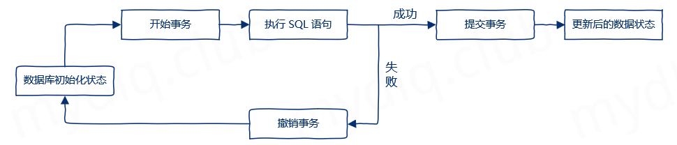
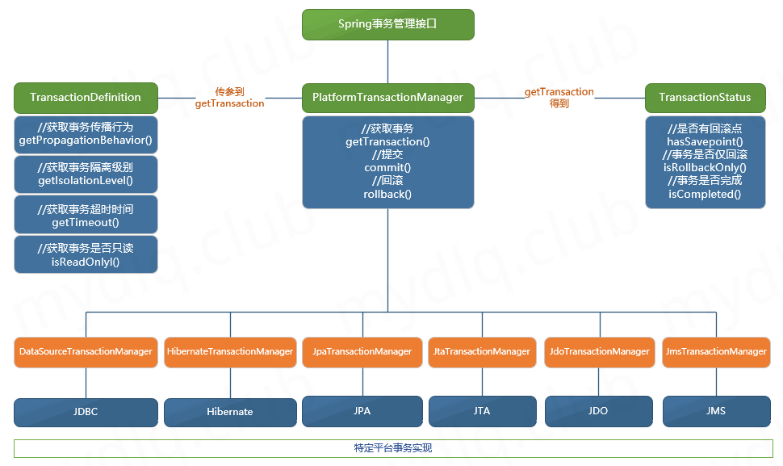
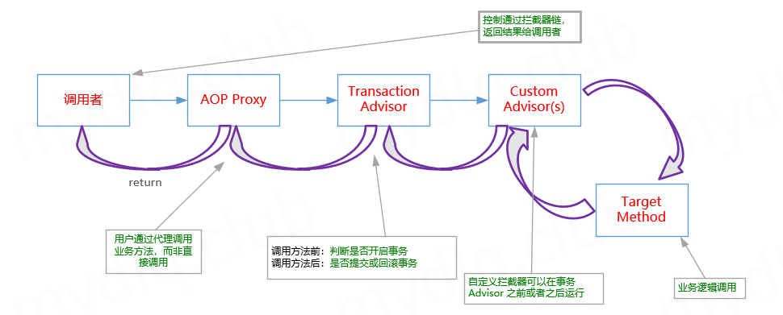
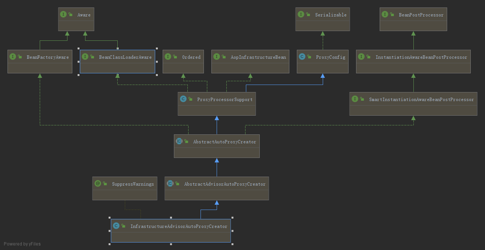

[TOC]


## 事务简介

事务是一组原子操作单元，从数据库角度说，就是一组 SQL 指令向数据库提交，要么全部执行成功，要么撤销不执行。



## 事务的四个属性

事务概念包含四个（ACID）特性，主要有：

- `Atomicity`原子性： 原子性是指，这一个事务当中执行的多个操作，它要么都执行完成，要么都不完成，它不会出现只完成其中一部分这种情况。
- `Consistency`一致性： 一致性是指，这个事务完成以后，它们的状态改变是一致的，它的结果是完整的。一致性更多的是从数据的状态或者结果来表现。
- `Isolation`隔离性： 隔离性是指，在执行不同的事务，它们试图操纵同样的数据的时候，它们之间是相互隔离的。
- `Durability`持久性： 持久性是指，当事务提交以后，数据操作的结果会存储到数据库中永久保存。如果事务还没有提交前，就出现一些故障或者系统宕机等情况，导致事务没有提交，数据的修改不会出现在数据库当中。

## Spring 事务抽象
> Spring 事务其实指的是 Spring 框架中的事务模块。
> 在 Spring 框架中，对执行数据库事务的操作进行了一系列封装，其本质的实现还是在数据库，假如数据库不支持事务的话 Spring 的事务也不会起作用，且 Spring 对事务进行了加强，添加了事务传播行为等功能。

Spring 中事务核心接口类
- `PlatformTransactionManager`： 事务管理器。
- `TransactionDefinition`： 事务的一些基础属性定义，例如事务的传播属性、隔离级别、超时时间等。
- `TransactionStatus`： 事务的一些状态信息，如是否是一个新的事务、是否已被标记为回滚。



`PlatformTransactionManager`事务管理器
- 在 Spring 框架中并不直接管理事务，而是提供 `PlatformTransactionManager` 事务管理器接口类，对事务的概念进行抽象。它将事务的实现交由其它持久层框架。例如 `Hibernate` 或 `Mybatis` 等都是实现了 Spring 事务的第三方持久层框架，由于每个框架中事务的实现方式各不相同，所以 Spring 对事务接口进行了统一，事务的提交、回滚等操作全部交由 `PlatformTransactionManager` 实现类来进行实现。

- 实现了事务管理器接口的实现类主要有
  - `org.springframework.jdbc.datasource.DataSourceTransactionManager`： 使用 `JDBC` 或者 `MyBatis` 进行持久化数据时使用。
  - `org.springframework.transaction.jta.JtaTransactionManager`： 使用一个 `JTA` 实现来管理事务，在一个事务跨越多个资源时必须使用。
  - `org.springframework.orm.hibernate5.HibernateTransactionManager`： 使用 `Hibernate5` 版本进行持久化数据时使用。
  - `org.springframework.orm.jpa.JpaTransactionManager`： 使用 `JPA` 进行持久化数据时使用。
  - `org.springframework.jdo.JdoTransactionManager`： 当持久化机制是 `JDO` 时使用。
  - `org.springframework.jms.connection.JmsTransactionManager`： 当使用支持 `JMS` 协议的消息队列时使用

  ```java
  public interface PlatformTransactionManager {
      /** 根据设定的事务传播行为，返回当前活动的事务或创建一个新的事务务 **/
      TransactionStatus getTransaction(@Nullable TransactionDefinition definition) throws TransactionException;
      
      /** 提交事务 **/
      void commit(TransactionStatus status) throws TransactionException;
      
      /** 回滚事务 **/
      void rollback(TransactionStatus status) throws TransactionException;
  }
  ```

`TransactionDefinition`事务定义
- 事务定义接口类 `TransactionDefinition` 中，主要定义了事务的传播级别、隔离级别、超时时间等属性，和一些获取其相关属性的方法

  ```java
  public interface TransactionDefinition {
      /** 事务的传播行为 **/
      int PROPAGATION_REQUIRED = 0;
      int PROPAGATION_SUPPORTS = 1;
      int PROPAGATION_MANDATORY = 2;
      int PROPAGATION_REQUIRES_NEW = 3;
      int PROPAGATION_NOT_SUPPORTED = 4;
      int PROPAGATION_NEVER = 5;
      int PROPAGATION_NESTED = 6;
      
      /** 事务的隔离级别 **/
      int ISOLATION_DEFAULT = -1;
      int ISOLATION_READ_UNCOMMITTED = 1;
      int ISOLATION_READ_COMMITTED = 2;
      int ISOLATION_REPEATABLE_READ = 4;
      int ISOLATION_SERIALIZABLE = 8;
      
      /** 事务默认超时时间 **/
      int TIMEOUT_DEFAULT = -1;
  
      /** 返回事务传播行为 **/
      default int getPropagationBehavior() {
          return PROPAGATION_REQUIRED;
      }
      /** 返回事务的隔离级别 **/   
      default int getIsolationLevel() {
          return ISOLATION_DEFAULT;
      }
      /** 返回事务超时时间 **/
      default int getTimeout() {
          return TIMEOUT_DEFAULT;
      }
      /** 返回是否作为只读事务进行优化 **/
      default boolean isReadOnly() {
          return false;
      }
      /** 返回当前事务的名称 **/
      String getName();
  }
  ```

`TransactionStatus`事务状态
- 事务的状态有关的接口类，在这个接口类中提供了获取事务相关状态的方法，比如 `hasSavepoint()` 方法可以获取事务是否有回滚点，`isCompleted()` 事务是否执行完成等等

  ```java
  public interface TransactionExecution {
      /** 返回当前事务是否为新事务 **/
      boolean isNewTransaction();
      /** 设置事务仅回滚 **/
      void setRollbackOnly();
      /** 返回事务是否已标记为仅回滚 **/ 
      boolean isRollbackOnly();
      /** 返回是否完成事务 **/
      boolean isCompleted();
  }
  public interface SavepointManager {
      /** 创建回滚点 **/
      Object createSavepoint() throws TransactionException;
      /** 回滚到回滚点 **/
      void rollbackToSavepoint(Object savepoint) throws TransactionException;
      /** 释放回滚点 **/
      void releaseSavepoint(Object savepoint) throws TransactionException;
  }
  
  public interface TransactionStatus extends TransactionExecution, SavepointManager, Flushable {
      /** 判断是否有回滚点 **/
      boolean hasSavepoint();
      /** 对数据存储中的底层会话执行刷新，一般需要接口实现中实现这个刷新机制 **/
      @Override
      void flush();
  }
  ```

## Spring 事务隔离机制

当数据库中有多个事务同时执行时，就可能出现一些问题，比如发生 脏读、不可重复读、幻读 等
- 脏读： 一个事务读取了另一个事务未提交的数据。
  1. 事务1读取一条数据并进行修改；
  2. 事务2读取了事务1修改后的那条数据；
  3. 事务1在执行另外逻辑时发生错误，进行回滚操作；
  4. 事务2现在得到的数据仍然是事务1未提交前的数据（发生回滚导致未提交），即脏数据。
- 不可重复读： 一个事务先后读取相同的数据，发现两次读取的数据内容不一致。
  1. 事务1读取一条数据；
  1. 事务2对事务1读取的那条数据进行了修改，进行提交；
  1. 数据1在再次读取那条数据，发现其和第一次读取的内容不一致（被事务2修改过了），这就发生了不可重复读；
- 幻读： 一个事务按相同的查询条件重新读取以前检索过的数据，却发现其它事务插入了满足其查询条件的新数据。
  1. 事务1根据条件 a 检索到 n 行数据。
  1. 事务2新插入了一条符合条件 a 数据。
  1. 事务1再次根据条件 a 检索，发现数据变为 n+1 行，多了一条数据（事务2插入的数据），让人以为是发生了幻觉，这就是幻读。

三种问题的级别高低： 脏读 < 不可重复读 < 幻读

为了解决上面这些问题，就有了事务隔离级别概念，其中数据库中标准隔离级别有：
- `read uncommitted`读未提交,可以看到未提交的数据，也就是可能发生”脏读”、”不可重复度”、”幻读”
- `read commited`读已提交,可以读取提交的数据，但可能发生”不可重复读”、”幻读”导致多次读取的数据结果不一致
- `repeatable read`可重复读, 可以重复读取，但可能发生”幻读”
- `serializable`串行化,可读不可写，这时最高隔离级别，不会发生上面三种可能出现的问题，但是该模式下写数据必须等待另一个事务结束，对性能有较大影响

其中隔离级别越高安全性也就越高，但安全性提高的同时会使并发性能降低，在正常使用事务隔离级别时，往往都会从中寻找一个比较平衡的级别。

Spring 中定义的隔离级别

隔离级别 	                                | 脏读    |  不可重复读 |  幻读
-----------------|-------|---------|---------
ISOLATION_DEFAULT（默认级别） 	            | 使用数据库 | 中设置的 | 隔离级别
ISOLATION_READ_UNCOMMITTED（读未提交） 	    | √      | √          | √
ISOLATION_READ_COMMITTED（读已提交） 	    | –      | √          | √
ISOLATION_READ_REPEATABLE_READ（可重复读）  | –      | –          | √
ISOLATION_SERIALIZABLE（序列化） 	        | –      | –          | –

## Spring 事务传播行为

[Spring 事务传播行为](http://www.mydlq.club/article/91/)

| 传播行为      | 描述                                      | 是否支持事务 | 是否开启新事务 | 回滚规则                                                     |
| :------------ | :---------------------------------------- | :----------: | :------------: | ------------------------------------------------------------ |
| REQUIRED      | 存在事务加入，<br/>不存在创新事务         |      √       |     不一定     | 存在一个事务：<br/>1、外部有事务加入，异常回滚；
2、外部没事务创建新事务，异常回滚； |
| SUPPORTS      | 存在事务加入，<br/>不存在以非事务         |      √       |       x        | 最多只存在一个事务： <br/>1、外部有事务加入，异常回滚；
2、外部没事务，内部非事务，异常不回滚； |
| MANDATORY     | 存在事务加入，<br/>不存在则抛异常         |      √       |       x        | 最多只存在一个事务： <br/>1、外部存在事务加入，异常回滚；
2、外部不存在事务，异常无法回滚； |
| REQUIRES_NEW  | 存在事务挂起创新事务，<br/>不存在创新事务 |      √       |       x        | 可能存在1-2个事务：<br/>1、外部存在事务挂起，创建新，异常回滚自己的事务 
2、外部不存在事务，创建新， 异常只回滚新事务； |
| NOT_SUPPORTED | 存在事务挂起，<br/>不存在以非事务         |      √       |       x        | 最多只存在一个事务：<br/>1、 外部有事务挂起，外部异常回滚；内部非事务，异常不回滚；
2、外部无事务，内部非事务，异常不回滚； |
| NEVER         | 存在事务抛异常                            |      √       |       x        | 最多只存在一个事务：<br/>1、外部有事务，外部异常回滚；内部非事务不回滚； 
2、外部非事务，内部非事务，异常不回滚； |
| NESTED        | 存在事务进行嵌套事务，<br/>不存在创新事务 |      √       |       x        | 存在一个事务：<br/>1、 外部有事务，嵌套事务创建保存点，外部异常回滚全部事务；
内部嵌套事务异常回滚到保存点；
2、外部不存在事务，内部创建新事务，内部异常回滚； |


## @Transactional是如何工作的 

在应用系统调用声明 `@Transactional` 的目标方法时，Spring 默认使用 AOP 代理，在代码运行时生成一个代理对象，根据 `@transactional` 的属性配置信息，这个代理对象决定该声明 `@transactional` 的目标方法是否由拦截器 `TransactionInterceptor` 来使用拦截，在 `TransactionInterceptor` 拦截时，会在在目标方法开始执行之前创建并加入事务，并执行目标方法的逻辑, 最后根据执行情况是否出现异常, 进行业务事务提交或者回滚操作。



首先从`tx:annotation-driven`说起。配置了`tx:annotation-driven`，就必定有对应的标签解析器类，查看`org.springframework.beans.factory.xml.NamespaceHandler`接口的实现类，可以看到一个`org.springframework.transaction.config.TxNamespaceHandler`，它注册了`org.springframework.transaction.config.AnnotationDrivenBeanDefinitionParser`对`annotation-driven`元素进行解析

```java
public class TxNamespaceHandler extends NamespaceHandlerSupport {

	static final String TRANSACTION_MANAGER_ATTRIBUTE = "transaction-manager";

	static final String DEFAULT_TRANSACTION_MANAGER_BEAN_NAME = "transactionManager";


	static String getTransactionManagerName(Element element) {
		return (element.hasAttribute(TRANSACTION_MANAGER_ATTRIBUTE) ?
				element.getAttribute(TRANSACTION_MANAGER_ATTRIBUTE) : DEFAULT_TRANSACTION_MANAGER_BEAN_NAME);
	}


	@Override
	public void init() {
        // 注册了事务解析器
		registerBeanDefinitionParser("advice", new TxAdviceBeanDefinitionParser());
		registerBeanDefinitionParser("annotation-driven", new AnnotationDrivenBeanDefinitionParser());
		registerBeanDefinitionParser("jta-transaction-manager", new JtaTransactionManagerBeanDefinitionParser());
	}

}
```

`AnnotationDrivenBeanDefinitionParser#parse()`方法没有配置mode参数，则默认使用代理模式进行后续处理；如果配置了`mode=aspectj`，则使用`aspectj`代码织入模式进行后续处理
```java
class AnnotationDrivenBeanDefinitionParser implements BeanDefinitionParser {

	/**
	 * Parses the {@code <tx:annotation-driven/>} tag. Will
	 * {@link org.springframework.aop.config.AopNamespaceUtils#registerAutoProxyCreatorIfNecessary register an AutoProxyCreator}
	 * with the container as necessary.
	 */
	@Override
	@Nullable
	public BeanDefinition parse(Element element, ParserContext parserContext) {
		registerTransactionalEventListenerFactory(parserContext);
		String mode = element.getAttribute("mode");
		if ("aspectj".equals(mode)) {
			// mode="aspectj"
			registerTransactionAspect(element, parserContext);
		}
		else {
			// mode="proxy" 代理模式事务
			AopAutoProxyConfigurer.configureAutoProxyCreator(element, parserContext);
		}
		return null;
	}
}
```

#### 代理模式事务

`org.springframework.transaction.config.AnnotationDrivenBeanDefinitionParser.AopAutoProxyConfigurer`代理模式事务
```java
class AnnotationDrivenBeanDefinitionParser implements BeanDefinitionParser {

    public static void configureAutoProxyCreator(Element element, ParserContext parserContext) {
        /**
         * 最终向容器里注入 InfrastructureAdvisorAutoProxyCreator 类 BeanDefinition
         */
        AopNamespaceUtils.registerAutoProxyCreatorIfNecessary(parserContext, element);

        String txAdvisorBeanName = TransactionManagementConfigUtils.TRANSACTION_ADVISOR_BEAN_NAME;
        if (!parserContext.getRegistry().containsBeanDefinition(txAdvisorBeanName)) {
            Object eleSource = parserContext.extractSource(element);

            // Create the TransactionAttributeSource definition.
            RootBeanDefinition sourceDef = new RootBeanDefinition(
                    "org.springframework.transaction.annotation.AnnotationTransactionAttributeSource");
            sourceDef.setSource(eleSource);
            sourceDef.setRole(BeanDefinition.ROLE_INFRASTRUCTURE);
            String sourceName = parserContext.getReaderContext().registerWithGeneratedName(sourceDef);

            // Create the TransactionInterceptor definition.
            RootBeanDefinition interceptorDef = new RootBeanDefinition(TransactionInterceptor.class);
            interceptorDef.setSource(eleSource);
            interceptorDef.setRole(BeanDefinition.ROLE_INFRASTRUCTURE);
            registerTransactionManager(element, interceptorDef);
            interceptorDef.getPropertyValues().add("transactionAttributeSource", new RuntimeBeanReference(sourceName));
            String interceptorName = parserContext.getReaderContext().registerWithGeneratedName(interceptorDef);

            // Create the TransactionAttributeSourceAdvisor definition.
            RootBeanDefinition advisorDef = new RootBeanDefinition(BeanFactoryTransactionAttributeSourceAdvisor.class);
            advisorDef.setSource(eleSource);
            advisorDef.setRole(BeanDefinition.ROLE_INFRASTRUCTURE);
            advisorDef.getPropertyValues().add("transactionAttributeSource", new RuntimeBeanReference(sourceName));
            advisorDef.getPropertyValues().add("adviceBeanName", interceptorName);
            if (element.hasAttribute("order")) {
                advisorDef.getPropertyValues().add("order", element.getAttribute("order"));
            }
            parserContext.getRegistry().registerBeanDefinition(txAdvisorBeanName, advisorDef);

            CompositeComponentDefinition compositeDef = new CompositeComponentDefinition(element.getTagName(), eleSource);
            compositeDef.addNestedComponent(new BeanComponentDefinition(sourceDef, sourceName));
            compositeDef.addNestedComponent(new BeanComponentDefinition(interceptorDef, interceptorName));
            compositeDef.addNestedComponent(new BeanComponentDefinition(advisorDef, txAdvisorBeanName));
            parserContext.registerComponent(compositeDef);
        }
    }
}

public abstract class AopNamespaceUtils {
	public static void registerAutoProxyCreatorIfNecessary(
			ParserContext parserContext, Element sourceElement) {
        /**
         * 往容器里注入了 {@link org.springframework.aop.framework.autoproxy.InfrastructureAdvisorAutoProxyCreator } 类
         *      InfrastructureAdvisorAutoProxyCreator.class 字节码创建出其 BeanDefinition
         */
		BeanDefinition beanDefinition = AopConfigUtils.registerAutoProxyCreatorIfNecessary(
				parserContext.getRegistry(), parserContext.extractSource(sourceElement));
		useClassProxyingIfNecessary(parserContext.getRegistry(), sourceElement);
		registerComponentIfNecessary(beanDefinition, parserContext);
	}
}

public abstract class AopConfigUtils {
	@Nullable
	public static BeanDefinition registerAutoProxyCreatorIfNecessary(BeanDefinitionRegistry registry,
			@Nullable Object source) {
        /**
         * 最终向容器里注入 InfrastructureAdvisorAutoProxyCreator 类
         */
		return registerOrEscalateApcAsRequired(InfrastructureAdvisorAutoProxyCreator.class, registry, source);
	}
}
```

#### InfrastructureAdvisorAutoProxyCreator

通过类图可以发现`InfrastructureAdvisorAutoProxyCreator`间接实现了`BeanPostProcessor`接口，从`AbstractAutoProxyCreator`类中继承了`postProcessAfterInitialization`方法。Spring容器在初始化每个单例bean的时候，会遍历容器中的所有`BeanPostProcessor`实现类，并执行其`postProcessAfterInitialization`方法。
    




```java
public abstract class AbstractAutoProxyCreator extends ProxyProcessorSupport
		implements SmartInstantiationAwareBeanPostProcessor, BeanFactoryAware {
	
    /**
	 * Create a proxy with the configured interceptors if the bean is
	 * identified as one to proxy by the subclass.
	 * {@see org.springframework.aop.framework.autoproxy.AbstractAutoProxyCreator#getAdvicesAndAdvisorsForBean }
	 */
	@Override
	public Object postProcessAfterInitialization(@Nullable Object bean, String beanName) throws BeansException {
		if (bean != null) {
			Object cacheKey = getCacheKey(bean.getClass(), beanName);
			if (!this.earlyProxyReferences.contains(cacheKey)) {
                /**
                 * 创建代理对象的核心方法
                 */
				return wrapIfNecessary(bean, beanName, cacheKey);
			}
		}
		return bean;
	}

	/**
     * 创建代理对象的核心方法
	 * Wrap the given bean if necessary, i.e. if it is eligible for being proxied.
	 * @param bean the raw bean instance
	 * @param beanName the name of the bean
	 * @param cacheKey the cache key for metadata access
	 * @return a proxy wrapping the bean, or the raw bean instance as-is
	 */
	protected Object wrapIfNecessary(Object bean, String beanName, Object cacheKey) {
		if (StringUtils.hasLength(beanName) && this.targetSourcedBeans.contains(beanName)) {
			return bean;
		}
		if (Boolean.FALSE.equals(this.advisedBeans.get(cacheKey))) {
			return bean;
		}
		if (isInfrastructureClass(bean.getClass()) || shouldSkip(bean.getClass(), beanName)) {
			this.advisedBeans.put(cacheKey, Boolean.FALSE);
			return bean;
		}

        /**
         * Create proxy if we have advice.
         * 创建代理对象的核心方法
         * getAdvicesAndAdvisorsForBean方法会遍历容器中所有的切面，
         *  查找与当前实例化bean匹配的切面，这里就是获取事务属性切面，
         *  查找@Transactional注解及其属性值，具体实现比较复杂，这里暂不深入分析，
         *  最终会得到Advisor切面接口的 {@link org.springframework.transaction.interceptor.BeanFactoryTransactionAttributeSourceAdvisor } 切面实例，
         *  然后根据得到的切面进入createProxy方法，创建一个AOP代理
         */
		Object[] specificInterceptors = getAdvicesAndAdvisorsForBean(bean.getClass(), beanName, null);
        /**
         * protected static final Object[] DO_NOT_PROXY = null;
         * 存在切面时
         */
		if (specificInterceptors != DO_NOT_PROXY) {
			this.advisedBeans.put(cacheKey, Boolean.TRUE);
            /**
             * 创建一个AOP代理
             */
			Object proxy = createProxy(
					bean.getClass(), beanName, specificInterceptors, new SingletonTargetSource(bean));
			this.proxyTypes.put(cacheKey, proxy.getClass());
			return proxy;
		}

		this.advisedBeans.put(cacheKey, Boolean.FALSE);
		return bean;
	}

    /**
	 * Create an AOP proxy for the given bean. 根据指定的bean及得到的切面创建一个AOP代理
	 * @param beanClass the class of the bean
	 * @param beanName the name of the bean
	 * @param specificInterceptors the set of interceptors that is
	 * specific to this bean (may be empty, but not null)
	 * @param targetSource the TargetSource for the proxy,
	 * already pre-configured to access the bean
	 * @return the AOP proxy for the bean
	 * @see org.springframework.aop.framework.autoproxy.AbstractAutoProxyCreator#buildAdvisors
	 */
	protected Object createProxy(Class<?> beanClass, @Nullable String beanName,
			@Nullable Object[] specificInterceptors, TargetSource targetSource) {

		if (this.beanFactory instanceof ConfigurableListableBeanFactory) {
			AutoProxyUtils.exposeTargetClass((ConfigurableListableBeanFactory) this.beanFactory, beanName, beanClass);
		}

		ProxyFactory proxyFactory = new ProxyFactory();
		proxyFactory.copyFrom(this);

		if (!proxyFactory.isProxyTargetClass()) {
			if (shouldProxyTargetClass(beanClass, beanName)) {
				proxyFactory.setProxyTargetClass(true);
			}
			else {
				evaluateProxyInterfaces(beanClass, proxyFactory);
			}
		}
        // 切面
		Advisor[] advisors = buildAdvisors(beanName, specificInterceptors);
		proxyFactory.addAdvisors(advisors);
		proxyFactory.setTargetSource(targetSource);
		customizeProxyFactory(proxyFactory);

		proxyFactory.setFrozen(this.freezeProxy);
		if (advisorsPreFiltered()) {
			proxyFactory.setPreFiltered(true);
		}
        /**
         * 根据代理工厂设置创建一个新的代理
         * @see org.springframework.aop.framework.ProxyFactory#getProxy(java.lang.ClassLoader)
         */
		return proxyFactory.getProxy(getProxyClassLoader());
	}
}

public class ProxyFactory extends ProxyCreatorSupport {
    /**
	 * Create a new proxy according to the settings in this factory. 根据代理工厂设置创建一个新的代理
	 * <p>Can be called repeatedly. Effect will vary if we've added
	 * or removed interfaces. Can add and remove interceptors.
	 * <p>Uses the given class loader (if necessary for proxy creation).
	 * @param classLoader the class loader to create the proxy with
	 * (or {@code null} for the low-level proxy facility's default)
	 * @return the proxy object
	 */
	public Object getProxy(@Nullable ClassLoader classLoader) {
        /**
         * 通过父类 {@link org.springframework.aop.framework.ProxyCreatorSupport#createAopProxy } 创建一个新的代理
         */
		return createAopProxy().getProxy(classLoader);
	}
}

public class ProxyCreatorSupport extends AdvisedSupport {
	/**
	 * Subclasses should call this to get a new AOP proxy. They should <b>not</b>
	 * create an AOP proxy with {@code this} as an argument.
	 */
	protected final synchronized AopProxy createAopProxy() {
		if (!this.active) {
			activate();
		}
        /**
         * 最终通过 {@link org.springframework.aop.framework.DefaultAopProxyFactory#createAopProxy } 
         * 决定使用JDK还是Cglib创建代理创建一个新的代理
         */
		return getAopProxyFactory().createAopProxy(this);
	}
}

public class DefaultAopProxyFactory implements AopProxyFactory, Serializable {

    /**
     * 最终通过 {@link org.springframework.aop.framework.DefaultAopProxyFactory#createAopProxy } 
     * 决定使用JDK还是Cglib创建代理创建一个新的代理
     */
	@Override
	public AopProxy createAopProxy(AdvisedSupport config) throws AopConfigException {
		if (config.isOptimize() || config.isProxyTargetClass() || hasNoUserSuppliedProxyInterfaces(config)) {
			Class<?> targetClass = config.getTargetClass();
			if (targetClass == null) {
				throw new AopConfigException("TargetSource cannot determine target class: " +
						"Either an interface or a target is required for proxy creation.");
			}
			if (targetClass.isInterface() || Proxy.isProxyClass(targetClass)) {
                // JDK动态代理
				return new JdkDynamicAopProxy(config);
			}
            // CGLIB动态代理
			return new ObjenesisCglibAopProxy(config);
		}
		else {
            // JDK动态代理
			return new JdkDynamicAopProxy(config);
		}
	}
}

final class JdkDynamicAopProxy implements AopProxy, InvocationHandler, Serializable {
	@Override
	public Object getProxy(@Nullable ClassLoader classLoader) {
		if (logger.isDebugEnabled()) {
			logger.debug("Creating JDK dynamic proxy: target source is " + this.advised.getTargetSource());
		}
		Class<?>[] proxiedInterfaces = AopProxyUtils.completeProxiedInterfaces(this.advised, true);
		findDefinedEqualsAndHashCodeMethods(proxiedInterfaces);
        /**
         * 熟悉的JDK动态代理 
         *  指定的 InvocationHandler 参数是 this 即JdkDynamicAopProxy类本身实现了 InvocationHandler 接口 
         *      也就是说在对目标类进行调用的时候，会进入JdkDynamicAopProxy的invoke方法
         */
		return Proxy.newProxyInstance(classLoader, proxiedInterfaces, this);
	}

	/**
	 * Implementation of {@code InvocationHandler.invoke}.
	 * <p>Callers will see exactly the exception thrown by the target,
	 * unless a hook method throws an exception.
	 */
	@Override
	@Nullable
	public Object invoke(Object proxy, Method method, Object[] args) throws Throwable {
	    //.... 
	    // 只重点代码
            // Get the interception chain for this method.
            /**
             * 获取的是当前目标方法对应的拦截器，
             * 里面是根据之前获取到的切面来获取相对应拦截器，这时候会得到 TransactionInterceptor 实例
             */
            List<Object> chain = this.advised.getInterceptorsAndDynamicInterceptionAdvice(method, targetClass);
			// Check whether we have any advice. If we don't, we can fallback on direct
			// reflective invocation of the target, and avoid creating a MethodInvocation.
			if (chain.isEmpty()) {
				// We can skip creating a MethodInvocation: just invoke the target directly
				// Note that the final invoker must be an InvokerInterceptor so we know it does
				// nothing but a reflective operation on the target, and no hot swapping or fancy proxying.
				Object[] argsToUse = AopProxyUtils.adaptArgumentsIfNecessary(method, args);
                // 获取到拦截器，则会创建 MethodInvocation
				retVal = AopUtils.invokeJoinpointUsingReflection(target, method, argsToUse);
			}
            /**
             * 如果获取不到拦截器，则不会创建MethodInvocation，直接调用目标方法
             *
             */
			else {
				// We need to create a method invocation...
                /**
                 * 使用 TransactionInterceptor 创建一个 ReflectiveMethodInvocation 实例，
                 * 调用的时候进入 {@link org.springframework.aop.framework.ReflectiveMethodInvocation#proceed } 方法
                 */
				invocation = new ReflectiveMethodInvocation(proxy, target, method, args, targetClass, chain);
				// Proceed to the joinpoint through the interceptor chain.
				retVal = invocation.proceed();
			}
	}
}

public class ReflectiveMethodInvocation implements ProxyMethodInvocation, Cloneable {
    @Override
	@Nullable
	public Object proceed() throws Throwable {
		//	We start with an index of -1 and increment early.
		if (this.currentInterceptorIndex == this.interceptorsAndDynamicMethodMatchers.size() - 1) {
			return invokeJoinpoint();
		}

		Object interceptorOrInterceptionAdvice =
				this.interceptorsAndDynamicMethodMatchers.get(++this.currentInterceptorIndex);
		if (interceptorOrInterceptionAdvice instanceof InterceptorAndDynamicMethodMatcher) {
			// Evaluate dynamic method matcher here: static part will already have
			// been evaluated and found to match.
			InterceptorAndDynamicMethodMatcher dm =
					(InterceptorAndDynamicMethodMatcher) interceptorOrInterceptionAdvice;
			if (dm.methodMatcher.matches(this.method, this.targetClass, this.arguments)) {
				return dm.interceptor.invoke(this);
			}
			else {
				// Dynamic matching failed.
				// Skip this interceptor and invoke the next in the chain.
				return proceed();
			}
		}
		else {
			// It's an interceptor, so we just invoke it: The pointcut will have
			// been evaluated statically before this object was constructed.
            /**
             * interceptorOrInterceptionAdvice 就是 TransactionInterceptor 的实例
             * 执行invoke方法进入{@link org.springframework.transaction.interceptor.TransactionInterceptor#invoke }方法
             */
			return ((MethodInterceptor) interceptorOrInterceptionAdvice).invoke(this);
		}
	}
}

public class TransactionInterceptor extends TransactionAspectSupport implements MethodInterceptor, Serializable {

	@Override
	@Nullable
	public Object invoke(final MethodInvocation invocation) throws Throwable {
		// Work out the target class: may be {@code null}.
		// The TransactionAttributeSource should be passed the target class
		// as well as the method, which may be from an interface.
		Class<?> targetClass = (invocation.getThis() != null ? AopUtils.getTargetClass(invocation.getThis()) : null);

		// Adapt to TransactionAspectSupport's invokeWithinTransaction...
		return invokeWithinTransaction(invocation.getMethod(), targetClass, invocation::proceed);
	}
}
```

#### TransactionInterceptor

`TransactionInterceptor`从父类`TransactionAspectSupport`中继承了`invokeWithinTransaction`方法
```java
public abstract class TransactionAspectSupport implements BeanFactoryAware, InitializingBean {
    /**
	 * General delegate for around-advice-based subclasses, delegating to several other template
	 * methods on this class. Able to handle {@link CallbackPreferringPlatformTransactionManager}
	 * as well as regular {@link PlatformTransactionManager} implementations.
	 * @param method the Method being invoked
	 * @param targetClass the target class that we're invoking the method on
	 * @param invocation the callback to use for proceeding with the target invocation
	 * @return the return value of the method, if any
	 * @throws Throwable propagated from the target invocation
	 */
	@Nullable
	protected Object invokeWithinTransaction(Method method, @Nullable Class<?> targetClass,
			final InvocationCallback invocation) throws Throwable {

		// If the transaction attribute is null, the method is non-transactional.
		TransactionAttributeSource tas = getTransactionAttributeSource();
		final TransactionAttribute txAttr = (tas != null ? tas.getTransactionAttribute(method, targetClass) : null);
		final PlatformTransactionManager tm = determineTransactionManager(txAttr);
		final String joinpointIdentification = methodIdentification(method, targetClass, txAttr);
        /**
         * 声明式事务
         *  在需要进行事务操作的时候，Spring会在调用目标类的目标方法之前进行开启事务、调用异常回滚事务、调用完成会提交事务
         *  是否需要开启新事务，是根据@Transactional注解上配置的参数值来判断的。如果需要开启新事务，获取Connection连接，然后将连接的自动提交事务改为false，改为手动提交
         */
		if (txAttr == null || !(tm instanceof CallbackPreferringPlatformTransactionManager)) {
			// Standard transaction demarcation with getTransaction and commit/rollback calls.
            // 是否开启事务操作
			TransactionInfo txInfo = createTransactionIfNecessary(tm, txAttr, joinpointIdentification);
			Object retVal = null;
			try {
				// This is an around advice: Invoke the next interceptor in the chain.
				// This will normally result in a target object being invoked.
                // 调用目标类目标方法
				retVal = invocation.proceedWithInvocation();
			}
			catch (Throwable ex) {
				// target invocation exception
                // 异常时事务回滚操作 
				completeTransactionAfterThrowing(txInfo, ex);
				throw ex;
			}
			finally {
				cleanupTransactionInfo(txInfo);
			}
            // 事务提交
			commitTransactionAfterReturning(txInfo);
			return retVal;
		}
        /**
         * 编程式事务处理
         */
		else {
			final ThrowableHolder throwableHolder = new ThrowableHolder();

			// It's a CallbackPreferringPlatformTransactionManager: pass a TransactionCallback in.
			try {
				Object result = ((CallbackPreferringPlatformTransactionManager) tm).execute(txAttr, status -> {
					TransactionInfo txInfo = prepareTransactionInfo(tm, txAttr, joinpointIdentification, status);
					try {
						return invocation.proceedWithInvocation();
					}
					catch (Throwable ex) {
						if (txAttr.rollbackOn(ex)) {
							// A RuntimeException: will lead to a rollback.
							if (ex instanceof RuntimeException) {
								throw (RuntimeException) ex;
							}
							else {
								throw new ThrowableHolderException(ex);
							}
						}
						else {
							// A normal return value: will lead to a commit.
							throwableHolder.throwable = ex;
							return null;
						}
					}
					finally {
						cleanupTransactionInfo(txInfo);
					}
				});

				// Check result state: It might indicate a Throwable to rethrow.
				if (throwableHolder.throwable != null) {
					throw throwableHolder.throwable;
				}
				return result;
			}
			catch (ThrowableHolderException ex) {
				throw ex.getCause();
			}
			catch (TransactionSystemException ex2) {
				if (throwableHolder.throwable != null) {
					logger.error("Application exception overridden by commit exception", throwableHolder.throwable);
					ex2.initApplicationException(throwableHolder.throwable);
				}
				throw ex2;
			}
			catch (Throwable ex2) {
				if (throwableHolder.throwable != null) {
					logger.error("Application exception overridden by commit exception", throwableHolder.throwable);
				}
				throw ex2;
			}
		}
	}

    /**
     * 目标类的目标方法进行调用的时候，若发生异常将会进入
	 * Handle a throwable, completing the transaction.
	 * We may commit or roll back, depending on the configuration.
	 * @param txInfo information about the current transaction
	 * @param ex throwable encountered
	 */
	protected void completeTransactionAfterThrowing(@Nullable TransactionInfo txInfo, Throwable ex) {
		if (txInfo != null && txInfo.getTransactionStatus() != null) {
			if (logger.isTraceEnabled()) {
				logger.trace("Completing transaction for [" + txInfo.getJoinpointIdentification() +
						"] after exception: " + ex);
			}
            /**
             * 针对 ex 某些异常才会进行事务回滚
             * Spring并不会对所有类型异常都进行事务回滚操作，默认是只对Unchecked Exception(Error和RuntimeException)进行事务回滚操作
             *      @see org.springframework.transaction.interceptor.DefaultTransactionAttribute#rollbackOn
             *          此方法中定义了默认只针对Error和RuntimeException异常时回滚
             */
			if (txInfo.transactionAttribute != null && txInfo.transactionAttribute.rollbackOn(ex)) {
				try {
					txInfo.getTransactionManager().rollback(txInfo.getTransactionStatus());
				}
				catch (TransactionSystemException ex2) {
					logger.error("Application exception overridden by rollback exception", ex);
					ex2.initApplicationException(ex);
					throw ex2;
				}
				catch (RuntimeException | Error ex2) {
					logger.error("Application exception overridden by rollback exception", ex);
					throw ex2;
				}
			}
            /**
             * 不回滚事务
             */
			else {
				// We don't roll back on this exception.
				// Will still roll back if TransactionStatus.isRollbackOnly() is true.
				try {
					txInfo.getTransactionManager().commit(txInfo.getTransactionStatus());
				}
				catch (TransactionSystemException ex2) {
					logger.error("Application exception overridden by commit exception", ex);
					ex2.initApplicationException(ex);
					throw ex2;
				}
				catch (RuntimeException | Error ex2) {
					logger.error("Application exception overridden by commit exception", ex);
					throw ex2;
				}
			}
		}
	}
}
```

Spring并不会对所有类型异常都进行事务回滚操作，默认是只对Unchecked Exception(Error和RuntimeException)进行事务回滚操作
```java
public class DefaultTransactionAttribute extends DefaultTransactionDefinition implements TransactionAttribute {

	@Override
	public boolean rollbackOn(Throwable ex) {
        // 定义了默认只针对Error和RuntimeException异常时回滚
		return (ex instanceof RuntimeException || ex instanceof Error);
	}
}
```

Spring使用AOP实现事务的统一管理但使需要注意
- `A`类的`a1`方法没有标注`@Transactional`，`a2`方法标注`@Transactional`，在`a1`里面调用`a2`
  - 是不会开启事务的原因很简单，`a1`方法是目标类`A`的原生方法，调用`a1`的时候即直接进入目标类`A`进行调用，在目标类`A`里面只有`a2`的原生方法，在`a1`里调用`a2`，即直接执行`a2
  `的原生方法，并不通过创建代理对象进行调用，所以并不会进入`TransactionInterceptor#invoke`方法，不会开启事务。
- 将`@Transactional`注解标注在非`public`方法上
  - `@Transactional`的工作机制是基于AOP实现的，而AOP是使用动态代理实现的，动态代理要么是JDK方式、要么是Cglib方式。
    - 如果是JDK动态代理的方式，根据上面的分析可以知道，目标类的目标方法是在接口中定义的，也就是必须是`public`修饰的方法才可以被代理。
    - 如果是Cglib方式，代理类是目标类的子类，理论上可以代理`public`和`protected`方法，但是Spring在进行事务增强是否能够应用到当前目标类判断的时候，遍历的是目标类的`public`方法，所以Cglib方式也只对`public`方法有效。

  ```java
  public abstract class AopUtils {
    /**
  	 * Can the given pointcut apply at all on the given class?
  	 * <p>This is an important test as it can be used to optimize
  	 * out a pointcut for a class.
  	 * @param pc the static or dynamic pointcut to check
  	 * @param targetClass the class to test
  	 * @param hasIntroductions whether or not the advisor chain
  	 * for this bean includes any introductions
  	 * @return whether the pointcut can apply on any method
  	 */
  	public static boolean canApply(Pointcut pc, Class<?> targetClass, boolean hasIntroductions) {
  		Assert.notNull(pc, "Pointcut must not be null");
  		if (!pc.getClassFilter().matches(targetClass)) {
  			return false;
  		}
  
  		MethodMatcher methodMatcher = pc.getMethodMatcher();
  		if (methodMatcher == MethodMatcher.TRUE) {
  			// No need to iterate the methods if we're matching any method anyway...
  			return true;
  		}
  
  		IntroductionAwareMethodMatcher introductionAwareMethodMatcher = null;
  		if (methodMatcher instanceof IntroductionAwareMethodMatcher) {
  			introductionAwareMethodMatcher = (IntroductionAwareMethodMatcher) methodMatcher;
  		}
  
  		Set<Class<?>> classes = new LinkedHashSet<>();
  		if (!Proxy.isProxyClass(targetClass)) {
  			classes.add(ClassUtils.getUserClass(targetClass));
  		}
  		classes.addAll(ClassUtils.getAllInterfacesForClassAsSet(targetClass));
  
  		for (Class<?> clazz : classes) {
            /**
             * 获取需要增强的方法
             */
  			Method[] methods = ReflectionUtils.getAllDeclaredMethods(clazz);
  			for (Method method : methods) {
  				if ((introductionAwareMethodMatcher != null &&
  						introductionAwareMethodMatcher.matches(method, targetClass, hasIntroductions)) ||
  						methodMatcher.matches(method, targetClass)) {
  					return true;
  				}
  			}
  		}
  
  		return false;
  	}
  }
  ```


