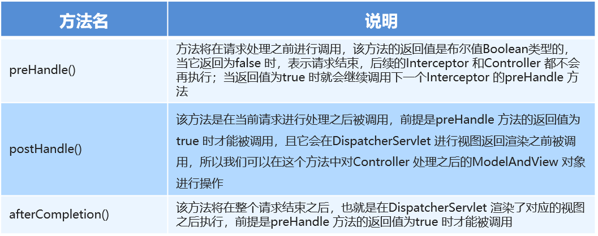
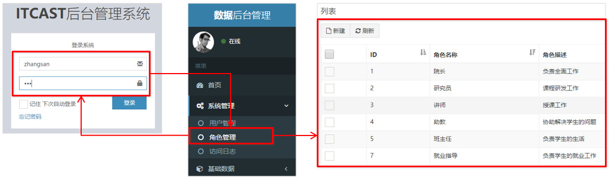

[TOC]


## SpringIOC

[SpringIOC](../spring-ioc/README.md)

## spring注解

[spring annotation](../spring-annotation/README.md)

## spring切面编程

[spring aop](../spring-aop/README.md)

## spring jdbctemplate

[spring jdbctemplate](../spring-jdbctemplate/README.md)

## SpringMVC web环境集成

[SpringMVC web环境集成](../springmvc-quickstart/README.md)

## SpringMVC请求和响应

[SpringMVC请求和响应](../springmvc-request-response/README.md)


# SpringMVC的拦截器

## 01-SpringMVC拦截器-拦截器的作用(理解)

Spring MVC 的拦截器类似于 Servlet  开发中的过滤器 `Filter`，用于对处理器进行预处理和后处理。
将拦截器按一定的顺序联结成一条链，这条链称为拦截器链`InterceptorChain`。在访问被拦截的方法或字段时，拦截器链中的拦截器就会按其之前定义的顺序被调用。拦截器也是AOP思想的具体实现。

## 02-SpringMVC拦截器-interceptor和filter区别(理解，记忆)

关于interceptor和filter的区别，如图所示：

|   区别   |                          过滤器                           |                            拦截器                            |
| :------: | :-------------------------------------------------------: | :----------------------------------------------------------: |
| 使用范围 |  是 servlet 规范中的一部分，任何 Java Web 工程都可以使用  | 是 SpringMVC 框架自己的，只有使用了 SpringMVC 框架的工程才能使用 |
| 拦截范围 | 在 url-pattern 中配置 /* 之后，可以对所有要访问的资源拦截 | 只会拦截访问控制器方法，如果访问的是 jsp、html、css、image或者js是不会进行拦截的 |


## 03-SpringMVC拦截器-快速入门(应用)

自定义拦截器很简单，只有如下三步：

①创建拦截器类实现HandlerInterceptor接口

②配置拦截器

③测试拦截器的拦截效果


编写拦截器：

```java
package tk.deriwotua.interceptor;

import org.springframework.web.servlet.HandlerInterceptor;
import org.springframework.web.servlet.ModelAndView;

import javax.servlet.ServletException;
import javax.servlet.http.HttpServletRequest;
import javax.servlet.http.HttpServletResponse;
import java.io.IOException;

public class MyInterceptor1 implements HandlerInterceptor {
    //在目标方法执行之前 执行
    public boolean preHandle(HttpServletRequest request, HttpServletResponse response, Object handler) throws ServletException, IOException {
        System.out.println("preHandle.....");
        String param = request.getParameter("param");
        if("yes".equals(param)){
            return true;
        }else{
            request.getRequestDispatcher("/error.jsp").forward(request,response);
            return false;//返回true代表放行  返回false代表不放行
        }
    }

    //在目标方法执行之后 视图对象返回之前执行
    public void postHandle(HttpServletRequest request, HttpServletResponse response, Object handler, ModelAndView modelAndView) {
        modelAndView.addObject("name","deri");
        System.out.println("postHandle...");
    }

    //在流程都执行完毕后 执行
    public void afterCompletion(HttpServletRequest request, HttpServletResponse response, Object handler, Exception ex) {
        System.out.println("afterCompletion....");
    }
}
```

配置：在SpringMVC的配置文件中配置

```xml
<?xml version="1.0" encoding="UTF-8"?>
<beans xmlns="http://www.springframework.org/schema/beans"
       xmlns:xsi="http://www.w3.org/2001/XMLSchema-instance"
       xmlns:mvc="http://www.springframework.org/schema/mvc"
       xmlns:context="http://www.springframework.org/schema/context"
       xsi:schemaLocation="
       http://www.springframework.org/schema/beans http://www.springframework.org/schema/beans/spring-beans.xsd
       http://www.springframework.org/schema/mvc http://www.springframework.org/schema/mvc/spring-mvc.xsd
       http://www.springframework.org/schema/context http://www.springframework.org/schema/context/spring-context.xsd
">

    <!--1、mvc注解驱动-->
    <mvc:annotation-driven/>

    <!--2、配置视图解析器-->
    <bean class="org.springframework.web.servlet.view.InternalResourceViewResolver">
        <property name="prefix" value="/"/>
        <property name="suffix" value=".jsp"/>
    </bean>

    <!--3、静态资源权限开放-->
    <mvc:default-servlet-handler/>

    <!--4、组件扫描  扫描Controller-->
    <context:component-scan base-package="tk.deriwotua.controller"/>

    <!--配置拦截器-->
    <mvc:interceptors>
        <mvc:interceptor>
            <!--对哪些资源执行拦截操作-->
            <mvc:mapping path="/**"/>
            <bean class="tk.deriwotua.interceptor.MyInterceptor1"/>
        </mvc:interceptor>
    </mvc:interceptors>

</beans>
```

编写测试程序测试：编写Controller,发请求到controller,跳转页面

```java
@Controller
public class TargetController {

    @RequestMapping("/target")
    public ModelAndView show(){
        System.out.println("目标资源执行......");
        ModelAndView modelAndView = new ModelAndView();
        modelAndView.addObject("name","itcast");
        modelAndView.setViewName("index");
        return modelAndView;
    }
}
```

页面

```jsp
<html>
<body>
<h2>Hello World! ${name}</h2>
</body>
</html>
```


## 04-SpringMVC拦截器-快速入门详解(应用)

拦截器在预处理后什么情况下会执行目标资源，什么情况下不执行目标资源，以及在有多个拦截器的情况下拦截器的执行顺序是什么?

再编写一个拦截器2，

```java
public class MyInterceptor2 implements HandlerInterceptor {
    //在目标方法执行之前 执行
    public boolean preHandle(HttpServletRequest request, HttpServletResponse response, Object handler) throws ServletException, IOException {
        System.out.println("preHandle22222.....");
        return true;
    }

    //在目标方法执行之后 视图对象返回之前执行
    public void postHandle(HttpServletRequest request, HttpServletResponse response, Object handler, ModelAndView modelAndView) {
        System.out.println("postHandle2222...");
    }

    //在流程都执行完毕后 执行
    public void afterCompletion(HttpServletRequest request, HttpServletResponse response, Object handler, Exception ex) {
        System.out.println("afterCompletion2222....");
    }
}
```

配置拦截器2

```xml
<!--配置拦截器-->
<mvc:interceptors>
    <mvc:interceptor>
        <!--对哪些资源执行拦截操作-->
        <mvc:mapping path="/**"/>
        <bean class="tk.deriwotua.interceptor.MyInterceptor2"/>
    </mvc:interceptor>
    <mvc:interceptor>
        <!--对哪些资源执行拦截操作-->
        <mvc:mapping path="/**"/>
        <bean class="tk.deriwotua.interceptor.MyInterceptor1"/>
    </mvc:interceptor>
</mvc:interceptors>
```

结论：**当拦截器的preHandle方法返回true则会执行目标资源，如果返回false则不执行目标资源**。多个拦截器情况下，配置在前的先执行，配置在后的后执行。拦截器中的方法执行顺序是：`preHandler()--目标资源--postHandle()-- afterCompletion()`

## 05-SpringMVC拦截器-知识小结(记忆)

拦截器中的方法说明如下



## 06-SpringMVC拦截器-用户登录权限控制分析(理解)

在day06-Spring练习案例的基础之上：用户没有登录的情况下，不能对后台菜单进行访问操作，点击菜单跳转到登录页面，只有用户登录成功后才能进行后台功能的操作

需求图：



## 07-SpringMVC拦截器-用户登录权限控制代码实现1(应用)

判断用户是否登录  本质：判断session中有没有user，如果没有登陆则先去登陆，如果已经登陆则直接放行访问目标资源

先编写拦截器如下：

```java
public class PrivilegeInterceptor implements HandlerInterceptor {
    public boolean preHandle(HttpServletRequest request, HttpServletResponse response, Object handler) throws IOException {
        //逻辑：判断用户是否登录  本质：判断session中有没有user
        HttpSession session = request.getSession();
        User user = (User) session.getAttribute("user");
        if(user==null){
            //没有登录
            response.sendRedirect(request.getContextPath()+"/login.jsp");
            return false;
        }
        //放行  访问目标资源
        return true;
    }
}
```

然后配置该拦截器：找到项目案例的spring-mvc.xml，添加如下配置：

```xml
<!--配置权限拦截器-->
<mvc:interceptors>
    <mvc:interceptor>
        <!--配置对哪些资源执行拦截操作-->
        <mvc:mapping path="/**"/>
        <bean class="tk.deriwotua.interceptor.PrivilegeInterceptor"/>
    </mvc:interceptor>
</mvc:interceptors>
```

## 08-SpringMVC拦截器-用户登录权限控制代码实现2(应用)

在登陆页面输入用户名密码，点击登陆，通过用户名密码进行查询，如果登陆成功，则将用户信息实体存入session，然后跳转到首页，如果登陆失败则继续回到登陆页面

在UserController中编写登陆逻辑

```java
@RequestMapping("/login")
public String login(String username,String password,HttpSession session){
    User user = userService.login(username,password);
    if(user!=null){
        //登录成功  将user存储到session
        session.setAttribute("user",user);
        return "redirect:/index.jsp";
    }
    return "redirect:/login.jsp";
}
```

service层代码如下：

```java
//service层
public User login(String username, String password) {
    User user = userDao.findByUsernameAndPassword(username,password);
    return user;
}
```

dao层代码如下：

```java
//dao层
 public User findByUsernameAndPassword(String username, String password) throws EmptyResultDataAccessException{
    User user = jdbcTemplate.queryForObject("select * from sys_user where username=? and password=?", new BeanPropertyRowMapper<User>(User.class), username, password);
    return user;
}
```

此时仍然登陆不上，因为我们需要将登陆请求url让拦截器放行,添加资源排除的配置

```xml
<!--配置权限拦截器-->
<mvc:interceptors>
    <mvc:interceptor>
        <!--配置对哪些资源执行拦截操作-->
        <mvc:mapping path="/**"/>
        <!--配置哪些资源排除拦截操作-->
        <mvc:exclude-mapping path="/user/login"/>
        <bean class="tk.deriwotua.interceptor.PrivilegeInterceptor"/>
    </mvc:interceptor>
</mvc:interceptors>
```

## 09-SpringMVC拦截器-用户登录权限控制代码实现3(应用)

JdbcTemplate.queryForObject对象如果查询不到数据会抛异常，导致程序无法达到预期效果，如何来解决该问题？

在业务层处理来自dao层的异常，如果出现异常service层返回null,而不是将异常抛给controller

因此改造登陆的业务层代码,添加异常的控制

```java
public User login(String username, String password) {
    try {
        User user = userDao.findByUsernameAndPassword(username,password);
        return user;
    }catch (EmptyResultDataAccessException e){
        return null;
    }
}
```

## 1. SpringMVC异常处理机制

### 1.1 异常处理的思路

系统中异常包括两类：预期异常和运行时异常RuntimeException，前者通过捕获异常从而获取异常信息，后者主要通过规范代码开发、测试等手段减少运行时异常的发生。

系统的Dao、Service、Controller出现都通过throws Exception向上抛出，最后由SpringMVC前端控制器交由异常处理器进行异常处理，如下图：


### 1.2 异常处理两种方式

① 使用Spring MVC提供的简单异常处理器`SimpleMappingExceptionResolver`

② 实现Spring的异常处理接口`HandlerExceptionResolver` 自定义自己的异常处理器

### 1.3 简单异常处理器SimpleMappingExceptionResolver

SpringMVC已经定义好了该类型转换器，在使用时可以根据项目情况进行相应异常与视图的映射配置

```xml
<!--配置简单映射异常处理器-->
<bean class="org.springframework.web.servlet.handler.SimpleMappingExceptionResolver">    
    <property name="defaultErrorView" value="error"/>   <!--默认错误视图-->
    <property name="exceptionMappings">
        <map>		<!--异常类型与错误视图-->
            <entry key="tk.deriwotua.exception.exception.MyException" value="error"/>
            <entry key="java.lang.ClassCastException" value="error"/>
        </map>
    </property>
</bean>
```

### 1.4 自定义异常处理步骤

①创建异常处理器类实现`HandlerExceptionResolver`

```java
public class MyExceptionResolver implements HandlerExceptionResolver {
    /*
        参数Exception：异常对象
        返回值ModelAndView：跳转到错误视图信息
     */
    public ModelAndView resolveException(HttpServletRequest httpServletRequest, HttpServletResponse httpServletResponse, Object o, Exception e) {
        ModelAndView modelAndView = new ModelAndView();

        if(e instanceof MyException){
            modelAndView.addObject("info","自定义异常");
        }else if(e instanceof ClassCastException){
            modelAndView.addObject("info","类转换异常");
        }

        modelAndView.setViewName("error");

        return modelAndView;
    }
}
```

②配置异常处理器

```xml
<?xml version="1.0" encoding="UTF-8"?>
<beans xmlns="http://www.springframework.org/schema/beans"
       xmlns:xsi="http://www.w3.org/2001/XMLSchema-instance"
       xmlns:mvc="http://www.springframework.org/schema/mvc"
       xmlns:context="http://www.springframework.org/schema/context"
       xsi:schemaLocation="
       http://www.springframework.org/schema/beans http://www.springframework.org/schema/beans/spring-beans.xsd
       http://www.springframework.org/schema/mvc http://www.springframework.org/schema/mvc/spring-mvc.xsd
       http://www.springframework.org/schema/context http://www.springframework.org/schema/context/spring-context.xsd
">

    <!--1、mvc注解驱动-->
    <mvc:annotation-driven/>

    <!--2、配置视图解析器-->
    <bean class="org.springframework.web.servlet.view.InternalResourceViewResolver">
        <property name="prefix" value="/"/>
        <property name="suffix" value=".jsp"/>
    </bean>

    <!--3、静态资源权限开放-->
    <mvc:default-servlet-handler/>

    <!--4、组件扫描  扫描Controller-->
    <context:component-scan base-package="tk.deriwotua.exception.controller"/>

    <!--配置异常处理器-->
    <!--<bean class="org.springframework.web.servlet.handler.SimpleMappingExceptionResolver">
        &lt;!&ndash;<property name="defaultErrorView" value="error"/>&ndash;&gt;
        <property name="exceptionMappings">
            <map>
                <entry key="java.lang.ClassCastException" value="error1"/>
                <entry key="tk.deriwotua.exception.exception.MyException" value="error2"/>
            </map>
        </property>
    </bean>-->

    <!--自定义异常处理器-->
    <bean class="tk.deriwotua.exception.resolver.MyExceptionResolver"/>

</beans>
```

③编写异常页面

```html
<%@ page contentType="text/html;charset=UTF-8" language="java" %>
<html>
<head>
	<title>Title</title>
</head>
<body>
	这是一个最终异常的显示页面
</body>
</html>
```

④测试异常跳转

```java
@RequestMapping("/quick22")
@ResponseBody
public void quickMethod22() throws IOException, ParseException {
    SimpleDateFormat simpleDateFormat = new SimpleDateFormat("yyyy-MM-dd"); 
    simpleDateFormat.parse("abcde");
}
```

### 1.5 知识要点 

异常处理方式
- 配置简单异常处理器`SimpleMappingExceptionResolver`
- 自定义异常处理器

自定义异常处理步骤
- 创建异常处理器类实现`HandlerExceptionResolver`
- 配置异常处理器
- 编写异常页面
- 测试异常跳转


## Spring与SpringMVC整合

[Spring与SpringMVC整合](../spring-springmvc/README.md)