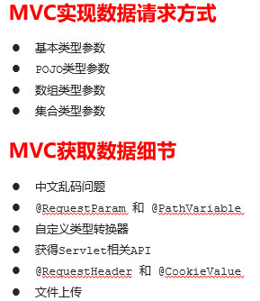

[TOC]

## SpringIOC

[SpringIOC](../spring-ioc/README.md)

## spring注解

[spring annotation](../spring-annotation/README.md)

## spring切面编程

[spring aop](../spring-aop/README.md)

## spring jdbctemplate

[spring jdbctemplate](../spring-jdbctemplate/README.md)

## SpringMVC web环境集成

[SpringMVC web环境集成](../springmvc-quickstart/README.md)

# SpringMVC的请求和响应

## SpringMVC的数据响应

### 01-SpringMVC的数据响应-数据响应方式(理解)

1)	页面跳转

直接返回字符串

通过ModelAndView对象返回

2） 回写数据 

直接返回字符串

返回对象或集合    

### 02-SpringMVC的数据响应-页面跳转-返回字符串形式（应用）


```xml
<?xml version="1.0" encoding="UTF-8"?>
<beans xmlns="http://www.springframework.org/schema/beans"
       xmlns:xsi="http://www.w3.org/2001/XMLSchema-instance"
       xmlns:context="http://www.springframework.org/schema/context" xmlns:mvc="http://www.alibaba.com/schema/stat"
       xsi:schemaLocation="http://www.springframework.org/schema/beans http://www.springframework.org/schema/beans/spring-beans.xsd
                        http://www.springframework.org/schema/context http://www.springframework.org/schema/context/spring-context.xsd http://www.alibaba.com/schema/stat http://www.alibaba.com/schema/stat.xsd">

    <!--Controller的组件扫描-->
    <context:component-scan base-package="tk.deriwotua">
        <context:include-filter type="annotation" expression="org.springframework.stereotype.Controller"/>
    </context:component-scan>

    <!--配置内部资源视图解析器-->
    <bean id="viewResolver" class="org.springframework.web.servlet.view.InternalResourceViewResolver">
        <!--  /jsp/success.jsp  -->
        <property name="prefix" value="/jsp/"></property>
        <property name="suffix" value=".jsp"></property>
    </bean>

</beans>
```

```java
@Controller
@RequestMapping("/user")
public class UserController {

    // 请求地址  http://localhost:8080/user/quick
    @RequestMapping(value="/quick",method = RequestMethod.GET,params = {"username"})
    public String save(){
        System.out.println("Controller save running....");
        //return "forward:/success.jsp";
        // 有了转发前缀后就可以省略转发前缀
        return "success.jsp";
        // 同过 prefix/suffix 可以设置返回视图的路径
        // prefix 在spring-mvc.xml 配置为`<property name="prefix" value="/jsp/"></property>`时
        // 等同于 这里 return "/jsp/success.jsp";
        // suffix 在spring-mvc.xml 配置为`<property name="suffix" value=".jsp"></property>` 时
        // 最终这里返回简写 return "success"; 解析时会自动补全
    }
}
```

### 03-SpringMVC的数据响应-页面跳转-返回ModelAndView形式1(应用)

在Controller中方法返回ModelAndView对象，并且设置视图名称

```java
@RequestMapping(value="/quick2")
public ModelAndView save2(){
    /*
        Model:模型 作用封装数据
        View：视图 作用展示数据
     */
    ModelAndView modelAndView = new ModelAndView();
    //设置模型数据
    modelAndView.addObject("username","deriwotua");
    //设置视图名称
    modelAndView.setViewName("success");

    return modelAndView;
}
```

### 04-SpringMVC的数据响应-页面跳转-返回ModelAndView形式2(应用)

在Controller中方法形参上直接声明ModelAndView，无需在方法中自己创建，在方法中直接使用该对象设置视图，同样可以跳转页面

```java
 @RequestMapping(value="/quick3")
public ModelAndView save3(ModelAndView modelAndView){
    modelAndView.addObject("username","deriwotua");
    modelAndView.setViewName("success");
    return modelAndView;
}
@RequestMapping(value="/quick4")
public String save4(Model model){
    model.addAttribute("username","xxx");
    return "success";
}
```

### 05-SpringMVC的数据响应-页面跳转-返回ModelAndView3(应用)

在Controller方法的形参上可以直接使用原生的HttpServletRequest对象，只需声明即可

```java
@RequestMapping(value="/quick5")
public String save5(HttpServletRequest request){
    request.setAttribute("username","酷丁鱼");
    return "success";
}
```

### 06-SpringMVC的数据响应-回写数据-直接回写字符串(应用)

通过SpringMVC框架注入的response对象，使用`response.getWriter().print("hello world")` 回写数据，此时不需要视图跳转，业务方法返回值为void

将需要回写的字符串直接返回，但此时需要通过`@ResponseBody`注解告知SpringMVC框架，方法返回的字符串不是跳转是直接在http响应体中返回

```java
@RequestMapping(value="/quick7")
@ResponseBody  //告知SpringMVC框架 不进行视图跳转 直接进行数据响应
public String save7() throws IOException {
    return "hello deriwotua";
}

@RequestMapping(value="/quick6")
public void save6(HttpServletResponse response) throws IOException {
    response.getWriter().print("hello deriwotua");
}
```

### 07-SpringMVC的数据响应-回写数据-直接回写json格式字符串(应用)

```java
@RequestMapping(value="/quick8")
@ResponseBody
public String save8() throws IOException {
    return "{\"username\":\"zhangsan\",\"age\":18}";
}
```

手动拼接json格式字符串的方式很麻烦，开发中往往要将复杂的java对象转换成json格式的字符串，我们可以使用web阶段学习过的json转换工具jackson进行转换,通过jackson转换json格式字符串，回写字符串

```java
@RequestMapping(value="/quick9")
@ResponseBody
public String save9() throws IOException {
    User user = new User();
    user.setUsername("lisi");
    user.setAge(30);
    //使用json的转换工具将对象转换成json格式字符串在返回
    ObjectMapper objectMapper = new ObjectMapper();
    String json = objectMapper.writeValueAsString(user);

    return json;
}
```

### 08-SpringMVC的数据响应-回写数据-返回对象或集合(应用)

通过SpringMVC帮助我们对对象或集合进行json字符串的转换并回写，为处理器适配器配置消息转换参数，指定使用jackson进行对象或集合的自动转换需要在spring-mvc.xml中进行如下配置：

```xml
<?xml version="1.0" encoding="UTF-8"?>
<beans xmlns="http://www.springframework.org/schema/beans"
       xmlns:xsi="http://www.w3.org/2001/XMLSchema-instance"
       xmlns:mvc="http://www.springframework.org/schema/mvc"
       xmlns:context="http://www.springframework.org/schema/context"
       xsi:schemaLocation="
                        http://www.springframework.org/schema/beans http://www.springframework.org/schema/beans/spring-beans.xsd
                        http://www.springframework.org/schema/mvc http://www.springframework.org/schema/mvc/spring-mvc.xsd
                        http://www.springframework.org/schema/context http://www.springframework.org/schema/context/spring-context.xsd">

    <!--Controller的组件扫描-->
    <context:component-scan base-package="tk.deriwotua">
        <context:include-filter type="annotation" expression="org.springframework.stereotype.Controller"/>
    </context:component-scan>

    <!--配置内部资源视图解析器-->
    <bean id="viewResolver" class="org.springframework.web.servlet.view.InternalResourceViewResolver">
        <!--  /jsp/success.jsp  -->
        <property name="prefix" value="/jsp/"></property>
        <property name="suffix" value=".jsp"></property>
    </bean>
    <!--配置处理器映射器-->
    <bean class="org.springframework.web.servlet.mvc.method.annotation.RequestMappingHandlerAdapter">
        <property name="messageConverters">
            <list>
                <bean class="org.springframework.http.converter.json.MappingJackson2HttpMessageConverter"/>
            </list>
        </property>
    </bean>
</beans>
```

```java
@RequestMapping(value="/quick10")
@ResponseBody
//期望SpringMVC自动将User转换成json格式的字符串
public User save10() throws IOException {
    User user = new User();
    user.setUsername("lisi2");
    user.setAge(32);
    return user;
}
```

### 09-SpringMVC的数据响应-回写数据-返回对象或集合2(应用)

在方法上添加`@ResponseBody`就可以返回json格式的字符串，但是这样配置比较麻烦，配置的代码比较多，因此，可以使用mvc的注解驱动代替上述配置

```xml
<mvc:annotation-driven/>
```

在 SpringMVC 的各个组件中，`处理器映射器`、`处理器适配器`、`视图解析器`称为 SpringMVC 的三大组件。
使用`<mvc:annotation-driven />`自动加载 `org.springframework.web.servlet.mvc.method.annotation.RequestMappingHandlerMapping`（处理映射器）和`org.springframework.web.servlet.mvc.method.annotation.RequestMappingHandlerAdapter`（处理适配器），可用在`Spring-xml.xml`配置文件中使用`<mvc:annotation-driven />`替代`注解处理器`和`处理适配器`的配置。
同时使用`<mvc:annotation-driven />`默认底层就会集成jackson进行对象或集合的json格式字符串的转换

使用`<mvc:annotation-driven />`精简`spring-mvc.xml`配置
```xml
<?xml version="1.0" encoding="UTF-8"?>
<beans xmlns="http://www.springframework.org/schema/beans"
       xmlns:xsi="http://www.w3.org/2001/XMLSchema-instance"
       xmlns:mvc="http://www.springframework.org/schema/mvc"
       xmlns:context="http://www.springframework.org/schema/context"
       xsi:schemaLocation="
                        http://www.springframework.org/schema/beans http://www.springframework.org/schema/beans/spring-beans.xsd
                        http://www.springframework.org/schema/mvc http://www.springframework.org/schema/mvc/spring-mvc.xsd
                        http://www.springframework.org/schema/context http://www.springframework.org/schema/context/spring-context.xsd">

    <!--Controller的组件扫描-->
    <context:component-scan base-package="tk.deriwotua">
        <context:include-filter type="annotation" expression="org.springframework.stereotype.Controller"/>
    </context:component-scan>

    <!--配置内部资源视图解析器-->
    <bean id="viewResolver" class="org.springframework.web.servlet.view.InternalResourceViewResolver">
        <!--  /jsp/success.jsp  -->
        <property name="prefix" value="/jsp/"></property>
        <property name="suffix" value=".jsp"></property>
    </bean>

    <!--配置处理器映射器-->
    <!--<bean class="org.springframework.web.servlet.mvc.method.annotation.RequestMappingHandlerAdapter">
        <property name="messageConverters">
            <list>
                <bean class="org.springframework.http.converter.json.MappingJackson2HttpMessageConverter"/>
            </list>
        </property>
    </bean>-->

    <!--mvc的注解驱动 就可以不用配置上面处理器映射器-->
    <!--会自动加载org.springframework.web.servlet.mvc.method.annotation.RequestMappingHandlerMapping处理映射器和org
.springframework.web.servlet.mvc.method.annotation.RequestMappingHandlerAdapter处理适配器,同时使用`<mvc:annotation-driven />`默认底层就会集成jackson进行对象或集合的json格式字符串的转换-->
    <mvc:annotation-driven />
</beans>
```

### 10-SpringMVC的数据响应-知识要点小结(理解，记忆)

页面跳转
- 直接返回字符串
- 通过ModelAndView对象返回

回写数据 
- 直接返回字符串
- `HttpServletResponse` 对象直接写回数据，`HttpServletRequest`对象带回数据，`Model`对象带回数据或者`@ResponseBody
`将字符串数据写回返回对象或集合 `@ResponseBody + <mvc:annotation-driven/>`

## SpringMVC的请求

### 11-SpringMVC的请求-获得请求参数-请求参数类型(理解)

客户端请求参数的格式是：name=value&name=value……
服务器端要获得请求的参数，有时还需要进行数据的封装，SpringMVC可以接收如下类型的参数
- 基本类型参数
- POJO类型参数
- 数组类型参数
- 集合类型参数

### 12-SpringMVC的请求-获得请求参数-获得基本类型参数(应用)

Controller中的业务方法的参数名称要与请求参数的name一致，参数值会自动映射匹配。并且能自动做类型转换；自动的类型转换是指从String向其他类型的转换

``

```java
//http://localhost:8080/springmvc-request-response/quick11?username=zhangsan&age=12

@RequestMapping(value="/quick11")
@ResponseBody
public void save11(String username,int age) throws IOException {
    System.out.println(username); // zhangsan
    System.out.println(age); // 12
}
```

### 13-SpringMVC的请求-获得请求参数-获得POJO类型参数(应用)

Controller中的业务方法的POJO对象的属性名与请求参数的名称一致时，springmvc会自动通过反射实例化该对象且参数值会自动映射匹配。
```java
package tk.deriwotua.domain;

public class User {

    private String username;
    private int age;

    public String getUsername() {
        return username;
    }

    public void setUsername(String username) {
        this.username = username;
    }

    public int getAge() {
        return age;
    }

    public void setAge(int age) {
        this.age = age;
    }

    @Override
    public String toString() {
        return "User{" +
                "username='" + username + '\'' +
                ", age=" + age +
                '}';
    }
}
```

```java
// //http://localhost:8080/springmvc-request-response/quick12?username=zhangsan&age=12
@RequestMapping(value="/quick12")
@ResponseBody
public void save12(User user) throws IOException {
    System.out.println(user);
}
```

### 14-SpringMVC的请求-获得请求参数-获得数组类型参数(应用)

Controller中的业务方法数组名称与请求参数的name一致，参数值会自动映射匹配。

```java
// http://localhost:8080/springmvc-request-response/quick13?strs=111&strs=222&strs=333
@RequestMapping(value="/quick13")
@ResponseBody
public void save13(String[] strs) throws IOException {
    System.out.println(Arrays.asList(strs));
}
```

### 15-SpringMVC的请求-获得请求参数-获得集合类型参数1(应用)

获得集合参数时，要将集合参数包装到一个POJO中才可以。

```jsp
<form action="${pageContext.request.contextPath}/user/quick14" method="post">
    <%--表明是第一个User对象的username age--%>
    <input type="text" name="userList[0].username"><br/>
    <input type="text" name="userList[0].age"><br/>
    <input type="text" name="userList[1].username"><br/>
    <input type="text" name="userList[1].age"><br/>
    <input type="submit" value="提交">
</form>
```

```java
package com.itheima.domain;

import tk.deriwotua.domain.User;

import java.util.List;

public class VO {

    private List<User> userList;

    public List<User> getUserList() {
        return userList;
    }

    public void setUserList(List<User> userList) {
        this.userList = userList;
    }

    @Override
    public String toString() {
        return "VO{" +
                "userList=" + userList +
                '}';
    }
}
```

```java
@RequestMapping(value="/quick14")
@ResponseBody
public void save14(VO vo) throws IOException {
    System.out.println(vo);
}
```

### 16-SpringMVC的请求-获得请求参数-获得集合类型参数2(应用)

当使用ajax提交时，可以指定contentType为json形式，那么在方法参数位置使用`@RequestBody`可以直接接收集合数据而无需使用POJO进行包装

```jsp
<script src="${pageContext.request.contextPath}/js/jquery-3.3.1.js"></script>
<script>
    var userList = new Array();
    userList.push({username:"zhangsan",age:18});
    userList.push({username:"lisi",age:28});

    $.ajax({
        type:"POST",
        url:"${pageContext.request.contextPath}/user/quick15",
        data:JSON.stringify(userList),
        contentType:"application/json;charset=utf-8"
    });

</script>
```

```java
@RequestMapping(value="/quick15")
@ResponseBody
public void save15(@RequestBody List<User> userList) throws IOException {
    System.out.println(userList);
}
```

### 17-SpringMVC的请求-获得请求参数-静态资源访问的开启(应用)

当有静态资源需要加载时，比如jquery文件，通过谷歌开发者工具抓包发现，没有加载到jquery文件，原因是SpringMVC的前端控制器DispatcherServlet的url-pattern配置的是/,代表对所有的资源都进行过滤操作即会与`@RequestMapping`映射匹配当找不到jquery文件相关映射就表现无法加载，可以通过以下两种方式指定放行静态资源：
- 在spring-mvc.xml配置文件中指定mvc放行的资源`<mvc:resources mapping="/js/**"location="/js/"/> `
  - mapping与访问路径映射 
  - location路径映射的文件目录
- 使用`<mvc:default-servlet-handler/>`标签设置针对访问的路径mvc没有配置`@RequestMapping`无法映射的路径最终由此配置的默认handler处理即这里使用的tomcat web容器就是最终这些访问无法映射到的请求由tomcat内部机制来处理

```xml
<?xml version="1.0" encoding="UTF-8"?>
<beans xmlns="http://www.springframework.org/schema/beans"
       xmlns:xsi="http://www.w3.org/2001/XMLSchema-instance"
       xmlns:mvc="http://www.springframework.org/schema/mvc"
       xmlns:context="http://www.springframework.org/schema/context"
       xsi:schemaLocation="
                        http://www.springframework.org/schema/beans http://www.springframework.org/schema/beans/spring-beans.xsd
                        http://www.springframework.org/schema/mvc http://www.springframework.org/schema/mvc/spring-mvc.xsd
                        http://www.springframework.org/schema/context http://www.springframework.org/schema/context/spring-context.xsd">

    <!--Controller的组件扫描-->
    <context:component-scan base-package="tk.deriwotua">
        <context:include-filter type="annotation" expression="org.springframework.stereotype.Controller"/>
    </context:component-scan>

    <!--配置内部资源视图解析器-->
    <bean id="viewResolver" class="org.springframework.web.servlet.view.InternalResourceViewResolver">
        <!--  /jsp/success.jsp  -->
        <property name="prefix" value="/jsp/"></property>
        <property name="suffix" value=".jsp"></property>
    </bean>

    <!--mvc的注解驱动-->
    <mvc:annotation-driven />

    <!--开放资源的访问-->
    <!--<mvc:resources mapping="/js/**" location="/js/"/>
    <mvc:resources mapping="/img/**" location="/img/"/>-->

    <!--配置默认的资源处理器处理mvc无法映射到的请求比如这里的静态资源-->
    <mvc:default-servlet-handler/>

</beans>
```

### 18-SpringMVC的请求-获得请求参数-配置全局乱码过滤器(应用)

当post请求时，数据会出现乱码，可以在`web.xml`中设置一个过滤器来进行编码的过滤。

```xml
<?xml version="1.0" encoding="UTF-8"?>
<web-app version="3.0" xmlns="http://java.sun.com/xml/ns/javaee"
         xmlns:xsi="http://www.w3.org/2001/XMLSchema-instance"
         xsi:schemaLocation="http://java.sun.com/xml/ns/javaee http://java.sun.com/xml/ns/javaee/web-app_3_0.xsd">

  <!--配置全局过滤的filter-->
  <filter>
    <filter-name>CharacterEncodingFilter</filter-name>
    <filter-class>org.springframework.web.filter.CharacterEncodingFilter</filter-class>
    <init-param>
      <param-name>encoding</param-name>
      <param-value>UTF-8</param-value>
    </init-param>
  </filter>
  <filter-mapping>
    <filter-name>CharacterEncodingFilter</filter-name>
    <url-pattern>/*</url-pattern>
  </filter-mapping>

  <!--配置SpringMVC的前端控制器-->
  <servlet>
    <servlet-name>DispatcherServlet</servlet-name>
    <servlet-class>org.springframework.web.servlet.DispatcherServlet</servlet-class>
    <init-param>
      <param-name>contextConfigLocation</param-name>
      <param-value>classpath:spring-mvc.xml</param-value>
    </init-param>
    <load-on-startup>1</load-on-startup>
  </servlet>
  <servlet-mapping>
    <servlet-name>DispatcherServlet</servlet-name>
    <url-pattern>/</url-pattern>
  </servlet-mapping>

  <!--全局初始化参数-->
  <context-param>
    <param-name>contextConfigLocation</param-name>
    <param-value>classpath:applicationContext.xml</param-value>
  </context-param>

  <!--配置监听器-->
  <listener>
    <listener-class>org.springframework.web.context.ContextLoaderListener</listener-class>
  </listener>
</web-app>
```

### 19-SpringMVC的请求-获得请求参数-参数绑定注解`@RequestParam`(应用)

当请求的参数名称与Controller的业务方法参数名称不一致时，就需要通过@RequestParam注解显示的绑定

```html
<form action="${pageContext.request.contextPath}/quick16" method="post">
    <input type="text" name="name"><br>
    <input type="submit" value="提交"><br>
</form>
```

```java
@RequestMapping(value="/quick16")
@ResponseBody
public void save16(@RequestParam(value="name",required = false,defaultValue = "der") String username) throws
 IOException {
    System.out.println(username);
}
```

### 20-SpringMVC的请求-获得请求参数-Restful风格的参数的获取(应用)

Restful是一种软件架构风格、设计风格，而不是标准，只是提供了一组设计原则和约束条件。主要用于客户端和服务器交互类的软件，基于这个风格设计的软件可以更简洁，更有层次，更易于实现缓存机制等。

Restful风格的请求是使用“url+请求方式”表示一次请求目的的，HTTP 协议里面四个表示操作方式的动词如下：
- GET：用于获取资源
- POST：用于新建资源
- PUT：用于更新资源
- DELETE：用于删除资源  

```text
/user/1    GET ：       得到 id = 1 的 user

/user/1   DELETE：  删除 id = 1 的 user

/user/1    PUT：       更新 id = 1 的 user

/user       POST：      新增 user
```

上述url地址/user/1中的1就是要获得的请求参数，在SpringMVC中可以使用`占位符`进行参数绑定。地址/user/1可以写成`/user/{id}`，占位符{id}对应的就是1的值。在业务方法中我们可以使用`@PathVariable`注解进行占位符的匹配获取工作。

```java
// http://localhost:8080/springmvc-request-response/quick17/zhangsan
@RequestMapping(value="/quick17/{name}")
@ResponseBody
public void save17(@PathVariable(value="name") String username) throws IOException {
    System.out.println(username);
}
```

### 21-SpringMVC的请求-获得请求参数-自定义类型转换器(应用)

SpringMVC 默认已经提供了一些常用的类型转换器，例如客户端提交的字符串转换成int型进行参数设置。
但是不是所有的数据类型都提供了转换器，没有提供的就需要自定义转换器，例如：日期类型的数据就需要自定义转换器。
- 第一步定义转换器类实现Converter接口
  ```java
  package tk.deriwotua.converter;
  
  import org.springframework.core.convert.converter.Converter;
  
  import java.text.ParseException;
  import java.text.SimpleDateFormat;
  import java.util.Date;
  
  public class DateConverter implements Converter<String, Date> {
      public Date convert(String dateStr) {
          //将日期字符串转换成日期对象 返回
          SimpleDateFormat format = new SimpleDateFormat("yyyy-MM-dd");
          Date date = null;
          try {
              date = format.parse(dateStr);
          } catch (ParseException e) {
              e.printStackTrace();
          }
          return date;
      }
  }
  ```

- 第二步在配置文件中声明转换器
  ```xml
  <!--声明转换器-->
  <bean id="conversionService" class="org.springframework.context.support.ConversionServiceFactoryBean">
      <property name="converters">
          <list>
              <bean class="tk.deriwotua.converter.DateConverter"></bean>
          </list>
      </property>
  </bean>
  ```

- 第三步在<annotation-driven>中引用转换器
  ```xml
  <?xml version="1.0" encoding="UTF-8"?>
  <beans xmlns="http://www.springframework.org/schema/beans"
         xmlns:xsi="http://www.w3.org/2001/XMLSchema-instance"
         xmlns:mvc="http://www.springframework.org/schema/mvc"
         xmlns:context="http://www.springframework.org/schema/context"
         xsi:schemaLocation="
                          http://www.springframework.org/schema/beans http://www.springframework.org/schema/beans/spring-beans.xsd
                          http://www.springframework.org/schema/mvc http://www.springframework.org/schema/mvc/spring-mvc.xsd
                          http://www.springframework.org/schema/context http://www.springframework.org/schema/context/spring-context.xsd">
  
      <!--Controller的组件扫描-->
      <context:component-scan base-package="tk.deriwotua">
          <context:include-filter type="annotation" expression="org.springframework.stereotype.Controller"/>
      </context:component-scan>
  
      <!--配置内部资源视图解析器-->
      <bean id="viewResolver" class="org.springframework.web.servlet.view.InternalResourceViewResolver">
          <!--  /jsp/success.jsp  -->
          <property name="prefix" value="/jsp/"></property>
          <property name="suffix" value=".jsp"></property>
      </bean>
  
      <!--开发资源的访问-->
      <!--<mvc:resources mapping="/js/**" location="/js/"/>
      <mvc:resources mapping="/img/**" location="/img/"/>-->
  
      <mvc:default-servlet-handler/>
  
      <!--声明转换器-->
      <bean id="conversionService" class="org.springframework.context.support.ConversionServiceFactoryBean">
          <property name="converters">
              <list>
                  <bean class="tk.deriwotua.converter.DateConverter"></bean>
              </list>
          </property>
      </bean>
  
      <!--mvc的注解驱动-->
      <mvc:annotation-driven conversion-service="conversionService"/>  
  
  </beans>
  ```
- 最后应用
  ```java
  // http://localhost:8080/springmvc-request-response/quick18?date=2020-02-03
  @RequestMapping(value="/quick18")
  @ResponseBody
  public void save18(Date date) throws IOException {
      System.out.println(date);
  }
  ```

### 22-SpringMVC的请求-获得请求参数-获得Servlet相关API(应用)

SpringMVC支持使用原始ServletAPI对象作为控制器方法的参数进行注入，常用的对象 `HttpServletRequest` `HttpServletResponse` `HttpSession`

```java
@RequestMapping(value="/quick19")
@ResponseBody
public void save19(HttpServletRequest request, HttpServletResponse response, HttpSession session) throws IOException {
    System.out.println(request);
    System.out.println(response);
    System.out.println(session);
}
```

### 23-SpringMVC的请求-获得请求参数-获得请求头信息(应用)

使用`@RequestHeader`可以获得请求头信息，相当于javaweb的`request.getHeader(name)`
`@RequestHeader`注解的属性
- `value`请求头的名称
- `required`是否必须携带此请求头

```java
@RequestMapping(value="/quick20")
@ResponseBody
public void save20(@RequestHeader(value = "User-Agent",required = false) String user_agent) throws IOException {
    System.out.println(user_agent);
}
```

使用`@CookieValue`可以获得指定Cookie的值
`@CookieValue`注解的属性
- `value`指定cookie的名称
- `required`是否必须携带此cookie

```java
@RequestMapping(value="/quick21")
@ResponseBody
public void save21(@CookieValue(value = "JSESSIONID") String jsessionId) throws IOException {
    System.out.println(jsessionId);
}
```


## SpringMVC的文件上传

### 1-SpringMVC的请求-文件上传-客户端表单实现(应用)

文件上传客户端表单需要满足：
- 表单项`type="file"`
- 表单的提交方式是post  
- 表单的enctype属性是多部分表单形式，及`enctype="multipart/form-data"`
  ```jsp
  <form action="${pageContext.request.contextPath}/user/quick22" method="post" enctype="multipart/form-data">
      名称<input type="text" name="username"><br/>
      文件1<input type="file" name="uploadFile"><br/>
      <input type="submit" value="提交">
  </form>
  ```

### 2-SpringMVC的请求-文件上传-文件上传的原理(理解)


### 3-SpringMVC的请求-文件上传-单文件上传的代码实现1(应用)

添加依赖

```xml
<dependency>
  <groupId>commons-fileupload</groupId>
  <artifactId>commons-fileupload</artifactId>
  <version>1.3.1</version>
</dependency>
<dependency>
  <groupId>commons-io</groupId>
  <artifactId>commons-io</artifactId>
  <version>2.3</version>
</dependency>
```

配置多媒体解析器

```xml
<?xml version="1.0" encoding="UTF-8"?>
<beans xmlns="http://www.springframework.org/schema/beans"
       xmlns:xsi="http://www.w3.org/2001/XMLSchema-instance"
       xmlns:mvc="http://www.springframework.org/schema/mvc"
       xmlns:context="http://www.springframework.org/schema/context"
       xsi:schemaLocation="
                        http://www.springframework.org/schema/beans http://www.springframework.org/schema/beans/spring-beans.xsd
                        http://www.springframework.org/schema/mvc http://www.springframework.org/schema/mvc/spring-mvc.xsd
                        http://www.springframework.org/schema/context http://www.springframework.org/schema/context/spring-context.xsd">

    <!--Controller的组件扫描-->
    <context:component-scan base-package="tk.deriwotua">
        <context:include-filter type="annotation" expression="org.springframework.stereotype.Controller"/>
    </context:component-scan>

    <!--配置内部资源视图解析器-->
    <bean id="viewResolver" class="org.springframework.web.servlet.view.InternalResourceViewResolver">
        <!--  /jsp/success.jsp  -->
        <property name="prefix" value="/jsp/"></property>
        <property name="suffix" value=".jsp"></property>
    </bean>

    <!--配置处理器映射器-->
    <!--<bean class="org.springframework.web.servlet.mvc.method.annotation.RequestMappingHandlerAdapter">
        <property name="messageConverters">
            <list>
                <bean class="org.springframework.http.converter.json.MappingJackson2HttpMessageConverter"/>
            </list>
        </property>
    </bean>-->

    <!--mvc的注解驱动-->
    <mvc:annotation-driven conversion-service="conversionService"/>

    <!--开发资源的访问-->
    <!--<mvc:resources mapping="/js/**" location="/js/"/>
    <mvc:resources mapping="/img/**" location="/img/"/>-->

    <mvc:default-servlet-handler/>

    <!--声明转换器-->
    <bean id="conversionService" class="org.springframework.context.support.ConversionServiceFactoryBean">
        <property name="converters">
            <list>
                <bean class="tk.deriwotua.converter.DateConverter"></bean>
            </list>
        </property>
    </bean>

    <!--配置文件上传解析器-->
    <bean id="multipartResolver" class="org.springframework.web.multipart.commons.CommonsMultipartResolver">
        <!--上传文件总大小-->
        <property name="maxUploadSize" value="5242800"/>
        <!--上传单个文件的大小-->
        <property name="maxUploadSizePerFile" value="5242800"/>
        <!--上传文件的编码类型-->
        <property name="defaultEncoding" value="UTF-8"/>
    </bean>

</beans>
```

后台程序

```java
@RequestMapping(value="/quick22")
@ResponseBody
public void save22(String username, MultipartFile uploadFile) throws IOException {
    System.out.println(username);
    System.out.println(uploadFile);
}
```

### 4-SpringMVC的请求-文件上传-单文件上传的代码实现2(应用)

完成文件上传

```java
@RequestMapping(value="/quick22")
@ResponseBody
public void save22(String username, MultipartFile uploadFile) throws IOException {
    System.out.println(username);
    //获得上传文件的名称
    String originalFilename = uploadFile.getOriginalFilename();
    uploadFile.transferTo(new File("C:\\upload\\"+originalFilename));
}
```

### 5-SpringMVC的请求-文件上传-多文件上传的代码实现(应用)

多文件上传，只需要将页面修改为多个文件上传项，将方法参数`MultipartFile`类型修改为`MultipartFile[]`即可

```jsp
<form action="${pageContext.request.contextPath}/user/quick23" method="post" enctype="multipart/form-data">
    名称<input type="text" name="username"><br/>
    文件1<input type="file" name="uploadFile"><br/>
    文件2<input type="file" name="uploadFile"><br/>
    <input type="submit" value="提交">
</form>
```

```java
@RequestMapping(value="/quick23")
@ResponseBody
public void save23(String username, MultipartFile[] uploadFile) throws IOException {
    System.out.println(username);
    for (MultipartFile multipartFile : uploadFile) {
        String originalFilename = multipartFile.getOriginalFilename();
        multipartFile.transferTo(new File("C:\\upload\\"+originalFilename));
    }
}
```

### 6-SpringMVC的请求-知识要点(理解，记忆)



## SpringMVC拦截器

[SpringMVC拦截器](../springmvc-interceptor/README.md)

## Spring与SpringMVC整合

[Spring与SpringMVC整合](../spring-springmvc/README.md)