## 0. 学习目标 ##
> 说出Spring Boot的作用
>
> 应用Spring Boot Yaml配置文件
>
> 了解Spring Boot自动配置原理
>
> 使用Spring Boot整合SpringMVC
>
> 使用Spring Boot整合连接池
>
> 使用Spring Boot整合Mybatis
>
> 使用Spring Boot整合Redis
>
> 部署Spring Boot项目

## 1. Spring Boot概述 ##
在这一部分，主要了解以下3个问题
- 什么是Spring Boot
- 为什么要学习Spring Boot
- Spring Boot的特点
### 1.1. 什么是Spring Boot ###
`Spring Boot`是Spring项目中的一个子工程，与所熟知的`Spring-framework`同属于spring的产品:

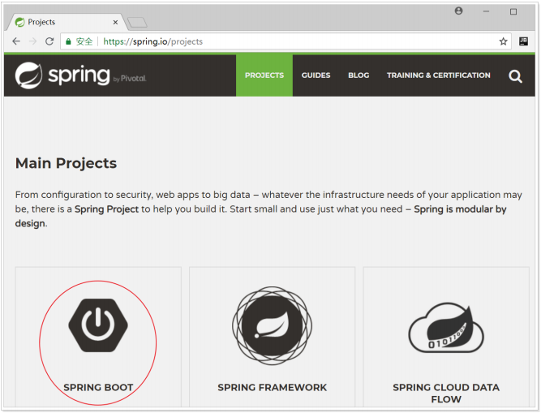

首页Spring Boot简介可以看到下面的一段介绍
> Spring Boot is designed to get you up and running as quickly as possible, with minimal upfront configuration of Spring. Spring Boot takes an opinionated view of building production-ready applications.

翻译一下
> Spring Boot的设计目的是让您尽可能快地启动和运行，而无需预先配置Spring。Spring Boot以一种固定的方式来构建可用于生产级别的应用程序。

一般把`Spring Boot`称为搭建程序的 脚手架 或者说是**便捷搭建 基于Spring的工程 脚手架**。其最主要作用就是帮助开发人员快速的构建庞大的spring项目，并且尽可能的减少一切xml配置，做到开箱即用，迅速上手，让开发人员关注业务而非配置。

### 1.2. 为什么要学习Spring Boot ###
java一直被人诟病的一点就是臃肿、麻烦。当我们还在辛苦的搭建项目时，可能Python程序员已经把功能写好了，究其原因注意是两点
- 复杂的配置。项目各种配置其实是开发时的损耗， 因为在思考 Spring 特性配置和解决业务问题之间需要进行思维切换，所以写配置挤占了写应用程序逻辑的时间。
- 一个是混乱的依赖管理。项目的依赖管理也是件吃力不讨好的事情。决定项目里要用哪些库就已经够让人头痛的了，你还要知道这些库的哪个版本和其他库不会有冲突，这难题实在太棘手。并且，依赖管理也是一种损耗，添加依赖不是写应用程
序代码。一旦选错了依赖的版本，随之而来的不兼容问题毫无疑问会是生产力杀手。

而Spring Boot让这一切成为过去！
> Spring Boot 简化了基于Spring的应用开发，只需要“run”就能创建一个独立的、生产级别的Spring应用。Spring Boot为Spring平台及第三方库提供开箱即用的设置（提供默认设置，存放默认配置的包就是启动器starter），这样我们就可以简单的开始。多数Spring Boot应用只需要很少的Spring配置。

我们可以使用Spring Boot创建java应用，并使用`java –jar` 启动它，就能得到一个生产级别的web工程。

### 1.3. Spring Boot的特点 ###
`Spring Boot` 主要特点是
- 创建独立的Spring应用，为所有 Spring 的开发者提供一个非常快速的、广泛接受的入门体验
- 直接嵌入应用服务器，如 `tomcat`、`jetty`、`undertow`等；不需要去部署war包
- 提供固定的启动器依赖去简化组件配置；实现开箱即用（启动器starter-其实就是Spring Boot提供的一个jar包），通过自己设置参数（`.properties`或`.yml`的配置文件），即可快速使用。
- 自动地配置Spring和其它有需要的第三方依赖
- 提供了一些大型项目中常见的非功能性特性，如内嵌服务器、安全、指标，健康检测、外部化配置等
- 绝对没有代码生成，也无需 XML 配置。

## 2. 快速入门 ##
接下来，就来利用Spring Boot搭建一个web工程，体会一下Spring Boot的魅力所在！
### 2.1. 创建工程 ###

新建一个`maven jar`工程

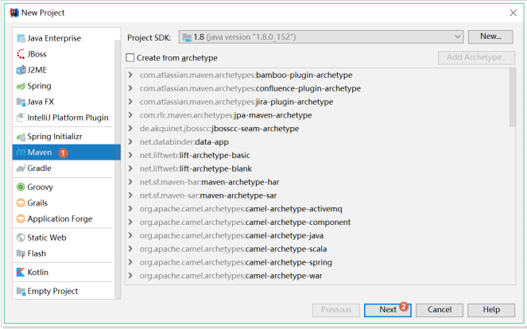

项目信息

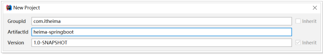

项目路径

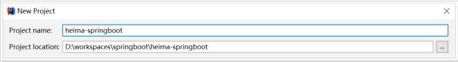

### 2.2.添加依赖 ###
看到这里很多同学会有疑惑，前面说传统开发的问题之一就是依赖管理混乱，怎么这里我们还需要管理依赖呢？难道Spring Boot不帮我们管理吗？
别着急，现在我们的项目与Spring Boot还没有什么关联。Spring Boot提供了一个名为`spring-boot-starter-parent`的工程，里面已经对各种常用依赖（并非全部）的版本进行了管理，我们的项目需要以这个项目为父工程，这样就不用操心依赖的版本问题了，需要什么依赖，直接引入坐标即可！

#### 2.2.1. 添加父工程坐标 ####

```xml
<parent>
    <groupId>org.springframework.boot</groupId>
    <artifactId>spring-boot-starter-parent</artifactId>
    <version>2.1.5.RELEASE</version>
</parent>
```

#### 2.2.2. 添加web启动器 ####
为了让Spring Boot帮我们完成各种自动配置，我们必须引入Spring Boot提供的自动配置依赖，称为 启动器 。因为我们是web项目，这里我们引入web启动器，在 `pom.xml` 文件中加入如下依赖

```xml
<dependencies>
    <dependency>
        <groupId>org.springframework.boot</groupId>
        <artifactId>spring-boot-starter-web</artifactId>
    </dependency>
</dependencies>
```

需要注意的是，我们并没有在这里指定版本信息。因为Spring Boot的父工程已经对版本进行了管理了。
这个时候，我们会发现项目中多出了大量的依赖。
那些依赖都是Spring Boot根据 `spring-boot-starter-web` 这个依赖自动引入的，而且所有的版本都已经管理好，不会出现冲突。

#### 2.2.3. 管理jdk版本 ####
如果我们想要修改Spring Boot项目的jdk版本，只需要简单的添加以下属性即可，如果没有需求，则不添加。同样的在 `pom.xml` 文件中添加如下

```xml
<properties>
    <java.version>1.8</java.version>    
</properties>
```

#### 2.2.4. 完整pom文件 ####
pom.xml 文件内容如下
```xml
<?xml version="1.0" encoding="UTF-8"?>
<project xmlns="http://maven.apache.org/POM/4.0.0"
         xmlns:xsi="http://www.w3.org/2001/XMLSchema-instance"
         xsi:schemaLocation="http://maven.apache.org/POM/4.0.0 http://maven.apache.org/xsd/maven-4.0.0.xsd">

    <parent>
        <groupId>org.springframework.boot</groupId>
        <artifactId>spring-boot-starter-parent</artifactId>
        <version>2.1.5.RELEASE</version>
    </parent>
    <modelVersion>4.0.0</modelVersion>

    <groupId>tk.deriwotua</groupId>
    <artifactId>springboot-quickstart</artifactId>
    <version>1.0-SNAPSHOT</version>

    <properties>
        <java.version>1.8</java.version>
    </properties>

    <dependencies>
        <dependency>
            <groupId>org.springframework.boot</groupId>
            <artifactId>spring-boot-starter-web</artifactId>
        </dependency>
    </dependencies>
</project>
```

### 2.3. 启动类 ###
Spring Boot项目通过`main`函数即可启动，我们需要创建一个启动类

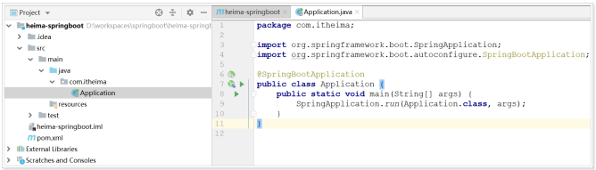

编写 `Application.java` 如下

```java
package tk.deriwotua;

import org.springframework.boot.SpringApplication;
import org.springframework.boot.autoconfigure.SpringBootApplication;

/**
 * @Author deriwotua
 * @Date 18:48 7/30/2020
 */
@SpringBootApplication
public class DeriwotuaApplication {
    public static void main(String[] args) {
        SpringApplication.run(DeriwotuaApplication.class, args);
    }
}
```

### 2.4. 编写controller ###
接下来，就可以像以前那样开发SpringMVC的项目了！
编写 `HelloController.java`

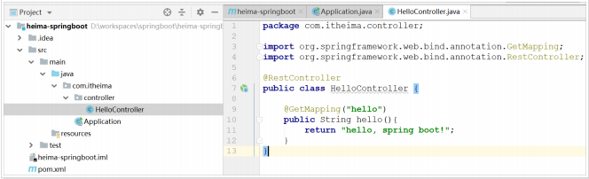

代码如下
```java
@RestController
public class HelloController {
    @GetMapping("hello")
    public String hello(){
        return "hello, spring boot!";
    }
}
```

### 2.5. 启动测试 ###
接下来，运行`main`函数，查看控制台，可以看到自动命令，可以看到监听的端口信息
```text
C:\ProgramDT\Java\openjdk-12.0.1\bin\java.exe -XX:TieredStopAtLevel=1 -noverify -Dspring.output.ansi.enabled=always -Dcom.sun.management.jmxremote -Dspring.jmx.enabled=true -Dspring.liveBeansView.mbeanDomain -Dspring.application.admin.enabled=true "-javaagent:C:\Program Files\JetBrains\IntelliJ IDEA_2020.1.1\lib\idea_rt.jar=49721:C:\Program Files\JetBrains\IntelliJ IDEA_2020.1.1\bin" -Dfile.encoding=UTF-8 -classpath C:\ProgramCode\Git\Review\javaee\springboot\springboot-quickstart\target\classes;C:\Users\superme\.m2\repository\org\springframework\boot\spring-boot-starter-web\2.1.5.RELEASE\spring-boot-starter-web-2.1.5.RELEASE.jar;C:\Users\superme\.m2\repository\org\springframework\boot\spring-boot-starter\2.1.5.RELEASE\spring-boot-starter-2.1.5.RELEASE.jar;C:\Users\superme\.m2\repository\org\springframework\boot\spring-boot\2.1.5.RELEASE\spring-boot-2.1.5.RELEASE.jar;C:\Users\superme\.m2\repository\org\springframework\boot\spring-boot-autoconfigure\2.1.5.RELEASE\spring-boot-autoconfigure-2.1.5.RELEASE.jar;C:\Users\superme\.m2\repository\org\springframework\boot\spring-boot-starter-logging\2.1.5.RELEASE\spring-boot-starter-logging-2.1.5.RELEASE.jar;C:\Users\superme\.m2\repository\ch\qos\logback\logback-classic\1.2.3\logback-classic-1.2.3.jar;C:\Users\superme\.m2\repository\ch\qos\logback\logback-core\1.2.3\logback-core-1.2.3.jar;C:\Users\superme\.m2\repository\org\slf4j\slf4j-api\1.7.26\slf4j-api-1.7.26.jar;C:\Users\superme\.m2\repository\org\apache\logging\log4j\log4j-to-slf4j\2.11.2\log4j-to-slf4j-2.11.2.jar;C:\Users\superme\.m2\repository\org\apache\logging\log4j\log4j-api\2.11.2\log4j-api-2.11.2.jar;C:\Users\superme\.m2\repository\org\slf4j\jul-to-slf4j\1.7.26\jul-to-slf4j-1.7.26.jar;C:\Users\superme\.m2\repository\javax\annotation\javax.annotation-api\1.3.2\javax.annotation-api-1.3.2.jar;C:\Users\superme\.m2\repository\org\springframework\spring-core\5.1.7.RELEASE\spring-core-5.1.7.RELEASE.jar;C:\Users\superme\.m2\repository\org\springframework\spring-jcl\5.1.7.RELEASE\spring-jcl-5.1.7.RELEASE.jar;C:\Users\superme\.m2\repository\org\yaml\snakeyaml\1.23\snakeyaml-1.23.jar;C:\Users\superme\.m2\repository\org\springframework\boot\spring-boot-starter-json\2.1.5.RELEASE\spring-boot-starter-json-2.1.5.RELEASE.jar;C:\Users\superme\.m2\repository\com\fasterxml\jackson\core\jackson-databind\2.9.8\jackson-databind-2.9.8.jar;C:\Users\superme\.m2\repository\com\fasterxml\jackson\core\jackson-annotations\2.9.0\jackson-annotations-2.9.0.jar;C:\Users\superme\.m2\repository\com\fasterxml\jackson\core\jackson-core\2.9.8\jackson-core-2.9.8.jar;C:\Users\superme\.m2\repository\com\fasterxml\jackson\datatype\jackson-datatype-jdk8\2.9.8\jackson-datatype-jdk8-2.9.8.jar;C:\Users\superme\.m2\repository\com\fasterxml\jackson\datatype\jackson-datatype-jsr310\2.9.8\jackson-datatype-jsr310-2.9.8.jar;C:\Users\superme\.m2\repository\com\fasterxml\jackson\module\jackson-module-parameter-names\2.9.8\jackson-module-parameter-names-2.9.8.jar;C:\Users\superme\.m2\repository\org\springframework\boot\spring-boot-starter-tomcat\2.1.5.RELEASE\spring-boot-starter-tomcat-2.1.5.RELEASE.jar;C:\Users\superme\.m2\repository\org\apache\tomcat\embed\tomcat-embed-core\9.0.19\tomcat-embed-core-9.0.19.jar;C:\Users\superme\.m2\repository\org\apache\tomcat\embed\tomcat-embed-el\9.0.19\tomcat-embed-el-9.0.19.jar;C:\Users\superme\.m2\repository\org\apache\tomcat\embed\tomcat-embed-websocket\9.0.19\tomcat-embed-websocket-9.0.19.jar;C:\Users\superme\.m2\repository\org\hibernate\validator\hibernate-validator\6.0.16.Final\hibernate-validator-6.0.16.Final.jar;C:\Users\superme\.m2\repository\javax\validation\validation-api\2.0.1.Final\validation-api-2.0.1.Final.jar;C:\Users\superme\.m2\repository\org\jboss\logging\jboss-logging\3.3.2.Final\jboss-logging-3.3.2.Final.jar;C:\Users\superme\.m2\repository\com\fasterxml\classmate\1.4.0\classmate-1.4.0.jar;C:\Users\superme\.m2\repository\org\springframework\spring-web\5.1.7.RELEASE\spring-web-5.1.7.RELEASE.jar;C:\Users\superme\.m2\repository\org\springframework\spring-beans\5.1.7.RELEASE\spring-beans-5.1.7.RELEASE.jar;C:\Users\superme\.m2\repository\org\springframework\spring-webmvc\5.1.7.RELEASE\spring-webmvc-5.1.7.RELEASE.jar;C:\Users\superme\.m2\repository\org\springframework\spring-aop\5.1.7.RELEASE\spring-aop-5.1.7.RELEASE.jar;C:\Users\superme\.m2\repository\org\springframework\spring-context\5.1.7.RELEASE\spring-context-5.1.7.RELEASE.jar;C:\Users\superme\.m2\repository\org\springframework\spring-expression\5.1.7.RELEASE\spring-expression-5.1.7.RELEASE.jar tk.deriwotua.DeriwotuaApplication

  .   ____          _            __ _ _
 /\\ / ___'_ __ _ _(_)_ __  __ _ \ \ \ \
( ( )\___ | '_ | '_| | '_ \/ _` | \ \ \ \
 \\/  ___)| |_)| | | | | || (_| |  ) ) ) )
  '  |____| .__|_| |_|_| |_\__, | / / / /
 =========|_|==============|___/=/_/_/_/
 :: Spring Boot ::        (v2.1.5.RELEASE)

2020-07-30 18:56:25.041  INFO 13036 --- [           main] tk.deriwotua.DeriwotuaApplication        : Starting DeriwotuaApplication on DESKTOP-UB593L9 with PID 13036 (C:\ProgramCode\Git\Review\javaee\springboot\springboot-quickstart\target\classes started by superme in C:\ProgramCode\Git\Review\javaee\springboot\springboot-quickstart)
2020-07-30 18:56:25.048  INFO 13036 --- [           main] tk.deriwotua.DeriwotuaApplication        : No active profile set, falling back to default profiles: default
2020-07-30 18:56:26.456  INFO 13036 --- [           main] o.s.b.w.embedded.tomcat.TomcatWebServer  : Tomcat initialized with port(s): 8080 (http)
2020-07-30 18:56:26.494  INFO 13036 --- [           main] o.apache.catalina.core.StandardService   : Starting service [Tomcat]
2020-07-30 18:56:26.495  INFO 13036 --- [           main] org.apache.catalina.core.StandardEngine  : Starting Servlet engine: [Apache Tomcat/9.0.19]
2020-07-30 18:56:26.637  INFO 13036 --- [           main] o.a.c.c.C.[Tomcat].[localhost].[/]       : Initializing Spring embedded WebApplicationContext
2020-07-30 18:56:26.638  INFO 13036 --- [           main] o.s.web.context.ContextLoader            : Root WebApplicationContext: initialization completed in 1348 ms
2020-07-30 18:56:26.944  INFO 13036 --- [           main] o.s.s.concurrent.ThreadPoolTaskExecutor  : Initializing ExecutorService 'applicationTaskExecutor'
2020-07-30 18:56:27.459  INFO 13036 --- [           main] o.s.b.w.embedded.tomcat.TomcatWebServer  : Tomcat started on port(s): 8080 (http) with context path ''
2020-07-30 18:56:27.472  INFO 13036 --- [           main] tk.deriwotua.DeriwotuaApplication        : Started DeriwotuaApplication in 3.264 seconds (JVM running for 8.793)
```

- 监听的端口是`8080`
- SpringMVC的项目路径是：空
- `/hello` 路径已经映射到了 `HelloController` 中的 `hello()` 方法

打开页面访问`http://localhost:8080/hello`

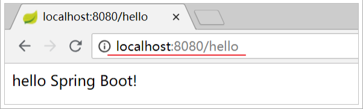

测试成功了！

## 3. java配置应用 ##
在入门案例中，我们没有任何的配置，就可以实现一个SpringMVC的项目了，快速、高效！
但是有同学会有疑问，如果没有任何的`*.xml`，那么我们如果要配置一个Bean该怎么办？比如要配置一个数据库连接池，以前会这么配置

```xml
<!-- 配置连接池 -->
<bean id="dataSource" class="com.alibaba.druid.pool.DruidDataSource"
        init-method="init" destroy-method="close">
    <property name="url" value="${jdbc.url}" />
    <property name="username" value="${jdbc.username}" />
    <property name="password" value="${jdbc.password}" />
</bean>
```

现在该怎么做呢？

### 3.1. Spring配置历史 ###
事实上，在Spring3.0开始，Spring官方就已经开始推荐使用java配置来代替传统的xml配置了，不妨来回顾一下Spring的历史：
- Spring1.0时代
  - 在此时因为jdk1.5刚刚出来，注解开发并未盛行，因此一切Spring配置都是xml格式，想象一下所有的bean都用xml配置，细思极恐啊
- Spring2.0时代
  - Spring引入了注解开发，但是因为并不完善，因此并未完全替代xml，此时的程序员往往是把xml与注解进行结合，貌似我们之前都是这种方式。
- Spring3.0及以后
  - 3.0以后Spring的注解已经非常完善了，因此Spring推荐大家使用完全的java配置来代替以前的xml，不过似乎在国内并未推广盛行。然后当Spring Boot来临，人们才慢慢认识到java配置的优雅。

有句古话说的好：拥抱变化，拥抱未来。所以应该顺应时代潮流，做时尚的弄潮儿，一起来学习下java配置的玩法。

### 3.2. 尝试java配置 ###
java配置主要靠java类和一些注解，比较常用的注解有
- `@Configuration` ：声明一个类作为配置类，代替xml文件
- `@Bean` ：声明在方法上，将方法的返回值加入Bean容器，代替 <bean> 标签
- `@Value` ：属性注入
- `@PropertySource` ：指定外部属性文件

接下来用java配置来尝试实现连接池配置
- 在 pom.xml 文件中添加Druid连接池依赖如下
  ```xml
  <dependency>
      <groupId>com.alibaba</groupId>
      <artifactId>druid</artifactId>
      <version>1.1.6</version>
  </dependency>
  ```
- 使用数据操作工具创建数据库 `springboot_test`
- 然后在项目中创建 `resources\jdbc.properties` 文件，内容如下
  ```properties
  jdbc.driverClassName=com.mysql.jdbc.Driver
  jdbc.url=jdbc:mysql://127.0.0.1:3306/springboot_test
  jdbc.username=root
  jdbc.password=root
  ```
- 编写 `JdbcConfig.java` 
  ```java
  package tk.deriwotua.datasource.config;
  
  import com.alibaba.druid.pool.DruidDataSource;
  import org.springframework.beans.factory.annotation.Value;
  import org.springframework.context.annotation.Bean;
  import org.springframework.context.annotation.Configuration;
  import org.springframework.context.annotation.PropertySource;
  
  import javax.sql.DataSource;
  
  // Configuration声明是一个配置类
  @Configuration
  // 指定属性文件的路径
  @PropertySource("classpath:jdbc.properties")
  public class JdbcConfig {
      /**
       * 属性注入值
       */
      @Value("${jdbc.url}")
      String url;
      @Value("${jdbc.driverClassName}")
      String driverClassName;
      @Value("${jdbc.username}")
      String username;
      @Value("${jdbc.password}")
      String password;
  
      /**
       * 方法声明为一个注册Bean的方法
       * Spring会自动调用该方法，将方法的返回值加入Spring容器中。然后就可以在任意位置通过 `@Autowired` 注入`DataSource`了
       */
      @Bean
      public DataSource dataSource(){
          DruidDataSource druidDataSource = new DruidDataSource();
          druidDataSource.setUrl(url);
          druidDataSource.setDriverClassName(driverClassName);
          druidDataSource.setUsername(username);
          druidDataSource.setPassword(password);
          return druidDataSource;
      }
  }
  ```

  - `@Configuration` ：声明 JdbcConfig 是一个配置类
  - `@PropertySource` ：指定属性文件的路径是: `classpath:jdbc.properties`
  - 通过 `@Value` 为属性注入值
  - 通过`@Bean`将 `dataSource()` 方法声明为一个注册Bean的方法，Spring会自动调用该方法，将方法的返回值加入Spring容器中。然后我们就可以在任意位置通过 `@Autowired` 注入`DataSource`了！

- 在 `HelloController` 中注入`DataSource`进行测试，改造代码如下
  ```java
  package tk.deriwotua.datasource.controller;
  
  import org.springframework.beans.factory.annotation.Autowired;
  import org.springframework.web.bind.annotation.GetMapping;
  import org.springframework.web.bind.annotation.RequestMapping;
  import org.springframework.web.bind.annotation.RestController;
  
  import javax.sql.DataSource;
  
  @RestController
  @RequestMapping("/datasource")
  public class DataSourceController {
  
      @Autowired
      DataSource dataSource;
  
      @GetMapping()
      public String getDataSource(){
          return dataSource.toString();
      }
  }
  ```
  - 然后打断点，Debug运行并查看属性注入成功了！
  
  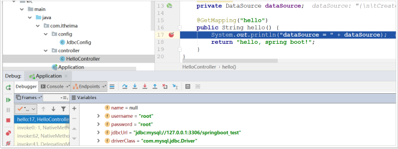

### 3.3. Spring Boot的属性注入 ###
属性文件的名称有变化，默认的文件名必须是`application.properties`或`application.yml`
在上面的案例中，我们实验了java配置方式。不过属性注入使用的是`@Value`注解。这种方式虽然可行，但是不够强大，因为它只能注入基本类型值。
在Spring Boot中，提供了一种新的属性注入方式，支持各种java基本数据类型及复杂类型的注入。
- 新建 `JdbcProperties.java` ，用于进行属性注入
```java
package tk.deriwotua.datasource.config;

import org.springframework.boot.context.properties.ConfigurationProperties;

// 声明当前类为属性读取类
// `prefix="jdbc"` 读取属性文件中，前缀为jdbc的值
@ConfigurationProperties(prefix = "jdbc")
public class JdbcProperties {
    /**
     * 属性，名称必须与属性文件中 `jdbc.` 后面部分一致
     */
    private String url;
    private String driverClassName;
    private String username;
    private String password;
    // ... 略
    // getters 和 setters
}
```
- 在类上通过`@ConfigurationProperties`注解声明当前类为属性读取类
- `prefix="jdbc"` 读取属性文件中，前缀为jdbc的值。
- 在类上定义各个属性，名称必须与属性文件中 `jdbc.` 后面部分一致
- 需要注意的是，这里并没有指定属性文件的地址，所以需要把`jdbc.properties`名称改为`application.properties`，这是Spring Boot默认读取的属性文件名


  - 注意如果出现如下提示，项目也可以运行
  
  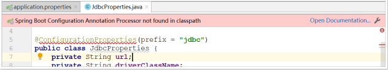
  
  - 如果要去掉上述的提示，则可以在 `pom.xml` 文件中添加如下依赖
    ```xml
    <dependency>
        <groupId> org.springframework.boot </groupId>
        <artifactId>spring-boot-configuration-processor</artifactId>
        <!--不传递依赖-->
        <optional>true</optional>
    </dependency>
    ```
- 将 `JdbcConfig` 类原来全部注释掉或删除，修改为如下内容
  ```java
  @Configuration
  @EnableConfigurationProperties(JdbcProperties.class)
  public class JdbcConfig {
      @Bean
      public DataSource dataSource(JdbcProperties jdbc) {
          DruidDataSource dataSource = new DruidDataSource();
          dataSource.setUrl(jdbc.getUrl());
          dataSource.setDriverClassName(jdbc.getDriverClassName());
          dataSource.setUsername(jdbc.getUsername());
          dataSource.setPassword(jdbc.getPassword());
          return dataSource;
      }
  }
  ```
  - 通过 `@EnableConfigurationProperties(JdbcProperties.class)` 来声明要使用 `JdbcProperties` 这个类的对象
  - 然后要使用配置的话；可以通过以下方式注入`JdbcProperties`
    - `@Autowired`注入
    ```java
    @Autowired
    private JdbcProperties prop;
    ```
    - 构造函数注入
    ```java
    private JdbcProperties prop;
    public JdbcConfig(Jdbcproperties prop){
        this.prop = prop;
    }
    ```
    - 声明有`@Bean`的方法参数注入
    ```java
    @Bean
    public Datasource dataSource(JdbcProperties prop){
        // ...
    }
    ```
  - 这里采用的是第三种方式注入。测试结果，与前面的测试一样的。

大家会觉得这种方式似乎更麻烦了，事实上这种方式有更强大的功能，也是Spring Boot推荐的注入方式。与`@Value`对比关系

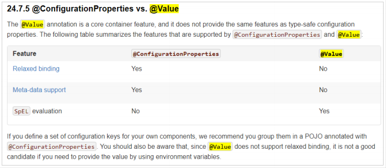

优势：
- `Relaxed binding`：松散绑定
  - 不严格要求属性文件中的属性名与成员变量名一致。支持驼峰，中划线，下划线等等转换，甚至支持对象引导。比如：`user.friend.name`代表的是user对象中的friend属性中的name属性，显然friend也是对象。`@value`注解就难以完成这样的注入方式。
  - `meta-data support`元数据支持，帮助IDE生成属性提示（写开源框架会用到）。

### 3.4. 更优雅的注入 ###
事实上，如果一段属性只有一个Bean需要使用，无需将其注入到一个类（JdbcProperties，将该类上的所有注解去掉）中。而是直接在需要的地方声明即可；再次修改 JdbcConfig 类为如下代码
```java
/**
 * 第三种方式
 * 属性只有一个Bean需要使用，无需将其注入到一个类（JdbcProperties，将该类上的所有注解去掉）中。
 * 而是直接在需要的地方声明即可
 */
@Configuration
public class JdbcConfig {

    /**
     * 直接把 `@ConfigurationProperties(prefix = "jdbc")` 声明在需要使用的 `@Bean` 的方法上，
     * 然后SpringBoot就会自动调用这个`Bean`（此处是DataSource）的`set方法`，然后完成注入。
     * 使用的前提是该类必须有对应属性的`set方法`
     * @return
     */
    @Bean
    // 声明要注入的属性前缀，Spring Boot会自动把相关属性通过set方法注入到DataSource中
    @ConfigurationProperties(prefix = "jdbc")
    public DataSource dataSource() {
        return new DruidDataSource();
    }

}
```
直接把 `@ConfigurationProperties(prefix = "jdbc")` 声明在需要使用的 `@Bean` 的方法上，然后SpringBoot就会自动调用这个`Bean`（此处是DataSource）的`set方法`，然后完成注入。使用的前提是该类必须有对应属性的`set方法`！

将 `jdbc.properties` 文件中的 `jdbc.url` 中的数据库名改成：`/heima`，再次测试

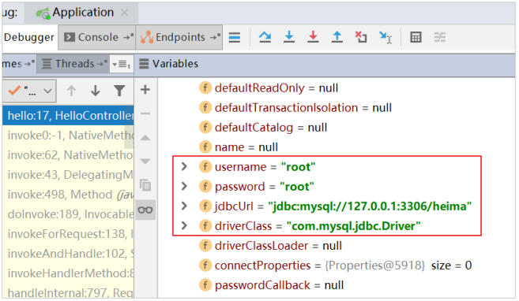

### 3.5. Yaml配置文件 ###
配置文件除了可以使用`application.properties`类型，还可以使用后缀名为`.yml`或者`.yaml`的类型，也就是`application.yml`或者`application.yaml`
基本格式
```yaml
jdbc:
    driverClassName: com.mysql.jdbc.Driver
    url: jdbc:mysql://127.0.0.1:3306/springboot_test
    username: root
    password: root
```
把`application.properties`修改为`application.yml`进行测试。
> 如果两个配置文件都有，会把两个文件的配置合并，如果有重复属性，以properties中的为准。
> 如果是配置数组、list、set等结构的内容，那么在yml文件中格式为：
> key:
> - value1
> - value2

### 3.6. 多个Yaml配置文件 ###
当一个项目中有多个yml配置文件的时候，可以以`application-**.yml`命名；在`application.yml`中配置项目使用激活这些配置文件即可。
创建 `application-abc.yml`文件如下
```yaml
deriwotua:
  url: http://www.xxx.cn
```
创建 `application-def.yml` 文件如下
```yaml
def:
  url: http://www.xxxx.com
```
在 `application.yml` 文件中添加如下配置
```yaml
#加载其它配置文件
spring:
    profiles:
      active: abc,def
```
多个文件名只需要写`application-`之后的名称，在多个文件之间使用`,`隔开。
修改代码测试

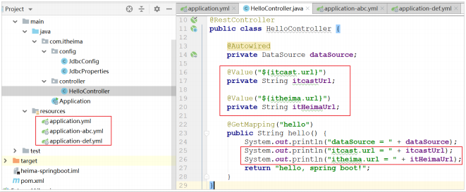

## 4. 自动配置原理 ##
使用Spring Boot之后，一个整合了SpringMVC的WEB工程开发，变的无比简单，那些繁杂的配置都消失不见了，这是如何做到的？
一切魔力的开始，都是从`main`函数来的，所以再次来看下启动类
```java
@SpringBootApplication
public class DeriwotuaApplication {
    public static void main(String[] args) {
        SpringApplication.run(DeriwotuaApplication.class, args);
    }
}
```
发现特别的地方有两个
- `@org.springframework.boot.autoconfigure.SpringBootApplication` 注解
- `org.springframework.boot.SpringApplication.run(java.lang.Class<?>, java.lang.String...)`方法
分别来研究这两个部分。

### 4.1. 了解@SpringBootApplication ###
点击进入，查看源码：
```java
/*
 * Copyright 2012-2019 the original author or authors.
 *
 * Licensed under the Apache License, Version 2.0 (the "License");
 * you may not use this file except in compliance with the License.
 * You may obtain a copy of the License at
 *
 *      https://www.apache.org/licenses/LICENSE-2.0
 *
 * Unless required by applicable law or agreed to in writing, software
 * distributed under the License is distributed on an "AS IS" BASIS,
 * WITHOUT WARRANTIES OR CONDITIONS OF ANY KIND, either express or implied.
 * See the License for the specific language governing permissions and
 * limitations under the License.
 */

package org.springframework.boot.autoconfigure;

import java.lang.annotation.Documented;
import java.lang.annotation.ElementType;
import java.lang.annotation.Inherited;
import java.lang.annotation.Retention;
import java.lang.annotation.RetentionPolicy;
import java.lang.annotation.Target;

import org.springframework.boot.SpringBootConfiguration;
import org.springframework.boot.context.TypeExcludeFilter;
import org.springframework.context.annotation.Bean;
import org.springframework.context.annotation.ComponentScan;
import org.springframework.context.annotation.ComponentScan.Filter;
import org.springframework.context.annotation.Configuration;
import org.springframework.context.annotation.FilterType;
import org.springframework.core.annotation.AliasFor;

/**
 * Indicates a {@link Configuration configuration} class that declares one or more
 * {@link Bean @Bean} methods and also triggers {@link EnableAutoConfiguration
 * auto-configuration} and {@link ComponentScan component scanning}. This is a convenience
 * annotation that is equivalent to declaring {@code @Configuration},
 * {@code @EnableAutoConfiguration} and {@code @ComponentScan}.
 *
 * @author Phillip Webb
 * @author Stephane Nicoll
 * @since 1.2.0
 */
@Target(ElementType.TYPE)
@Retention(RetentionPolicy.RUNTIME)
@Documented
@Inherited
@SpringBootConfiguration
@EnableAutoConfiguration
@ComponentScan(excludeFilters = {
		@Filter(type = FilterType.CUSTOM, classes = TypeExcludeFilter.class),
		@Filter(type = FilterType.CUSTOM,
				classes = AutoConfigurationExcludeFilter.class) })
public @interface SpringBootApplication {

	/**
	 * Exclude specific auto-configuration classes such that they will never be applied.
	 * @return the classes to exclude
	 */
	@AliasFor(annotation = EnableAutoConfiguration.class)
	Class<?>[] exclude() default {};

	/**
	 * Exclude specific auto-configuration class names such that they will never be
	 * applied.
	 * @return the class names to exclude
	 * @since 1.3.0
	 */
	@AliasFor(annotation = EnableAutoConfiguration.class)
	String[] excludeName() default {};

	/**
	 * Base packages to scan for annotated components. Use {@link #scanBasePackageClasses}
	 * for a type-safe alternative to String-based package names.
	 * @return base packages to scan
	 * @since 1.3.0
	 */
	@AliasFor(annotation = ComponentScan.class, attribute = "basePackages")
	String[] scanBasePackages() default {};

	/**
	 * Type-safe alternative to {@link #scanBasePackages} for specifying the packages to
	 * scan for annotated components. The package of each class specified will be scanned.
	 * <p>
	 * Consider creating a special no-op marker class or interface in each package that
	 * serves no purpose other than being referenced by this attribute.
	 * @return base packages to scan
	 * @since 1.3.0
	 */
	@AliasFor(annotation = ComponentScan.class, attribute = "basePackageClasses")
	Class<?>[] scanBasePackageClasses() default {};

}
```
这里重点的注解有3个
```java
@org.springframework.boot.SpringBootConfiguration
@org.springframework.boot.autoconfigure.EnableAutoConfiguration
@org.springframework.context.annotation.ComponentScan
```

#### 4.1.1. @SpringBootConfiguration ####
继续点击查看源码
```java
/**
 * Indicates that a class provides Spring Boot application
 * {@link Configuration @Configuration}. Can be used as an alternative to the Spring's
 * standard {@code @Configuration} annotation so that configuration can be found
 * automatically (for example in tests).
 * <p>
 * Application should only ever include <em>one</em> {@code @SpringBootConfiguration} and
 * most idiomatic Spring Boot applications will inherit it from
 * {@code @SpringBootApplication}.
 *
 * @author Phillip Webb
 * @since 1.4.0
 */
@Target(ElementType.TYPE)
@Retention(RetentionPolicy.RUNTIME)
@Documented
@Configuration
public @interface SpringBootConfiguration {

}
```
通过这段可以看出，在这个注解上面，又有一个` @org.springframework.context.annotation.Configuration` 注解。通过上面的注释阅读知道：这个注解的作用就是声明当前类是一个配置类，然后Spring会自动扫描到添加了 `@Configuration` 的类，并且读取其中的配置信息。而 `@SpringBootConfiguration` 是来声明当前类是SpringBoot应用的配置类，项目中只能有一个。所以一般无需自己添加。

#### 4.1.2. @EnableAutoConfiguration ####
关于这个注解，官网上有一段说明：
> The second class-level annotation is @EnableAutoConfiguration . This annotation tells Spring Boot to “guess” how you want to configure Spring, based on the jar dependencies that you have added. Since spring-boot-starter-web added Tomcat and Spring MVC, the auto-configuration assumes that you are developing a web application and sets up Spring accordingly.

简单翻译以下
> 第二级的注解 @EnableAutoConfiguration ，告诉Spring Boot基于你所添加的依赖，去“猜测”你想要如何配置Spring。比如我们引入了 spring-boot-starter-web ，而这个启动器中帮我们添加了 tomcat 、 SpringMVC的依赖。此时自动配置就知道你是要开发一个web应用，所以就帮你完成了web及SpringMVC的默认配置了！

总结，Spring Boot内部对大量的第三方库或Spring内部库进行了默认配置，这些配置是否生效，取决于我们是否引入了对应库所需的依赖，如果有那么默认配置就会生效。
所以，我们使用SpringBoot构建一个项目，只需要引入所需框架的依赖，配置就可以交给SpringBoot处理了。除非你不希望使用SpringBoot的默认配置，它也提供了自定义配置的入口。

#### 4.1.3. @ComponentScan ####
跟进源码
```java
@Retention(RetentionPolicy.RUNTIME)
@Target({ElementType.TYPE})
@Documented
@Repeatable(ComponentScans.class)
public @interface ComponentScan {
    
}
```
并没有看到什么特殊的地方。查看注释
```java
/**
 * Configures component scanning directives for use with @{@link Configuration} classes.
 * Provides support parallel with Spring XML's {@code <context:component-scan>} element.
 *
 * <p>Either {@link #basePackageClasses} or {@link #basePackages} (or its alias
 * {@link #value}) may be specified to define specific packages to scan. If specific
 * packages are not defined, scanning will occur from the package of the
 * class that declares this annotation.
 *
 * <p>Note that the {@code <context:component-scan>} element has an
 * {@code annotation-config} attribute; however, this annotation does not. This is because
 * in almost all cases when using {@code @ComponentScan}, default annotation config
 * processing (e.g. processing {@code @Autowired} and friends) is assumed. Furthermore,
 * when using {@link AnnotationConfigApplicationContext}, annotation config processors are
 * always registered, meaning that any attempt to disable them at the
 * {@code @ComponentScan} level would be ignored.
 *
 * <p>See {@link Configuration @Configuration}'s Javadoc for usage examples.
 *
 * @author Chris Beams
 * @author Juergen Hoeller
 * @author Sam Brannen
 * @since 3.1
 * @see Configuration
 */
```
大概的意思
> 配置组件扫描的指令。提供了类似与 `<context:component-scan>` 标签的作用通过`basePackageClasses`或者`basePackages`属性来指定要扫描的包。如果没有指定这些属性，那么将从声明这个注解的类所在的包开始，扫描包及子包

而`@SpringBootApplication`注解声明的类就是`main`函数所在的启动类，因此扫描的包是该类所在包及其子包。因此，一般启动类会放在一个比较前的包目录中。

### 4.2. 默认配置原理 ###
#### 4.2.1. spring.factories ####
在`SpringApplication`类构建的时候，有这样一段初始化代码`setInitializers((Collection) getSpringFactoriesInstances(ApplicationContextInitializer.class));`调用了 `getSpringFactoriesInstances()`
```java
public class SpringApplication {
    /**
	 * Create a new {@link SpringApplication} instance. The application context will load
	 * beans from the specified primary sources (see {@link SpringApplication class-level}
	 * documentation for details. The instance can be customized before calling
	 * {@link #run(String...)}.
	 * @param resourceLoader the resource loader to use
	 * @param primarySources the primary bean sources
	 * @see #run(Class, String[])
	 * @see #setSources(Set)
	 */
	@SuppressWarnings({ "unchecked", "rawtypes" })
	public SpringApplication(ResourceLoader resourceLoader, Class<?>... primarySources) {
		this.resourceLoader = resourceLoader;
		Assert.notNull(primarySources, "PrimarySources must not be null");
		this.primarySources = new LinkedHashSet<>(Arrays.asList(primarySources));
		this.webApplicationType = WebApplicationType.deduceFromClasspath();
		setInitializers((Collection) getSpringFactoriesInstances(
				ApplicationContextInitializer.class));
		setListeners((Collection) getSpringFactoriesInstances(ApplicationListener.class));
		this.mainApplicationClass = deduceMainApplicationClass();
	}
}
```
跟进去
```java
private <T> Collection<T> getSpringFactoriesInstances(Class<T> type) {
    return getSpringFactoriesInstances(type, new Class<?>[] {});
}

private <T> Collection<T> getSpringFactoriesInstances(Class<T> type,
        Class<?>[] parameterTypes, Object... args) {
    ClassLoader classLoader = getClassLoader();
    // Use names and ensure unique to protect against duplicates
    Set<String> names = new LinkedHashSet<>(
            SpringFactoriesLoader.loadFactoryNames(type, classLoader));
    List<T> instances = createSpringFactoriesInstances(type, parameterTypes,
            classLoader, args, names);
    AnnotationAwareOrderComparator.sort(instances);
    return instances;
}
```
这里`Set<String> names = new LinkedHashSet<>(SpringFactoriesLoader.loadFactoryNames(type, classLoader));`发现会通过`loadFactoryNames`尝试加载一些`FactoryName`，然后利用`createSpringFactoriesInstances()`将这些加载到的类名进行实例化。

继续跟进`org.springframework.core.io.support.SpringFactoriesLoader.loadFactoryNames()`方法
```java
public static List<String> loadFactoryNames(Class<?> factoryClass, @Nullable ClassLoader classLoader) {
    String factoryClassName = factoryClass.getName();
    return (List)loadSpringFactories(classLoader).getOrDefault(factoryClassName, Collections.emptyList());
}

private static Map<String, List<String>> loadSpringFactories(@Nullable ClassLoader classLoader) {
    MultiValueMap<String, String> result = (MultiValueMap)cache.get(classLoader);
    if (result != null) {
        return result;
    } else {
        try {
            Enumeration<URL> urls = classLoader != null ? classLoader.getResources("META-INF/spring.factories") : ClassLoader.getSystemResources("META-INF/spring.factories");
            LinkedMultiValueMap result = new LinkedMultiValueMap();

            while(urls.hasMoreElements()) {
                URL url = (URL)urls.nextElement();
                UrlResource resource = new UrlResource(url);
                Properties properties = PropertiesLoaderUtils.loadProperties(resource);
                Iterator var6 = properties.entrySet().iterator();

                while(var6.hasNext()) {
                    Entry<?, ?> entry = (Entry)var6.next();
                    String factoryClassName = ((String)entry.getKey()).trim();
                    String[] var9 = StringUtils.commaDelimitedListToStringArray((String)entry.getValue());
                    int var10 = var9.length;

                    for(int var11 = 0; var11 < var10; ++var11) {
                        String factoryName = var9[var11];
                        result.add(factoryClassName, factoryName.trim());
                    }
                }
            }

            cache.put(classLoader, result);
            return result;
        } catch (IOException var13) {
            throw new IllegalArgumentException("Unable to load factories from location [META-INF/spring.factories]", var13);
        }
    }
}
```
发现内部调用`loadSpringFactories()`方法此方法里`Enumeration<URL> urls = classLoader != null ? classLoader.getResources(FACTORIES_RESOURCE_LOCATION) : ClassLoader.getSystemResources(FACTORIES_RESOURCE_LOCATION); LinkedMultiValueMap result = new LinkedMultiValueMap();`利用类加载器加载某个文件： `FACTORIES_RESOURCE_LOCATION` ，然后解析其内容。找到这个变量的声明
```java
/**
 * The location to look for factories.
 * <p>Can be present in multiple JAR files.
 */
public static final String FACTORIES_RESOURCE_LOCATION = "META-INF/spring.factories";
```

可以发现，其声明定义的文件是 `META-INF/spring.factories` ，`ClassLoader`默认是从`classpath`下读取文件，因此，SpringBoot会在初始化的时候，加载所有`classpath:META-INF/spring.factories`文件，包括jar包当中的。
而在Spring的一个依赖包：`spring-boot-autoconfigure`中，就有这样的文件

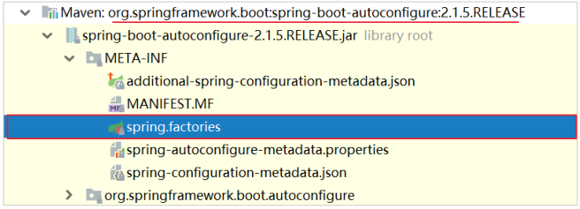

以后引入的任何第三方启动器，只要实现自动配置，也都会有类似文件。

#### 4.2.1. 默认配置类 ####
打开刚才的`spring.factories`文件
```properties
# Initializers
org.springframework.context.ApplicationContextInitializer=\
org.springframework.boot.autoconfigure.SharedMetadataReaderFactoryContextInitializer,\
org.springframework.boot.autoconfigure.logging.ConditionEvaluationReportLoggingListener

# Application Listeners
org.springframework.context.ApplicationListener=\
org.springframework.boot.autoconfigure.BackgroundPreinitializer

# Auto Configuration Import Listeners
org.springframework.boot.autoconfigure.AutoConfigurationImportListener=\
org.springframework.boot.autoconfigure.condition.ConditionEvaluationReportAutoConfigurationImportListener

# Auto Configuration Import Filters
org.springframework.boot.autoconfigure.AutoConfigurationImportFilter=\
org.springframework.boot.autoconfigure.condition.OnBeanCondition,\
org.springframework.boot.autoconfigure.condition.OnClassCondition,\
org.springframework.boot.autoconfigure.condition.OnWebApplicationCondition

# Auto Configure
org.springframework.boot.autoconfigure.EnableAutoConfiguration=\
org.springframework.boot.autoconfigure.admin.SpringApplicationAdminJmxAutoConfiguration,\
org.springframework.boot.autoconfigure.aop.AopAutoConfiguration,\
org.springframework.boot.autoconfigure.amqp.RabbitAutoConfiguration,\
org.springframework.boot.autoconfigure.batch.BatchAutoConfiguration,\
org.springframework.boot.autoconfigure.cache.CacheAutoConfiguration,\
org.springframework.boot.autoconfigure.cassandra.CassandraAutoConfiguration,\
org.springframework.boot.autoconfigure.cloud.CloudServiceConnectorsAutoConfiguration,\
org.springframework.boot.autoconfigure.context.ConfigurationPropertiesAutoConfiguration,\
org.springframework.boot.autoconfigure.context.MessageSourceAutoConfiguration,\
org.springframework.boot.autoconfigure.context.PropertyPlaceholderAutoConfiguration,\
org.springframework.boot.autoconfigure.couchbase.CouchbaseAutoConfiguration,\
org.springframework.boot.autoconfigure.dao.PersistenceExceptionTranslationAutoConfiguration,\
org.springframework.boot.autoconfigure.data.cassandra.CassandraDataAutoConfiguration,\
org.springframework.boot.autoconfigure.data.cassandra.CassandraReactiveDataAutoConfiguration,\
org.springframework.boot.autoconfigure.data.cassandra.CassandraReactiveRepositoriesAutoConfiguration,\
org.springframework.boot.autoconfigure.data.cassandra.CassandraRepositoriesAutoConfiguration,\
org.springframework.boot.autoconfigure.data.couchbase.CouchbaseDataAutoConfiguration,\
org.springframework.boot.autoconfigure.data.couchbase.CouchbaseReactiveDataAutoConfiguration,\
org.springframework.boot.autoconfigure.data.couchbase.CouchbaseReactiveRepositoriesAutoConfiguration,\
org.springframework.boot.autoconfigure.data.couchbase.CouchbaseRepositoriesAutoConfiguration,\
org.springframework.boot.autoconfigure.data.elasticsearch.ElasticsearchAutoConfiguration,\
org.springframework.boot.autoconfigure.data.elasticsearch.ElasticsearchDataAutoConfiguration,\
org.springframework.boot.autoconfigure.data.elasticsearch.ElasticsearchRepositoriesAutoConfiguration,\
org.springframework.boot.autoconfigure.data.jdbc.JdbcRepositoriesAutoConfiguration,\
org.springframework.boot.autoconfigure.data.jpa.JpaRepositoriesAutoConfiguration,\
org.springframework.boot.autoconfigure.data.ldap.LdapRepositoriesAutoConfiguration,\
org.springframework.boot.autoconfigure.data.mongo.MongoDataAutoConfiguration,\
org.springframework.boot.autoconfigure.data.mongo.MongoReactiveDataAutoConfiguration,\
org.springframework.boot.autoconfigure.data.mongo.MongoReactiveRepositoriesAutoConfiguration,\
org.springframework.boot.autoconfigure.data.mongo.MongoRepositoriesAutoConfiguration,\
org.springframework.boot.autoconfigure.data.neo4j.Neo4jDataAutoConfiguration,\
org.springframework.boot.autoconfigure.data.neo4j.Neo4jRepositoriesAutoConfiguration,\
org.springframework.boot.autoconfigure.data.solr.SolrRepositoriesAutoConfiguration,\
org.springframework.boot.autoconfigure.data.redis.RedisAutoConfiguration,\
org.springframework.boot.autoconfigure.data.redis.RedisReactiveAutoConfiguration,\
org.springframework.boot.autoconfigure.data.redis.RedisRepositoriesAutoConfiguration,\
org.springframework.boot.autoconfigure.data.rest.RepositoryRestMvcAutoConfiguration,\
org.springframework.boot.autoconfigure.data.web.SpringDataWebAutoConfiguration,\
org.springframework.boot.autoconfigure.elasticsearch.jest.JestAutoConfiguration,\
org.springframework.boot.autoconfigure.elasticsearch.rest.RestClientAutoConfiguration,\
org.springframework.boot.autoconfigure.flyway.FlywayAutoConfiguration,\
org.springframework.boot.autoconfigure.freemarker.FreeMarkerAutoConfiguration,\
org.springframework.boot.autoconfigure.gson.GsonAutoConfiguration,\
org.springframework.boot.autoconfigure.h2.H2ConsoleAutoConfiguration,\
org.springframework.boot.autoconfigure.hateoas.HypermediaAutoConfiguration,\
org.springframework.boot.autoconfigure.hazelcast.HazelcastAutoConfiguration,\
org.springframework.boot.autoconfigure.hazelcast.HazelcastJpaDependencyAutoConfiguration,\
org.springframework.boot.autoconfigure.http.HttpMessageConvertersAutoConfiguration,\
org.springframework.boot.autoconfigure.http.codec.CodecsAutoConfiguration,\
org.springframework.boot.autoconfigure.influx.InfluxDbAutoConfiguration,\
org.springframework.boot.autoconfigure.info.ProjectInfoAutoConfiguration,\
org.springframework.boot.autoconfigure.integration.IntegrationAutoConfiguration,\
org.springframework.boot.autoconfigure.jackson.JacksonAutoConfiguration,\
org.springframework.boot.autoconfigure.jdbc.DataSourceAutoConfiguration,\
org.springframework.boot.autoconfigure.jdbc.JdbcTemplateAutoConfiguration,\
org.springframework.boot.autoconfigure.jdbc.JndiDataSourceAutoConfiguration,\
org.springframework.boot.autoconfigure.jdbc.XADataSourceAutoConfiguration,\
org.springframework.boot.autoconfigure.jdbc.DataSourceTransactionManagerAutoConfiguration,\
org.springframework.boot.autoconfigure.jms.JmsAutoConfiguration,\
org.springframework.boot.autoconfigure.jmx.JmxAutoConfiguration,\
org.springframework.boot.autoconfigure.jms.JndiConnectionFactoryAutoConfiguration,\
org.springframework.boot.autoconfigure.jms.activemq.ActiveMQAutoConfiguration,\
org.springframework.boot.autoconfigure.jms.artemis.ArtemisAutoConfiguration,\
org.springframework.boot.autoconfigure.groovy.template.GroovyTemplateAutoConfiguration,\
org.springframework.boot.autoconfigure.jersey.JerseyAutoConfiguration,\
org.springframework.boot.autoconfigure.jooq.JooqAutoConfiguration,\
org.springframework.boot.autoconfigure.jsonb.JsonbAutoConfiguration,\
org.springframework.boot.autoconfigure.kafka.KafkaAutoConfiguration,\
org.springframework.boot.autoconfigure.ldap.embedded.EmbeddedLdapAutoConfiguration,\
org.springframework.boot.autoconfigure.ldap.LdapAutoConfiguration,\
org.springframework.boot.autoconfigure.liquibase.LiquibaseAutoConfiguration,\
org.springframework.boot.autoconfigure.mail.MailSenderAutoConfiguration,\
org.springframework.boot.autoconfigure.mail.MailSenderValidatorAutoConfiguration,\
org.springframework.boot.autoconfigure.mongo.embedded.EmbeddedMongoAutoConfiguration,\
org.springframework.boot.autoconfigure.mongo.MongoAutoConfiguration,\
org.springframework.boot.autoconfigure.mongo.MongoReactiveAutoConfiguration,\
org.springframework.boot.autoconfigure.mustache.MustacheAutoConfiguration,\
org.springframework.boot.autoconfigure.orm.jpa.HibernateJpaAutoConfiguration,\
org.springframework.boot.autoconfigure.quartz.QuartzAutoConfiguration,\
org.springframework.boot.autoconfigure.reactor.core.ReactorCoreAutoConfiguration,\
org.springframework.boot.autoconfigure.security.servlet.SecurityAutoConfiguration,\
org.springframework.boot.autoconfigure.security.servlet.SecurityRequestMatcherProviderAutoConfiguration,\
org.springframework.boot.autoconfigure.security.servlet.UserDetailsServiceAutoConfiguration,\
org.springframework.boot.autoconfigure.security.servlet.SecurityFilterAutoConfiguration,\
org.springframework.boot.autoconfigure.security.reactive.ReactiveSecurityAutoConfiguration,\
org.springframework.boot.autoconfigure.security.reactive.ReactiveUserDetailsServiceAutoConfiguration,\
org.springframework.boot.autoconfigure.sendgrid.SendGridAutoConfiguration,\
org.springframework.boot.autoconfigure.session.SessionAutoConfiguration,\
org.springframework.boot.autoconfigure.security.oauth2.client.servlet.OAuth2ClientAutoConfiguration,\
org.springframework.boot.autoconfigure.security.oauth2.client.reactive.ReactiveOAuth2ClientAutoConfiguration,\
org.springframework.boot.autoconfigure.security.oauth2.resource.servlet.OAuth2ResourceServerAutoConfiguration,\
org.springframework.boot.autoconfigure.security.oauth2.resource.reactive.ReactiveOAuth2ResourceServerAutoConfiguration,\
org.springframework.boot.autoconfigure.solr.SolrAutoConfiguration,\
org.springframework.boot.autoconfigure.task.TaskExecutionAutoConfiguration,\
org.springframework.boot.autoconfigure.task.TaskSchedulingAutoConfiguration,\
org.springframework.boot.autoconfigure.thymeleaf.ThymeleafAutoConfiguration,\
org.springframework.boot.autoconfigure.transaction.TransactionAutoConfiguration,\
org.springframework.boot.autoconfigure.transaction.jta.JtaAutoConfiguration,\
org.springframework.boot.autoconfigure.validation.ValidationAutoConfiguration,\
org.springframework.boot.autoconfigure.web.client.RestTemplateAutoConfiguration,\
org.springframework.boot.autoconfigure.web.embedded.EmbeddedWebServerFactoryCustomizerAutoConfiguration,\
org.springframework.boot.autoconfigure.web.reactive.HttpHandlerAutoConfiguration,\
org.springframework.boot.autoconfigure.web.reactive.ReactiveWebServerFactoryAutoConfiguration,\
org.springframework.boot.autoconfigure.web.reactive.WebFluxAutoConfiguration,\
org.springframework.boot.autoconfigure.web.reactive.error.ErrorWebFluxAutoConfiguration,\
org.springframework.boot.autoconfigure.web.reactive.function.client.ClientHttpConnectorAutoConfiguration,\
org.springframework.boot.autoconfigure.web.reactive.function.client.WebClientAutoConfiguration,\
org.springframework.boot.autoconfigure.web.servlet.DispatcherServletAutoConfiguration,\
org.springframework.boot.autoconfigure.web.servlet.ServletWebServerFactoryAutoConfiguration,\
org.springframework.boot.autoconfigure.web.servlet.error.ErrorMvcAutoConfiguration,\
org.springframework.boot.autoconfigure.web.servlet.HttpEncodingAutoConfiguration,\
org.springframework.boot.autoconfigure.web.servlet.MultipartAutoConfiguration,\
org.springframework.boot.autoconfigure.web.servlet.WebMvcAutoConfiguration,\
org.springframework.boot.autoconfigure.websocket.reactive.WebSocketReactiveAutoConfiguration,\
org.springframework.boot.autoconfigure.websocket.servlet.WebSocketServletAutoConfiguration,\
org.springframework.boot.autoconfigure.websocket.servlet.WebSocketMessagingAutoConfiguration,\
org.springframework.boot.autoconfigure.webservices.WebServicesAutoConfiguration,\
org.springframework.boot.autoconfigure.webservices.client.WebServiceTemplateAutoConfiguration

# Failure analyzers
org.springframework.boot.diagnostics.FailureAnalyzer=\
org.springframework.boot.autoconfigure.diagnostics.analyzer.NoSuchBeanDefinitionFailureAnalyzer,\
org.springframework.boot.autoconfigure.jdbc.DataSourceBeanCreationFailureAnalyzer,\
org.springframework.boot.autoconfigure.jdbc.HikariDriverConfigurationFailureAnalyzer,\
org.springframework.boot.autoconfigure.session.NonUniqueSessionRepositoryFailureAnalyzer

# Template availability providers
org.springframework.boot.autoconfigure.template.TemplateAvailabilityProvider=\
org.springframework.boot.autoconfigure.freemarker.FreeMarkerTemplateAvailabilityProvider,\
org.springframework.boot.autoconfigure.mustache.MustacheTemplateAvailabilityProvider,\
org.springframework.boot.autoconfigure.groovy.template.GroovyTemplateAvailabilityProvider,\
org.springframework.boot.autoconfigure.thymeleaf.ThymeleafTemplateAvailabilityProvider,\
org.springframework.boot.autoconfigure.web.servlet.JspTemplateAvailabilityProvider
```
可以发现以`org.springframework.boot.autoconfigure.EnableAutoConfiguration`接口为key的一系列配置，key所对应的值，就是所有的自动配置类，可以在当前的jar包中找到这些自动配置类

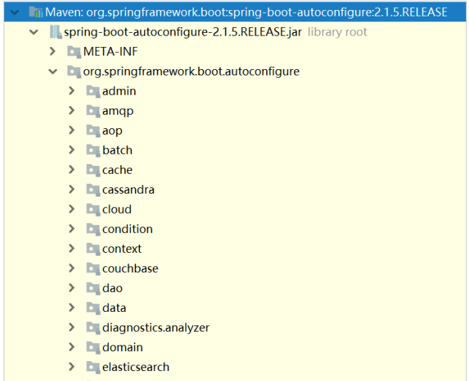

非常多，几乎涵盖了现在主流的开源框架
- redis
- jms
- amqp
- jdbc
- jackson
- mongodb
- jpa
- solr
- elasticsearch
- ...

来看一个我们熟悉的，例如SpringMVC，查看mvc 的自动配置类

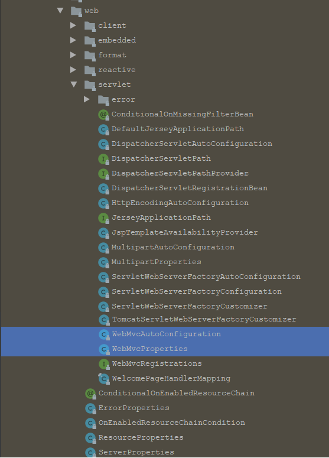

打开`org.springframework.boot.autoconfigure.web.servlet.WebMvcAutoConfiguration`
```java
@Configuration
@ConditionalOnWebApplication(type = Type.SERVLET)
@ConditionalOnClass({ Servlet.class, DispatcherServlet.class, WebMvcConfigurer.class })
@ConditionalOnMissingBean(WebMvcConfigurationSupport.class)
@AutoConfigureOrder(Ordered.HIGHEST_PRECEDENCE + 10)
@AutoConfigureAfter({ DispatcherServletAutoConfiguration.class,
		TaskExecutionAutoConfiguration.class, ValidationAutoConfiguration.class })
public class WebMvcAutoConfiguration {
    
}
```
我们看到这个类上的前4个注解
- `@Configuration` 声明这个类是一个配置类
- `@ConditionalOnWebApplication(type = Type.SERVLET)` `ConditionalOn`，翻译就是在某个条件下，此处就是满足项目的类是是`Type.SERVLET
`类型，也就是一个普通web工程，显然`springboot-quickstart`就是
- `@ConditionalOnClass({ Servlet.class, DispatcherServlet.class, WebMvcConfigurer.class })`这里的条件是`OnClass`，也就是满足以下类存在：`Servlet`、`DispatcherServlet`、`WebMvcConfigurer`，其中`Servlet`只要引入了`tomcat`依赖自然会有，后两个需要引入`SpringMVC`才会有。这里就是判断你是否引入了相关依赖，引入依赖后该条件成立，当前类的配置才会生效！
- `@ConditionalOnMissingBean(WebMvcConfigurationSupport.class)`这个条件与上面不同，`OnMissingBean`，是说环境中没有指定的Bean这个才生效。其实这就是自定义配置的入口，也就是说，如果自己配置了一个`WebMVCConfigurationSupport`的类，那么这个默认配置就会失效！

接着，查看该类中定义了什么
`ViewResolver`视图解析器
```java
@Configuration
@ConditionalOnWebApplication(type = Type.SERVLET)
@ConditionalOnClass({ Servlet.class, DispatcherServlet.class, WebMvcConfigurer.class })
@ConditionalOnMissingBean(WebMvcConfigurationSupport.class)
@AutoConfigureOrder(Ordered.HIGHEST_PRECEDENCE + 10)
@AutoConfigureAfter({ DispatcherServletAutoConfiguration.class,
		TaskExecutionAutoConfiguration.class, ValidationAutoConfiguration.class })
public class WebMvcAutoConfiguration {
	// Defined as a nested config to ensure WebMvcConfigurer is not read when not
	// on the classpath
	@Configuration
	@Import(EnableWebMvcConfiguration.class)
	@EnableConfigurationProperties({ WebMvcProperties.class, ResourceProperties.class })
	@Order(0)
	public static class WebMvcAutoConfigurationAdapter
			implements WebMvcConfigurer, ResourceLoaderAware {
        @Bean
		@ConditionalOnMissingBean
		public InternalResourceViewResolver defaultViewResolver() {
			InternalResourceViewResolver resolver = new InternalResourceViewResolver();
			resolver.setPrefix(this.mvcProperties.getView().getPrefix());
			resolver.setSuffix(this.mvcProperties.getView().getSuffix());
			return resolver;
		}

		@Bean
		@ConditionalOnBean(View.class)
		@ConditionalOnMissingBean
		public BeanNameViewResolver beanNameViewResolver() {
			BeanNameViewResolver resolver = new BeanNameViewResolver();
			resolver.setOrder(Ordered.LOWEST_PRECEDENCE - 10);
			return resolver;
		}
    }
}
```
`HandlerAdapter`处理器适配器
```java
@Configuration
@ConditionalOnWebApplication(type = Type.SERVLET)
@ConditionalOnClass({ Servlet.class, DispatcherServlet.class, WebMvcConfigurer.class })
@ConditionalOnMissingBean(WebMvcConfigurationSupport.class)
@AutoConfigureOrder(Ordered.HIGHEST_PRECEDENCE + 10)
@AutoConfigureAfter({ DispatcherServletAutoConfiguration.class,
		TaskExecutionAutoConfiguration.class, ValidationAutoConfiguration.class })
public class WebMvcAutoConfiguration {
    /**
	 * Configuration equivalent to {@code @EnableWebMvc}.
	 */
	@Configuration
	public static class EnableWebMvcConfiguration extends DelegatingWebMvcConfiguration {

		private final WebMvcProperties mvcProperties;

		private final ListableBeanFactory beanFactory;

		private final WebMvcRegistrations mvcRegistrations;

		public EnableWebMvcConfiguration(
				ObjectProvider<WebMvcProperties> mvcPropertiesProvider,
				ObjectProvider<WebMvcRegistrations> mvcRegistrationsProvider,
				ListableBeanFactory beanFactory) {
			this.mvcProperties = mvcPropertiesProvider.getIfAvailable();
			this.mvcRegistrations = mvcRegistrationsProvider.getIfUnique();
			this.beanFactory = beanFactory;
		}

		@Bean
		@Override
		public RequestMappingHandlerAdapter requestMappingHandlerAdapter() {
			RequestMappingHandlerAdapter adapter = super.requestMappingHandlerAdapter();
			adapter.setIgnoreDefaultModelOnRedirect(this.mvcProperties == null
					|| this.mvcProperties.isIgnoreDefaultModelOnRedirect());
			return adapter;
		}

		@Override
		protected RequestMappingHandlerAdapter createRequestMappingHandlerAdapter() {
			if (this.mvcRegistrations != null
					&& this.mvcRegistrations.getRequestMappingHandlerAdapter() != null) {
				return this.mvcRegistrations.getRequestMappingHandlerAdapter();
			}
			return super.createRequestMappingHandlerAdapter();
		}

		@Bean
		@Primary
		@Override
		public RequestMappingHandlerMapping requestMappingHandlerMapping() {
			// Must be @Primary for MvcUriComponentsBuilder to work
			return super.requestMappingHandlerMapping();
		}
    }
}
```
还有很多, 详细查看源码

#### 4.2.2. 默认配置属性 ####
另外，这些默认配置的属性来自哪里呢？
```java
@Configuration
@ConditionalOnWebApplication(type = Type.SERVLET)
@ConditionalOnClass({ Servlet.class, DispatcherServlet.class, WebMvcConfigurer.class })
@ConditionalOnMissingBean(WebMvcConfigurationSupport.class)
@AutoConfigureOrder(Ordered.HIGHEST_PRECEDENCE + 10)
@AutoConfigureAfter({ DispatcherServletAutoConfiguration.class,
		TaskExecutionAutoConfiguration.class, ValidationAutoConfiguration.class })
public class WebMvcAutoConfiguration {
	@Configuration
	@Import(EnableWebMvcConfiguration.class)
    /**
     * 这里的WebMvcProperties.class, ResourceProperties.class 哪里来的
     */
	@EnableConfigurationProperties({ WebMvcProperties.class, ResourceProperties.class })
	@Order(0)
	public static class WebMvcAutoConfigurationAdapter
			implements WebMvcConfigurer, ResourceLoaderAware {
	}
}
```
这里通过`@EnableAutoConfiguration`注解引入了两个属性：`WebMvcProperties`和`ResourceProperties`。这不就是上面提到的SpringBoot的属性注入玩法嘛。
查看这两个属性类
```java
@ConfigurationProperties(prefix = "spring.mvc")
public class WebMvcProperties {
    	public static class View {
    		/**
    		 * Spring MVC view prefix.
    		 */
    		private String prefix;
    
    		/**
    		 * Spring MVC view suffix.
    		 */
    		private String suffix;
    }
}
```
找到了内部资源视图解析器的`prefix`和`suffix`属性。

`ResourceProperties`中主要定义了静态资源`.js`,`.html`,`.css`等)的路径
```java
@ConfigurationProperties(prefix = "spring.resources", ignoreUnknownFields = false)
public class ResourceProperties {

	private static final String[] CLASSPATH_RESOURCE_LOCATIONS = {
			"classpath:/META-INF/resources/", "classpath:/resources/",
			"classpath:/static/", "classpath:/public/" };

	/**
	 * Locations of static resources. Defaults to classpath:[/META-INF/resources/,
	 * /resources/, /static/, /public/].
	 */
	private String[] staticLocations = CLASSPATH_RESOURCE_LOCATIONS;
}
```
如果要覆盖这些默认属性，只需要在`application.properties`中定义与其前缀`prefix`和`字段名`一致的属性即可。

### 4.3. 总结 ###
SpringBoot为我们提供了默认配置，而默认配置生效的步骤
- `@EnableAutoConfiguration`注解会去寻找 `META-INF/spring.factories` 文件，读取其中以`EnableAutoConfiguration` 为key的所有类的名称，这些类就是提前写好的自动配置类
- 这些类都声明了 `@Configuration` 注解，并且通过 `@Bean` 注解提前配置了我们所需要的一切实例
- 但是，这些配置不一定生效，因为有 `@ConditionalOn*` 注解，满足一定条件才会生效。比如条件之一： 是一些相关的类要存在
- 类要存在，当项目中引入了相关依赖（启动器），依赖有了条件成立，自动配置生效。
- 如果自己配置了相关`Bean`，那么会覆盖默认的自动配置的`Bean`
- 还可以通过配置`application.yml`文件，来覆盖自动配置中的属性

启动器: 如果不想配置，只需要引入依赖即可，而依赖版本也不用操心，因为只要引入了SpringBoot提供的stater（启动器），就会自动管理依赖及版本了。因此，玩SpringBoot的第一件事情，就是找启动器，SpringBoot提供了大量的默认启动器
全局配置: 另外，SpringBoot的默认配置，都会读取默认属性，而这些属性可以通过自定义 `application.properties` 文件来进行覆盖。这样虽然使用的还是默认配置，但是配置中的值改成了自定义的。因此，玩SpringBoot的第二件事情，就是通过 `application.properties` 来覆盖默认属性值，形成自定义配置。需要知道SpringBoot的默认属性key，非常多，可以利用idea中自动提示功能

属性文件支持两种格式，`application.properties`和`application.yml`
- yml的语法示例
  ```yaml
  jdbc:
      driverClassName: com.mysql.jdbc.Driver
      url: jdbc:mysql://127.0.0.1:3306/springboot_test
      username: root
      password: root
  server:
    port: 80
  ```
  
如果`properties`和`yml`文件都存在，如果有重叠属性，默认以`Properties`优先。遇到需要修改的组件的配置项流程

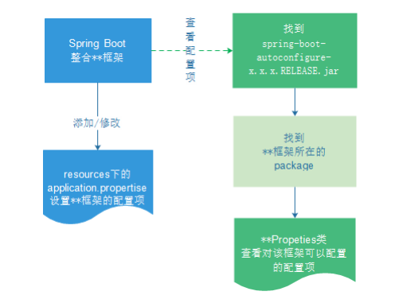

## 5. Spring Boot实践 ##

接下来，来看看如何用SpringBoot来整合SSM，在数据库中引入一张用户表`tb_user`和实体类`User`。
tb_user表
```sql
/*
Navicat MySQL Data Transfer

Source Server         : local3306
Source Server Version : 50622
Source Host           : localhost:3306
Source Database       : springboot_test

Target Server Type    : MYSQL
Target Server Version : 50622
File Encoding         : 65001

Date: 2019-04-14 18:39:07
*/

SET FOREIGN_KEY_CHECKS=0;

-- ----------------------------
-- Table structure for tb_user
-- ----------------------------
DROP TABLE IF EXISTS `tb_user`;
CREATE TABLE `tb_user` (
  `id` bigint(20) NOT NULL AUTO_INCREMENT,
  `user_name` varchar(100) DEFAULT NULL COMMENT '用户名',
  `password` varchar(100) DEFAULT NULL COMMENT '密码',
  `name` varchar(100) DEFAULT NULL COMMENT '姓名',
  `age` int(10) DEFAULT NULL COMMENT '年龄',
  `sex` tinyint(1) DEFAULT NULL COMMENT '性别，1男性，2女性',
  `birthday` date DEFAULT NULL COMMENT '出生日期',
  `note` varchar(255) DEFAULT NULL COMMENT '备注',
  `created` datetime DEFAULT NULL COMMENT '创建时间',
  `updated` datetime DEFAULT NULL COMMENT '更新时间',
  PRIMARY KEY (`id`),
  UNIQUE KEY `username` (`user_name`)
) ENGINE=InnoDB AUTO_INCREMENT=13 DEFAULT CHARSET=utf8;

-- ----------------------------
-- Records of tb_user
-- ----------------------------
INSERT INTO `tb_user` VALUES ('1', 'zhangsan', '123456', '张三', '30', '1', '1964-08-08', '张三同学在学Java', '2014-09-19 16:56:04', '2014-09-21 11:24:59');
INSERT INTO `tb_user` VALUES ('2', 'lisi', '123456', '李四', '21', '2', '1995-01-01', '李四同学在传智学Java', '2014-09-19 16:56:04', '2014-09-19 16:56:04');
INSERT INTO `tb_user` VALUES ('3', 'wangwu', '123456', '王五', '22', '2', '1994-01-01', '王五同学在学php', '2014-09-19 16:56:04', '2014-09-19 16:56:04');
INSERT INTO `tb_user` VALUES ('4', 'zhangliu', '123456', '张六', '20', '1', '1996-09-01', '张六同学在学Java', '2014-09-19 16:56:04', '2014-09-19 16:56:04');
INSERT INTO `tb_user` VALUES ('5', 'lina', '123456', '李娜', '28', '1', '1988-01-01', '李娜同学在学Java', '2014-09-19 16:56:04', '2014-09-19 16:56:04');
INSERT INTO `tb_user` VALUES ('6', 'lilei', '123456', '李雷', '23', '1', '1993-08-08', '李雷同学在学Java', '2014-09-20 11:41:15', '2014-09-20 11:41:15');
INSERT INTO `tb_user` VALUES ('7', 'hanmeimei', '123456', '韩梅梅', '24', '2', '1992-08-08', '韩梅梅同学在学php', '2014-09-20 11:41:15', '2014-09-20 11:41:15');
INSERT INTO `tb_user` VALUES ('8', 'itcast', '123456', '', '21', '2', '2008-07-08', '搞IT教育', '2014-09-20 11:41:15', '2014-09-20 11:41:15');
INSERT INTO `tb_user` VALUES ('9', 'heima', '123456', '', '18', '2', '2012-08-08', '是高端品牌', '2014-09-20 11:41:15', '2014-09-20 11:41:15');
INSERT INTO `tb_user` VALUES ('10', 'linus', '123456', '林纳斯', '45', '2', '1971-08-08', '林纳斯搞了linux又搞git', '2014-09-20 11:41:15', '2014-09-20 11:41:15');
INSERT INTO `tb_user` VALUES ('11', 'leijun', '123456', '雷布斯', '33', '2', '1983-08-08', '小爱同学；are you ok', '2014-09-20 11:41:15', '2014-09-20 11:41:15');
INSERT INTO `tb_user` VALUES ('12', 'madaye', '123456', '马大爷', '46', '2', '1980-08-08', '马大爷花呗可以不还吗', '2014-09-20 11:41:15', '2014-09-20 11:41:15');
```
创建 `User.java` 
```java
package tk.deriwotua.ssm.pojo;

import java.util.Date;

public class User {
    // id
    private Long id;
    // 用户名
    private String userName;
    // 密码
    private String password;
    // 姓名
    private String name;
    // 年龄
    private Integer age;
    // 性别，1男性，2女性
    private Integer sex;
    // 出生日期
    private Date birthday;
    // 创建时间
    private Date created;
    // 更新时间
    private Date updated;
    // 备注
    private String note;
    // getter和setter省略
}
```

### 5.1. Lombok ###
编写pojo时，经常需要编写构造函数和getter、setter方法，属性多的时候，就非常浪费时间，使用lombok插件可以解决这个问题
在IDEA中安装lombok插件；不安装插件在IDEA中使用lombok的注解虽然编译能通过，但是源码会报错。所以为了让IDEA更好的辨别lombok注解则才安装插件。

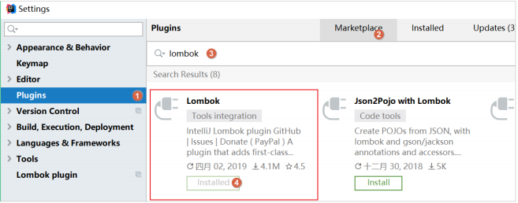

需要在maven工程中的 pom.xml 文件引入依赖
```xml
<dependency>
<groupId>org.projectlombok</groupId>
<artifactId>lombok</artifactId>
</dependency>
```
然后可以在Bean上使用
- `@Data` 自动提供`getter`和`setter`、`hashCode`、`equals`、`toString`等方法
- `@Getter`自动提供`getter`方法
- `@Setter`自动提供`setter`方法
- `@Slf4j`自动在`bean`中提供`log`变量，其实用的是`slf4j`的日志功能。

在javabean上加`@Data`，那么就可以省去`getter`和`setter`等方法的编写，`lombok`插件会自动生成。

### 5.2. 整合SpringMVC ###
虽然默认配置已经可以使用SpringMVC了，不过我们有时候需要进行自定义配置。可以在 application.yml 文件中配置日志级别控制
```yaml
logging:
    level:
        com.itheima: debug
        org.springframework: info
```

#### 5.2.1. 修改端口 ####
查看SpringBoot的全局属性可知，端口通过以下方式配置修改 application.yml 配置文件，添加如下配置
```yaml
# 映射端口
server:
    port: 80
```

重启服务后测试

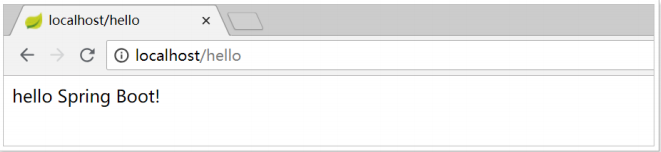

#### 5.2.2. 访问静态资源 ####
现在，项目是一个jar工程，那么就没有webapp，静态资源该放哪里呢？
回顾在上面看的源码，有一个叫做`ResourceProperties`的类，里面就定义了静态资源的默认查找路径
```java
@ConfigurationProperties(prefix = "spring.resources", ignoreUnknownFields = false)
public class ResourceProperties {

	private static final String[] CLASSPATH_RESOURCE_LOCATIONS = {
			"classpath:/META-INF/resources/", "classpath:/resources/",
			"classpath:/static/", "classpath:/public/" };

	/**
	 * Locations of static resources. Defaults to classpath:[/META-INF/resources/,
	 * /resources/, /static/, /public/].
	 */
	private String[] staticLocations = CLASSPATH_RESOURCE_LOCATIONS;
}
```
默认的静态资源路径为
- `classpath:/META-INF/resources/`
- `classpath:/resources/`
- `classpath:/static/`
- `classpath:/public`

只要静态资源放在这些目录中任何一个，SpringMVC都会自动处理。
习惯会把静态资源放在 `classpath:/static/ `目录下。创建目录 `static` ，把静态资源放置此目录下

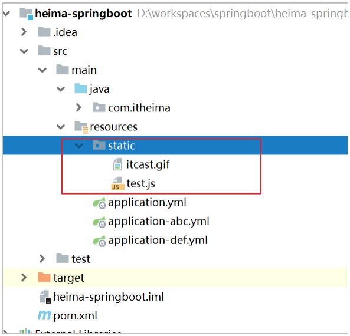

重启项目后测试

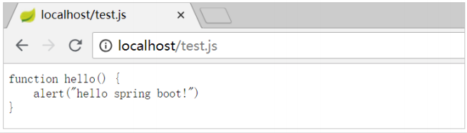

> 注意：如果访问图片时候没有显示；可以先将项目先clean再启动，或者创建 public、resources 文件夹，然后图片放置到public或resources中。

#### 5.2.3. 添加拦截器 ####
拦截器也是经常需要使用的，在SpringBoot中该如何配置呢？
拦截器不是一个普通属性，而是一个类，所以就要用到java配置方式了。在SpringBoot官方文档中有这么一段说明
> If you want to keep Spring Boot MVC features and you want to add additional MVC configuration(interceptors, formatters, view controllers, and other features), you can add your own @Configuration class of type WebMvcConfigurer but without @EnableWebMvc . If you wish to provide custom instances of RequestMappingHandlerMapping , RequestMappingHandlerAdapter , or ExceptionHandlerExceptionResolver , you can declare a WebMvcRegistrationsAdapter instance to provide such components. 
> If you want to take complete control of Spring MVC, you can add your own @Configuration annotated with @EnableWebMvc .

翻译
> 如果你想要保持Spring Boot 的一些默认MVC特征，同时又想自定义一些MVC配置（包括：拦截器，格式化器, 视图控制器、消息转换器 等等），你应该让一个类实现 `WebMvcConfigurer`，并且添加 `@Configuration` 注解，但是千万不要加 `@EnableWebMvc` 注解。如果你想要自定义 `HandlerMapping` 、 `HandlerAdapter` 、`ExceptionResolver` 等组件，你可以创建一个 `WebMvcRegistrationsAdapter` 实例 来提供以上组件。
> 如果你想要完全自定义SpringMVC，不保留SpringBoot提供的一切特征，你可以自己定义类并且添加`@Configuration` 注解和 `@EnableWebMvc` 注解

总结：通过实现 `WebMvcConfigurer` 并添加 `@Configuration` 注解来实现**自定义部分SpringMvc配置**。

创建 `MyInterceptor.java` 拦截器
```java
package tk.deriwotua.interceptor;

import lombok.extern.slf4j.Slf4j;
import org.springframework.web.servlet.HandlerInterceptor;
import org.springframework.web.servlet.ModelAndView;

import javax.servlet.http.HttpServletRequest;
import javax.servlet.http.HttpServletResponse;

/**
 *  @Slf4j 需要导入Lombok包
 */
@Slf4j
public class MyInterceptor implements HandlerInterceptor {
    @Override
    public boolean preHandle(HttpServletRequest request, HttpServletResponse response,
                             Object handler) throws Exception {
        log.debug("这是MyInterceptor拦截器的preHandle方法");
        return true;
    }
    @Override
    public void postHandle(HttpServletRequest request, HttpServletResponse response,
                           Object handler, ModelAndView modelAndView) throws Exception {
        log.debug("这是MyInterceptor拦截器的postHandle方法");
    }
    @Override
    public void afterCompletion(HttpServletRequest request, HttpServletResponse
            response, Object handler, Exception ex) throws Exception {
        log.debug("这是MyInterceptor拦截器的afterCompletion方法");
    }
}
```

定义配置类 `MvcConfig.java` 注册拦截器
```java
package tk.deriwotua.interceptor.config;

import org.springframework.context.annotation.Bean;
import org.springframework.context.annotation.Configuration;
import org.springframework.web.servlet.config.annotation.InterceptorRegistry;
import org.springframework.web.servlet.config.annotation.WebMvcConfigurer;
import tk.deriwotua.interceptor.MyInterceptor;

@Configuration
public class MvcConfig implements WebMvcConfigurer {
    /**
     * 将拦截器注册到spring ioc容器
     *
     * @return myInterceptor
     */
    @Bean
    public MyInterceptor myInterceptor() {
        return new MyInterceptor();
    }

    /**
     * 重写该方法；往拦截器链添加自定义拦截器
     *
     * @param registry 拦截器链
     */
    @Override
    public void addInterceptors(InterceptorRegistry registry) {
        //通过registry添加myInterceptor拦截器，并设置拦截器路径为 /*
        registry.addInterceptor(myInterceptor()).addPathPatterns("/*");
    }
}
```

接下来访问`http://localhost/hello` 并查看日志

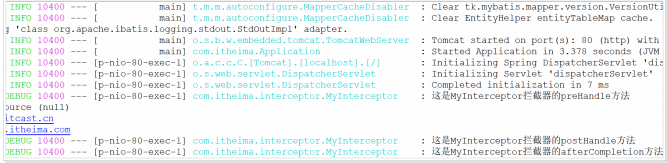

### 5.3. 整合jdbc和事务 ###
spring中的jdbc连接和事务是配置中的重要一环，在SpringBoot中该如何处理呢？
- 不需要处理，只要找到SpringBoot提供的启动器即可，在 `pom.xml` 文件中添加如下依赖
  ```xml
  <dependency>
      <groupId>org.springframework.boot</groupId>
      <artifactId>spring-boot-starter-jdbc</artifactId>
  </dependency>
  ```
- 当然，不要忘了数据库驱动，SpringBoot并不知道用的什么数据库，这里选择MySQL；同样的在 `pom.xml`文件中添加如下依赖
  ```xml
  <dependency>
      <groupId>mysql</groupId>
      <artifactId>mysql-connector-java</artifactId>
      <version>5.1.46</version>
  </dependency>
  ```
至于事务，SpringBoot中通过注解来控制。就是 `@Transactional` 使用的时候设置在对应的类或方法上即可。
创建 `UserService.java` 
```java
package tk.deriwotua.jdbc.service.impl;

import org.springframework.stereotype.Service;
import org.springframework.transaction.annotation.Transactional;
import tk.deriwotua.jdbc.service.UserService;
import User;

@Service
public class UserServiceImpl implements UserService {
    @Override
    public User queryById(Long id) {
        //根据id查询
        return new User();
    }

    @Override
    @Transactional
    public void saveUser(User user){
        System.out.println("新增用户...");
    }
}
```
### 5.4. 整合连接池 ###

其实，在刚才引入jdbc启动器的时候，SpringBoot已经自动引入了一个连接池

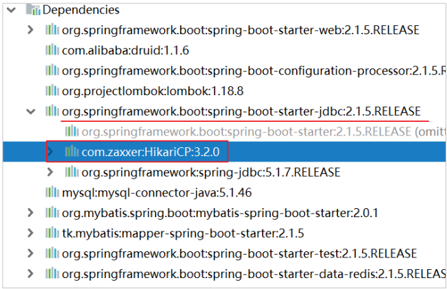

`HikariCP`应该是目前速度最快的连接池了，看看它与`c3p0`的对比

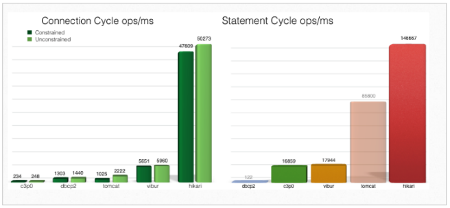

因此，只需要指定连接池参数即可；打开 `application.yml` 添加修改配置如下
```yaml
spring:
    datasource:
        driver-class-name: com.mysql.jdbc.Driver
        url: jdbc:mysql://localhost:3306/springboot_test
        username: root
        password: root
```
注意把 `JdbcConfig` 类中的druid的配置删除或注释

在配置完`hikari`数据库连接池后的 `application.yml` 文件
```yaml
jdbc:
  driverClassName: com.mysql.jdbc.Driver
  url: jdbc:mysql://127.0.0.1:3306/springboot_test
  username: root
  password: root

#\u6FC0\u6D3B\u914D\u7F6E\u6587\u4EF6;\u9700\u8981\u6307\u5B9A\u5176\u5B83\u7684\u914D\u7F6E\u6587\u4EF6\u540D\u79F0
spring:
  profiles:
    active: abc,def
  datasource:
    driver-class-name: com.mysql.jdbc.Driver
    url: jdbc:mysql://127.0.0.1:3306/springboot_test
    username: root
    password: root

#tomcat端口
server:
  port: 80
#日志记录级别
logging:
  level:
    tk.deriwotua: debug
    org.springframework: info
```
启动项目，访问`http://localhost/hello` ；查看后台输出，一样可以在HelloController中获取到datasource。

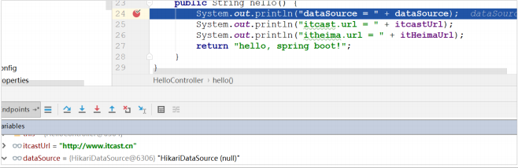

### 5.5. 整合mybatis ###
#### 5.5.1. mybatis ####

SpringBoot官方并没有提供Mybatis的启动器，不过Mybatis官网自己实现了。在项目的 `pom.xml` 文件中加入如下依赖
```xml
<!--mybatis -->
<dependency>
    <groupId>org.mybatis.spring.boot</groupId>
    <artifactId>mybatis-spring-boot-starter</artifactId>
    <version>2.0.1</version>
</dependency>
```
配置 `application.yml` ，常用配置如下
```yaml
# mybatis配置
mybatis:
    # 实体类别名包路径
    type-aliases-package: tk.deriwotua.pojo
    # 映射文件路径
    # mapper-locations: classpath:mappers/*.xml
    configuration:
        # 控制台输出执行sql
        log-impl: org.apache.ibatis.logging.stdout.StdOutImpl
```
配置Mapper扫描需要注意，这里没有配置mapper接口扫描包，因此需要给每一个Mapper接口添加 `@Mapper` 注解，才能被识别。
```java
@Mapper
public interface UserMapper {
}
```
或者，也可以不加注解，而是在启动类上添加扫描包注解(推荐)
```java
@SpringBootApplication
@MapperScan("tk.deriwotua.mybatis")
public class Application {
    public static void main(String[] args) {
        // 启动代码
        SpringApplication.run(Application.class, args);
    }
}
```
以下代码示例中，将采用@MapperScan扫描方式进行。
#### 5.5.2. 通用mapper ####

通用Mapper的作者也为自己的插件编写了启动器，我们直接引入即可。在项目的 pom.xml 文件中加入如下依赖
```xml
<!-- 通用mapper -->
<dependency>
    <groupId>tk.mybatis</groupId>
    <artifactId>mapper-spring-boot-starter</artifactId>
    <version>2.1.5</version>
</dependency>
```
- **注意：一旦引入了通用Mapper的启动器，会覆盖Mybatis官方启动器的功能，因此需要移除对官方Mybatis启动器的依赖。**

编写UserMapper无需任何配置就可以使用了。如果有特殊需要，可以到通用mapper官网查看：`https://github.com/abel533/Mapper/wiki/3.config`
```java
package tk.deriwotua.mybatis;
import tk.deriwotua.pojo.User;
import tk.mybatis.mapper.common.Mapper;

public interface UserMapper extends Mapper<User> {
}
```

把启动类上的`@MapperScan`注解修改为通用mapper中自带的

```java
package tk.deriwotua;

import org.springframework.boot.SpringApplication;
import org.springframework.boot.autoconfigure.SpringBootApplication;

@SpringBootApplication
// mybatis官方starter提供的MapperSan
//@org.mybatis.spring.annotation.MapperScan("tk.deriwotua.mybatis")
// 如果引入github通用mapper就需要使用通用mapper实现的MapperScan
@tk.mybatis.spring.annotation.MapperScan("tk.deriwotua.mybatis")
public class DeriwotuaApplication {
    public static void main(String[] args) {
        SpringApplication.run(DeriwotuaApplication.class, args);
    }
}
```

在`User`实体类上加`JPA`注解
```java
@Data
@Table(name = "tb_user")
public class User{
    // id
    @Id
    //开启主键自动回填
    @KeySql(useGeneratedKeys = true)
    private Long id;
    // 用户名
    private String userName;
    // 密码
    private String password;
    // 姓名
    private String name;
    // 年龄
    private Integer age;
    // 性别，1男性，2女性
    private Integer sex;
    // 出生日期
    private Date birthday;
    // 创建时间
    private Date created;
    // 更新时间
    private Date updated;
    // 备注
    private String note;
}
```

对 UserService 的代码进行简单改造
```java
@Service
public class UserService {
    @Autowired
    private UserMapper userMapper;
    public User queryById(Long id){
        //根据id查询
        return userMapper.selectByPrimaryKey(id);
    }
    @Transactional
    public void saveUser(User user){
        System.out.println("新增用户...");
        userMapper.insertSelective(user);
    }
}
```
### 5.6. 启动测试 ###
将 HelloController 进行简单改造
```java
@RestController
public class HelloController {
    @Autowired
    private UserService userService;
    /**
    * 根据id获取用户
    * @param id 用户id
    * @return 用户
    */
    @GetMapping("/user/{id}")
    public User queryById(@PathVariable Long id){
        return userService.queryById(id);
    }
}
```
启动项目，查看

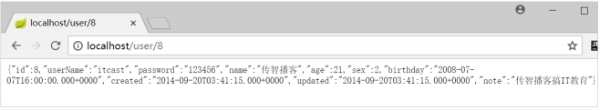

### 5.7. Junit测试 ###
在springboot项目中如果要使用Junit进行单元测试，则需要添加如下的依赖
```xml
<dependency>
    <groupId>org.springframework.boot</groupId>
    <artifactId>spring-boot-starter-test</artifactId>
</dependency>
```
在测试包下编写测试类在测试类上面必须要添加 `@SpringBootTest` 注解。
```java
package tk.deriwotua.service;

import org.junit.Test;
import org.junit.runner.RunWith;
import org.springframework.beans.factory.annotation.Autowired;
import org.springframework.boot.test.context.SpringBootTest;
import org.springframework.test.context.junit4.SpringRunner;
import tk.deriwotua.jdbc.service.UserService;
import tk.deriwotua.pojo.User;

import java.util.Date;

@RunWith(SpringRunner.class)
@SpringBootTest
public class UserServiceTest {
    @Autowired
    private UserService userService;

    @Test
    public void queryById() {
        User user = userService.queryById(1L);
        System.out.println("user = " + user);
    }

    @Test
    public void saveUser() {
        User user = new User();
        user.setUserName("test");
        user.setName("test");
        user.setPassword("123456");
        user.setSex(1);
        user.setAge(20);
        user.setCreated(new Date());
        userService.saveUser(user);
    }
}
```

### 5.8. 整合Redis ###
在 `pom.xml` 文件中添加如下依赖
```xml
<dependency>
    <groupId>org.springframework.boot</groupId>
    <artifactId>spring-boot-starter-data-redis</artifactId>
</dependency>
```
配置 `application.yml` 文件
```yaml
spring:
    redis:
        host: localhost
        port: 6379
```
编写测试代码
```java
package tk.deriwotua.redis;

import org.junit.Test;
import org.junit.runner.RunWith;
import org.springframework.beans.factory.annotation.Autowired;
import org.springframework.boot.test.context.SpringBootTest;
import org.springframework.data.redis.core.RedisTemplate;
import org.springframework.test.context.junit4.SpringRunner;

import java.util.List;
import java.util.Set;

@RunWith(SpringRunner.class)
@SpringBootTest
public class RedisTest {
    @Autowired
    private RedisTemplate redisTemplate;

    @Test
    public void test() {
        //string字符串
        //redisTemplate.opsForValue().set("str", "heima");
        redisTemplate.boundValueOps("str").set("deriwotua");
        System.out.println("str = " + redisTemplate.opsForValue().get("str"));
        //hash散列
        redisTemplate.boundHashOps("h_key").put("name", "de");
        redisTemplate.boundHashOps("h_key").put("age", 13);
        //获取所有域对应的值
        Set set = redisTemplate.boundHashOps("h_key").keys();
        System.out.println("hash散列所有的域：" + set);
        List list = redisTemplate.boundHashOps("h_key").values();
        System.out.println("hash散列所有的域值：" + list);
        //list列表
        redisTemplate.boundListOps("l_key").leftPush("c");
        redisTemplate.boundListOps("l_key").leftPush("b");
        redisTemplate.boundListOps("l_key").leftPush("a");
        list = redisTemplate.boundListOps("l_key").range(0, -1);
        System.out.println("列表的值：" + list);
        //set集合
        redisTemplate.boundSetOps("set_key").add("a", "b", "c");
        set = redisTemplate.boundSetOps("set_key").members();
        System.out.println("集合的元素：" + set);
        //sorted set有序集合
        redisTemplate.boundZSetOps("z_key").add("a", 30);
        redisTemplate.boundZSetOps("z_key").add("b", 20);
        redisTemplate.boundZSetOps("z_key").add("c", 10);
        set = redisTemplate.boundZSetOps("z_key").range(0, -1);
        System.out.println("有序集合的元素：" + set);
    }
}
```

运行上述代码测试

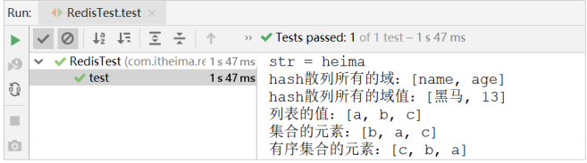

## 6. Spring Boot项目部署 ##
### 6.1. 项目打包 ###
添加项目的`pom.xml`插件；在`pom.xml`要显式的加入插件`spring-boot-maven-plugin`，否则无法产生 `jar` 清单文件，导致打出来的 `jar` 无法使用命令运行
```xml
<build>
    <plugins>
        <!-- 打jar包时如果不配置该插件，打出来的jar包没有清单文件 -->
        <plugin>
            <groupId>org.springframework.boot</groupId>
            <artifactId>spring-boot-maven-plugin</artifactId>
        </plugin>
    </plugins>
</build>
```

使用maven的命令`package`打包

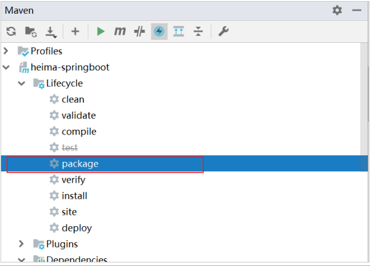

之后在项目下的 target 目录中将有如下jar包

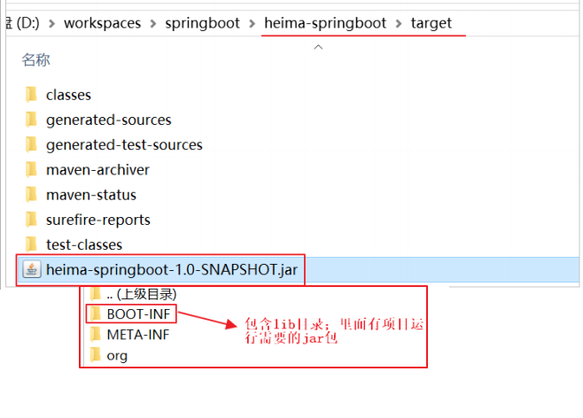

> 注意在查看打出的 jar 的时候，将发现 jar 包里面包含 jar 包；这样的包称为 `fatJar`（肥包）

### 6.2. 运行 ###
运行打出来的包,使用命令 `java –jar 包全名 `或者写一个 bat 文件，里面包含 `java –jar 包全名`这样就可以双击启动应用。然后可使用浏览器访问`http://localhost/user/8`
```shell script
java -jar springboot-quickstart-1.0-SNAPSHOT.jar
```

## 7. 附录—插件安装 ##
在应用spring boot工程的时候一般情况下都需要创建启动引导类`Application.java`和`application.yml`配置文件，而且内容都是一样的；为了便捷可以安装一个IDEA的插件 `JBLSpringBootAppGen` 在项目上右击之后可以自动生成启动引导类`Application.java`和`application.yml`配置文件。

### 7.1. 安装插件 ###
打开IDEA的设置界面按 `ctrl+alt+S` 之后在插件选项中搜索SpringBoot，安装 `JBLSpringBootAppGen`

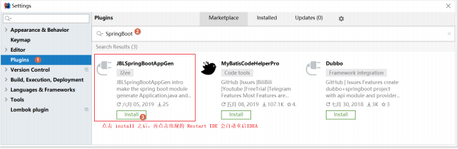

### 7.2. 应用插件 ###

在IDEA中任意一个`maven项目`或`src目录`上 `右击`，选择 `JBLSpringBootAppGen` 即可。

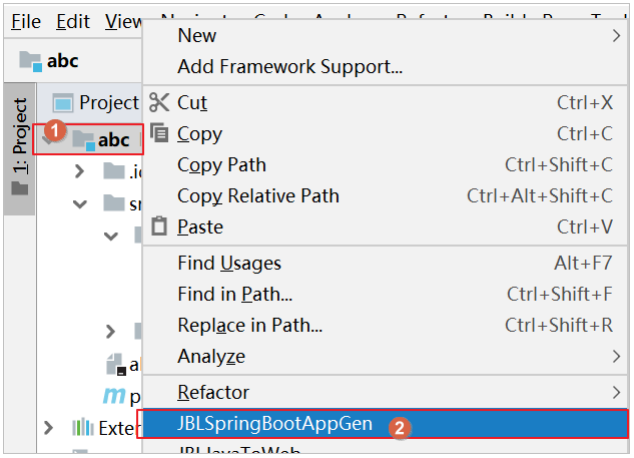

在如下的界面中输入 启动引导类的名称并根据需要勾选是否要生成application.yml配置文件。

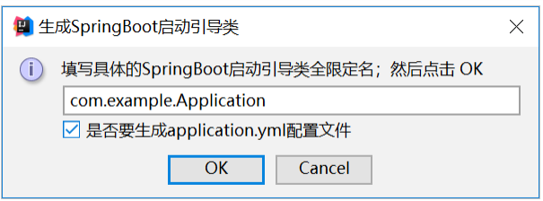

点击 OK 之后，在项目中将发现如下内容

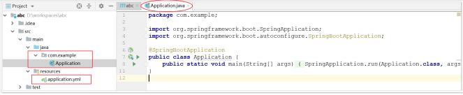

## 8. 附录 ##

[springboot课件](src/main/resources/static/springboot课件.docx)