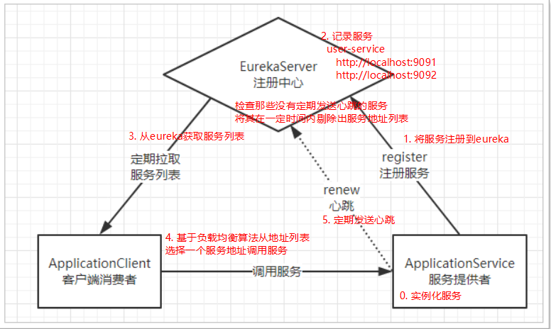
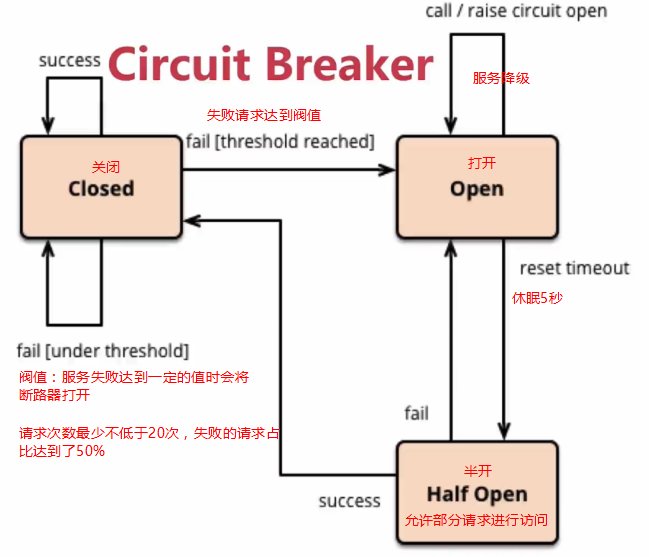

[TOC]

## 0. 学习目标
> 能够使用RestTemplate发送请求
>
> 能够说出SpringCloud的作用
>
> 能够搭建Eureka注册中心
>
> 能够使用Robbin负载均衡
>
> 能够使用Hystrix熔断器


## 1. 系统架构演变概述

随着互联网的发展，网站应用的规模不断扩大。需求的激增，带来的是技术上的压力。系统架构也因此也不断的演进、升级、迭代。从`单一应用`，到`垂直拆分`，到`分布式服务`，到S`OA`，以及现在火热的`微服务架构`，还有在Google带领下来势汹涌的`Service Mesh`。到底是该乘坐微服务的船只驶向远方，还是偏安逸得过且过？

回顾历史，看一看系统架构演变的历程；把握现在，学习现在最火的技术架构；展望未来，争取成为一名优秀的Java工程师。

**目标**：了解项目架构的演变历程

### 1.1. 集中式架构
当网站流量很小时，只需一个应用，将所有功能都部署在一起，以减少部署节点和成本


优点
- 系统开发速度快
- 维护成本低
- 适用于并发要求较低的系统

缺点
- 代码耦合度高，后期维护困难
- 无法针对不同模块进行针对性优化
- 无法水平扩展
- 单点容错率低，并发能力差

### 1.2. 垂直拆分
当访问量逐渐增大，单一应用无法满足需求，此时为了应对更高的并发和业务需求，我们根据业务功能对系统进行拆分


优点
- 系统拆分实现了流量分担，解决了并发问题
- 可以针对不同模块进行优化
- 方便水平扩展，负载均衡，容错率提高

缺点
- 系统间相互独立，会有很多重复开发工作，影响开发效率

### 1.3. 分布式服务
当垂直应用越来越多，应用之间交互不可避免，将核心业务抽取出来，作为独立的服务，逐渐形成稳定的服务中心，使前端应用能更快速的响应多变的市场需求。


优点
- 将基础服务进行了抽取，系统间相互调用，提高了代码复用和开发效率

缺点
- 系统间耦合度变高，调用关系错综复杂，难以维护

### 1.4. 面向服务架构（SOA）
SOA（Service Oriented Architecture）面向服务的架构：它是一种设计方法，其中包含多个服务， 服务之间通过相互依赖最终提供一系列的功能。一个服务 通常以独立的形式存在与操作系统进程中。各个服务之间 通过网络调用。


> ESB（企业服务总线），简单 来说 ESB 就是一根管道，用来连接各个服务节点。为了集 成不同系统，不同协  议的服务，ESB 做了消息的转化解释和路由工作，让不同的服务互联互通。

SOA缺点：每个供应商提供的ESB产品有偏差，自身实现较为复杂；应用服务粒度较大，ESB集成整合所有服务和协议、数据转换使得运维、测试部署困难。所有服务都通过一个通路通信，直接降低了通信速度。


### 1.5. 微服务架构
微服务架构是使用一套小服务来开发单个应用的方式或途径，每个服务基于单一业务能力构建，运行在自己的进程中，并使用轻量级机制通信，通常是`HTTP API`，并能够通过**自动化部署机制来独立部署**。这些服务可以使用不同的编程语言实现，以及不同数据存储技术，并保持最低限度的集中式管理。


> API Gateway网关是一个服务器，是系统的唯一入口。为每个客户端提供一个定制的API。API网关核心是，所有的客户端和消费端都通过统一的网关接入微服务，在网关层处理所有的非业务功能。如它还可以具有其它职 责，如`身份验证`、`监控`、`负载均衡`、`缓存`、`请求分片与管理`、`静态响应处理`。通常，网关提供`RESTful/HTTP`的方式访问服务。而服务端通过服务注册中心进行服务注册和管理。

微服务的特点
- 单一职责：微服务中每一个服务都对应唯一的业务能力，做到单一职责
- 服务粒度小：微服务的服务拆分粒度很小，例如一个用户管理就可以作为一个服务。每个服务虽小，但“五脏俱全”。
- 面向服务：面向服务是说每个服务都要对外暴露Rest风格服务接口API。并不关心服务的技术实现，做到与平台和语言无关，也不限定用什么技术实现，只要提供Rest的接口即可。
- 自治：自治是说服务间互相独立，互不干扰
  - 团队独立：每个服务都是一个独立的开发团队，人数不能过多。
  - 技术独立：因为是面向服务，提供Rest接口，使用什么技术没有别人干涉
  - 前后端分离：采用前后端分离开发，提供统一Rest接口，后端不用再为PC、移动端开发不同接口
  - 数据库分离：每个服务都使用自己的数据源
  - 部署独立，服务间虽然有调用，但要做到服务重启不影响其它服务。有利于持续集成和持续交付。每个服务都是独立的组件，可复用，可替换，降低耦合，易维护

微服务架构与SOA都是对系统进行拆分；微服务架构基于SOA思想，可以把微服务当做去除了ESB的SOA。ESB是SOA架构中的中心总线，设计图形应该是星形的，而微服务是去中心化的分布式软件架构。两者比较类似，但其实也有一些差别

功能    |   SOA    |    微服务
-----|------|---------
组件大小  | 大块业务逻辑       |      单独任务或小块业务逻辑
耦合    |   通常松耦合      |        总是松耦合
管理    |   着重中央管理     |       着重分散管理
目标    |   确保应用能够交互操作 |   易维护、易扩展、更轻量级的交互


**目标**：了解SOA与微服务架构的区别以及说出微服务架构的特点
**分析**：SOA使用了ESB组件的面向服务架构：ESB自身实现复杂；应用服务粒度较大，所有服务之间的通信都经过ESB会降低通信速度；部署、测试ESB比较麻烦。

**小结微服务架构**：是一套使用小服务或者单一业务来开发单个应用的方式或途径。

与使用ESB的SOA架构的区别：微服务架构没有使用ESB，有服务治理注册中心；业务粒度小。

## 2. 服务调用方式
### 2.1. RPC和HTTP

无论是微服务还是SOA，都面临着服务间的远程调用。那么服务间的远程调用方式有哪些呢？
常见的远程调用方式有以下2种
- `RPC`：`Remote Produce Call`远程过程调用，`RPC`基于`Socket`，工作在`会话层`。自定义数据格式，速度快，效率高。早期的`webservice`，现在热门的`dubbo`，都是`RPC`的典型代表
- `Http`：http其实是一种网络传输协议，基于`TCP`，工作在`应用层`，规定了数据传输的格式。现在客户端浏览器与服务端通信基本都是采用Http协议，也可以用来进行远程服务调用。缺点是消息封装臃肿，优势是对服务的提供和调用方没有任何技术限定，自由灵活，更符合微服务理念。现在热门的Rest风格，就可以通过http协议来实现。

区别：RPC的机制是根据语言的API（language API）来定义的，而不是根据基于网络的应用来定义的。

如果你们公司全部采用Java技术栈，那么使用Dubbo作为微服务架构是一个不错的选择。

相反，如果公司的技术栈多样化，而且你更青睐Spring家族，那么Spring Cloud搭建微服务是不二之选。在项目中，会选择Spring Cloud套件，因此会使用Http方式来实现服务间调用。


### 2.2. Http客户端工具
既然微服务选择了Http，那么就需要考虑自己来实现对请求和响应的处理。不过开源世界已经有很多的http客户端工具，能够帮助我们做这些事情，例如
- `HttpClient`
- `OKHttp`
- `URLConnection`
不过这些不同的客户端，API各不相同。而Spring也有对http的客户端进行封装，提供了工具类叫`RestTemplate`。

### 2.3. Spring的RestTemplate
Spring提供了一个`RestTemplate`模板工具类，对**基于Http的客户端进行了封装，并且实现了对象与json的序列化和反序列化**，非常方便。`RestTemplate`并没有限定Http
的客户端类型，而是进行了抽象，目前常用的3种都有支持
- `HttpClient`
- `OkHttp`
- JDK原生的`URLConnection`（默认的）

创建`springcloud-quickstart` maven项目
- `pom.xml` 文件配置
  ```xml
  <?xml version="1.0" encoding="UTF-8"?>
  <project xmlns="http://maven.apache.org/POM/4.0.0"
           xmlns:xsi="http://www.w3.org/2001/XMLSchema-instance"
           xsi:schemaLocation="http://maven.apache.org/POM/4.0.0 http://maven.apache.org/xsd/maven-4.0.0.xsd">
      <parent>
          <groupId>org.springframework.boot</groupId>
          <artifactId>spring-boot-starter-parent</artifactId>
          <version>2.1.5.RELEASE</version>
      </parent>
      <modelVersion>4.0.0</modelVersion>
  
      <groupId>tk.deriwotua</groupId>
      <artifactId>springcloud-quickstart</artifactId>
      <version>1.0-SNAPSHOT</version>
  
      <properties>
          <java.version>1.8</java.version>
      </properties>
  
      <dependencies>
          <dependency>
              <groupId>org.springframework.boot</groupId>
              <artifactId>spring-boot-starter</artifactId>
          </dependency>
          <dependency>
              <groupId>org.springframework.boot</groupId>
              <artifactId>spring-boot-starter-web</artifactId>
          </dependency>
          <dependency>
              <groupId>org.springframework.boot</groupId>
              <artifactId>spring-boot-starter-test</artifactId>
          </dependency>
          <dependency>
              <groupId>org.projectlombok</groupId>
              <artifactId>lombok</artifactId>
          </dependency>
  
          <dependency>
              <groupId>com.alibaba</groupId>
              <artifactId>fastjson</artifactId>
              <version>1.2.56</version>
          </dependency>
      </dependencies>
  </project>
  ```
- 启动类 启动类中注册一个 `RestTemplate` 对象
  ```java
  package tk.deriwotua;
  
  import org.springframework.boot.SpringApplication;
  import org.springframework.boot.autoconfigure.SpringBootApplication;
  import org.springframework.context.annotation.Bean;
  import org.springframework.web.client.RestTemplate;
  
  @SpringBootApplication
  public class HttpDemoApplication {
      public static void main(String[] args) {
          SpringApplication.run(HttpDemoApplication.class, args);
      }
      
      // 注册restTemplate
      @Bean
      public RestTemplate restTemplate() {
          return new RestTemplate();
      }
  }
  ```
- 定义Controller访问接口
  ```java
  package tk.deriwotua.controller;
  
  import com.alibaba.fastjson.JSONObject;
  import org.springframework.web.bind.annotation.GetMapping;
  import org.springframework.web.bind.annotation.PathVariable;
  import org.springframework.web.bind.annotation.RequestMapping;
  import org.springframework.web.bind.annotation.RestController;
  import tk.deriwotua.pojo.User;
  
  import java.util.Date;
  
  @RestController
  @RequestMapping("/user")
  public class UserController {
  
      @GetMapping("/{id}")
      public String getUser(@PathVariable String id){
          User user = new User();
          user.setId(Long.valueOf(id));
          user.setUserName("userName");
          user.setPassword("password");
          user.setName("name");
          user.setAge(18);
          user.setSex(2);
          user.setBirthday(new Date());
          user.setNote("note");
          user.setCreated(new Date());
          user.setUpdated(new Date());
  
          return JSONObject.toJSONString(user);
      }
  
  }
  //---------------------------------
  package tk.deriwotua.pojo;
  
  import lombok.Data;
  
  import java.util.Date;
  
  @Data
  public class User {
      private Long id;
      // 用户名
      private String userName;
      // 密码
      private String password;
      // 姓名
      private String name;
      // 年龄
      private Integer age;
      // 性别，1男性，2女性
      private Integer sex;
      // 出生日期
      private Date birthday;
      // 创建时间
      private Date created;
      // 更新时间
      private Date updated;
      // 备注
      private String note;
  
  }
  ```  
  
- 启动springboot项目，在项目中的测试类中直接 `@Autowired` 注入：
  ```java
  package tk.deriwotua;
  
  import tk.deriwotua.pojo.User;
  import org.junit.Test;
  import org.junit.runner.RunWith;
  import org.springframework.beans.factory.annotation.Autowired;
  import org.springframework.boot.test.context.SpringBootTest;
  import org.springframework.test.context.junit4.SpringRunner;
  import org.springframework.web.client.RestTemplate;
  
  @RunWith(SpringRunner.class)
  @SpringBootTest
  public class RestTemplateTest {
  
      @Autowired
      private RestTemplate restTemplate;
  
      @Test
      public void test(){
          String url = "http://localhost:8080/user/8";
          //restTemplate可以对json格式字符串进行反序列化
          User user = restTemplate.getForObject(url, User.class);
          System.out.println(user);
      }
  }
  ```


- 通过`org.springframework.web.client.RestTemplate.getForObject(java.lang.String, java.lang.Class<T>, java.lang.Object...)`方法，传递url地址及实体类的字节码，RestTemplate会自动发起请求，接收响应，并且帮我们对响应结果进行反序列化。

```text
2020-08-01 15:34:28.079  INFO 6768 --- [           main] tk.deriwotua.RestTemplateTest            : Started RestTemplateTest in 4.651 seconds (JVM running for 6.542)
User(id=8, userName=userName, password=password, name=name, age=18, sex=2, birthday=Sat Aug 01 15:34:28 CST 2020, created=Sat Aug 01 15:34:28 CST 2020, updated=Sat Aug 01 15:34:28 CST 2020, note=note)
2020-08-01 15:34:49.078  INFO 6768 --- [       Thread-1] o.s.s.concurrent.ThreadPoolTaskExecutor  : Shutting down ExecutorService 'applicationTaskExecutor'
```

了解完Http客户端工具，接下来就可以正式学习微服务了。

## 4. 初识Spring Cloud
微服务是一种架构方式，最终肯定需要技术架构去实施。
微服务的实现方式很多，但是最火的莫过于Spring Cloud了。为什么？
- 后台硬：作为Spring家族的一员，有整个Spring全家桶靠山，背景十分强大。
- 技术强：Spring作为Java领域的前辈，可以说是功力深厚。有强力的技术团队支撑，一般人还真比不了
- 群众基础好：可以说大多数程序员的成长都伴随着Spring框架，试问：现在有几家公司开发不用Spring？Spring Cloud与Spring的各个框架无缝整合，对大家来说一切都是熟悉的配方，熟悉的味道。
- 使用方便：相信大家都体会到了SpringBoot给我们开发带来的便利，而Spring Cloud完全支持Spring Boot的开发，用很少的配置就能完成微服务框架的搭建

### 4.1. 简介
> Spring Cloud整合的组件和版本特征

Spring Cloud是Spring旗下的项目之一，官网地址：`http://projects.spring.io/spring-cloud/`
Spring最擅长的就是集成，把世界上最好的框架拿过来，集成到自己的项目中。

Spring Cloud也是一样，它将现在非常流行的一些技术整合到一起，实现了诸如：`配置管理`，`服务发现`，`智能路由`，`负载均衡`，`熔断器`，`控制总线`，`集群状态`等功能；协调分布式环境中各个系统，为各类服务提供模板性配置。其主要涉及的组件包括
- `Eureka`：注册中心
- `Zuul`、`Gateway`：服务网关
- `Ribbon`：负载均衡
- `Feign`：服务调用
- `Hystrix`或`Resilience4j`：熔断器

在有需要的时候项目添加对于的启动器依赖即可。以上只是其中一部分，架构图


### 4.2. 版本
Spring Cloud不是一个组件，而是许多组件的集合；它的版本命名比较特殊，是以A到Z的为首字母的一些单词（其实是伦敦地铁站的名字）组成：


在项目中，使用最新稳定的Greenwich版本。

## 5. 微服务场景模拟
首先，需要模拟一个服务调用的场景。方便后面学习微服务架构
### 5.1. 创建父工程
微服务中需要同时创建多个项目，为了方便课堂演示，先创建一个父工程，然后后续的工程都以这个工程为父，实现maven的聚合。这样可以在一个窗口看到所有工程，方便讲解。在实际开发中，**每个微服务可独立一个工程**。

创建工程 `springcloud-parent` 项目
- 然后将 pom.xml 修改成如下
  ```xml
  <?xml version="1.0" encoding="UTF-8"?>
  <project xmlns="http://maven.apache.org/POM/4.0.0"
           xmlns:xsi="http://www.w3.org/2001/XMLSchema-instance"
           xsi:schemaLocation="http://maven.apache.org/POM/4.0.0 http://maven.apache.org/xsd/maven-4.0.0.xsd">
      <parent>
          <groupId>org.springframework.boot</groupId>
          <artifactId>spring-boot-starter-parent</artifactId>
          <version>2.1.5.RELEASE</version>
          <relativePath/>
      </parent>
      <modelVersion>4.0.0</modelVersion>
  
      <groupId>tk.deriwotua</groupId>
      <artifactId>springcloud-parent</artifactId>
      <version>1.0-SNAPSHOT</version>
  
      <properties>
          <java.version>1.8</java.version>
          <spring-cloud.version>Greenwich.SR1</spring-cloud.version>
          <mapper.starter.version>2.1.5</mapper.starter.version>
          <mysql.version>5.1.46</mysql.version>
      </properties>
  
      <dependencyManagement>
          <dependencies>
              <!-- springCloud -->
              <dependency>
                  <groupId>org.springframework.cloud</groupId>
                  <artifactId>spring-cloud-dependencies</artifactId>
                  <version>${spring-cloud.version}</version>
                  <type>pom</type>
                  <!--`scope` 的import可以继承 `spring-cloud-dependencies` 工程中的依赖-->
                  <scope>import</scope>
              </dependency>
              <!-- 通用Mapper启动器 -->
              <dependency>
                  <groupId>tk.mybatis</groupId>
                  <artifactId>mapper-spring-boot-starter</artifactId>
                  <version>${mapper.starter.version}</version>
              </dependency>
              <!-- mysql驱动 -->
              <dependency>
                  <groupId>mysql</groupId>
                  <artifactId>mysql-connector-java</artifactId>
                  <version>${mysql.version}</version>
              </dependency>
          </dependencies>
      </dependencyManagement>
  
      <dependencies>
          <dependency>
              <groupId>org.projectlombok</groupId>
              <artifactId>lombok</artifactId>
          </dependency>
      </dependencies>
  
      <build>
          <plugins>
              <plugin>
                  <groupId>org.springframework.boot</groupId>
                  <artifactId>spring-boot-maven-plugin</artifactId>
              </plugin>
          </plugins>
      </build>
  </project>
  ```
这里已经对大部分要用到的依赖的版本进行了管理，方便后续使用


### 5.2. 服务提供者user-service工程
新建一个`user-service`子模块，对外提供查询用户的服务。
### 5.2.1. 创建module
选中父工程 `springcloud-parent`


填写module信息


注意，子模块要在父工程的下级目录(并不一定非要在，主要看module配置)


创建后在 `springcloud-parent` 的 `pom.xml`文件中会自动加入模块信息
```xml
<?xml version="1.0" encoding="UTF-8"?>
<project xmlns="http://maven.apache.org/POM/4.0.0"
         xmlns:xsi="http://www.w3.org/2001/XMLSchema-instance"
         xsi:schemaLocation="http://maven.apache.org/POM/4.0.0 http://maven.apache.org/xsd/maven-4.0.0.xsd">
    <parent>
        <groupId>org.springframework.boot</groupId>
        <artifactId>spring-boot-starter-parent</artifactId>
        <version>2.1.5.RELEASE</version>
        <relativePath/>
    </parent>
    <modelVersion>4.0.0</modelVersion>

    <groupId>tk.deriwotua</groupId>
    <artifactId>springcloud-parent</artifactId>
    <packaging>pom</packaging>
    <version>1.0-SNAPSHOT</version>
    <modules>
        <module>user-service</module>
    </modules>
    <!--..省略若干..-->
</project>
```

且子模块 `user-service`的`pom.xml`会自动依赖 `springcloud-parent` maven相关知识点
```xml
<?xml version="1.0" encoding="UTF-8"?>
<project xmlns="http://maven.apache.org/POM/4.0.0"
         xmlns:xsi="http://www.w3.org/2001/XMLSchema-instance"
         xsi:schemaLocation="http://maven.apache.org/POM/4.0.0 http://maven.apache.org/xsd/maven-4.0.0.xsd">
    <parent>
        <artifactId>springcloud-parent</artifactId>
        <groupId>tk.deriwotua</groupId>
        <version>1.0-SNAPSHOT</version>
    </parent>
    <modelVersion>4.0.0</modelVersion>

    <artifactId>user-service</artifactId>

</project>
```

### 5.2.2. `user-service`添加依赖
`pom.xml` 文件中的内容如下
```xml
<?xml version="1.0" encoding="UTF-8"?>
<project xmlns="http://maven.apache.org/POM/4.0.0"
         xmlns:xsi="http://www.w3.org/2001/XMLSchema-instance"
         xsi:schemaLocation="http://maven.apache.org/POM/4.0.0 http://maven.apache.org/xsd/maven-4.0.0.xsd">
    <parent>
        <artifactId>springcloud-parent</artifactId>
        <groupId>tk.deriwotua</groupId>
        <version>1.0-SNAPSHOT</version>
    </parent>
    <modelVersion>4.0.0</modelVersion>

    <artifactId>user-service</artifactId>

    <dependencies>
        <dependency>
            <groupId>org.springframework.boot</groupId>
            <artifactId>spring-boot-starter-web</artifactId>
        </dependency>
        <dependency>
            <groupId>mysql</groupId>
            <artifactId>mysql-connector-java</artifactId>
        </dependency>
        <!-- 通用Mapper启动器 -->
        <dependency>
            <groupId>tk.mybatis</groupId>
            <artifactId>mapper-spring-boot-starter</artifactId>
        </dependency>
    </dependencies>
</project>
```

项目结构


### 5.2.3. 编写配置文件
创建 `application.yml` 属性文件,这里采用了`yaml`语法，`而不是properties`
```yaml
server:
  port: 9091
spring:
  datasource:
    driver-class-name: com.mysql.jdbc.Driver
    url: jdbc:mysql://localhost:3306/springcloud
    username: root
    password: root
mybatis:
  type-aliases-package: tk.deriwotua.user.pojo
```

使用`mysql`图形界面工具创建 `springcloud` 数据库，
```sql
/*
Navicat MySQL Data Transfer

Source Server         : local3306
Source Server Version : 50622
Source Host           : localhost:3306
Source Database       : springboot_test

Target Server Type    : MYSQL
Target Server Version : 50622
File Encoding         : 65001

Date: 2019-04-14 18:39:07
*/

SET FOREIGN_KEY_CHECKS=0;

-- ----------------------------
-- Table structure for tb_user
-- ----------------------------
DROP TABLE IF EXISTS `tb_user`;
CREATE TABLE `tb_user` (
  `id` bigint(20) NOT NULL AUTO_INCREMENT,
  `user_name` varchar(100) DEFAULT NULL COMMENT '用户名',
  `password` varchar(100) DEFAULT NULL COMMENT '密码',
  `name` varchar(100) DEFAULT NULL COMMENT '姓名',
  `age` int(10) DEFAULT NULL COMMENT '年龄',
  `sex` tinyint(1) DEFAULT NULL COMMENT '性别，1男性，2女性',
  `birthday` date DEFAULT NULL COMMENT '出生日期',
  `note` varchar(255) DEFAULT NULL COMMENT '备注',
  `created` datetime DEFAULT NULL COMMENT '创建时间',
  `updated` datetime DEFAULT NULL COMMENT '更新时间',
  PRIMARY KEY (`id`),
  UNIQUE KEY `username` (`user_name`)
) ENGINE=InnoDB AUTO_INCREMENT=13 DEFAULT CHARSET=utf8;

-- ----------------------------
-- Records of tb_user
-- ----------------------------
INSERT INTO `tb_user` VALUES ('1', 'zhangsan', '123456', '张三', '30', '1', '1964-08-08', '张三同学在学Java', '2014-09-19 16:56:04', '2014-09-21 11:24:59');
INSERT INTO `tb_user` VALUES ('2', 'lisi', '123456', '李四', '21', '2', '1995-01-01', '李四同学在学Java', '2014-09-19 16:56:04', '2014-09-19 16:56:04');
INSERT INTO `tb_user` VALUES ('3', 'wangwu', '123456', '王五', '22', '2', '1994-01-01', '王五同学在学php', '2014-09-19 16:56:04', '2014-09-19 16:56:04');
INSERT INTO `tb_user` VALUES ('4', 'zhangliu', '123456', '张六', '20', '1', '1996-09-01', '张六同学在学Java', '2014-09-19 16:56:04', '2014-09-19 16:56:04');
INSERT INTO `tb_user` VALUES ('5', 'lina', '123456', '李娜', '28', '1', '1988-01-01', '李娜同学在学Java', '2014-09-19 16:56:04', '2014-09-19 16:56:04');
INSERT INTO `tb_user` VALUES ('6', 'lilei', '123456', '李雷', '23', '1', '1993-08-08', '李雷同学在学Java', '2014-09-20 11:41:15', '2014-09-20 11:41:15');
INSERT INTO `tb_user` VALUES ('7', 'hanmeimei', '123456', '韩梅梅', '24', '2', '1992-08-08', '韩梅梅同学在学php', '2014-09-20 11:41:15', '2014-09-20 11:41:15');
INSERT INTO `tb_user` VALUES ('8', 'der', '123456', '', '21', '2', '2008-07-08', '搞IT教育', '2014-09-20 11:41:15', '2014
-09-20 11:41:15');
INSERT INTO `tb_user` VALUES ('9', 'heima', '123456', '黑马', '18', '2', '2012-08-08', '高端品牌', '2014-09-20 11:41:15', '2014-09-20 11:41:15');
INSERT INTO `tb_user` VALUES ('10', 'linus', '123456', '林纳斯', '45', '2', '1971-08-08', '林纳斯搞了linux又搞git', '2014-09-20 11:41:15', '2014-09-20 11:41:15');
INSERT INTO `tb_user` VALUES ('11', 'leijun', '123456', '雷布斯', '33', '2', '1983-08-08', '小爱同学；are you ok', '2014-09-20 11:41:15', '2014-09-20 11:41:15');
INSERT INTO `tb_user` VALUES ('12', 'madaye', '123456', '马大爷', '46', '2', '1980-08-08', '马大爷花呗可以不还吗', '2014-09-20 11:41:15', '2014-09-20 11:41:15');
```

### 5.2.4. 编写代码
编写 `UserApplication.java` 启动类

```java
package tk.deriwtotua.user;

import org.springframework.boot.SpringApplication;
import org.springframework.boot.autoconfigure.SpringBootApplication;
import tk.mybatis.spring.annotation.MapperScan;

@SpringBootApplication
//使用的是通用mapper扫描注解
@MapperScan("tk.deriwotua.user.mapper")  //不启用扫描包就需要在每个mapper上添加@Mapper注解
public class UserApplication {
    public static void main(String[] args) {
        SpringApplication.run(UserApplication.class, args);
    }
}
```

编写 `User.java` 实体类：
```java
package tk.deriwtotua.user.pojo;

import lombok.Data;
import tk.mybatis.mapper.annotation.KeySql;

import javax.persistence.Id;
import javax.persistence.Table;
import java.util.Date;

@Data
@Table(name = "tb_user")
public class User{
    // id
    @Id
    //开启主键自动回填
    @KeySql(useGeneratedKeys = true)
    private Long id;

    // 用户名
    private String userName;

    // 密码
    private String password;

    // 姓名
    private String name;

    // 年龄
    private Integer age;

    // 性别，1男性，2女性
    private Integer sex;

    // 出生日期
    private Date birthday;

    // 创建时间
    private Date created;

    // 更新时间
    private Date updated;

    // 备注
    private String note;
}
```

编写 `UserMapper.java`
```java
package tk.deriwtotua.user.mapper;

import tk.deriwtotua.user.pojo.User;
import tk.mybatis.mapper.common.Mapper;

public interface UserMapper extends Mapper<User> {
}
```

编写 `UserService.java`
```java
package tk.deriwtotua.user.service;

import tk.deriwtotua.user.mapper.UserMapper;
import tk.deriwtotua.user.pojo.User;
import org.springframework.beans.factory.annotation.Autowired;
import org.springframework.stereotype.Service;

@Service
public class UserService {

    @Autowired
    private UserMapper userMapper;

    /**
     * 根据主键查询用户
     * @param id 用户id
     * @return 用户
     */
    public User queryById(Long id){
        return userMapper.selectByPrimaryKey(id);
    }
}
```
添加一个对外查询的接口处理器 `UserController.java`
```java
package tk.deriwtotua.user.controller;

import tk.deriwtotua.user.pojo.User;
import tk.deriwtotua.user.service.UserService;
import org.springframework.beans.factory.annotation.Autowired;
import org.springframework.web.bind.annotation.GetMapping;
import org.springframework.web.bind.annotation.PathVariable;
import org.springframework.web.bind.annotation.RequestMapping;
import org.springframework.web.bind.annotation.RestController;

@RestController
@RequestMapping("/user")
public class UserController {

    @Autowired
    private UserService userService;

    @GetMapping("/{id}")
    public User queryById(@PathVariable Long id){
        return userService.queryById(id);
    }
}
```

### 5.1.5. 启动并测试
启动 `user-service` 项目，访问接口：`http://localhost:9091/user/8`

```json
// 访问http://localhost:9091/user/8 
//返回 自动序列化字符串
{
    "age": 18,
    "birthday": 1596267182805,
    "created": 1596267182805,
    "id": 8,
    "name": "name",
    "note": "note",
    "password": "password",
    "sex": 2,
    "updated": 1596267182805,
    "userName": "userName"
}
```

## 5.2. 服务调用者 ##
### 5.2.1. 创建工程 ###
创建`consumer-demo`与上面类似，这里不再赘述，需要注意的是，调用 `user-service` 的功能，因此不需要mybatis相关依赖了。

pom.xml 文件内容如下
```xml
<?xml version="1.0" encoding="UTF-8"?>
<project xmlns="http://maven.apache.org/POM/4.0.0"
         xmlns:xsi="http://www.w3.org/2001/XMLSchema-instance"
         xsi:schemaLocation="http://maven.apache.org/POM/4.0.0 http://maven.apache.org/xsd/maven-4.0.0.xsd">
    <parent>
        <artifactId>springcloud-parent</artifactId>
        <groupId>tk.deriwotua</groupId>
        <version>1.0-SNAPSHOT</version>
    </parent>
    <modelVersion>4.0.0</modelVersion>

    <artifactId>consumer-demo</artifactId>

    <dependencies>
        <dependency>
            <groupId>org.springframework.boot</groupId>
            <artifactId>spring-boot-starter-web</artifactId>
        </dependency>
    </dependencies>
</project>
```

5.2.2. 编写代码
编写启动类 `ConsumerApplication.java` 并在其中注册 `RestTemplate` 具体如下：
```java
package tk.deriwotua.consumer;

import org.springframework.boot.SpringApplication;
import org.springframework.boot.autoconfigure.SpringBootApplication;
import org.springframework.context.annotation.Bean;
import org.springframework.web.client.RestTemplate;

@SpringBootApplication
public class ConsumerApplication {
    public static void main(String[] args) {
        SpringApplication.run(ConsumerApplication.class, args);
    }

    @Bean
    public RestTemplate restTemplate(){
        return new RestTemplate();
    }
}
```
创建实体类 `User.java`
```java
package tk.deriwotua.consumer.pojo;
import lombok.Data;
import java.util.Date;
@Data
public class User {
    private Long id;
    private String userName; // 用户名
    private String password; // 密码
    private String name;// 姓名
    private Integer age;// 年龄
    private Integer sex;// 性别，1男性，2女性
    private Date birthday;// 出生日期
    private Date created;// 创建时间
    private Date updated;// 更新时间
    private String note;// 备注
}
```

编写 `ConsumerController.java` ，在controller中直接调用RestTemplate，远程访问 `user-service` 的服务接口：
```java
package com.itheima.consumer.controller;
import User;
import org.springframework.beans.factory.annotation.Autowired;
import org.springframework.web.bind.annotation.GetMapping;
import org.springframework.web.bind.annotation.PathVariable;
import org.springframework.web.bind.annotation.RequestMapping;
import org.springframework.web.bind.annotation.RestController;
import org.springframework.web.client.RestTemplate;
@RestController
@RequestMapping("/consumer")
public class ConsumerController {
    @Autowired
    private RestTemplate restTemplate;
    @GetMapping("{id}")
    public User queryById(@PathVariable Long id){
        String url = "http://localhost:9091/user/" + id;
        return restTemplate.getForObject(url, User.class);
    }
}
```

### 5.2.3. 启动测试
启动 `consumer-demo` 引导启动类；因为 `consumer-demo` 项目没有配置端口，那么默认就是8080，访问：`http://localhost:8080/consumer/8`


一个简单的远程服务调用案例就实现了。


## 5.3. 思考问题
简单回顾一下，刚才写了什么
`user-service`对外提供了查询用户的接口。
`consumer-demo`通过RestTemplate访问 `http://locahost:9091/user/{id}` 接口，但是这样做存在什么问题？
- 在`consumer-demo`中，把`url`地址硬编码到了代码中，不方便后期维护
- `consumer-demo`需要记忆`user-service`的地址，如果出现变更，可能得不到通知，地址将失效
- `consumer-demo`不清楚`user-service`的状态，服务宕机也不知道
- `user-service`只有1台服务，不具备高可用性
- 即便`user-service`形成集群，`consumer-demo`还需自己实现负载均衡

其实上面说的问题，概括一下就是分布式服务必然要面临的问题
- 服务管理
  - 如何自动注册和发现
  - 如何实现状态监管
  - 如何实现动态路由
- 服务如何实现负载均衡
- 服务如何解决容灾问题
- 服务如何实现统一配置
以上的问题，都将在SpringCloud中得到答案。


# 6. Eureka注册中心
## 6.1. 认识Eureka
首先我们来解决第一问题，服务的管理。
> 问题分析

在刚才的案例中，`user-service`对外提供服务，需要对外暴露自己的地址。而`consumer-demo`（调用者）需要记录服务提供者的地址。将来地址出现变更，还需要及时更新。这在服务较少的时候并不觉得有什么，但是在现在日益复杂的互联网环境，一个项目可能会拆分出十几，甚至几十个微服务。此时如果还人为管理地址，不仅开发困难，将来测试、发布上线都会非常麻烦，这与DevOps的思想是背道而驰的。

DevOps的思想是系统可以通过一组过程、方法或系统；提高应用发布和运维的效率,降低管理成本。
> 网约车

这就好比是 网约车出现以前，人们出门叫车只能叫出租车。一些私家车想做出租却没有资格，被称为黑车。而很多人想要约车，但是无奈出租车太少，不方便。私家车很多却不敢拦，而且满大街的车，谁知道哪个才是愿意载人的。一个想要，一个愿意给，就是缺少引子，缺乏管理啊。

此时滴滴这样的网约车平台出现了，所有想载客的私家车全部到滴滴注册，记录你的车型（服务类型），身份信息（联系方式）。这样提供服务的私家车，在滴滴那里都能找到，一目了然。

此时要叫车的人，只需要打开APP，输入你的目的地，选择车型（服务类型），滴滴自动安排一个符合需求的车到你面前，为你服务，完美！

> Eureka做什么？

Eureka就好比是滴滴，负责管理、记录服务提供者的信息。**服务调用者无需自己寻找服务，而是把自己的需求告诉Eureka，然后Eureka会把符合你需求的服务告诉你**。

同时，**服务提供方与Eureka之间通过 `心跳包` 机制进行监控，当某个服务提供方出现问题，Eureka自然会把它从服务列表中剔除**。

这就实现了服务的自动注册、发现、状态监控。

## 6.2. 原理图



- `Eureka`：就是服务注册中心（可以是一个集群），对外暴露自己的地址
- `提供者`：启动后向Eureka注册自己信息（地址，提供什么服务）
- `消费者`：向Eureka订阅服务，Eureka会将对应服务的所有提供者地址列表发送给消费者，并且定期更新
- `心跳(续约)`：提供者定期通过http方式向Eureka刷新自己的状态

Eureka的主要功能是进行**服务管理，定期检查服务状态，返回服务地址列表**。

## 6.3. 入门案例
### 6.3.1. 搭建eureka-server工程
接下来创建一个项目 `eureka-server` ，启动一个`Eureka Server Application`服务注册中心。

项目中的 pom.xml 文件如下
```xml
<?xml version="1.0" encoding="UTF-8"?>
<project xmlns="http://maven.apache.org/POM/4.0.0"
         xmlns:xsi="http://www.w3.org/2001/XMLSchema-instance"
         xsi:schemaLocation="http://maven.apache.org/POM/4.0.0 http://maven.apache.org/xsd/maven-4.0.0.xsd">
    <parent>
        <artifactId>springcloud-parent</artifactId>
        <groupId>tk.deriwotua</groupId>
        <version>1.0-SNAPSHOT</version>
    </parent>
    <modelVersion>4.0.0</modelVersion>

    <artifactId>eureka-server</artifactId>

    <dependencies>
        <dependency>
            <groupId>org.springframework.cloud</groupId>
            <artifactId>spring-cloud-starter-netflix-eureka-server</artifactId>
        </dependency>
    </dependencies>
</project>
```

1）编写启动类 `EurekaServerApplication.java` 启动类上添加`@EnableEurekaServer`注解声明为Eureka服务
```java
package tk.deriwotua;

import org.springframework.boot.SpringApplication;
import org.springframework.boot.autoconfigure.SpringBootApplication;
import org.springframework.cloud.netflix.eureka.server.EnableEurekaServer;

//声明当前应用时Eureka服务
@EnableEurekaServer
@SpringBootApplication
public class EurekaServerApplication {
    public static void main(String[] args) {
        SpringApplication.run(EurekaServerApplication.class, args);
    }
}
```
2）编写配置文件 application.yml
```yaml
server:
  port: 10086
spring:
  application:
    name: eureka-server # 应用名称，会在Eureka中作为服务的id标识（serviceId）
eureka:
  client:
    service-url: # EurekaServer的地址，现在是自己的地址，如果是集群，需要写其它Server的地址。
      defaultZone: http://127.0.0.1:10086/eureka
    register-with-eureka: false # 不注册自己
    fetch-registry: false #不拉取
```

3）启动 `eureka-server` 服务 访问：`http://127.0.0.1:10086`


启动如果报错 `Failed to retrieve application JMX service URL`


### 6.3.2. 服务注册
注册服务，就是在服务上添加Eureka的客户端依赖，客户端代码会自动把服务注册到`EurekaServer`中

1）在`user-service`中添加Eureka客户端依赖
```xml
<!-- Eureka客户端 -->
<!--自动把服务注册到`EurekaServer`中-->
<dependency>
    <groupId>org.springframework.cloud</groupId>
    <artifactId>spring-cloud-starter-netflix-eureka-client</artifactId>
</dependency>
```
2）修改启动类在启动类上开启 Eureka 客户端功能
> 通过添加 @EnableDiscoveryClient 来开启Eureka客户端功能

```java
@SpringBootApplication
@MapperScan("tk.deriwotua.user.mapper")  //不启用扫描包就需要在每个mapper上添加@Mapper注解
@EnableDiscoveryClient // 开启Eureka客户端发现功能 加载配置文件后工具配置自动注册到 eureka注册中心
public class UserApplication {
    public static void main(String[] args) {
        SpringApplication.run(UserApplication.class, args);
    }
}
```

3）修改配置文件 `application.yml` 配置文件为如下
- 指定`spring.application.name`应用名用于注册到 eureka 作为服务的id使用。
- 配置`eureka.client.service-url.defaultZone`eureka注册执行地址
```yaml
server:
  port: 9091
spring:
    datasource:
        driver-class-name: com.mysql.jdbc.Driver
        url: jdbc:mysql://localhost:3306/springcloud
        username: root
        password: root
    application:
        #应用名
        name: user-service
mybatis:
  type-aliases-package: tk.deriwotua.user.pojo
eureka:
    client:
        service-url:
          defaultZone: http://localhost:10086/eureka
```
注意：这里添加了`spring.application.name` 属性来指定应用名称，将来会作为服务的id使用。

4）测试重启 `user-service` 项目，访问[Eureka监控页面](http://127.0.0.1:10086/eureka) application下面会列出注册的应用


### 6.3.3. 服务发现
接下来修改 `consumer-demo` ，尝试从`EurekaServer`获取服务。
方法与服务提供者类似，只需要在项目中添加`EurekaClient`依赖，就可以通过服务名称来获取信息了！

1）添加依赖找到 `consumer-demo\pom.xml` 添加如下依赖
```xml
<!-- Eureka客户端 -->
<dependency>
    <groupId>org.springframework.cloud</groupId>
    <artifactId>spring-cloud-starter-netflix-eureka-client</artifactId>
</dependency>
```
2）修改启动类 `ConsumerApplication.java` 开启Eureka客户端
```java
package tk.deriwotua.consumer;

import org.springframework.boot.SpringApplication;
import org.springframework.boot.autoconfigure.SpringBootApplication;
import org.springframework.cloud.client.discovery.EnableDiscoveryClient;
import org.springframework.context.annotation.Bean;
import org.springframework.web.client.RestTemplate;

@SpringBootApplication
@EnableDiscoveryClient //开启Eureka客户端发现功能
public class ConsumerApplication {
    public static void main(String[] args) {
        SpringApplication.run(ConsumerApplication.class, args);
    }

    @Bean
    public RestTemplate restTemplate(){
        return new RestTemplate();
    }
}
```
3）新增配置文件 `application.yml` 配置文件
- 指定`spring.application.name`应用名用于注册到 eureka 作为服务的id使用。
- 配置`eureka.client.service-url.defaultZone`eureka注册执行地址
```yaml
server:
  port: 8080
spring:
    application:
      name: consumer-demo # 应用名称
eureka:
  client:
    service-url: # EurekaServer地址
      defaultZone: http://127.0.0.1:10086/eureka    
```

4）修改处理器 `ConsumerController.java` 代码，用`DiscoveryClient`类的方法，根据服务名称，获取服务实例。
```java
package tk.deriwotua.consumer.controller;

import lombok.extern.slf4j.Slf4j;
import org.springframework.beans.factory.annotation.Autowired;
import org.springframework.cloud.client.ServiceInstance;
import org.springframework.cloud.client.discovery.DiscoveryClient;
import org.springframework.web.bind.annotation.GetMapping;
import org.springframework.web.bind.annotation.PathVariable;
import org.springframework.web.bind.annotation.RequestMapping;
import org.springframework.web.bind.annotation.RestController;
import org.springframework.web.client.RestTemplate;
import tk.deriwotua.consumer.pojo.User;

import java.util.List;

@RestController
@RequestMapping("/consumer")
@Slf4j
public class ConsumerController {

    @Autowired
    private RestTemplate restTemplate;

    /*@GetMapping("{id}")
    public User queryById(@PathVariable Long id){
        String url = "http://localhost:9091/user/" + id;
        return restTemplate.getForObject(url, User.class);
    }*/

    @Autowired
    private DiscoveryClient discoveryClient;

    @GetMapping("{id}")
    public User queryById(@PathVariable Long id){
        //String url = "http://localhost:9091/user/" + id;
        /**
         * 通过org.springframework.cloud.client.discovery.DiscoveryClient#getInstances(java.lang.String)获取eureka中注册的user-service实例列表
         */
        List<ServiceInstance> serviceInstanceList = discoveryClient.getInstances("user-service");
        ServiceInstance serviceInstance = serviceInstanceList.get(0);
        // 动态获取实例的地址和端口
        String url = "http://" + serviceInstance.getHost() + ":" + serviceInstance.getPort() + "/user/" + id;
        return restTemplate.getForObject(url, User.class);
    }

}
```

5）Debug跟踪运行,重启 `consumer-demo` 项目；然后再浏览器中再次访问 `http://localhost:8080/consumer/8` ；在代码中debug跟进查看最终拼接要访问的URL：


## 6.4. Eureka详解
### 6.4.1. 基础架构
Eureka架构中的三个核心角色
- **服务注册中心**
  - Eureka的服务端应用，提供服务注册和发现功能，就是刚刚建立的`eureka-server`
- **服务提供者**
  - 提供服务的应用，可以是SpringBoot应用，也可以是其它任意技术实现，**只要对外提供的是Rest风格服务即可**。本例中就是实现的`user-service`
- **服务消费者**
  - 消费应用从注册中心获取服务列表，从而得知每个服务方的信息，知道去哪里调用服务方。本例中就是实现的`consumer-demo`

### 6.4.2. 高可用的Eureka Server
`Eureka Server`即服务的注册中心，在刚才的案例中，`只有一个EurekaServer`，事实上`EurekaServer`也可以是一个集群，形成高可用的Eureka中心。
> 服务同步

多个`Eureka Server`之间也会**互相注册为服务**，**当服务提供者注册到`Eureka Server`集群中的某个节点时，该节点会把服务的信息同步给集群中的每个节点，从而实现数据同步**。因此，无论客户端访问到`Eureka Server`集群中的任意一个节点，都可以获取到完整的服务列表信息。

而作为客户端，需要把信息注册到每个Eureka中：


如果有三个Eureka，则每一个EurekaServer都需要注册到其它几个Eureka服务中，例如：有三个分别为`10086`、`10087`、`10088`，则：
- `10086`要注册到`10087`和`10088`上
- `10087`要注册到`10086`和`10088`上
- `10088`要注册到`10086`和`10087`上
> 动手搭建高可用的EurekaServer

假设要搭建两台EurekaServer的集群，端口分别为：`10086`和`10087`
- 修改原来的EurekaServer配置修改 `application.yml` 
  - 首先注释掉`register-with-eureka`或值改为`true` 启用注册
  - 然后注释掉`fetch-registry`或值改为`true` 拉取服务
  - 然后端口配置为 `server.port=${port:10086}`其中`${port:10086}`jvm启动时候若能找到对应port参数则使用，若无则使用后面的默认值`port:10086`。在启动应用时可指定JVM参数，这里的这样配置就是当配置了启动参数后启动时优先使用启动参数未配置时则使用这里的默认值
  - 最后`eureka.client.service-url.defaultZone`也和`server.port`格式一样配置`${defaultZone:xxx}`默认值。****
```yaml
## eureka单机配置
#server:
#  port: 10086
#spring:
#  application:
#    name: eureka-server # 应用名称，会在Eureka中作为服务的id标识（serviceId）
#eureka:
#  client:
#    service-url: # EurekaServer的地址，现在是自己的地址，如果是集群，需要写其它Server的地址。
#      defaultZone: http://127.0.0.1:10086/eureka
#    register-with-eureka: false # 不注册自己
#    fetch-registry: false #不拉取

# eureka高可用配置
# EurekaServer 自己也作为一个服务，注册到其它 EurekaServer 上，这样多个 EurekaServer`之间就能互相发现对方，从而形成集群
server:
  # ${port:xx} 写法，启动应用时可指定JVM参数，这里的这样配置就是当配置了启动参数后启动时优先使用启动参数未配置时则使用这里的默认值
  port: ${port:10086}
spring:
  application:
    # 应用名称，会在eureka中作为服务的id(serviceId)
    name: eureka-server
eureka:
  client:
    service-url:
      # eureka服务地址；如果是集群则是其它服务器地址，后面要加/eureka
      defaultZone: ${defaultZone:http://127.0.0.1:10086/eureka}
      # 是否注册自己，自身不提供服务所以不注册
      #register-with-eureka: false
      # 是否拉取服务
      #fetch-registry: false
```

所谓的高可用注册中心，其实就是把 `EurekaServer` 自己也作为一个服务，注册到其它`EurekaServer`上，这样多个 `EurekaServer` 之间就能互相发现对方，从而形成集群。因此我们做了以下修改：
> 注意把register-with-eureka和fetch-registry修改为true或者注释掉
> 在上述配置文件中的${}表示在jvm启动时候若能找到对应port或者defaultZone参数则使用，若无则使用后面的默认值

2）模拟多`EurekaServer`服务，通过配置idea应用的JVM启动参数配置启动多个应用(配置端口port和defaultZone)


- 需要注意配置时把`service-url.defaultZone`的值改成了另外一台`EurekaServer`的地址，而不是自己
- `10086`端口的eurekaServer JVM参数配置
  ```shell script
  -DdefaultZone=http://127.0.0.1:10087/eureka
  # 或者 端口在 application.yml 设置了默认值这里可以不指定使用默认值就是10086
  -Dport=10086 -DdefaultZone=http://127.0.0.1:10087/eureka
  ```
  
  
- `10087`端口的 eurekaServer 复制一份并修改 JVM 参数配置
  ```shell script
  -Dport=10087 -DdefaultZone=http:127.0.0.1:10086/eureka
  ```

  

3）启动测试；同时启动两台`eureka server`


4）客户端注册服务到集群
因为EurekaServer不止一个，因此 `user-service` 项目注册服务或者 `consumer-demo` 获取服务的时候，`service-url`参数需要修改为如下：
```yaml
eureka:
  client:
    service-url:
      #defaultZone: http://localhost:10086/eureka
      # EurekaServer地址,多个地址以','隔开
      defaultZone: http://127.0.0.1:10086/eureka,http://127.0.0.1:10087/eureka
```


为了方便上课和后面内容的修改，在测试完上述配置后可以再次改回单个eureka server的方式。


### 6.4.3. Eureka客户端
服务提供者要向EurekaServer注册服务，并且完成服务续约等工作。
> 服务注册

服务提供者在启动时，会检测配置属性中的： `eureka.client.register-with-erueka=true` 参数是否正确，默认为`true`。如果值确实为`true`，则会向`EurekaServer`发起一个`Rest请求`，并携带自己的**元数据信息**，`Eureka Server`会把这些信息保存到一个**双层Map结构**中。
- 第一层`Map`的`Key`就是`服务id`，一般是配置中的 `spring.application.name` 属性
- 第二层`Map`的`key`是`服务的实例id`。一般`host+ serviceId + port`，例如： `localhost:user-service:8081`
- **值则是服务的实例对象，也就是说一个服务，可以同时启动多个不同实例，形成集群**。

默认注册时使用的是`主机名`或者`localhost`，如果想用`ip`进行注册，可以在 `user-service` 中添加配置如下：
- IP优先`eureka.instance.ip-address.prefer-ip-address=true`
- 指定IP`eureka.instance.ip-address=ip地址`
  ```yaml
  eureka:
    instance:
      ip-address: 127.0.0.1 # ip地址
      prefer-ip-address: true # 更倾向于使用ip，而不是host名
  ```
  
修改完后先后重启 `user-service` 和 `consumer-demo` 。在调用服务的时候就已经变成`ip`地址。需要注意的是不是在eureka中的控制台服务实例状态显示。

> 服务续约

在注册服务完成以后，服务提供者会维持一个`心跳`（定时向`EurekaServer`发起`Rest请求`），告诉 `EurekaServer` “我还活着”。这个称为服务的`renew`续约
- 有两个重要参数可以修改服务续约的行为；在 `user-service` 中添加如下配置项
- `lease-renewal-interval-in-seconds`服务续约(renew)的间隔，默认为30秒
- `lease-expiration-duration-in-seconds`服务失效时间，默认值90秒
```yaml
eureka:
  instance:
    lease-expiration-duration-in-seconds: 90
    lease-renewal-interval-in-seconds: 30
```

也就是说，默认情况下每隔30秒服务会向注册中心发送一次心跳，证明自己还活着。如果超过90秒没有发送心跳，`EurekaServer`就会认为该服务宕机，会定时（`eureka.server.eviction-interval-timer-in-ms`设定的时间）从服务列表中移除，这两个值在生产环境不要修改，默认即可。

> 获取服务列表

当服务消费者启动时，会检测 `eureka.client.fetch-registry=true` 参数的值，如果为`true`，则会从`EurekaServer`服务的列表拉取只读备份，然后缓存在本地。并且 每隔30秒 会重新拉取并更新数据。可以在 `consumer-demo` 项目中通过下面的参数来修改：
```yaml
eureka:
  client:
    # eureka.client.fetch-registry=true时更新本地缓存服务列表间隔
    registry-fetch-interval-seconds: 30
```

### 6.4.5. 失效剔除和自我保护
如下的配置都是在Eureka Server服务端进行：
> 服务下线

当服务进行正常关闭操作时，它会触发一个服务下线的`REST请求`给Eureka Server，告诉服务注册中心：“我要下线了”。服务中心接受到请求之后，将该**服务置为下线状态**。
> 失效剔除

有时服务可能由于内存溢出或网络故障等原因使得服务不能正常的工作，而服务注册中心并未收到“服务下线”的请求。相对于服务提供者的“服务续约”操作，服务注册中心在启动时会创建一个定时任务，默认每隔一段时间（默认为60秒）将当前清单中超时（默认为90秒）没有续约的服务剔除，这个操作被称为**失效剔除**。

- 可以通过 `eureka.server.eviction-interval-timer-in-ms` 参数对其进行修改，单位是毫秒。

> 自我保护

关停一个服务，很可能会在Eureka面板看到一条警告：


- 这是触发了Eureka的自我保护机制。当服务未按时进行心跳续约时，Eureka会统计服务实例最近15分钟心跳续约的比例是否低于了`85
%`。在生产环境下，因为**网络延迟等原因，心跳失败实例的比例很有可能超标，但是此时就把服务剔除列表并不妥当**，因为服务可能没有宕机。**Eureka在这段时间内不会剔除任何服务实例，直到网络恢复正常**。生产环境下这很有效，保证了大多数服务依然可用，**不过也有可能获取到失败的服务实例，因此服务调用者必须做好服务的失败容错**。

- 可以通过下面的配置来关停自我保护：
  ```yaml
  eureka:
    server:
      enable-self-preservation: false # 关闭自我保护模式（缺省为打开）
  ```

# 7. 负载均衡Ribbon
在刚才的案例中，启动了一个 `user-service` ，然后通过`DiscoveryClient`来获取服务实例信息，然后获取`ip`和`端口`来访问。

但是实际环境中，往往会开启很多个 `user-service` 的集群。此时获取的服务列表中就会有多个，到底该访问哪一个呢？

一般这种情况下就需要编写`负载均衡`算法，在多个实例列表中进行选择。不过Eureka中已经集成了负载均衡组件 `Ribbon`，简单修改代码即可使用。

什么是**Ribbon**：


接下来，就来使用Ribbon实现负载均衡。

## 7.1. 启动两个服务实例
首先配置启动两个 `user-service` 实例，一个`9091`，一个`9092`。


Eureka监控面板：


## 7.2. 开启负载均衡
Eureka中已经集成了Ribbon，所以无需引入新的依赖。
直接修改 `ConsumerApplication.java` 在`RestTemplate`的配置方法上添加 `@LoadBalanced` 注解：
```java
package tk.deriwotua.consumer;

import org.springframework.boot.SpringApplication;
import org.springframework.boot.autoconfigure.SpringBootApplication;
import org.springframework.cloud.client.discovery.EnableDiscoveryClient;
import org.springframework.cloud.client.loadbalancer.LoadBalanced;
import org.springframework.context.annotation.Bean;
import org.springframework.web.client.RestTemplate;

@SpringBootApplication
@EnableDiscoveryClient //开启Eureka客户端发现功能
public class ConsumerApplication {
    public static void main(String[] args) {
        SpringApplication.run(ConsumerApplication.class, args);
    }

    @Bean
    @LoadBalanced
    public RestTemplate restTemplate(){
        return new RestTemplate();
    }
}
```

修改 `ConsumerController.java` 调用方式，不再手动获取ip和端口，而是直接通过服务名称调用；
```java
package tk.deriwotua.consumer.controller;

import lombok.extern.slf4j.Slf4j;
import org.springframework.beans.factory.annotation.Autowired;
import org.springframework.web.bind.annotation.GetMapping;
import org.springframework.web.bind.annotation.PathVariable;
import org.springframework.web.bind.annotation.RequestMapping;
import org.springframework.web.bind.annotation.RestController;
import org.springframework.web.client.RestTemplate;
import tk.deriwotua.consumer.pojo.User;

@RestController
@RequestMapping("/consumer")
@Slf4j
public class ConsumerController {

    @Autowired
    private RestTemplate restTemplate;

    /*@GetMapping("{id}")
    public User queryById(@PathVariable Long id){
        String url = "http://localhost:9091/user/" + id;
        return restTemplate.getForObject(url, User.class);
    }*/

    /*@Autowired
    private DiscoveryClient discoveryClient;

    @GetMapping("{id}")
    public User queryById(@PathVariable Long id){
        //String url = "http://localhost:9091/user/" + id;
        *//**
         * 通过org.springframework.cloud.client.discovery.DiscoveryClient#getInstances(java.lang.String)获取eureka中注册的user-service实例列表
         *//*
        List<ServiceInstance> serviceInstanceList = discoveryClient.getInstances("user-service");
        ServiceInstance serviceInstance = serviceInstanceList.get(0);
        // 动态获取实例的地址和端口
        String url = "http://" + serviceInstance.getHost() + ":" + serviceInstance.getPort() + "/user/" + id;
        return restTemplate.getForObject(url, User.class);
    }*/

    @GetMapping("{id}")
    public User queryById(@PathVariable Long id){
        // 通过注册在eureka的服务的服务id访问
        String url = "http://user-service/user/" + id;
        return restTemplate.getForObject(url, User.class);
    }
}
```

访问页面，查看结果；并可以在`9091`和`9092`的控制台查看执行情况：
> 了解：Ribbon默认的负载均衡策略是轮询。SpringBoot也帮提供了修改负载均衡规则的配置入口在`consumer-demo`的配置文件中添加如下，就变成随机的了：

- 格式是： `{服务名称}.ribbon.NFLoadBalancerRuleClassName`

```yaml
spring:
  application:
    name: consumer-demo
eureka:
  client:
    service-url:
      defaultZone: http://127.0.0.1:10086/eureka
    # 获取服务地址列表间隔时间，默认30秒
    registry-fetch-interval-seconds: 10

# 启动类添加 @LoadBalanced 开启负载均衡后 spring cloud默认的策略是轮询
# 这里可以通过配置 对应服务 user-service 的 ribbon.NFLoadBalancerRuleClassName 负载均衡策略更改默认策略
# user-service.ribbon.NFLoadBalancerRuleClassName= com.netflix.loadbalancer.RandomRule 负载均衡策略更改为随机
user-service:
  ribbon:
    # 负载均衡策略更改为随机
    NFLoadBalancerRuleClassName: com.netflix.loadbalancer.RandomRule
```


## 7.3. 源码跟踪
为什么请求时只用通过注册在eureka上服务的服务名就可以访问了呢？之前还要获取ip和端口。

显然是有组件根据`service名称`，获取到了`服务实例的ip和端口`。因为 `consumer-demo` 使用的是`RestTemplate`，spring
的负载均衡自动配置类 `LoadBalancerAutoConfiguration.LoadBalancerInterceptorConfig` 会自动配置负载均衡拦截器（在`spring-cloud-commons-**.jar`包中的`spring.factories`中定义的自动配置类）， 它就是**`LoadBalancerInterceptor` ，这个类会在对`RestTemplate`的请求进行拦截，然后从`Eureka`根据`服务id`获取服务列表，随后利用负载均衡算法得到真实的服务地址信息，替换服务id**。

源码跟踪：


继续跟入`org.springframework.cloud.netflix.ribbon.RibbonLoadBalancerClient.execute(java.lang.String, org.springframework.cloud.client.loadbalancer.LoadBalancerRequest<T>, java.lang.Object)`方法：发现获取了`9092`端口的服务


再跟下一次，发现获取的是`9091`、`9092`之间切换：


多次访问 `consumer-demo` 的请求地址；然后跟进代码，发现其果然实现了负载均衡。


小结：**在实例化RestTemplate的时候使用`@LoadBalanced`，服务地址直接可以使用服务名进行访问**。

# 8. 熔断器Hystrix
## 8.1. 简介
`Hystrix` 在英文里面的意思是 豪猪，它的logo 看下面的图是一头豪猪，它在微服务系统中是一款提供保护机制的组件，和eureka一样也是由netflix公司开发。主页：`https://github.com/Netflix/Hystrix/`


那么Hystrix的作用是什么呢？具体要保护什么呢？
**Hystrix是Netflix开源的一个延迟和容错库，用于`隔离访问远程服务`、`第三方库`，`防止出现级联失败`**。

## 8.2. 雪崩问题
微服务中，服务间调用关系错综复杂，一个请求，可能需要调用多个微服务接口才能实现，会形成非常复杂的调用链路：


如图，一次业务请求，需要调用`A`、`P`、`H`、`I`四个服务，这四个服务又可能调用其它服务。如果此时，某个服务出现异常：


例如： 微服务`I` 发生异常，请求阻塞，用户请求就不会得到响应，则tomcat的这个线程不会释放，于是越来越多的用户请求到来，越来越多的线程会阻塞：


服务器支持的线程和并发数有限，请求一直阻塞，会导致服务器资源耗尽，从而导致所有其它服务都不可用，形成雪崩效应。

这就好比，一个汽车生产线，生产不同的汽车，需要使用不同的零件，如果某个零件因为种种原因无法使用，那么就会造成整台车无法装配，陷入等待零件的状态，直到零件到位，才能继续组装。  此时如果有很多个车型都需要这个零件，那么整个工厂都将陷入等待的状态，导致所有生产都陷入瘫痪。一个零件的波及范围不断扩大。

Hystrix解决雪崩问题的手段主要是服务降级，包括：
- 线程隔离
- 服务熔断

## 8.3. 线程隔离&服务降级
### 8.3.1. 原理
线程隔离示意图：


解读
- Hystrix为每个依赖服务调用分配一个小的线程池，如果线程池已满调用将被立即拒绝，默认不采用排队，加速失败判定时间。
- 用户的请求将不再直接访问服务，而是通过线程池中的空闲线程来访问服务，如果线程池已满，或者请求超时，则会进行降级处理，什么是服务降级？

> 服务降级：**优先保证核心服务，而非核心服务不可用或弱可用**。

用户的请求故障时，不会被阻塞，更不会无休止的等待或者看到系统崩溃，至少可以看到一个执行结果（例如返回友好的提示信息） 。

服务降级虽然会导致请求失败，但是不会导致阻塞，而且最多会影响这个依赖服务对应的线程池中的资源，对其它服务没有响应。

触发Hystrix服务降级的情况：
- **线程池已满**
- **请求超时**

## 8.3.2. 动手实践
1）引入依赖在 `consumer-demo` 消费端系统的`pom.xml`文件添加如下依赖：
```xml
<dependency>
    <groupId>org.springframework.cloud</groupId>
    <artifactId>spring-cloud-starter-netflix-hystrix</artifactId>
</dependency>
```

2）开启熔断在启动类 `ConsumerApplication` 上添加注解`@EnableCircuitBreaker`
```java
@SpringBootApplication
@EnableDiscoveryClient //开启Eureka客户端发现功能
@EnableCircuitBreaker //开启熔断
public class ConsumerApplication {
    public static void main(String[] args) {
        SpringApplication.run(ConsumerApplication.class, args);
    }

    @Bean
    @LoadBalanced
    public RestTemplate restTemplate(){
        return new RestTemplate();
    }
}
```

可以看到，我们类上的注解越来越多，在微服务中，经常会引入上面的三个注解，于是Spring就提供了一个组合注解：`@SpringCloudApplication`

```java
@Target({ElementType.TYPE})
@Retention(RetentionPolicy.RUNTIME)
@Documented
@Inherited
@SpringBootApplication
@EnableDiscoveryClient
@EnableCircuitBreaker
public @interface SpringCloudApplication {
}
```

因此，可以使用这个组合注解来代替之前的3个注解
```java
/*@SpringBootApplication
@EnableDiscoveryClient //开启Eureka客户端发现功能
@EnableCircuitBreaker //开启熔断*/
@SpringCloudApplication
public class ConsumerApplication {
    public static void main(String[] args) {
        SpringApplication.run(ConsumerApplication.class, args);
    }

    @Bean
    @LoadBalanced
    public RestTemplate restTemplate(){
        return new RestTemplate();
    }
}
```

3）编写降级逻辑。当目标服务的调用出现故障，希望快速失败，给用户一个友好提示。因此需要提前编写好失败时的降级处理逻辑，要使用`HystrixCommand`来完成。
改造 `ConsumerController.java` 处理器类，如下：
```java
package tk.deriwotua.consumer.controller;

import com.netflix.hystrix.contrib.javanica.annotation.HystrixCommand;
import lombok.extern.slf4j.Slf4j;
import org.springframework.beans.factory.annotation.Autowired;
import org.springframework.web.bind.annotation.GetMapping;
import org.springframework.web.bind.annotation.PathVariable;
import org.springframework.web.bind.annotation.RequestMapping;
import org.springframework.web.bind.annotation.RestController;
import org.springframework.web.client.RestTemplate;

@RestController
@RequestMapping("/consumer")
@Slf4j
public class ConsumerController {

    @Autowired
    private RestTemplate restTemplate;

    /*@GetMapping("{id}")
    public User queryById(@PathVariable Long id){
        String url = "http://localhost:9091/user/" + id;
        return restTemplate.getForObject(url, User.class);
    }*/

    /*@Autowired
    private DiscoveryClient discoveryClient;

    @GetMapping("{id}")
    public User queryById(@PathVariable Long id){
        //String url = "http://localhost:9091/user/" + id;
        *//**
         * 通过org.springframework.cloud.client.discovery.DiscoveryClient#getInstances(java.lang.String)获取eureka中注册的user-service实例列表
         *//*
        List<ServiceInstance> serviceInstanceList = discoveryClient.getInstances("user-service");
        ServiceInstance serviceInstance = serviceInstanceList.get(0);
        // 动态获取实例的地址和端口
        String url = "http://" + serviceInstance.getHost() + ":" + serviceInstance.getPort() + "/user/" + id;
        return restTemplate.getForObject(url, User.class);
    }*/

    /*@GetMapping("{id}")
    public User queryById(@PathVariable Long id){
        String url = "http://user-service/user/" + id;
        return restTemplate.getForObject(url, User.class);
    }*/

    @GetMapping("{id}")
    /**
     * 声明一个降级逻辑的方法
     */
    @HystrixCommand(fallbackMethod = "queryByIdFallback")
    public String queryById(@PathVariable Long id){
        String url = "http://user-service/user/" + id;
        return restTemplate.getForObject(url, String.class);
    }

    /**
     * 熔断的降级逻辑方法必须跟正常逻辑方法保证：相同的参数列表和返回值声明 需要降级时调用此方法返回保障后续请求不阻塞
     * @param id
     * @return
     */
    public String queryByIdFallback(Long id){
        log.error("查询用户信息失败。id：{}", id);
        return "对不起，网络太拥挤了！";
    }
}
```

> 要注意**熔断的降级逻辑方法必须跟正常逻辑方法保证：相同的参数列表和返回值声明**。
>  失败逻辑中返回User对象没有太大意义，一般会返回友好提示。所以把`queryById`的方法改造为返回`String`，反正也是Json数据。这样失败逻辑中返回一个错误说明，会比较方便。

- `@HystrixCommand(fallbackMethod = "queryByIdFallBack")`：用来声明一个降级逻辑的方法

测试：当 `user-service` 正常提供服务时，访问与以前一致。但是当将 `user-service` 停机时，会发现页面返回了降级处理信息：


4）默认的`@HystrixCommand(fallbackMethod = "queryByIdFallback")` 刚才把`fallback`写在了某个业务方法上，如果这样的方法很多，那岂不是要写很多。所以可以把`Fallback`配置加在类上，实现默认`fallback`
再次改造 `ConsumerController.java`
```java
package tk.deriwotua.consumer.controller;

import com.netflix.hystrix.contrib.javanica.annotation.DefaultProperties;
import com.netflix.hystrix.contrib.javanica.annotation.HystrixCommand;
import lombok.extern.slf4j.Slf4j;
import org.springframework.beans.factory.annotation.Autowired;
import org.springframework.web.bind.annotation.GetMapping;
import org.springframework.web.bind.annotation.PathVariable;
import org.springframework.web.bind.annotation.RequestMapping;
import org.springframework.web.bind.annotation.RestController;
import org.springframework.web.client.RestTemplate;

@RestController
@RequestMapping("/consumer")
@Slf4j
// 类上声明默认的降级逻辑为defaultFallback()方法
// defaultFallback()方法返回类型要与处理失败的方法的返回类型
@DefaultProperties(defaultFallback = "defaultFallback")
public class ConsumerController {

    @Autowired
    private RestTemplate restTemplate;

    /*@GetMapping("{id}")
    public User queryById(@PathVariable Long id){
        String url = "http://localhost:9091/user/" + id;
        return restTemplate.getForObject(url, User.class);
    }*/

    /*@Autowired
    private DiscoveryClient discoveryClient;

    @GetMapping("{id}")
    public User queryById(@PathVariable Long id){
        //String url = "http://localhost:9091/user/" + id;
        *//**
         * 通过org.springframework.cloud.client.discovery.DiscoveryClient#getInstances(java.lang.String)获取eureka中注册的user-service实例列表
         *//*
        List<ServiceInstance> serviceInstanceList = discoveryClient.getInstances("user-service");
        ServiceInstance serviceInstance = serviceInstanceList.get(0);
        // 动态获取实例的地址和端口
        String url = "http://" + serviceInstance.getHost() + ":" + serviceInstance.getPort() + "/user/" + id;
        return restTemplate.getForObject(url, User.class);
    }*/

    /*@GetMapping("{id}")
    public User queryById(@PathVariable Long id){
        String url = "http://user-service/user/" + id;
        return restTemplate.getForObject(url, User.class);
    }*/

    @GetMapping("{id}")
    /**
     * 声明一个降级逻辑的方法
     */
    @HystrixCommand(fallbackMethod = "queryByIdFallback")
    public String queryById(@PathVariable Long id){
        String url = "http://user-service/user/" + id;
        return restTemplate.getForObject(url, String.class);
    }

    /**
     * 熔断的降级逻辑方法必须跟正常逻辑方法保证：相同的参数列表和返回值声明
     * @param id
     * @return
     */
    public String queryByIdFallback(Long id){
        log.error("查询用户信息失败。id：{}", id);
        return "对不起，网络太拥挤了！";
    }

    @GetMapping("/2/{id}")
    /**
     * 不指定时使用类上声明的默认降级逻辑的方法
     */
    @HystrixCommand
    public String queryById2(@PathVariable Long id){
        String url = "http://user-service/user/" + id;
        return restTemplate.getForObject(url, String.class);
    }

    public String defaultFallback(){
        return "默认提示：对不起，网络太拥挤了！";
    }
}
```

- `@DefaultProperties(defaultFallback = "defaultFallBack")`：在类上指明统一的失败降级方法；该类中所有方法  返回类型要与处理失败的方法的返回类型一致。


5）超时设置
在之前的案例中，请求在超过1秒后都会返回错误信息，这是因为`Hystrix`的默认超时时长为1，可以通过配置修改这个值；修改  `application.yml` 添加如下配置：
```yaml
hystrix:
  command:
    default:
      execution:
        isolation:
          thread:
            timeoutInMilliseconds: 2000
```

这个配置会作用于全局所有方法。为了方便复制到yml配置文件中，可以复制`hystrix.command.default.execution.isolation.thread.timeoutInMilliseconds=2000` 到yml文件中会自动格式化后再进行修改。

为了触发超时，可以在 `UserService.java` 的方法中休眠2秒；
```java
@Service
public class UserService {
    @Autowired
    private UserMapper userMapper;
    public User queryById(Long id) {
        try {
            Thread.sleep(2000);
        } catch (InterruptedException e) {
            e.printStackTrace();
        }
        return userMapper.selectByPrimaryKey(id);
    }
}
```

测试：


可以发现，请求的时长已经到了2s+，证明配置生效了。如果把修改时间修改到2秒以下，又可以正常访问。

## 8.4. 服务熔断
### 8.4.1. 熔断原理
在服务熔断中，使用的熔断器，也叫断路器，其英文单词为：`Circuit Breaker`

熔断机制与家里使用的电路熔断原理类似；当如果电路发生短路的时候能立刻熔断电路，避免发生灾难。在分布式系统中应用服务熔断后；服务调用方可以自己进行判断哪些服务反应慢或存在大量超时，可以针对这些服务进行主动熔断，防止整个系统被拖垮。

Hystrix的服务熔断机制，可以实现**弹性容错**；**当服务请求情况好转之后，可以自动重连。通过断路的方式，将后续请求直接拒绝，一段时间（默认5秒）之后允许部分请求通过，如果调用成功则回到断路器关闭状态，否则继续打开，拒绝请求的服务**。

Hystrix的熔断状态机模型：



熔断器状态机有3个状态：
- `Closed`：关闭状态（断路器关闭），所有请求都正常访问。
- `Open`：打开状态（断路器打开），所有请求都会被降级。Hystrix会对请求情况计数，当一定时间内失败请求百分比达到阈值，则触发熔断，断路器会完全打开。默认失败比例的阈值是50%，请求次数最少不低于20次。
- `Half Open`：半开状态，不是永久的，断路器打开后会进入休眠时间（默认是5S）。随后断路器会自动进入半开状态。此时会释放部分请求通过，**若这些请求都是健康的，则会关闭断路器**，否则继续保持打开，再次进行休眠计时

### 8.4.2. 动手实践
为了能够精确控制请求的成功或失败，在 `consumer-demo` 的处理器业务方法中加入一段逻辑；
修改 `ConsumerController.java`
```java
@GetMapping("{id}")
@HystrixCommand
public String queryById(@PathVariable("id") Long id){
    if(id == 1){
        throw new RuntimeException("太忙了");
    }
    String url = "http://user-service/user/" + id;
    String user = restTemplate.getForObject(url, String.class);
    return user;
}
```
这样如果参数是id为1，一定失败，其它情况都成功。（不要忘了清空`user-service`中的休眠逻辑）
准备两个请求窗口：
- 一个请求：`http://localhost:8080/consumer/1`，注定失败
- 一个请求：`http://localhost:8080/consumer/2`，肯定成功

当疯狂访问id为`1`的请求时（超过20次），就会触发熔断。断路器会打开，一切请求都会被降级处理。

此时你访问id为`2`的请求，会发现返回的也是失败，而且失败时间很短，只有20毫秒左右；因进入半开状态之后`2`是可以的。


不过，默认的熔断触发要求较高，休眠时间窗较短，为了测试方便，可以通过配置修改熔断策略：
```yaml
# 配置熔断策略：
hystrix:
  command:
    default:
      circuitBreaker:
        # 触发熔断错误比例阈值，默认值50%
        errorThresholdPercentage: 50
        # 熔断后休眠时长，默认值5秒
        sleepWindowInMilliseconds: 10000
        # 熔断触发最小请求次数，默认值是20
        requestVolumeThreshold: 10 
      execution:
        isolation:
          thread:
            # 熔断超时设置，默认为1秒
            timeoutInMilliseconds: 2000 
```

为了方便复制上述配置，可以使用如下格式复制到yml文件中会自动格式化：
```properties
hystrix.command.default.circuitBreaker.requestVolumeThreshold=10
hystrix.command.default.circuitBreaker.sleepWindowInMilliseconds=10000
hystrix.command.default.circuitBreaker.errorThresholdPercentage=50
hystrix.command.default.execution.isolation.thread.timeoutInMilliseconds=2000
```

```yml
hystrix:
  command:
    default:
      execution:
        isolation:
          thread:
            timeoutInMilliseconds: 2000
      circuitBreaker:
        errorThresholdPercentage: 50 # 触发熔断错误比例阈值，默认值50%
        sleepWindowInMilliseconds: 10000 # 熔断后休眠时长，默认值5秒
        requestVolumeThreshold: 10 # 熔断触发最小请求次数，默认值是20
```

> 上述的配置项可以参考 HystrixCommandProperties 类中。


## 9. feign-gateway-config-bus

[feign-gateway-config-bus](./springcloud-feign-geteway-config-bus.md)
