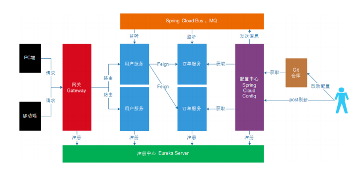

[TOC]

# 0. 学习目标
> 能够使用Feign进行远程调用
>
> 能够搭建Spring Cloud Gateway网关服务
>
> 能够配置Spring Cloud Gateway路由过滤器
>
> 能够编写Spring Cloud Gateway全局过滤器
>
> 能够搭建Spring Cloud Config配置中心服务
>
> 能够使用Spring Cloud Bus实时更新配置
>

# 1. Feign
在前面的学习中，使用了Ribbon的负载均衡功能，大大简化了远程调用时的代码
```java
String url = "http://user-service/user/" + id;
User user = this.restTemplate.getForObject(url, User.class)
```

如果就学到这里，你可能以后需要编写类似的大量重复代码，格式基本相同，无非参数不一样。有没有更优雅的方式，来对这些代码再次优化呢？

这就是接下来要学的Feign的功能了。

## 1.1. 简介
`Feign`也叫伪装。`Feign`可以把Rest的请求进行隐藏，伪装成类似SpringMVC的Controller一样。不用再自己拼接url，拼接参数等等操作，一切都交给`Feign`去做。[项目主页](https://github.com/OpenFeign/feign)

## 1.2. 快速入门
### 1.2.1. 导入依赖
在 `consumer-demo` 项目的 `pom.xml` 文件中添加如下依赖

```xml
<dependency>
    <groupId>org.springframework.cloud</groupId>
    <artifactId>spring-cloud-starter-openfeign</artifactId>
</dependency>
```

### 1.2.2. Feign的客户端

在 `consumer-demo` 中编写如下`Feign客户端`接口类
```java
package tk.deriwotua.consumer.client;

import org.springframework.cloud.openfeign.FeignClient;
import org.springframework.web.bind.annotation.GetMapping;
import org.springframework.web.bind.annotation.PathVariable;
import tk.deriwotua.consumer.client.fallback.UserClientFallback;
import tk.deriwotua.consumer.config.FeignConfig;
import tk.deriwotua.consumer.pojo.User;

//声明当前类是一个Feign客户端，指定服务名为user-service
//@FeignClient("user-service")
//声明这是一个Feign客户端，同时通过 `value` 属性指定服务名称
@FeignClient(value = "user-service")
public interface UserClient {

    //http://user-service/user/123
    @GetMapping("/user/{id}")
    User queryById(@PathVariable Long id);
}
```
- 首先这是一个接口，Feign会通过**动态代理生成实现类**。这点跟mybatis的mapper很像
- `@FeignClient` ，声明这是一个Feign客户端，同时通过 `value` 属性指定服务名称
- 接口中的定义方法，完全采用SpringMVC的注解，Feign会根据注解生成URL，并访问获取结果
- `@GetMapping`中的`/user`，请不要忘记Feign需要拼接可访问的地址

编写新的控制器类 `ConsumerFeignController` ，使用`UserClient`访问
```java
package tk.deriwotua.consumer.controller;

import org.springframework.beans.factory.annotation.Autowired;
import org.springframework.web.bind.annotation.GetMapping;
import org.springframework.web.bind.annotation.PathVariable;
import org.springframework.web.bind.annotation.RequestMapping;
import org.springframework.web.bind.annotation.RestController;
import tk.deriwotua.consumer.client.UserClient;
import tk.deriwotua.consumer.pojo.User;

@RestController
@RequestMapping("/cf")
public class ConsumerFeignController {

    @Autowired
    private UserClient userClient;

    @GetMapping("/{id}")
    public User queryById(@PathVariable Long id){
        return userClient.queryById(id);
    }
}
```
### 1.2.3. 开启Feign功能
在 `ConsumerApplication` 启动类上，添加`@EnableFeignClients`注解，开启Feign功能
```java
package tk.deriwotua.consumer;

import org.springframework.boot.SpringApplication;
import org.springframework.cloud.client.SpringCloudApplication;
import org.springframework.cloud.client.loadbalancer.LoadBalanced;
import org.springframework.cloud.openfeign.EnableFeignClients;
import org.springframework.context.annotation.Bean;
import org.springframework.web.client.RestTemplate;

/*@SpringBootApplication
@EnableDiscoveryClient //开启Eureka客户端发现功能
@EnableCircuitBreaker //开启熔断*/
@SpringCloudApplication
@EnableFeignClients//开启Feign功能
public class ConsumerApplication {
    public static void main(String[] args) {
        SpringApplication.run(ConsumerApplication.class, args);
    }

    @Bean
    @LoadBalanced
    public RestTemplate restTemplate(){
        return new RestTemplate();
    }
}
```
> Feign中已经**自动集成了Ribbon负载均衡**，因此不需要自己定义RestTemplate进行负载均衡的配置。

### 1.2.4. 启动测试
访问接口：`http://localhost:8080/cf/2`


正常获取到了结果。
## 1.3. 负载均衡
Feign中本身已经集成了Ribbon依赖和自动配置


因此不需要额外引入依赖，也不需要再注册 `RestTemplate` 对象。
Feign内置的ribbon默认设置了请求超时时长，默认是1000，我们可以通过手动配置来修改这个超时时长
```yaml
ribbon:
  ReadTimeout: 2000 # 读取超时时长
  ConnectTimeout: 1000 # 建立链接的超时时长
```
因为ribbon内部有重试机制，一旦超时，会自动重新发起请求。如果不希望重试，可以添加配置修改 `application.yml` 添加如下配置
```yaml
ribbon:
  # 连接超时时长
  ConnectTimeout: 1000 
  # 数据通信超时时长
  ReadTimeout: 2000 
  # 当前服务器的重试次数
  MaxAutoRetries: 0 
  # 重试多少次服务
  MaxAutoRetriesNextServer: 0 
  # 是否对所有的请求方式都重试
  OkToRetryOnAllOperations: false 
```

> 重新给`UserService`的方法设置上线程沉睡时间2秒可以测试上述配置

## 1.4. Hystrix支持(了解)
Feign默认也有对Hystrix的集成


只不过，默认情况下是关闭的。需要通过下面的参数来开启 `application.yml` 添加如下配置
```yaml
feign:
  hystrix:
    # 开启Feign的熔断功能
    enabled: true 
```

但是，Feign中的`Fallback配置`不像Ribbon中那样简单了。
- 首先，要定义一个类，实现刚才编写的`UserFeignClient`，作为`fallback`的处理类
  ```java
  package tk.deriwotua.consumer.client.fallback;
  
  import org.springframework.stereotype.Component;
  import tk.deriwotua.consumer.client.UserClient;
  import tk.deriwotua.consumer.pojo.User;
  
  /**
   * 开启Feign的熔断功能
   *  首先需要配置中开启熔断功能
   *      feign.hystrix.enabled=true
   *  然后需要实现 标注@FeignClient的代理接口 作为熔断后降级的`fallback`的处理类
   *      比如：tk.deriwotua.consumer.client.UserClient
   *  最后在 标注@FeignClient的代理接口 注解中指定熔断后降级的`fallback`的处理类
   *      比如：@FeignClient(value = "user-service", fallback = UserClientFallback.class)
   */
  @Component
  public class UserClientFallback implements UserClient {
      @Override
      public User queryById(Long id) {
          User user = new User();
          user.setId(id);
          user.setName("用户异常");
          return user;
      }
  }
  ```
- 然后在`UserFeignClient`中，指定刚才编写的实现类
  ```java
  package tk.deriwotua.consumer.client;
  
  import org.springframework.cloud.openfeign.FeignClient;
  import org.springframework.web.bind.annotation.GetMapping;
  import org.springframework.web.bind.annotation.PathVariable;
  import tk.deriwotua.consumer.client.fallback.UserClientFallback;
  import tk.deriwotua.consumer.config.FeignConfig;
  import tk.deriwotua.consumer.pojo.User;
  
  //声明当前类是一个Feign客户端，指定服务名为user-service
  // 开启feign的熔断功能需要指定熔断后降级的fallback处理类
  @FeignClient(value = "user-service", fallback = UserClientFallback.class)
  public interface UserClient {
  
      //http://user-service/user/123
      @GetMapping("/user/{id}")
      User queryById(@PathVariable Long id);
  }
  ```

- 重启测试重启启动 `consumer-demo` 并关闭 `user-service` 服务，然后在页面访问：`http://localhost:8080/cf/8`

  

### 1.5. 请求压缩(了解)
`Spring Cloud Feign` 支持对请求和响应进行`GZIP`压缩，以减少通信过程中的性能损耗。通过下面的参数即可开启请求与响应的压缩功能
```yaml
feign:
  # 对请求和响应进行`GZIP`压缩
  compression:
    request:
      # 开启请求压缩
      enabled: true 
    response:
      # 开启响应压缩
      enabled: true 
```
同时，我们也可以对请求的数据类型，以及触发压缩的大小下限进行设置
```yaml
feign:
  # 对请求和响应进行`GZIP`压缩
  compression:
    request:
      # 开启请求压缩
      enabled: true
      # 设置压缩的数据类型
      mime-types: text/html,application/xml,application/json
      # 设置触发压缩的大小下限
      min-request-size: 2048
    response:
      enabled: true
```
注：上面的数据类型、压缩大小下限均为默认值。

### 1.6. 日志级别(了解)
前面讲过，通过 `logging.level.xx=debug` 来设置日志级别。然而这个对Feign客户端而言不会产生效果。因为 `@FeignClient` 注解修改的客户端在被代理时，都会创建一个新的`Feign.Logger
`实例。需要额外指定这个日志的级别才可以。
- 在 `consumer-demo` 的`application.yml`配置文件中设置`tk.deriwotua`包下的日志级别都为 `debug`
  ```yaml
  logging:
    level:
      tk.deriwotua: debug
  ```

- 在 `consumer-demo` 编写`FeignConfig`配置类，定义日志级别
  ```java
  package tk.deriwotua.consumer.config;
  
  import feign.Logger;
  import org.springframework.context.annotation.Bean;
  import org.springframework.context.annotation.Configuration;
  
  /**
   * 通过 `logging.level.xx=debug` 来设置日志级别。然而这个对Feign客户端而言不会产生效果。
   * 因为 `@FeignClient` 注解修改的客户端在被代理时，都会创建一个新的`Feign.Logger`实例。
   * 需要额外指定这个日志的级别才可以
   */
  @Configuration
  public class FeignConfig {
  
      @Bean
      Logger.Level feignLoggerLevel(){
          //记录所有请求和响应的明细，包括头信息、请求体、元数据
          return Logger.Level.FULL;
          /**
           *   - 这里指定的Level级别是`FULL`，Feign支持4种级别
           *     - `NONE`：不记录任何日志信息，这是默认值。
           *     - `BASIC`：仅记录请求的方法，URL以及响应状态码和执行时间
           *     - `HEADERS`：在BASIC的基础上，额外记录了请求和响应的头信息
           *     - `FULL`：记录所有请求和响应的明细，包括头信息、请求体、元数据。
           */
      }
  }
  ```

  - 这里指定的Level级别是`FULL`，Feign支持4种级别
    - `NONE`：不记录任何日志信息，这是默认值。
    - `BASIC`：仅记录请求的方法，URL以及响应状态码和执行时间
    - `HEADERS`：在BASIC的基础上，额外记录了请求和响应的头信息
    - `FULL`：记录所有请求和响应的明细，包括头信息、请求体、元数据。

- 在 `consumer-demo` 的 `UserClient` 接口类上的`@FeignClient`注解中指定配置类
  ```java
  package tk.deriwotua.consumer.client;
  
  import org.springframework.cloud.openfeign.FeignClient;
  import org.springframework.web.bind.annotation.GetMapping;
  import org.springframework.web.bind.annotation.PathVariable;
  import tk.deriwotua.consumer.client.fallback.UserClientFallback;
  import tk.deriwotua.consumer.config.FeignConfig;
  import tk.deriwotua.consumer.pojo.User;
  
  /**
   * 声明当前类是一个Feign客户端，指定服务名为user-service
   *      feign内部已实现 ribbon 负载均衡不需要再额外实现负载均衡
   *          使用时直接配置 ribbon 相关配置项即可
   *      feign内部也实现了 hystrix 使用上需要编写熔断时服务降级fallback实现类并feign客户端注解声明该实现类 然后就可以开启feign熔断
   *      需要注意的时feign客户端日志功能单单配置中 `logging.level.xx=debug` 来设置日志级别是不够的
   *          需要额外定义feign客户端代理后Feign.Logger实例类的日志级别 然后注解中使用 configuration 声明feign配置类
   *  value   声明代理服务名
   *  fallback    声明熔断后的服务降级实现类
   *  configuration   声明feign客户端配置类
   */
  @FeignClient(value = "user-service", fallback = UserClientFallback.class, configuration = FeignConfig.class)
  public interface UserClient {
  
      //http://user-service/user/123
      @GetMapping("/user/{id}")
      User queryById(@PathVariable Long id);
  }
  ```
- 重启项目，访问：`http://localhost:8080/cf/8` ；即可看到每次访问的日志
  

# 2. Spring Cloud Gateway网关
## 2.1. 简介
> `Spring Cloud Gateway`是Spring官网基于`Spring 5.0`、 `Spring Boot 2.0`、`Project Reactor`等技术开发的网关服务。
>
> `Spring Cloud Gateway`基于Filter链提供网关基本功能：安全、监控／埋点、限流等。
>
> `Spring Cloud Gateway`为微服务架构提供简单、有效且统一的API路由管理方式。
>
> `Spring Cloud Gateway`是替代Netflix Zuul的一套解决方案。

`Spring Cloud Gateway`组件的核心是一系列的过滤器，通过这些过滤器可以将客户端发送的请求转发（路由）到对应的微服务。 `Spring Cloud Gateway`是**加在整个微服务最前沿的防火墙和代理器，隐藏微服务结点IP端口信息**，从而加强安全保护。`Spring Cloud Gateway`本身也是一个微服务，需要注册到Eureka服务注册中心。

网关的核心功能是：**过滤和路由**

## 2.2. Gateway加入后的架构


不管是来自于客户端（PC或移动端）的请求，还是服务内部调用。一切对服务的请求都可经过网关，然后再由网关来实现 鉴权、动态路由等等操作。Gateway就是服务的统一入口。

## 2.3. 核心概念
`route`路由信息的组成：由一个`ID`、一个`目的URL`、一组`断言工厂`、一组`Filter`组成。如果路由断言为真，说明请求URL和配置路由匹配。

`Predicate`断言 `Spring Cloud Gateway`中的断言函数输入类型是`Spring 5.0`框架中的`ServerWebExchange`。`Spring Cloud Gateway`的断言函数允许开发者去定义匹配来自于`Http Request`中的任何信息比如请求头和参数。

`Filter`过滤器 一个标准的`Spring WebFilter`。过滤器Filter将会对请求和响应进行修改处理。 `Spring Cloud Gateway`中的Filter分为两种类型的Filter，分别是
- `Gateway Filter`
- `Global Filter`

## 2.4. 快速入门
### 2.4.1. 新建工程
创建`springcloud-gateway`模块 `pom.xml` 文件修改为如下
```xml
<?xml version="1.0" encoding="UTF-8"?>
<project xmlns="http://maven.apache.org/POM/4.0.0"
         xmlns:xsi="http://www.w3.org/2001/XMLSchema-instance"
         xsi:schemaLocation="http://maven.apache.org/POM/4.0.0 http://maven.apache.org/xsd/maven-4.0.0.xsd">
    <parent>
        <artifactId>springcloud-parent</artifactId>
        <groupId>tk.deriwotua</groupId>
        <version>1.0-SNAPSHOT</version>
    </parent>
    <modelVersion>4.0.0</modelVersion>

    <artifactId>springcloud-gateway</artifactId>

    <dependencies>
        <dependency>
            <groupId>org.springframework.cloud</groupId>
            <artifactId>spring-cloud-starter-gateway</artifactId>
        </dependency>
        <dependency>
            <groupId>org.springframework.cloud</groupId>
            <artifactId>spring-cloud-starter-netflix-eureka-client</artifactId>
        </dependency>
    </dependencies>
</project>
```

### 2.4.2. 编写启动类
创建 `GatewayApplication` 启动类
```java
package tk.deriwotua.gateway;

import org.springframework.boot.SpringApplication;
import org.springframework.boot.autoconfigure.SpringBootApplication;
import org.springframework.cloud.client.discovery.EnableDiscoveryClient;

@SpringBootApplication
@EnableDiscoveryClient
public class GatewayApplication {
    public static void main(String[] args) {
        SpringApplication.run(GatewayApplication.class, args);
    }
}
```

### 2.4.2. 编写配置
创建 application.yml 文件
```yaml
server:
  port: 10010
spring:
  application:
    name: api-gateway
eureka:
  client:
    service-url:
      defaultZone: http://127.0.0.1:10086/eureka
  instance:
    prefer-ip-address: true
```

### 2.4.4. 编写路由规则
需要用网关来代理 `user-service` 服务，先看一下控制面板中的服务状态


- ip为：`127.0.0.1`
- 端口为：`9091`
修改 application.yml 文件为
```yaml
server:
  port: 10010
spring:
  application:
    name: api-gateway
  cloud:
    gateway:
      routes:
        # 路由id，可以随意写
        - id: user-service-route
          # 代理的服务地址
          uri: http://127.0.0.1:9091
          # 路由断言，可以配置映射路径
          predicates:
            - Path=/user/**
eureka:
  client:
    service-url:
      defaultZone: http://127.0.0.1:10086/eureka
  instance:
    prefer-ip-address: true
```

将符合 `spring.cloud.gateway.routes.predicates.Path` 规则的一切请求，都代理到 `spring.cloud.gateway.routes.uri` 参数指定的地址

上面配置中，将路径中包含有 `/user/**` 开头的请求，代理到`http://127.0.0.1:9091`

### 2.4.5. 启动测试
访问的路径中需要加上配置规则的映射路径，访问：`http://localhost:10010/user/8`


## 2.5. 面向服务的路由
在刚才的路由规则中，把路径对应的服务地址写死了！如果同一服务有多个实例的话，这样做显然不合理。

应该根据服务的名称，去Eureka注册中心查找 服务对应的所有实例列表，然后进行**动态路由**！
### 2.5.1. 修改映射配置，通过服务名称获取

因为已经配置了Eureka客户端，可以从Eureka获取服务的地址信息 `application.yml` 文件
```yaml
server:
  port: 10010
spring:
  application:
    name: api-gateway
  cloud:
    gateway:
      routes:
        # 路由id，可以任意
        - id: user-service-route
          # 代理的服务地址 uri: http://IP:port 静态路由 地址不会变动下可写死配置
          #uri: http://127.0.0.1:9091
          # lb表示从eureka中获取具体服务 动态路由
          uri: lb://user-service
          # 路由断言： 可以匹配映射路径
          predicates:
            - Path=/user/**
eureka:
  client:
    service-url:
      defaultZone: http://127.0.0.1:10086/eureka
  instance:
    prefer-ip-address: true
```


路由配置中`uri`所用的协议为`lb`时（以`uri: lb://user-service`为例），`gateway`将使用 `org.springframework.cloud.client.loadbalancer.LoadBalancerClient`把`user-service`通过eureka解析为实际的主机和端口，并进行`ribbon`负载均衡。

### 2.5.2. 启动测试
再次启动 `springcloud-gateway `，这次gateway进行代理时，会利用Ribbon进行负载均衡访问`http://localhost:10010/user/8`

日志中可以看到使用了负载均衡器


## 2.6. 路由前缀
### 2.6.1. 添加前缀
在`gateway`中可以通过配置路由的过滤器`PrefixPath`，实现映射路径中地址前缀 `application.yml` 文件
```yaml
server:
  port: 10010
spring:
  application:
    name: api-gateway
 cloud:
    gateway:
      routes: # routes 下面数据格式是list - 分隔
        # 路由id，可以随意写
        - id: user-service-route
          # 代理的服务地址；lb表示从eureka中获取具体服务
          uri: lb://user-service
          # 路由断言，可以配置映射路径
          predicates:
            - Path=/**
          filters:
            # 添加请求路径的前缀
            - PrefixPath=/user
eureka:
  client:
    service-url:
      defaultZone: http://127.0.0.1:10086/eureka
  instance:
    prefer-ip-address: true
```


通过 `PrefixPath=/xxx` 来指定了路由要添加的前缀。也就是：
- `PrefixPath=/user` http://localhost:10010/8 --> http://localhost:9091/user/8
- `PrefixPath=/user/abc` http://localhost:10010/8 -->http://localhost:9091/user/abc/8

以此类推。可以避免暴露微服务路径


### 2.6.2. 去除前缀
在`gateway`中可以通过配置路由的过滤器`StripPrefix`，实现映射路径中地址的去除 `application.yml` 文件
```yaml
server:
  port: 10010
spring:
  application:
    name: api-gateway
  cloud:
    gateway:
      routes:
        # 路由id，可以随意写
        - id: user-service-route
          # 代理的服务地址；lb表示从eureka中获取具体服务
          uri: lb://user-service
          # 路由断言，可以配置映射路径
          predicates:
            - Path=/api/user/**
          filters:
            # 添加 predicates.Path 请求路径的前缀
            #- PrefixPath=/user
            # StripPrefix实现 predicates.Path 映射路径中地址的去除
            #1表示过滤1个路径，2表示两个路径，以此类推
            - StripPrefix=1
eureka:
  client:
    service-url:
      defaultZone: http://127.0.0.1:10086/eureka
  instance:
    prefer-ip-address: true
```

通过 `StripPrefix=1` 来指定了路由要去掉的前缀个数。如：路径 `/api/user/1` 将会被代理到 `/user/1` 也就是
- `StripPrefix=1` http://localhost:10010/api/user/8 --> http://localhost:9091/user/8
- `StripPrefix=2` http://localhost:10010/api/user/8 --> http://localhost:9091/8

以此类推。同样避免暴露微服务路径


## 2.7. 过滤器
### 2.7.1. 简介
Gateway作为网关的其中一个重要功能，就是实现请求的鉴权。而这个动作往往是通过网关提供的过滤器来实现的。前面的 `路由前缀` 章节中的功能也是使用过滤器实现的。

Gateway自带过滤器有几十个，常见自带过滤器有

  过滤器名称                     |  说明
  --------------|------------
  AddRequestHeader          |      对匹配上的请求加上Header
  AddRequestParameters      |      对匹配上的请求路由添加参数
  AddResponseHeader         |      对从网关返回的响应添加Header
  StripPrefix               |      对匹配上的请求路径去除前缀

  

详细的说明在[官网链接](https://cloud.spring.io/spring-cloud-static/spring-cloud-gateway/2.1.1.RELEASE/single/spring-cloud-gateway.html#_gatewayfilter_factories)

配置全局默认过滤器
- 这些自带的过滤器可以和使用 `路由前缀` 章节中的用法类似，也可以将这些过滤器配置成不只是针对某个路由；而是可以对所有路由生效，也就是配置默认过滤器
```yaml
server:
  port: 10010
spring:
  application:
    name: api-gateway
  cloud:
    gateway:
      # 默认过滤器，对所有路由生效
      default-filters:
        # 响应头过滤器，对输出的响应设置其头部属性名称为X-Response-Default-MyName，值为deriwotua；如果有多个参数多则重写一行设置不同的参数
        - AddResponseHeader=X-Response-Default-MyName, deriwotua
      routes:
        # 路由id，可以随意写
        - id: user-service-route
          # 代理的服务地址；lb表示从eureka中获取具体服务
          uri: lb://user-service
          # 路由断言，可以配置映射路径
          predicates:
            - Path=/api/user/**
          filters:
            # 表示过滤1个路径，2表示两个路径，以此类推
            - StripPrefix=1
```

上述配置后，再访问 `http://localhost:10010/api/user/8` 的话；那么可以从其响应中查看到如下信息：


过滤器类型：Gateway实现方式上，有两种过滤器
- `局部过滤器`：通过 `spring.cloud.gateway.routes.filters` 配置在具体路由下，只作用在当前路由上；自带的过滤器都可以配置或者自定义按照自带过滤器的方式。如果配置`spring.cloud.gateway.default-filters` 上会对所有路由生效也算是全局的过滤器；但是这些过滤器的实现上都是要实现`GatewayFilterFactory`接口。
- `全局过滤器`：不需要在配置文件中配置，作用在所有的路由上；实现 `GlobalFilter` 接口即可。

### 2.7.2. 执行生命周期
`Spring Cloud Gateway` 的 `Filter` 的生命周期也类似`Spring MVC`的拦截器有两个`pre*` 和`post*`。`pre*` 和 `post*` 分别会在请求被执行前调用和被执行后调用。


这里的 `pre*` 和 `post*` 可以通过过滤器的 `GatewayFilterChain` 执行`filter`方法前后来实现。
### 2.7.3. 使用场景
常见的应用场景如下
- 请求鉴权：一般 `GatewayFilterChain` 执行`filter`方法**前**，如果发现没有访问权限，直接就返回空。
- 异常处理：一般 `GatewayFilterChain` 执行`filter`方法**后**，记录异常并返回。
- 服务调用时长统计： `GatewayFilterChain` 执行`filter`方法**前后**根据时间统计。

## 2.8. 自定义过滤器
### 2.8.1. 自定义局部过滤器
需求：在`application.yml`中对某个路由配置过滤器，该过滤器可以在控制台输出配置文件中指定名称的请求参数的值。
- 编写过滤器编写过滤器工厂类`MyParamGatewayFilterFactory`
  ```java
  package tk.deriwotua.gateway.filter;
  
  import org.springframework.cloud.gateway.filter.GatewayFilter;
  import org.springframework.cloud.gateway.filter.factory.AbstractGatewayFilterFactory;
  import org.springframework.http.server.reactive.ServerHttpRequest;
  import org.springframework.stereotype.Component;
  
  import java.util.Arrays;
  import java.util.List;
  
  /**
   * 自定义局部过滤器
   *      自定义过滤器的命名应该为 ***GatewayFilterFactory
   *          ***     即自定义过滤器的名称 在配置 spring.cloud.routes.filters 配置时需要用到
   */
  @Component
  public class MyParamGatewayFilterFactory extends AbstractGatewayFilterFactory<MyParamGatewayFilterFactory.Config> {
  
      static final String PARAM_NAME = "param";
  
      public MyParamGatewayFilterFactory() {
          super(Config.class);
      }
  
      public List<String> shortcutFieldOrder() {
          return Arrays.asList(PARAM_NAME);
      }
  
      @Override
      public GatewayFilter apply(Config config) {
          return (exchange, chain) -> {
              /**
               * 配置文件中配置自定义过滤器 tk.deriwotua.gateway.filter.MyParamGatewayFilterFactory 值为 name
               *  spring.cloud.gateway.routes.filters[{MyParam=name}]
               *  访问时 http://localhost:10010/api/user/8?name=deriwotua   config.param ==> name
               */
              //获取请求参数中param对应的参数名 的参数值
              ServerHttpRequest request = exchange.getRequest();
              // 访问 http://localhost:10010/api/user/8?name2=deriwotua     name2 与 config.param值name 不匹配 条件不满足
              if(request.getQueryParams().containsKey(config.param)){
                  // 访问时 http://localhost:10010/api/user/8?name=deriwotua 时参数中包含配置文件中配置自定义过滤器值 name
                  // 满足这里的 if 条件
                  request.getQueryParams().get(config.param).
                          forEach(value -> System.out.printf("------------局部过滤器--------%s = %s------", config.param, value));
              }
              return chain.filter(exchange);
          };
      }
  
      /**
       *  配置文件中对应配置对象
       *      配置文件中配置自定义过滤器 tk.deriwotua.gateway.filter.MyParamGatewayFilterFactory 值为 name
       *          spring.cloud.gateway.routes.filters[{MyParam=name}]
       */
      public static class Config{
          /**
           * 当配置为 spring.cloud.gateway.routes.filters[{MyParam=name}]
           *      这里的 param 值就为 name
           */
          //对应在配置过滤器的时候指定的MyParam参数名
          private String param;
  
          public String getParam() {
              return param;
          }
  
          public void setParam(String param) {
              this.param = param;
          }
      }
  }
  ```


- 修改配置文件 `application.yml` 配置文件
  ```yaml
  server:
    port: 10010
  spring:
    application:
      name: api-gateway
    cloud:
      gateway:
        routes:
          # 路由id，可以随意写
          - id: user-service-route
            # 代理的服务地址；lb表示从eureka中获取具体服务
            uri: lb://user-service
            # 路由断言，可以配置映射路径
            predicates:
              - Path=/api/user/**
            filters:
              # 表示过滤1个路径，2表示两个路径，以此类推
              - StripPrefix=1
              # 自定义过滤器
              - MyParam=name
  eureka:
    client:
      service-url:
        defaultZone: http://127.0.0.1:10086/eureka
    instance:
      prefer-ip-address: true
  ```
  - 注意：自定义过滤器的命名应该为 `***GatewayFilterFactory`

测试访问：`http://localhost:10010/api/user/8?name=deriwotua` 检查后台是否输出`name`和`deriwotua`；但是若访问 `http://localhost:10010/api/user/8
?name2=deriwotua` 则是不会输出的。

### 2.8.2. 自定义全局过滤器
需求：模拟一个登录的校验。基本逻辑如果请求中有token参数，则认为请求有效，放行。
- 编写全局过滤器类`MyGlobalFilter`
  ```java
  package tk.deriwotua.gateway.filter;
  
  import org.apache.commons.lang.StringUtils;
  import org.springframework.cloud.gateway.filter.GatewayFilterChain;
  import org.springframework.cloud.gateway.filter.GlobalFilter;
  import org.springframework.core.Ordered;
  import org.springframework.http.HttpStatus;
  import org.springframework.stereotype.Component;
  import org.springframework.web.server.ServerWebExchange;
  import reactor.core.publisher.Mono;
  
  /**
   * 自定义全局过滤器
   *      请求中包含 token 参数则放行
   */
  @Component
  public class MyGlobalFilter implements GlobalFilter, Ordered {
      @Override
      public Mono<Void> filter(ServerWebExchange exchange, GatewayFilterChain chain) {
          System.out.println("--------------全局过滤器MyGlobalFilter------------------");
          String token = exchange.getRequest().getQueryParams().getFirst("token");
          if(StringUtils.isBlank(token)){
              //设置响应状态码为未授权
              exchange.getResponse().setStatusCode(HttpStatus.UNAUTHORIZED);
              return exchange.getResponse().setComplete();
          }
          return chain.filter(exchange);
      }
  
      @Override
      public int getOrder() {
          //值越小越先执行
          return 1;
      }
  }
  ```

- 访问 `http://localhost:10010/api/user/8`
  

- 访问 `http://localhost:10010/api/user/8?token=abc`
  

## 2.9. 负载均衡和熔断（了解）
Gateway中默认就已经集成了Ribbon负载均衡和Hystrix熔断机制。但是所有的超时策略都是走的默认值，比如熔断超时时间只有1S，很容易就触发了。因此建议手动进行配置
```yaml
hystrix:
  command:
    default:
      execution:
        isolation:
          thread:
            timeoutInMilliseconds: 6000
ribbon:
  # 连接超时时长
  ConnectTimeout: 1000
  # 数据通信超时时长
  ReadTimeout: 2000
  # 当前服务器的重试次数
  MaxAutoRetries: 0
  # 重试多少次服务
  MaxAutoRetriesNextServer: 0
```

## 2.10. Gateway跨域配置
一般网关都是所有微服务的统一入口，必然在被调用的时候会出现跨域问题。

跨域：在js请求访问中，如果**访问的地址与当前服务器的域名、ip或者端口号不一致则称为跨域请求**。若不解决则不能获取到对应地址的返回结果。
- 从在`http://localhost:9090`中的js访问 `http://localhost:9000`的数据，因为端口不同，所以也是跨域请求。

在访问Spring Cloud Gateway网关服务器的时候，出现跨域问题的话；可以在网关服务器中通过配置解决，允许哪些服务是可以跨域请求的；具体配置如下
```yaml
spring:
  cloud:
    gateway:
      globalcors:
        corsConfigurations:
          # 对所有访问到网关服务器的请求地址
          '[/**]':
            # 下面配置可以允许来自 `http://docs.spring.io` 的get请求方式跨域获取服务数据
            # allowedOrigins指定允许访问的服务器地址
            # allowedOrigins: * # 这种写法或者下面的都可以，*表示全部
            allowedOrigins:
              - "http://docs.spring.io"
            allowedMethods:
              - GET
```

- 上述配置表示：可以允许来自 `http://docs.spring.io` 的get请求方式获取服务数据。
- `allowedOrigins` 指定允许访问的服务器地址，如：`http://localhost:10000` 也是可以的。
- `'[/**]'` 表示对所有访问到网关服务器的请求地址
- [官网具体说明](https://cloud.spring.io/spring-cloud-static/spring-cloud-gateway/2.1.1.RELEASE/multi/multi__cors_configuration.html)

## 2.11. Gateway的高可用（了解）
启动多个Gateway服务，自动注册到Eureka，形成集群。如果是服务内部访问，访问Gateway，自动负载均衡，没问题。

但是，Gateway更多是外部访问，PC端、移动端等。它们无法通过Eureka进行负载均衡，那么该怎么办？

此时，可以使用其它的服务网关，来对Gateway进行代理。比如：`Nginx`

## 2.12. Gateway与Feign的区别

Gateway 作为整个应用的流量入口，接收所有的请求，如PC、移动端等，并且将不同的请求转发至不同的处理微服务模块，其作用可视为`nginx`；大部分情况下用作权限鉴定、服务端流量控制

Feign 则是将当前微服务的部分服务接口暴露出来，并且主要用于各个微服务之间的服务调用

# 3. Spring Cloud Config分布式配置中心
## 3.1. 简介
在分布式系统中，由于服务数量非常多，配置文件分散在不同的微服务项目中，管理不方便。为了方便配置文件集中管理，需要分布式配置中心组件。在Spring Cloud中，提供了`Spring Cloud Config`，它支持配置文件放在配置服务的本地，也支持放在远程Git仓库（GitHub、码云）。

使用`Spring Cloud Config`配置中心后的架构如下图


- 配置中心本质上也是一个微服务，同样需要注册到Eureka服务注册中心！

## 3.2. Git配置管理
### 3.2.1. 远程Git仓库
知名的Git远程仓库有国外的GitHub；但是使用GitHub时，国内的用户经常遇到的问题是访问速度太慢，有时候还会出现无法连接的情况。如果希望体验更好一些，可以使用 `GitLab` 自建

### 3.2.2. 创建远程仓库

`GITHUB` 远程仓库创建忽略


### 3.2.3. 创建配置文件
在新建的仓库中创建需要被统一配置管理的配置文件。

配置文件的命名格式
```text
{application}-{profile}.yml 或 {application}-{profile}.properties
```
- `application`为应用名称
- `profile`用于区分开发环境，`test` 测试环境、`pro` 生产环境等
  - 如`user-dev.yml`，表示用户微服务开发环境下使用的配置文件。

将`user-service`工程的配置文件`application.yml`文件的内容复制作为`user-dev.yml`文件的内容，具体配置如下
```yaml
server:
  port: ${port:9091}
spring:
  datasource:
    driver-class-name: com.mysql.jdbc.Driver
    url: jdbc:mysql://localhost:3306/springcloud
    username: root
    password: root
  application:
    #应用名
    name: user-service
mybatis:
  type-aliases-package: tk.deriwotua.user.pojo
eureka:
  client:
    service-url:
      defaultZone: http://127.0.0.1:10086/eureka
  instance:
    ip-address: 127.0.0.1
    prefer-ip-address: true
    lease-expiration-duration-in-seconds: 90
    lease-renewal-interval-in-seconds: 30
```

创建后推送到 github 新建的配置中心仓库(没有新建一个)

## 3.3. 搭建配置中心微服务

### 3.3.1. 创建工程
创建配置中心微服务`config-server`工程 `pom.xml` 如下
```xml
<?xml version="1.0" encoding="UTF-8"?>
<project xmlns="http://maven.apache.org/POM/4.0.0"
xmlns:xsi="http://www.w3.org/2001/XMLSchema-instance"
xsi:schemaLocation="http://maven.apache.org/POM/4.0.0
http://maven.apache.org/xsd/maven-4.0.0.xsd">
    <parent>
        <artifactId>springcloud-parent</artifactId>
        <groupId>tk.deriwotua</groupId>
        <version>1.0-SNAPSHOT</version>
    </parent>
    <modelVersion>4.0.0</modelVersion>

    <artifactId>config-server</artifactId>
    <dependencies>
        <dependency>
            <groupId>org.springframework.cloud</groupId>
            <artifactId>spring-cloud-starter-netflix-eureka-client</artifactId>
        </dependency>
        <dependency>
            <groupId>org.springframework.cloud</groupId>
            <artifactId>spring-cloud-config-server</artifactId>
        </dependency>
    </dependencies>
</project>
```


### 3.3.2. 启动类
创建配置中心工程 `config-server` 的启动类 `ConfigServerApplication.java` 如下
```java
package tk.deriwotua.config;

import org.springframework.boot.SpringApplication;
import org.springframework.boot.autoconfigure.SpringBootApplication;
import org.springframework.cloud.config.server.EnableConfigServer;

@SpringBootApplication
//开启配置服务
@EnableConfigServer
public class ConfigServerApplication {
    public static void main(String[] args) {
        SpringApplication.run(ConfigServerApplication.class, args);
    }
}
```


### 3.3.3. 配置文件
创建配置中心工程 `config-server` 的配置文件 application.yml 如下
```yaml
server:
  port: 12000
spring:
  application:
    name: config-server
  cloud:
    config:
      server:
        git:
          uri: https://gitee.com/liaojianbin/heima-config.git
eureka:
  client:
    service-url:
      defaultZone: http://127.0.0.1:10086/eureka
```

- 注意上述的 `spring.cloud.config.server.git.uri` 修改为自己创建的仓库地址


### 3.3.4. 启动测试
启动eureka注册中心和配置中心；然后访问`http://localhost:12000/user-dev.yml` ，查看能否输出在仓库存储管理的 `user-dev.yml` 文件。并且可以在仓库上修改`user-dev.yml`然后刷新上述测试地址也能及时到最新数据。


## 3.4. 获取配置中心配置
前面已经完成了配置中心微服务的搭建，下面我们就需要改造一下用户微服务 `user-service` ，配置文件信息不再由微服务项目提供，而是从配置中心获取。如下对 `user-service` 工程进行改造。

### 3.4.1. 添加依赖
在 `user-service` 工程中的`pom.xml`文件中添加如下依赖
```xml
<dependency>
    <groupId>org.springframework.cloud</groupId>
    <artifactId>spring-cloud-starter-config</artifactId>
    <version>2.1.1.RELEASE</version>
</dependency>
```


### 3.4.2. 修改配置

删除 `user-service` 工程的 `application.yml` 文件（因为该文件从配置中心获取）

资源目录下创建 `user-service` 工程 `bootstrap.yml` 配置文件
```yaml
spring:
  cloud:
    config:
      # 与远程仓库中的配置文件的application保持一致
      name: user
      # 远程仓库中的配置文件的profile保持一致
      profile: dev
      # 远程仓库中的版本保持一致
      label: master
      discovery:
        # 使用配置中心
        enabled: true
        # eureka注册的配置中心服务id
        service-id: config-server
eureka:
  client:
    service-url:
      defaultZone: http://127.0.0.1:10086/eureka
```


user-service 工程修改后结构：


- `bootstrap.yml`文件也是**Spring Boot的默认配置文件**，而且其加载的时间相比于`application.yml`更早。
- `application.yml`和`bootstrap.yml`虽然都是Spring Boot的默认配置文件，但是定位却不相同。
  - `bootstrap.yml`可以理解成系统级别的一些参数配置，这些参数一般是不会变动的。
  - `application.yml` 可以用来定义应用级别的参数，如果搭配 `spring cloud config` 使用，`application.yml` 里面定义的文件可以实现动态替换。
- 总结就是，`bootstrap.yml`文件相当于项目启动时的引导文件，内容相对固定。`application.yml`文件是微服务的一些常规配置参数，变化比较频繁。

### 3.4.3. 启动测试
启动注册中心 `eureka-server` 、配置中心 `config-server` 、用户服务 `user-service` ，如果启动没有报错其实已经使用上配置中心内容，可以到注册中心查看，也可以检验 `user-service` 的服务。


# 4. Spring Cloud Bus服务总线
## 4.1. 问题
前面已经完成了将微服务中的配置文件集中存储在远程Git仓库，并且通过配置中心微服务从Git仓库拉取配置文件，当用户微服务启动时会连接配置中心获取配置信息从而启动用户微服务。

如果更新Git仓库中的配置文件，那用户微服务是否可以及时接收到新的配置信息并更新呢？

### 4.1.1. 修改远程Git配置

修改在远程仓库上的`user-service-dev.yml`文件，添加一个属性`test.name`。


### 4.1.2. 修改UserController
修改 `user-service` 工程中的处理器类 `UserController.java` 如下
```java
@RestController
@RequestMapping("/user")
public class UserController {
    @Autowired
    private UserService userService;
    @Value("${test.name}")
    private String name;
    @GetMapping("/{id}")
    public User queryById(@PathVariable Long id){
        System.out.println("配置文件中的test.name = " + name);
        return userService.queryById(id);
    }
}
```

### 4.1.3. 测试
依次启动注册中心 `eureka-server` 、配置中心 `config-server` 、用户服务 `user-service` ；然后修改Git仓库中的配置信息，访问用户微服务，查看输出内容。

结论：通过查看用户微服务控制台的输出结果可以发现，对于Git仓库中配置文件的修改并没有及时更新到用户微服务，只有重启用户微服务才能生效。

如果想在不重启微服务的情况下更新配置该如何实现呢? 可以使用`Spring Cloud Bus`来实现配置的自动更新。
- 需要注意的是`Spring Cloud Bus`底层是基于`RabbitMQ`实现的，默认使用本地的消息队列服务，所以需要提前启动本地`RabbitMQ`服务（安装`RabbitMQ`以后才有），如下：

  


## 4.2. Spring Cloud Bus简介
`Spring Cloud Bus`是**用轻量的消息代理将分布式的节点连接起来**，可以用于**广播配置文件的更改或者服务的监控管理**。也就是**消息总线可以为微服务做监控，也可以实现应用程序之间相互通信**。

`Spring Cloud Bus`可选的消息代理有`RabbitMQ`和`Kafka`。
- 使用了Bus之后
  


## 4.3. 改造配置中心
1. 在 `config-server` 项目的`pom.xml`文件中加入`Spring Cloud Bus`相关依赖

```xml
<!--spring cloud bus-->
<dependency>
    <groupId>org.springframework.cloud</groupId>
    <artifactId>spring-cloud-bus</artifactId>
</dependency>
<!--spring cloud bus 底层基于 rabbitmq 实现-->
<dependency>
    <groupId>org.springframework.cloud</groupId>
    <artifactId>spring-cloud-stream-binder-rabbit</artifactId>
</dependency>
```

2. 在 `config-server` 项目修改`application.yml`文件如下：
```yaml
server:
  port: 12000
spring:
  application:
    name: config-server
  cloud:
    config:
      server:
        git:
          uri: https://gitee.com/goheima/heima-config.git
  # spring cloud bus 底层基于 rabbitmq 实现
  # 配置rabbitmq信息；如果是都与默认值一致则不需要配置
  rabbitmq:
    host: localhost
    port: 5672
    username: guest
    password: guest
eureka:
  client:
    service-url:
      defaultZone: http://127.0.0.1:10086/eureka
# spring cloud bus
management:
  endpoints:
    web:
      exposure:
        # 暴露触发消息总线的地址
        include: bus-refresh
```


## 4.4. 改造用户服务
1. 在用户微服务 `user-service` 项目的`pom.xml`中加入`Spring Cloud Bus`相关依赖

```xml
<dependency>
    <groupId>org.springframework.cloud</groupId>
    <artifactId>spring-cloud-bus</artifactId>
</dependency>
<dependency>
    <groupId>org.springframework.cloud</groupId>
    <artifactId>spring-cloud-stream-binder-rabbit</artifactId>
</dependency>
<dependency>
    <groupId>org.springframework.boot</groupId>
    <artifactId>spring-boot-starter-actuator</artifactId>
</dependency>
```

2. 修改 `user-service` 项目的`bootstrap.yml`如下
```yaml
spring:
  cloud:
    config:
      # 与远程仓库中的配置文件的application保持一致
      name: user
      # 远程仓库中的配置文件的profile保持一致
      profile: dev
      # 远程仓库中的版本保持一致
      label: master
      discovery:
        # 使用配置中心
        enabled: true
        # 配置中心服务id
        service-id: config-server
  # rabbitmq的配置信息；如下配置的rabbit都是默认值，其实可以完全不配置
  rabbitmq:
    host: localhost
    port: 5672
    username: guest
    password: guest
eureka:
  client:
    service-url:
      defaultZone: http://127.0.0.1:10086/eureka
```


3. 改造用户微服务 `user-service` 项目的`UserController`

```java
package tk.deriwtotua.user.controller;

import org.springframework.beans.factory.annotation.Autowired;
import org.springframework.beans.factory.annotation.Value;
import org.springframework.cloud.context.config.annotation.RefreshScope;
import org.springframework.web.bind.annotation.GetMapping;
import org.springframework.web.bind.annotation.PathVariable;
import org.springframework.web.bind.annotation.RequestMapping;
import org.springframework.web.bind.annotation.RestController;
import tk.deriwtotua.user.pojo.User;
import tk.deriwtotua.user.service.UserService;

@RestController
@RequestMapping("/user")
//自动刷新配置 与配置中心配置同步
@RefreshScope
public class UserController {

    @Autowired
    private UserService userService;

    @Value("test.name")
    private String name;

    @GetMapping("/{id}")
    public User queryById(@PathVariable Long id){
        /*try {
            Thread.sleep(2000);
        } catch (InterruptedException e) {
            e.printStackTrace();
        }*/

        System.out.println("配置中心参数 test.name: " + name);
        return userService.queryById(id);
    }
}
```

## 4.5. 测试
前面已经完成了配置中心微服务和用户微服务的改造，下面来测试一下，当我们修改了Git仓库中的配置文件，用户微服务是否能够在不重启的情况下自动更新配置信息。

测试步骤
- 依次启动注册中心 `eureka-server` 、配置中心 `config-server` 、用户服务 `user-service`
- 访问用户微服务`http://localhost:9091/user/8` 查看IDEA控制台输出结果
- 修改Git仓库中配置文件 `user-dev.yml` 的 `test.name` 内容
- 使用`Postman`或者`RESTClient`工具发送`POST`方式请求访问地址`http://127.0.0.1:12000/actuator/bus-refresh`
  

- 访问用户微服务系统控制台查看输出结果

说明
- `Postman`或者`RESTClient`是一个可以模拟浏览器发送各种请求（`POST`、`GET`、`PUT`、`DELETE`等）的工具
- 请求地址 `http://127.0.0.1:12000/actuator/bus-refresh` 中 `/actuator` 是固定的，`/bus-refresh`对应的是配置中心`config-server`中的`application.yml`文件的配置项`include`的内容
- 请求 `http://127.0.0.1:12000/actuator/bus-refresh` 地址的作用是访问配置中心的消息总线服务，消息总线服务接收到请求后会向消息队列中发送消息，各个微服务会监听消息队列。当微服务接收到队列中的消息后，会重新从配置中心获取最新的配置信息。

## 4.6. Spring Cloud 体系技术综合应用概览

