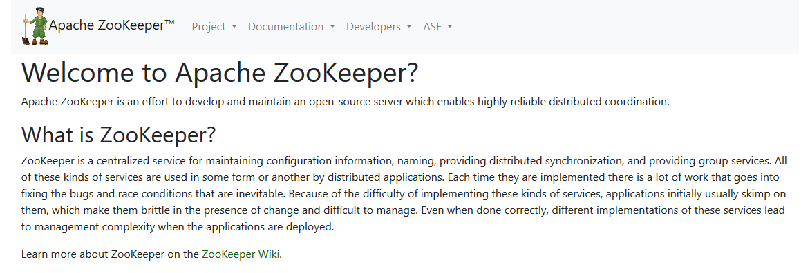
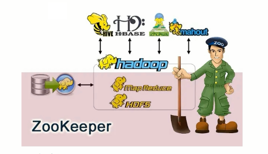
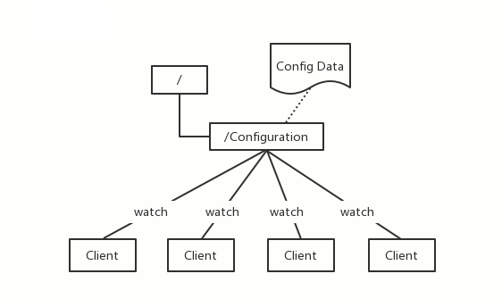
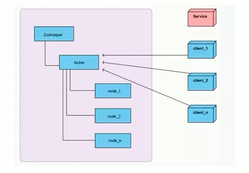
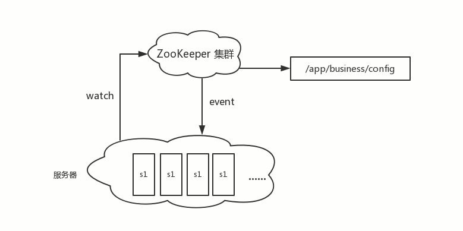
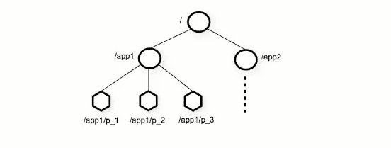
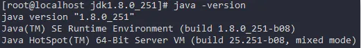
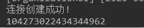

## 1. zookeeper简介
### 1.1 什么是zookeeper

zookeeper官网：`https://zookeeper.apache.org/`



ZooKeeper由雅虎研究院开发，是Google Chubby的开源实现，后来托管到Apache，于2010年11月正式成为Apache的顶级项目。

大数据生态系统里的很多组件的命名都是某种动物或者昆虫，比如hadoop大象，hive蜂巢。zookeeper即动物园管理者，顾名思义就是管理大数据生态系统各组件的管理员，如下图所示：


### 1.2 zookeeper应用场景

zookeeper是一个经典的分布式数据一致性解决方案，致力于为分布式应用提供一个高性能、高可用，且具有严格顺序访问控制能力的分布式协调存储服务。

- 维护配置信息
- 分布式锁服务
- 集群管理
- 生成分布式唯一ID

#### 1.2.1.维护配置信息
Java编程经常会遇到配置项，比如数据库的`url`、`schema`、`user`和`passwords
`等。通常这些配置项会放置在配置文件中，再将配置文件放置在服务器上当需要更改配置项时，需要去服务器上修改对应的配置文件。但是随着分布式系统的兴起，由于许多服务都需要使用到该配置文件，因此有必须保证该配置服务的`high availability`高可用性各台服务器上配置数据的一致性。通常会将配置文件部署在一个集群上，然而一个集群动輒上千台服务器，此时如果在吗，每台服务器逐个修改配置文件那将是非常繁琐且危险的的操作，因此就需要一种服务，能够高效快速且可靠地完成配置项的更改等操作，并能够保证各配置项在每台服务器上的数据一致性。

zookeeper就可以提供这样一种服务，其使用`Zab`这种一致性协议来保证一致性。现在有很多开源项目使用zookeeper来维护配置，比如在`hbase`中，客户端就是连接一个zookeeper，获得必要的`hbase`集群的配置信息然后才可以进一步操作。还有在开源的消息队列`kafka`中,也使用zookeeper来维护`brokers`的信息。在alibaba开源的`soa`框架`dubbo`中也广泛的使用zookeeper管理一些配置来实现服务治理。



#### 1.2.2 分布式锁服务

分布式集群系统，由多台服务器组成。为了提高并发度和可靠性，多台服务器上运行着同一种服务。当多个服务在运行时就需要协调各服务的进度，有时候需要保证当某个服务在进行某个操作时，其他的服务都不能进行该操作，即对该操作进行加锁，如果当前机器挂掉后，释放锁并`fail over`到其他的机器继续执行该服务。



#### 1.2.3 集群管理

一个集群有时会因为各种软硬件故障或者网络故障，出现某些服务挂掉而被移除集群，而某些服务器加入到集群中的情况，zookeeper会将这些服务加入/移出的情况通知给集群中的其他正常工作的服务器，以及时调整存储和计算等任务的分配和执行等。此外zookeeper还会对故宣的服务器做出诊断并尝试修复。



#### 1.2.4 生成分布式唯一ID

在过去的单库单表型系统中，通常可以使用数据库字段自带的`auto_increment`属性来自动为每条记录生成一个唯一的ID。但是分库分表后，就无法在依靠数据库的`auto_increment`属性来唯一标识一条记录了。此时就可以用zookeeper在分布式环境下生成全局唯一ID。做法如下：每次要生成一个新id时，创建一个持久顺序节点创建操作返回的节点序号即为新id，然后把比自己节点小的删除即可

### 1.3 zookeeper的设计目标

zookeeper致力于为分布式应用提供一个高性能、高可用，且具有严格顺序访问控制能力的分布式协调服务

#### 1.3.1 高性能

zookeeper将全量数据存储在内存中，并直接服务于客户端的所有非事务请求，尤其适用于以读为主的应用场景

#### 1.3.2 高可用

zookeeper一般以集群的方式对外提供服务，一般3~5台机器就可以组成一个可用的zookeeper集群了，每台机器都会在内存中维护当前的服务器状态，并且每台机器之间都相互保持着通信。只要集群中超过一半的机器都能够正常工作，那么整个集群就能够正常对外服务

#### 1.3.3 严格顺序访问

对于来自客户端的每个更新请求，ZooKeeper都会分配一个全局唯一的递增编号，这个编号反映了所有事务操作的先后顺序

## 2 zookeeper的数据模型

zookeeper的数据节点可以视为树状结构(或者目录)，树中的各节点被称为`znode`(即`zookeeper node`)，一个`znodes`可以有多个子节点。zookeeper节点在结构上表现为树状使用路径`path
`来定位某个`znode`，比如`/ns-1/deriwotua/mysql/schema1/table1`，此处`ns-1`、`deriwotua`、`mysql`、`schema1`、`table1`分别是根节点、2级节点、3級节点以及4级节点其中`ns-1`
是`deriwotua`的父节点，`deriwotua`是`ns-1`的子节点以此类推。

`znode`兼具文件和目录两种特点。既像文件一样维护着`数据`、`元信息`、`ACL`、`时间戳`等数据结构，又像目录一样可以作为路径标识的一部分。



那么如何描述一个`znode`呢一个`znode`大体上分为3个部分
- `znode data`节点的数据：即`znode data`(节点`path`，节点`data`)的关系就像是Java map中(`key`, `value`)的关系
- `children`节点的子节点
- `stat`节点的状态：用来描述当前节点的创建、修改记录，包括`cZxid`、`ctime`等

**节点状态stat的属性**
- 在zookeeper shell中使用`get`命令查看指定路径节点的`data`、`stat`信息
```shell script
[ zk : localhost:2181 (CONNECTED) 7 ] get /ns-1/tenant

# 数据节点创建时的事务ID
czxid = 0x6a0000000a
# 数据节点创建时的时间
ctime = wed Mar 27 09:56:44 CST 2019
# 数据节点最后一次更新时的事务ID
mZxid = 0x6a0000000a
# 数据节点最后一次更新时的时间
mtime = Wed Mar 27 09:56:44 CST 2019
# 数据节点的子节点最后一次被修改的事务ID
pZxid = 0x6a0000000e
# 子节点的更改次数
cversion = 2
# 节点数据的更改次数
dataVersion = 0
# 节点的ACL的更改次数
aclversion = 0
# 如果节点是临时节点，则表示创建该节点的会话的SessionID
# 如果节点是持久节点，则该属性为0
ephemer alowner = 0x0
# 数据内容的长度
dataLength = 0
# 数据节点当前的子节点个数
numChildren = 2
```

- cZxid：数据节点创建时的事务ID
- ctime：数据节点创建时的时间
- mZxid：数据节点最后一次更新时的事务ID
- mtime：数据节点最后一次更新时的时间
- pZxid：数据节点的子节点最后一次被修改的事务ID
- cversion：子节点的更改次数
- dataVersion：节点数据的更改次数
- aclVersion：节点的ACL的更改次数
- ephemer alowner：如果节点是临时节点，则表示创建该节点的会话的SessionID；如果节点是持久节点，则该属性为0
- dataLength：数据内容的长度
- numChildren：数据节点当前的子节点个数

**节点类型**
- zookeeper中的节点有两种，分别为临时节点和永久节点。节点的类型在创建时即被确定，并且不能改变。
  - 临时节点：该节点的生命周期依赖于创建它们的会话。一旦`Session`会话结束，临时节点将被自动删除，当然可以也可以手动删除。虽然每个临时的`Znode`都会绑走到一个客户端会话，但他们对所有的客户端还是可见的。另外ZooKeeper临时节点不允许拥有子节点。
  - 持久化节点：该节点的生命周期不依赖于会话，并且只有在客户端显示执行删除操作的时候，他们才能被删除

## 3 zookeeper单机安装
> `centos7`
> `jdk-8u251-linux-x64.tar.gz`
> `zookeeper-3.4.9.tar.gz`

使用root用户创建zookeeper用户
```shell script
useradd zookeeper
passwd zookeeper
```

卸载原有openjdk
```shell script
rpm -qa | grep java
rpm -e --nodeps java-1.8.0-openjdk-headless-1.8.0.242.b08-1.el7.x86_64
rpm -e --nodeps python-javapackages-3.4.1-11.el7.noarch
rpm -e --nodeps java-1.8.0-openjdk-1.8.0.242.b08-1.el7.x86_64
rpm -e --nodeps javapackages-tools-3.4.1-11.el7.noarch
rpm -e --nodeps tzdata-java-2019c-1.el7.noarch
```

zookeeper底层依赖于`jdk`
```shell script
tar -zxvf jdk-8u251-linux-x64.tar.gz
```

配置`jdk`环境变量
```shell script
# 打开profile
# 或者 ~/.bash_profile
vim /etc/profile

# 文件中加入如下内容
JAVA_HOME==/home/zookeeper/jdk1.8.0_131
export JAVA_HOME

PATH=$JAVA_HOME/bin:$PATH
export PATH

# 使环境生效
source /etc/profile
```
	
检测jdk安装
```shell script
# 敲如下命令，系统如图反馈说明安装成功
java -version
```



zookeeper解压
```shell script
tar -zxvf zookeeper-3.4.9.tar.gz
```

zookeeper配置文件
```shell script
# 配置文件
cd /home/zookeeper/zookeeper-3.4.9/conf/
cp zoo_sample.cfg zoo.cfg
vim zoo.cfg

# 修改一下内容，此路径用于存储zookeeper中数据的内存快照、及事务日志文件
dataDir=/home/zookeeper/zookeeper-3.4.9/data

# 创建data文件夹
cd /home/zookeeper/zookeeper-3.4.9
mkdir data
```
	
启动zookeeper
```shell script
# 进入zookeeper的bin目录
cd /home/zookeeper/zookeeper-3.4.9/bin/
# 启动zookeeper
./zkServer.sh start

# 启动
# zkServer.sh start
# 停止
# zkServer.sh stop
# 查看状态
# zkServer.sh status
```	


## 4 zookeeper常用Shell命令
### 4.1 新增节点

```shell script
# 其中-s 为有序节点，-e 临时节点
create [-s] [-e] path data  
````

创建持久化节点并写入数据
```shell script
create /hadoop "123456"
```

创建持久化有序节点，此时创建的节点名为指定节点名 + 自增序号
```shell script
[zk: localhost:2181(CONNECTED) 0] create -s /a "aaa"
Created /a0000000000
[zk: localhost:2181(CONNECTED) 1] create -s /b "bbb"
Created /b0000000001
[zk: localhost:2181(CONNECTED) 2] create -s /c "ccc"
Created /c0000000002
```

创建临时节点，临时会在会话过期后被删除
```shell script
[zk: localhost:2181(CONNECTED) 3] create -e /tmp "tmp"
Created /tmp
```

创建临时有序节点，临时会在会话过期后被删除
```shell script
[zk: localhost:2181(CONNECTED) 4] create -s -e /aa 'aaa'
Created /aa0000000004
[zk: localhost:2181(CONNECTED) 5] create -s -e /bb 'bbb'
Created /bb0000000005
[zk: localhost:2181(CONNECTED) 6] create -s -e /cc 'ccc'
Created /cc0000000006
```

### 4.2 更新节点

更新节点的命令是 `set`，可以直接进行修改
```shell script
[zk: localhost:2181(CONNECTED) 9] set /hadoop "345"      
cZxid = 0xa
ctime = Tue Jun 02 09:53:13 CST 2020
mZxid = 0xb
mtime = Tue Jun 02 09:53:20 CST 2020
pZxid = 0xa
cversion = 0
dataVersion = 1
aclVersion = 0
ephemeralOwner = 0x0
dataLength = 3
numChildren = 0
```

也可以基于版本号进行修改，此时类似于乐观锁机制，当传入的`dataVersion`数据版本号和当前节点的数据版本号不符合时，zookeeper会拒绝本次修改
```shell script
[zk: localhost:2181(CONNECTED) 12] set /hadoop "159" 2
version No is not valid : /hadoop
```

### 4.3 删除节点

删除节点的语法
```shell script
delete path [version]
```

和更新节点数据一样，也可以传入版本号，当传入的数据`dataVersion`版本号和当前节点的数据版本号不符合时，zookeeper会拒绝本次删除操作
```shell script
[zk: localhost:2181(CONNECTED) 13] delete /hadoop 0
version No is not valid : /hadoop
[zk: localhost:2181(CONNECTED) 14] delete /hadoop 1
[zk: localhost:2181(CONNECTED) 15]
```

要想删除某个节点及其所有后代节点，可以使用递归删除，命令为 `rmr path`。

### 4.4 查看节点
> get path

```shell script
[zk: localhost:2181(CONNECTED) 17] get /hadoop
123456
cZxid = 0x11
ctime = Tue Jun 02 09:59:49 CST 2020
mZxid = 0x11
mtime = Tue Jun 02 09:59:49 CST 2020
pZxid = 0x11
cversion = 0
dataVersion = 0
aclVersion = 0
ephemeralOwner = 0x0
dataLength = 6
numChildren = 0
```

节点各个属性如下表。其中一个重要的概念是 `Zxid`(ZooKeeper Transaction Id)，ZooKeeper 节点的每一次更改都具有唯一的 `Zxid`，如果 `Zxid1` 小于 `Zxid2`，则`Zxid1`的更改发生在 `Zxid2` 更改之前。

|状态属性 	| 说明|
|----------|-----|
|cZxid 	        | 数据节点创建时的事务 ID |
|ctime 	        | 数据节点创建时的时间 |
|mZxid 	        | 数据节点最后一次更新时的事务 ID |
|mtime 	        | 数据节点最后一次更新时的时间 |
|pZxid 	        | 数据节点的子节点最后一次被修改时的事务 ID |
|cversion 	    | 子节点的更改次数 |
|dataVersion 	| 节点数据的更改次数 |
|aclVersion 	| 节点的 ACL 的更改次数 |
|ephemeralOwner | 如果节点是临时节点，则表示创建该节点的会话的SessionID；如果节点是持久节点，则该属性值为 0 |
|dataLength 	| 数据内容的长度 |
|numChildren 	| 数据节点当前的子节点个数 |

### 4.5 查看节点状态

可以使用 `stat`命令查看节点状态，它的返回值和 `get`命令类似，但不会返回节点数据
```shell script
[zk: localhost:2181(CONNECTED) 9] stat /hadoop
cZxid = 0x18
ctime = Tue Jun 02 10:43:30 CST 2020
mZxid = 0x18
mtime = Tue Jun 02 10:43:30 CST 2020
pZxid = 0x18
cversion = 0
dataVersion = 0
aclVersion = 0
ephemeralOwner = 0x0
dataLength = 6
numChildren = 0
```

### 4.6 查看节点列表

查看节点列表有 `ls path` 和 `ls2 path` 两个命令，后者是前者的增强，不仅可以查看指定路径下的所有节点，还可以查看当前节点的信息
```shell script
[zk: localhost:2181(CONNECTED) 13] ls /hadoop
[node2, node1]
[zk: localhost:2181(CONNECTED) 14] ls2 /hadoop
[node2, node1]
cZxid = 0x18
ctime = Tue Jun 02 10:43:30 CST 2020
mZxid = 0x18
mtime = Tue Jun 02 10:43:30 CST 2020
pZxid = 0x1a
cversion = 2
dataVersion = 0
aclVersion = 0
ephemeralOwner = 0x0
dataLength = 6
numChildren = 2
```

### 4.7 监听器get path [watch]

使用 `get path [watch]` 注册的监听器能够在节点内容发生改变的时候，向客户端发出通知。需要注意的是 zookeeper 的触发器是`One-time trigger`一次性的，即触发一次后就会立即失效。
```shell script
[zk: localhost:2181(CONNECTED) 16] get /hadoop watch
[zk: localhost:2181(CONNECTED) 17] set /hadoop "456"
WATCHER::
WatchedEvent state:SyncConnected type:NodeDataChanged path:/hadoop
```

### 4.8 监听器stat path [watch]

使用 `stat path [watch]` 注册的监听器能够在节点状态发生改变的时候，向客户端发出通知
```shell script
[zk: localhost:2181(CONNECTED) 18] stat /hadoop watch
[zk: localhost:2181(CONNECTED) 19] set /hadoop 1122  
WATCHER::cZxid = 0x18
WatchedEvent state:SyncConnected type:NodeDataChanged path:/hadoop #节点值改变
```

### 4.9 监听器ls\ls2 path [watch]

使用 `ls path [watch]` 或 `ls2 path [watch]` 注册的监听器能够监听该节点下所有子节点的增加和删除操作。
```shell script
[zk: localhost:2181(CONNECTED) 20] ls /hadoop watch
[node2, node1]
[zk: localhost:2181(CONNECTED) 21] create /hadoop/yran "aaa"
WATCHER::Created /hadoop/yran
WatchedEvent state:SyncConnected type:NodeChildrenChanged path:/hadoop
```

## 5 zookeeper的acl权限控制
### 5.1 概述

zookeeper 类似文件系统，client 可以创建节点、更新节点、删除节点，那么如何做到节点的权限的控制呢？zookeeper的`access control list` 访问控制列表可以做到这一点。

`acl` 权限控制，使用`scheme:id:permission` 来标识，主要涵盖 3 个方面
- `scheme`权限模式：授权的策略
- `id`授权对象：授权的对象
- `permission`权限：授予的权限

其特性如下
- zooKeeper的权限控制是基于每个`znode`节点的，需要对每个节点设置权限
- 每个`znode`支持设置多种权限控制方案和多个权限
- 子节点不会继承父节点的权限，客户端无权访问某节点，但可能可以访问它的子节点

例如
```shell script
# 将节点权限设置为IP:192.168.188.133的客户端可以对节点进行增删改查管理权限
[zk: localhost:2181(CONNECTED) 28] setAcl /test2 ip:192.168.188.133:crwda
```

### 5.2 权限模式

采用何种方式授权

|方案 	| 描述 |
|------|-----|
|world 	| 只有一个用户：anyone，代表登录zokeeper所有人（默认） |
|ip 	| 对客户端使用IP地址认证 |
|auth 	| 使用已添加认证的用户认证 |
|digest |	使用“用户名:密码”方式认证 |

### 5.3 授权的对象

给谁授予权限

授权对象ID是指，权限赋予的实体，例如：IP 地址或用户。

### 5.4 授予的权限

授予什么权限 `create`、`delete`、`read`、`writer`、`admin`也就是 增、删、改、查、管理权限，这5种权限简写为`cdrwa`
- 注意:这5种权限中`delete`是指对子节点的删除权限，其它4种权限指对自身节点的操作权限
| 权限 	    | ACL简写  | 描述 |
|---------|-------|-------|
| create 	| c      | 可以创建子节点 |
| delete 	| d 	 | 可以删除子节点（仅下一级节点） |
| read 	    | r 	 | 可以读取节点数据及显示子节点列表 |
| write 	| w 	 | 可以设置节点数据 |
| admin 	| a 	 | 可以设置节点访问控制列表权限 |

### 5.5 授权的相关命令
|命令 	    | 使用方式 	   | 描述 |
|-------|--------|-------|
|getAcl 	| getAcl 	   | 读取ACL权限 |
|setAcl 	| setAcl 	   | 设置ACL权限 |
|addauth 	| addauth 	   | 添加认证用户 |

### 5.6 案例

world授权模式
- 命令
  ```shell script
  setAcl <path> world:anyone:<acl>
  ```
- 案例
  ```shell script
  [zk: localhost:2181(CONNECTED) 1] create /node1 "node1"
  Created /node1
  
  [zk: localhost:2181(CONNECTED) 2] getAcl /node1
  'world,'anyone
  : cdrwa
  
  [zk: localhost:2181(CONNECTED) 3] setAcl /node1 world:anyone:cdrwa
  cZxid = 0x22
  ctime = Tue Jun 02 13:29:10 CST 2020
  mZxid = 0x22
  mtime = Tue Jun 02 13:29:10 CST 2020
  pZxid = 0x22
  cversion = 0
  dataVersion = 0
  aclVersion = 1
  ephemeralOwner = 0x0
  dataLength = 5
  numChildren = 0
  ```

IP授权模式
- 命令
  ```shell script
  setAcl <path> ip:<ip>:<acl>
  ```
- 案例(远程登录zookeeper命令:`./zkCli.sh -server ip`)
  ```shell script
  [zk: localhost:2181(CONNECTED) 4] create /node2 "node2"
  Created /node2
  
  [zk: localhost:2181(CONNECTED) 7] setAcl /node2 ip:192.168.188.131:cdrwa
  cZxid = 0x24
  ctime = Tue Jun 02 13:31:55 CST 2020
  mZxid = 0x24
  mtime = Tue Jun 02 13:31:55 CST 2020
  pZxid = 0x24
  cversion = 0
  dataVersion = 0
  aclVersion = 1
  ephemeralOwner = 0x0
  dataLength = 5
  numChildren = 0
  
  [zk: localhost:2181(CONNECTED) 8] getAcl /node2
  'ip,'192.168.188.131
  : cdrwa
  ```

Auth授权模式
- 命令
  ```shell script
  #添加认证用户
  addauth digest <user>:<password> 
  setAcl <path> auth:<user>:<acl>
  ```
- 案例
```shell script
[zk: localhost:2181(CONNECTED) 9] create /node3 "node3"
Created /node3
[zk: localhost:2181(CONNECTED) 10] addauth digest itcast:123456
[zk: localhost:2181(CONNECTED) 11] setAcl /node3 auth:itcast:cdrwa
cZxid = 0x26
ctime = Tue Jun 02 13:34:36 CST 2020
mZxid = 0x26
mtime = Tue Jun 02 13:34:36 CST 2020
pZxid = 0x26
cversion = 0
dataVersion = 0
aclVersion = 1
ephemeralOwner = 0x0
dataLength = 5
numChildren = 0
[zk: localhost:2181(CONNECTED) 12] getAcl /node3
'digest,'itcast:673OfZhUE8JEFMcu0l64qI8e5ek=
: cdrwa
[zk: localhost:2181(CONNECTED) 13] get /node3
node3
cZxid = 0x26
ctime = Tue Jun 02 13:34:36 CST 2020
mZxid = 0x26
mtime = Tue Jun 02 13:34:36 CST 2020
pZxid = 0x26
cversion = 0
dataVersion = 0
aclVersion = 1
ephemeralOwner = 0x0
dataLength = 5
numChildren = 0
```

Digest授权模式
- 命令
  ```shell script
  setAcl <path> digest:<user>:<password>:<acl>
  ```
- 命令中密码是经过SHA1及BASE64处理的密文，在SHELL中可以通过以下命令计算
  ```shell script
  echo -n <user>:<password> | openssl dgst -binary -sha1 | openssl base64
  
  # 获取一个经过SHA1及BASE64处理的密文
  echo -n sky:123456 | openssl dgst -binary -sha1 | openssl base64
  ````
- 案例
  ```shell script
  [zk: localhost:2181(CONNECTED) 23] create /node5 "node5"
  Created /node5
  # 使用是上面算好的密文密码添加权限：
  [zk: localhost:2181(CONNECTED) 24] setAcl /node5 digest:sky:mjsqJQ8e6gZDKVF+t9LAARPOBjc=:cdrwa
  cZxid = 0x2b
  ctime = Tue Jun 02 13:42:59 CST 2020
  mZxid = 0x2b
  mtime = Tue Jun 02 13:42:59 CST 2020
  pZxid = 0x2b
  cversion = 0
  dataVersion = 0
  aclVersion = 1
  ephemeralOwner = 0x0
  dataLength = 5
  numChildren = 0
  
  [zk: localhost:2181(CONNECTED) 25] getAcl /node5
  'digest,'sky:mjsqJQ8e6gZDKVF+t9LAARPOBjc=
  : cdrwa
  
  [zk: localhost:2181(CONNECTED) 26] get /node5
  Authentication is not valid : /node5 #没有权限
  
  [zk: localhost:2181(CONNECTED) 27] addauth digest sky:123456 #添加认证用户
  [zk: localhost:2181(CONNECTED) 28] get /node5
  node5 #成功读取数据
  cZxid = 0x2b
  ctime = Tue Jun 02 13:42:59 CST 2020
  mZxid = 0x2b
  mtime = Tue Jun 02 13:42:59 CST 2020
  pZxid = 0x2b
  cversion = 0
  dataVersion = 0
  aclVersion = 1
  ephemeralOwner = 0x0
  dataLength = 5
  numChildren = 0
  ```	

多种模式授权
- 同一个节点可以同时使用多种模式授权
  ```shell script
  [zk: localhost:2181(CONNECTED) 48] create /node7 "node7"
  Created /node7
  [zk: localhost:2181(CONNECTED) 49] addauth digest sky:123456 #添加认证用户
  [zk: localhost:2181(CONNECTED) 50] setAcl /node7 ip:192.168.188.133:cdra,auth:itcast:cdrwa,digest:sky:mjsqJQ8e6gZDKVF+t9LAARPOBjc=:cdrwa
  cZxid = 0x34
  ctime = Tue Jun 02 13:51:50 CST 2020
  mZxid = 0x34
  mtime = Tue Jun 02 13:51:50 CST 2020
  pZxid = 0x34
  cversion = 0
  dataVersion = 0
  aclVersion = 1
  ephemeralOwner = 0x0
  dataLength = 5
  numChildren = 0
  ```

### 5.7 acl 超级管理员

zookeeper的权限管理模式有一种叫做super，该模式提供一个超管可以方便的访问任何权限的节点
- 假设这个超管是：super:admin，需要先为超管生成密码的密文
  ```shell script
  echo -n super:admin | openssl dgst -binary -sha1 | openssl base64
  ```
- 那么打开zookeeper目录下的/bin/zkServer.sh服务器脚本文件，找到如下一行
  ```shell script
  nohup $JAVA "-Dzookeeper.log.dir=${ZOO_LOG_DIR}" "-Dzookeeper.root.logger=${ZOO_LOG4J_PROP}"
  ```
  - 这就是脚本中启动zookeeper的命令，需要加一个超管的配置项
    ```shell script
    "-Dzookeeper.DigestAuthenticationProvider.superDigest=super:xQJmxLMiHGwaqBvst5y6rkB6HQs="
    ```
  - 修改以后这条完整命令变成了
    ```shell script
    nohup $JAVA "-Dzookeeper.log.dir=${ZOO_LOG_DIR}" "-Dzookeeper.root.logger=${ZOO_LOG4J_PROP}" "-Dzookeeper.DigestAuthenticationProvider.superDigest=super:xQJmxLMiHGwaqBvst5y6rkB6HQs=" -cp "$CLASSPATH" $JVMFLAGS $ZOOMAIN "$ZOOCFG" > "$_ZOO_DAEMON_OUT"    2>&1 < /dev/null &
    ```

  - 之后启动zookeeper,输入如下命令添加权限
    ```shell script
    #添加认证用户
    addauth digest super:admin
    ```

## 6 zookeeper JavaAPI

`znode`是zooKeeper集合的核心组件，zookeeper API提供了一小组方法使用zookeeper集合来操纵`znode`的所有细节。

客户端应该遵循以步骤，与zookeeper服务器进行清晰和干净的交互。

- 连接到zookeeper服务器。zookeeper服务器为客户端分配会话ID。
- 定期向服务器发送心跳。否则zookeeper服务器将过期会话ID，客户端需要重新连接。
- 只要会话ID处于活动状态，就可以获取/设置`znode`。
- 所有任务完成后，断开与zookeeper服务器的连接。如果客户端长时间不活动，则zookeeper服务器将自动断开客户端。

### 6.1 连接到ZooKeeper

```shell script
ZooKeeper(String connectionString, int sessionTimeout, Watcher watcher)
```

- `connectionString` - zookeeper主机
- `sessionTimeout` - 会话超时（以毫秒为单位)
- `watcher` - 实现“监视器”对象。zookeeper集合通过监视器对象返回连接状态。

案例
```shell script
import org.apache.zookeeper.WatchedEvent;
import org.apache.zookeeper.Watcher;
import org.apache.zookeeper.ZooKeeper;

import java.util.concurrent.CountDownLatch;

public class ZookeeperConnection {
    public static void main(String[] args) {
        try {
            // 计数器对象
            CountDownLatch countDownLatch=new CountDownLatch(1);
            // arg1:服务器的ip和端口
            // arg2:客户端与服务器之间的会话超时时间  以毫秒为单位的
            // arg3:监视器对象
            ZooKeeper zooKeeper=new ZooKeeper("192.168.188.133:2181",
                    5000, new Watcher() {
                @Override
                public void process(WatchedEvent event) {
                    if(event.getState()==Event.KeeperState.SyncConnected) {
                        System.out.println("连接创建成功!");
                        countDownLatch.countDown();
                    }
                }
            });
            // 主线程阻塞等待连接对象的创建成功
            countDownLatch.await();
            // 会话编号
            System.out.println(zooKeeper.getSessionId());
            zooKeeper.close();
        } catch (Exception ex) {
            ex.printStackTrace();
        }
    }
}
```



### 6.2 新增节点

```shell script
// 同步方式
create(String path, byte[] data, List<ACL> acl, CreateMode createMode)
// 异步方式
create(String path, byte[] data, List<ACL> acl, CreateMode createMode, AsyncCallback.StringCallback callBack,Object ctx)
```

- `path` znode路径。例如，/node1 /node1/node11
- `data` 要存储在指定znode路径中的数据
- `acl` 要创建的节点的访问控制列表。zookeeper API提供了一个静态接口
- `ZooDefs.Ids` 来获取一些基本的acl列表。例如，ZooDefs.Ids.OPEN_ACL_UNSAFE返回打开znode的acl列表。
- `createMode` 节点的类型,这是一个枚举。
- `callBack` 异步回调接口
- `ctx` 传递上下文参数

案例
```shell script
import org.apache.zookeeper.*;
import org.apache.zookeeper.data.ACL;
import org.apache.zookeeper.data.Id;
import org.junit.After;
import org.junit.Before;
import org.junit.Test;

import java.util.ArrayList;
import java.util.List;
import java.util.concurrent.CountDownLatch;

public class ZKCreate {

    private String IP = "192.168.188.133:2181";
    private ZooKeeper zooKeeper;

    @Before
    public void before()throws Exception{
        // 计数器对象
        CountDownLatch countDownLatch=new CountDownLatch(1);
        // arg1:服务器的ip和端口
        // arg2:客户端与服务器之间的会话超时时间  以毫秒为单位的
        // arg3:监视器对象
        zooKeeper=new ZooKeeper(IP, 5000, new Watcher() {
            @Override
            public void process(WatchedEvent event) {
                if(event.getState()==Event.KeeperState.SyncConnected) {
                    System.out.println("连接创建成功!");
                    countDownLatch.countDown();
                }
            }
        });
        // 主线程阻塞等待连接对象的创建成功
        countDownLatch.await();
    }

    @After
    public void after()throws Exception{
        zooKeeper.close();
    }

    @Test
    public void create1()throws Exception{
        // arg1:节点的路径
        // arg2:节点的数据
        // arg3:权限列表  world:anyone:cdrwa
        // arg4:节点类型  持久化节点
        zooKeeper.create("/create/node1","node1".getBytes(), ZooDefs.Ids.OPEN_ACL_UNSAFE, CreateMode.PERSISTENT);
    }

    @Test
    public void create2() throws Exception {
        // Ids.READ_ACL_UNSAFE world:anyone:r
        zooKeeper.create("/create/node2", "node2".getBytes(), ZooDefs.Ids.READ_ACL_UNSAFE, CreateMode.PERSISTENT);
    }

    @Test
    public void create3() throws Exception {
        // world授权模式
        // 权限列表
        List<ACL> acls = new ArrayList<ACL>();
        // 授权模式和授权对象
        Id id = new Id("world", "anyone");
        // 权限设置
        acls.add(new ACL(ZooDefs.Perms.READ, id));
        acls.add(new ACL(ZooDefs.Perms.WRITE, id));
        zooKeeper.create("/create/node3", "node3".getBytes(), acls, CreateMode.PERSISTENT);
    }

    @Test
    public void create4() throws Exception {
        // ip授权模式
        // 权限列表
        List<ACL> acls = new ArrayList<ACL>();
        // 授权模式和授权对象
        Id id = new Id("ip", "192.168.188.133");
        // 权限设置
        acls.add(new ACL(ZooDefs.Perms.ALL, id));
        zooKeeper.create("/create/node4", "node4".getBytes(), acls, CreateMode.PERSISTENT);
    }

    @Test
    public void create5() throws Exception {
        // auth授权模式
        // 添加授权用户
        zooKeeper.addAuthInfo("digest", "itcast:123456".getBytes());
        zooKeeper.create("/create/node5", "node5".getBytes(), ZooDefs.Ids.CREATOR_ALL_ACL, CreateMode.PERSISTENT);
    }

    @Test
    public void create6() throws Exception {
        // auth授权模式
        // 添加授权用户
        zooKeeper.addAuthInfo("digest", "itcast:123456".getBytes());
        // 权限列表
        List<ACL> acls = new ArrayList<ACL>();
        // 授权模式和授权对象
        Id id = new Id("auth", "itcast");
        // 权限设置
        acls.add(new ACL(ZooDefs.Perms.READ, id));
        zooKeeper.create("/create/node6", "node6".getBytes(), acls, CreateMode.PERSISTENT);
    }

    @Test
    public void create7() throws Exception {
        // digest授权模式
        // 权限列表
        List<ACL> acls = new ArrayList<ACL>();
        // 授权模式和授权对象
        Id id = new Id("digest", "sky:mjsqJQ8e6gZDKVF+t9LAARPOBjc=");
        // 权限设置
        acls.add(new ACL(ZooDefs.Perms.ALL, id));
        zooKeeper.create("/create/node7", "node7".getBytes(), acls, CreateMode.PERSISTENT);
    }

    @Test
    public void create8() throws Exception {
        // 持久化顺序节点
        // Ids.OPEN_ACL_UNSAFE world:anyone:cdrwa
        String result = zooKeeper.create("/create/node8", "node8".getBytes(), ZooDefs.Ids.OPEN_ACL_UNSAFE, CreateMode.PERSISTENT_SEQUENTIAL);
        System.out.println(result);
    }

    @Test
    public void create9() throws Exception {
        //  临时节点
        // Ids.OPEN_ACL_UNSAFE world:anyone:cdrwa
        String result = zooKeeper.create("/create/node9", "node9".getBytes(), ZooDefs.Ids.OPEN_ACL_UNSAFE, CreateMode.EPHEMERAL);
        System.out.println(result);
    }

    @Test
    public void create10() throws Exception {
        // 临时顺序节点
        // Ids.OPEN_ACL_UNSAFE world:anyone:cdrwa
        String result = zooKeeper.create("/create/node10", "node10".getBytes(), ZooDefs.Ids.OPEN_ACL_UNSAFE, CreateMode.EPHEMERAL_SEQUENTIAL);
        System.out.println(result);
    }

    @Test
    public void create11() throws Exception {
        // 异步方式创建节点
        zooKeeper.create("/create/node11", "node11".getBytes(), ZooDefs.Ids.OPEN_ACL_UNSAFE, CreateMode.PERSISTENT, new AsyncCallback.StringCallback() {
            @Override
            public void processResult(int rc, String path, Object ctx, String name) {
                // 0 代表创建成功
                System.out.println(rc);
                // 节点的路径
                System.out.println(path);
                // 节点的路径
                System.out.println(name);
                // 上下文参数
                System.out.println(ctx);

            }
        }, "I am context");
        Thread.sleep(10000);
        System.out.println("结束");
    }
}
```

### 6.3 更新节点

```shell script
// 同步方式
setData(String path, byte[] data, int version)
// 异步方式
setData(String path, byte[] data, int version, AsyncCallback.StatCallback callBack, Object ctx)
```

- `path` znode路径
- `data` 要存储在指定znode路径中的数据。
- `version` znode的当前版本。每当数据更改时，ZooKeeper会更新znode的版本号。
- `callBack` 异步回调接口
- `ctx` 传递上下文参数

案例
```shell script
import org.apache.zookeeper.*;
import org.apache.zookeeper.data.Stat;
import org.junit.After;
import org.junit.Before;
import org.junit.Test;

import java.util.concurrent.CountDownLatch;

public class ZKSet {

    String IP = "192.168.188.133:2181";
    ZooKeeper zooKeeper;

    @Before
    public void before() throws Exception {
        CountDownLatch countDownLatch = new CountDownLatch(1);
        // arg1:zookeeper服务器的ip地址和端口号
        // arg2:连接的超时时间  以毫秒为单位
        // arg3:监听器对象
        zooKeeper = new ZooKeeper(IP, 5000, new Watcher() {
            @Override
            public void process(WatchedEvent event) {
                if (event.getState() == Event.KeeperState.SyncConnected) {
                    System.out.println("连接创建成功!");
                    countDownLatch.countDown();
                }
            }
        });
        // 使主线程阻塞等待
        countDownLatch.await();
    }

    @After
    public void after() throws Exception {
        zooKeeper.close();
    }

    @Test
    public void set1() throws Exception {
        // arg1:节点的路径
        // arg2:修改的数据
        // arg3:数据版本号 -1代表版本号不参与更新
        Stat stat = zooKeeper.setData("/set/node1", "node13".getBytes(), -1);
        // 当前节点的版本号
        System.out.println(stat.getVersion());

    }

    @Test
    public void set2() throws Exception {
        zooKeeper.setData("/set/node1", "node14".getBytes(), -1, new AsyncCallback.StatCallback() {
            @Override
            public void processResult(int rc, String path, Object ctx, Stat stat) {
                // 0代表修改成功
                System.out.println(rc);
                // 节点的路径
                System.out.println(path);
                // 上下文参数对象
                System.out.println(ctx);
                // 属性描述对象
                System.out.println(stat.getVersion());
            }
        }, "I am Context");
        Thread.sleep(10000);
        System.out.println("结束");
    }
}
```

### 6.4 删除节点

```shell script
// 同步方式
delete(String path, int version)
// 异步方式
delete(String path, int version, AsyncCallback.VoidCallback callBack, Object ctx)
```

- `path` znode路径。
- `version` znode的当前版本
- `callBack` 异步回调接口
- `ctx` 传递上下文参数

案例
```shell script
import org.apache.zookeeper.AsyncCallback;
import org.apache.zookeeper.WatchedEvent;
import org.apache.zookeeper.Watcher;
import org.apache.zookeeper.ZooKeeper;
import org.apache.zookeeper.data.Stat;
import org.junit.After;
import org.junit.Before;
import org.junit.Test;
import java.util.concurrent.CountDownLatch;

public class ZKDelete {
    String IP = "192.168.188.133:2181";
    ZooKeeper zooKeeper;

    @Before
    public void before() throws Exception {
        CountDownLatch countDownLatch = new CountDownLatch(1);
        // arg1:zookeeper服务器的ip地址和端口号
        // arg2:连接的超时时间  以毫秒为单位
        // arg3:监听器对象
        zooKeeper = new ZooKeeper(IP, 5000, new Watcher() {
            @Override
            public void process(WatchedEvent event) {
                if (event.getState() == Event.KeeperState.SyncConnected) {
                    System.out.println("连接创建成功!");
                    countDownLatch.countDown();
                }
            }
        });
        // 使主线程阻塞等待
        countDownLatch.await();
    }

    @After
    public void after() throws Exception {
        zooKeeper.close();
    }

    @Test
    public void delete1() throws Exception {
        // arg1:删除节点的节点路径
        // arg2:数据版本信息 -1代表删除节点时不考虑版本信息
        zooKeeper.delete("/delete/node1",-1);
    }

    @Test
    public void delete2() throws Exception {
        // 异步使用方式
        zooKeeper.delete("/delete/node2", -1, new AsyncCallback.VoidCallback() {
            @Override
            public void processResult(int rc, String path, Object ctx) {
                // 0代表删除成功
                System.out.println(rc);
                // 节点的路径
                System.out.println(path);
                // 上下文参数对象
                System.out.println(ctx);
            }
        },"I am Context");
        Thread.sleep(10000);
        System.out.println("结束");
    }
}
```

### 6.5 查看节点

```shell script
// 同步方式
getData(String path, boolean b, Stat stat)
// 异步方式
getData(String path, boolean b, AsyncCallback.DataCallback callBack, Object ctx)
```

- `path` znode路径。
- `b` 是否使用连接对象中注册的监视器。
- `stat` 返回znode的元数据。
- `callBack` 异步回调接口
- `ctx` 传递上下文参数

案例
```shell script
import org.apache.zookeeper.AsyncCallback;
import org.apache.zookeeper.WatchedEvent;
import org.apache.zookeeper.Watcher;
import org.apache.zookeeper.ZooKeeper;
import org.apache.zookeeper.data.Stat;
import org.junit.After;
import org.junit.Before;
import org.junit.Test;

import java.util.concurrent.CountDownLatch;

public class ZKGet {

    String IP = "192.168.188.133:2181";
    ZooKeeper zooKeeper;

    @Before
    public void before() throws Exception {
        CountDownLatch countDownLatch = new CountDownLatch(1);
        // arg1:zookeeper服务器的ip地址和端口号
        // arg2:连接的超时时间  以毫秒为单位
        // arg3:监听器对象
        zooKeeper = new ZooKeeper(IP, 5000, new Watcher() {
            @Override
            public void process(WatchedEvent event) {
                if (event.getState() == Event.KeeperState.SyncConnected) {
                    System.out.println("连接创建成功!");
                    countDownLatch.countDown();
                }
            }
        });
        // 使主线程阻塞等待
        countDownLatch.await();
    }

    @After
    public void after() throws Exception {
        zooKeeper.close();
    }

    @Test
    public void get1() throws Exception {
        // arg1:节点的路径
        // arg3:读取节点属性的对象
        Stat stat=new Stat();
        byte [] bys=zooKeeper.getData("/get/node1",false,stat);
        // 打印数据
        System.out.println(new String(bys));
        // 版本信息
        System.out.println(stat.getVersion());
    }

    @Test
    public void get2() throws Exception {
        //异步方式
        zooKeeper.getData("/get/node1", false, new AsyncCallback.DataCallback() {
            @Override
            public void processResult(int rc, String path, Object ctx, byte[] data, Stat stat) {
                // 0代表读取成功
                System.out.println(rc);
                // 节点的路径
                System.out.println(path);
                // 上下文参数对象
                System.out.println(ctx);
                // 数据
                System.out.println(new String(data));
                // 属性对象
                System.out.println(stat.getVersion());
            }
        },"I am Context");
        Thread.sleep(10000);
        System.out.println("结束");
    }
}
```

### 6.6 查看子节点

```shell script
// 同步方式
getChildren(String path, boolean b)
// 异步方式
getChildren(String path, boolean b, AsyncCallback.ChildrenCallback callBack, Object ctx)
```

- `path` Znode路径。
- `b` 是否使用连接对象中注册的监视器。
- `callBack` 异步回调接口。
- `ctx` 传递上下文参数

案例
```shell script

import org.apache.zookeeper.AsyncCallback;
import org.apache.zookeeper.WatchedEvent;
import org.apache.zookeeper.Watcher;
import org.apache.zookeeper.ZooKeeper;
import org.apache.zookeeper.data.Stat;
import org.junit.After;
import org.junit.Before;
import org.junit.Test;

import java.util.List;
import java.util.concurrent.CountDownLatch;

public class ZKGetChid {
    String IP = "192.168.188.133:2181";
    ZooKeeper zooKeeper;

    @Before
    public void before() throws Exception {
        CountDownLatch countDownLatch = new CountDownLatch(1);
        // arg1:zookeeper服务器的ip地址和端口号
        // arg2:连接的超时时间  以毫秒为单位
        // arg3:监听器对象
        zooKeeper = new ZooKeeper(IP, 5000, new Watcher() {
            @Override
            public void process(WatchedEvent event) {
                if (event.getState() == Event.KeeperState.SyncConnected) {
                    System.out.println("连接创建成功!");
                    countDownLatch.countDown();
                }
            }
        });
        // 使主线程阻塞等待
        countDownLatch.await();
    }

    @After
    public void after() throws Exception {
        zooKeeper.close();
    }

    @Test
    public void get1() throws Exception {
        // arg1:节点的路径
        List<String> list = zooKeeper.getChildren("/get", false);
        for (String str : list) {
            System.out.println(str);
        }
    }

    @Test
    public void get2() throws Exception {
        // 异步用法
        zooKeeper.getChildren("/get", false, new AsyncCallback.ChildrenCallback() {
            @Override
            public void processResult(int rc, String path, Object ctx, List<String> children) {
                // 0代表读取成功
                System.out.println(rc);
                // 节点的路径
                System.out.println(path);
                // 上下文参数对象
                System.out.println(ctx);
                // 子节点信息
                for (String str : children) {
                    System.out.println(str);
                }
            }
        },"I am Context");
        Thread.sleep(10000);
        System.out.println("结束");
    }
}
```

### 6.7 检查节点是否存在

```shell script
// 同步方法
exists(String path, boolean b)
// 异步方法
exists(String path, boolean b, AsyncCallback.StatCallback callBack, Object ctx)
```

- `path` znode路径。
- `b` 是否使用连接对象中注册的监视器。
- `callBack` 异步回调接口。
- `ctx` 传递上下文参数

案例
```shell script
import org.apache.zookeeper.AsyncCallback;
import org.apache.zookeeper.WatchedEvent;
import org.apache.zookeeper.Watcher;
import org.apache.zookeeper.ZooKeeper;
import org.apache.zookeeper.data.Stat;
import org.junit.After;
import org.junit.Before;
import org.junit.Test;

import java.util.concurrent.CountDownLatch;

public class ZKExists {
    String IP = "192.168.188.133:2181";
    ZooKeeper zooKeeper;

    @Before
    public void before() throws Exception {
        CountDownLatch countDownLatch = new CountDownLatch(1);
        // arg1:zookeeper服务器的ip地址和端口号
        // arg2:连接的超时时间  以毫秒为单位
        // arg3:监听器对象
        zooKeeper = new ZooKeeper(IP, 5000, new Watcher() {
            @Override
            public void process(WatchedEvent event) {
                if (event.getState() == Event.KeeperState.SyncConnected) {
                    System.out.println("连接创建成功!");
                    countDownLatch.countDown();
                }
            }
        });
        // 使主线程阻塞等待
        countDownLatch.await();
    }

    @After
    public void after() throws Exception {
        zooKeeper.close();
    }

    @Test
    public void exists1() throws Exception {
        // arg1:节点的路径
        Stat stat=zooKeeper.exists("/exists1",false);
        // 节点的版本信息
        System.out.println(stat.getVersion());
    }

    @Test
    public void exists2() throws Exception {
        // 异步方式
        zooKeeper.exists("/exists1", false, new AsyncCallback.StatCallback() {
            @Override
            public void processResult(int rc, String path, Object ctx, Stat stat) {
                // 0 代表方式执行成功
                System.out.println(rc);
                // 节点的路径
                System.out.println(path);
                // 上下文参数
                System.out.println(ctx);
                // 节点的版本信息
                System.out.println(stat.getVersion());
            }
        },"I am Context");
        Thread.sleep(10000);
        System.out.println("结束");
    }
}
```
