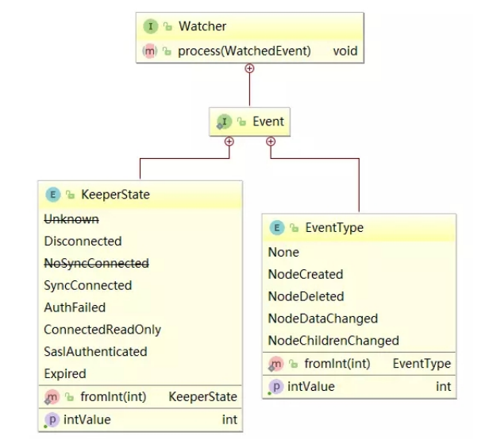

[TOC]

## Zookeeper应用场景&数据模型&常用命令&ACL权限控制&JavaAPI

[Zookeeper应用场景&数据模型&常用命令&ACL权限控制&JavaAPI](./README.md)

## 1. Zookeeper 事件监听机制
### 1.1 Watcher概念
Zookeeper提供了数据的发布/订阅功能，多个订阅者可同时监听某一特定主题对象，当该主题对象的自身状态发生变化时(例如节点内容改变、节点下的子节点列表改变等)，会实时、主动通知所有订阅者

Zookeeper采用了Watcher机制实现数据的发布/订阅功能。该机制在被订阅对象发生变化时会异步通知客户端，因此客户端不必在Watcher注册后轮询阻塞，从而减轻了客户端压力。

Watcher机制实际上与观察者模式类似，也可看作是一种观察者模式在分布式场景下的实现方式。

### 1.2 watcher架构
Watcher实现由三个部分组成
- Zookeeper服务端
- Zookeeper客户端
- 客户端的`ZKWatchManager`对象

客户端首先将Watcher注册到服务端，同时将Watcher对象保存到客户端的Watch管理器中。当ZooKeeper服务端监听的数据状态发生变化时，服务端会主动通知客户端，接着客户端的Watch管理器会触发相关Watcher来回调相应处理逻辑，从而完成整体的数据发布/订阅流程。


### 1.3 Watcher特性

| 特性 			| 说明 |
| ----------|---------------------|
| 一次性			| watcher是一次性的，一旦被触发就会移除，再次使用时需要重新注册 |
| 客户端顺序回调	| watcher回调是顺序串行化执行的，只有回调后客户端才能看到最新的数据状态。一个watcher回调逻辑不应该太多，以免影响别的watcher执行 |
| 轻量级			| WatchEvent是最小的通信单元，结构上只包含通知状态、事件类型和节点路径，并不会告诉数据节点变化前后的具体内容； |
| 时效性			| watcher只有在当前session彻底失效时才会无效，若在session有效期内快速重连成功，则watcher依然存在，仍可接收到通知； |

### 1.4 watcher接口设计
Watcher是一个接口，任何实现了Watcher接口的类就是一个新的Watcher。

Watcher内部包含了两个枚举类
- KeeperState
- EventType




Watcher通知状态`KeeperState`
- KeeperState是客户端与服务端连接状态发生变化时对应的通知类型。路径为`org.apache.zookeeper.Watcher.Event.KeeperState`，是一个枚举类，其枚举属性

| 枚举属性        | 说明 |
|-------------|--------------|
| SyncConnected |   客户端与服务器正常连接时 |
| Disconnected  |   客户端与服务器断开连接时 |
| Expired       |   会话session失效时 |
| AuthFailed    |   身份认证失败时 |

Watcher事件类型`EventType`
- EventType是数据节点(znode)发生变化时对应的通知类型。EventType变化时 KeeperState永远处于SyncConnected通知状态下；当KeeperState发生变化时，EventType永远为None。其路径为org.apache.zookeeper.Watcher.Event.EventType，是一个枚举类，枚举属性

| 枚举属性            | 说明 |
|--------|-----------------------|
| None                | 无 |
| NodeCreated         | Watcher监听的数据节点被创建时 |
| NodeDeleted         | Watcher监听的数据节点被删除时 |
| NodeDataChanged     | Watcher监听的数据节点内容发生变更时(无论内容数据是否变化) |
| NodeChildrenChanged | Watcher监听的数据节点的子节点列表发生变更时 |

- 客户端接收到的相关事件通知中只包含状态及类型等信息，不包括节点变化前后的具体内容，变化前的数据需业务自身存储，变化后的数据需调用get等方法重新获取；


### 1.5 捕获相应的事件
上面讲到Zookeeper客户端连接的状态和Zookeeper对`znode`节点监听的事件类型，下面如何建立Zookeeper的`watcher`监听。在Zookeeper中采用`zk.getChildren(path, watch)`、`zk
.exists(path, watch)`、`zk.getData(path, watcher, stat)`这样的方式为某个`znode`注册监听。

下表以`node-x`节点为例，说明调用的注册方法和可监听事件间的关系

| 注册方式                             | Created  |  ChildrenChanged | Changed|  Deleted
|-------------------------|----------|--------|-------|--------|
| zk.exists("/nodex",watcher)      |   可监控    |                | 可监控 | 可监控
| zk.getData("/nodex",watcher)     |          |                   | 可监控 | 可监控
| zk.getChildren("/nodex",watcher) |          |    可监控         |        | 可监控

### 1.6 注册watcher的方法
#### 1.6.1 客服端与服务器的连接状态

客户端捕获与服务端连接四种状态。此时事件类型为 none
KeeperState 通知四种状态
- `SyncConnected` 客户端与服务器正常连接时
- `Disconnected` 客户端与服务器断开连接时
- `Expired` 会话session失效时
- `AuthFailed` 身份认证失败时

案例
```java
package tk.deriwotua.zookeeper.watcher;

import org.apache.zookeeper.WatchedEvent;
import org.apache.zookeeper.Watcher;
import org.apache.zookeeper.ZooKeeper;

import java.util.concurrent.CountDownLatch;

/**
 * 监视器首先实现Watcher接口process()方法
 */
public class ZKConnectionWatcher implements Watcher {

    // 计数器对象
    static CountDownLatch countDownLatch = new CountDownLatch(1);
    // 连接对象
    static ZooKeeper zooKeeper;

    /**
     * 当服务端有消息通知客户端时 回调process方法
     * @param event
     */
    public void process(WatchedEvent event) {
        try {
            // 事件类型为 none
            if (event.getType() == Event.EventType.None) {
                /**
                 * KeeperState 通知四种状态
                 *  `SyncConnected` 客户端与服务器正常连接时
                 *  `Disconnected` 客户端与服务器断开连接时
                 *  `Expired` 会话session失效时
                 *  `AuthFailed` 身份认证失败时
                 */
                if (event.getState() == Event.KeeperState.SyncConnected) {
                    System.out.println("连接创建成功!");
                    // 连接创建成功后唤醒主线程
                    countDownLatch.countDown();
                } else if (event.getState() == Event.KeeperState.Disconnected) {
                    System.out.println("断开连接！");
                    /**
                     * 异常断开后比如网络中断这里可以捕获到连接断开事件
                     * 在这里可以编写一些邮件通知逻辑
                     */
                } else if (event.getState() == Event.KeeperState.Expired) {
                    // 连接中断后如果在超时时间内没有重连上服务端就被这里捕获到
                    System.out.println("会话超时!");
                    // 超时后会自动移除连接对象这里捕获到超时事件后再次创建新客户端到服务器连接对象
                    zooKeeper = new ZooKeeper("127.0.0.1:2181", 5000, new ZKConnectionWatcher());
                } else if (event.getState() == Event.KeeperState.AuthFailed) {
                    /**
                     * 捕获认证失败事件
                     */
                    System.out.println("认证失败！");
                }
            }
        } catch (Exception ex) {
            ex.printStackTrace();
        }
    }

    public static void main(String[] args) {
        try {
            /**
             * 自定义watcher创建zookeeper连接(异步)
             * 如果连接中断在超时时间内zookeeper不会立即释放连接而是会保留zooKeeper连接对象且在此期间会尝试重连超过超时时间后会移除掉
             */
            zooKeeper = new ZooKeeper("127.0.0.1:2181", 5000, new ZKConnectionWatcher());
            // 阻塞线程等待连接的创建
            countDownLatch.await();
            // 连接创建成功后通过countDownLatch.countDown()唤醒主线程 获取会话id
            System.out.println(zooKeeper.getSessionId());

            /**
             * 命令行创建 node1节点 设置权限
             *  create /node1 "node1"
             *  addauth digest deriwotua:123456
             *  setAcl /node1 auth:deriwotua:cdrwa
             * 然后读取node1节点数据
             */
            // 添加授权用户
            zooKeeper.addAuthInfo("digest", "deriwotua:123456".getBytes());
            // 读取node1节点数据
            byte[] bs = zooKeeper.getData("/node1", false, null);
            System.out.println(new String(bs));  // node1
            // 如果这里授权信息错误 这里密码错误
            zooKeeper.addAuthInfo("digest", "deriwotua:1234561".getBytes());
            // 读取node1节点数据 会触发认证失败异常 上面监听器会捕获到认证失败的
            bs = zooKeeper.getData("/node1", false, null);

            Thread.sleep(50000);
            zooKeeper.close();
            System.out.println("结束");
        } catch (Exception ex) {
            ex.printStackTrace();
        }
    }

}
```

#### 1.6.1 检查节点是否存在

exists可以捕获到节点的三种事件类型
- NodeCreated:节点创建
- NodeDeleted:节点删除
- NodeDataChanged:节点内容发生变化

```java
/**
 * 使用连接对象的监视器
 *      path    znode路径
 *      b       是否使用连接对象中注册的监视器
 */
exists(String path, boolean b)
/**
 * 自定义监视器
 *      path    znode路径
 *      w       监视器对象
 */
exists(String path, Watcher w)
```

案例
```java
package tk.deriwotua.zookeeper.watcher;

import org.apache.zookeeper.KeeperException;
import org.apache.zookeeper.WatchedEvent;
import org.apache.zookeeper.Watcher;
import org.apache.zookeeper.ZooKeeper;
import org.junit.After;
import org.junit.Before;
import org.junit.Test;

import java.io.IOException;
import java.util.concurrent.CountDownLatch;

/**
 *  通过exists方法给节点注册可以捕获到节点的三种事件类型
 *      NodeCreated:节点创建
 *      NodeDeleted:节点删除
 *      NodeDataChanged:节点内容发生变化
 */
public class ZKWatcherExists {

    String IP = "127.0.0.1:2181";
    ZooKeeper zooKeeper = null;

    @Before
    public void before() throws IOException, InterruptedException {
        final CountDownLatch countDownLatch = new CountDownLatch(1);
        // 连接zookeeper客户端
        zooKeeper = new ZooKeeper(IP, 6000,
                /**
                 * Watcher监听zookeeper事件变化
                 */
                new Watcher() {
                    public void process(WatchedEvent event) {
                        System.out.println("连接对象的参数!");
                        // 连接成功
                        if (event.getState() == Event.KeeperState.SyncConnected) {
                            countDownLatch.countDown();
                        }
                        System.out.println("path=" + event.getPath());
                        System.out.println("eventType=" + event.getType());
                    }
                });
        countDownLatch.await();
    }

    @After
    public void after() throws InterruptedException {
        zooKeeper.close();
    }

    /**
     * 方式一：通过exists方法给节点注册使用连接对象的监视器
     * 方法执行后使用命令行执行
     *      create /watcher1 "watcher1"
     *  就会触发上面Watcher#process()可以捕获到节点NodeCreated创建事件
     * 命令行执行
     *      set /watcher1 "watcher2"
     *  同样会触发上面Watcher#process()可以捕获到节点NodeDataChanged内容变更事件
     * 命令行执行
     *      delete /watcher1
     *  同样会触发上面Watcher#process()可以捕获到节点NodeDeleted节点删除事件
     *
     * @throws KeeperException
     * @throws InterruptedException
     */
    @Test
    public void watcherExists1() throws KeeperException, InterruptedException {
        /**
         * arg1:节点的路径
         * arg2:使用上面创建连接对象时参数指定匿名内部类实现watcher
         */
        zooKeeper.exists("/watcher1", true);
        Thread.sleep(50000);
        System.out.println("结束");
    }

    /**
     * 方式二：通过自定义监听器
     * @throws KeeperException
     * @throws InterruptedException
     */
    @Test
    public void watcherExists2() throws KeeperException, InterruptedException {
        /**
         * arg1:节点的路径
         * arg2:自定义watcher对象
         */
        zooKeeper.exists("/watcher1", new Watcher() {
            /**
             * 自定义Watcher监听器
             * @param event
             */
            public void process(WatchedEvent event) {
                System.out.println("自定义watcher");
                System.out.println("path=" + event.getPath());
                System.out.println("eventType=" + event.getType());
            }
        });
        Thread.sleep(50000);
        System.out.println("结束");
    }

    /**
     * Watcher事件是一次性的
     *  命令行创建 watcher1节点
     *      create /watcher1 "watcher1"
     *  然后执行本方法给 watcher1注册自定义监听器
     * @throws KeeperException
     * @throws InterruptedException
     */
    @Test
    public void watcherExists3() throws KeeperException, InterruptedException {
        Watcher watcher = new Watcher() {
            public void process(WatchedEvent event) {
                try {
                    /**
                     *  命令行修改 watcher1节点
                     *      set /watcher1 "watcher11"
                     *  此时在程序控制台里可以看到 下面打印的信息
                     */
                    System.out.println("自定义watcher");
                    System.out.println("path=" + event.getPath());
                    System.out.println("eventType=" + event.getType());
                    /**
                     * 然后再次命令行修改 watcher1节点
                     *      set /watcher1 "watcher111"
                     * 此时在程序控制台里就不会再有上面信息打印 因为watcher是一次性的
                     *      一次注册一次通知
                     * 如果需要在 watcher1节点任何变更都能收到通知怎么办
                     *      可以在捕获到后再次给 watcher1节点注册监听器
                     */
                    zooKeeper.exists("/watcher1", this);
                    /**
                     * 此后Watcher就可以一直监听watcher1节点数据变化
                     */
                } catch (Exception ex) {
                    ex.printStackTrace();
                }
            }
        };
        zooKeeper.exists("/watcher1", watcher);
        Thread.sleep(80000);
        System.out.println("结束");
    }

    /**
     * 可以给节点注册多个监听器对象
     * @throws KeeperException
     * @throws InterruptedException
     */
    @Test
    public void watcherExists4() throws KeeperException, InterruptedException {
        /**
         * 监听器一
         */
        zooKeeper.exists("/watcher1", new Watcher() {
            public void process(WatchedEvent event) {
                System.out.println("1");
                System.out.println("path=" + event.getPath());
                System.out.println("eventType=" + event.getType());
            }
        });
        /**
         * 监听器二
         */
        zooKeeper.exists("/watcher1", new Watcher() {
            public void process(WatchedEvent event) {
                System.out.println("2");
                System.out.println("path=" + event.getPath());
                System.out.println("eventType=" + event.getType());
            }
        });
        Thread.sleep(80000);
        System.out.println("结束");
    }
}
```

#### 1.6.2 查看节点

getData()方法可以捕获到节点的两种事件
- NodeDeleted:节点删除
- NodeDataChanged:节点内容发生变化

```java
/**
 * 使用连接对象的监视器
 *  path    znode路径
 *  b       是否使用连接对象中注册的监视器
 *  stat    返回znode的元数据
 */
getData(String path, boolean b, Stat stat)
/**
 * 自定义监视器
 *  path    znode路径
 *  w       监视器对象
 *  stat    返回znode的元数据
 */
getData(String path, Watcher w, Stat stat)
```

案例
```java
package tk.deriwotua.zookeeper.watcher;

import org.apache.zookeeper.KeeperException;
import org.apache.zookeeper.WatchedEvent;
import org.apache.zookeeper.Watcher;
import org.apache.zookeeper.ZooKeeper;
import org.junit.After;
import org.junit.Before;
import org.junit.Test;

import java.io.IOException;
import java.util.concurrent.CountDownLatch;

/**
 * getData()方法可以捕获到节点的两种事件
 * NodeDeleted:节点删除
 * NodeDataChanged:节点内容发生变化
 */
public class ZKWatcherGetData {

    String IP = "127.0.0.1:2181";
    ZooKeeper zooKeeper = null;

    @Before
    public void before() throws IOException, InterruptedException {
        final CountDownLatch countDownLatch = new CountDownLatch(1);
        // 连接zookeeper客户端
        zooKeeper = new ZooKeeper(IP, 6000,
                /**
                 * 创建连接时匿名内部类监听器对象
                 */
                new Watcher() {
                    public void process(WatchedEvent event) {
                        System.out.println("连接对象的参数!");
                        // 连接成功
                        if (event.getState() == Event.KeeperState.SyncConnected) {
                            countDownLatch.countDown();
                        }
                        System.out.println("path=" + event.getPath());
                        System.out.println("eventType=" + event.getType());
                    }
                });
        countDownLatch.await();
    }

    @After
    public void after() throws InterruptedException {
        zooKeeper.close();
    }

    /**
     * 通过getData方法给节点注册连接创建时匿名内部类监听器对象
     *
     * 命令行先创建 watcher2节点
     *      create /watcher2 "watcher2"
     * 然后执行此方法
     * 再命令行中修改 watcher2节点
     *      set /watcher2 "watcher22"
     * 上面匿名内部类监听器对象可捕获到此次watcher2数据变更
     * 再命令行删除 watcher2节点
     *      delete /watcher2
     * 上面匿名内部类监听器对象可捕获到此次watcher2节点删除
     *
     * @throws KeeperException
     * @throws InterruptedException
     */
    @Test
    public void watcherGetData1() throws KeeperException, InterruptedException {
        /**
         * arg1:节点的路径
         * arg2:使用连接对象中的watcher
         */
        zooKeeper.getData("/watcher2", true, null);
        Thread.sleep(50000);
        System.out.println("结束");
    }

    /**
     * 通过getData()方法给节点注册自定义匿名内部类监听器
     *      可以一直捕获到节点数据变更、节点删除
     * @throws KeeperException
     * @throws InterruptedException
     */
    @Test
    public void watcherGetData2() throws KeeperException, InterruptedException {
        /**
         * arg1:节点的路径
         * arg2:自定义watcher对象
         */
        zooKeeper.getData("/watcher2", new Watcher() {
            public void process(WatchedEvent event) {
                System.out.println("自定义watcher");
                System.out.println("path=" + event.getPath());
                System.out.println("eventType=" + event.getType());
            }
        }, null);
        Thread.sleep(50000);
        System.out.println("结束");
    }

    /**
     * 注册Watcher实现类方式注册监听器(一次性的)
     * @throws KeeperException
     * @throws InterruptedException
     */
    @Test
    public void watcherGetData3() throws KeeperException, InterruptedException {
        // 一次性
        Watcher watcher = new Watcher() {
            public void process(WatchedEvent event) {
                try {
                    System.out.println("自定义watcher");
                    System.out.println("path=" + event.getPath());
                    System.out.println("eventType=" + event.getType());
                    /**
                     * 注册需要注意节点数据变更时再次注册
                     * 节点被删除了还注册会导致节点不存在会报错
                     */
                    if (event.getType() == Event.EventType.NodeDataChanged) {
                        /**
                         * 每次捕获后重新注册保证监听器一直可用
                         */
                        zooKeeper.getData("/watcher2", this, null);
                    }
                } catch (Exception ex) {
                    ex.printStackTrace();
                }
            }
        };
        zooKeeper.getData("/watcher2", watcher, null);
        Thread.sleep(50000);
        System.out.println("结束");
    }

    /**
     * 给节点注册多个监听器
     * @throws KeeperException
     * @throws InterruptedException
     */
    @Test
    public void watcherGetData4() throws KeeperException, InterruptedException {
        // 注册多个监听器对象
        zooKeeper.getData("/watcher2", new Watcher() {
            public void process(WatchedEvent event) {
                try {
                    System.out.println("1");
                    System.out.println("path=" + event.getPath());
                    System.out.println("eventType=" + event.getType());
                    if (event.getType() == Event.EventType.NodeDataChanged) {
                        zooKeeper.getData("/watcher2", this, null);
                    }
                } catch (Exception ex) {
                    ex.printStackTrace();
                }
            }
        }, null);
        zooKeeper.getData("/watcher2", new Watcher() {
            public void process(WatchedEvent event) {
                try {
                    System.out.println("2");
                    System.out.println("path=" + event.getPath());
                    System.out.println("eventType=" + event.getType());
                    if (event.getType() == Event.EventType.NodeDataChanged) {
                        zooKeeper.getData("/watcher2", this, null);
                    }
                } catch (Exception ex) {
                    ex.printStackTrace();
                }
            }
        }, null);
        Thread.sleep(50000);
        System.out.println("结束");
    }
}
```


#### 1.6.3 查看子节点

getChildren()方法可以捕获节点两种事件
- NodeChildrenChanged:子节点发生变化
- NodeDeleted:节点删除

```java
/**
 * 使用连接对象的监视器
 *  path    znode路径
 *  b       是否使用连接对象中注册的监视器
 */
getChildren(String path, boolean b)
/**
 * 自定义监视器
 *  path    znode路径
 *  w       监视器对象
 */
getChildren(String path, Watcher w)
```

案例
```java
package tk.deriwotua.zookeeper.watcher;

import org.apache.zookeeper.KeeperException;
import org.apache.zookeeper.WatchedEvent;
import org.apache.zookeeper.Watcher;
import org.apache.zookeeper.ZooKeeper;
import org.junit.After;
import org.junit.Before;
import org.junit.Test;

import java.io.IOException;
import java.util.concurrent.CountDownLatch;

/**
 * getChildren()方法可以捕获节点两种事件
 *      NodeChildrenChanged:子节点发生变化
 *      NodeDeleted:节点删除
 */
public class ZKWatcherGetChild {
    String IP = "127.0.0.1:2181";
    ZooKeeper zooKeeper = null;

    @Before
    public void before() throws IOException, InterruptedException {
        final CountDownLatch connectedSemaphore = new CountDownLatch(1);
        // 连接zookeeper客户端
        zooKeeper = new ZooKeeper(IP, 6000,
                /**
                 * 创建连接时指定匿名内部类监听器对象
                 */
                new Watcher() {
                    public void process(WatchedEvent event) {
                        System.out.println("连接对象的参数!");
                        // 连接成功
                        if (event.getState() == Event.KeeperState.SyncConnected) {
                            connectedSemaphore.countDown();
                        }
                        System.out.println("path=" + event.getPath());
                        System.out.println("eventType=" + event.getType());
                    }
                });
        connectedSemaphore.await();
    }

    @After
    public void after() throws InterruptedException {
        zooKeeper.close();
    }

    /**
     * 通过getChildren方法给节点注册连接创建时指定匿名内部类监听器对象
     * @throws KeeperException
     * @throws InterruptedException
     */
    @Test
    public void watcherGetChild1() throws KeeperException, InterruptedException {
        /**
         * arg1:节点的路径
         * arg2:使用连接对象中的watcher
         */
        zooKeeper.getChildren("/watcher3", true);
        Thread.sleep(50000);
        System.out.println("结束");
    }

    /**
     * 通过getChildren方法给节点注册自定义匿名内部类监听器对象
     * @throws KeeperException
     * @throws InterruptedException
     */
    @Test
    public void watcherGetChild2() throws KeeperException, InterruptedException {
        /**
         * arg1:节点的路径
         * arg2:自定义watcher
         */
        zooKeeper.getChildren("/watcher3", new Watcher() {
            public void process(WatchedEvent event) {
                System.out.println("自定义watcher");
                System.out.println("path=" + event.getPath());
                System.out.println("eventType=" + event.getType());
            }
        });
        Thread.sleep(50000);
        System.out.println("结束");
    }

    /**
     * 通过getChildren方法给节点注册Watcher实现类监听器对象(一次性)
     * @throws KeeperException
     * @throws InterruptedException
     */
    @Test
    public void watcherGetChild3() throws KeeperException, InterruptedException {
        // 一次性
        Watcher watcher = new Watcher() {
            public void process(WatchedEvent event) {
                try {
                    System.out.println("自定义watcher");
                    System.out.println("path=" + event.getPath());
                    System.out.println("eventType=" + event.getType());
                    if (event.getType() == Event.EventType.NodeChildrenChanged) {
                        zooKeeper.getChildren("/watcher3", this);
                    }
                } catch (Exception ex) {
                    ex.printStackTrace();
                }
            }
        };
        zooKeeper.getChildren("/watcher3", watcher);
        Thread.sleep(50000);
        System.out.println("结束");
    }

    /**
     * 通过getChildren方法给节点注册多个监听器
     * @throws KeeperException
     * @throws InterruptedException
     */
    @Test
    public void watcherGetChild4() throws KeeperException, InterruptedException {
        // 多个监视器对象
        zooKeeper.getChildren("/watcher3", new Watcher() {
            public void process(WatchedEvent event) {
                try {
                    System.out.println("1");
                    System.out.println("path=" + event.getPath());
                    System.out.println("eventType=" + event.getType());
                    if (event.getType() == Event.EventType.NodeChildrenChanged) {
                        zooKeeper.getChildren("/watcher3", this);
                    }
                } catch (Exception ex) {
                    ex.printStackTrace();
                }
            }
        });

        zooKeeper.getChildren("/watcher3", new Watcher() {
            public void process(WatchedEvent event) {
                try {
                    System.out.println("2");
                    System.out.println("path=" + event.getPath());
                    System.out.println("eventType=" + event.getType());
                    if (event.getType() == Event.EventType.NodeChildrenChanged) {
                        zooKeeper.getChildren("/watcher3", this);
                    }
                } catch (Exception ex) {
                    ex.printStackTrace();
                }
            }
        });
        Thread.sleep(50000);
        System.out.println("结束");
    }
}
```

### 1.7 配置中心案例
工作中有这样的一个场景: 数据库用户名和密码信息放在一个配置文件中，应用读取该配置文件，配置文件信息放入缓存。

若数据库的用户名和密码改变时候，还需要重新加载缓存，比较麻烦，通过ZooKeeper可以轻松完成，当数据库发生变化时自动完成缓存同步。

设计思路
- 连接zookeeper服务器
- 读取zookeeper中的配置信息，注册watcher监听器，存入本地变量
- 当zookeeper中的配置信息发生变化时，通过watcher的回调方法捕获数据变化事件
- 重新获取配置信息

案例
```java
package tk.deriwotua.zookeeper.example;

import org.apache.zookeeper.WatchedEvent;
import org.apache.zookeeper.Watcher;
import org.apache.zookeeper.Watcher.Event.EventType;
import org.apache.zookeeper.ZooKeeper;
import tk.deriwotua.zookeeper.watcher.ZKConnectionWatcher;

import java.util.concurrent.CountDownLatch;

/**
 * 配置中心
 *  命令行添加以下节点
 *      create /config "config"
 *      create /config/url "127.0.0.1:3306"
 *      create /config/username "root"
 *      create /config/password "123456"
 */
public class MyConfigCenter implements Watcher {

    //  zk的连接串
    String IP = "127.0.0.1:2181";
    //  计数器对象
    CountDownLatch countDownLatch = new CountDownLatch(1);
    // 连接对象
    static ZooKeeper zooKeeper;

    // 用于本地化存储配置信息
    private String url;
    private String username;
    private String password;

    @Override
    public void process(WatchedEvent event) {
        try {
            // 捕获事件状态
            if (event.getType() == EventType.None) {
                if (event.getState() == Event.KeeperState.SyncConnected) {
                    System.out.println("连接成功");
                    countDownLatch.countDown();
                } else if (event.getState() == Event.KeeperState.Disconnected) {
                    System.out.println("连接断开!");
                } else if (event.getState() == Event.KeeperState.Expired) {
                    System.out.println("连接超时!");
                    // 超时后服务器端已经将连接释放，需要重新连接服务器端
                    zooKeeper = new ZooKeeper(IP, 6000, new ZKConnectionWatcher());
                } else if (event.getState() == Event.KeeperState.AuthFailed) {
                    System.out.println("验证失败!");
                }
                // 当配置信息发生变化时
            } else if (event.getType() == EventType.NodeDataChanged) {
                initValue();
            }
        } catch (Exception ex) {
            ex.printStackTrace();
        }
    }

    // 构造方法
    public MyConfigCenter() {
        initValue();
    }

    // 连接zookeeper服务器，读取配置信息
    public void initValue() {
        try {
            // 创建连接对象
            zooKeeper = new ZooKeeper(IP, 5000, this);
            // 阻塞线程，等待连接的创建成功
            countDownLatch.await();
            // 读取配置信息
            this.url = new String(zooKeeper.getData("/config/url", true, null));
            this.username = new String(zooKeeper.getData("/config/username", true, null));
            this.password = new String(zooKeeper.getData("/config/password", true, null));
        } catch (Exception ex) {
            ex.printStackTrace();
        }
    }

    /**
     * 测试
     * @param args
     */
    public static void main(String[] args) {
        try {
            MyConfigCenter myConfigCenter = new MyConfigCenter();
            for (int i = 1; i <= 20; i++) {
                Thread.sleep(5000);
                System.out.println("url:" + myConfigCenter.getUrl());
                System.out.println("username:" + myConfigCenter.getUsername());
                System.out.println("password:" + myConfigCenter.getPassword());
                System.out.println("########################################");
            }
        } catch (Exception ex) {
            ex.printStackTrace();
        }
    }

    public String getUrl() {
        return url;
    }

    public void setUrl(String url) {
        this.url = url;
    }

    public String getUsername() {
        return username;
    }

    public void setUsername(String username) {
        this.username = username;
    }

    public String getPassword() {
        return password;
    }

    public void setPassword(String password) {
        this.password = password;
    }

}
```

### 1.8 生成分布式唯一ID

在过去的单库单表型系统中，通常可以使用数据库字段自带的auto_increment属性来自动为每条记录生成一个唯一的ID。但是分库分表后，就无法在依靠数据库的auto_increment属性来唯一标识一条记录了。此时我们就可以用zookeeper在分布式环境下生成全局唯一ID。

设计思路
- 连接zookeeper服务器
- 指定路径生成临时有序节点
- 取序列号及为分布式环境下的唯一ID

```java
package tk.deriwotua.zookeeper.example;

import org.apache.zookeeper.CreateMode;
import org.apache.zookeeper.WatchedEvent;
import org.apache.zookeeper.Watcher;
import org.apache.zookeeper.Watcher.Event.KeeperState;
import org.apache.zookeeper.ZooDefs.Ids;
import org.apache.zookeeper.ZooKeeper;
import tk.deriwotua.zookeeper.watcher.ZKConnectionWatcher;

import java.util.concurrent.CountDownLatch;

/**
 * 分布式环境下的唯一ID：指定路径生成临时有序节点
 */
public class GloballyUniqueId implements Watcher {
    //  zk的连接串
    String IP = "127.0.0.1:2181";
    //  计数器对象
    CountDownLatch countDownLatch = new CountDownLatch(1);
    //  用户生成序号的节点
    String defaultPath = "/uniqueId";
    //  连接对象
    ZooKeeper zooKeeper;

    @Override
    public void process(WatchedEvent event) {
        try {
            // 捕获事件状态
            if (event.getType() == Event.EventType.None) {
                if (event.getState() == KeeperState.SyncConnected) {
                    System.out.println("连接成功");
                    countDownLatch.countDown();
                } else if (event.getState() == KeeperState.Disconnected) {
                    System.out.println("连接断开!");
                } else if (event.getState() == KeeperState.Expired) {
                    System.out.println("连接超时!");
                    // 超时后服务器端已经将连接释放，需要重新连接服务器端
                    zooKeeper = new ZooKeeper(IP, 6000,
                            new ZKConnectionWatcher());
                } else if (event.getState() == KeeperState.AuthFailed) {
                    System.out.println("验证失败!");
                }
            }
        } catch (Exception ex) {
            ex.printStackTrace();
        }
    }

    // 构造方法
    public GloballyUniqueId() {
        try {
            //打开连接
            zooKeeper = new ZooKeeper(IP, 5000, this);
            // 阻塞线程，等待连接的创建成功
            countDownLatch.await();
        } catch (Exception ex) {
            ex.printStackTrace();
        }
    }

    // 生成id的方法
    public String getUniqueId() {
        String path = "";
        try {
            /**
             * 创建临时有序节点
             */
            path = zooKeeper.create(defaultPath, new byte[0], Ids.OPEN_ACL_UNSAFE, CreateMode.EPHEMERAL_SEQUENTIAL);
        } catch (Exception ex) {
            ex.printStackTrace();
        }
        // uniqueId0000000001 截取掉指定节点名只要序号
        return path.substring(9);
    }

    public static void main(String[] args) {
        GloballyUniqueId globallyUniqueId = new GloballyUniqueId();
        for (int i = 1; i <= 5; i++) {
            String id = globallyUniqueId.getUniqueId();
            System.out.println(id);
        }
    }

}
```

### 1.9 分布式锁
分布式锁有多种实现方式，比如通过数据库、redis都可实现。作为分布式协同工具ZooKeeper，当然也有着标准的实现方式。下面介绍在Zookeeper中如何实现排他锁。


通过互斥等手段实现分布式系统之间同步访问共享资源，以保证数据的一致性

Zookeeper中通过创建临时有序节点来表示一个锁
- 选择临时节点在于临时节点特性宕机或会话中断等临时节点自动删除

成功创建数据节点的客户端即获取锁
- 未获取锁的客户端通过监听该节点变更情况，以便重新获取锁

释放锁两种情况
- 客户端宕机会话中断临时节点自动删除
- 正常业务逻辑处理完毕后客户端自动删除自己创建的临时节点

锁流程图


Zookeeper实现分布式锁
- 各个客户端都可以在/Lock下创建临时有序节点
- /Lock下存在的节点编号排序最小的节点即为锁
- 当客户端创建节点后以此根据自己创建节点编号对比可以判断本客户端是否获取到锁资源
- 当自己创建节点编号最小时即获得锁可以执行相应业务逻辑业务执行完毕后删除自己创建的临时有序节点释放锁
- 当自己创建的节点编号不是最小的即未获得锁,此时需要注册监视比自己小1的节点事件,当其节点删除释放时再次获取锁


思路
- 每个客户端往`/Locks`下创建临时有序节点`/Locks/Lock000000001`
- 客户端取得`/Locks`下子节点，并进行排序，判断排在最前面的是否为自己，如果自己的锁节点在第一位，代表获取锁成功
- 如果自己的锁节点不在第一位，则监听自己前一位的锁节点。例如，自己锁节点`Lock 000000001`
- 当前一位锁节点（`Lock000000002`）的逻辑
- 监听客户端重新执行第2步逻辑，判断自己是否获得了锁

```java
package tk.deriwotua.zookeeper.example;

import org.apache.zookeeper.*;
import org.apache.zookeeper.data.Stat;

import java.util.Collections;
import java.util.List;
import java.util.concurrent.CountDownLatch;

/**
 * 分布式锁
 *  获取zookeeper连接对象
 *  创建Locks锁节点
 *      创建临时有序子节点
 *  尝试获取锁
 *      获取Locks节点下的所有子节点
 *      对List子节点进行排序
 *      上面创建的临时有序子节点在List中的位置位于0时表示获取到锁
 *      否则监听上一个位置子节点是否删除(释放锁)
 *          删除的话再次尝试获取锁
 *          未被删除表明上一个节点处于等待锁或获得锁后还未释放锁时此时通过监视器wait方法等待获取锁
 *              等到监视器捕获到节点删除事件(释放锁)时唤醒监视器等待的线程去尝试获取锁
 *  释放锁
 *      删除临时有序节点
 *      关闭本次客户端会话
 */
public class MyLock {
    //  zk的连接串
    String IP = "127.0.0.1:2181";
    //  计数器对象
    CountDownLatch countDownLatch = new CountDownLatch(1);
    //ZooKeeper配置信息
    ZooKeeper zooKeeper;
    private static final String LOCK_ROOT_PATH = "/Locks";
    private static final String LOCK_NODE_NAME = "Lock_";
    /**
     * 存储临时有序节点生成后节点path
     */
    private String lockPath;

    // 打开zookeeper连接
    public MyLock() {
        try {
            zooKeeper = new ZooKeeper(IP, 5000, new Watcher() {
                @Override
                public void process(WatchedEvent event) {
                    if (event.getType() == Event.EventType.None) {
                        if (event.getState() == Event.KeeperState.SyncConnected) {
                            System.out.println("连接成功!");
                            // 唤醒线程继续向下执行
                            countDownLatch.countDown();
                        }
                    }
                }
            });
            countDownLatch.await();
        } catch (Exception ex) {
            ex.printStackTrace();
        }
    }

    //获取锁
    public void acquireLock() throws Exception {
        //创建锁节点
        createLock();
        //尝试获取锁
        attemptLock();
    }

    //创建锁节点
    private void createLock() throws Exception {
        //判断Locks是否存在，不存在创建
        Stat stat = zooKeeper.exists(LOCK_ROOT_PATH, false);
        if (stat == null) {
            // 不存在时创建节点
            zooKeeper.create(LOCK_ROOT_PATH, new byte[0], ZooDefs.Ids.OPEN_ACL_UNSAFE, CreateMode.PERSISTENT);
        }
        // 创建临时有序子节点
        lockPath = zooKeeper.create(LOCK_ROOT_PATH + "/" + LOCK_NODE_NAME, new byte[0], ZooDefs.Ids.OPEN_ACL_UNSAFE, CreateMode.EPHEMERAL_SEQUENTIAL);
        System.out.println("节点创建成功:" + lockPath);
    }

    /**
     * 监视器对象，监视上一个节点是否被删除
     *  删除即上一个获取锁后执行完锁操作后释放锁
     */
    Watcher watcher = new Watcher() {
        @Override
        public void process(WatchedEvent event) {
            if (event.getType() == Event.EventType.NodeDeleted) {
                // 捕获到节点删除事件后 同步代码块唤醒等待线程
                synchronized (this) {
                    notifyAll();
                }
            }
        }
    };

    /**
     * 尝试获取锁
     * @throws Exception
     */
    private void attemptLock() throws Exception {
        // 获取Locks节点下的所有子节点
        List<String> list = zooKeeper.getChildren(LOCK_ROOT_PATH, false);
        // 对子节点进行排序 自然顺序
        Collections.sort(list);
        // 临时有序节点path: /Locks/Lock_000000001 取出子节点名称 Lock_000000001
        int index = list.indexOf(lockPath.substring(LOCK_ROOT_PATH.length() + 1));
        if (index == 0) {
            System.out.println("获取锁成功!");
            return;
        } else {
            // 上一个节点的路径
            String path = list.get(index - 1);
            /**
             * 监视上一个节点
             */
            Stat stat = zooKeeper.exists(LOCK_ROOT_PATH + "/" + path, watcher);
            // 上一个节点已经删除锁释放掉了
            if (stat == null) {
                // 再次尝试获取锁
                attemptLock();
            } else {
                // 上一个节点处于等待锁或获得锁后还未释放锁时等待
                synchronized (watcher) {
                    // 等待获取锁 当监听器捕获到节点删除时唤醒这里 继续执行
                    watcher.wait();
                }
                attemptLock();
            }
        }

    }

    /**
     * 释放锁
     * @throws Exception
     */
    public void releaseLock() throws Exception {
        //删除临时有序节点
        zooKeeper.delete(this.lockPath, -1);
        zooKeeper.close();
        System.out.println("锁已经释放:" + this.lockPath);
    }

    /**
     * 测试
     * @param args
     */
    public static void main(String[] args) {
        try {
            MyLock myLock = new MyLock();
            myLock.createLock();
        } catch (Exception ex) {
            ex.printStackTrace();
        }
    }
}

package tk.deriwotua.zookeeper.example;

/**
 * 模拟售票
 */
public class TicketSeller {

    private void sell() {
        System.out.println("售票开始");
        // 线程随机休眠数毫秒，模拟现实中的费时操作
        int sleepMillis = 5000;
        try {
            //代表复杂逻辑执行了一段时间
            Thread.sleep(sleepMillis);
        } catch (InterruptedException e) {
            e.printStackTrace();
        }
        System.out.println("售票结束");
    }

    /**
     * 同步售票代码
     * @throws Exception
     */
    public void sellTicketWithLock() throws Exception {
        MyLock lock = new MyLock();
        // 获取锁
        lock.acquireLock();
        sell();
        //释放锁
        lock.releaseLock();
    }

    public static void main(String[] args) throws Exception {
        TicketSeller ticketSeller = new TicketSeller();
        for (int i = 0; i < 10; i++) {
            ticketSeller.sellTicketWithLock();
        }
    }
}
```

## 2. zookeeper 集群搭建
单机环境下，jdk、zookeeper 安装完毕，基于一台虚拟机，进行zookeeper伪集群搭建，zookeeper集群中包含3个节点，节点对外提供服务端口号分别为`2181`、`2182`、`2183`

- 基于zookeeper-3.4.10复制三份zookeeper安装好的服务器文件，目录名称分别为`zookeeper2181`、`zookeeper2182`、`zookeeper2183`
  ```shell script
  cp -r zookeeper-3.4.10 zookeeper2181
  cp -r zookeeper-3.4.10 zookeeper2182
  cp -r zookeeper-3.4.10 zookeeper2183
  ```
- 修改`zookeeper2181`服务器对应配置文件
  ```shell script
  #服务器对应端口号
  clientPort=2181
  #数据快照文件所在路径
  dataDir=/home/zookeeper/zookeeper2181/data
  #集群配置信息
  # server.A=B:C:D
  # A：是一个数字，表示这个是服务器的编号 唯一
  # B：是这个服务器的ip地址
  # C：Zookeeper服务器之间的通信端口
  # D：Leader选举的端口
  server.1=192.168.60.130:2287:3387
  server.2=192.168.60.130:2288:3388
  server.3=192.168.60.130:2289:3389
  ```
- 配置文件中配置当前节点编号。在上一步 `dataDir` 指定的目录下，创建 `myid` 文件，然后在该文件添加上一步`server` 配置的对应 `A` 数字
  ```shell script
  #zookeeper2181对应的数字为1
  #/home/zookeeper/zookeeper2181/data目录下执行命令
  echo "1" > myid
  ```
- `zookeeper2182`、`zookeeper2183`参照上面步骤进行相应配置

- 分别启动三台服务器登录到集群节点
  ```shell script
  ./zkCli.sh -server 192.168.60.130:2181
  ./zkCli.sh -server 192.168.60.130:2182
  ./zkCli.sh -server 192.168.60.130:2183
  
  # 然后再任意一个服务器节点上创建节点在其它两个服务器节点上都可以获取到
  ```

## 3. `zab`协议一致性协议
`zab`协议的全称是 **Zookeeper Atomic Broadcast** （zookeeper原子广播）。Zookeeper 是通过 `zab`协议来保证分布式事务的最终一致性

Zab一致性协议
> [参见拓展](./04.拓展.md)

- 消息广播
  - 在Zookeeper集群中消息的事务请求采用消息广播模式。Zookeeper中消息的事务请求与二阶段提交相似但却又不同。二阶段提交要求协调者必须等到所有参与者全部反馈ACK确认消息后，再发送commit消息。要求所有参与者要么全部成功要么全部失败。二阶段提交会产生严重阻塞问题；而Zookeeper在每个阶段的ACK消息达半数以上即可提交消息。
- 崩溃恢复
  - 如果Leader服务器发送崩溃，则Zookeeper集群j进行Leader服务器选举进行崩溃恢复以及数据同步；
  - Zookeeper采用FastLeaderElection算法进行选举出新的Leader节点；其选举的优先级条件依次为`Epoch`、`Zxid`、`Sid`
  

基于`zab`协议，zookeeper集群中的角色主要有以下三类
- 领导者。负责进行投票的发起和决议，更新系统状态
- 跟随者。用于接收客户请求并向客户端返回数据结果，在选主过程中参与投票
- 观察者。可以接收客户端连接，将写请求转发给leader节点。但不参与投票过程，只同步leader的状态。目的是为了扩展系统，提高读取速度


zab广播模式工作原理，通过类似两阶段提交协议的方式解决数据一致性


领导者写数据六个步骤
- leader从客户端收到一个写请求
- leader生成一个新的事务并为这个事务生成一个唯一的ZXID
- leader将这个事务提议(propose)发送给所有的follows节点
- follower节点将收到的事务请求加入到历史队列(history queue)中,并发送ack消息给leader
- 当leader收到大多数follower(半数以上节点)的ack消息，leader会发送commit请求
- 当follower收到commit请求时，从历史队列中将事务请求commit

## 4. zookeeper的leader选举
### 4.1 服务器状态

通过`./zkServer.sh status`查看集群中节点状态
```shell script
./zkServer.sh status
Node: leader  # 领导者节点
```

节点状态
- `looking` 寻找leader状态。当服务器处于该状态时，它会认为当前集群中没有leader，因此需要进入leader选举状态。
- `leading` 领导者状态。表明当前服务器角色是leader。
- `following` 跟随者状态。表明当前服务器角色是follower。
- `observing` 观察者状态。表明当前服务器角色是observer。


### 4.2 服务器启动时期的leader选举
在集群初始化阶段，当有一台服务器`server1`启动时，其单独无法进行和完成leader选举，当第二台服务器`server2`启动时，此时两台机器可以相互通信，每台机器都试图找到`leader`，于是进入`leader`选举过程: 五个步骤两轮选举
- 每个`server`发出一个投票。由于是初始情况，`server1`和`server2`都会将自己作为`leader`服务器来进行投票，每次投票会包含所推举的服务器的`myid`和`zxid`，使用`(myid, zxid)`来表示，此时`server1`的投票为`(1, 0)`，`server2`的投票为`(2, 0)`，然后各自将这个投票发给集群中其他机器。
- 集群中的每台服务器接收来自集群中各个服务器的投票。
- 处理投票。针对每一个投票，服务器都需要将别人的投票和自己的投票进行PK，PK规则如下
  - 优先检查`zxid`事务id。`zxid`比较大的服务器优先作为leader。
  - 如果`zxid`相同，那么就比较`myid`。`myid`较大的服务器作为leader服务器。
  - 对于`Server1`而言，它的投票是`(1, 0)`，接收`Server2`的投票为`(2, 0)`，首先会比较两者的`zxid`，均为`0`，再比较`myid`，此时`server2`的`myid`最大，于是更新自己的投票为`(2, 0)`，然后重新投票，对于`server2`而言，其无须更新自己的投票，只是再次向集群中所有机器发出上一次投票信息即可。
- 统计投票。每次投票后，服务器都会统计投票信息，判断是否已经有过半机器接受到相同的投票信息，对于`server1`、`server2`而言，都统计出集群中已经有两台机器接受了`(2, 0)`的投票信息，此时便认为已经选出了`leader`
- 改变服务器状态。一旦确定了`leader`，每个服务器就会更新自己的状态，如果是`follower`，那么就变更为`following`状态，如果是`leader`，就变更为`leading`状态。

### 4.3 服务器运行时期的Leader选举
在zookeeper运行期间，leader与非leader服务器各司其职，即便当有非leader服务器宕机或新加入，此时也不会影响leader，但是一旦**leader服务器挂了，那么整个集群将暂停对外服务**，进入新一轮leader选举，其过程和启动时期的Leader选举过程基本一致。

假设正在运行的有`server1`、`server2`、`server3`三台服务器，当前leader是`server2`，若某一时刻`leader`挂了，此时便开始Leader选举。选举过程如下
- 变更状态。leader挂后，余下的服务器都会将自己的服务器状态变更为`looking`状态，然后开始进入leader选举过程。
- 每个`server`会发出一个投票。在运行期间，每个服务器上的`zxid`可能不同，此时假定`server1`的`zxid`为`122`，`server3`的`zxid`为`122`，在第一轮投票中，`server1`和`server3`都会投自己，产生投票`(1, 122)`、`(3, 122)`，然后各自将投票发送给集群中所有机器。
- 接收来自各个服务器的投票。与启动时过程相同
- 处理投票。与启动时过程相同，此时`server3`将会成为leader。
- 统计投票。与启动时过程相同。
- 改变服务器的状态。与启动时过程相同。

## 5. observer角色及其配置
observer角色特点
- 不参与集群的leader选举
- 不参与集群中写数据时的`ack`反馈
  - 为了使用observer角色，在任何想变成observer角色的配置文件中加入如下配置
    ```shell script
    peerType=observer
    ```
  - 并在所有server的配置文件中，配置成observer模式的server的那行配置追加`:observer`
    ```shell script
    server.3=192.168.60.130:2289:3389:observer
    ```

## 6. zookeeperAPI连接集群

```java
/**
 *  connectionString    zooKeeper集合主机。逗号分隔
 *  sessionTimeout      会话超时（以毫秒为单位）
 *  watcher             实现“监视器”界面的对象。ZooKeeper集合通过监视器对象返回连接状态。
 */
ZooKeeper(String connectionString, int sessionTimeout, Watcher watcher)
```

案例
```java
import org.apache.zookeeper.WatchedEvent;
import org.apache.zookeeper.Watcher;
import org.apache.zookeeper.ZooKeeper;
import java.util.concurrent.CountDownLatch;
public class ZookeeperConnection {
    public static void main(String[] args) {
        try {
            // 计数器对象
            CountDownLatch countDownLatch = new CountDownLatch(1);
            // arg1:服务器的ip和端口
            // arg2:客户端与服务器之间的会话超时时间 以毫秒为单位的
            // arg3:监视器对象
            ZooKeeper zooKeeper = new ZooKeeper("192.168.60.130:2181,192.168.60.130:2182,192.168.60.130:2183", 5000, new Watcher() {
                @Override
                public void process(WatchedEvent event) {
                    if(event.getState()==Event.KeeperState.SyncConnected) {
                        System.out.println("连接创建成功!");
                        countDownLatch.countDown();
                    }
                }
            });
            // 主线程阻塞等待连接对象的创建成功
            countDownLatch.await();
            // 会话编号
            System.out.println(zooKeeper.getSessionId());
            zooKeeper.close();
        } catch (Exception ex) {
            ex.printStackTrace();
        }
    }
}
```

## Curator客户端&监控命令&ZooInspector&taokeeper

[Curator客户端&监控命令&ZooInspector&taokeeper](./03.Curator客户端&监控命令&ZooInspector&taokeeper.md)
