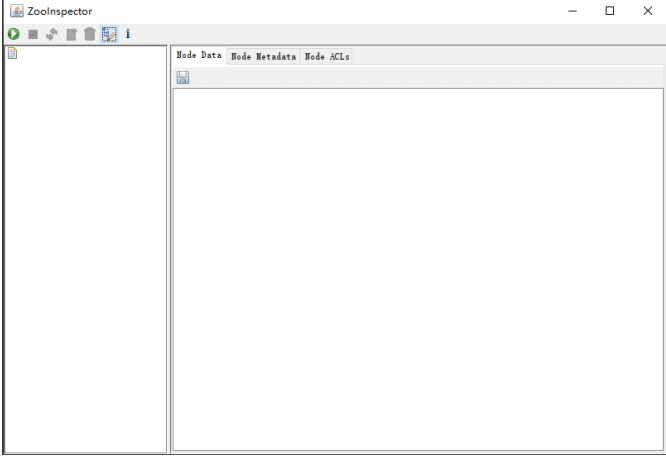
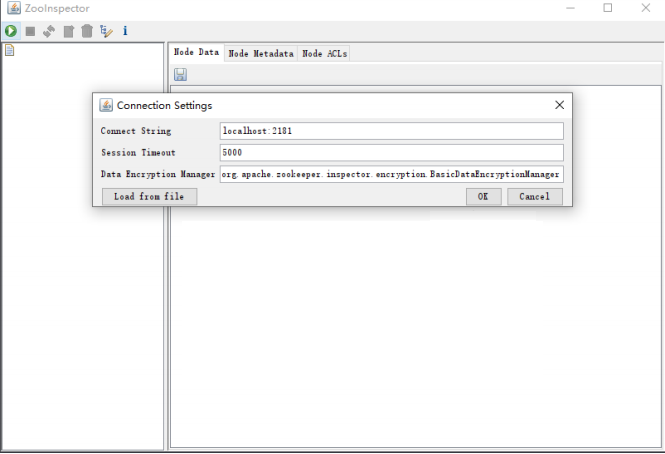
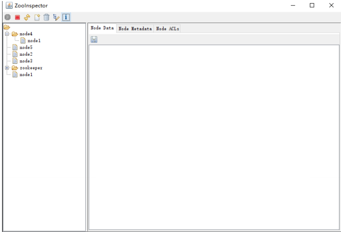
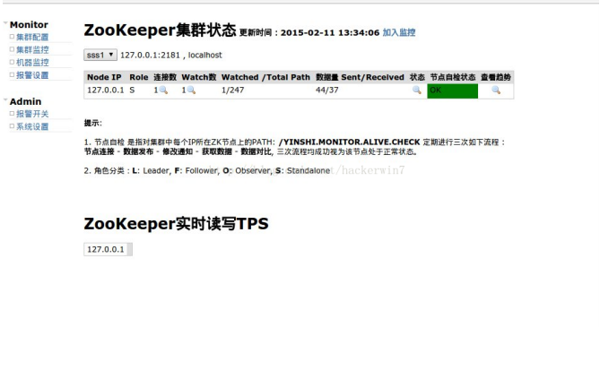

[TOC]

## Zookeeper应用场景&数据模型&常用命令&ACL权限控制&JavaAPI

[Zookeeper应用场景&数据模型&常用命令&ACL权限控制&JavaAPI](./README.md)

## Zookeeper事件监听机制&配置中心&分布式唯一id&分布式锁&集群搭建&zab一致性协议&角色&leader选举

[Zookeeper事件监听机制&配置中心&分布式唯一id&分布式锁&集群搭建&zab一致性协议&角色&leader选举](./02.Zookeeper事件监听机制&配置中心&分布式唯一id&分布式锁&集群搭建&zab一致性协议&角色&leader选举.md)

## 1. Zookeeper 开源客户端Curator介绍
### 1.1 Curator简介
`Curator`是Netflix公司开源的一个Zookeeper客户端，后捐献给Apache，curator框架在Zookeeper原生API接口上进行了包装，解决了很多ZooKeeper
客户端非常底层的细节开发。提供ZooKeeper各种应用场景(比如：`分布式锁服务`、`集群领导选举`、`共享计数器`、`缓存机制`、`分布式队列`等)的抽象封装，实现了`Fluent`风格的API接口，是最好用、最流行的Zookeeper的客户端。

原生ZookeeperAPI的不足
- 连接对象异步创建，需要开发人员自行编码等待
  - 创建连接时通过匿名内部类实现Watcher指定监视器监听与服务器连接是否成功
- 连接没有自动重连超时机制
- Watcher一次注册生效一次
- 不支持递归创建树形节点

Curator特点
- 解决session会话超时重连
- Watcher反复注册
- 简化开发API
- 遵循`Fluent`风格的API
- 提供了分布式锁服务、共享计数器、缓存机制等机制

Curator相关的maven依赖
```xml
<?xml version="1.0" encoding="UTF-8"?>
<project xmlns="http://maven.apache.org/POM/4.0.0"
         xmlns:xsi="http://www.w3.org/2001/XMLSchema-instance"
         xsi:schemaLocation="http://maven.apache.org/POM/4.0.0 http://maven.apache.org/xsd/maven-4.0.0.xsd">
    <modelVersion>4.0.0</modelVersion>

    <groupId>tk.deriwotua</groupId>
    <artifactId>zookeeper-curator</artifactId>
    <version>1.0-SNAPSHOT</version>

    <dependencies>
        <dependency>
            <groupId>junit</groupId>
            <artifactId>junit</artifactId>
            <version>4.7</version>
            <scope>test</scope>
        </dependency>
        <dependency>
            <groupId>org.apache.curator</groupId>
            <artifactId>curator-framework</artifactId>
            <version>2.6.0</version>
            <type>jar</type>
            <exclusions>
                <exclusion>
                    <groupId>org.apache.zookeeper</groupId>
                    <artifactId>zookeeper</artifactId>
                </exclusion>
            </exclusions>
        </dependency>
        <dependency>
            <groupId>org.apache.zookeeper</groupId>
            <artifactId>zookeeper</artifactId>
            <version>3.4.10</version>
            <type>jar</type>
        </dependency>
        <dependency>
            <groupId>org.apache.curator</groupId>
            <artifactId>curator-recipes</artifactId>
            <version>2.6.0</version>
            <type>jar</type>
        </dependency>
    </dependencies>
</project>
```

### 1.2 连接到ZooKeeper

通过`org.apache.curator.framework.CuratorFrameworkFactory`构建客户端然后开启连接
- 构建Curator客户端时需要设置服务器地址(集群节点逗号分隔)、会话超时时间、重连策略、命名空间、最后构建`org.apache.curator.framework.CuratorFramework`客户端

Curator客户端session重连策略通过`org.apache.curator.RetryPolicy#allowRetry()`接口方法实现重连,用的四种实现
- `org.apache.curator.retry.RetryOneTime` 中断多少秒后重连1次,只重连1次
- `org.apache.curator.retry.RetryNTimes` 中断多少秒后重连1次,重连3次
- `org.apache.curator.retry.RetryUntilElapsed` 中断多少秒后重连一次,总等待时间超过多少秒后停止重连
- `org.apache.curator.retry.ExponentialBackoffRetry` 随着重连次数增加重连间隔也越来越长

Curator客户端命名空间
- 构建`org.apache.curator.framework.CuratorFramework`客户端后通过CuratorFramework客户端创建节点时把命名空间作为父节点

Curator客户端构建后通过`org.apache.curator.framework.CuratorFramework.start()`方法建立连接，根据`org.apache.curator.framework.CuratorFramework.isStarted()`状态判断连接是否建立

```java
package tk.deriwotua.curator;

import org.apache.curator.RetryPolicy;
import org.apache.curator.framework.CuratorFramework;
import org.apache.curator.framework.CuratorFrameworkFactory;
import org.apache.curator.retry.ExponentialBackoffRetry;
import org.apache.curator.retry.RetryOneTime;

/**
 * 通过Curator客户端连接到zookeeper
 *  通过CuratorFrameworkFactory.builder()工厂类构建CuratorFramework客户端
 *      IP地址端口号
 *      会话超时时间
 *      重连机制
 *      命名空间
 *      构建连接对象
 *  构建连接对象后通过客户端对象开启连接
 */
public class CuratorConnection {

    /**
     * 构建连接对象(连接中断后重连一次)
     * @return
     */
    private static CuratorFramework retryOneTime(){
        // 构建连接对象
        CuratorFramework client = CuratorFrameworkFactory.builder()
                // IP地址端口号
                .connectString("127.0.0.1:2181")
                // 会话超时时间
                .sessionTimeoutMs(5000)
                // 重连机制
                // 与服务端连接断开三秒后尝试重连一次
                .retryPolicy(new RetryOneTime(3000))
                // 命名空间 通过CuratorFramework客户端创建节点时把命名空间作为父节点
                .namespace("create")
                // 构建连接对象
                .build();
        return client;
    }

    /**
     * 根据指定重连策略构建连接对象
     * @return
     */
    private static CuratorFramework buildWithRetry(RetryPolicy retryPolicy){
        // 构建连接对象
        CuratorFramework client = CuratorFrameworkFactory.builder()
                // IP地址端口号
                .connectString("127.0.0.1:2181")
                // 会话超时时间
                .sessionTimeoutMs(5000)
                // 重连机制
                .retryPolicy(retryPolicy)
                // 命名空间 通过CuratorFramework客户端创建节点时把命名空间作为父节点
                .namespace("create")
                // 构建连接对象
                .build();
        return client;
    }


    public static void main(String[] args) {
        // baseSleepTimeMs * Math.max(1, random.nextInt(1 << (retryCount + 1)))
        RetryPolicy retryPolicy = new ExponentialBackoffRetry(1000, 3);

        // 构建连接对象 重连策略：中断3s后重连一次
        //CuratorFramework client = retryOneTime();
        /**
         * 通过指定重连策略构建连接对象
         *  curator中session重连策略
         *      通过org.apache.curator.RetryPolicy#allowRetry()接口方法实现重连
         *      常用的四种实现
         *          org.apache.curator.retry.RetryOneTime   中断多少秒后重连1次,只重连1次
         *              3秒后重连一次，只重连1次
         *              RetryPolicy retryPolicy = new RetryOneTime(3000);
         *          org.apache.curator.retry.RetryNTimes    中断多少秒后重连1次,重连3次
         *              每3秒重连一次，重连3次
         *              RetryPolicy retryPolicy = new RetryNTimes(3,3000);
         *          org.apache.curator.retry.RetryUntilElapsed  中断多少秒后重连一次,总等待时间超过10秒后停止重连
         *              每3秒重连一次，总等待时间超过10秒后停止重连
         *              RetryPolicy retryPolicy=new RetryUntilElapsed(10000,3000);
         *          org.apache.curator.retry.ExponentialBackoffRetry    随着重连次数增加重连间隔也越来越长
         *              重连间隔计算：baseSleepTimeMs * Math.max(1, random.nextInt(1 << (retryCount + 1)))
         *              RetryPolicy retryPolicy = new ExponentialBackoffRetry(1000, 3); 重连三次重连间隔基于1s递增
         *
         */
        CuratorFramework client = buildWithRetry(retryPolicy);
        // 开启连接
        client.start();
        /**
         * 连接成功后通过client.isStarted()判断连接是否成功
         */
        System.out.println(client.isStarted());
        // 关闭连接
        client.close();
    }
}
```


### 1.3 新增节点

通过Curator客户端`org.apache.curator.framework.CuratorFramework.create()`方法创建节点
- `org.apache.curator.framework.api.CreateModable.withMode()`设置节点类型(持久化节点、持久化有序节点、临时节点、临时有序节点)
- `org.apache.curator.framework.api.ACLable.withACL()`设置节点权限列表
- `org.apache.curator.framework.api.PathAndBytesable.forPath()`设置节点路径和节点数据
- `org.apache.curator.framework.api.CreateBuilder.creatingParentsIfNeeded()`递归创建节点父节点不存在时自动创建
- 通过`org.apache.curator.framework.api.Backgroundable.inBackground(org.apache.curator.framework.api.BackgroundCallback
)`可以设置异步方式创建，只需要实现`org.apache.curator.framework.api.BackgroundCallback.processResult()`异步回调方法

```java
package tk.deriwotua.curator;

import org.apache.curator.RetryPolicy;
import org.apache.curator.framework.CuratorFramework;
import org.apache.curator.framework.CuratorFrameworkFactory;
import org.apache.curator.framework.api.BackgroundCallback;
import org.apache.curator.framework.api.CuratorEvent;
import org.apache.curator.retry.ExponentialBackoffRetry;
import org.apache.zookeeper.CreateMode;
import org.apache.zookeeper.ZooDefs;
import org.apache.zookeeper.data.ACL;
import org.apache.zookeeper.data.Id;
import org.junit.After;
import org.junit.Before;
import org.junit.Test;
import java.util.ArrayList;
import java.util.List;

/**
 * 通过Curator客户端创建节点
 */
public class CuratorCreate {

    /**
     * zookeeper服务器地址 集群部署各服务器节点地址之间逗号分隔
     */
    String IP = "127.0.0.1:2181";
    CuratorFramework client;

    @Before
    public void before() {
        /**
         * 重连三次重连间隔基于1s递增
         */
        RetryPolicy retryPolicy = new ExponentialBackoffRetry(1000, 3);
        // 构建CuratorFramework客户端
        client = CuratorFrameworkFactory.builder()
                .connectString(IP)
                .sessionTimeoutMs(5000)
                .retryPolicy(retryPolicy)
                // 指定命名空间后命名空间作为根节点
                .namespace("create")
                .build();
        // 建立连接
        client.start();
    }

    @After
    public void after() {
        client.close();
    }

    /**
     * 创建持久化节点
     * @throws Exception
     */
    @Test
    public void create1() throws Exception {
        // 新增节点
        client.create()
                // 节点的类型 持久化节点
                .withMode(CreateMode.PERSISTENT)
                // 节点的权限列表 world:anyone:cdrwa
                .withACL(ZooDefs.Ids.OPEN_ACL_UNSAFE)
                // arg1:节点的路径
                // arg2:节点的数据
                .forPath("/node1", "node1".getBytes());
        System.out.println("结束");
    }

    /**
     * 创建自定义权限列表节点
     * @throws Exception
     */
    @Test
    public void create2() throws Exception {
        // 自定义权限列表
        // 权限列表
        List<ACL> list = new ArrayList<ACL>();
        // IP授权模式和授权对象
        Id id = new Id("ip", "192.168.60.130");
        list.add(new ACL(ZooDefs.Perms.ALL, id));
        client.create().withMode(CreateMode.PERSISTENT).withACL(list).forPath("/node2", "node2".getBytes());
        System.out.println("结束");
    }

    /**
     * 递归创建节点树
     * @throws Exception
     */
    @Test
    public void create3() throws Exception {
        /**
         * 创建 /create/node3/node31 节点
         *      由于 /create/node3节点不存在所以
         *      这里会报 NoNodeException
         */
        client.create()
                .withMode(CreateMode.PERSISTENT)
                .withACL(ZooDefs.Ids.OPEN_ACL_UNSAFE)
                .forPath("/node3/node31", "node31".getBytes());

        /**
         * 通过creatingParentsIfNeeded递归方式创建节点如果父节点不存在先自动创建父节点
         */
        client.create()
                // 递归节点的创建
                .creatingParentsIfNeeded()
                .withMode(CreateMode.PERSISTENT)
                .withACL(ZooDefs.Ids.OPEN_ACL_UNSAFE)
                .forPath("/node3/node31", "node31".getBytes());
        System.out.println("结束");
    }

    /**
     * 异步方式创建节点
     * @throws Exception
     */
    @Test
    public void create4() throws Exception {
        client.create()
                .creatingParentsIfNeeded()
                .withMode(CreateMode.PERSISTENT)
                .withACL(ZooDefs.Ids.OPEN_ACL_UNSAFE)
                /**
                 * 异步回调接口 通过实现BackgroundCallback#processResult()方法
                 */
                .inBackground(new BackgroundCallback() {
                    /**
                     *  异步回调接口
                     * @param curatorFramework 客户端与服务端建立连接对象
                     * @param curatorEvent  事件对象
                     * @throws Exception
                     */
                     public void processResult(CuratorFramework curatorFramework, CuratorEvent curatorEvent) throws Exception {
                         // 获取触发事件节点的路径 这里打印的path是不带命名空间实际节点是命名空间作为父节点
                         System.out.println(curatorEvent.getPath());
                         // 事件类型：create
                         System.out.println(curatorEvent.getType());
                     }
                })
                .forPath("/node4","node4".getBytes());
        //异步方式创建节点 这里稍微阻塞等待下
        Thread.sleep(5000);
        System.out.println("结束");
    }
}
```


### 1.4 更新节点

通过Curator客户端`org.apache.curator.framework.CuratorFramework.setData()`更新节点
- `org.apache.curator.framework.api.PathAndBytesable.forPath()`设置要更新的节点和节点数据
- `org.apache.curator.framework.api.Versionable.withVersion()`乐观锁方式设置版本号参不参与更新条件 `-1`代表版本号不参与更新条件；当版本号作为更新条件时不一致会报`BadVersionException`
- 通过`org.apache.curator.framework.api.Backgroundable.inBackground(org.apache.curator.framework.api.BackgroundCallback
  )`可以设置异步方式更新，只需要实现`org.apache.curator.framework.api.BackgroundCallback.processResult()`异步回调方法

```java
package tk.deriwotua.curator;

import org.apache.curator.RetryPolicy;
import org.apache.curator.framework.CuratorFramework;
import org.apache.curator.framework.CuratorFrameworkFactory;
import org.apache.curator.framework.api.BackgroundCallback;
import org.apache.curator.framework.api.CuratorEvent;
import org.apache.curator.retry.ExponentialBackoffRetry;
import org.junit.After;
import org.junit.Before;
import org.junit.Test;

/**
 * 通过Curator客户端更新节点
 */
public class CuratorSet {

    /**
     * zookeeper服务器地址 集群部署各服务器节点地址之间逗号分隔
     */
    String IP = "127.0.0.1:2181";
    CuratorFramework client;

    @Before
    public void before() {
        /**
         * 重连三次重连间隔基于1s递增
         */
        RetryPolicy retryPolicy = new ExponentialBackoffRetry(1000, 3);
        client = CuratorFrameworkFactory.builder()
                .connectString(IP)
                .sessionTimeoutMs(5000)
                .retryPolicy(retryPolicy)
                // 命名空间自动作为根节点
                .namespace("set").build();
        client.start();
    }

    @After
    public void after() {
        client.close();
    }

    /**
     * 更新节点
     *  先命令行创建/set/node1节点
     *
     * @throws Exception
     */
    @Test
    public void set1() throws Exception {
        // 更新节点
        client.setData()
                // arg1:节点的路径
                // arg2:节点的数据
                .forPath("/node1", "node11".getBytes());
        System.out.println("结束");
    }

    /**
     * 乐观锁限定更新节点
     * @throws Exception
     */
    @Test
    public void set2() throws Exception {
        client.setData()
                /**
                 * 指定版本号
                 *      -1  版本号不参与更新条件
                 *      版本号不匹配时会报 BadVersionException
                 */
                .withVersion(2)
                .forPath("/node1", "node1111".getBytes());
        System.out.println("结束");
    }

    /**
     * 异步方式修改节点数据
     * @throws Exception
     */
    @Test
    public void set3() throws Exception {
        client.setData()
                .withVersion(-1)
                /**
                 * 异步方式更新节点
                 */
                .inBackground(new BackgroundCallback() {
                    /**
                     * 回调方法
                     * @param curatorFramework  Curator客户端
                     * @param curatorEvent  事件类型
                     * @throws Exception
                     */
                    public void processResult(CuratorFramework curatorFramework, CuratorEvent curatorEvent) throws Exception {
                        // 节点的路径
                        System.out.println(curatorEvent.getPath());
                        // 事件的类型：set_data
                        System.out.println(curatorEvent.getType());
                    }
                }).forPath("/node1", "node1".getBytes());
        // 异步方式阻塞等待下
        Thread.sleep(5000);
        System.out.println("结束");
    }
}
```

### 1.5 删除节点

通过Curator后端`org.apache.curator.framework.CuratorFramework.delete()`删除节点
- `org.apache.curator.framework.api.Pathable.forPath()`设置要的删除节点
- `org.apache.curator.framework.api.Versionable.withVersion()`乐观锁方式设置版本号参不参与删除条件 `-1`代表版本号不参与删除条件；当版本号作为删除条件时不一致会报`BadVersionException`
- `org.apache.curator.framework.api.ChildrenDeletable.deletingChildrenIfNeeded()`设置删除节点时存在子节点子节点也一并删除
- 通过`org.apache.curator.framework.api.Backgroundable.inBackground(org.apache.curator.framework.api.BackgroundCallback)`可以设置异步方式删除，只需要实现`org.apache.curator.framework.api.BackgroundCallback.processResult()`异步回调方法

```java
package tk.deriwotua.curator;

import org.apache.curator.RetryPolicy;
import org.apache.curator.framework.CuratorFramework;
import org.apache.curator.framework.CuratorFrameworkFactory;
import org.apache.curator.framework.api.BackgroundCallback;
import org.apache.curator.framework.api.CuratorEvent;
import org.apache.curator.retry.ExponentialBackoffRetry;
import org.junit.After;
import org.junit.Before;
import org.junit.Test;

/**
 * 通过Curator客户端删除节点
 */
public class CuratorDelete {

    /**
     * zookeeper服务器地址 集群部署各服务器节点地址之间逗号分隔
     */
    String IP = "127.0.0.1:2181";
    CuratorFramework client;

    @Before
    public void before() {
        /**
         * 重连三次重连间隔基于1s递增
         */
        RetryPolicy retryPolicy = new ExponentialBackoffRetry(1000, 3);
        client = CuratorFrameworkFactory.builder()
                .connectString(IP)
                .sessionTimeoutMs(10000)
                .retryPolicy(retryPolicy)
                // 命名空间作为根节点
                .namespace("delete").build();
        client.start();
    }

    @After
    public void after() {
        client.close();
    }

    /**
     * 删除节点 先创建 /delete/node1节点
     *
     * @throws Exception
     */
    @Test
    public void delete1() throws Exception {
        // 删除节点
        client.delete()
                // 节点的路径
                .forPath("/node1");
        System.out.println("结束");
    }

    /**
     * 乐观锁版本号限定
     * @throws Exception
     */
    @Test
    public void delete2() throws Exception {
        client.delete()
                /**
                 * 指定版本号
                 *      -1  版本号不参与更新条件
                 *      版本号不匹配时会报 BadVersionException
                 */
                .withVersion(0)
                .forPath("/node1");
        System.out.println("结束");
    }

    /**
     * 删除包含子节点的节点
     * @throws Exception
     */
    @Test
    public void delete3() throws Exception {
        /**
         * 节点删除时如果节点存在子节点时无法直接删除的
         *      会报 NotEmptyException
         */
        /*client.delete()
                // 版本号不参与删除条件
                .withVersion(-1)
                .forPath("/node1");*/
        /**
         * deletingChildrenIfNeeded方法删除节点时存在子节点子节点也一并删除
         */
        client.delete()
                .deletingChildrenIfNeeded()
                // 版本号不参与删除条件
                .withVersion(-1)
                .forPath("/node1");
        System.out.println("结束");
    }

    /**
     * 异步方式删除节点
     * @throws Exception
     */
    @Test
    public void delete4() throws Exception {
        // 异步方式删除节点
        client.delete()
                .deletingChildrenIfNeeded()
                .withVersion(-1)
                /**
                 * 异步方式删除节点
                 */
                .inBackground(new BackgroundCallback() {
                    /**
                     * 回调方法
                     * @param curatorFramework
                     * @param curatorEvent
                     * @throws Exception
                     */
                    public void processResult(CuratorFramework curatorFramework, CuratorEvent curatorEvent) throws Exception {
                        // 节点路径
                        System.out.println(curatorEvent.getPath());
                        // 事件类型
                        System.out.println(curatorEvent.getType());
                    }
                })
                .forPath("/node1");
        // 异步方式阻塞等待下
        Thread.sleep(5000);
        System.out.println("结束");
    }
}
```

### 1.6 查看节点

通过Curator客户端`org.apache.curator.framework.CuratorFramework.getData()`读取节点
- `org.apache.curator.framework.api.Pathable.forPath()`设置要读取节点
- 以`byte[]`方式返回节点数据
- `org.apache.curator.framework.api.Statable.storingStatIn()`设置读取节点数据时一并读取节点属性回写到`Stat`对象里
- 通过`org.apache.curator.framework.api.Backgroundable.inBackground(org.apache.curator.framework.api.BackgroundCallback
  )`可以设置异步方式读取节点数据，只需要实现`org.apache.curator.framework.api.BackgroundCallback.processResult()`异步回调方法

```java
package tk.deriwotua.curator;

import org.apache.curator.RetryPolicy;
import org.apache.curator.framework.CuratorFramework;
import org.apache.curator.framework.CuratorFrameworkFactory;
import org.apache.curator.framework.api.BackgroundCallback;
import org.apache.curator.framework.api.CuratorEvent;
import org.apache.curator.retry.ExponentialBackoffRetry;
import org.apache.zookeeper.data.Stat;
import org.junit.After;
import org.junit.Before;
import org.junit.Test;

/**
 * 通过Curator客户端获取节点
 */
public class CuratorGet {

    /**
     * zookeeper服务器地址 集群部署各服务器节点地址之间逗号分隔
     */
    String IP = "127.0.0.1:2181";
    CuratorFramework client;

    @Before
    public void before() {
        /**
         * 重连三次重连间隔基于1s递增
         */
        RetryPolicy retryPolicy = new ExponentialBackoffRetry(1000, 3);
        client = CuratorFrameworkFactory.builder()
                .connectString(IP)
                .sessionTimeoutMs(10000).retryPolicy(retryPolicy)
                // 命名空间作为根节点
                .namespace("get").build();
        client.start();
    }

    @After
    public void after() {
        client.close();
    }

    /**
     * 读取节点 先创建/get/node1节点
     *
     * @throws Exception
     */
    @Test
    public void get1() throws Exception {
        // 读取节点数据
        byte[] bys = client.getData()
                // 节点的路径
                .forPath("/node1");
        // 返回时byte数组
        System.out.println(new String(bys));
    }

    /**
     * 读取节点时同时读取节点属性
     *
     * @throws Exception
     */
    @Test
    public void get2() throws Exception {
        // 读取数据时读取节点的属性
        Stat stat = new Stat();
        byte[] bys = client.getData()
                /**
                 * 读取属性
                 */
                .storingStatIn(stat)
                .forPath("/node1");
        System.out.println(new String(bys));
        System.out.println(stat.getVersion());
    }

    /**
     * 异步方式读取节点
     * @throws Exception
     */
    @Test
    public void get3() throws Exception {
        // 异步方式读取节点的数据
        client.getData()
                /**
                 * 异步方式读取数据
                 */
                .inBackground(new BackgroundCallback() {
                    /**
                     * 回调方法
                     * @param curatorFramework
                     * @param curatorEvent
                     * @throws Exception
                     */
                    public void processResult(CuratorFramework curatorFramework, CuratorEvent curatorEvent) throws Exception {
                        // 节点的路径
                        System.out.println(curatorEvent.getPath());
                        // 事件类型：get_data
                        System.out.println(curatorEvent.getType());
                        // 数据
                        System.out.println(new String(curatorEvent.getData()));
                    }
                })
                .forPath("/node1");
        // 异步方式阻塞等待下
        Thread.sleep(5000);
        System.out.println("结束");
    }
}
```

### 1.7 查看子节点

通过Curator客户端`org.apache.curator.framework.CuratorFramework.getChildren()`读取子节点数据
- `org.apache.curator.framework.api.Pathable.forPath()`设置要读取节点
- 以`List<String>`方式返回节点名称
- `org.apache.curator.framework.api.Statable.storingStatIn()`设置读取节点数据时一并读取节点属性回写到`Stat`对象里
- 通过`org.apache.curator.framework.api.Backgroundable.inBackground(org.apache.curator.framework.api.BackgroundCallback
  )`可以设置异步方式读取节点数据，只需要实现`org.apache.curator.framework.api.BackgroundCallback.processResult()`异步回调方法


```java
package tk.deriwotua.curator;

import org.apache.curator.RetryPolicy;
import org.apache.curator.framework.CuratorFramework;
import org.apache.curator.framework.CuratorFrameworkFactory;
import org.apache.curator.framework.api.BackgroundCallback;
import org.apache.curator.framework.api.CuratorEvent;
import org.apache.curator.retry.ExponentialBackoffRetry;
import org.junit.After;
import org.junit.Before;
import org.junit.Test;

import java.util.List;

/**
 * 通过Curator客户端读取子节点
 */
public class CuratorGetChild {

    /**
     * zookeeper服务器地址 集群部署各服务器节点地址之间逗号分隔
     */
    String IP = "127.0.0.1:2181";
    CuratorFramework client;

    @Before
    public void before() {
        /**
         * 重连三次重连间隔基于1s递增
         */
        RetryPolicy retryPolicy = new ExponentialBackoffRetry(1000, 3);
        client = CuratorFrameworkFactory.builder()
                .connectString(IP)
                .sessionTimeoutMs(10000)
                .retryPolicy(retryPolicy)
                .build();
        client.start();
    }

    @After
    public void after() {
        client.close();
    }

    /**
     * 读取子节点数据
     * @throws Exception
     */
    @Test
    public void getChild1() throws Exception {
        // 读取子节点数据
        List<String> list = client.getChildren()
                // 节点路径
                .forPath("/get");
        for (String str : list) {
            System.out.println(str);
        }
    }

    /**
     * 异步方式读取子节点数据
     * @throws Exception
     */
    @Test
    public void getChild2() throws Exception {
        client.getChildren()
                /**
                 * 异步方式读取数据
                 */
                .inBackground(new BackgroundCallback() {
                    /**
                     * 回调方法
                     * @param curatorFramework
                     * @param curatorEvent
                     * @throws Exception
                     */
                    public void processResult(CuratorFramework curatorFramework, CuratorEvent curatorEvent) throws Exception {
                        // 节点路径
                        System.out.println(curatorEvent.getPath());
                        // 事件类型：children
                        System.out.println(curatorEvent.getType());
                        // 读取子节点数据
                        List<String> list=curatorEvent.getChildren();
                        for (String str : list) {
                            System.out.println(str);
                        }
                    }
                })
                .forPath("/get");
        Thread.sleep(5000);
        System.out.println("结束");
    }
}
```

### 1.8 检查节点是否存在

通过Curator客户端`org.apache.curator.framework.CuratorFramework.checkExists()`判断节点是否存在
- `org.apache.curator.framework.api.Pathable.forPath()`设置要判断的节点
- 以`Stat`对象返回节点信息，当节点不存在时返回null
- 通过`org.apache.curator.framework.api.Backgroundable.inBackground(org.apache.curator.framework.api.BackgroundCallback
  )`可以设置异步方式判断节点是否存在，只需要实现`org.apache.curator.framework.api.BackgroundCallback.processResult()`异步回调方法


```java
package tk.deriwotua.curator;

import org.apache.curator.RetryPolicy;
import org.apache.curator.framework.CuratorFramework;
import org.apache.curator.framework.CuratorFrameworkFactory;
import org.apache.curator.framework.api.BackgroundCallback;
import org.apache.curator.framework.api.CuratorEvent;
import org.apache.curator.retry.ExponentialBackoffRetry;
import org.apache.zookeeper.data.Stat;
import org.junit.After;
import org.junit.Before;
import org.junit.Test;

/**
 * 通过Curator客户端判断节点是否存在
 */
public class CuratorExists {

    /**
     * zookeeper服务器地址 集群部署各服务器节点地址之间逗号分隔
     */
    String IP = "127.0.0.1:2181";
    CuratorFramework client;

    @Before
    public void before() {
        /**
         * 重连三次重连间隔基于1s递增
         */
        RetryPolicy retryPolicy = new ExponentialBackoffRetry(1000, 3);
        client = CuratorFrameworkFactory.builder()
                .connectString(IP)
                .sessionTimeoutMs(10000).retryPolicy(retryPolicy)
                .namespace("get").build();
        client.start();
    }

    @After
    public void after() {
        client.close();
    }

    /**
     * 判断节点是否存在
     *  不存在时返回 stat 为null
     *
     * @throws Exception
     */
    @Test
    public void exists1() throws Exception {
        // 判断节点是否存在
        Stat stat = client.checkExists()
                // 节点路径
                .forPath("/node2");
        if(null != stat) {
            System.out.println(stat.getVersion());
        }
    }

    /**
     * 异步方式判断节点是否存在
     * @throws Exception
     */
    @Test
    public void exists2() throws Exception {
        // 异步方式判断节点是否存在
        client.checkExists()
                .inBackground(new BackgroundCallback() {
                    public void processResult(CuratorFramework curatorFramework, CuratorEvent curatorEvent) throws Exception {
                        // 节点路径
                        System.out.println(curatorEvent.getPath());
                        // 事件类型：exists
                        System.out.println(curatorEvent.getType());
                        if(null != curatorEvent.getStat()) {
                            System.out.println(curatorEvent.getStat().getVersion());
                        }
                    }
                })
                .forPath("/node2");
        Thread.sleep(5000);
        System.out.println("结束");
    }
}
```

### 1.9 Watcher API

Curator提供了两种Watcher(Cache)来监听结点的变化。Curator客户端提供的Watcher都是非一次性一致生效
- `org.apache.curator.framework.recipes.cache.NodeCache` 只是监听某一个特定的节点，监听节点的`新增`和`修改`
  - `NodeCache`监听是通过注册`org.apache.curator.framework.recipes.cache.NodeCacheListener`重写`NodeCacheListener#nodeChanged()`捕获节点相应变化

- `org.apache.curator.framework.recipes.cache.PathChildrenCache` 监控一个`ZNode`的子节点. 当一个子节点`增加`、`更新`、`删除`时，`PathChildrenCache`会改变它的状态，会包含最新的子节点，子节点的数据和状态
  - `PathChildrenCache`监视器通过注册`PathChildrenCacheListener`重写`PathChildrenCacheListener#childEvent()`捕获子节点相应变化
  - `PathChildrenCache`监视器创建时可以设置监听回调时是否可以获取到子节点数据


```java
package tk.deriwotua.curator;

import org.apache.curator.RetryPolicy;
import org.apache.curator.framework.CuratorFramework;
import org.apache.curator.framework.CuratorFrameworkFactory;
import org.apache.curator.framework.recipes.cache.*;
import org.apache.curator.retry.ExponentialBackoffRetry;
import org.junit.After;
import org.junit.Before;
import org.junit.Test;

/**
 * Curator客户端监听节点变化
 */
public class CuratorWatcher {

    /**
     * zookeeper服务器地址 集群部署各服务器节点地址之间逗号分隔
     */
    String IP = "127.0.0.1:2181";
    CuratorFramework client;

    @Before
    public void before() {
        /**
         * 重连三次重连间隔基于1s递增
         */
        RetryPolicy retryPolicy = new ExponentialBackoffRetry(1000, 3);
        client = CuratorFrameworkFactory
                .builder()
                .connectString(IP)
                .sessionTimeoutMs(10000)
                .retryPolicy(retryPolicy)
                .build();
        client.start();
    }

    @After
    public void after() {
        client.close();
    }

    /**
     * NodeCache监视某个节点的数据变化
     *  执行此测试用例后开始监视节点
     *      命令行执行 create /watcher1 "watcher1" 对应的输出
     *          /watcher1
     *          watcher1
     *      当命令行再次执行 set /watcher1 "watcher11" 监视器这边后台一样会捕获到
     *          /watcher1
     *          watcher11
     *      说明Curator客户端的Watcher是非一次性的注册后一致生效
     *
     * @throws Exception
     */
    @Test
    public void watcher1() throws Exception {
        /**
         * NodeCache监视某个节点的数据变化
         *  arg1:连接对象
         *  arg2:监视的节点路径
         */
        final NodeCache nodeCache = new NodeCache(client, "/watcher1");
        // 启动监视器对象监视节点
        nodeCache.start();
        /**
         * NodeCache监视器通过注册NodeCacheListener重写`NodeCacheListener#nodeChanged()`捕获节点相应变化
         */
        nodeCache.getListenable().addListener(new NodeCacheListener() {
            /**
             * 节点变化时回调的方法
             * @throws Exception
             */
            public void nodeChanged() throws Exception {
                //当前节点路径
                System.out.println(nodeCache.getCurrentData().getPath());
                //当前节点数据
                System.out.println(new String(nodeCache.getCurrentData().getData()));
            }
        });
        Thread.sleep(100000);
        System.out.println("结束");
        //关闭监视器对象
        nodeCache.close();
    }

    /**
     * 通过PathChildrenCache监视子节点变化
     *  然后执行此测试用例开始监视节点
     *      命令行执行 create /watcher1/node1 "node1" 对应的输出
     *          CHILD_ADDED
     *          /watcher1/node1
     *          "node1"
     *      当命令行执行 set /watcher1/node1 "node11" 监视器这边后台一样会捕获到
     *          CHILD_UPDATED
     *          /watcher1/node1
     *          "node11"
     *      当命令行执行 delete /watcher1/node1   监视器这边后台一样会捕获到
     *          CHILD_REMOVED
     *          /watcher1/node1
     *          "node11"
     * @throws Exception
     */
    @Test
    public void watcher2() throws Exception {
        /**
         * 监视子节点的变化
         * arg1:连接对象
         * arg2:监视的节点路径
         * arg3:事件中是否可以获取节点的数据
         */
        PathChildrenCache pathChildrenCache = new PathChildrenCache(client, "/watcher1", true);
        // 启动监听
        pathChildrenCache.start();
        /**
         * pathChildrenCache监视器通过注册PathChildrenCacheListener重写`PathChildrenCacheListener#childEvent()`捕获子节点相应变化
         */
        pathChildrenCache.getListenable().addListener(new PathChildrenCacheListener() {
            /**
             * 当子节点方法变化时回调的方法
             * @param curatorFramework
             * @param pathChildrenCacheEvent
             * @throws Exception
             */
            public void childEvent(CuratorFramework curatorFramework, PathChildrenCacheEvent pathChildrenCacheEvent) throws Exception {
                // 节点的事件类型
                System.out.println(pathChildrenCacheEvent.getType());
                // 节点的路径
                System.out.println(pathChildrenCacheEvent.getData().getPath());
                // 节点数据
                System.out.println(new String(pathChildrenCacheEvent.getData().getData()));
            }
        });
        Thread.sleep(100000);
        System.out.println("结束");
        // 关闭监听
        pathChildrenCache.close();
    }

    /**
     * 通过PathChildrenCache监视子节点变化(设置不可获取节点的数据)
     *  然后执行此测试用例开始监视节点
     *      命令行执行 create /watcher1/node1 "node1" 对应的输出
     *          CHILD_ADDED
     *          /watcher1/node1       # 这里就不会在打印节点数据
     *      当命令行执行 set /watcher1/node1 "node11" 监视器这边后台一样会捕获到
     *          CHILD_UPDATED
     *          /watcher1/node1
     *          "node11"
     *      当命令行执行 delete /watcher1/node1   监视器这边后台一样会捕获到
     *          CHILD_REMOVED
     *          /watcher1/node1
     *          "node11"
     * @throws Exception
     */
    @Test
    public void watcher3() throws Exception {
        /**
         * 监视子节点的变化
         * arg1:连接对象
         * arg2:监视的节点路径
         * arg3:事件中是否可以获取节点的数据
         */
        PathChildrenCache pathChildrenCache = new PathChildrenCache(client, "/watcher1", false);
        // 启动监听
        pathChildrenCache.start();
        /**
         * pathChildrenCache监视器通过注册PathChildrenCacheListener重写`PathChildrenCacheListener#childEvent()`捕获子节点相应变化
         */
        pathChildrenCache.getListenable().addListener(new PathChildrenCacheListener() {
            /**
             * 当子节点方法变化时回调的方法
             * @param curatorFramework
             * @param pathChildrenCacheEvent
             * @throws Exception
             */
            public void childEvent(CuratorFramework curatorFramework, PathChildrenCacheEvent pathChildrenCacheEvent) throws Exception {
                // 节点的事件类型
                System.out.println(pathChildrenCacheEvent.getType());
                // 节点的路径
                System.out.println(pathChildrenCacheEvent.getData().getPath());
                // 节点数据 因为上面设置的是不可获取节点数据所以这里数据为空
                System.out.println(new String(pathChildrenCacheEvent.getData().getData()));
            }
        });
        Thread.sleep(100000);
        System.out.println("结束");
        // 关闭监听
        pathChildrenCache.close();
    }
}
```

### 1.10 事务

Curator客户端提供了事务机制
- 通过`org.apache.curator.framework.CuratorFramework.inTransaction()`方法给客户端开启一个事务
- 然后具体操作之间通过`org.apache.curator.framework.api.transaction.CuratorTransactionBridge.and()`连接
- 最后通过`org.apache.curator.framework.api.transaction.CuratorTransactionFinal.commit()`提交事务

```java
package tk.deriwotua.curator;

import org.apache.curator.RetryPolicy;
import org.apache.curator.framework.CuratorFramework;
import org.apache.curator.framework.CuratorFrameworkFactory;
import org.apache.curator.retry.ExponentialBackoffRetry;
import org.junit.After;
import org.junit.Before;
import org.junit.Test;

/**
 * Curator客户端事务机制
 */
public class CuratorTransaction {

    /**
     * zookeeper服务器地址 集群部署各服务器节点地址之间逗号分隔
     */
    String IP = "127.0.0.1:2181";
    CuratorFramework client;

    @Before
    public void before() {
        /**
         * 重连三次重连间隔基于1s递增
         */
        RetryPolicy retryPolicy = new ExponentialBackoffRetry(1000, 3);
        client = CuratorFrameworkFactory.builder()
                .connectString(IP)
                .sessionTimeoutMs(10000).retryPolicy(retryPolicy)
                .namespace("create").build();
        client.start();
    }

    @After
    public void after() {
        client.close();
    }

    /**
     * 开启事务
     * @throws Exception
     */
    @Test
    public void tra1() throws Exception {
        // 创建节点
        client.create().forPath("/node1", "node1".getBytes());
        // 修改节点 修改时由于节点 /create/node2 是不存在的所以会报 NoNodeException
        client.setData().forPath("/node2", "node2".getBytes());
        /**
         * 执行上面后再命令行 分别执行 get /create/node1 是存在该节点的
         * 上面两步是不具备原子性的第二句是不会影响第一句
         *
         * 在某些业务中需要保证多个操作具有原子性要么全部成功要么全部失败
         */

        /**
         * curator开启事务 每步骤用and()连接
         *  开启事务后任何一步错误都会回滚事务
         */
        client.inTransaction()
                .create().forPath("/node1","node1".getBytes())
                .and()
                .create().forPath("/node2","node2".getBytes())
                .and()
                //事务提交
                .commit();
    }
}
```

### 1.11 分布式锁

Curator客户端提供的两种分布式锁
- `org.apache.curator.framework.recipes.locks.InterProcessLock` 分布式排它锁
  - 排他锁指向路径后通过`org.apache.curator.framework.recipes.locks.InterProcessLock.acquire()`获取排他锁对象
  - 执行完业务逻辑后通过`org.apache.curator.framework.recipes.locks.InterProcessLock.release()`释放锁对象
  - 两个排他锁对像指向同一个路径同时执行时获得锁对象的正常执行未获得锁对象的处于等待获取锁对象
- `org.apache.curator.framework.recipes.locks.InterProcessReadWriteLock` 分布式读写锁
  - 读写锁指向某个路径创建锁对象后可通过
    - `org.apache.curator.framework.recipes.locks.InterProcessReadWriteLock.writeLock()`获取写锁。写锁是排他的未获得锁的处于等待获取锁对象
    - `org.apache.curator.framework.recipes.locks.InterProcessReadWriteLock.readLock`获取读锁。读锁是可共享资源的所以多个线程可并行执行获取同一个锁对象
  - 当两个线程分别设置获取读锁、写锁，执行时先获得锁的先执行另外线程处于等待释放锁状态

```java
package tk.deriwotua.curator;

import org.apache.curator.RetryPolicy;
import org.apache.curator.framework.CuratorFramework;
import org.apache.curator.framework.CuratorFrameworkFactory;
import org.apache.curator.framework.recipes.locks.InterProcessLock;
import org.apache.curator.framework.recipes.locks.InterProcessMutex;
import org.apache.curator.framework.recipes.locks.InterProcessReadWriteLock;
import org.apache.curator.retry.ExponentialBackoffRetry;
import org.junit.After;
import org.junit.Before;
import org.junit.Test;

/**
 * Curator客户端提供的两种分布式锁
 *  当两个排他锁对像指向同一个路径时代表这两个排他锁对象是持有同一把锁的
 */
public class CuratorLock {

    /**
     * zookeeper服务器地址 集群部署各服务器节点地址之间逗号分隔
     */
    String IP = "127.0.0.1:2181";
    CuratorFramework client;

    @Before
    public void before() {
        RetryPolicy retryPolicy = new ExponentialBackoffRetry(1000, 3);
        client = CuratorFrameworkFactory
                .builder()
                .connectString(IP)
                .sessionTimeoutMs(10000)
                .retryPolicy(retryPolicy)
                .build();
        client.start();
    }

    @After
    public void after() {
        client.close();
    }

    /**
     * 排他锁
     *  同时执行两次此测试用例
     *      首先启动的后台先获得锁然后打印数字
     *      后启动的此时一致处于等待获取锁阻塞状态
     *
     * @throws Exception
     */
    @Test
    public void lock1() throws Exception {
        /**
         * 排他锁
         * arg1:连接对象
         * arg2:节点路径
         */
        InterProcessLock interProcessLock = new InterProcessMutex(client, "/lock1");
        System.out.println("等待获取锁对象!");
        // 获取锁
        interProcessLock.acquire();
        // 执行业务逻辑
        for (int i = 1; i <= 10; i++) {
            Thread.sleep(3000);
            System.out.println(i);
        }
        // 释放锁
        interProcessLock.release();
        System.out.println("等待释放锁!");
    }

    /**
     * 读写锁
     *  获取的是读锁  读锁是可共享资源的所以可并行执行的
     *  此时同时执行两次此测试用例
     *      无论哪个先启动后启动的也可以获得锁执行打印
     *
     * @throws Exception
     */
    @Test
    public void lock2() throws Exception {
        // 读写锁
        InterProcessReadWriteLock interProcessReadWriteLock = new InterProcessReadWriteLock(client, "/lock1");
        // 获取读锁对象
        InterProcessLock interProcessLock = interProcessReadWriteLock.readLock();
        System.out.println("等待获取锁对象!");
        // 获取锁
        interProcessLock.acquire();
        // 执行业务逻辑
        for (int i = 1; i <= 10; i++) {
            Thread.sleep(3000);
            System.out.println(i);
        }
        // 释放锁
        interProcessLock.release();
        System.out.println("等待释放锁!");
    }

    /**
     * 读写锁
     *  获取的是写锁
     *      在上面 lock2() 获取读锁后执行的同时启动此测试用例会发现 lock3() 处于等待获取写锁对象；在 lock2() 释放读锁后 lock3() 才能获取到写锁
     *      同理在 lock3() 获取写锁后执行的同时启动此上面 lock2() 测试用例会发现 lock2() 处于等待获取读锁对象；在 lock3() 释放写锁后 lock2() 才能获取到读锁
     *      同时执行两次 lock3() 测试用例 由于是写锁自然也是排他的
     * @throws Exception
     */
    @Test
    public void lock3() throws Exception {
        // 读写锁
        InterProcessReadWriteLock interProcessReadWriteLock = new InterProcessReadWriteLock(client, "/lock1");
        // 获取写锁对象
        InterProcessLock interProcessLock = interProcessReadWriteLock.writeLock();
        System.out.println("等待获取锁对象!");
        // 获取锁
        interProcessLock.acquire();
        // 执行业务逻辑
        for (int i = 1; i <= 10; i++) {
            Thread.sleep(3000);
            System.out.println(i);
        }
        // 释放锁
        interProcessLock.release();
        System.out.println("等待释放锁!");
    }

}
```

## 2. Zookeeper四字监控命令

ZooKeeper支持某些特定的四字命令与其的交互。它们大多是查询命令，用来获取ZooKeeper服务的当前状态及相关信息。用户在客户端可以通过 `telnet` 或 `nc` 向ZooKeeper提交相应的命令。 ZooKeeper常用四字命令
- `conf` 输出相关服务配置的详细信息。比如端口、zk数据及日志配置路径、最大连接数，session超时时间、serverId等
- `cons` 列出所有连接到这台服务器的客户端连接/会话的详细信息。包括“接受/发送”的包数量、session id 、操作延迟、最后的操作执行等信息
- `crst` 重置当前这台服务器所有连接/会话的统计信息
- `dump` 列出未经处理的会话和临时节点
- `envi` 输出关于服务器的环境详细信息
- `ruok` 测试服务是否处于正确运行状态。如果正常返回"imok"，否则返回空
- `stat` 输出服务器的详细信息：接收/发送包数量、连接数、模式（leader/follower）、节点总数、延迟。 所有客户端的列表
- `srst` 重置server状态
- `wchs` 列出服务器watches的简洁信息：连接总数、watching节点总数和watches总数
- `wchc` 通过session分组，列出watch的所有节点，它的输出是一个与 watch 相关的会话的节点列表
- `mntr` 列出集群的健康状态。包括“接受/发送”的包数量、操作延迟、当前服务模式（leader/follower）、节点总数、watch总数、临时节点总数

通过`telnet`登录到Zookeeper执行相关命令
```shell script
# 登录到Zookeeper
➜  bin telnet 127.0.0.1 2181
Trying 127.0.0.1...
Connected to 127.0.0.1.
Escape character is '^]'.
mntr    # 执行 mntr 列出集群的健康状态
zk_version      3.4.10-39d3a4f269333c922ed3db283be479f9deacaa0f, built on 03/23/2017 10:13 GMT
zk_avg_latency  0
zk_max_latency  537
zk_min_latency  0
zk_packets_received     15686
zk_packets_sent 15692
zk_num_alive_connections        1
zk_outstanding_requests 0
zk_server_state standalone
zk_znode_count  21
zk_watch_count  0
zk_ephemerals_count     0
zk_approximate_data_size        321
zk_open_file_descriptor_count   26
zk_max_file_descriptor_count    4096
Connection closed by foreign host.
```

`nc`命令工具
```shell script
apt install nc

# 执行 echo mntr | nc localhost 2181 列出集群的健康状态
➜  bin echo mntr | nc localhost 2181
zk_version      3.4.10-39d3a4f269333c922ed3db283be479f9deacaa0f, built on 03/23/2017 10:13 GMT
zk_avg_latency  0
zk_max_latency  537
zk_min_latency  0
zk_packets_received     15687
zk_packets_sent 15693
zk_num_alive_connections        1
zk_outstanding_requests 0
zk_server_state standalone
zk_znode_count  21
zk_watch_count  0
zk_ephemerals_count     0
zk_approximate_data_size        321
zk_open_file_descriptor_count   26
zk_max_file_descriptor_count    4096
```

### 2.1 `conf`命令

`conf` 输出相关服务配置的详细信息。其实就是`conf/zoo.cfg`配置文件中的配置项
```shell script
echo conf| nc localhost 2181

# 客户端端口号
clientPort=2181
# 数据快照文件目录默认每100000次事务操作生成一次快照
dataDir=/home/zookeeper/zookeeper-3.4.10/data/version-2
# 事物日志文件目录未配置时保存在`dataDir`目录下
dataLogDir=/home/zookeeper/zookeeper-3.4.10/data/version-2
# 服务器之间或客户端与服务器之间维持心跳的时间间隔毫秒为单位
tickTime=2000
# 最大连接数
maxClientCnxns=60
# 最小session超时基于心跳时间计算出来的
minSessionTimeout=4000
# 最大session超时基于心跳时间计算出来的
maxSessionTimeout=40000
# 服务器编号
serverId=0
```
- 在`conf/zoo.cfg`中可添加 `conf` 相关配置项
  - `clientPort` 客户端端口号
  - `dataDir` 数据快照文件目录 默认情况下每100000次事务操作生成一次快照
  - `dataLogDir` 事物日志文件目录，未配置时保存在`dataDir`目录下。生产环境中放在独立的磁盘上
  - `tickTime` 服务器之间或客户端与服务器之间维持心跳的时间间隔(以毫秒为单位)
  - `maxClientCnxns` 最大连接数
  - `minSessionTimeout` 最小session超时基于心跳时间计算出来的 `minSessionTimeout=tickTime*2`
    - **在通过Java API连接zookeeper时会设置一个超时时间此值设置时应当介于配置里最小session超时与最大session超时之间**，如果不在此区间小于时自动采用最小session超时；大于时自动使用最大session超时
  - `maxSessionTimeout` 最大session超时基于心跳时间计算出来的 `maxSessionTimeout=tickTime*20`
  - `serverId` 服务器编号集群中需要
  - `initLimit` 集群中的`follower`服务器(F)与`leader`服务器(L)之间初始连接时能容忍的最多心跳数`initLimit=tickTime*10`
  - `syncLimit` 集群中的`follower`服务器(F)与`leader`服务器(L)之间请求和应答之间能容忍的最多心跳数
  - `electionAlg`领导者故障后选举采用的算法
    - `0` 基于UDP的`LeaderElection`
    - `1` 基于UDP的`FastLeaderElection`
    - `2` 基于UDP和认证的`FastLeaderElection`
    - `3` 基于TCP的`FastLeaderElection` 在3.4.10版本中，默认值为3另外三种算法已经被弃用，并且有计划在之后的版本中将它们彻底删除而不再支持
  - `electionPort` 选举端口
  - `quorumPort` 数据通信端口
  - `peerType` 是否为观察者
    - `1`为观察者节点
    - `0`为跟随者节点

### 2.2 `cons`命令

`cons` 列出所有连接到这台服务器的客户端连接/会话的详细信息
```shell script
echo cons| nc localhost 2181
# 当没有连接到zookeeper服务端时 会打印如下
 /127.0.0.1:51571[0](queued=0,recved=1,sent=0)

# 当存在连接到zookeeper服务端时 会打印如下
 /127.0.0.1:51571[0](queued=0,recved=1,sent=0)
 /127.0.0.1:51573[1](queued=0,recved=1,sent=3,sid=0x16fa759gdr0008,lop=PING,est=15790069380784,to=3000,lcxid=0x0,lzxid=0xffffffffffffffff,lresp=1579069400548,llat=0,minlat=0,avglat=5)
```
- `cons` 属性
  - `ip` ip地址
  - `port` 端口号
  - `queued` 等待被处理的请求数，请求缓存在队列中
  - `received` 收到的数据包数
  - `sent` 发送的数据包数
  - `sid` 会话id
  - `lop` 当前会话最后的操作类型
    - `GETD`读取数据 
    - `DELE`删除数据 
    - `CREA`创建数据
  - `est` 创建连接时时间戳
  - `to` 当前会话超时时间
  - `lcxid` 当前会话的操作id，会话中的每步操作都会导致该值加一
  - `lzxid` 当前会话产生最大事务id
  - `lresp` 当前会话最后响应时间戳
  - `llat` 客户端会话与服务端最后/最新 延时
  - `minlat` 客户端会话与服务端最小延时
  - `maxlat` 客户端会话与服务端最大延时
  - `avglat` 客户端会话与服务端平均延时

### 2.3 `crst`命令

`crst` 重置当前这台服务器所有连接/会话的统计信息
```shell script
echo crst| nc localhost 2181
# 执行会话信息重置
Connection stats reset.
```

### 2.4 `dump`命令

`dump` 列出未经处理的会话和临时节点
```shell script
[zk: localhost:2181(CONNECTED) 0] create -e /tmp1 "tmp1"
Created /tmp1
[zk: localhost:2181(CONNECTED) 1] create -e /tmp11 "tmp11"
Created /tmp11

[zk: localhost:2182(CONNECTED) 0] create -e /tmp2 "tmp2"
Created /tmp2
[zk: localhost:2182(CONNECTED) 1] create -e /tmp22 "tmp22"
Created /tmp22

echo dump | nc localhost 2181
SessionTracker dump:
org.apache.zookeeper.server.quorum.LearnerSessionTracker@4899398b
Session Sets (3):
ephemeral nodes dump:
Sessions with Ephemerals (2):
0x16fa89bef0009:  # 0x16fa89bef0009会话id  创建了两个临时节点
        /tmp11
        /tmp1
0x16fa89bef000a:  # 0x16fa89bef000a会话id  创建了两个临时节点
        /tmp22
        /tmp2
```
- `dump`属性
  - `session id` `znode path`(1对多 , 处于队列中排队的session和临时节点)


### 2.5 `envi`命令

`envi` 输出关于服务器的环境配置信息
```shell script
echo envi | nc localhost 2181
Environment:
# 版本
zookeeper.version=3.4.10-39d3a4f269333c922ed3db283be479f9deacaa0f, built on 03/23/2017 10:13 GMT
# host信息
host.name=DESKTOP-UB593L9.localdomain
# java版本
java.version=1.8.0_131
# 供应商
java.vendor=Oracle Corporation
# 运行环境所在目录
java.home=/home/zookeeper/jdk1.8.0_131/jre
# classpath
java.class.path=/home/zookeeper/zookeeper-3.4.10/bin/../build/classes:/home/zookeeper/zookeeper-3.4.10/bin/../build/lib/*.jar:/home/zookeeper/zookeeper-3.4.10/bin/../lib/slf4j-log4j12-1.6.1.jar:/home/zookeeper/zookeeper-3.4.10/bin/../lib/slf4j-api-1.6.1.jar:/home/zookeeper/zookeeper-3.4.10/bin/../lib/netty-3.10.5.Final.jar:/home/zookeeper/zookeeper-3.4.10/bin/../lib/log4j-1.2.16.jar:/home/zookeeper/zookeeper-3.4.10/bin/../lib/jline-0.9.94.jar:/home/zookeeper/zookeeper-3.4.10/bin/../zookeeper-3.4.10.jar:/home/zookeeper/zookeeper-3.4.10/bin/../src/java/lib/*.jar:/home/zookeeper/zookeeper-3.4.10/bin/../conf:
# 第三方库指定非java类包的位置
java.library.path=/usr/java/packages/lib/amd64:/usr/lib64:/lib64:/lib:/usr/lib
# 默认的临时文件路径
java.io.tmpdir=/tmp
# JIT 编译器的名称
java.compiler=<NA>
os.name=Linux
os.arch=amd64
os.version=4.4.0-18362-Microsoft
user.name=zookeeper
user.home=/home/zookeeper
user.dir=/home/zookeeper/zookeeper-3.4.10/bin
```
- `envi` 属性
  - `zookeeper.version` 版本
  - `host.name` host信息
  - `java.version` java版本
  - `java.vendor` 供应商
  - `java.home` 运行环境所在目录
  - `java.class.path` classpath
  - `java.library.path` 第三方库指定非java类包的位置（如：dll，so）
  - `java.io.tmpdir` 默认的临时文件路径
  - `java.compiler` JIT 编译器的名称
  - `os.name` Linux
  - `os.arch` amd64
  - `os.version` 3.10.0-514.el7.x86_64
  - `user.name` zookeeper所处服务器用户名
  - `user.home` /home/zookeeper
  - `user.dir` /home/zookeeper/zookeeper2181/bin


### 2.6 `ruok`命令
> are you ok 缩写

`ruok` 测试服务是否处于正确运行状态
```shell script
echo ruok | nc localhost 2181
imok%   # i am ok 缩写
```

### 2.7 `stat`命令

`stat` 输出服务器的详细信息与`srvr`相似，但是多了每个连接的会话信息
```shell script
echo stat| nc localhost 2181
Zookeeper version: 3.4.10-39d3a4f269333c922ed3db283be479f9deacaa0f, built on 03/23/2017 10:13 GMT
Clients:    # nc 命令执行时也会创建一个会话下面会话中就包含 nc 执行时建立的会话
 /127.0.0.1:51766[0](queued=0,recved=1,sent=0)
 /127.0.0.1:51764[1](queued=0,recved=2,sent=2)

Latency min/avg/max: 0/0/537  # 网络延时 最小/平均/最大
Received: 15695
Sent: 15701
Connections: 2
Outstanding: 0      # 堆积未处理连接数
Zxid: 0x55
Mode: standalone    # 服务器角色
Node count: 21

# srvr 输出服务器的详细信息
echo srvr | nc localhost 2181
Zookeeper version: 3.4.10-39d3a4f269333c922ed3db283be479f9deacaa0f, built on 03/23/2017 10:13 GMT
Latency min/avg/max: 0/0/537
Received: 15723
Sent: 15729
Connections: 2
Outstanding: 0
Zxid: 0x55
Mode: standalone
Node count: 21
```
- `stat` 属性
  - `Zookeeper version` 版本
  - `Latency min/avg/max` 网络延时 最小/平均/最大
  - `Received` 收包数量
  - `Sent` 发包数量
  - `Connections` 连接数
  - `Outstanding` 堆积未处理连接数
  - `Zxid` 最大事物id
  - `Mode` 服务器角色
  - `Node count` 节点数

### 2.8 `srst`命令

`srst` 重置server状态
```shell script
# 重置前服务器状态
echo stat | nc localhost 2181
Zookeeper version: 3.4.10-39d3a4f269333c922ed3db283be479f9deacaa0f, built on 03/23/2017 10:13 GMT
Clients:
 /127.0.0.1:51811[0](queued=0,recved=1,sent=0)
 /127.0.0.1:51764[1](queued=0,recved=40,sent=40)

Latency min/avg/max: 0/0/537
Received: 15735
Sent: 15741
Connections: 2
Outstanding: 0
Zxid: 0x55
Mode: standalone
Node count: 21

# 重置服务器状态
echo srst | nc localhost 2181
Server stats reset.

# 重置后服务器状态
echo stat | nc localhost 2181
Zookeeper version: 3.4.10-39d3a4f269333c922ed3db283be479f9deacaa0f, built on 03/23/2017 10:13 GMT
Clients:
 /127.0.0.1:51822[0](queued=0,recved=1,sent=0)
 /127.0.0.1:51764[1](queued=0,recved=47,sent=47)

Latency min/avg/max: 0/0/0
Received: 2
Sent: 2
Connections: 2
Outstanding: 0
Zxid: 0x55
Mode: standalone
Node count: 21
```

### 2.9 `wchs`命令

`wchs` 列出服务器Watches的简洁信息
```shell script
# 创建节点
[zk: localhost:2181(CONNECTED) 0] create /watcher1 "watcher1"
Created /watcher1
# 节点上注册watch监视器
[zk: localhost:2181(CONNECTED) 1] get /watcher1 watch
watcher1
cZxid = 0x56
ctime = Fri Aug 21 12:16:47 CST 2020
mZxid = 0x56
mtime = Fri Aug 21 12:16:47 CST 2020
pZxid = 0x56
cversion = 0
dataVersion = 0
aclVersion = 0
ephemeralOwner = 0x0
dataLength = 8
numChildren = 0
[zk: localhost:2181(CONNECTED) 2]

echo wchs | nc localhost 2181
1 connections watching 1 paths  # localhost:2181 存在1个连接针对1个路径创建1个监视器
Total watches:1
```
- `wchs` 属性
  - `connectsions` 连接数
  - `watch-paths` watch节点数
  - `watchers` watcher数量

### 2.10 `wchc`命令

`wchc` 通过session分组，列出watch的所有节点，它的输出的是一个与 watch 相关的会话的节点列表

执行`wchc`可能会遇到问题
```shell script
echo wchc | nc localhost 2181
# 执行后可能会报
wchc is not executed because it is not in the whitelist.

# 解决方法 修改 zkServer.sh 启动指令
# 注意找到这个信息
else
  echo "JMX disabled by user request" >&2
  ZOOMAIN="org.apache.zookeeper.server.quorum.QuorumPeerMain"
fi
# 下面添加如下信息
ZOOMAIN="-Dzookeeper.4lw.commands.whitelist=* ${ZOOMAIN}"

# 添加后再次执行
echo wchc| nc localhost 2181
0x1740f5e02950000   # 会话watch的所有节点
        /watcher11
        /watcher1
```

### 2.11 `wchp`命令

`wchp` 通过路径分组，列出所有的 watch 的session id信息
```shell script
echo wchp| nc localhost 2181
# 执行上面命令后可能会报
wchp is not executed because it is not in the whitelist.

# 修改 zkServer.sh 启动指令
# 注意找到这个信息
else
  echo "JMX disabled by user request" >&2
  ZOOMAIN="org.apache.zookeeper.server.quorum.QuorumPeerMain"
fi
# 下面添加如下信息
ZOOMAIN="-Dzookeeper.4lw.commands.whitelist=* ${ZOOMAIN}"

# 添加后再次执行
echo wchp | nc localhost 2181
# 以节点分组列出注册watcher会话
/watcher11
        0x1740f5e02950000
/watcher1
        0x1740f5e02950000
```

### 2.12 `mntr`命令
`mntr` 列出服务器的健康状态
```shell script
echo mntr | nc localhost 2181
zk_version      3.4.10-39d3a4f269333c922ed3db283be479f9deacaa0f, built on 03/23/2017 10:13 GMT
zk_avg_latency  3                   # 平均延时
zk_max_latency  99                  # 最大延时
zk_min_latency  0                   # 最小延时
zk_packets_received     50          # 收包数
zk_packets_sent 49                  # 发包数
zk_num_alive_connections        2   # 连接数
zk_outstanding_requests 0           # 堆积请求数
zk_server_state standalone          # leader/follower 状态
zk_znode_count  6                   # znode数量
zk_watch_count  2                   # watch数量
zk_ephemerals_count     0           # 临时节点
zk_approximate_data_size        63  # 数据大小
zk_open_file_descriptor_count   27  # 打开的文件描述符数量
zk_max_file_descriptor_count    65536 # 最大文件描述符数量
```
- `mntr` 属性
  - `zk_version` 版本
  - `zk_avg_latency` 平均延时
  - `zk_max_latency` 最大延时
  - `zk_min_latency` 最小延时
  - `zk_packets_received` 收包数
  - `zk_packets_sent` 发包数
  - `zk_num_alive_connections` 连接数
  - `zk_outstanding_requests` 堆积请求数
  - `zk_server_state` leader/follower 状态
  - `zk_znode_count` ZNODE数量
  - `zk_watch_count` watch数量
  - `zk_ephemerals_count` 临时节点
  - `zk_approximate_data_size` 数据大小
  - `zk_open_file_descriptor_count` 打开的文件描述符数量
  - `zk_max_file_descriptor_count` 最大文件描述符数量

## 3. Zookeeper图形化的客户端工具(ZooInspector)

ZooInspector[下载地址](https://issues.apache.org/jira/secure/attachment/12436620/ZooInspector.zip)

解压后进入目录`ZooInspector\build`，运行`zookeeper-dev-ZooInspector.jar`
```shell script
#执行命令如下
java -jar zookeeper-dev-ZooInspector.jar
```



点击左上角连接按钮，输入zk服务地址：`ip或者主机名:2181`



点击OK，即可查看ZK节点信息



## 4. `taokeeper`监控工具的使用
> 以web工程方式运行。淘宝内部项目非开源，使用时可能存在一些不适配问题

基于Zookeeper的监控管理工具`taokeeper`，由淘宝团队开源的zk管理中间件，安装前要求服务前先配置`nc` 和 `sshd`
- 下载数据库脚本
  ```shell script
  wget https://github.com/downloads/alibaba/taokeeper/taokeeper.sql
  ```
- 下载主程序
  ```shell script
  wget https://github.com/downloads/alibaba/taokeeper/taokeepermonitor.tar.gz
  ```
- 下载配置文件
  ```shell script
  wget https://github.com/downloads/alibaba/taokeeper/taokeeper-monitorconfig.properties
  ```
- 配置 `taokeeper-monitor-config.properties`
  ```properties
  #Daily
  systemInfo.envName=DAILY
  #DBCP
  dbcp.driverClassName=com.mysql.jdbc.Driver
  #mysql连接的ip地址端口号
  dbcp.dbJDBCUrl=jdbc:mysql://192.168.60.130:3306/taokeeper
  dbcp.characterEncoding=GBK
  #用户名
  dbcp.username=root
  #密码
  dbcp.password=root
  dbcp.maxActive=30
  dbcp.maxIdle=10
  dbcp.maxWait=10000
  #SystemConstant
  #用户存储内部数据的文件夹
  #创建/home/zookeeper/taokeeperdata/ZooKeeperClientThroughputStat
  SystemConstent.dataStoreBasePath=/home/zookeeper/taokeeperdata
  #ssh用户
  SystemConstant.userNameOfSSH=zookeeper
  #ssh密码
  SystemConstant.passwordOfSSH=zookeeper
  #Optional
  SystemConstant.portOfSSH=22
  ```
- 安装配置 tomcat，修改catalina.sh
  ```shell script
  #指向配置文件所在的位置
  JAVA_OPTS=-DconfigFilePath="/home/zookeeper/taokeeper-monitortomcat/webapps/ROOT/conf/taokeeper-monitor-config.properties"
  ```
- 部署工程启动

  
