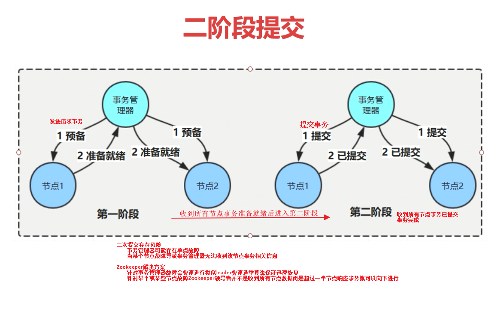

[TOC]

## 拓展

### 序列化
序列化标准
- 是否支持跨语言
- 编码后的码流大小
- 序列化过程的性能

Java中通过`java.io.ObjectOutputStream`序列化到文件中的数据包含类全路径名、各成员变量名及各成员变量值。而Zookeeper使用`jute`序列化到文件中的数据只包含成员变量值无论在跨语言、编码后码流、序列化过程性能都优于Java自带序列化


### 持久化

Zookeeper持久化方式
- `TxnLog`增量事务日志，记录系统中所有的增删改操作。如果服务器运行太久事务日志就可能会很大在加载日志时就比较耗时系统恢复就费时
- `SnapShot`快照记录某一时刻内存中的所有数据。配合`TxnLog`增量事务日志在系统恢复时先加载快照，然后再从事务日志里加载快照后的数据快速恢复系统


`SnapShot`快照
- Zookeeper将内存中以DataTree数据结构存储的数据定期序列化到磁盘中。由于快照文件是定期对数据全量备份所以快照文件中数据通常都不是最新的

- 序列化


- 反序列化首先通过`findNvalidSnapshots()`方法取出多少个快照文件按照Zxid正序(或逆序)排序后存放到List集合中
- 然后再通过`deserialize()`反序列化快照中Map存放会话信息和DataTree节点数据并进行完整性校验
- `SnapShot`快照文件配置项在`conf/zoo.cfg`文件中配置`snapCount=10`意思是当事务日志记录每10次触发一次快照，通常生产环境要避免频繁快照。快照默认存放在配置文件里配置的`dataDir
`目录下`version*`这个文件夹下如下。Zookeeper提供了`SnapshotFormatter`类可以读取快照文件里的节点和节点属性等数据

```shell script
➜  version-2 ll
total 28K
-rw-rw-rw- 1 supreme supreme  65M Aug 21 22:31 log.1
-rw-rw-r-- 1 supreme supreme  65M Aug 21 22:40 log.17
-rw-rw-r-- 1 supreme supreme  65M Aug 21 22:40 log.e
-rw-rw-r-- 1 supreme supreme 2.2K Aug 21 22:40 snapshot.15    # 快照文件 以二进制文件打开也能看到相关命令片段
➜  version-2 pwd
/home/zookeeper/zookeeper-3.4.10/data/version-2
```

`TxnLog`增量事务日志


- Zookeeper也提供`LogFormatter`类读取快照事务日志里的会话执行命令和节点属性等数据
```shell script
➜  version-2 ll
total 28K
-rw-rw-rw- 1 supreme supreme  65M Aug 21 22:31 log.1          # 事务日志文件
-rw-rw-r-- 1 supreme supreme  65M Aug 21 22:40 log.17         # 事务日志文件
-rw-rw-r-- 1 supreme supreme  65M Aug 21 22:40 log.e          # 事务日志文件
-rw-rw-r-- 1 supreme supreme 2.2K Aug 21 22:40 snapshot.15    # 快照文件 以二进制文件打开也能看到相关命令片段
➜  version-2 pwd
/home/zookeeper/zookeeper-3.4.10/data/version-2
```
- 可以通过`FileTxnLog#read(long zxid)`方法快速定位到指定事务id的日志，内部是通过`FileTxnIterator`事务日志迭代器在日志`sortDataDir()`排序后添加到`storeFiles`列表中然后反序列化找到指定zxid

`FileTxnSnapLog`包含了`TxnLog`增量事务日志和`SnapShot`快照
- 内部通过构造方法创建`TxnLog`和`SnapShot`接口实现类来间接实现日志两种持久化方式
- `FileTxnSnapLog`通过`FileTxnSnapLog#restore()`方法内的`FileSnap#deserialize()`加载快照文件，然后在`fastForwardFromEdits
()`方法内部通过`FileIxnLog`加载事务日志然后再通过`FileIxnLog#read(long zxid)`获取指定事务id的`TxnIterator`对象来快速恢复

### Zookeeper客户端

Zookeeper客户端类图


Zookeeper客户端启动流程


客户端各个模块分析

> `outgoingqueue`、`pendingqueue`是`LinkedList<Packet> `类型消息队列
>
> 客户端需要发送给服务端的Packet消息会先添加到`outgoingqueue`触发可写事件即把消息写入通道发送到服务端而后会把发送的Packet消息填充到`pendingqueue`等待服务端响应
>
> 当远端服务器提供响应信息后客户端与服务端通道触发可读事件读取服务端响应的数据并和`pendingqueue`里缓存的Packet消息比对若`Zxid`不一致则抛出异常来保证发送和接收的消息一致性
>
> 通过`outgoingqueue`、`pendingqueue`保证消息一致性

- Zookeeper客户端实例化时构造方法里
  - 首先会把设置的`Watcher`设置为`org.apache.zookeeper.ZooKeeper.ZKWatchManager#defaultWatcher`默认监视器
  - 根据指定的服务端地址构建`HostProvider`服务器节点提供者
  - 再根据`HostProvider`服务器节点提供者提供的服务器地址调用`org.apache.zookeeper.ClientCnxn`构造方法，在构造方法里会先创建`org.apache.zookeeper.ClientCnxn.SendThread`与服务端网络交互线程、`org.apache.zookeeper.ClientCnxn.EventThread`事件消息线程，最终实例化`ClientCnxn`客户端网络连接对象。
  - 然后启动`SendThread.start()`、`EventThread.start()`线程
    - 执行`org.apache.zookeeper.ClientCnxn.SendThread#run()`逻辑。内部就是基于 `NIO SelectionKey`监听与服务端建立通道的已连接、可读、可写等事件当需要和服务端通信时触发相应可读、可写事件执行`org.apache.zookeeper.ClientCnxnSocketNIO#doIO()`方法
    - `org.apache.zookeeper.ClientCnxn.EventThread#run()`

- 在通过`Zookeeper JavaAPI`执行`ZooKeeper#create()`、`ZooKeeper#delete()`、`ZooKeeper#exists()`、`ZooKeeper#setData()`等等与服务端通信时都会调用客户端网络连接对象`org.apache.zookeeper.ClientCnxn#submitRequest()`方法进行一系列步骤完成

- 同步消息过程。消息同步还是异步通过`ClientCnxn#submitRequest()`内部调用`ClientCnxn#queuePacket()`方法第五个参数`AsyncCallback`决定同步时`AsyncCallback`为`null`异步时这里是`AsyncCallback`回调对象
  - 同步时`org.apache.zookeeper.ClientCnxn#queuePacket()`直接实例化了`Packet`对象放入`outgoingqueue`然后触发`org.apache.zookeeper.ClientCnxnSocketNIO#doIO()`可写事件,首先从`outgoingqueue`获取刚刚存放的`Packet`然后写入通道发送出去，由于不存在`requestHeader`所以也会同时把`Packet`放入`pendingqueue`中

  
  - 然后就是等待远程服务端相应业务提供消息即触发`org.apache.zookeeper.ClientCnxnSocketNIO#doIO()`可读事件通过`org.apache.zookeeper.ClientCnxn.SendThread#readResponse()`读取消息，然后从`pendingqueue`取出`Packet`消息的`zxid`和服务端响应对比不一致即消息紊乱了抛出异常，否者就会反序列化响应消息最后重置`Packet`对象`org.apache.zookeeper.ClientCnxn#finishPacket()`状态
  - `ClientCnxn#submitRequest()`内部调用`ClientCnxn#queuePacket()`方法后执行上面几步逻辑后`ClientCnxn#submitRequest()`就处于轮询判断`ClientCnxn#queuePacket()`直接实例化的`Packet`对象`finished`状态是否true完成，完成即返回。在`ClientCnxn#finishPacket()`方法中通过重置`Packet`对象`finished`状态来标记同步或异步操作完成，重置时如果是同步会唤醒等待线程而异步时会通过`org.apache.zookeeper.ClientCnxn.EventThread#queuePacket()`方法把完成消息添加到`waitingEvents`事件队列里
  - 在`EventThread#run()`中一直在轮询判断异步相关操作

  

- 事件通知消息流转
  - 调用`Zookeeper#getData()`方法时会通过事件和节点实例化`DataWatchRegistration`对象
  - 然后在`ClientCnxn#submitRequest()`内部调用`ClientCnxn#queuePacket()`方法构造方法实例化了`Packet`对象时把实例化`DataWatchRegistration`对象作为参数赋值`Packet`对象中相应字段
  - 然后在调用`ClientCnxn#finishPacket()`方法重置`Packet`对象`finished`状态之前会判断是否注册了事件，当注册了`DataWatchRegistration`事件就会执行`org.apache.zookeeper.ZooKeeper.WatchRegistration#register()`方法取出`DataWatchRegistration`把事件和节点k/v映射放入`Map<String, Set<Watcher>>`Map中就完成了注册事件。
  - 然后当事件发生了就会发送一个`xid=-1`通知会在`ClientCnxn#readResponse()`收到这个notification通知然后进行反序列化，然后通过`org.apache.zookeeper.ClientCnxn.EventThread#queueEvent()`方法把事件进行一些封装逻辑(比如通过`org.apache.zookeeper.ClientWatchManager#materialize()`当事件发生后把之前注册的事件删除即监视器是一次性的)后添加到`LinkedBlockingQueue<Object> waitingEvents`事件队列里，而后在`EventThread#run()`轮询到时满足条件后调用`ClientCnxn#prosessEvent()`处理事件的回调即会回调注册监视器时回调方法

  


### 启动流程

架构总览


单机版启动流程
- 程序入口`QuorumPeerMain#main()`进行`initializeAndRun`加载配置文件然后根据配置文件配置项创建`DatadirCleanupManager`日志清理管理器读取`autopurge.purgeInterval`清理频率和`autopurge.snapRetainCount`快照个数配置项检查是否需要执行清理逻辑
- 然后检查集群配置还是单机配置。如果是单机版则执行`ZookeeperServerMain.main()`进行日志、计数器相关操作再根据配置选择创建基于NIO还是Netty网络服务组件`ServerCnxnFactory`对象然后初始化数据、清理非存活会话
- `ZookepperServer#startup()`创建`SessionTracker`会话管理器、启动`SessionTracker`会话管理器
- 然后初始化`ZookepperServer#setupRequestProcessors()`请求业务责任链每个`Processor`会指向下一个业务`Processor`之间通过`LinkedBlockingQueue`队列进行交互
- 接着注册JMS


集群版启动流程
- 程序入口`QuorumPeerMain#main()`进行`initializeAndRun`加载配置文件然后根据配置文件配置项创建`DatadirCleanupManager`日志清理管理器读取`autopurge.purgeInterval`清理频率和`autopurge.snapRetainCount`快照个数配置项检查是否需要执行清理逻辑
- 然后检查集群配置还是单机配置。集群版则执行`QurorumPeerMain.runFromConfig()`根据配置选择创建基于NIO还是Netty网络服务组件`ServerCnxnFactory
`对象。然后构建`QuorumPeer`核心类。
- `QuorumPeer`相关逻辑详见源码


单机版业务处理流程
- 非事务业务流程
- 事务业务流程


### 会话管理

Zookeeper服务端通过会话信息来标识k客户端，并通过会话管理临时节点生命周期、客户端请求有序执行、Watcher通知机制


会话状态迁移


会话创建


会话管理策略


会话激活
- 通过客户端业务操作命令或者k客户端心跳包来延长h会话超时时间，保持会话处于激活状态

### 选举流程

集群部署服务器角色
- 领导者一个集群同一时间只有一个领导者。所有的写操作必须要通过领导者完成，然后再将写操作广播 给其它节点
- 跟随者一个j集群中存在多个跟随者，可直接处理并返回客户端d读请求，会将写请求转发给领导者处理，并负责在领导者处理写请求时对请求进行投票
- 观察者，功能与跟随者类似，但无投票权，主要负载


服务器角色状态
- LOOKING 寻找领导者状态。服务器处于该状态时会认为当前集群中没有领导者需要进入l领导者选举流程
- FOLLWING 跟随者状态，节点角色为跟随者
- LEADING 领导者状态，节点角色为领导者
- OBSERVING 观察者状态，节点角色为观察者 


投票消息
- `leader` 被选举的领导者id
- `zxid` 被选举的领导者的事务id
- `sid` 当前服务器sid
- `electionEpoch` 当前服务器投票轮次,第几轮投票
- `peerEpoch` 当前服务器Epoch

选票PK。优先级递减
- 选票中Epoch大的优先级g高
- 选票Zxid大的优先级高
- 选票中的Sid大的优先级高

选票终止条件：当某一选票数占集群中参与竞选节点除观察者节点外数量一半以上选举结束 

选举流程
- 约定信息
  - 票箱信息，保存选举服务器Sid和被选举服务器Sid比如Sid为1的节点选举Sid为3的节点则票箱信息(1，3)
  - 选票信息(electionEpoch,leader,zxid)分别代表选举的轮次、被选举服务器Sid、被选举服务器zxid


### 数据同步与初始化
> 集群部署选举后各个节点数据可能不一致还不能对外服务需要数据同步

三种数据同步方式
- `SNAP` 当跟随者节点最大Zxid还小于领导者节点上最小的Zxid时表明数据差异大此时会通过给跟随者节点直接同步快照文件方式同步数据
- `DIFF` 当跟随者节点最大Zxid介于领导者节点最小Zxid、最大Zxid时此时只需要给跟随者同步(Zxid,MaxZxid]区间的数据，这个过程时循环逐条给跟随者同步Proposal完成的
- `TRUNC` 当跟随者节点最大Zxid大于领导者节点MaxZxid时此时告诉跟随者MaxZxid然后跟随者删除(MaxZxid,Zxid]区间的事务日志


数据同步部分类图


### 服务端请求处理流程

分布式事务二阶段提交。第一阶段事务管理器给每个节点发送请求事务，在收到所有节点事务准备就绪后进入第二阶段事务管理器给每个节点发送提交事务请求，在收到所有节点响应事务已提交后事务完成。
- 二次提交存在风险
  - 事务管理器可能存在单点故障
  - 当某个节点故障导致事务管理器无法收到该节点事务相关信息
- Zookeeper解决方案
  - 针对事务管理器故障会快速进行类似leader快速选举算法保证事务管理器迅速恢复
  - 针对某个或某些节点故障Zookeeper领导者并不是收到所有节点数据而是超过一半节点响应事务就可以向下进行



leader节点事务请求流程


follower节点事务请求


### 分布式锁

通过互斥等手段实现分布式系统之间同步访问共享资源，以保证数据的一致性

Zookeeper中通过创建临时数据节点来表示一个锁
- 选择临时节点在于临时节点特性宕机或会话中断等临时节点自动删除

成功创建数据节点的客户端即获取锁
- 未获取锁的客户端通过监听该节点变更情况，以便重新获取锁

释放锁两种情况
- 客户端宕机会话中断临时节点自动删除
- 正常业务逻辑处理完毕后客户端自动删除自己创建的临时节点

锁流程图


Zookeeper实现分布式锁
- 各个客户端都可以在/Lock下创建临时有序节点
- /Lock下存在的节点编号排序最小的节点即为锁
- 当客户端创建节点后以此根据自己创建节点编号对比可以判断本客户端是否获取到锁资源
- 当自己创建节点编号最小时即获得锁可以执行相应业务逻辑业务执行完毕后删除自己创建的临时有序节点释放锁
- 当自己创建的节点编号不是最小的即未获得锁,此时需要注册监视比自己小1的节点事件,当其节点删除释放时再次获取锁


### 源码调试

服务端源码启动加载调试

watch事件服务端处理链调试

### 总结

数据模型
- 持久化数据
  - 事务日志文件
  
  
  
  - 快照文件
  
  
  
- 内存数据

  - 类似Linux文件系统DataTree树型结构

Zab一致性协议
- 消息广播
  - 在Zookeeper集群中消息的事务请求采用消息广播模式。Zookeeper中消息的事务请求与二阶段提交相似但却又不同。二阶段提交要求协调者必须等到所有参与者全部反馈ACK确认消息后，再发送commit
  消息。要求所有参与者要么全部成功要么全部失败。二阶段提交会产生严重阻塞问题；而Zookeeper在每个阶段的ACK消息达半数以上即可提交消息。
- 崩溃恢复
  - 如果Leader服务器发送崩溃，则Zookeeper集群j进行Leader服务器选举进行崩溃恢复以及数据同步；
  - Zookeeper采用FastLeaderElection算法进行选举出新的Leader节点；其选举的优先级条件依次为`Epoch`、`Zxid`、`Sid`
  
  

三种数据同步方式


集群角色


leader节点消息广播


follower/observer节点消息广播
