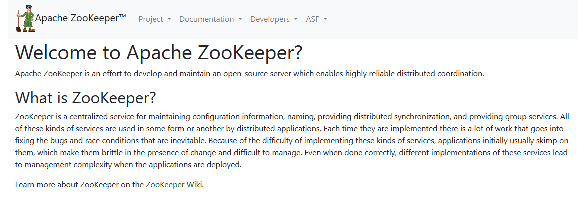
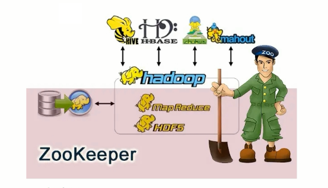
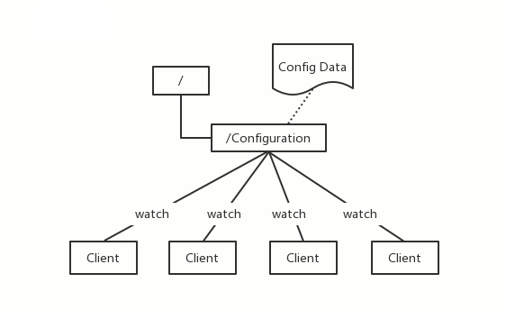
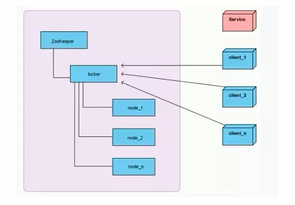
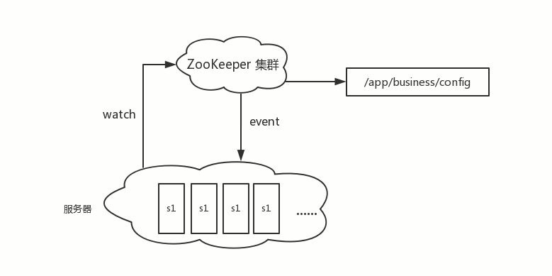
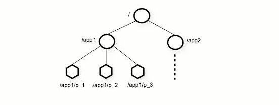
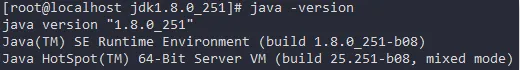
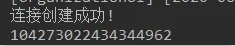

[TOC]


## 1. Zookeeper简介

### 1.1 什么是Zookeeper

Zookeeper官网：`https://zookeeper.apache.org/`



ZooKeeper由雅虎研究院开发，是Google Chubby的开源实现，后来托管到Apache，于2010年11月正式成为Apache的顶级项目。

大数据生态系统里的很多组件的命名都是某种动物或者昆虫，比如hadoop大象，hive蜂巢。Zookeeper即动物园管理者，顾名思义就是管理大数据生态系统各组件的管理员，如下图所示：


### 1.2 Zookeeper应用场景

Zookeeper是一个经典的分布式数据一致性解决方案，致力于为分布式应用提供一个高性能、高可用，且具有严格顺序访问控制能力的分布式协调存储服务。

- 维护配置信息
- 分布式锁服务
- 集群管理
- 生成分布式唯一ID

#### 1.2.1.维护配置信息
Java编程经常会遇到配置项，比如数据库的`url`、`schema`、`user`和`passwords
`等。通常这些配置项会放置在配置文件中，再将配置文件放置在服务器上当需要更改配置项时，需要去服务器上修改对应的配置文件。但是随着分布式系统的兴起，由于许多服务都需要使用到该配置文件，因此有必须保证该配置服务的`high availability`高可用性各台服务器上配置数据的一致性。通常会将配置文件部署在一个集群上，然而一个集群动輒上千台服务器，此时如果在吗，每台服务器逐个修改配置文件那将是非常繁琐且危险的的操作，因此就需要一种服务，能够高效快速且可靠地完成配置项的更改等操作，并能够保证各配置项在每台服务器上的数据一致性。

Zookeeper就可以提供这样一种服务，其使用`Zab`这种一致性协议来保证一致性。现在有很多开源项目使用zookeeper来维护配置，比如在`hbase`中，客户端就是连接一个Zookeeper，获得必要的`hbase`集群的配置信息然后才可以进一步操作。还有在开源的消息队列`kafka`中,也使用Zookeeper来维护`brokers`的信息。在alibaba开源的`soa`框架`dubbo`中也广泛的使用Zookeeper管理一些配置来实现服务治理。



#### 1.2.2 分布式锁服务

分布式集群系统，由多台服务器组成。为了提高并发度和可靠性，多台服务器上运行着同一种服务。当多个服务在运行时就需要协调各服务的进度，有时候需要保证当某个服务在进行某个操作时，其他的服务都不能进行该操作，即对该操作进行加锁，如果当前机器挂掉后，释放锁并`fail over`到其他的机器继续执行该服务。



#### 1.2.3 集群管理

一个集群有时会因为各种软硬件故障或者网络故障，出现某些服务挂掉而被移除集群，而某些服务器加入到集群中的情况，Zookeeper会将这些服务加入/移出的情况通知给集群中的其他正常工作的服务器，以及时调整存储和计算等任务的分配和执行等。此外Zookeeper还会对故宣的服务器做出诊断并尝试修复。



#### 1.2.4 生成分布式唯一ID

在过去的单库单表型系统中，通常可以使用数据库字段自带的`auto_increment`属性来自动为每条记录生成一个唯一的ID。但是分库分表后，就无法在依靠数据库的`auto_increment`属性来唯一标识一条记录了。此时就可以用Zookeeper在分布式环境下生成全局唯一ID。

- 做法如下：每次要生成一个新id时，创建一个持久顺序节点创建操作返回的节点序号即为新id，然后把比自己节点小的删除即可

### 1.3 Zookeeper的设计目标

Zookeeper致力于为分布式应用提供一个高性能、高可用，且具有严格顺序访问控制能力的分布式协调服务

#### 1.3.1 高性能

Zookeeper将全量数据存储在内存中，并直接服务于客户端的所有非事务请求，尤其适用于以读为主的应用场景

#### 1.3.2 高可用

Zookeeper一般以集群部署的方式对外提供服务，一般3~5台机器就可以组成一个可用的Zookeeper集群了，每台机器都会在内存中维护当前的服务器状态，并且每台机器之间都相互保持着通信。只要集群中超过一半的机器都能够正常工作，那么整个集群就能够正常对外服务

#### 1.3.3 严格顺序访问

对于来自客户端的每个更新请求，ZooKeeper都会分配一个全局唯一的递增编号，这个编号反映了所有事务操作的先后顺序

## 2 zookeeper的数据模型

> zookeeper和redis都是以内存作为数据存储的载体，但是redis数据以键值对的方式存储而zookeeper数据树状结构存储和Linux文件系统类似

Zookeeper的数据节点可以视为树状结构(或者目录)，树中的各节点被称为`znode`(即`zookeeper node`)，一个`znodes`可以有多个子节点。zookeeper节点在结构上表现为树状使用路径`path
`来定位某个`znode`，比如`/ns-1/deriwotua/mysql/schema1/table1`，此处`ns-1`、`deriwotua`、`mysql`、`schema1`、`table1`分别是根节点、2级节点、3級节点以及4级节点其中`ns-1`
是`deriwotua`的父节点，`deriwotua`是`ns-1`的子节点以此类推。


`znode`兼具文件和目录两种特点。既像文件一样维护着`数据`、`元信息`、`ACL`、`时间戳`等数据结构，又像目录一样可以作为路径标识的一部分。



一个`znode`大体上分为3个部分
- `znode data`节点数据：即`znode data`(节点`path`，节点`data`)的关系就像是Java map中(`key`, `value`)的关系
- `children`节点子节点
- `stat`节点状态：用来描述当前节点的创建、修改记录，包括`cZxid`、`ctime`等

**节点状态`stat`的属性**

- 在zookeeper shell中使用`get`命令查看指定路径节点的`data`、`stat`信息
```shell script
[ zk : localhost:2181 (CONNECTED) 7 ] get /ns-1/tenant

# 数据节点创建时的事务ID
czxid = 0x6a0000000a
# 数据节点创建时的时间
ctime = wed Mar 27 09:56:44 CST 2019
# 数据节点最后一次更新时的事务ID
mZxid = 0x6a0000000a
# 数据节点最后一次更新时的时间
mtime = Wed Mar 27 09:56:44 CST 2019
# 数据节点的子节点最后一次被修改的事务ID
pZxid = 0x6a0000000e
# 子节点的更改次数
cversion = 2
# 节点数据的更改次数
dataVersion = 0
# 节点的ACL的更改次数
aclversion = 0
# 如果节点是临时节点，则表示创建该节点的会话的SessionID
# 如果节点是持久节点，则该属性为0
ephemeralOwner = 0x0
# 数据内容的长度
dataLength = 0
# 数据节点当前的子节点个数
numChildren = 2
```

- `cZxid` 数据节点创建时的事务ID。对节点数据的所有写操作zookeeper会自动的开启事务且每个事务分配一个事务ID
- `ctime` 数据节点创建时的时间
- `mZxid` 数据节点最后一次更新时的事务ID
- `mtime` 数据节点最后一次更新时的时间
- `pZxid` 数据节点的子节点最后一次被修改的事务ID
- `cversion` 子节点的更改次数
- `dataVersion` 节点数据的更改次数
- `aclVersion` 节点的`ACL`的更改次数。`ACL`权限管理列表
- `ephemeralOwner` 如果节点是临时节点，则表示创建该节点的会话的SessionID；如果节点是持久节点，则该属性为0
- `dataLength` 数据内容的长度
- `numChildren` 数据节点当前的子节点个数

**节点类型**
- zookeeper中的节点有两种，分别为临时节点和永久节点。节点的类型在创建时即被确定，并且不能改变。
  - 临时节点：该节点的生命周期依赖于创建它们的会话。一旦`Session`会话结束，临时节点将被自动删除，当然可以也可以手动删除。虽然每个临时的`Znode`都会绑走到一个客户端会话，但他们对所有的客户端还是可见的。另外ZooKeeper临时节点不允许拥有子节点。
  - 持久化节点：该节点的生命周期不依赖于会话，并且只有在客户端显示执行删除操作的时候，他们才能被删除

## 3 Zookeeper单机安装
> `centos7`
> `jdk-8u251-linux-x64.tar.gz`
> `zookeeper-3.4.9.tar.gz`

使用root用户创建zookeeper用户
```shell script
useradd zookeeper
passwd zookeeper
```

卸载原有openjdk
```shell script
rpm -qa | grep java
rpm -e --nodeps java-1.8.0-openjdk-headless-1.8.0.242.b08-1.el7.x86_64
rpm -e --nodeps python-javapackages-3.4.1-11.el7.noarch
rpm -e --nodeps java-1.8.0-openjdk-1.8.0.242.b08-1.el7.x86_64
rpm -e --nodeps javapackages-tools-3.4.1-11.el7.noarch
rpm -e --nodeps tzdata-java-2019c-1.el7.noarch
```

zookeeper底层依赖于`jdk`
```shell script
tar -zxvf jdk-8u251-linux-x64.tar.gz
```

配置`jdk`环境变量
```shell script
# 打开profile
# 或者 ~/.bash_profile
vim /etc/profile

# 文件中加入如下内容
JAVA_HOME==/home/zookeeper/jdk1.8.0_131
export JAVA_HOME

PATH=$JAVA_HOME/bin:$PATH
export PATH

# 使环境生效
source /etc/profile
```

检测jdk安装
```shell script
# 敲如下命令，系统如图反馈说明安装成功
java -version
```



zookeeper解压
```shell script
tar -zxvf zookeeper-3.4.9.tar.gz
```

zookeeper配置文件
```shell script
# 配置文件
cd /home/zookeeper/zookeeper-3.4.9/conf/
cp zoo_sample.cfg zoo.cfg
vim zoo.cfg

# 修改一下内容，此路径用于存储zookeeper中数据的内存快照、及事务日志文件
dataDir=/home/zookeeper/zookeeper-3.4.9/data

# 创建data文件夹
cd /home/zookeeper/zookeeper-3.4.9
mkdir data
```

启动zookeeper
```shell script
# 进入zookeeper的bin目录
cd /home/zookeeper/zookeeper-3.4.9/bin/
# 启动zookeeper
./zkServer.sh start

# 启动
# zkServer.sh start
➜  bin ./zkServer.sh start
ZooKeeper JMX enabled by default
Using config: /home/zookeeper/zookeeper-3.4.10/bin/../conf/zoo.cfg
Starting zookeeper ... sleep: cannot read realtime clock: Invalid argument
STARTED

# 查看状态
# zkServer.sh status
➜  bin ./zkServer.sh status
ZooKeeper JMX enabled by default
Using config: /home/zookeeper/zookeeper-3.4.10/bin/../conf/zoo.cfg
Mode: standalone

# 登录到zookeeper
➜  bin ./zkCli.sh
Connecting to localhost:2181
2020-08-19 15:53:08,052 [myid:] - INFO  [main:Environment@100] - Client environment:zookeeper.version=3.4.10-39d3a4f269333c922ed3db283be479f9deacaa0f, built on 03/23/2017 10:13 GMT
2020-08-19 15:53:08,058 [myid:] - INFO  [main:Environment@100] - Client environment:host.name=DESKTOP-UB593L9.localdomain
2020-08-19 15:53:08,060 [myid:] - INFO  [main:Environment@100] - Client environment:java.version=1.8.0_131
2020-08-19 15:53:08,064 [myid:] - INFO  [main:Environment@100] - Client environment:java.vendor=Oracle Corporation
2020-08-19 15:53:08,065 [myid:] - INFO  [main:Environment@100] - Client environment:java.home=/home/zookeeper/jdk1.8.0_131/jre
2020-08-19 15:53:08,066 [myid:] - INFO  [main:Environment@100] - Client environment:java.class.path=/home/zookeeper/zookeeper-3.4.10/bin/../build/classes:/home/zookeeper/zookeeper-3.4.10/bin/../build/lib/*.jar:/home/zookeeper/zookeeper-3.4.10/bin/../lib/slf4j-log4j12-1.6.1.jar:/home/zookeeper/zookeeper-3.4.10/bin/../lib/slf4j-api-1.6.1.jar:/home/zookeeper/zookeeper-3.4.10/bin/../lib/netty-3.10.5.Final.jar:/home/zookeeper/zookeeper-3.4.10/bin/../lib/log4j-1.2.16.jar:/home/zookeeper/zookeeper-3.4.10/bin/../lib/jline-0.9.94.jar:/home/zookeeper/zookeeper-3.4.10/bin/../zookeeper-3.4.10.jar:/home/zookeeper/zookeeper-3.4.10/bin/../src/java/lib/*.jar:/home/zookeeper/zookeeper-3.4.10/bin/../conf:
2020-08-19 15:53:08,066 [myid:] - INFO  [main:Environment@100] - Client environment:java.library.path=/usr/java/packages/lib/amd64:/usr/lib64:/lib64:/lib:/usr/lib
2020-08-19 15:53:08,070 [myid:] - INFO  [main:Environment@100] - Client environment:java.io.tmpdir=/tmp
2020-08-19 15:53:08,071 [myid:] - INFO  [main:Environment@100] - Client environment:java.compiler=<NA>
2020-08-19 15:53:08,071 [myid:] - INFO  [main:Environment@100] - Client environment:os.name=Linux
2020-08-19 15:53:08,072 [myid:] - INFO  [main:Environment@100] - Client environment:os.arch=amd64
2020-08-19 15:53:08,073 [myid:] - INFO  [main:Environment@100] - Client environment:os.version=4.4.0-18362-Microsoft
2020-08-19 15:53:08,073 [myid:] - INFO  [main:Environment@100] - Client environment:user.name=supreme
2020-08-19 15:53:08,074 [myid:] - INFO  [main:Environment@100] - Client environment:user.home=/home/supreme
2020-08-19 15:53:08,074 [myid:] - INFO  [main:Environment@100] - Client environment:user.dir=/home/zookeeper/zookeeper-3.4.10/bin
2020-08-19 15:53:08,077 [myid:] - INFO  [main:ZooKeeper@438] - Initiating client connection, connectString=localhost:2181 sessionTimeout=30000 watcher=org.apache.zookeeper.ZooKeeperMain$MyWatcher@506c589e
Welcome to ZooKeeper!
2020-08-19 15:53:08,118 [myid:] - INFO  [main-SendThread(localhost:2181):ClientCnxn$SendThread@1032] - Opening socket connection to server localhost/127.0.0.1:2181. Will not attempt to authenticate using SASL (unknown error)
JLine support is enabled
2020-08-19 15:53:08,237 [myid:] - INFO  [main-SendThread(localhost:2181):ClientCnxn$SendThread@876] - Socket connection established to localhost/127.0.0.1:2181, initiating session
2020-08-19 15:53:08,285 [myid:] - INFO  [main-SendThread(localhost:2181):ClientCnxn$SendThread@1299] - Session establishment complete on server localhost/127.0.0.1:2181, sessionid = 0x17405b0d9fc0000, negotiated timeout = 30000

WATCHER::

WatchedEvent state:SyncConnected type:None path:null
[zk: localhost:2181(CONNECTED) 0]

# 退出
[zk: localhost:2181(CONNECTED) 0] quit
Quitting...
2020-08-19 15:54:45,422 [myid:] - INFO  [main:ZooKeeper@684] - Session: 0x17405b0d9fc0000 closed
2020-08-19 15:54:45,425 [myid:] - INFO  [main-EventThread:ClientCnxn$EventThread@519] - EventThread shut down for session: 0x17405b0d9fc0000
➜  bin 

# 关闭
# zkServer.sh stop
➜  bin ./zkServer.sh stop
ZooKeeper JMX enabled by default
Using config: /home/zookeeper/zookeeper-3.4.10/bin/../conf/zoo.cfg
Stopping zookeeper ... STOPPED
➜  bin 

# 查看Java进程已经没有了
➜  bin jps
1163 Jps
➜  bin  
```


## 4 zookeeper常用Shell命令
### 4.1 新增节点

> 四种节点
>
> - 持久化节点
> - 持久化有序节点
> - 临时节点
> - 临时有序节点


```shell script
# 其中-s 为有序节点，-e 临时节点
create [-s] [-e] path data  
````

创建**持久化节点**并写入数据
```shell script
# 进入zookeeper目录启动zookeeper
➜  bin ./zkServer.sh start
ZooKeeper JMX enabled by default
Using config: /home/zookeeper/zookeeper-3.4.10/bin/../conf/zoo.cfg
Starting zookeeper ... sleep: cannot read realtime clock: Invalid argument
STARTED
➜  bin
# 登录到zookeeper
➜  bin ./zkCli.sh
Connecting to localhost:2181
2020-08-19 16:02:32,057 [myid:] - INFO  [main:Environment@100] - Client environment:zookeeper.version=3.4.10-39d3a4f269333c922ed3db283be479f9deacaa0f, built on 03/23/2017 10:13 GMT
2020-08-19 16:02:32,063 [myid:] - INFO  [main:Environment@100] - Client environment:host.name=DESKTOP-UB593L9.localdomain
2020-08-19 16:02:32,066 [myid:] - INFO  [main:Environment@100] - Client environment:java.version=1.8.0_131
2020-08-19 16:02:32,069 [myid:] - INFO  [main:Environment@100] - Client environment:java.vendor=Oracle Corporation
2020-08-19 16:02:32,070 [myid:] - INFO  [main:Environment@100] - Client environment:java.home=/home/supreme/zookeeper/jdk1.8.0_131/jre
2020-08-19 16:02:32,071 [myid:] - INFO  [main:Environment@100] - Client environment:java.class.path=/home/zookeeper/zookeeper-3.4.10/bin/../build/classes:/home/zookeeper/zookeeper-3.4.10/bin/../build/lib/*.jar:/home/zookeeper/zookeeper-3.4.10/bin/../lib/slf4j-log4j12-1.6.1.jar:/home/zookeeper/zookeeper-3.4.10/bin/../lib/slf4j-api-1.6.1.jar:/home/zookeeper/zookeeper-3.4.10/bin/../lib/netty-3.10.5.Final.jar:/home/zookeeper/zookeeper-3.4.10/bin/../lib/log4j-1.2.16.jar:/home/zookeeper/zookeeper-3.4.10/bin/../lib/jline-0.9.94.jar:/home/zookeeper/zookeeper-3.4.10/bin/../zookeeper-3.4.10.jar:/home/zookeeper/zookeeper-3.4.10/bin/../src/java/lib/*.jar:/home/zookeeper/zookeeper-3.4.10/bin/../conf:
2020-08-19 16:02:32,072 [myid:] - INFO  [main:Environment@100] - Client environment:java.library.path=/usr/java/packages/lib/amd64:/usr/lib64:/lib64:/lib:/usr/lib
2020-08-19 16:02:32,074 [myid:] - INFO  [main:Environment@100] - Client environment:java.io.tmpdir=/tmp
2020-08-19 16:02:32,075 [myid:] - INFO  [main:Environment@100] - Client environment:java.compiler=<NA>
2020-08-19 16:02:32,075 [myid:] - INFO  [main:Environment@100] - Client environment:os.name=Linux
2020-08-19 16:02:32,076 [myid:] - INFO  [main:Environment@100] - Client environment:os.arch=amd64
2020-08-19 16:02:32,077 [myid:] - INFO  [main:Environment@100] - Client environment:os.version=4.4.0-18362-Microsoft
2020-08-19 16:02:32,077 [myid:] - INFO  [main:Environment@100] - Client environment:user.name=supreme
2020-08-19 16:02:32,077 [myid:] - INFO  [main:Environment@100] - Client environment:user.home=/home/supreme
2020-08-19 16:02:32,078 [myid:] - INFO  [main:Environment@100] - Client environment:user.dir=/home/zookeeper/zookeeper-3.4.10/bin
2020-08-19 16:02:32,082 [myid:] - INFO  [main:ZooKeeper@438] - Initiating client connection, connectString=localhost:2181 sessionTimeout=30000 watcher=org.apache.zookeeper.ZooKeeperMain$MyWatcher@506c589e
Welcome to ZooKeeper!
2020-08-19 16:02:32,125 [myid:] - INFO  [main-SendThread(localhost:2181):ClientCnxn$SendThread@1032] - Opening socket connection to server localhost/127.0.0.1:2181. Will not attempt to authenticate using SASL (unknown error)
JLine support is enabled
2020-08-19 16:02:32,339 [myid:] - INFO  [main-SendThread(localhost:2181):ClientCnxn$SendThread@876] - Socket connection established to localhost/127.0.0.1:2181, initiating session
2020-08-19 16:02:32,405 [myid:] - INFO  [main-SendThread(localhost:2181):ClientCnxn$SendThread@1299] - Session establishment complete on server localhost/127.0.0.1:2181, sessionid = 0x17405bc2cfe0000, negotiated timeout = 30000

WATCHER::

WatchedEvent state:SyncConnected type:None path:null
[zk: localhost:2181(CONNECTED) 0]

# 创建hadoop节点 节点数据123456 默认创建持久化节点
[zk: localhost:2181(CONNECTED) 0] create /hadoop "123456"
Created /hadoop
[zk: localhost:2181(CONNECTED) 1]
# get path 读取hadoop节点数据
[zk: localhost:2181(CONNECTED) 1] get /hadoop
123456
cZxid = 0x4
ctime = Wed Aug 19 16:04:52 CST 2020
mZxid = 0x4
mtime = Wed Aug 19 16:04:52 CST 2020
pZxid = 0x4
cversion = 0
dataVersion = 0
aclVersion = 0
ephemeralOwner = 0x0
dataLength = 6
numChildren = 0
[zk: localhost:2181(CONNECTED) 2]

# 此时quit退出后再次./zkCli.sh登录到zookeeper
# 再次 get /hadoop 获取hadoop节点数据 数据还是存在的 即持久化节点
```

`-s`创建**持久化有序节点**，创建有序节点zookeeper会自动在指定的节点名后添加序号即节点名为`指定节点名 + 自增序号`

- 持久化有序节点在业务上可以作为分布式环境唯一的id

```shell script
# 创建持久化有序节点a 节点数据为aaa
[zk: localhost:2181(CONNECTED) 2]  create -s /a "aaa"
Created /a0000000001  	# 有序节点名为指定节点加序号 a + 0000000001
[zk: localhost:2181(CONNECTED) 3] get /a0000000001
aaa
cZxid = 0x5
ctime = Wed Aug 19 16:11:21 CST 2020
mZxid = 0x5
mtime = Wed Aug 19 16:11:21 CST 2020
pZxid = 0x5
cversion = 0
dataVersion = 0
aclVersion = 0
ephemeralOwner = 0x0
dataLength = 3
numChildren = 0
[zk: localhost:2181(CONNECTED) 4]
# 再次创建持久有序节点b 节点数据为bbb
[zk: localhost:2181(CONNECTED) 4] create -s /b "bbb"
Created /b0000000002	# 节点名称自动加上自增序号
[zk: localhost:2181(CONNECTED) 5] get /b0000000002
bbb
cZxid = 0x6
ctime = Wed Aug 19 16:16:22 CST 2020
mZxid = 0x6
mtime = Wed Aug 19 16:16:22 CST 2020
pZxid = 0x6
cversion = 0
dataVersion = 0
aclVersion = 0
ephemeralOwner = 0x0
dataLength = 3
numChildren = 0
[zk: localhost:2181(CONNECTED) 6]
[zk: localhost:2181(CONNECTED) 2] create -s /c "ccc"
Created /c0000000002
```

`-e`创建**临时节点**，临时会在会话过期后被删除

```shell script
[zk: localhost:2181(CONNECTED) 6] create -e /tmp "tmp"
Created /tmp
[zk: localhost:2181(CONNECTED) 7] get /tmp
tmp
cZxid = 0x7
ctime = Wed Aug 19 16:20:58 CST 2020
mZxid = 0x7
mtime = Wed Aug 19 16:20:58 CST 2020
pZxid = 0x7
cversion = 0
dataVersion = 0
aclVersion = 0
ephemeralOwner = 0x17405bc2cfe0000
dataLength = 3
numChildren = 0
[zk: localhost:2181(CONNECTED) 8]
# 临时节点创建后 quit 退出会话
[zk: localhost:2181(CONNECTED) 8] quit
Quitting...
2020-08-19 16:21:30,708 [myid:] - INFO  [main:ZooKeeper@684] - Session: 0x17405bc2cfe0000 closed
2020-08-19 16:21:30,713 [myid:] - INFO  [main-EventThread:ClientCnxn$EventThread@519] - EventThread shut down for session: 0x17405bc2cfe0000
# 再次登录到zookeeper
➜  bin ./zkCli.sh
Connecting to localhost:2181
2020-08-19 16:21:38,188 [myid:] - INFO  [main:Environment@100] - Client environment:zookeeper.version=3.4.10-39d3a4f269333c922ed3db283be479f9deacaa0f, built on 03/23/2017 10:13 GMT
2020-08-19 16:21:38,196 [myid:] - INFO  [main:Environment@100] - Client environment:host.name=DESKTOP-UB593L9.localdomain
2020-08-19 16:21:38,198 [myid:] - INFO  [main:Environment@100] - Client environment:java.version=1.8.0_131
2020-08-19 16:21:38,203 [myid:] - INFO  [main:Environment@100] - Client environment:java.vendor=Oracle Corporation
2020-08-19 16:21:38,205 [myid:] - INFO  [main:Environment@100] - Client environment:java.home=/home/zookeeper/jdk1.8.0_131/jre
2020-08-19 16:21:38,207 [myid:] - INFO  [main:Environment@100] - Client environment:java.class.path=/home/zookeeper/zookeeper-3.4.10/bin/../build/classes:/home/zookeeper/zookeeper-3.4.10/bin/../build/lib/*.jar:/home/zookeeper/zookeeper-3.4.10/bin/../lib/slf4j-log4j12-1.6.1.jar:/home/zookeeper/zookeeper-3.4.10/bin/../lib/slf4j-api-1.6.1.jar:/home/zookeeper/zookeeper-3.4.10/bin/../lib/netty-3.10.5.Final.jar:/home/zookeeper/zookeeper-3.4.10/bin/../lib/log4j-1.2.16.jar:/home/zookeeper/zookeeper-3.4.10/bin/../lib/jline-0.9.94.jar:/home/zookeeper/zookeeper-3.4.10/bin/../zookeeper-3.4.10.jar:/home/zookeeper/zookeeper-3.4.10/bin/../src/java/lib/*.jar:/home/zookeeper/zookeeper-3.4.10/bin/../conf:
2020-08-19 16:21:38,208 [myid:] - INFO  [main:Environment@100] - Client environment:java.library.path=/usr/java/packages/lib/amd64:/usr/lib64:/lib64:/lib:/usr/lib
2020-08-19 16:21:38,210 [myid:] - INFO  [main:Environment@100] - Client environment:java.io.tmpdir=/tmp
2020-08-19 16:21:38,211 [myid:] - INFO  [main:Environment@100] - Client environment:java.compiler=<NA>
2020-08-19 16:21:38,211 [myid:] - INFO  [main:Environment@100] - Client environment:os.name=Linux
2020-08-19 16:21:38,212 [myid:] - INFO  [main:Environment@100] - Client environment:os.arch=amd64
2020-08-19 16:21:38,213 [myid:] - INFO  [main:Environment@100] - Client environment:os.version=4.4.0-18362-Microsoft
2020-08-19 16:21:38,215 [myid:] - INFO  [main:Environment@100] - Client environment:user.name=supreme
2020-08-19 16:21:38,216 [myid:] - INFO  [main:Environment@100] - Client environment:user.home=/home/supreme
2020-08-19 16:21:38,218 [myid:] - INFO  [main:Environment@100] - Client environment:user.dir=/home/zookeeper/zookeeper-3.4.10/bin
2020-08-19 16:21:38,223 [myid:] - INFO  [main:ZooKeeper@438] - Initiating client connection, connectString=localhost:2181 sessionTimeout=30000 watcher=org.apache.zookeeper.ZooKeeperMain$MyWatcher@506c589e
Welcome to ZooKeeper!
2020-08-19 16:21:38,265 [myid:] - INFO  [main-SendThread(localhost:2181):ClientCnxn$SendThread@1032] - Opening socket connection to server localhost/127.0.0.1:2181. Will not attempt to authenticate using SASL (unknown error)
JLine support is enabled
2020-08-19 16:21:38,429 [myid:] - INFO  [main-SendThread(localhost:2181):ClientCnxn$SendThread@876] - Socket connection established to localhost/127.0.0.1:2181, initiating session
2020-08-19 16:21:38,473 [myid:] - INFO  [main-SendThread(localhost:2181):ClientCnxn$SendThread@1299] - Session establishment complete on server localhost/127.0.0.1:2181, sessionid = 0x17405bc2cfe0001, negotiated timeout = 30000

WATCHER::

WatchedEvent state:SyncConnected type:None path:null
# 登录后再次获取创建的/tmp节点
[zk: localhost:2181(CONNECTED) 0] get /tmp
Node does not exist: /tmp	# 退出会话后/tmp临时节点自动删除
[zk: localhost:2181(CONNECTED) 1]
```

`-s -e`创建**临时有序节点**，临时会在会话过期后被删除

- 用于生成分布式锁

```shell script
[zk: localhost:2181(CONNECTED) 1] create -s -e /aa "aaa"
Created /aa0000000004

[zk: localhost:2181(CONNECTED) 2] create -s -e /bb "bbb"
Created /bb0000000005
[zk: localhost:2181(CONNECTED) 3]
```

### 4.2 更新节点

`set path [dataVersion]`更新节点的命令 ，可以直接进行修改

```shell script
[zk: localhost:2181(CONNECTED) 3] get /hadoop
123456
cZxid = 0x4
ctime = Wed Aug 19 16:04:52 CST 2020
mZxid = 0x4
mtime = Wed Aug 19 16:04:52 CST 2020
pZxid = 0x4
cversion = 0
dataVersion = 0    # 节点创建后版本号为0开始
aclVersion = 0
ephemeralOwner = 0x0
dataLength = 6
numChildren = 0
[zk: localhost:2181(CONNECTED) 4]
# 修改hadoop节点数据
[zk: localhost:2181(CONNECTED) 4] set /hadoop "345"
cZxid = 0x4
ctime = Wed Aug 19 16:04:52 CST 2020
mZxid = 0xc
mtime = Wed Aug 19 16:29:58 CST 2020
pZxid = 0x4
cversion = 0
dataVersion = 1		# 节点数据修改后版本号会自增1
aclVersion = 0
ephemeralOwner = 0x0
dataLength = 3
numChildren = 0
[zk: localhost:2181(CONNECTED) 5] get /hadoop
345
cZxid = 0x4
ctime = Wed Aug 19 16:04:52 CST 2020
mZxid = 0xc
mtime = Wed Aug 19 16:29:58 CST 2020
pZxid = 0x4
cversion = 0
dataVersion = 1		# 数据版本号
aclVersion = 0
ephemeralOwner = 0x0
dataLength = 3
numChildren = 0
[zk: localhost:2181(CONNECTED) 6]
```

也可以基于`dataVersion`版本号进行修改，此时**类似于乐观锁机制**，当传入的`dataVersion`数据版本号和当前节点的数据版本号不符合时，zookeeper会拒绝本次修改
```shell script
# set path data dataVersion
# 当指定的dataVersion与节点当前的dataVersion一致时将节点数据修改为159
[zk: localhost:2181(CONNECTED) 5] get /hadoop
345
cZxid = 0x4
ctime = Wed Aug 19 16:04:52 CST 2020
mZxid = 0xc
mtime = Wed Aug 19 16:29:58 CST 2020
pZxid = 0x4
cversion = 0
dataVersion = 1
aclVersion = 0
ephemeralOwner = 0x0
dataLength = 3
numChildren = 0
# 版本号不一致时zookeeper会拒绝执行
[zk: localhost:2181(CONNECTED) 6] set /hadoop "159" 0
version No is not valid : /hadoop	# 版本号不一致
# 版本号一致时
[zk: localhost:2181(CONNECTED) 7] set /hadoop "159" 1
cZxid = 0x4
ctime = Wed Aug 19 16:04:52 CST 2020
mZxid = 0xe
mtime = Wed Aug 19 16:39:18 CST 2020
pZxid = 0x4
cversion = 0
dataVersion = 2
aclVersion = 0
ephemeralOwner = 0x0
dataLength = 3
numChildren = 0
[zk: localhost:2181(CONNECTED) 8]
```

### 4.3 删除节点

删除节点的语法
```shell script
delete path [version]
```

和更新节点数据一样，也可以传入版本号，当传入的数据`dataVersion`版本号和当前节点的数据版本号不符合时，zookeeper会拒绝本次删除操作
```shell script
[zk: localhost:2181(CONNECTED) 13] delete /hadoop 0
version No is not valid : /hadoop   # 版本号不一致删除失败
[zk: localhost:2181(CONNECTED) 14] delete /hadoop 1
[zk: localhost:2181(CONNECTED) 15]
```

要想删除某个节点及其所有后代节点，可以使用递归删除，命令为 `rmr path`。

```shell
# hadoop节点下创建node1子节点
[zk: localhost:2181(CONNECTED) 9] create /hadoop/node1 "node1"
Created /hadoop/node1
[zk: localhost:2181(CONNECTED) 10] get /hadoop
159
cZxid = 0x4
ctime = Wed Aug 19 16:04:52 CST 2020
mZxid = 0xe
mtime = Wed Aug 19 16:39:18 CST 2020
pZxid = 0x10
cversion = 1
dataVersion = 2
aclVersion = 0
ephemeralOwner = 0x0
dataLength = 3
numChildren = 1
[zk: localhost:2181(CONNECTED) 11] get /hadoop/node1
node1
cZxid = 0x10
ctime = Wed Aug 19 16:42:54 CST 2020
mZxid = 0x10
mtime = Wed Aug 19 16:42:54 CST 2020
pZxid = 0x10
cversion = 0
dataVersion = 0
aclVersion = 0
ephemeralOwner = 0x0
dataLength = 5
numChildren = 0
[zk: localhost:2181(CONNECTED) 12]
# 当节点下存在子节点时删除节点会失败
[zk: localhost:2181(CONNECTED) 12] delete /hadoop
Node not empty: /hadoop   # 删除失败 当前节点下存在子节点

# 此时如果想删除指定节点及其子节点需要使用 rmr 命令
# 删除hadoop节点及其子节点
[zk: localhost:2181(CONNECTED) 13] rmr /hadoop
[zk: localhost:2181(CONNECTED) 14] get /hadoop
Node does not exist: /hadoop
[zk: localhost:2181(CONNECTED) 15] get /hadoop/node1
Node does not exist: /hadoop/node1
[zk: localhost:2181(CONNECTED) 16]
```


### 4.4 查看节点
> get path

```shell script
[zk: localhost:2181(CONNECTED) 16] create /hadoop "123456"
Created /hadoop
[zk: localhost:2181(CONNECTED) 17] get /hadoop
123456
cZxid = 0x14
ctime = Wed Aug 19 16:49:33 CST 2020
mZxid = 0x14	# 与cZxid创建时事务id一致
mtime = Wed Aug 19 16:49:33 CST 2020 	# 与ctime创建时时间一致
pZxid = 0x14	# 与cZxid创建时事务id一致
cversion = 0
dataVersion = 0
aclVersion = 0
ephemeralOwner = 0x0	# 持久化节点值为0
dataLength = 6
numChildren = 0
# 修改hadoop节点数据后
[zk: localhost:2181(CONNECTED) 18] set /hadoop "456"
cZxid = 0x14
ctime = Wed Aug 19 16:49:33 CST 2020
mZxid = 0x15		# 数据节点最后一次更新时的事务ID与创建时事务ID就不在一致了
mtime = Wed Aug 19 16:52:17 CST 2020  # 数据节点最后一次更新时间也变更了
pZxid = 0x14		# 节点没有创建子节点与cZxid创建时事务id一致
cversion = 0
dataVersion = 1
aclVersion = 0
ephemeralOwner = 0x0	# 持久化节点值为0
dataLength = 3
numChildren = 0
[zk: localhost:2181(CONNECTED) 19] get /hadoop
456
cZxid = 0x14
ctime = Wed Aug 19 16:49:33 CST 2020
mZxid = 0x15 		# 数据节点最后一次更新时的事务ID与创建时事务ID就不在一致了
mtime = Wed Aug 19 16:52:17 CST 2020  # 数据节点最后一次更新时间也变更了
pZxid = 0x14		# 节点没有创建子节点与cZxid创建时事务id一致
cversion = 0		# 不存在子节点 子节点版本号从0开始
dataVersion = 1
aclVersion = 0
ephemeralOwner = 0x0	# 持久化节点值为0
dataLength = 3
numChildren = 0
# 创建子节点
[zk: localhost:2181(CONNECTED) 20] create /hadoop/node1 "node1"
Created /hadoop/node1
[zk: localhost:2181(CONNECTED) 21] get /hadoop/node1
node1
cZxid = 0x16
ctime = Wed Aug 19 16:56:45 CST 2020
mZxid = 0x16
mtime = Wed Aug 19 16:56:45 CST 2020
pZxid = 0x16
cversion = 0
dataVersion = 0
aclVersion = 0
ephemeralOwner = 0x0	# 持久化节点值为0
dataLength = 5
numChildren = 0
[zk: localhost:2181(CONNECTED) 22] get /hadoop
456
cZxid = 0x14
ctime = Wed Aug 19 16:49:33 CST 2020
mZxid = 0x15
mtime = Wed Aug 19 16:52:17 CST 2020
pZxid = 0x16		# 创建子节点后与子节点事务ID一致了
cversion = 1		# 创建子节点后子节点版本号自增了
dataVersion = 1
aclVersion = 0
ephemeralOwner = 0x0	# 持久化节点值为0
dataLength = 3
numChildren = 1
# 创建临时节点
[zk: localhost:2181(CONNECTED) 23] create -e /tmp "tmp"
Created /tmp
[zk: localhost:2181(CONNECTED) 24] get /tmp
tmp
cZxid = 0x17
ctime = Wed Aug 19 17:04:07 CST 2020
mZxid = 0x17
mtime = Wed Aug 19 17:04:07 CST 2020
pZxid = 0x17
cversion = 0
dataVersion = 0
aclVersion = 0
ephemeralOwner = 0x17405bc2cfe0001	# 临时节点值不为0而是临时节点所在会话的会话id
dataLength = 3
numChildren = 0
[zk: localhost:2181(CONNECTED) 25]
```

节点各个属性如下表。其中一个重要的概念是 `Zxid`(ZooKeeper Transaction Id)，ZooKeeper 节点的每一次更改都具有唯一的 `Zxid`，如果 `Zxid1` 小于 `Zxid2`，则`Zxid1`的更改发生在 `Zxid2` 更改之前。

|状态属性 	| 说明|
|----------|-----|
|cZxid 	        | 数据节点创建时的事务 ID |
|ctime 	        | 数据节点创建时的时间 |
|mZxid 	        | 数据节点最后一次更新时的事务 ID |
|mtime 	        | 数据节点最后一次更新时的时间 |
|pZxid 	        | 数据节点的子节点最后一次被修改时的事务 ID |
|cversion 	    | 子节点的更改次数 |
|dataVersion 	| 节点数据的更改次数 |
|aclVersion 	| 节点的 ACL 的更改次数 |
|ephemeralOwner | 如果节点是临时节点，则表示创建该节点的会话的SessionID；如果节点是持久节点，则该属性值为 0 |
|dataLength 	| 数据内容的长度 |
|numChildren 	| 数据节点当前的子节点个数 |

### 4.5 查看节点状态

可以使用 `stat`命令查看节点状态，它的返回值和 `get`命令类似，但不会返回节点数据
```shell script
# stat 不会返回节点数据 
[zk: localhost:2181(CONNECTED) 25]  stat /hadoop
cZxid = 0x14
ctime = Wed Aug 19 16:49:33 CST 2020
mZxid = 0x15
mtime = Wed Aug 19 16:52:17 CST 2020
pZxid = 0x16
cversion = 1
dataVersion = 1
aclVersion = 0
ephemeralOwner = 0x0
dataLength = 3
numChildren = 1
[zk: localhost:2181(CONNECTED) 26]
```

### 4.6 查看节点列表

查看子节点列表有 `ls path` 和 `ls2 path` 两个命令，后者是前者的增强，不仅可以查看指定路径下的所有节点，还可以查看当前节点的信息
```shell script
# ls path  只返回节点的子节点列表
[zk: localhost:2181(CONNECTED) 13] ls /hadoop
[node2, node1]
# ls2 path 不仅返回节点的子节点列表同时还返回指定节点属性
[zk: localhost:2181(CONNECTED) 14] ls2 /hadoop
[node2, node1]
cZxid = 0x18
ctime = Tue Jun 02 10:43:30 CST 2020
mZxid = 0x18
mtime = Tue Jun 02 10:43:30 CST 2020
pZxid = 0x1a
cversion = 2
dataVersion = 0
aclVersion = 0
ephemeralOwner = 0x0
dataLength = 6
numChildren = 2
```

### 4.7 监听器`get path [watch]`

`get`命令使用时可以添加`watch`可选项 `get path [watch]` 此时会在zookeeper客户端与服务器之间注册一个监听器通过监听器可以监视监听当前`path`数据变化当节点内容发生改变的时候，服务器会向客户端回写一个事件可以监视到当前节点数据的变化。需要注意的是 zookeeper 的触发器是`One-time trigger`一次性的，即触发一次后就会立即失效。

```shell script
# 为当前会话的客户端hadoop节点添加一个watch监听器
[zk: localhost:2181(CONNECTED) 16] get /hadoop watch
# 此时另开一个窗口执行./zkCli.sh再用一个客户端登录到zookeeper 把hadoop节点数据改为456
[zk: localhost:2181(CONNECTED) 0] set /hadoop "456"

# 设置监听器后当监听器接收到服务的回写的节点变化事件后会打印如下信息
[zk: localhost:2181(CONNECTED) 17] 
WATCHER:: # 服务器推回消息节点数据变更了
WatchedEvent state:SyncConnected type:NodeDataChanged path:/hadoop
```

### 4.8 监听器`stat path [watch]`

使用 `stat path [watch]` 注册的监听器能够在节点状态发生改变的时候，向客户端发出通知
```shell script
# stat 也可以给节点注册监听器
[zk: localhost:2181(CONNECTED) 18] stat /hadoop watch
[zk: localhost:2181(CONNECTED) 19] set /hadoop 1122  
WATCHER::cZxid = 0x18
WatchedEvent state:SyncConnected type:NodeDataChanged path:/hadoop #节点值改变
```

### 4.9 监听器`ls/ls2 path [watch]`

使用 `ls path [watch]` 或 `ls2 path [watch]` 注册的监听器能够监听该节点下所有子节点的增加和删除操作。
```shell script
[zk: localhost:2181(CONNECTED) 20] ls /hadoop watch
[node2, node1]
[zk: localhost:2181(CONNECTED) 21] create /hadoop/yran "aaa"
WATCHER::Created /hadoop/yran
WatchedEvent state:SyncConnected type:NodeChildrenChanged path:/hadoop
```


## 5 zookeeper的acl权限控制

> `access control list` 访问控制列表

### 5.1 概述

zookeeper 类似文件系统，client 可以创建节点、更新节点、删除节点，那么如何做到节点的权限的控制呢？zookeeper的`access control list` 访问控制列表可以做到这一点。

`acl` 权限控制，使用`scheme:id:permission` 来标识，主要涵盖 3 个方面
- `scheme`权限模式：授权的策略
- `id`授权对象：授权的对象
- `permission`权限：授予的权限

其特性如下
- zooKeeper的权限控制是基于每个`znode`节点的，需要对每个节点设置权限
- 每个`znode`支持设置多种权限控制方案和多个权限
- 子节点不会继承父节点的权限，客户端无权访问某节点，但可能可以访问它的子节点

例如
```shell script
# test2节点采用IP模式授权权限设置为IP:192.168.188.133的客户端可以对节点进行crwda增删改查管理权限
[zk: localhost:2181(CONNECTED) 28] setAcl /test2 ip:192.168.188.133:crwda
```

### 5.2 权限模式

采用何种方式授权

|方案 	| 描述 |
|------|-----|
|world 	| 只有一个用户：anyone，代表登录zokeeper所有人（默认） |
|ip 	| 对客户端使用IP地址认证 |
|auth 	| 使用已添加认证的用户认证 |
|digest |	使用“用户名:密码”方式认证 |

### 5.3 授权的对象

给谁授予权限

授权对象ID是指，权限赋予的实体，例如：IP 地址或用户。

### 5.4 授予的权限

授予什么权限 `create`、`delete`、`read`、`writer`、`admin`也就是 增、删、改、查、管理权限，这5种权限简写为`cdrwa`
- 注意:这5种权限中`delete`是指对子节点的删除权限，其它4种权限指对自身节点的操作权限
| 权限 	    | ACL简写  | 描述 |
|---------|-------|-------|
| create 	| c      | 可以创建子节点 |
| delete 	| d 	 | 可以删除子节点（仅下一级节点） |
| read 	    | r 	 | 可以读取节点数据及显示子节点列表 |
| write 	| w 	 | 可以设置节点数据 |
| admin 	| a 	 | 可以设置节点访问控制列表权限 |

### 5.5 授权的相关命令
|命令 	    | 使用方式 	   | 描述 |
|-------|--------|-------|
|getAcl 	| getAcl <path> | 读取ACL权限 |
|setAcl 	| setAcl <path> <acl> | 设置ACL权限 |
|addauth 	| addauth <scheme> <auth> | 添加认证用户 |

### 5.6 权限控制案例

#### 5.6.1 world授权模式

- 命令
  ```shell script
  # 登录到zookeeper服务器所有用户给与指定path节点的权限列表
  setAcl <path> world:anyone:<acl>
  ```
- 案例
  ```shell script
  [zk: localhost:2181(CONNECTED) 1] create /node1 "node1"
  Created /node1
  
  [zk: localhost:2181(CONNECTED) 2] getAcl /node1
  'world,'anyone		# anyone登录到zookeeper服务器所有用户
  : cdrwa				# 增删改查管理权限
  
  [zk: localhost:2181(CONNECTED) 3] setAcl /node1 world:anyone:cdrwa
  cZxid = 0x22
  ctime = Tue Jun 02 13:29:10 CST 2020
  mZxid = 0x22
  mtime = Tue Jun 02 13:29:10 CST 2020
  pZxid = 0x22
  cversion = 0
  dataVersion = 0
  aclVersion = 1
  ephemeralOwner = 0x0
  dataLength = 5
  numChildren = 0
  
  [zk: localhost:2181(CONNECTED) 26] create /node1 "node1"
  Created /node1
  [zk: localhost:2181(CONNECTED) 27] create /node1/node11 "node11"
  Created /node1/node11
  [zk: localhost:2181(CONNECTED) 28] create /node1/node22 "node22"
  Created /node1/node22
  [zk: localhost:2181(CONNECTED) 29] get /node1/node11
  node11
  cZxid = 0x19
  ctime = Wed Aug 19 17:49:17 CST 2020
  mZxid = 0x19
  mtime = Wed Aug 19 17:49:17 CST 2020
  pZxid = 0x19
  cversion = 0
  dataVersion = 0
  aclVersion = 0
  ephemeralOwner = 0x0
  dataLength = 6
  numChildren = 0
  [zk: localhost:2181(CONNECTED) 30] get /node1/node22
  node22
  cZxid = 0x1a
  ctime = Wed Aug 19 17:50:14 CST 2020
  mZxid = 0x1a
  mtime = Wed Aug 19 17:50:14 CST 2020
  pZxid = 0x1a
  cversion = 0
  dataVersion = 0
  aclVersion = 0
  ephemeralOwner = 0x0
  dataLength = 6
  numChildren = 0
  # 所有登录到服务器用户对node1节点指定drwa但不可创建子节点权限
  [zk: localhost:2181(CONNECTED) 31] setAcl /node1 world:anyone:drwa
  cZxid = 0x18
  ctime = Wed Aug 19 17:48:54 CST 2020
  mZxid = 0x18
  mtime = Wed Aug 19 17:48:54 CST 2020
  pZxid = 0x1a
  cversion = 2
  dataVersion = 0
  aclVersion = 1
  ephemeralOwner = 0x0
  dataLength = 5
  numChildren = 2
  # node1节点授权信息
  [zk: localhost:2181(CONNECTED) 32] getAcl /node1
  'world,'anyone
  : drwa
  # 再次向node1下添加节点时已经提示无权限了
  [zk: localhost:2181(CONNECTED) 33] create /node1/node33 "node33"
  Authentication is not valid : /node1/node33
  # 查看node1节点下所有子节点
  [zk: localhost:2181(CONNECTED) 34] ls /node1
  [node11, node22]
  # 所有登录到服务器用户对node1节点指定rwa但不可创建子节点、不可删除子节点权限
  [zk: localhost:2181(CONNECTED) 35] setAcl /node1 world:anyone:rwa
  cZxid = 0x18
  ctime = Wed Aug 19 17:48:54 CST 2020
  mZxid = 0x18
  mtime = Wed Aug 19 17:48:54 CST 2020
  pZxid = 0x1a
  cversion = 2
  dataVersion = 0
  aclVersion = 2
  ephemeralOwner = 0x0
  dataLength = 5
  numChildren = 2
  [zk: localhost:2181(CONNECTED) 36] getAcl /node1
  'world,'anyone
  : rwa
  # 执行删除节点时提示权限不足
  [zk: localhost:2181(CONNECTED) 37] delete /node1/node11
  Authentication is not valid : /node1/node11
  
  [zk: localhost:2181(CONNECTED) 38] get /node1
  node1
  cZxid = 0x18
  ctime = Wed Aug 19 17:48:54 CST 2020
  mZxid = 0x18
  mtime = Wed Aug 19 17:48:54 CST 2020
  pZxid = 0x1a
  cversion = 2
  dataVersion = 0
  aclVersion = 2
  ephemeralOwner = 0x0
  dataLength = 5
  numChildren = 2
  # 再次拿掉可读权限
  [zk: localhost:2181(CONNECTED) 39] setAcl /node1 world:anyone:wa
  cZxid = 0x18
  ctime = Wed Aug 19 17:48:54 CST 2020
  mZxid = 0x18
  mtime = Wed Aug 19 17:48:54 CST 2020
  pZxid = 0x1a
  cversion = 2
  dataVersion = 0
  aclVersion = 3
  ephemeralOwner = 0x0
  dataLength = 5
  numChildren = 2
  [zk: localhost:2181(CONNECTED) 40] getAcl /node1
  'world,'anyone
  : wa
  # 拿掉可读权限后再次读取时提示权限不足
  [zk: localhost:2181(CONNECTED) 41] get /node1
  Authentication is not valid : /node1
  [zk: localhost:2181(CONNECTED) 42]
  # 拿掉可写权限
  [zk: localhost:2181(CONNECTED) 42]  setAcl /node1 world:anyone:a
  cZxid = 0x18
  ctime = Wed Aug 19 17:48:54 CST 2020
  mZxid = 0x18
  mtime = Wed Aug 19 17:48:54 CST 2020
  pZxid = 0x1a
  cversion = 2
  dataVersion = 0
  aclVersion = 4
  ephemeralOwner = 0x0
  dataLength = 5
  numChildren = 2
  # 拿掉可写权限修改数据权限不足
  [zk: localhost:2181(CONNECTED) 43] set /node1 "node11"
  Authentication is not valid : /node1
  # 不授予任何权限
  [zk: localhost:2181(CONNECTED) 44] setAcl /node1 world:anyone:
  ```

#### 5.6.2 IP授权模式

- 命令
  ```shell script
  setAcl <path> ip:<ip>:<acl>
  ```
- 案例(远程登录zookeeper命令:`./zkCli.sh -server ip`)
  ```shell script
  [zk: localhost:2181(CONNECTED) 4] create /node2 "node2"
  Created /node2
  
  [zk: localhost:2181(CONNECTED) 7] setAcl /node2 ip:192.168.188.131:cdrwa
  cZxid = 0x24
  ctime = Tue Jun 02 13:31:55 CST 2020
  mZxid = 0x24
  mtime = Tue Jun 02 13:31:55 CST 2020
  pZxid = 0x24
  cversion = 0
  dataVersion = 0
  aclVersion = 1
  ephemeralOwner = 0x0
  dataLength = 5
  numChildren = 0
  
  [zk: localhost:2181(CONNECTED) 8] getAcl /node2
  'ip,'192.168.188.131
  : cdrwa
  # 多个IP对node2访问权限以逗号分隔
  [zk: localhost:2181(CONNECTED) 7] setAcl /node2 ip:192.168.188.131:cdrwa, ip:192.168.188.132:cdrwa
  [zk: localhost:2181(CONNECTED) 8] getAcl /node2
  'ip,'192.168.188.131
  : cdrwa
  'ip,'192.168.188.132
  : cdrwa
  ```

#### 5.6.3 Auth授权模式

- 命令
  ```shell script
  #添加认证用户
  addauth digest <user>:<password> 
  setAcl <path> auth:<user>:<acl>
  ```
- 案例
```shell script
[zk: localhost:2181(CONNECTED) 9] create /node3 "node3"
Created /node3
# 添加认证用户
[zk: localhost:2181(CONNECTED) 10] addauth digest deriwotua:123456
[zk: localhost:2181(CONNECTED) 11] setAcl /node3 auth:deriwotua:cdrwa
cZxid = 0x26
ctime = Tue Jun 02 13:34:36 CST 2020
mZxid = 0x26
mtime = Tue Jun 02 13:34:36 CST 2020
pZxid = 0x26
cversion = 0
dataVersion = 0
aclVersion = 1
ephemeralOwner = 0x0
dataLength = 5
numChildren = 0
# 上面添加了认证用户 这里直接使用的是deriwotua权限
[zk: localhost:2181(CONNECTED) 12] getAcl /node3
'digest,'deriwotua:673OfZhUE8JEFMcu0l64qI8e5ek=
: cdrwa
[zk: localhost:2181(CONNECTED) 13] get /node3
node3
cZxid = 0x26
ctime = Tue Jun 02 13:34:36 CST 2020
mZxid = 0x26
mtime = Tue Jun 02 13:34:36 CST 2020
pZxid = 0x26
cversion = 0
dataVersion = 0
aclVersion = 1
ephemeralOwner = 0x0
dataLength = 5
numChildren = 0

[zk: localhost:2181(CONNECTED) 14] quit

# 再次./zkCli.sh登录服务器 
# 没有添加认证用户 直接获取node3节点是没有权限的
[zk: localhost:2181(CONNECTED) 0] get /node3
Authentication is not valid : /node3
```

#### 5.6.4 Digest授权模式

- 命令
  ```shell script
  setAcl <path> digest:<user>:<password>:<acl>
  ```
- 命令中密码是经过SHA1及BASE64处理的密文，在SHELL中可以通过以下命令计算
  ```shell script
  echo -n <user>:<password> | openssl dgst -binary -sha1 | openssl base64
  
  # 获取一个经过SHA1及BASE64处理的密文
  echo -n sky:123456 | openssl dgst -binary -sha1 | openssl base64
  ````
- 案例
  ```shell script
  [zk: localhost:2181(CONNECTED) 23] create /node5 "node5"
  Created /node5
  # 使用是上面算好的密文密码添加权限：
  [zk: localhost:2181(CONNECTED) 24] setAcl /node5 digest:sky:mjsqJQ8e6gZDKVF+t9LAARPOBjc=:cdrwa
  cZxid = 0x2b
  ctime = Tue Jun 02 13:42:59 CST 2020
  mZxid = 0x2b
  mtime = Tue Jun 02 13:42:59 CST 2020
  pZxid = 0x2b
  cversion = 0
  dataVersion = 0
  aclVersion = 1
  ephemeralOwner = 0x0
  dataLength = 5
  numChildren = 0
  
  [zk: localhost:2181(CONNECTED) 25] getAcl /node5
  'digest,'sky:mjsqJQ8e6gZDKVF+t9LAARPOBjc=
  : cdrwa
  
  [zk: localhost:2181(CONNECTED) 26] get /node5
  Authentication is not valid : /node5 #没有权限
  
  [zk: localhost:2181(CONNECTED) 27] addauth digest sky:123456 #添加认证用户
  [zk: localhost:2181(CONNECTED) 28] get /node5
  node5 #成功读取数据
  cZxid = 0x2b
  ctime = Tue Jun 02 13:42:59 CST 2020
  mZxid = 0x2b
  mtime = Tue Jun 02 13:42:59 CST 2020
  pZxid = 0x2b
  cversion = 0
  dataVersion = 0
  aclVersion = 1
  ephemeralOwner = 0x0
  dataLength = 5
  numChildren = 0
  ```

#### 5.6.5 多种模式授权

- 同一个节点可以同时使用多种模式授权
  ```shell script
  [zk: localhost:2181(CONNECTED) 48] create /node7 "node7"
  Created /node7
  [zk: localhost:2181(CONNECTED) 49] addauth digest sky:123456 #添加认证用户
  [zk: localhost:2181(CONNECTED) 50] setAcl /node7 ip:192.168.188.133:cdra,auth:sky:cdrwa,digest:sky:mjsqJQ8e6gZDKVF+t9LAARPOBjc=:cdrwa
  cZxid = 0x34
  ctime = Tue Jun 02 13:51:50 CST 2020
  mZxid = 0x34
  mtime = Tue Jun 02 13:51:50 CST 2020
  pZxid = 0x34
  cversion = 0
  dataVersion = 0
  aclVersion = 1
  ephemeralOwner = 0x0
  dataLength = 5
  numChildren = 0
  ```

### 5.7 acl 超级管理员

zookeeper的权限管理模式有一种叫做super超级管理员，该模式提供一个超管可以方便的访问任何权限的节点
- 假设这个超管是：`super:admin`，需要先为超管生成密码的密文
  ```shell script
  echo -n super:admin | openssl dgst -binary -sha1 | openssl base64
  ```
- 那么打开zookeeper目录下的`/bin/zkServer.sh`服务器脚本文件，找到如下一行
  ```shell script
  nohup $JAVA "-Dzookeeper.log.dir=${ZOO_LOG_DIR}" "-Dzookeeper.root.logger=${ZOO_LOG4J_PROP}"
  ```
  - 这就是脚本中启动zookeeper的命令，需要加一个超管的配置项
    ```shell script
    "-Dzookeeper.DigestAuthenticationProvider.superDigest=super:xQJmxLMiHGwaqBvst5y6rkB6HQs="
    ```
  - 修改以后这条完整命令变成了
    ```shell script
    nohup $JAVA "-Dzookeeper.log.dir=${ZOO_LOG_DIR}" "-Dzookeeper.root.logger=${ZOO_LOG4J_PROP}" "-Dzookeeper.DigestAuthenticationProvider.superDigest=super:xQJmxLMiHGwaqBvst5y6rkB6HQs=" -cp "$CLASSPATH" $JVMFLAGS $ZOOMAIN "$ZOOCFG" > "$_ZOO_DAEMON_OUT"    2>&1 < /dev/null &
    ```

  - 之后启动zookeeper,输入如下命令添加权限
    ```shell script
    #添加认证用户
    addauth digest super:admin
    ```

## 6 Zookeeper JavaAPI

`znode`是ZooKeeper集合的核心组件，Zookeeper API提供了一小组方法使用Zookeeper集合来操纵`znode`的所有细节。

客户端应该遵循以步骤，与Zookeeper服务器进行清晰和干净的交互。

- 连接到Zookeeper服务器。Zookeeper服务器为客户端分配会话ID。
- 定期向服务器发送心跳。否则Zookeeper服务器将过期会话ID，客户端需要重新连接。
- 只要会话ID处于活动状态，就可以获取/设置`znode`。
- 所有任务完成后，断开与Zookeeper服务器的连接。如果客户端长时间不活动，则Zookeeper服务器将自动断开客户端。

### 6.1 连接到ZooKeeper

创建实例化ZooKeeper对象常用构造方法

```java
/**
 * @param connectString 服务端 url:port
 * @param sessionTimeout 会话超时（以毫秒为单位)
 * @param watcher 实现“监视器”对象。zookeeper集合通过监视器对象返回连接状态
 */
ZooKeeper(String connectionString, int sessionTimeout, Watcher watcher)
```

- Zookeeper是异步的创建实例化对象后并不代表与服务器端成功建立。这里使用了CountDownLatch计数器对象`await()`方法阻塞主线程，当监视器监听到服务器端推送消息后在使用`countDown()`唤醒主线程


通过api建立客户端与服务器连接

```java
package tk.deriwotua.zookeeper;

import org.apache.zookeeper.WatchedEvent;
import org.apache.zookeeper.Watcher;
import org.apache.zookeeper.ZooKeeper;

import java.util.concurrent.CountDownLatch;

/**
 * zookeeper客户端连接服务器
 */
public class ZookeeperConnection {
    public static void main(String[] args) {
        try {
            // 计数器对象
            final CountDownLatch countDownLatch = new CountDownLatch(1);
            /**
             * ZooKeeper是异步的下面创建实例化对象不代表与服务器端连接成功
             * 所以上面定义了CountDownLatch计数器对象 然后通过await主线程阻塞等待连接对象的创建成功
             *  arg1:服务器的ip和端口
             *  arg2:客户端与服务器之间的会话超时时间  以毫秒为单位的
             *  arg3:监视器对象 当与服务器端连接建立成功后服务器会推送信息过来执行回调process方法
             */
            ZooKeeper zooKeeper = new ZooKeeper("127.0.0.1:2181", 5000, new Watcher() {
                public void process(WatchedEvent event) {
                    // 连接成功状态码
                    if (event.getState() == Event.KeeperState.SyncConnected) {
                        System.out.println("连接创建成功!");
                        // 连接成功后唤醒主线程
                        countDownLatch.countDown();
                    }
                }
            });
            // ZooKeeper是异步的下面创建实例化对象不代表与服务器端连接成功
            // 主线程阻塞等待连接对象的创建成功
            countDownLatch.await();

            //连接成功后会唤醒主线程
            // 会话编号
            System.out.println(zooKeeper.getSessionId());
            zooKeeper.close();
        } catch (Exception ex) {
            ex.printStackTrace();
        }
    }
}
```



### 6.2 新增节点

通过api创建节点

```java
/**
 * 同步方式
 * 	path	要创建的znode路径
 * 	data    要存储在指定znode路径中的数据
 * 	acl     要创建的节点的访问控制列表。zookeeper API提供了一个静态接口ZooDefs.Ids来获取一些基本的acl列表。例如，ZooDefs.Ids.OPEN_ACL_UNSAFE返回打开znode的acl列表。
 * 	createMode 节点的类型,这是一个枚举
 */
create(String path, byte[] data, List<ACL> acl, CreateMode createMode)
/**
 * 异步方式
 * 	path	要创建的znode路径
 * 	data    要存储在指定znode路径中的数据
 * 	acl     要创建的节点的访问控制列表。zookeeper API提供了一个静态接口ZooDefs.Ids来获取一些基本的acl列表。例如，ZooDefs.Ids.OPEN_ACL_UNSAFE返回打开znode的acl列表。
 * 	createMode  节点的类型,这是一个枚举
 * 	callBack	异步回调接口
 * 	ctx			传递上下文参数
 */
create(String path, byte[] data, List<ACL> acl, CreateMode createMode, AsyncCallback.StringCallback callBack,Object ctx)
```

world模式创建持久化节点
```java
package tk.deriwotua.zookeeper;

import org.apache.zookeeper.*;
import org.apache.zookeeper.data.ACL;
import org.apache.zookeeper.data.Id;
import org.junit.After;
import org.junit.Before;
import org.junit.Test;

import java.util.ArrayList;
import java.util.List;
import java.util.concurrent.CountDownLatch;

public class ZKCreate {

    String IP = "127.0.0.1:2181";
    ZooKeeper zooKeeper;

    @Before
    public void before() throws Exception {
        // 计数器对象
        final CountDownLatch countDownLatch = new CountDownLatch(1);
        /**
         * arg1:服务器的ip和端口
         * arg2:客户端与服务器之间的会话超时时间  以毫秒为单位的
         * arg3:监视器对象
         */
        zooKeeper = new ZooKeeper(IP, 5000, new Watcher() {
            public void process(WatchedEvent event) {
                if (event.getState() == Event.KeeperState.SyncConnected) {
                    System.out.println("连接创建成功!");
                    countDownLatch.countDown();
                }
            }
        });
        // 主线程阻塞等待连接对象的创建成功
        countDownLatch.await();
    }

    @After
    public void after() throws Exception {
        zooKeeper.close();
    }

    /**
     * world授权模式所有用户cdrwa权限 持久化节点
     * @throws Exception
     */
    @Test
    public void create1() throws Exception {
        /**
         * 命令行
         *  create /create/node1 "node1"
         *  setAcl /create/node1 world:anyone:cdrwa
         * API方式
         *  arg1:节点的路径
         *  arg2:节点的数据
         *  arg3:权限列表  world:anyone:cdrwa -> ZooDefs.Ids.OPEN_ACL_UNSAFE
         *  arg4:节点类型  持久化节点
         */
        zooKeeper.create("/create/node1", "node1".getBytes(), ZooDefs.Ids.OPEN_ACL_UNSAFE, CreateMode.PERSISTENT);
    }

    /**
     * world授权模式所有用户r权限 持久化节点
     * @throws Exception
     */
    @Test
    public void create2() throws Exception {
        /**
         * 命令行
         *  create /create/node2 "node2"
         *  setAcl /create/node2 world:anyone:r -> ZooDefs.Ids.READ_ACL_UNSAFE
         */
        zooKeeper.create("/create/node2", "node2".getBytes(), ZooDefs.Ids.READ_ACL_UNSAFE, CreateMode.PERSISTENT);
    }

    /**
     * world授权模式所有用户自定义权限 持久化节点
     * @throws Exception
     */
    @Test
    public void create3() throws Exception {
        /**
         * 命令行
         *  create /create/node3 "node3"
         *  setAcl /create/node3 world:anyone:rw
         */

        // 权限列表
        List<ACL> acls = new ArrayList<ACL>();
        // 授权模式和授权对象
        Id id = new Id("world", "anyone");
        // 权限设置
        /**
         * ACL 对象构造方法两个参数
         *      perms int类型参数   描述cdrwa权限信息
         *      id  Id类型参数      针对与当前权限的授权模式和授权对象
         */
        acls.add(new ACL(ZooDefs.Perms.READ, id));
        acls.add(new ACL(ZooDefs.Perms.WRITE, id));
        zooKeeper.create("/create/node3", "node3".getBytes(), acls, CreateMode.PERSISTENT);
    }
}
```
- 通过命令行验证
  ```shell script
  [zk: localhost:2181(CONNECTED) 47] get /create/node1
  node1
  cZxid = 0x2a
  ctime = Thu Aug 20 06:05:19 CST 2020
  mZxid = 0x2a
  mtime = Thu Aug 20 06:05:19 CST 2020
  pZxid = 0x2a
  cversion = 0
  dataVersion = 0
  aclVersion = 0
  ephemeralOwner = 0x0  # 持久化节点
  dataLength = 5
  numChildren = 0
  [zk: localhost:2181(CONNECTED) 48] getAcl /create/node1
  'world,'anyone    # world授权模式
  : cdrwa
  
  [zk: localhost:2181(CONNECTED) 49] get /create/node2
  node2
  cZxid = 0x2d
  ctime = Thu Aug 20 06:18:32 CST 2020
  mZxid = 0x2d
  mtime = Thu Aug 20 06:18:32 CST 2020
  pZxid = 0x2d
  cversion = 0
  dataVersion = 0
  aclVersion = 0
  ephemeralOwner = 0x0    # 持久化节点
  dataLength = 5
  numChildren = 0
  [zk: localhost:2181(CONNECTED) 50] getAcl /create/node2
  'world,'anyone
  : r
  [zk: localhost:2181(CONNECTED) 51] get /create/node3
  node3
  cZxid = 0x30
  ctime = Thu Aug 20 06:18:39 CST 2020
  mZxid = 0x30
  mtime = Thu Aug 20 06:18:39 CST 2020
  pZxid = 0x30
  cversion = 0
  dataVersion = 0
  aclVersion = 0
  ephemeralOwner = 0x0    # 持久化节点
  dataLength = 5
  numChildren = 0
  [zk: localhost:2181(CONNECTED) 52] getAcl /create/node3
  'world,'anyone
  : r
  'world,'anyone
  : w
  [zk: localhost:2181(CONNECTED) 53]
  ```

ACL参数的其它几种情况
- IP授权模式创建节点
  ```java
  /**
   * IP授权模式 127.0.0.1 对象 cdrwa所有权限
   * @throws Exception
   */
  @Test
  public void create4() throws Exception {
      /**
       * 命令行
       *  create /create/node4 "node4"
       *  setAcl /create/node4 IP:127.0.0.1:cdrwa
       */
      // 权限列表
      List<ACL> acls = new ArrayList<ACL>();
      // 授权模式和授权对象
      Id id = new Id("ip", "127.0.0.1");
      // 权限设置
      acls.add(new ACL(ZooDefs.Perms.ALL, id));
      zooKeeper.create("/create/node4", "node4".getBytes(), acls, CreateMode.PERSISTENT);
  }
  ```

- auth授权模式
  ```java
  /**
   * auth授权模式deriwotua用户cdrwa所有权限
   * @throws Exception
   */
  @Test
  public void create5() throws Exception {
      /**
       * 命令行
       *  create /create/node5 "node5"
       *  addauth digest deriwotua:123456
       *  setAcl /create/node5 auth:deriwotua:cdrwa
       */
  
      // auth授权模式首先需要添加授权用户
      zooKeeper.addAuthInfo("digest", "deriwotua:123456".getBytes());
      zooKeeper.create("/create/node5", "node5".getBytes(), ZooDefs.Ids.CREATOR_ALL_ACL, CreateMode.PERSISTENT);
  }
  
  /**
   * auth授权模式deriwotua用户自定义权限
   * @throws Exception
   */
  @Test
  public void create6() throws Exception {
      /**
       * 命令行
       *  create /create/node6 "node6"
       *  addauth digest deriwotua:123456
       *  setAcl /create/node6 auth:deriwotua:r
       */
  
      //auth授权模式首先需要添加授权用户
      zooKeeper.addAuthInfo("digest", "deriwotua:123456".getBytes());
      // 权限列表
      List<ACL> acls = new ArrayList<ACL>();
      // 授权模式和授权对象
      Id id = new Id("auth", "deriwotua");
      // 权限设置
      acls.add(new ACL(ZooDefs.Perms.READ, id));
      zooKeeper.create("/create/node6", "node6".getBytes(), acls, CreateMode.PERSISTENT);
  }
  ```
- digest授权模式
  ```java
  /**
   * digest授权模式
   * @throws Exception
   */
  @Test
  public void create7() throws Exception {
      /**
       * 命令行
       *  create /create/node7 "node7"
       *  setAcl /create/node7 digest:deriwotua:qlzQzCLKhBROghkooLvb+Mlwv4A=
       */
  
      // 权限列表
      List<ACL> acls = new ArrayList<ACL>();
      // 授权模式和授权对象
      Id id = new Id("digest", "deriwotua:qlzQzCLKhBROghkooLvb+Mlwv4A=");
      // 权限设置
      acls.add(new ACL(ZooDefs.Perms.ALL, id));
      zooKeeper.create("/create/node7", "node7".getBytes(), acls, CreateMode.PERSISTENT);
  }
  ``` 
节点模式几种情况
```java
/**
 * 持久化顺序节点 CreateMode.PERSISTENT_SEQUENTIAL
 * @throws Exception
 */
@Test
public void create8() throws Exception {
    // Ids.OPEN_ACL_UNSAFE world:anyone:cdrwa
    // 顺序节点会自动拼接自增序号
    String result = zooKeeper.create("/create/node8", "node8".getBytes(), ZooDefs.Ids.OPEN_ACL_UNSAFE, CreateMode.PERSISTENT_SEQUENTIAL);
    System.out.println(result);
}

/**
 * 临时节点 CreateMode.EPHEMERAL
 * @throws Exception
 */
@Test
public void create9() throws Exception {
    // Ids.OPEN_ACL_UNSAFE world:anyone:cdrwa
    // 临时节点创建后关闭会话即消失
    String result = zooKeeper.create("/create/node9", "node9".getBytes(), ZooDefs.Ids.OPEN_ACL_UNSAFE, CreateMode.EPHEMERAL);
    System.out.println(result);
}

/**
 * 临时顺序节点 CreateMode.EPHEMERAL_SEQUENTIAL
 * @throws Exception
 */
@Test
public void create10() throws Exception {
    // Ids.OPEN_ACL_UNSAFE world:anyone:cdrwa
    String result = zooKeeper.create("/create/node10", "node10".getBytes(), ZooDefs.Ids.OPEN_ACL_UNSAFE, CreateMode.EPHEMERAL_SEQUENTIAL);
    System.out.println(result);
}
```

异步方式创建节点
```java
/**
 * 异步方式创建节点
 * 默认同步方式创建节点时create()方法执行后即会自动处理返回创建信息
 * 而异步方法创建节点时create()方法执行后并不会立即收到创建成功或失败的消息而是需要自定义回调方法监听推送的消息
 *
 * @throws Exception
 */
@Test
public void create11() throws Exception {
    // 异步方式创建节点
    zooKeeper.create("/create/node11", "node11".getBytes(), ZooDefs.Ids.OPEN_ACL_UNSAFE, CreateMode.PERSISTENT,
            new AsyncCallback.StringCallback() {
                /**
                 * 异步创建节点时监听到服务器返回的消息会回调processResult处理
                 * @param rc 0 代表创建成功
                 * @param path 节点的路径
                 * @param ctx 节点的路径
                 * @param name 上下文参数
                 */
                public void processResult(int rc, String path, Object ctx, String name) {
                    // 0 代表创建成功
                    System.out.println(rc);
                    // 节点的路径
                    System.out.println(path);
                    // 节点的路径
                    System.out.println(name);
                    // 上下文参数
                    System.out.println(ctx);
                }
            }, "I am context");
    Thread.sleep(10000);
    System.out.println("结束");
}
```

### 6.3 更新节点

客户端api方式更新节点
```java
/*
 * 同步方式
 *  path znode路径
 *  data 要存储在指定znode路径中的数据
 *  version znode的当前版本。每当数据更改时，ZooKeeper会更新znode的版本号
 */
setData(String path, byte[] data, int version)
/*
 * 异步方式
 *  path znode路径
 *  data 要存储在指定znode路径中的数据
 *  version znode的当前版本。每当数据更改时，ZooKeeper会更新znode的版本号
 *  callBack 异步回调接口
 *  ctx 传递上下文参数
 */
setData(String path, byte[] data, int version, AsyncCallback.StatCallback callBack, Object ctx)
```

案例
```java
package tk.deriwotua.zookeeper;

import org.apache.zookeeper.*;
import org.apache.zookeeper.data.Stat;
import org.junit.After;
import org.junit.Before;
import org.junit.Test;

import java.util.concurrent.CountDownLatch;

/**
 * 更新节点
 */
public class ZKSet {

    String IP = "127.0.0.1:2181";
    ZooKeeper zooKeeper;

    @Before
    public void before() throws Exception {
        final CountDownLatch countDownLatch = new CountDownLatch(1);
        /**
         * arg1:zookeeper服务器的ip地址和端口号
         * arg2:连接的超时时间  以毫秒为单位
         * arg3:监听器对象
         */
        zooKeeper = new ZooKeeper(IP, 5000, new Watcher() {
            public void process(WatchedEvent event) {
                if (event.getState() == Event.KeeperState.SyncConnected) {
                    System.out.println("连接创建成功!");
                    countDownLatch.countDown();
                }
            }
        });
        // 使主线程阻塞等待
        countDownLatch.await();
    }

    @After
    public void after() throws Exception {
        zooKeeper.close();
    }

    /**
     * 更新节点
     *
     * @throws Exception
     */
    @Test
    public void set1() throws Exception {
        /**
         * 命令行
         *  create /set/node1 "node1"
         *  set /set/node1 "node13"
         * api
         *  arg1:节点的路径
         *  arg2:修改的数据
         *  arg3:数据版本号 -1代表版本号不参与更新 （更新时不限定当前版本号乐观锁)
         * 更新后会返回节点stat属性描述对象
         */
        Stat stat = zooKeeper.setData("/set/node1", "node13".getBytes(), -1);
        // 当前节点的版本号
        System.out.println(stat.getVersion());

    }

    /**
     * 更新节点时限定版本号
     *
     * @throws Exception
     */
    @Test
    public void set2() throws Exception {
        /**
         * 命令行
         *  create /set/node1 "node1"
         *  set /set/node1 "node14" 2
         * api
         *  arg1:节点的路径
         *  arg2:修改的数据
         *  arg3:数据版本号 限定版本号时版本号不一致会报 BadVersionException异常
         * 更新后会返回节点stat属性描述对象
         */
        Stat stat = zooKeeper.setData("/set/node1", "node14".getBytes(), 2);
        // 当前节点的版本号
        System.out.println(stat.getVersion());

    }

    /**
     * 异步方式更新
     *
     * @throws Exception
     */
    @Test
    public void set3() throws Exception {
        /**
         *  arg1:节点的路径
         *  arg2:修改的数据
         *  arg3:数据版本号
         *  arg4:回调方法
         *  arg5:上下文信息
         */
        zooKeeper.setData("/set/node1", "node14".getBytes(), -1,
                new AsyncCallback.StatCallback() {
                    /**
                     * 回调方法
                     * @param rc 0代表修改成功
                     * @param path 节点的路径
                     * @param ctx 上下文参数对象
                     * @param stat 属性描述对象
                     */
                    public void processResult(int rc, String path, Object ctx, Stat stat) {
                        // 0代表修改成功
                        System.out.println(rc);
                        // 节点的路径
                        System.out.println(path);
                        // 上下文参数对象
                        System.out.println(ctx);
                        // 属性描述对象
                        System.out.println(stat.getVersion());
                    }
                }, "I am Context");
        Thread.sleep(10000);
        System.out.println("结束");
    }
}
```

### 6.4 删除节点

客户端api方式删除节点
```shell script
/**
 * 同步方式
 *  path znode路径
 *  version znode的当前版本
 */
delete(String path, int version)
/**
 * 异步方式
 *  path znode路径
 *  version znode的当前版本
 *  callBack 异步回调接口
 *  ctx 传递上下文参数
 */
delete(String path, int version, AsyncCallback.VoidCallback callBack, Object ctx)
```

案例
```java
package tk.deriwotua.zookeeper;

import org.apache.zookeeper.AsyncCallback;
import org.apache.zookeeper.WatchedEvent;
import org.apache.zookeeper.Watcher;
import org.apache.zookeeper.ZooKeeper;
import org.junit.After;
import org.junit.Before;
import org.junit.Test;

import java.util.concurrent.CountDownLatch;

public class ZKDelete {
    String IP = "127.0.0.1:2181";
    ZooKeeper zooKeeper;

    @Before
    public void before() throws Exception {
        final CountDownLatch countDownLatch = new CountDownLatch(1);
        /**
         * arg1:zookeeper服务器的ip地址和端口号
         * arg2:连接的超时时间  以毫秒为单位
         * arg3:监听器对象
         */
        zooKeeper = new ZooKeeper(IP, 5000, new Watcher() {
            public void process(WatchedEvent event) {
                if (event.getState() == Event.KeeperState.SyncConnected) {
                    System.out.println("连接创建成功!");
                    countDownLatch.countDown();
                }
            }
        });
        // 使主线程阻塞等待
        countDownLatch.await();
    }

    @After
    public void after() throws Exception {
        zooKeeper.close();
    }

    /**
     * 删除节点
     *
     * @throws Exception
     */
    @Test
    public void delete1() throws Exception {
        /**
         * arg1:删除节点的节点路径
         * arg2:数据版本信息 -1代表删除节点时不考虑版本信息
         */
        zooKeeper.delete("/delete/node1", -1);
    }

    /**
     * 删除节点限定版本号
     *
     * @throws Exception
     */
    @Test
    public void delete2() throws Exception {
        /**
         * arg1:删除节点的节点路径
         * arg2:数据版本信息 版本号不一致会报 BadVersionException异常
         */
        zooKeeper.delete("/delete/node1", 2);
    }

    /**
     * 异步方式删除节点
     *
     * @throws Exception
     */
    @Test
    public void delete3() throws Exception {
        /**
         * arg1:删除节点的节点路径
         * arg2:数据版本信息 版本号不一致会报 BadVersionException异常
         * arg3:异步接收回调方法
         * arg4:异步回调上下文参数
         */
        zooKeeper.delete("/delete/node2", -1,
                new AsyncCallback.VoidCallback() {
                    public void processResult(int rc, String path, Object ctx) {
                        // 0代表删除成功
                        System.out.println(rc);
                        // 节点的路径
                        System.out.println(path);
                        // 上下文参数对象
                        System.out.println(ctx);
                    }
                }, "I am Context");
        Thread.sleep(10000);
        System.out.println("结束");
    }
}
```

### 6.5 查看节点

通过客户端api访问节点
```java
/**
 * 同步方式
 *  path znode路径
 *  b 是否使用连接对象中注册的监视器
 *  stat 返回znode的元数据
 */
getData(String path, boolean b, Stat stat)
/**
 * 异步方式
 *  path znode路径
 *  b 是否使用连接对象中注册的监视器
 *  stat 返回znode的元数据
 *  callBack 异步回调接口
 *  ctx 异步回调传递上下文参数
 */
getData(String path, boolean b, AsyncCallback.DataCallback callBack, Object ctx)
```

案例
```java
package tk.deriwotua.zookeeper;

import org.apache.zookeeper.AsyncCallback;
import org.apache.zookeeper.WatchedEvent;
import org.apache.zookeeper.Watcher;
import org.apache.zookeeper.ZooKeeper;
import org.apache.zookeeper.data.Stat;
import org.junit.After;
import org.junit.Before;
import org.junit.Test;

import java.util.concurrent.CountDownLatch;

public class ZKGet {

    String IP = "127.0.0.1:2181";
    ZooKeeper zooKeeper;

    @Before
    public void before() throws Exception {
        final CountDownLatch countDownLatch = new CountDownLatch(1);
        /**
         * arg1:zookeeper服务器的ip地址和端口号
         * arg2:连接的超时时间  以毫秒为单位
         * arg3:监听器对象
         */
        zooKeeper = new ZooKeeper(IP, 5000, new Watcher() {
            public void process(WatchedEvent event) {
                if (event.getState() == Event.KeeperState.SyncConnected) {
                    System.out.println("连接创建成功!");
                    countDownLatch.countDown();
                }
            }
        });
        // 使主线程阻塞等待
        countDownLatch.await();
    }

    @After
    public void after() throws Exception {
        zooKeeper.close();
    }

    /**
     * 获取节点数据
     *
     * @throws Exception
     */
    @Test
    public void get1() throws Exception {
        Stat stat = new Stat();
        /**
         * arg1:节点的路径
         * arg3:读取节点属性的对象
         */
        byte[] bys = zooKeeper.getData("/get/node1", false, stat);
        // 打印数据
        System.out.println(new String(bys));
        // 版本信息
        System.out.println(stat.getVersion());
    }

    /**
     * 异步方式获取节点数据
     *
     * @throws Exception
     */
    @Test
    public void get2() throws Exception {
        zooKeeper.getData("/get/node1", false, new AsyncCallback.DataCallback() {
            public void processResult(int rc, String path, Object ctx, byte[] data, Stat stat) {
                // 0代表读取成功
                System.out.println(rc);
                // 节点的路径
                System.out.println(path);
                // 上下文参数对象
                System.out.println(ctx);
                // 数据
                System.out.println(new String(data));
                // 属性对象
                System.out.println(stat.getVersion());
            }
        }, "I am Context");
        Thread.sleep(10000);
        System.out.println("结束");
    }
}
```

### 6.6 查看子节点

通过客户端api查看子节点
```java
/**
 * 同步方式
 *  path Znode路径
 *  b 是否使用连接对象中注册的监视器
 */
getChildren(String path, boolean b)
/**
 * 同步方式
 *  path Znode路径
 *  b 是否使用连接对象中注册的监视器
 *  callBack 异步回调接口
 *  ctx 传递上下文参数
 */
getChildren(String path, boolean b, AsyncCallback.ChildrenCallback callBack, Object ctx)
```

案例
```java
package tk.deriwotua.zookeeper;

import org.apache.zookeeper.AsyncCallback;
import org.apache.zookeeper.WatchedEvent;
import org.apache.zookeeper.Watcher;
import org.apache.zookeeper.ZooKeeper;
import org.junit.After;
import org.junit.Before;
import org.junit.Test;

import java.util.List;
import java.util.concurrent.CountDownLatch;

public class ZKGetChid {
    String IP = "127.0.0.1:2181";
    ZooKeeper zooKeeper;

    @Before
    public void before() throws Exception {
        final CountDownLatch countDownLatch = new CountDownLatch(1);
        /**
         * arg1:zookeeper服务器的ip地址和端口号
         * arg2:连接的超时时间  以毫秒为单位
         * arg3:监听器对象
         */
        zooKeeper = new ZooKeeper(IP, 5000, new Watcher() {
            public void process(WatchedEvent event) {
                if (event.getState() == Event.KeeperState.SyncConnected) {
                    System.out.println("连接创建成功!");
                    countDownLatch.countDown();
                }
            }
        });
        // 使主线程阻塞等待
        countDownLatch.await();
    }

    @After
    public void after() throws Exception {
        zooKeeper.close();
    }

    /**
     * 获取子节点
     * @throws Exception
     */
    @Test
    public void get1() throws Exception {
        // arg1:节点的路径
        List<String> list = zooKeeper.getChildren("/get", false);
        for (String str : list) {
            System.out.println(str);
        }
    }

    /**
     * 异步获取子节点
     * @throws Exception
     */
    @Test
    public void get2() throws Exception {
        zooKeeper.getChildren("/get", false, new AsyncCallback.ChildrenCallback() {
            public void processResult(int rc, String path, Object ctx, List<String> children) {
                // 0代表读取成功
                System.out.println(rc);
                // 节点的路径
                System.out.println(path);
                // 上下文参数对象
                System.out.println(ctx);
                // 子节点信息
                for (String str : children) {
                    System.out.println(str);
                }
            }
        }, "I am Context");
        Thread.sleep(10000);
        System.out.println("结束");
    }
}
```

### 6.7 检查节点是否存在


```shell script
/**
 * 同步方法
 *  path znode路径
 *  b 是否使用连接对象中注册的监视器
 */
exists(String path, boolean b)
/**
 * 异步方法
 *  path znode路径
 *  b 是否使用连接对象中注册的监视器
 *  callBack 异步回调接口
 *  ctx 传递上下文参数
 */
exists(String path, boolean b, AsyncCallback.StatCallback callBack, Object ctx)
```

案例
```java
package tk.deriwotua.zookeeper;

import org.apache.zookeeper.AsyncCallback;
import org.apache.zookeeper.WatchedEvent;
import org.apache.zookeeper.Watcher;
import org.apache.zookeeper.ZooKeeper;
import org.apache.zookeeper.data.Stat;
import org.junit.After;
import org.junit.Before;
import org.junit.Test;

import java.util.concurrent.CountDownLatch;

public class ZKExists {
    String IP = "127.0.0.1:2181";
    ZooKeeper zooKeeper;

    @Before
    public void before() throws Exception {
        final CountDownLatch countDownLatch = new CountDownLatch(1);
        /**
         * arg1:zookeeper服务器的ip地址和端口号
         * arg2:连接的超时时间  以毫秒为单位
         * arg3:监听器对象
         */
        zooKeeper = new ZooKeeper(IP, 5000, new Watcher() {
            public void process(WatchedEvent event) {
                if (event.getState() == Event.KeeperState.SyncConnected) {
                    System.out.println("连接创建成功!");
                    countDownLatch.countDown();
                }
            }
        });
        // 使主线程阻塞等待
        countDownLatch.await();
    }

    @After
    public void after() throws Exception {
        zooKeeper.close();
    }

    /**
     * 检查节点是否存在
     * @throws Exception
     */
    @Test
    public void exists1() throws Exception {
        // arg1:节点的路径 返回节点stat元数据
        Stat stat = zooKeeper.exists("/exists1", false);
        // 返回为null时节点不存在
        if(null != stat) {
            // 节点的版本信息
            System.out.println(stat.getVersion());
        }
    }

    /**
     * 异步检查节点是否存在
     * @throws Exception
     */
    @Test
    public void exists2() throws Exception {
        // 异步方式
        zooKeeper.exists("/exists1", false, new AsyncCallback.StatCallback() {
            public void processResult(int rc, String path, Object ctx, Stat stat) {
                // 0 代表方式执行成功 否则节点不存在
                System.out.println(rc);
                // 节点的路径
                System.out.println(path);
                // 上下文参数
                System.out.println(ctx);
                // 返回为null时节点不存在
                if(null != stat) {
                    // 节点的版本信息
                    System.out.println(stat.getVersion());
                }
            }
        }, "I am Context");
        Thread.sleep(10000);
        System.out.println("结束");
    }
}
```

## Zookeeper事件监听机制&配置中心&分布式唯一id&分布式锁&集群搭建&zab一致性协议&角色&leader选举

[Zookeeper事件监听机制&配置中心&分布式唯一id&分布式锁&集群搭建&zab一致性协议&角色&leader选举](./02.Zookeeper事件监听机制&配置中心&分布式唯一id&分布式锁&集群搭建&zab一致性协议&角色&leader选举.md)

## Curator客户端&监控命令&ZooInspector&taokeeper


[Curator客户端&监控命令&ZooInspector&taokeeper](./03.Curator客户端&监控命令&ZooInspector&taokeeper.md)
